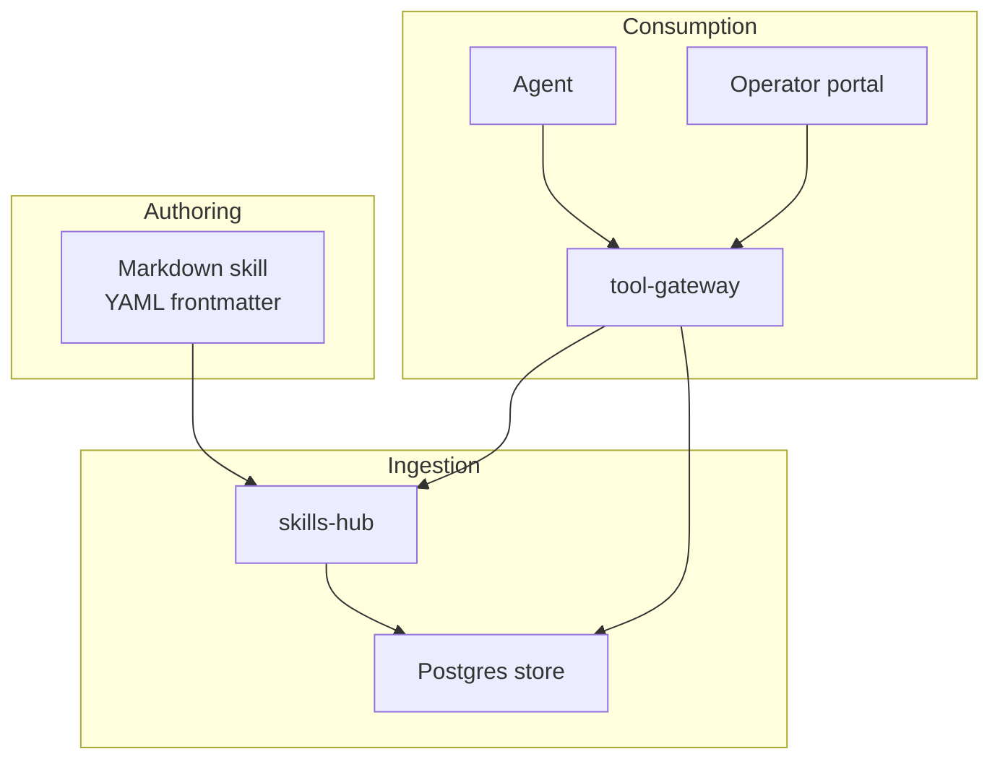
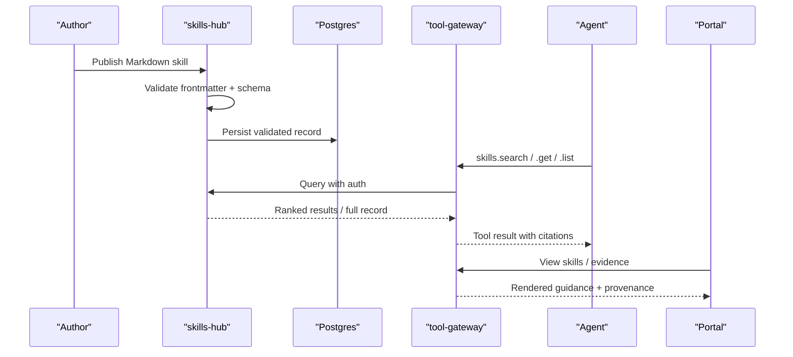
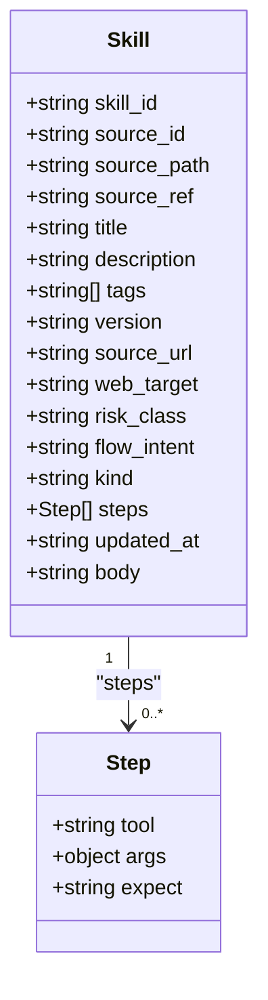
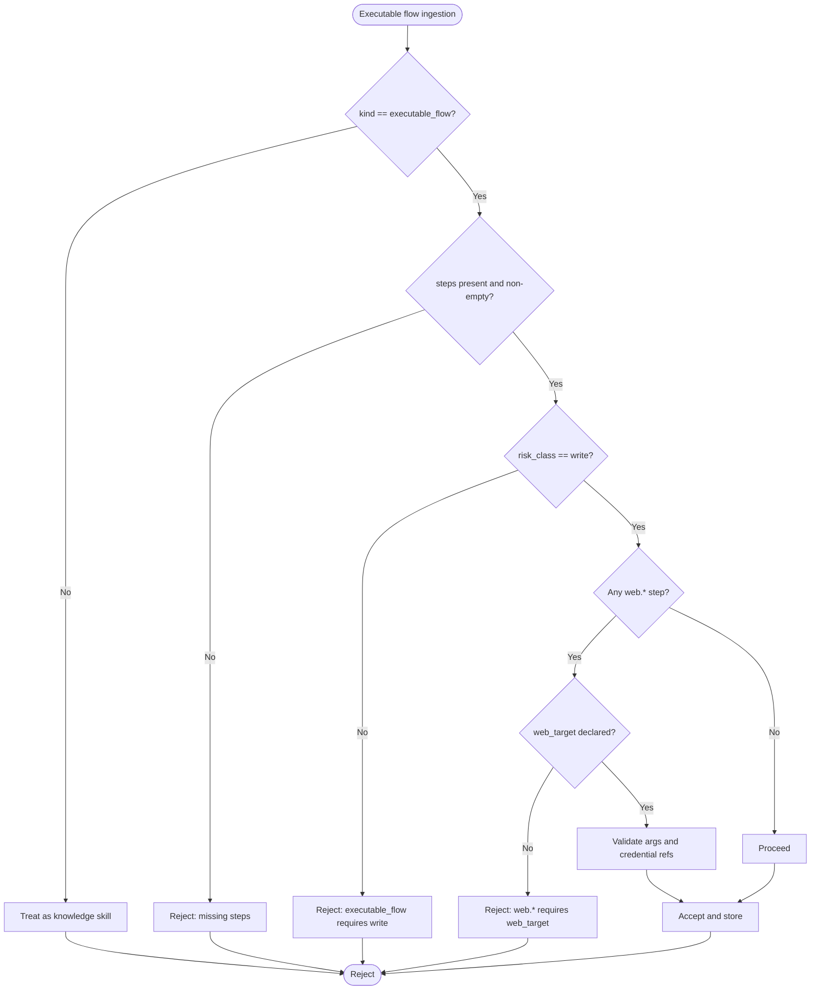
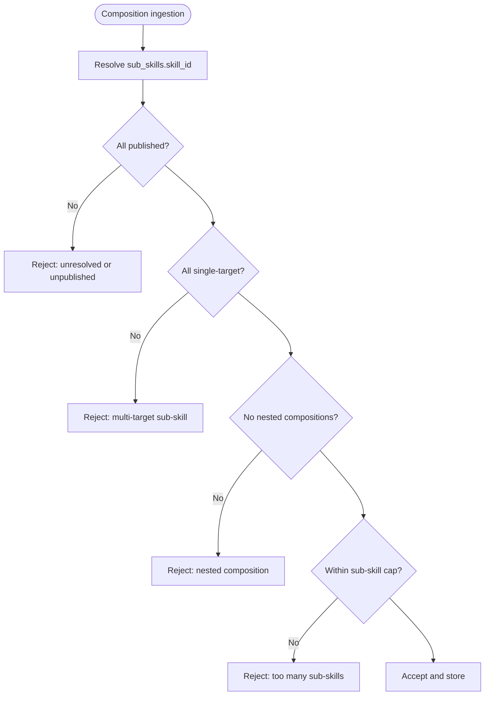
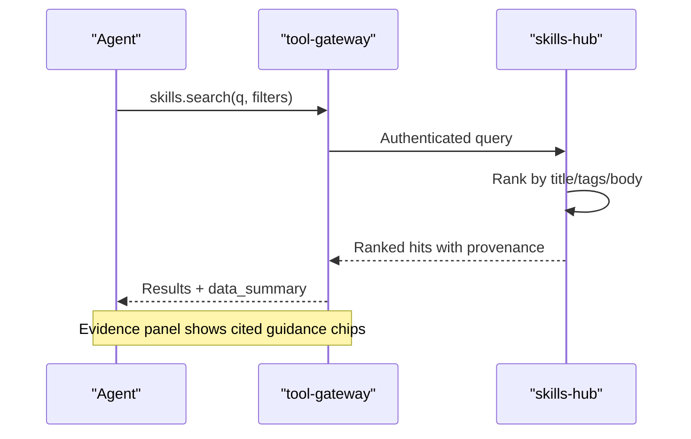
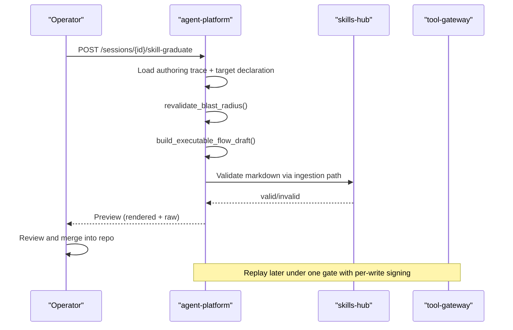
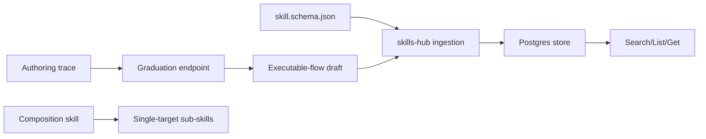

# Skill Format Specification

<cite>
**Referenced Files in This Document**
- [skill-format.md](file://shared/shared-contracts/skill-format.md)
- [skill.schema.json](file://shared/shared-contracts/schemas/skill.schema.json)
- [SPEC-014-skills-and-grounded-guidance/spec.md](file://docs/specs/SPEC-014-skills-and-grounded-guidance/spec.md)
- [SPEC-055-develop-as-you-go-skill-graduation/spec.md](file://docs/specs/SPEC-055-develop-as-you-go-skill-graduation/spec.md)
- [SPEC-057-skill-composition-runbooks/spec.md](file://docs/specs/SPEC-057-skill-composition-runbooks/spec.md)
- [skills-guide.md](file://docs/guides/skills-guide.md)
- [ResetUserPassword.md](file://samples/web-checks/password-reset/skill/ResetUserPassword.md)
- [ResetPasswordAdHoc.md](file://samples/web-checks/adhoc-password-reset/skill/ResetPasswordAdHoc.md)
- [routes.py](file://products/agent-platform/src/agent_service/api/v2/routes.py)
- [SkillDraftPreview.tsx](file://products/operator-portal/web-ui/app/src/chat/SkillDraftPreview.tsx)
- [test_scoring.py](file://products/skills-hub/tests/test_scoring.py)
- [test_skill_store.py](file://products/skills-hub/tests/test_skill_store.py)
</cite>

## Table of Contents
1. [Introduction](#introduction)
2. [Project Structure](#project-structure)
3. [Core Components](#core-components)
4. [Architecture Overview](#architecture-overview)
5. [Detailed Component Analysis](#detailed-component-analysis)
6. [Dependency Analysis](#dependency-analysis)
7. [Performance Considerations](#performance-considerations)
8. [Troubleshooting Guide](#troubleshooting-guide)
9. [Conclusion](#conclusion)
10. [Appendices](#appendices)

## Introduction
This document specifies the skill format used to author and package operational guidance for the platform. A skill is a Markdown document with YAML frontmatter that describes knowledge, executable browser or infrastructure flows, or compositions of single-target skills. The specification defines:
- Frontmatter metadata and validation rules
- Step definitions and tool references for executable flows
- Parameter specifications and credential handling
- Evidence collection points and expectations
- Composition patterns for multi-step workflows
- Variable substitution and conditional logic as authoring guidance (not runtime control flow)
- Validation, grading criteria, and graduation from draft to production
- Best practices for authoring, testing, and maintenance

The skill format is consumed by the skills-hub service, surfaced through the agent via read-only tools, and can be graduated into replayable executable flows under strict safety gates.

**Section sources**
- [skill-format.md:1-54](file://shared/shared-contracts/skill-format.md#L1-L54)
- [SPEC-014-skills-and-grounded-guidance/spec.md:43-180](file://docs/specs/SPEC-014-skills-and-grounded-guidance/spec.md#L43-L180)

## Project Structure
Skills are authored as Markdown files with YAML frontmatter and ingested by skills-hub from federated sources (Git repositories or local directories). The ingestion pipeline validates documents against the shared schema, stores them, and serves search/list/get endpoints. The agent accesses skills through tool-gateway’s read-only tools, inheriting policy, audit, redaction, and evidence-panel behavior. Graduation transforms approved troubleshooting sessions into executable-flow skills that replay under one gate.

**Diagram sources**
- [SPEC-014-skills-and-grounded-guidance/spec.md:69-180](file://docs/specs/SPEC-014-skills-and-grounded-guidance/spec.md#L69-L180)
- [skills-guide.md:12-35](file://docs/guides/skills-guide.md#L12-L35)

**Section sources**
- [SPEC-014-skills-and-grounded-guidance/spec.md:69-180](file://docs/specs/SPEC-014-skills-and-grounded-guidance/spec.md#L69-L180)
- [skills-guide.md:12-35](file://docs/guides/skills-guide.md#L12-L35)

## Core Components
- Skill envelope: defined by the shared JSON schema; includes identifiers, provenance, title, description, tags, version, optional web_target/risk_class/flow_intent/kind/steps, updated_at, and body where applicable.
- Frontmatter contract: required keys (title, description), optional keys (tags, version, source_url, web_target, risk_class, flow_intent, kind, steps), size caps, identity rules, and validation pre-flight.
- Executable flows: machine-readable step lists for replay, with tool names, arguments, and optional expectations; credentials referenced by set and field, never literals.
- Compositions: ordered lists of single-target sub-skills with notes; no authority of their own; each sub-skill keeps its own gate.
- Retrieval and grounding: deterministic keyword ranking across title/tags/body; citations include provenance; empty-match behavior returns success with no matches.
- Graduation: blast-radius re-validation, deterministic draft generation from an approved authoring trace, human merge, and replay under one gate with per-write signing.

**Section sources**
- [skill.schema.json:1-125](file://shared/shared-contracts/schemas/skill.schema.json#L1-L125)
- [skill-format.md:31-160](file://shared/shared-contracts/skill-format.md#L31-L160)
- [SPEC-057-skill-composition-runbooks/spec.md:86-152](file://docs/specs/SPEC-057-skill-composition-runbooks/spec.md#L86-L152)
- [SPEC-014-skills-and-grounded-guidance/spec.md:108-180](file://docs/specs/SPEC-014-skills-and-grounded-guidance/spec.md#L108-L180)
- [SPEC-055-develop-as-you-go-skill-graduation/spec.md:157-249](file://docs/specs/SPEC-055-develop-as-you-go-skill-graduation/spec.md#L157-L249)

## Architecture Overview
The skill lifecycle spans authoring, ingestion, retrieval, execution, and graduation.

**Diagram sources**
- [SPEC-014-skills-and-grounded-guidance/spec.md:108-180](file://docs/specs/SPEC-014-skills-and-grounded-guidance/spec.md#L108-L180)
- [skills-guide.md:12-35](file://docs/guides/skills-guide.md#L12-L35)

## Detailed Component Analysis

### Skill Envelope and Frontmatter
- Required fields: skill_id, source_id, source_path, source_ref, title, description, updated_at.
- Optional fields: tags, version, source_url, web_target, risk_class, flow_intent, kind, steps, body.
- Identity: skill_id = <source_id>/<slug>, slug derived from file path segments normalized to lowercase alphanumeric and hyphens; moving files changes skill_id intentionally.
- Size caps: body ≤ 64 KiB; description ≤ 500 chars; ≤ 10 tags; steps list bounded at ingestion and replay.
- Unknown keys rejected; additionalProperties false on schema.

**Diagram sources**
- [skill.schema.json:16-121](file://shared/shared-contracts/schemas/skill.schema.json#L16-L121)

**Section sources**
- [skill.schema.json:16-121](file://shared/shared-contracts/schemas/skill.schema.json#L16-L121)
- [skill-format.md:31-175](file://shared/shared-contracts/skill-format.md#L31-L175)

### Executable Flow Skills
- Declared by kind: executable_flow with a non-empty steps list and risk_class: write.
- Steps define canonical tool names, JSON-compatible arguments, and optional expectations.
- Credentials must be references (credential_set + field); literal secrets are rejected.
- Browser flows require web_target; non-browser mutating flows do not.
- Blast-radius re-validation during graduation enforces origin allowlists, declared risk_class, step budget, and credential resolution.

**Diagram sources**
- [skill-format.md:55-141](file://shared/shared-contracts/skill-format.md#L55-L141)
- [skill.schema.json:80-111](file://shared/shared-contracts/schemas/skill.schema.json#L80-L111)

**Section sources**
- [skill-format.md:55-141](file://shared/shared-contracts/skill-format.md#L55-L141)
- [SPEC-055-develop-as-you-go-skill-graduation/spec.md:157-249](file://docs/specs/SPEC-055-develop-as-you-go-skill-graduation/spec.md#L157-L249)

### Compositions (Multi-step Workflows)
- A composition is a third skill kind: an ordered list of sub-skills with notes.
- No authority of its own; each sub-skill retains its own gate.
- Ingestion validates that referenced skills exist, are published, and are single-target; no nesting in Phase 1.
- Delivery to the agent is grounded guidance; order is guidance, not enforced control flow.

**Diagram sources**
- [SPEC-057-skill-composition-runbooks/spec.md:86-152](file://docs/specs/SPEC-057-skill-composition-runbooks/spec.md#L86-L152)

**Section sources**
- [SPEC-057-skill-composition-runbooks/spec.md:86-152](file://docs/specs/SPEC-057-skill-composition-runbooks/spec.md#L86-L152)

### Retrieval and Grounded Guidance
- Deterministic keyword matching across title, tags, body with fixed weighting (title > tags > body).
- Ties broken by skill_id ascending; results bounded with excerpts.
- Empty match returns success with no matches; agent reports honestly when no guidance matched.
- Provenance included in results for citations.

**Diagram sources**
- [SPEC-014-skills-and-grounded-guidance/spec.md:108-180](file://docs/specs/SPEC-014-skills-and-grounded-guidance/spec.md#L108-L180)
- [test_scoring.py:1-40](file://products/skills-hub/tests/test_scoring.py#L1-L40)

**Section sources**
- [SPEC-014-skills-and-grounded-guidance/spec.md:108-180](file://docs/specs/SPEC-014-skills-and-grounded-guidance/spec.md#L108-L180)
- [test_scoring.py:1-40](file://products/skills-hub/tests/test_scoring.py#L1-L40)

### Graduation Workflow (Draft to Production)
- Capture: durable authoring-trace store records approved mutations with secret-safe parameterization.
- Re-validation: blast-radius checks (step count, origins, declared risk_class, credential references).
- Draft generation: deterministic build_executable_flow_draft from trace; validated via skills-hub ingestion path.
- Human review: preview rendered + raw; download for merge into team repo.
- Replay: graduated flow replays under one gate with per-write signing and gateway deviation guard.

**Diagram sources**
- [routes.py:1368-1401](file://products/agent-platform/src/agent_service/api/v2/routes.py#L1368-L1401)
- [SPEC-055-develop-as-you-go-skill-graduation/spec.md:181-249](file://docs/specs/SPEC-055-develop-as-you-go-skill-graduation/spec.md#L181-L249)

**Section sources**
- [routes.py:1368-1401](file://products/agent-platform/src/agent_service/api/v2/routes.py#L1368-L1401)
- [SPEC-055-develop-as-you-go-skill-graduation/spec.md:181-249](file://docs/specs/SPEC-055-develop-as-you-go-skill-graduation/spec.md#L181-L249)

### Examples of Well-formed Skills
- Password reset flow (write-class browser skill): demonstrates web_target, risk_class: write, flow_intent, single HITL gate on destructive mutation, credential-set references, and evidence capture.
- Ad-hoc password reset (per-action approval): demonstrates unbound writes parking per-action cards, change-request projections, and reference-only credential entry.

Use these samples to model your own skills for incident response, system maintenance, and troubleshooting procedures.

**Section sources**
- [ResetUserPassword.md:1-190](file://samples/web-checks/password-reset/skill/ResetUserPassword.md#L1-L190)
- [ResetPasswordAdHoc.md:1-220](file://samples/web-checks/adhoc-password-reset/skill/ResetPasswordAdHoc.md#L1-L220)

## Dependency Analysis
- Schema lockstep: skill.schema.json mirrors skills-hub schemas and ingestion validation; any drift breaks ingestion.
- Retrieval depends on deterministic scoring and provenance fields.
- Graduation depends on authoring-trace capture at approval seams and blast-radius re-validation.
- Compositions depend on published single-target sub-skills; no new enforcement machinery beyond existing flow context guards.

**Diagram sources**
- [skill.schema.json:1-125](file://shared/shared-contracts/schemas/skill.schema.json#L1-L125)
- [SPEC-055-develop-as-you-go-skill-graduation/spec.md:111-249](file://docs/specs/SPEC-055-develop-as-you-go-skill-graduation/spec.md#L111-L249)
- [SPEC-057-skill-composition-runbooks/spec.md:86-152](file://docs/specs/SPEC-057-skill-composition-runbooks/spec.md#L86-L152)

**Section sources**
- [test_skill_store.py:368-407](file://products/skills-hub/tests/test_skill_store.py#L368-L407)
- [SPEC-055-develop-as-you-go-skill-graduation/spec.md:111-249](file://docs/specs/SPEC-055-develop-as-you-go-skill-graduation/spec.md#L111-L249)

## Performance Considerations
- Step budgets: replay bounded by GATEWAY_BROWSER_FLOW_MAX_STEPS; graduation twin AGENT_SKILL_GRADUATION_MAX_STEPS ensures alignment.
- Size caps: body ≤ 64 KiB; steps list serialized ≤ 64 KiB; description ≤ 500 chars; tags ≤ 10.
- Scoring: deterministic keyword ranking avoids ML overhead; ties broken by skill_id.
- Storage: steps stored as JSONB; backends must agree on NULL vs None mapping.

[No sources needed since this section provides general guidance]

## Troubleshooting Guide
- New/revised skill not visible: sync interval not yet elapsed or ConfigMap wiring missed; restart deployment or wait for next sync.
- Source reports rejections: inspect status endpoint for per-document reasons; fix frontmatter/schema violations.
- Git source errors: unreachable URL, expired token, or missing subpath; previous slice continues serving until resolved.
- Search returns no matches: verify skills.list/catalog; check status for accepted counts.
- Agent claims no skills exist: ensure skills connector configured (GATEWAY_SKILLS_SERVICE_URL) and query-secret matches.
- Graduation fails: blast-radius refusal enumerates guard failures; correct origins, risk_class, step budget, or credential references.

**Section sources**
- [skills-guide.md:338-373](file://docs/guides/skills-guide.md#L338-L373)
- [SPEC-055-develop-as-you-go-skill-graduation/spec.md:181-249](file://docs/specs/SPEC-055-develop-as-you-go-skill-graduation/spec.md#L181-L249)

## Conclusion
The skill format standardizes how operational guidance is authored, validated, retrieved, and, when appropriate, graduated into replayable executable flows. It balances flexibility (knowledge, executable flows, compositions) with strong safety (schema validation, credential references, blast-radius re-validation, one-gate replay). Teams should use the provided examples as templates, validate locally before publishing, and follow best practices for clarity, security, and maintainability.

[No sources needed since this section summarizes without analyzing specific files]

## Appendices

### Authoring Best Practices
- Keep titles concise and descriptions informative; tag with domain-specific keywords.
- For executable flows, declare exactly one write-tier interaction and park the HITL gate on the destructive mutation.
- Use credential-set references; never embed secrets in skills.
- Split long guides; respect size caps.
- Prefer stable file paths to preserve skill_id and citation continuity.

**Section sources**
- [skill-format.md:31-175](file://shared/shared-contracts/skill-format.md#L31-L175)
- [ResetUserPassword.md:21-190](file://samples/web-checks/password-reset/skill/ResetUserPassword.md#L21-L190)
- [ResetPasswordAdHoc.md:24-220](file://samples/web-checks/adhoc-password-reset/skill/ResetPasswordAdHoc.md#L24-L220)

### Testing Approaches
- Validate locally using the same code path as the service; exit code 0 indicates safe to publish.
- Use e2e smoke tests after content changes; assert deterministic outcomes.
- Rely on unit tests for scoring determinism and storage mapping.

**Section sources**
- [skills-guide.md:85-108](file://docs/guides/skills-guide.md#L85-L108)
- [skills-guide.md:332-336](file://docs/guides/skills-guide.md#L332-L336)
- [test_scoring.py:1-40](file://products/skills-hub/tests/test_scoring.py#L1-L40)
- [test_skill_store.py:368-407](file://products/skills-hub/tests/test_skill_store.py#L368-L407)

### Maintenance Strategies
- Keep source_url and NOTICE files for adapted open-source content.
- Monitor metrics: syncs_total, ingest_rejected_total, store_skills, searches_total.
- Audit trail: skill drafts and graduations recorded; track approvals and outcomes.

**Section sources**
- [skill-format.md:188-203](file://shared/shared-contracts/skill-format.md#L188-L203)
- [skills-guide.md:350-373](file://docs/guides/skills-guide.md#L350-L373)