# Agent Runtime Integration

<cite>
**Referenced Files in This Document**
- [skills_hub_client.py](file://products/platform-gateway/src/platform_gateway/services/skills_hub_client.py)
- [skills_connector.py](file://products/tool-gateway/src/tool_gateway/tools/skills_connector.py)
- [runtime_kernel.py](file://products/agent-platform/src/agent_service/runtime_kernel.py)
- [evidence_store.py](file://products/agent-platform/src/agent_service/services/evidence_store.py)
- [execution_records.py](file://products/agent-platform/src/agent_service/services/execution_records.py)
- [handoff.py](file://products/execution-runtime/src/execution_runtime/api/routes/handoff.py)
- [scoring.py](file://products/skills-hub/src/skills_hub/services/scoring.py)
- [skill_store.py](file://products/skills-hub/src/skills_hub/services/skill_store.py)
- [sessions.py](file://products/platform-gateway/src/platform_gateway/api/routes/sessions.py)
- [test_scoring.py](file://products/skills-hub/tests/test_scoring.py)
- [SPEC-014 spec.md](file://docs/specs/SPEC-014-skills-and-grounded-guidance/spec.md)
- [SPEC-025 plan.md](file://docs/specs/SPEC-025-evidence-persistence-in-transcripts/plan.md)
- [SPEC-025 spec.md](file://docs/specs/SPEC-025-evidence-persistence-in-transcripts/spec.md)
</cite>

## Table of Contents
1. Introduction
2. Project Structure
3. Core Components
4. Architecture Overview
5. Detailed Component Analysis
6. Dependency Analysis
7. Performance Considerations
8. Troubleshooting Guide
9. Conclusion

## Introduction
This document explains how agents consume skills during runtime execution. It covers the skills client that retrieves and caches skills from the Skills Hub, skill resolution when multiple matches are found, the execution context passed to skill procedures, invocation within agent sessions, authorization and execution of tool calls through the Tool Gateway, evidence capture and storage, grounding mechanisms (session state, permissions, available tools), error handling and retry patterns, audit logging, invocation examples, debugging techniques, and performance optimization strategies for high-frequency skill usage.

## Project Structure
The runtime integration spans several services:
- Platform Gateway exposes a read-only proxy to the Skills Hub for portal discovery and detail retrieval.
- Tool Gateway exposes skills tools (search, list, get) used by agents during execution.
- Agent Platform’s runtime kernel orchestrates session flow, approvals, signed execution requests, authoring traces, and evidence persistence.
- Execution Runtime executes approved tool invocations and closes execution records with receipts.
- Skills Hub stores and ranks skills and provides search/list/get APIs.

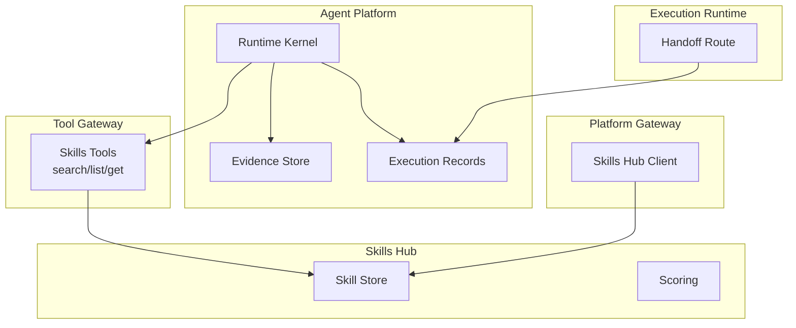

**Diagram sources**
- [skills_connector.py:71-88](file://products/tool-gateway/src/tool_gateway/tools/skills_connector.py#L71-L88)
- [skills_hub_client.py:71-129](file://products/platform-gateway/src/platform_gateway/services/skills_hub_client.py#L71-L129)
- [runtime_kernel.py:1393-1487](file://products/agent-platform/src/agent_service/runtime_kernel.py#L1393-L1487)
- [evidence_store.py:118-164](file://products/agent-platform/src/agent_service/services/evidence_store.py#L118-L164)
- [execution_records.py:355-400](file://products/agent-platform/src/agent_service/services/execution_records.py#L355-L400)
- [handoff.py:203-234](file://products/execution-runtime/src/execution_runtime/api/routes/handoff.py#L203-L234)
- [skill_store.py:189-234](file://products/skills-hub/src/skills_hub/services/skill_store.py#L189-L234)
- [scoring.py:33-56](file://products/skills-hub/src/skills_hub/services/scoring.py#L33-L56)

**Section sources**
- [skills_hub_client.py:1-130](file://products/platform-gateway/src/platform_gateway/services/skills_hub_client.py#L1-L130)
- [skills_connector.py:1-149](file://products/tool-gateway/src/tool_gateway/tools/skills_connector.py#L1-L149)
- [runtime_kernel.py:1300-1550](file://products/agent-platform/src/agent_service/runtime_kernel.py#L1300-L1550)
- [evidence_store.py:1-551](file://products/agent-platform/src/agent_service/services/evidence_store.py#L1-L551)
- [execution_records.py:1-494](file://products/agent-platform/src/agent_service/services/execution_records.py#L1-L494)
- [handoff.py:203-234](file://products/execution-runtime/src/execution_runtime/api/routes/handoff.py#L203-L234)
- [skill_store.py:189-234](file://products/skills-hub/src/skills_hub/services/skill_store.py#L189-L234)
- [scoring.py:33-56](file://products/skills-hub/src/skills_hub/services/scoring.py#L33-L56)

## Core Components
- Skills Hub Client (Platform Gateway): Read-only proxy to Skills Hub for listing and fetching skill details. Validates skill identifiers before forwarding to upstream and maps transport errors to HTTP status codes.
- Skills Connector (Tool Gateway): Exposes skills.search, skills.list, and skills.get as tools. Validates parameters, enforces limits, projects stable match fields, and attaches standard evidence envelopes.
- Runtime Kernel (Agent Platform): Orchestrates confirmation parking, signed execution request preparation, authoring trace capture, and evidence persistence. Emits execution events and persists execution requests.
- Evidence Store (Agent Platform): Persists tool_call and tool_result frames per session with per-entry and per-session size caps; supports memory and Postgres backends.
- Execution Records (Agent Platform): Persists lifecycle of signed execution requests (requested, succeeded/failed/timeout/rejected) with retention sweeps.
- Execution Runtime Handoff: Executes approved tool calls, builds receipts, and closes execution records.
- Skills Hub Scoring and Storage: Deterministic relevance scoring and indexed storage for skills search.

**Section sources**
- [skills_hub_client.py:71-129](file://products/platform-gateway/src/platform_gateway/services/skills_hub_client.py#L71-L129)
- [skills_connector.py:154-419](file://products/tool-gateway/src/tool_gateway/tools/skills_connector.py#L154-L419)
- [runtime_kernel.py:1393-1550](file://products/agent-platform/src/agent_service/runtime_kernel.py#L1393-L1550)
- [evidence_store.py:118-164](file://products/agent-platform/src/agent_service/services/evidence_store.py#L118-L164)
- [execution_records.py:355-400](file://products/agent-platform/src/agent_service/services/execution_records.py#L355-L400)
- [handoff.py:203-234](file://products/execution-runtime/src/execution_runtime/api/routes/handoff.py#L203-L234)
- [scoring.py:33-56](file://products/skills-hub/src/skills_hub/services/scoring.py#L33-L56)
- [skill_store.py:189-234](file://products/skills-hub/src/skills_hub/services/skill_store.py#L189-L234)

## Architecture Overview
The runtime path for skill consumption:
- Agents call skills tools via the Tool Gateway.
- The Tool Gateway authenticates to Skills Hub using gateway-held credentials and returns structured results with evidence.
- For mutating actions, the Agent Platform parks confirmations, prepares signed execution requests, and emits audit events.
- Approved executions run in the Execution Runtime, which closes execution records with receipts.
- Evidence frames are persisted per session with size budgets enforced.

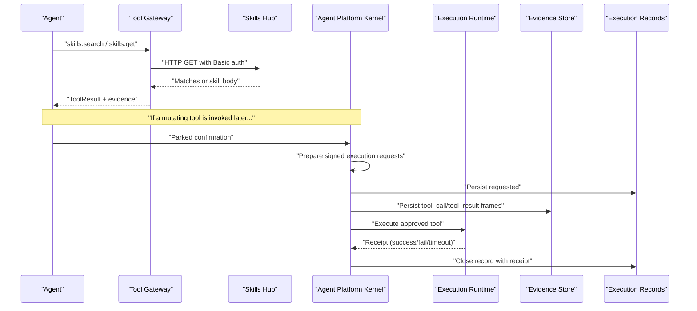

**Diagram sources**
- [skills_connector.py:198-245](file://products/tool-gateway/src/tool_gateway/tools/skills_connector.py#L198-L245)
- [skills_connector.py:271-309](file://products/tool-gateway/src/tool_gateway/tools/skills_connector.py#L271-L309)
- [runtime_kernel.py:1393-1487](file://products/agent-platform/src/agent_service/runtime_kernel.py#L1393-L1487)
- [execution_records.py:355-400](file://products/agent-platform/src/agent_service/services/execution_records.py#L355-L400)
- [evidence_store.py:118-164](file://products/agent-platform/src/agent_service/services/evidence_store.py#L118-L164)
- [handoff.py:203-234](file://products/execution-runtime/src/execution_runtime/api/routes/handoff.py#L203-L234)

## Detailed Component Analysis

### Skills Hub Client (Platform Gateway)
- Purpose: Provides read-only access to Skills Hub for portal operations. Authenticates with gateway-held credentials and forwards x-request-id for correlation.
- Validation: Enforces a strict pattern for skill_id segments before constructing upstream URLs to prevent injection.
- Error mapping: Returns 503 when not configured, 502 on transport failures or upstream server errors, and passes 4xx upstream messages through.

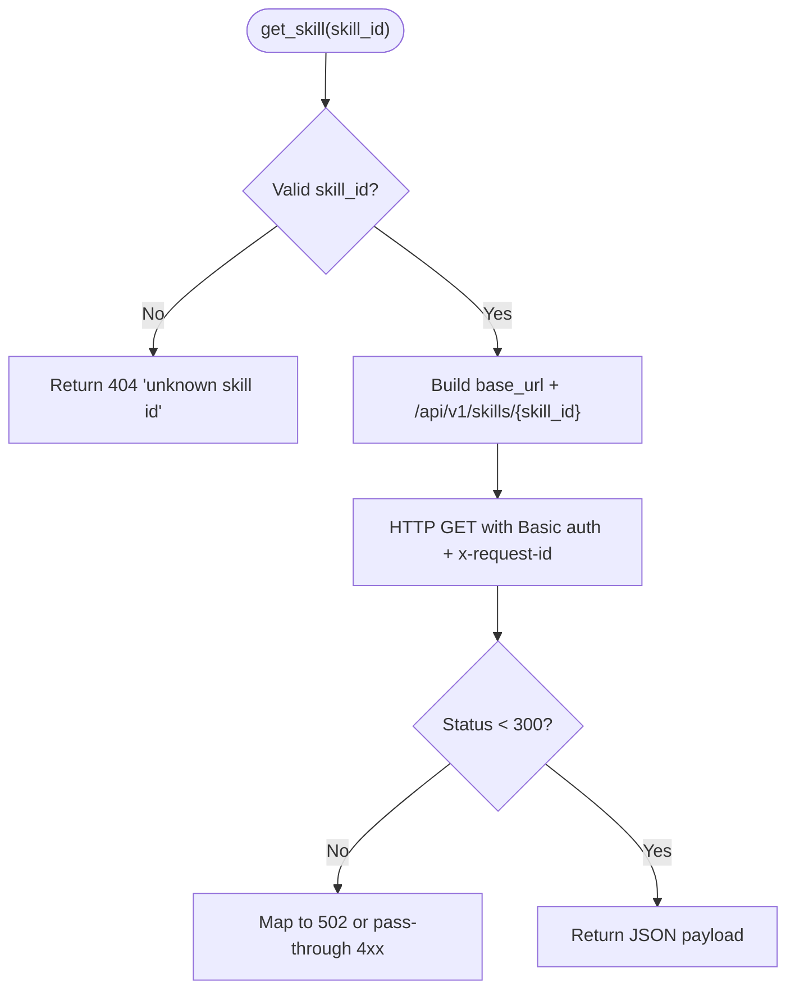

**Diagram sources**
- [skills_hub_client.py:94-129](file://products/platform-gateway/src/platform_gateway/services/skills_hub_client.py#L94-L129)

**Section sources**
- [skills_hub_client.py:1-130](file://products/platform-gateway/src/platform_gateway/services/skills_hub_client.py#L1-L130)

### Skills Tools (Tool Gateway)
- Tools exposed:
  - skills.search: Free-text query with optional source/tag filters and limit clamping. Projects a stable set of match keys.
  - skills.get: Fetches full skill body by namespaced skill_id with validation.
  - skills.list: Lists summaries with pagination and filtering.
- All tools attach standard evidence envelopes and map upstream errors to structured results.

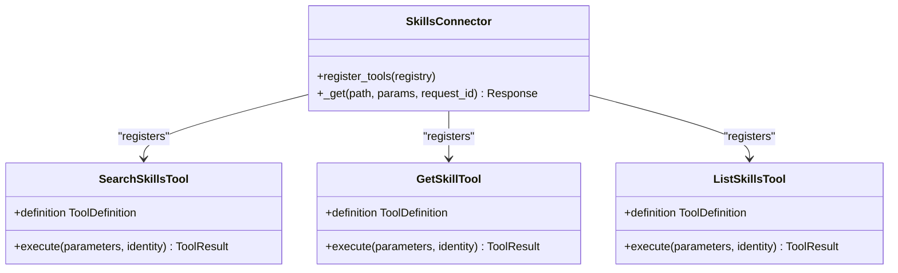

**Diagram sources**
- [skills_connector.py:71-88](file://products/tool-gateway/src/tool_gateway/tools/skills_connector.py#L71-L88)
- [skills_connector.py:154-245](file://products/tool-gateway/src/tool_gateway/tools/skills_connector.py#L154-L245)
- [skills_connector.py:248-309](file://products/tool-gateway/src/tool_gateway/tools/skills_connector.py#L248-L309)
- [skills_connector.py:312-419](file://products/tool-gateway/src/tool_gateway/tools/skills_connector.py#L312-L419)

**Section sources**
- [skills_connector.py:154-419](file://products/tool-gateway/src/tool_gateway/tools/skills_connector.py#L154-L419)

### Skill Resolution Strategy (Multiple Matches)
- Deterministic scoring weights title matches highest, then tags, then body occurrences capped to avoid saturation.
- Ties are broken deterministically by skill_id ascending to ensure stable ordering across runs.
- Tests assert specific weight behaviors for title and tag matches.

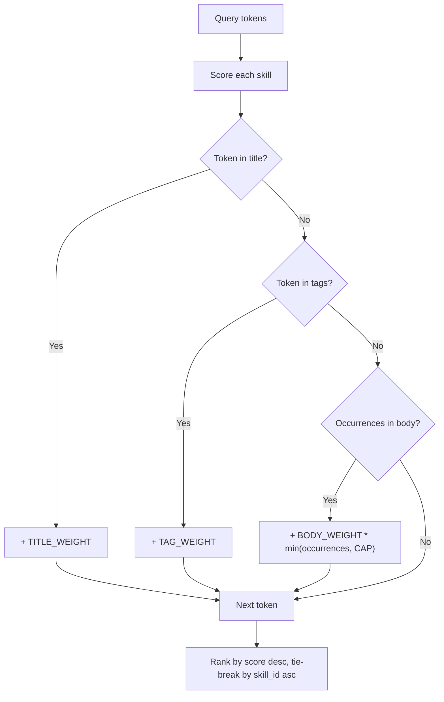

**Diagram sources**
- [scoring.py:33-56](file://products/skills-hub/src/skills_hub/services/scoring.py#L33-L56)
- [test_scoring.py:33-40](file://products/skills-hub/tests/test_scoring.py#L33-L40)

**Section sources**
- [scoring.py:33-56](file://products/skills-hub/src/skills_hub/services/scoring.py#L33-L56)
- [test_scoring.py:1-40](file://products/skills-hub/tests/test_scoring.py#L1-L40)

### Execution Context Passed to Skill Procedures
- The runtime kernel parks confirmations with pending tool calls and metadata such as confirm_id, tool_names, and approval_kind.
- When resuming, it prepares signed execution requests carrying session_id, tool_name, arguments digest, decider/owner user ids, and timestamps.
- Authoring trace steps are appended only for mutating calls that were authorized and signed, parameterized to avoid leaking credentials into traces.

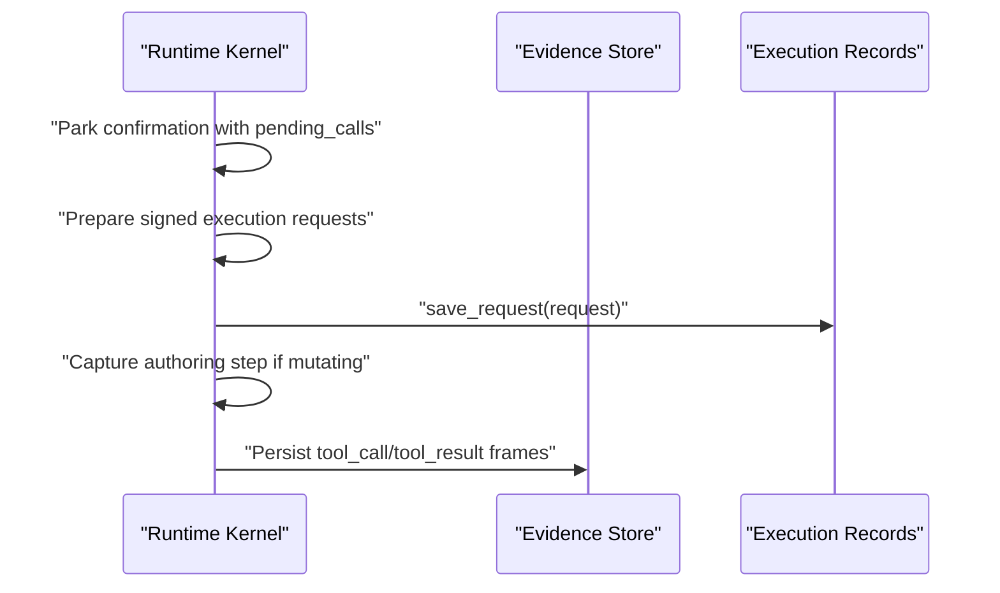

**Diagram sources**
- [runtime_kernel.py:1300-1336](file://products/agent-platform/src/agent_service/runtime_kernel.py#L1300-L1336)
- [runtime_kernel.py:1393-1487](file://products/agent-platform/src/agent_service/runtime_kernel.py#L1393-L1487)
- [runtime_kernel.py:1504-1550](file://products/agent-platform/src/agent_service/runtime_kernel.py#L1504-L1550)

**Section sources**
- [runtime_kernel.py:1300-1550](file://products/agent-platform/src/agent_service/runtime_kernel.py#L1300-L1550)

### Invocation Within Agent Sessions and Grounding
- The agent’s default system prompt is extended with a discipline to consult skills.search when questions involve procedure, interpretation, or remediation, and to cite skills used.
- Grounding includes session-scoped flow context (skill_id, origin, title, risk_class), approvals, and available tools surfaced through the Tool Gateway.
- Portal routes log skill graduation events and enforce policy for graduate actions.

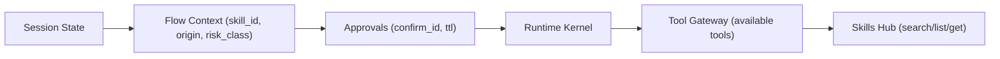

**Diagram sources**
- [SPEC-014 spec.md:166-180](file://docs/specs/SPEC-014-skills-and-grounded-guidance/spec.md#L166-L180)
- [sessions.py:267-299](file://products/platform-gateway/src/platform_gateway/api/routes/sessions.py#L267-L299)

**Section sources**
- [SPEC-014 spec.md:166-180](file://docs/specs/SPEC-014-skills-and-grounded-guidance/spec.md#L166-L180)
- [sessions.py:267-299](file://products/platform-gateway/src/platform_gateway/api/routes/sessions.py#L267-L299)

### Tool Authorization and Execution Through Tool Gateway
- Skills tools are registered conditionally when the gateway service URL is configured.
- Each tool validates inputs, enforces limits, and forwards authenticated requests to Skills Hub.
- Upstream errors are mapped to structured ToolResult errors with evidence.

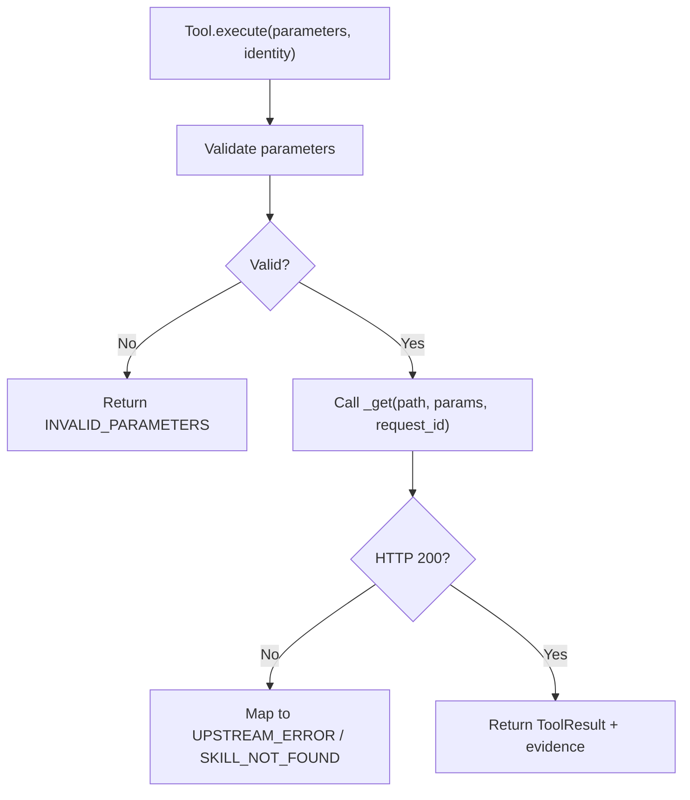

**Diagram sources**
- [skills_connector.py:198-245](file://products/tool-gateway/src/tool_gateway/tools/skills_connector.py#L198-L245)
- [skills_connector.py:271-309](file://products/tool-gateway/src/tool_gateway/tools/skills_connector.py#L271-L309)
- [skills_connector.py:359-419](file://products/tool-gateway/src/tool_gateway/tools/skills_connector.py#L359-L419)

**Section sources**
- [skills_connector.py:154-419](file://products/tool-gateway/src/tool_gateway/tools/skills_connector.py#L154-L419)

### Evidence Capture and Storage
- Evidence frames (tool_call, tool_result) are persisted per session with two levels of size enforcement:
  - Per-entry cap truncates oversized data payloads and marks them with a visible truncated marker.
  - Per-session budget evicts oldest result payloads first while preserving metadata.
- Backends: in-memory (default/dev/CI) and Postgres (deployed). Failures degrade gracefully without blocking turns.

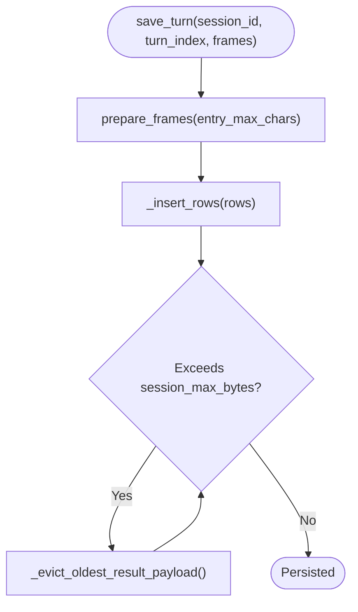

**Diagram sources**
- [evidence_store.py:46-70](file://products/agent-platform/src/agent_service/services/evidence_store.py#L46-L70)
- [evidence_store.py:118-164](file://products/agent-platform/src/agent_service/services/evidence_store.py#L118-L164)

**Section sources**
- [evidence_store.py:1-551](file://products/agent-platform/src/agent_service/services/evidence_store.py#L1-L551)
- [SPEC-025 plan.md:96-194](file://docs/specs/SPEC-025-evidence-persistence-in-transcripts/plan.md#L96-L194)
- [SPEC-025 spec.md:128-155](file://docs/specs/SPEC-025-evidence-persistence-in-transcripts/spec.md#L128-L155)

### Signed Execution Requests and Receipts
- The runtime kernel prepares signed execution requests for approved calls, persists them, emits execution_requested events, and captures authoring steps for mutations.
- Execution Runtime executes the tool, builds a receipt, and closes the execution record with status and completion timestamp.

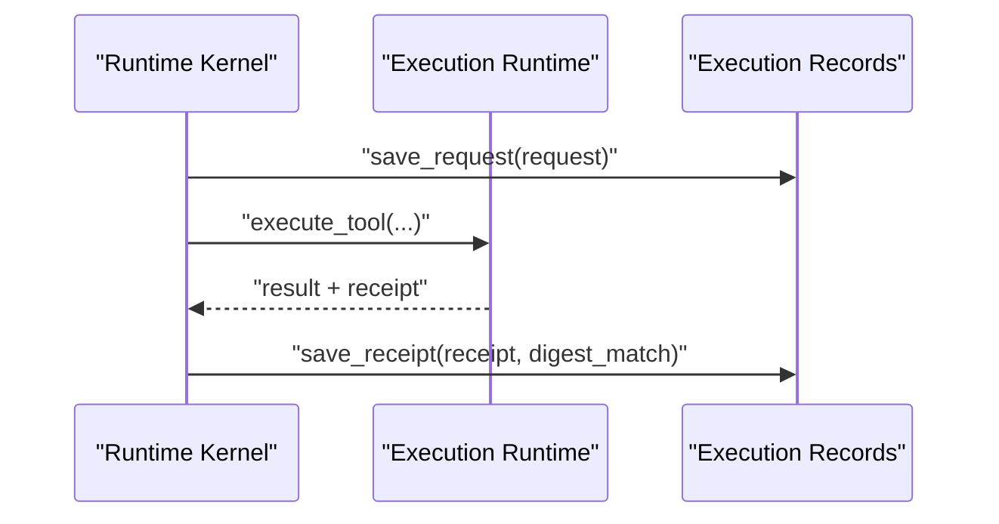

**Diagram sources**
- [runtime_kernel.py:1393-1487](file://products/agent-platform/src/agent_service/runtime_kernel.py#L1393-L1487)
- [handoff.py:203-234](file://products/execution-runtime/src/execution_runtime/api/routes/handoff.py#L203-L234)
- [execution_records.py:355-400](file://products/agent-platform/src/agent_service/services/execution_records.py#L355-L400)

**Section sources**
- [runtime_kernel.py:1393-1487](file://products/agent-platform/src/agent_service/runtime_kernel.py#L1393-L1487)
- [handoff.py:203-234](file://products/execution-runtime/src/execution_runtime/api/routes/handoff.py#L203-L234)
- [execution_records.py:355-400](file://products/agent-platform/src/agent_service/services/execution_records.py#L355-L400)

## Dependency Analysis
- Tool Gateway depends on Skills Hub for skill content; it does not forward user tokens for skill reads, using gateway-held credentials instead.
- Agent Platform depends on Tool Gateway for tool execution and on Evidence/Execution Record stores for durability.
- Platform Gateway depends on Skills Hub for portal discovery and detail views, validating skill_id shapes before forwarding.

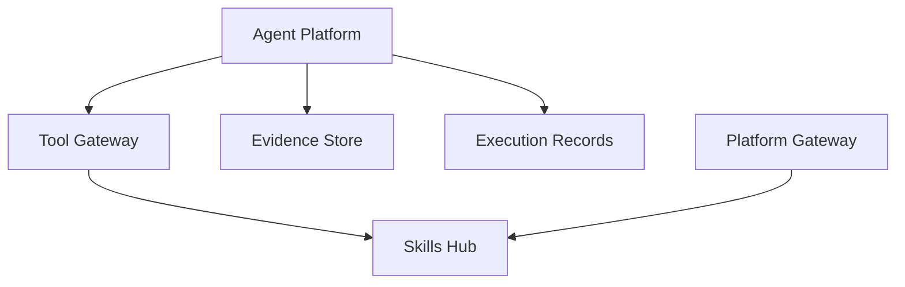

**Diagram sources**
- [skills_connector.py:71-108](file://products/tool-gateway/src/tool_gateway/tools/skills_connector.py#L71-L108)
- [skills_hub_client.py:71-129](file://products/platform-gateway/src/platform_gateway/services/skills_hub_client.py#L71-L129)
- [evidence_store.py:504-551](file://products/agent-platform/src/agent_service/services/evidence_store.py#L504-L551)
- [execution_records.py:453-494](file://products/agent-platform/src/agent_service/services/execution_records.py#L453-L494)

**Section sources**
- [skills_connector.py:71-108](file://products/tool-gateway/src/tool_gateway/tools/skills_connector.py#L71-L108)
- [skills_hub_client.py:71-129](file://products/platform-gateway/src/platform_gateway/services/skills_hub_client.py#L71-L129)
- [evidence_store.py:504-551](file://products/agent-platform/src/agent_service/services/evidence_store.py#L504-L551)
- [execution_records.py:453-494](file://products/agent-platform/src/agent_service/services/execution_records.py#L453-L494)

## Performance Considerations
- Limit and offset controls on skills.list and skills.search reduce payload sizes and upstream load.
- Deterministic scoring avoids expensive ranking and ensures stable results.
- Evidence store enforces per-entry and per-session caps to bound storage growth and maintain replay performance.
- Use small, targeted queries and filter by source/tag to minimize matches and downstream processing.

[No sources needed since this section provides general guidance]

## Troubleshooting Guide
Common issues and diagnostics:
- Skills Hub unavailable: Tool Gateway logs transport errors and returns structured errors with evidence; check connectivity and credentials.
- Unknown skill id: Platform Gateway rejects malformed skill_ids before upstream; verify namespaced format.
- Evidence truncation: Check truncated markers in persisted frames to understand whether entry or session budget was hit.
- Execution rejected: If signing key is missing, execution is rejected fail-closed; verify configuration and provisioning.

Debugging techniques:
- Correlate events using request_id propagated through Tool Gateway to Skills Hub and Audit.
- Inspect parked confirmations and approval_kind to understand why a call required human approval.
- Review execution records for requested/rejected/succeeded states and receipt details.

**Section sources**
- [skills_connector.py:219-245](file://products/tool-gateway/src/tool_gateway/tools/skills_connector.py#L219-L245)
- [skills_hub_client.py:94-129](file://products/platform-gateway/src/platform_gateway/services/skills_hub_client.py#L94-L129)
- [evidence_store.py:46-70](file://products/agent-platform/src/agent_service/services/evidence_store.py#L46-L70)
- [runtime_kernel.py:1410-1433](file://products/agent-platform/src/agent_service/runtime_kernel.py#L1410-L1433)
- [execution_records.py:355-400](file://products/agent-platform/src/agent_service/services/execution_records.py#L355-L400)

## Conclusion
Agents consume skills through a layered runtime: Tool Gateway exposes skills tools with robust validation and evidence; Platform Gateway proxies portal reads with strict input checks; Agent Platform coordinates approvals, signed execution, and durable evidence; Execution Runtime executes and closes records; Skills Hub provides deterministic search and storage. Together, these components deliver grounded, auditable, and resilient skill-driven automation with clear error handling and performance safeguards.

[No sources needed since this section summarizes without analyzing specific files]