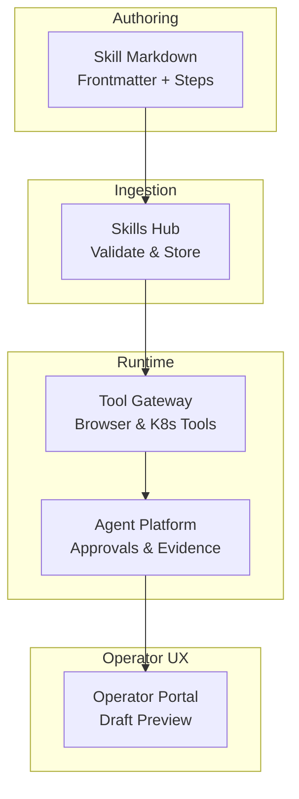
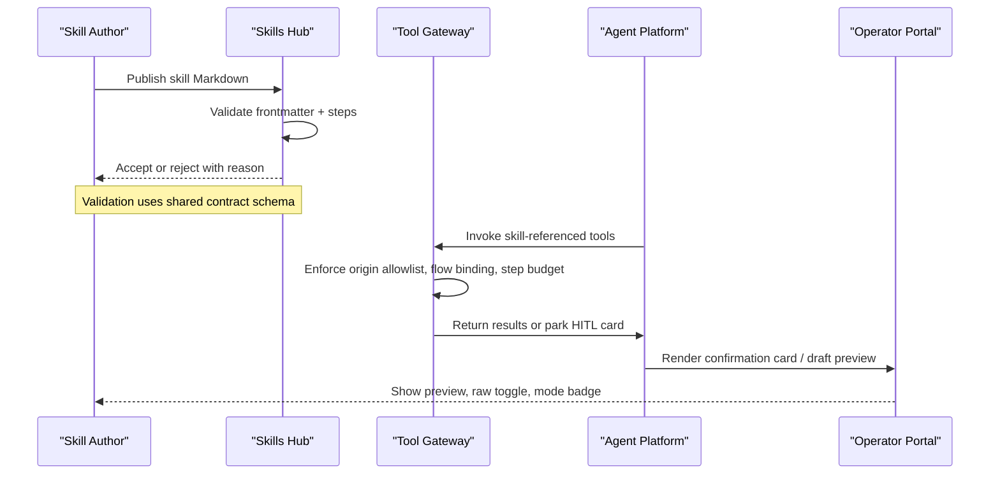
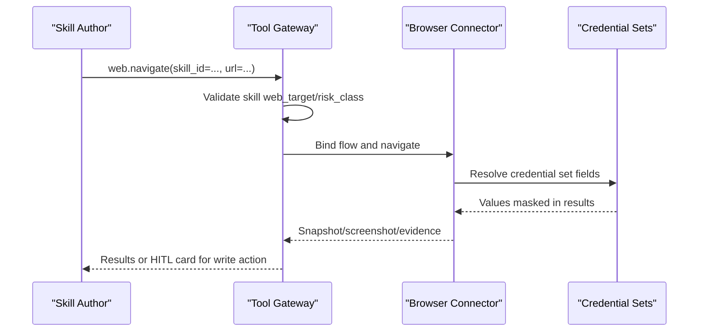
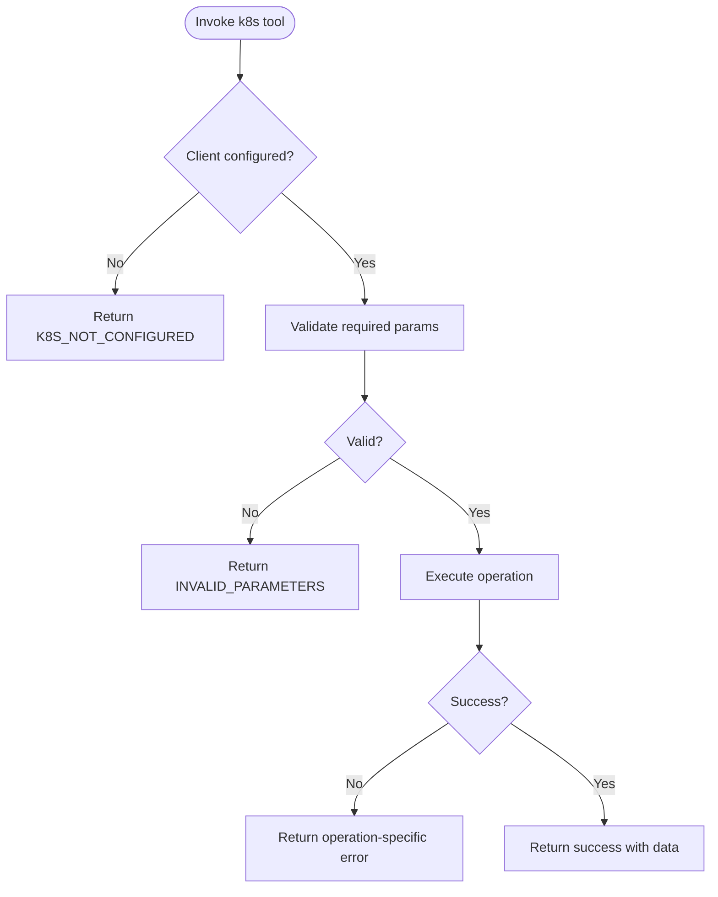

# Skill Authoring Guide

<cite>
**Referenced Files in This Document**
- [skill-format.md](file://shared/shared-contracts/skill-format.md)
- [skill.schema.json](file://shared/shared-contracts/schemas/skill.schema.json)
- [skills-guide.md](file://docs/guides/skills-guide.md)
- [browser_connector.py](file://products/tool-gateway/src/tool-gateway/tools/browser_connector.py)
- [k8s_connector.py](file://products/tool-gateway/src/tool-gateway/tools/k8s_connector.py)
- [test_k8s_connector.py](file://products/tool-gateway/tests/test_k8s_connector.py)
- [ResetUserPassword.md](file://samples/web-checks/password-reset/skill/ResetUserPassword.md)
- [ResetPasswordAdHoc.md](file://samples/web-checks/adhoc-password-reset/skill/ResetPasswordAdHoc.md)
- [KubePodNotReady.md](file://shared/platform-ops/skills/sre-alerting/alerts/KubePodNotReady.md)
- [hitl_confirmations.py](file://products/agent-platform/src/agent_service/services/hitl_confirmations.py)
- [test_hitl_confirmations.py](file://products/agent-platform/tests/test_hitl_confirmations.py)
- [SkillDraftPreview.tsx](file://products/operator-portal/web-ui/app/src/chat/SkillDraftPreview.tsx)
- [ingestion.py](file://products/skills-hub/src/skills_hub/services/ingestion.py)
- [test_contracts.py](file://products/skills-hub/tests/test_contracts.py)
</cite>

## Table of Contents
1. Introduction
2. Project Structure
3. Core Components
4. Architecture Overview
5. Detailed Component Analysis
6. Dependency Analysis
7. Performance Considerations
8. Troubleshooting Guide
9. Conclusion

## Introduction
This guide explains how to author skills for the Luban AIOPS platform using the Markdown-based skill format. It covers frontmatter metadata, executable-flow steps, parameter binding, evidence collection, and safe execution practices. It also provides examples for browser automation workflows, Kubernetes operations, and incident response procedures, along with testing approaches using the draft workspace, preview, and validation against the shared contract schema.

## Project Structure
Skills are authored as Markdown files with YAML frontmatter and ingested by the skills hub. The tool gateway exposes tools (browser and Kubernetes) that skills can reference. The agent platform orchestrates human-in-the-loop approvals and change-request projections. The operator portal renders skill drafts and graduations for review.

**Diagram sources**
- [skill-format.md:1-203](file://shared/shared-contracts/skill-format.md#L1-L203)
- [skills-guide.md:12-35](file://docs/guides/skills-guide.md#L12-L35)
- [browser_connector.py:1-61](file://products/tool-gateway/src/tool-gateway/tools/browser_connector.py#L1-L61)
- [k8s_connector.py:77-80](file://products/tool-gateway/src/tool-gateway/tools/k8s_connector.py#L77-L80)
- [SkillDraftPreview.tsx:22-38](file://products/operator-portal/web-ui/app/src/chat/SkillDraftPreview.tsx#L22-L38)

**Section sources**
- [skill-format.md:1-203](file://shared/shared-contracts/skill-format.md#L1-L203)
- [skills-guide.md:12-35](file://docs/guides/skills-guide.md#L12-L35)

## Core Components
- Skill format specification: defines frontmatter keys, constraints, and optional executable-flow steps.
- Shared contract schema: JSON Schema enforcing skill envelope fields and types.
- Skills ingestion pipeline: validates documents, enforces size caps, and stores accepted skills.
- Tool surface: browser tools (read/write tiers) and Kubernetes read/write tools used by skills.
- Approval and evidence: HITL gates, change-request projections, and evidence capture for actions.
- Draft and preview: generate skill drafts from sessions/incidents and preview them in the portal.

Key responsibilities:
- Frontmatter and steps define intent, risk class, and replayable actions.
- Browser tools enforce origin allowlists, flow binding, step budgets, and credential resolution.
- Kubernetes tools provide cluster operations with clear error handling and parameter validation.
- Agent platform surfaces approval cards and masks sensitive data in change requests.
- Operator portal shows draft/graduation previews with mode badges and raw markdown toggles.

**Section sources**
- [skill-format.md:31-147](file://shared/shared-contracts/skill-format.md#L31-L147)
- [skill.schema.json:1-125](file://shared/shared-contracts/schemas/skill.schema.json#L1-L125)
- [ingestion.py:448-482](file://products/skills-hub/src/skills_hub/services/ingestion.py#L448-L482)
- [browser_connector.py:1-61](file://products/tool-gateway/src/tool-gateway/tools/browser_connector.py#L1-L61)
- [k8s_connector.py:77-80](file://products/tool-gateway/src/tool-gateway/tools/k8s_connector.py#L77-L80)
- [hitl_confirmations.py:251-270](file://products/agent-platform/src/agent_service/services/hitl_confirmations.py#L251-L270)
- [SkillDraftPreview.tsx:22-38](file://products/operator-portal/web-ui/app/src/chat/SkillDraftPreview.tsx#L22-L38)

## Architecture Overview
The skill authoring lifecycle spans authoring, validation, ingestion, runtime execution, and operator review.

**Diagram sources**
- [skill-format.md:31-147](file://shared/shared-contracts/skill-format.md#L31-L147)
- [skill.schema.json:1-125](file://shared/shared-contracts/schemas/skill.schema.json#L1-L125)
- [browser_connector.py:24-61](file://products/tool-gateway/src/tool-gateway/tools/browser_connector.py#L24-L61)
- [SkillDraftPreview.tsx:22-38](file://products/operator-portal/web-ui/app/src/chat/SkillDraftPreview.tsx#L22-L38)

## Detailed Component Analysis

### Skill Format Specification
- Frontmatter keys include title, description, tags, version, source_url, web_target, risk_class, flow_intent, kind, and steps.
- Constraints:
  - Title ≤ 200 chars; description ≤ 500 chars; tags ≤ 10 items, each ≤ 64 chars; version ≤ 64 chars; source_url ≤ 2048 chars; web_target absolute http(s) URL ≤ 2048 chars; flow_intent ≤ 200 chars.
  - Unknown frontmatter keys are rejected.
  - Body ≤ 64 KiB; steps list ≤ 200 items and ≤ 64 KiB serialized.
- Executable flows:
  - kind: knowledge (default) or executable_flow.
  - executable_flow requires non-empty steps and risk_class: write.
  - Any web.* step requires web_target; non-browser flows do not.
  - Credential values must be references via web.fill_credential with credential_set and field; literal secrets are rejected.

Best practices:
- Use precise titles and descriptions to improve search and citations.
- Keep tags focused and relevant to alert names or domains.
- For mutating flows, declare risk_class: write and keep a single gated mutation when possible.
- Avoid embedding credentials; use credential sets.

**Section sources**
- [skill-format.md:31-147](file://shared/shared-contracts/skill-format.md#L31-L147)
- [skill.schema.json:16-121](file://shared/shared-contracts/schemas/skill.schema.json#L16-L121)

### Executable Flow Steps and Parameter Binding
- Each step has tool (canonical dotted name), args (JSON-compatible mapping), and optional expect (post-condition string).
- Parameter binding:
  - Use web.fill_credential with ref addressing an interactive element and credential_set/field to resolve secrets at runtime.
  - For non-browser flows (e.g., k8s.*), pass parameters directly in args; ensure required fields are present.
- Expect strings serve as display/replay aids and are not security inputs.

Evidence collection patterns:
- Capture snapshots and screenshots after critical steps.
- Extract status text where snapshots cannot show non-interactive elements.
- Mask secret-bearing query parameters in evidence and audit trails.

**Section sources**
- [skill-format.md:85-147](file://shared/shared-contracts/skill-format.md#L85-L147)
- [browser_connector.py:174-200](file://products/tool-gateway/src/tool-gateway/tools/browser_connector.py#L174-L200)

### Browser Automation Workflows
- Read tier includes navigation, snapshot, screenshot, fill_credential, extract, wait_for, hover, scroll, switch_frame.
- Write tier includes click, type, select, press_key, upload_file, evaluate.
- Enforcement:
  - Origin allowlist enforced; deviations denied.
  - Flow binding via web.navigate(skill_id=...) validates web_target/risk_class and binds session.
  - Step budget enforced; exhaustion returns a specific error.
  - Credentials resolved from platform-managed sets; never appear in outputs.

Example patterns:
- Single-gate flow: bind a write-class flow and perform one write-tier interaction (e.g., confirm reset).
- Ad-hoc per-action model: omit web_target so each write parks its own card.

**Section sources**
- [browser_connector.py:1-61](file://products/tool-gateway/src/tool-gateway/tools/browser_connector.py#L1-L61)
- [ResetUserPassword.md:1-190](file://samples/web-checks/password-reset/skill/ResetUserPassword.md#L1-L190)
- [ResetPasswordAdHoc.md:1-220](file://samples/web-checks/adhoc-password-reset/skill/ResetPasswordAdHoc.md#L1-L220)

#### Browser Flow Sequence

**Diagram sources**
- [browser_connector.py:24-61](file://products/tool-gateway/src/tool-gateway/tools/browser_connector.py#L24-L61)
- [browser_connector.py:174-200](file://products/tool-gateway/src/tool-gateway/tools/browser_connector.py#L174-L200)

### Kubernetes Operations
- Read tools: list pods, get pod details, events, logs.
- Write tools: delete pod (bounded restart primitive) require operator confirmation.
- Configuration:
  - In-cluster or kubeconfig; if not configured, tools return a clear error code.
  - Namespace resolution defaults to configured namespace unless overridden.

Best practices:
- Prefer read-only tools during triage; reserve writes for explicit remediation.
- Always specify namespace explicitly to avoid ambiguity.
- Use bounded primitives like delete_pod only on intended targets.

**Section sources**
- [k8s_connector.py:54-80](file://products/tool-gateway/src/tool-gateway/tools/k8s_connector.py#L54-L80)
- [k8s_connector.py:447-483](file://products/tool-gateway/src/tool-gateway/tools/k8s_connector.py#L447-L483)
- [test_k8s_connector.py:55-66](file://products/tool-gateway/tests/test_k8s_connector.py#L55-L66)
- [test_k8s_connector.py:130-166](file://products/tool-gateway/tests/test_k8s_connector.py#L130-L166)

#### Kubernetes Operation Flowchart

**Diagram sources**
- [k8s_connector.py:54-80](file://products/tool-gateway/src/tool-gateway/tools/k8s_connector.py#L54-L80)
- [k8s_connector.py:447-483](file://products/tool-gateway/src/tool-gateway/tools/k8s_connector.py#L447-L483)

### Incident Response Procedures
- Triage is advisory and read-only; it gathers live evidence through tools and produces a structured report.
- Skills can cite runbooks and next steps; triage outcomes inform skill drafting.
- Re-triage replaces the latest report while preserving the durable trail.

Best practices:
- Ground triage in read-only tools and existing skills.
- Use skills.search to locate relevant runbooks before acting.
- Ensure final remediation steps are executed through approved flows or per-action cards.

**Section sources**
- [incident-guide.md:112-121](file://docs/guides/incident-guide.md#L112-L121)
- [SPEC-015 spec.md:117-121](file://docs/specs/SPEC-015-incident-triage-and-collaboration/spec.md#L117-L121)

### Human-in-the-Loop Approvals and Change Requests
- Browser write interactions park confirmation cards; flow-bound writes collapse to one gate; ad-hoc writes park per-action cards.
- Change-request projections summarize actions and mask sensitive fields.
- web.fill_credential is read-tier and does not emit secret values in projections.

Testing highlights:
- Tests assert masking behavior for typed text and generic fallbacks for unknown tools.
- Fill credential projections exclude value fields and never leak secrets.

**Section sources**
- [hitl_confirmations.py:251-270](file://products/agent-platform/src/agent_service/services/hitl_confirmations.py#L251-L270)
- [test_hitl_confirmations.py:370-416](file://products/agent-platform/tests/test_hitl_confirmations.py#L370-L416)

### Draft Workspace and Preview
- Drafts can be generated from sessions or incidents and validated before delivery.
- Preview modal supports rendered view and raw markdown toggle, with mode badges indicating draft vs graduation.
- Graduation responses are field-compatible with drafts to reuse the same UI.

**Section sources**
- [skills-guide.md:110-169](file://docs/guides/skills-guide.md#L110-L169)
- [SkillDraftPreview.tsx:22-38](file://products/operator-portal/web-ui/app/src/chat/SkillDraftPreview.tsx#L22-L38)

### Validation Against Shared Contract Schema
- Skills hub validates documents using the same code path as the CLI; rejections include reasons.
- Tests ensure model properties match the JSON Schema and forbid extra properties.
- Size caps and step limits are enforced during ingestion.

**Section sources**
- [skills-guide.md:85-108](file://docs/guides/skills-guide.md#L85-L108)
- [ingestion.py:448-482](file://products/skills-hub/src/skills_hub/services/ingestion.py#L448-L482)
- [test_contracts.py:49-74](file://products/skills-hub/tests/test_contracts.py#L49-L74)

## Dependency Analysis
Skills depend on:
- Skills hub for validation and storage.
- Tool gateway for executing browser and Kubernetes tools.
- Agent platform for approvals and evidence rendering.
- Operator portal for draft/graduation previews.

**Diagram sources**
- [skill-format.md:1-203](file://shared/shared-contracts/skill-format.md#L1-L203)
- [skills-guide.md:12-35](file://docs/guides/skills-guide.md#L12-L35)

**Section sources**
- [skill-format.md:1-203](file://shared/shared-contracts/skill-format.md#L1-L203)
- [skills-guide.md:12-35](file://docs/guides/skills-guide.md#L12-L35)

## Performance Considerations
- Keep skills concise; split long guides to stay within body and step size caps.
- Limit steps to essential actions; excessive steps risk hitting flow budgets.
- Prefer read-tier operations during exploration; reserve writes for confirmed mutations.
- Use snapshots selectively; large DOMs increase payload sizes.

[No sources needed since this section provides general guidance]

## Troubleshooting Guide
Common issues and resolutions:
- New skill not visible: sync interval not elapsed or ConfigMap wiring missing; restart deployment or check items mapping.
- Source reports rejections: fix document violations; inspect rejection reasons.
- Git source errors: unreachable URL, bad token, or missing subpath; previous slice continues serving until fixed.
- Search returns no matches: verify catalog availability and query terms; use skills.list to confirm existence.
- kustomize build fails: align ConfigMap keys with actual files.
- Agent claims no skills exist: check connector configuration and query-secret match.

For browser-specific symptoms:
- Origin not allowed: add target to allowlist or adjust flow binding.
- Flow exhausted: reduce steps or restart with fresh confirmation.
- Credential set not found: configure correct set and fields; errors must not enumerate available sets.

**Section sources**
- [skills-guide.md:338-370](file://docs/guides/skills-guide.md#L338-L370)
- [browser_connector.py:174-200](file://products/tool-gateway/src/tool-gateway/tools/browser_connector.py#L174-L200)
- [test_browser_connector.py:1466-1517](file://products/tool-gateway/tests/test_browser_connector.py#L1466-L1517)

## Conclusion
Authoring effective skills involves clear frontmatter, well-scoped steps, secure credential handling, and robust evidence capture. Use browser flows for reusable, single-gate mutations and ad-hoc per-action models for exploratory work. Validate early, preview thoroughly, and rely on the shared contract schema to ensure consistency. Follow best practices for safety, clarity, and reusability to produce production-ready operational procedures.

[No sources needed since this section summarizes without analyzing specific files]