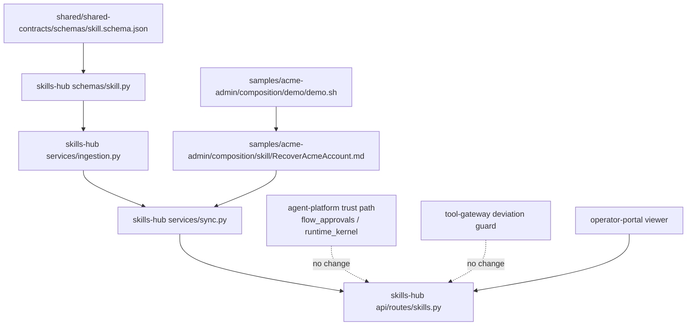
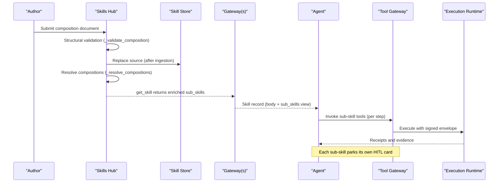
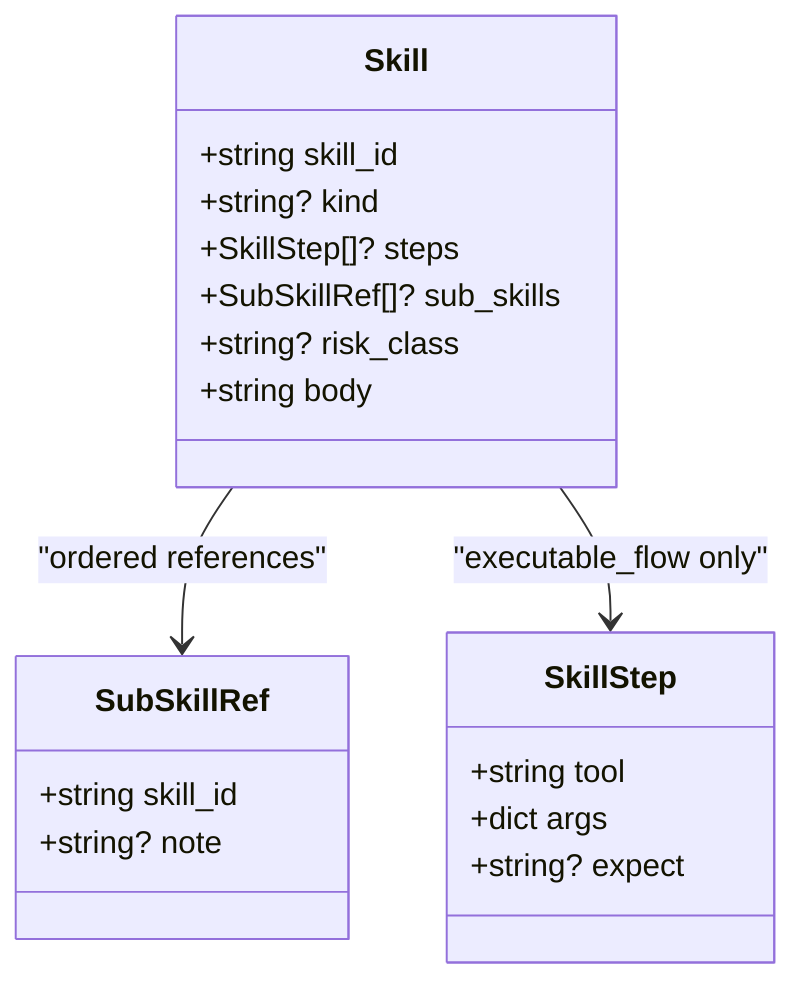
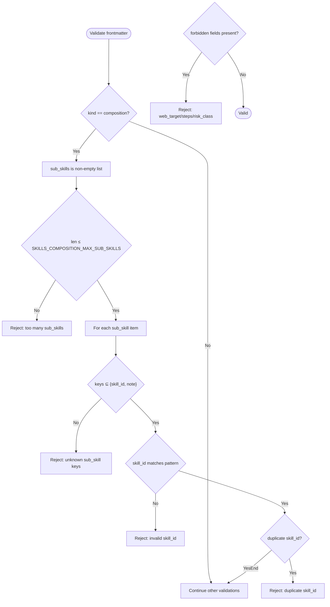
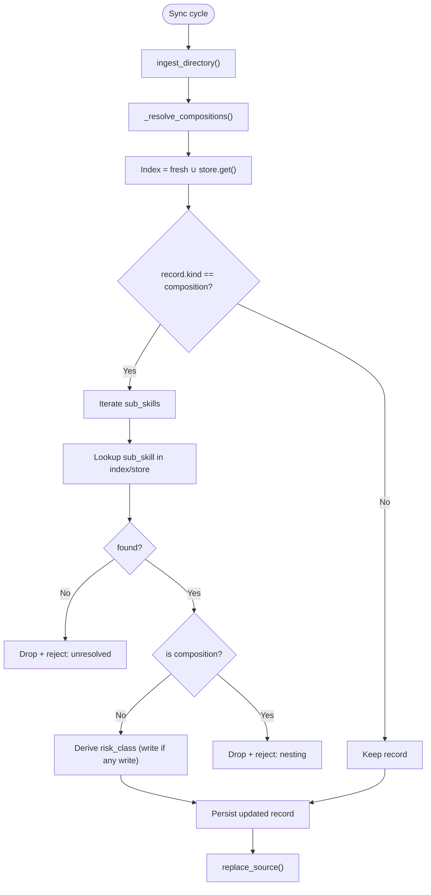
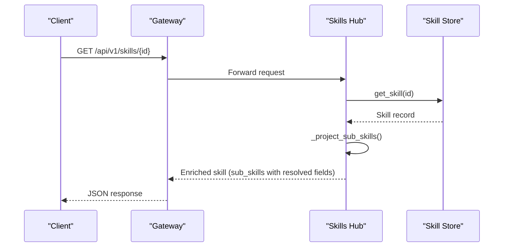
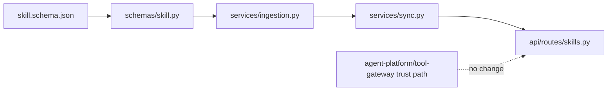

# Skill Composition Runbooks

<cite>
**Referenced Files in This Document**
- [spec.md](file://docs/specs/SPEC-057-skill-composition-runbooks/spec.md)
- [plan.md](file://docs/specs/SPEC-057-skill-composition-runbooks/plan.md)
- [tasks.md](file://docs/specs/SPEC-057-skill-composition-runbooks/tasks.md)
- [skill.schema.json](file://shared/shared-contracts/schemas/skill.schema.json)
- [skill.py](file://products/skills-hub/src/skills_hub/schemas/skill.py)
- [ingestion.py](file://products/skills-hub/src/skills_hub/services/ingestion.py)
- [sync.py](file://products/skills-hub/src/skills_hub/services/sync.py)
- [skills.py](file://products/skills-hub/src/skills_hub/api/routes/skills.py)
- [RecoverAcmeAccount.md](file://samples/acme-admin/composition/skill/RecoverAcmeAccount.md)
- [demo.sh](file://samples/acme-admin/composition/demo/demo.sh)
</cite>

## Table of Contents
1. [Introduction](#introduction)
2. [Project Structure](#project-structure)
3. [Core Components](#core-components)
4. [Architecture Overview](#architecture-overview)
5. [Detailed Component Analysis](#detailed-component-analysis)
6. [Dependency Analysis](#dependency-analysis)
7. [Performance Considerations](#performance-considerations)
8. [Troubleshooting Guide](#troubleshooting-guide)
9. [Conclusion](#conclusion)
10. [Appendices](#appendices)

## Introduction
This document explains the Skill Composition feature introduced by SPEC-057: a third skill kind, composition, that expresses an ordered runbook of single-target skills as grounded guidance without granting authority or enforcing control flow. Each referenced sub-skill retains its own human-in-the-loop gate and signed execution provenance. The platform adds additive contract changes, two-layer ingestion validation, a read-path enrichment for resolved sub-skills, and portal display enhancements, while leaving both gateways and the policy engine unchanged.

## Project Structure
The implementation spans shared contracts, skills-hub services (ingestion, sync, schema, routes), and sample runbooks demonstrating multi-binding gates.

**Diagram sources**
- [skill.schema.json:1-146](file://shared/shared-contracts/schemas/skill.schema.json#L1-L146)
- [skill.py:1-94](file://products/skills-hub/src/skills_hub/schemas/skill.py#L1-L94)
- [ingestion.py:1-696](file://products/skills-hub/src/skills_hub/services/ingestion.py#L1-L696)
- [sync.py:1-424](file://products/skills-hub/src/skills_hub/services/sync.py#L1-L424)
- [skills.py:1-249](file://products/skills-hub/src/skills_hub/api/routes/skills.py#L1-L249)
- [RecoverAcmeAccount.md:1-194](file://samples/acme-admin/composition/skill/RecoverAcmeAccount.md#L1-L194)
- [demo.sh:1-352](file://samples/acme-admin/composition/demo/demo.sh#L1-L352)

**Section sources**
- [spec.md:38-301](file://docs/specs/SPEC-057-skill-composition-runbooks/spec.md#L38-L301)
- [plan.md:1-75](file://docs/specs/SPEC-057-skill-composition-runbooks/plan.md#L1-L75)

## Core Components
- Shared contract v3: Adds `kind: composition` and optional `sub_skills[]` with strict item keys (`skill_id`, optional `note ≤ 200`). A composition declares no `web_target`, no `steps`, and no author-declared `risk_class`.
- Schema mirror: Pydantic models enforce `SubSkillRef` and widen `kind` to include `composition`.
- Ingestion validation: Two-layer fail-closed checks — structural validation per document and cross-skill resolution against the catalog.
- Sync resolution: Resolves sub-skills from fresh records plus store fallback; rejects unresolved or nested compositions; derives and persists display-only `risk_class`.
- Read-path enrichment: `get_skill` projects `resolved_title` and `resolved_web_target` for each sub-skill at query time.
- Portal display: Skills list shows derived risk badge; Skill content viewer renders ordered sub-skill list (title, target, note).
- Sample runbook and demo: Composes password-reset (browser write) and lock-unlock-user (infra write) to demonstrate two durable cards and per-sub-skill gating.

**Section sources**
- [skill.schema.json:63-132](file://shared/shared-contracts/schemas/skill.schema.json#L63-L132)
- [skill.py:31-88](file://products/skills-hub/src/skills_hub/schemas/skill.py#L31-L88)
- [ingestion.py:73-116](file://products/skills-hub/src/skills_hub/services/ingestion.py#L73-L116)
- [sync.py:317-381](file://products/skills-hub/src/skills_hub/services/sync.py#L317-L381)
- [skills.py:68-90](file://products/skills-hub/src/skills_hub/api/routes/skills.py#L68-L90)
- [RecoverAcmeAccount.md:1-194](file://samples/acme-admin/composition/skill/RecoverAcmeAccount.md#L1-L194)
- [demo.sh:1-352](file://samples/acme-admin/composition/demo/demo.sh#L1-L352)

## Architecture Overview
Composition is authored as a skill document, ingested and validated, then served through existing gateway passthroughs. The agent receives grounded guidance including the ordered sub-skill list with resolved titles and targets. Execution remains per-sub-skill with individual gates and receipts.

**Diagram sources**
- [ingestion.py:491-586](file://products/skills-hub/src/skills_hub/services/ingestion.py#L491-L586)
- [sync.py:204-238](file://products/skills-hub/src/skills_hub/services/sync.py#L204-L238)
- [sync.py:317-381](file://products/skills-hub/src/skills_hub/services/sync.py#L317-L381)
- [skills.py:211-248](file://products/skills-hub/src/skills_hub/api/routes/skills.py#L211-L248)

## Detailed Component Analysis

### Contract and Schema (v3)
- Extends `kind` enum to include `composition`.
- Adds optional `sub_skills[]` with strict item schema (`skill_id` required, `note` optional ≤ 200, no extra keys).
- A composition must not declare `web_target`, `steps`, or `risk_class`; its display `risk_class` is derived at sync.

**Diagram sources**
- [skill.schema.json:80-132](file://shared/shared-contracts/schemas/skill.schema.json#L80-L132)
- [skill.py:15-88](file://products/skills-hub/src/skills_hub/schemas/skill.py#L15-L88)

**Section sources**
- [skill.schema.json:1-146](file://shared/shared-contracts/schemas/skill.schema.json#L1-L146)
- [skill.py:1-94](file://products/skills-hub/src/skills_hub/schemas/skill.py#L1-L94)

### Ingestion Validation (Structural Layer)
- Validates presence and shape of `sub_skills`, item keys, id pattern, duplicates, cap, and forbidden fields on compositions.
- Enforces no-control-flow by rejecting unknown keys on sub-skill items.
- Shares code path between sync and `/skills/validate` pre-flight.

**Diagram sources**
- [ingestion.py:491-586](file://products/skills-hub/src/skills_hub/services/ingestion.py#L491-L586)

**Section sources**
- [ingestion.py:73-116](file://products/skills-hub/src/skills_hub/services/ingestion.py#L73-L116)
- [ingestion.py:491-586](file://products/skills-hub/src/skills_hub/services/ingestion.py#L491-L586)

### Sync Resolution (Cross-Skill Layer)
- Builds index from fresh records plus store lookup for cross-source ids.
- Rejects unresolved or nested composition sub-skills; derives display-only `risk_class` for survivors.
- Rejections increment existing counters; no new audit event type.

**Diagram sources**
- [sync.py:204-238](file://products/skills-hub/src/skills_hub/services/sync.py#L204-L238)
- [sync.py:317-381](file://products/skills-hub/src/skills_hub/services/sync.py#L317-L381)

**Section sources**
- [sync.py:204-238](file://products/skills-hub/src/skills_hub/services/sync.py#L204-L238)
- [sync.py:317-381](file://products/skills-hub/src/skills_hub/services/sync.py#L317-L381)

### Read-Path Enrichment
- `get_skill` enriches each sub-skill item with `resolved_title` and `resolved_web_target` by looking up the referenced skill at query time.
- Gateways remain pure passthroughs; enrichment stays read-only and never persisted.

**Diagram sources**
- [skills.py:68-90](file://products/skills-hub/src/skills_hub/api/routes/skills.py#L68-L90)
- [skills.py:211-248](file://products/skills-hub/src/skills_hub/api/routes/skills.py#L211-L248)

**Section sources**
- [skills.py:68-90](file://products/skills-hub/src/skills_hub/api/routes/skills.py#L68-L90)
- [skills.py:211-248](file://products/skills-hub/src/skills_hub/api/routes/skills.py#L211-L248)

### Sample Composition and Demo
- Sample runbook composes two published single-target skills: a browser write flow and an infra write action. It documents report-and-stop behavior and re-entry via signed receipts.
- Demo asserts mounted document shape, resolution, no nesting, structural pre-flight failures, and (opt-in) live chat leg producing two durable cards.

**Section sources**
- [RecoverAcmeAccount.md:1-194](file://samples/acme-admin/composition/skill/RecoverAcmeAccount.md#L1-L194)
- [demo.sh:1-352](file://samples/acme-admin/composition/demo/demo.sh#L1-L352)

## Dependency Analysis
- Contract → Schema mirror → Ingestion → Sync → Routes form a linear pipeline.
- Trust path (agent-platform flow approvals, tool-gateway deviation guard) is intentionally untouched; purity tests assert this invariant.
- Both gateways are passthroughs for skill retrieval; enrichment occurs in skills-hub.

**Diagram sources**
- [skill.schema.json:80-132](file://shared/shared-contracts/schemas/skill.schema.json#L80-L132)
- [skill.py:31-88](file://products/skills-hub/src/skills_hub/schemas/skill.py#L31-L88)
- [ingestion.py:491-586](file://products/skills-hub/src/skills_hub/services/ingestion.py#L491-L586)
- [sync.py:317-381](file://products/skills-hub/src/skills_hub/services/sync.py#L317-L381)
- [skills.py:211-248](file://products/skills-hub/src/skills_hub/api/routes/skills.py#L211-L248)

**Section sources**
- [plan.md:85-129](file://docs/specs/SPEC-057-skill-composition-runbooks/plan.md#L85-L129)
- [spec.md:286-301](file://docs/specs/SPEC-057-skill-composition-runbooks/spec.md#L286-L301)

## Performance Considerations
- Composition is guidance-only; no interpreter means no additional runtime sequencing cost.
- Read-path enrichment performs per-item lookups during `get_skill`; this is bounded by the configured sub-skill cap.
- Worst-case bound on unlocked browser writes per run is `SKILLS_COMPOSITION_MAX_SUB_SKILLS × GATEWAY_BROWSER_FLOW_MAX_STEPS` (default 8 × 20 = 160), with each write individually gated, signed, audited, and receipted.

[No sources needed since this section provides general guidance]

## Troubleshooting Guide
Common ingestion and resolution issues and their causes:
- Unknown sub-skill keys: Indicates attempt to smuggle control flow; rejected by structural validation.
- Duplicate skill_id: Duplicate entry in `sub_skills`; rejected.
- Over-cap sub_skills: Exceeds `SKILLS_COMPOSITION_MAX_SUB_SKILLS`; rejected.
- Unresolved sub-skill: Reference not present in current source’s fresh records nor in store; rejected until the referenced source syncs (eventual consistency).
- Nested composition: Referencing another composition is disallowed in Phase 1; rejected at resolution.
- Author-declared `risk_class` on composition: Not allowed; rejected structurally.
- Missing `web_target`/`steps`/`flow_intent` on executable flows: Separate validation path; ensure correct skill kind and declarations.

Resolution tips:
- Ensure all sub-skills are published and reachable in the same sync cycle when possible.
- Use `/skills/validate` pre-flight to catch structural issues before sync.
- Review per-source status for rejection reasons and counts.

**Section sources**
- [ingestion.py:491-586](file://products/skills-hub/src/skills_hub/services/ingestion.py#L491-L586)
- [sync.py:317-381](file://products/skills-hub/src/skills_hub/services/sync.py#L317-L381)
- [skills.py:174-208](file://products/skills-hub/src/skills_hub/api/routes/skills.py#L174-L208)

## Conclusion
SPEC-057 introduces a minimal, additive composition capability that lets operators express validated, ordered runbooks of single-target skills as grounded guidance without altering the trust model or enforcement machinery. The design emphasizes fail-closed validation, per-sub-skill gating, and clear operator documentation, with a concrete sample demonstrating multi-binding approval and per-step receipts.

[No sources needed since this section summarizes without analyzing specific files]

## Appendices
- Specification status and delivery notes confirm delivered state and version alignment.
- Tasks map each requirement to asserting tests across products.

**Section sources**
- [spec.md:1-37](file://docs/specs/SPEC-057-skill-composition-runbooks/spec.md#L1-L37)
- [tasks.md:100-136](file://docs/specs/SPEC-057-skill-composition-runbooks/tasks.md#L100-L136)