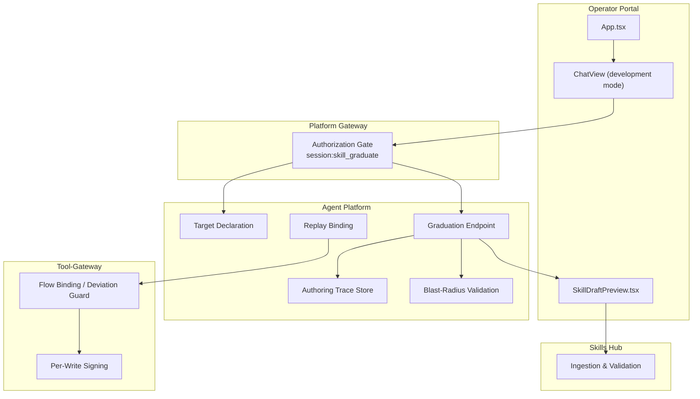
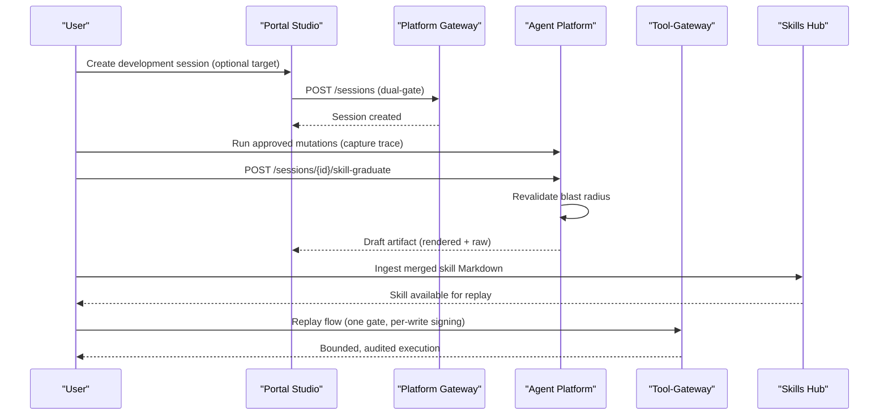
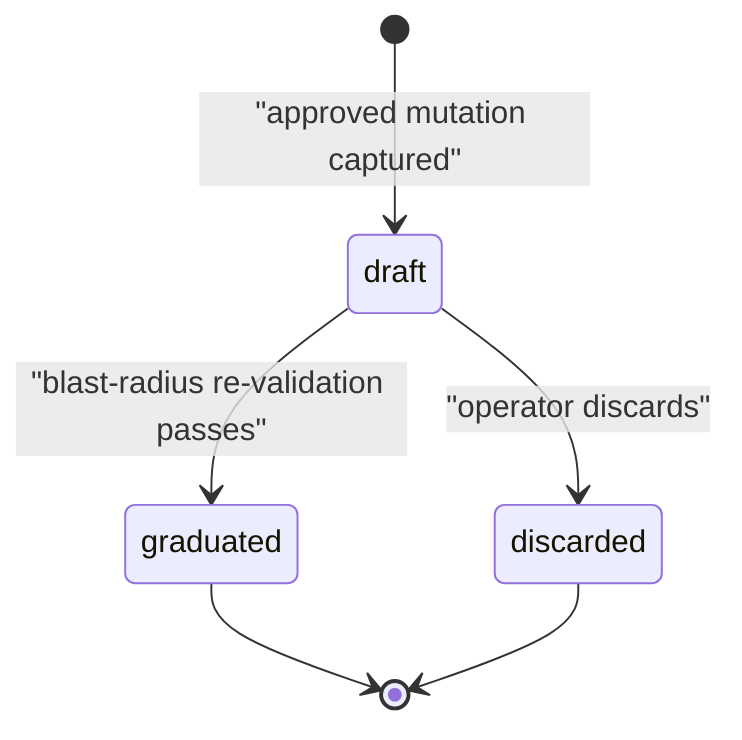
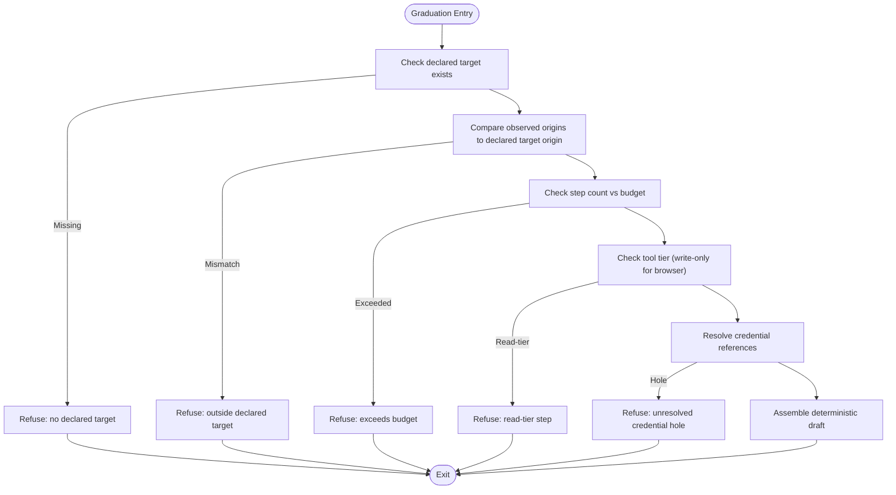
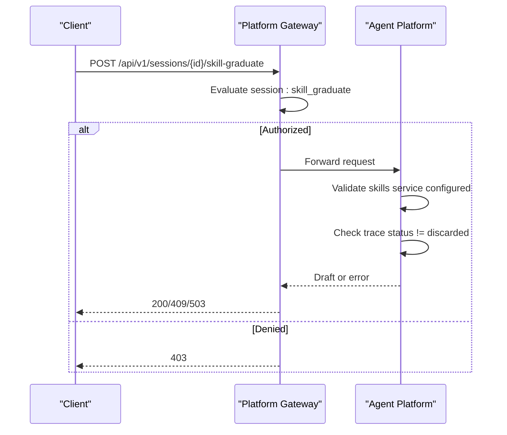
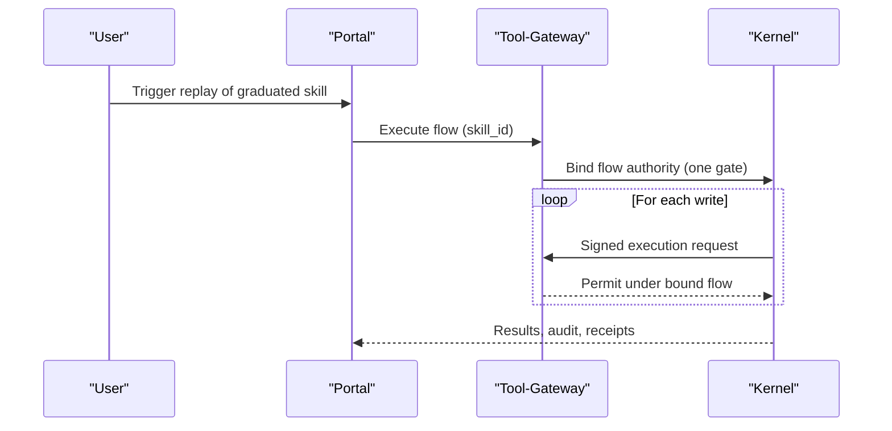
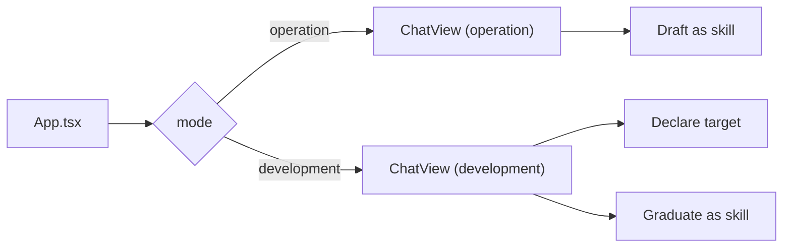
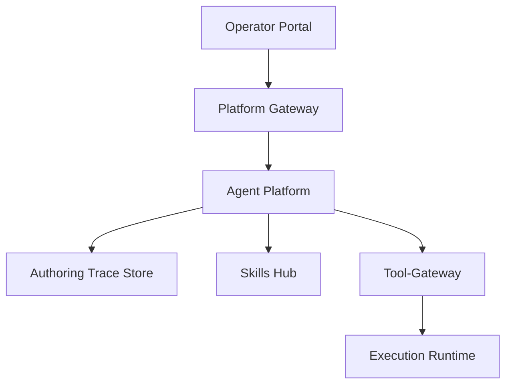

# Skill Graduation Workflow

<cite>
**Referenced Files in This Document**
- [SPEC-055-develop-as-you-go-skill-graduation/spec.md](file://docs/specs/SPEC-055-develop-as-you-go-skill-graduation/spec.md)
- [SPEC-056-studio-skill-development-workspace/spec.md](file://docs/specs/SPEC-056-studio-skill-development-workspace/spec.md)
- [skills-guide.md](file://docs/guides/skills-guide.md)
- [studio-guide.md](file://docs/guides/studio-guide.md)
- [policy-specification.md](file://docs/agentic-aiops-platform/policy-specification.md)
- [test_skill_graduation.py](file://products/agent-platform/tests/test_skill_graduation.py)
- [routes.py](file://products/agent-platform/src/agent_service/api/v2/routes.py)
- [SkillDraftPreview.tsx](file://products/operator-portal/web-ui/app/src/chat/SkillDraftPreview.tsx)
- [App.tsx](file://products/operator-portal/web-ui/app/src/App.tsx)
- [ChatView.tsx](file://products/operator-portal/web-ui/app/src/chat/ChatView.tsx)
- [test_documents_repository.py](file://products/platform-gateway/tests/test_documents_repository.py)
- [policy_engine.py](file://products/tool-gateway/src/tool_gateway/services/policy_engine.py)
</cite>

## Table of Contents
1. Introduction
2. Project Structure
3. Core Components
4. Architecture Overview
5. Detailed Component Analysis
6. Dependency Analysis
7. Performance Considerations
8. Troubleshooting Guide
9. Conclusion

## Introduction
This document explains the end-to-end skill graduation workflow that enables teams to develop skills iteratively and promote them to production. It covers the draft-to-production lifecycle, including creating a development session in Studio, capturing an authoring trace through approved mutations, validating blast radius at graduation, previewing the executable-flow draft, merging into a skills repository, replaying under one HITL gate, and enforcing policy so only approved skills execute in production. It also documents the state machine governing transitions, quality checks during graduation, rollback strategies, portal collaboration features, and best practices for maintaining skill quality across the pipeline.

## Project Structure
The graduation workflow spans multiple products:
- Agent Platform: authoring-trace store, target declaration, graduation endpoint, draft assembly, blast-radius validation, and replay binding.
- Platform Gateway: authorization gating for graduation and development session creation.
- Tool-Gateway: replay deviation guard (origin allowlist, risk class, step budget), credential-set resolution, and per-write signing.
- Skills Hub: ingestion and validation of executable-flow skills; retrieval by consumers.
- Operator Portal: Studio workspace for development sessions, Chat workspace for operations, draft preview modal, and collaboration surfaces.

**Diagram sources**
- [App.tsx:374-413](file://products/operator-portal/web-ui/app/src/App.tsx#L374-L413)
- [ChatView.tsx:1605-1638](file://products/operator-portal/web-ui/app/src/chat/ChatView.tsx#L1605-L1638)
- [SkillDraftPreview.tsx:22-38](file://products/operator-portal/web-ui/app/src/chat/SkillDraftPreview.tsx#L22-L38)
- [test_documents_repository.py:1085-1113](file://products/platform-gateway/tests/test_documents_repository.py#L1085-L1113)
- [routes.py:1346-1366](file://products/agent-platform/src/agent_service/api/v2/routes.py#L1346-L1366)
- [policy_engine.py:299-337](file://products/tool-gateway/src/tool_gateway/services/policy_engine.py#L299-L337)

**Section sources**
- [SPEC-055-develop-as-you-go-skill-graduation/spec.md:39-67](file://docs/specs/SPEC-055-develop-as-you-go-skill-graduation/spec.md#L39-L67)
- [SPEC-056-studio-skill-development-workspace/spec.md:32-52](file://docs/specs/SPEC-056-studio-skill-development-workspace/spec.md#L32-L52)

## Core Components
- Authoring trace store: durable, dual-backend capture of approved mutating steps with a lifecycle scoped to authoring and independent retention from execution receipts.
- Target declaration: single-target scope declared before mutation to enable blast-radius corroboration.
- Graduation endpoint: deterministic assembly of an executable-flow skill draft after re-validating blast radius; never auto-publishes.
- Replay binding: graduated flows replay under one HITL gate with per-write signing and gateway guards.
- Policy enforcement: role-based gates for graduation and development session creation; execution requires signed approval context.
- Portal Studio: dedicated development workspace with role gating, separate session lists, and shared chat core.

**Section sources**
- [SPEC-055-develop-as-you-go-skill-graduation/spec.md:111-249](file://docs/specs/SPEC-055-develop-as-you-go-skill-graduation/spec.md#L111-L249)
- [SPEC-056-studio-skill-development-workspace/spec.md:87-221](file://docs/specs/SPEC-056-studio-skill-development-workspace/spec.md#L87-L221)
- [policy-specification.md:359-407](file://docs/agentic-aiops-platform/policy-specification.md#L359-L407)

## Architecture Overview
The graduation workflow is a multi-stage process:
- Development: create a development session in Studio, optionally declare a target at birth or later, run approved mutations, and accumulate an authoring trace.
- Validation: graduation re-validates blast radius against the declared target, step budget, tool tiers, and credential references.
- Preview: a deterministic draft is produced for human review and download; nothing is persisted server-side as published.
- Merge: the operator merges the Markdown into the team’s skills repository; skills-hub ingests and validates it.
- Replay: the ingested executable flow replays under one HITL gate; each write is signed and bounded by the gateway.

**Diagram sources**
- [test_documents_repository.py:1085-1113](file://products/platform-gateway/tests/test_documents_repository.py#L1085-L1113)
- [routes.py:1346-1366](file://products/agent-platform/src/agent_service/api/v2/routes.py#L1346-L1366)
- [test_skill_graduation.py:1365-1671](file://products/agent-platform/tests/test_skill_graduation.py#L1365-L1671)

## Detailed Component Analysis

### State Machine: Authoring Trace Lifecycle
The authoring trace follows a strict lifecycle:
- draft: steps are captured as approved mutations occur.
- graduated: successful graduation flips the lifecycle; the trace becomes a candidate for replay via the ingested skill.
- discarded: intentionally dropped candidates cannot be resurrected.

**Diagram sources**
- [test_skill_graduation.py:1468-1759](file://products/agent-platform/tests/test_skill_graduation.py#L1468-L1759)
- [test_authoring_trace.py:201-226](file://products/agent-platform/tests/test_authoring_trace.py#L201-L226)

**Section sources**
- [SPEC-055-develop-as-you-go-skill-graduation/spec.md:111-134](file://docs/specs/SPEC-055-develop-as-you-go-skill-graduation/spec.md#L111-L134)
- [test_skill_graduation.py:1739-1759](file://products/agent-platform/tests/test_skill_graduation.py#L1739-L1759)

### Blast-Radius Re-Validation Flow
Graduation enforces multiple guards before producing a draft:
- Declared target must exist.
- Observed origins must match the declared target origin.
- Step count must not exceed the graduation budget.
- All browser steps must be write-tier; read-tier steps are refused.
- Credential holes must be resolved to named credential-set references.

**Diagram sources**
- [test_skill_graduation.py:633-792](file://products/agent-platform/tests/test_skill_graduation.py#L633-L792)

**Section sources**
- [SPEC-055-develop-as-you-go-skill-graduation/spec.md:181-207](file://docs/specs/SPEC-055-develop-as-you-go-skill-graduation/spec.md#L181-L207)
- [test_skill_graduation.py:633-792](file://products/agent-platform/tests/test_skill_graduation.py#L633-L792)

### Graduation Endpoint and Policy Gate
- The graduation route requires the `session:skill_graduate` action; observers are denied.
- If the skills service is not configured for validation, a 503 is returned.
- A discarded trace yields a 409 refusal.
- The route performs ownership checks and returns structural errors for unknown or foreign sessions.

**Diagram sources**
- [test_documents_repository.py:1085-1113](file://products/platform-gateway/tests/test_documents_repository.py#L1085-L1113)
- [test_documents_repository.py:1147-1183](file://products/platform-gateway/tests/test_documents_repository.py#L1147-L1183)
- [routes.py:1346-1366](file://products/agent-platform/src/agent_service/api/v2/routes.py#L1346-L1366)

**Section sources**
- [test_documents_repository.py:1085-1113](file://products/platform-gateway/tests/test_documents_repository.py#L1085-L1113)
- [test_documents_repository.py:1147-1183](file://products/platform-gateway/tests/test_documents_repository.py#L1147-L1183)
- [routes.py:1346-1366](file://products/agent-platform/src/agent_service/api/v2/routes.py#L1346-L1366)

### Replay Under One Gate
A graduated executable flow binds a flow authority and parks exactly one confirmation card; subsequent writes are admitted under that authority, each individually signed, audited, and receipted. Credentials resolve from named sets at replay time.

**Diagram sources**
- [SPEC-055-develop-as-you-go-skill-graduation/spec.md:225-249](file://docs/specs/SPEC-055-develop-as-you-go-skill-graduation/spec.md#L225-L249)

**Section sources**
- [SPEC-055-develop-as-you-go-skill-graduation/spec.md:225-249](file://docs/specs/SPEC-055-develop-as-you-go-skill-graduation/spec.md#L225-L249)

### Studio Workspace and Collaboration
- Studio is a distinct entry for development sessions, gated to authoring roles; Chat remains for operation sessions.
- Each entry lists only its own session type, enforced server-side.
- The shared chat core ensures identical SSE, secret masking, and HITL behavior across modes.
- Draft previews render both rendered and raw views, with badges indicating mode.

**Diagram sources**
- [App.tsx:374-413](file://products/operator-portal/web-ui/app/src/App.tsx#L374-L413)
- [ChatView.tsx:1605-1638](file://products/operator-portal/web-ui/app/src/chat/ChatView.tsx#L1605-L1638)
- [SkillDraftPreview.tsx:22-38](file://products/operator-portal/web-ui/app/src/chat/SkillDraftPreview.tsx#L22-L38)

**Section sources**
- [SPEC-056-studio-skill-development-workspace/spec.md:119-221](file://docs/specs/SPEC-056-studio-skill-development-workspace/spec.md#L119-L221)
- [studio-guide.md:203-213](file://docs/guides/studio-guide.md#L203-L213)

### Policy Enforcement Points
- Graduation requires `session:skill_graduate`; observers are denied.
- Creating a development session is dual-gated on `session:create` plus `session:skill_graduate`.
- Execution workers accept only approved signed execution requests.
- Tool-gateway evaluates policies with deny-by-default semantics and require_approval overrides.

**Section sources**
- [test_documents_repository.py:1085-1113](file://products/platform-gateway/tests/test_documents_repository.py#L1085-L1113)
- [SPEC-056-studio-skill-development-workspace/spec.md:223-247](file://docs/specs/SPEC-056-studio-skill-development-workspace/spec.md#L223-L247)
- [policy-specification.md:359-407](file://docs/agentic-aiops-platform/policy-specification.md#L359-L407)
- [policy_engine.py:299-337](file://products/tool-gateway/src/tool_gateway/services/policy_engine.py#L299-L337)

## Dependency Analysis
Key dependencies and coupling:
- Portal depends on platform-gateway for authorization and agent-platform for session and graduation endpoints.
- Agent-platform depends on authoring-trace store and skills-hub for validation; replay depends on tool-gateway for binding and signing.
- Tool-gateway enforces policy decisions and replay guards; execution-runtime participates in signed execution.
- Skills-hub validates ingested executable-flow skills and exposes them for replay.

**Diagram sources**
- [App.tsx:374-413](file://products/operator-portal/web-ui/app/src/App.tsx#L374-L413)
- [test_documents_repository.py:1085-1113](file://products/platform-gateway/tests/test_documents_repository.py#L1085-L1113)
- [routes.py:1346-1366](file://products/agent-platform/src/agent_service/api/v2/routes.py#L1346-L1366)

**Section sources**
- [SPEC-055-develop-as-you-go-skill-graduation/spec.md:352-393](file://docs/specs/SPEC-055-develop-as-you-go-skill-graduation/spec.md#L352-L393)
- [SPEC-056-studio-skill-development-workspace/spec.md:290-327](file://docs/specs/SPEC-056-studio-skill-development-workspace/spec.md#L290-L327)

## Performance Considerations
- Keep traces bounded: per-session step caps prevent unbounded growth.
- Use credential-set references to avoid embedding secrets in drafts or traces.
- Limit replay budgets to reduce runtime cost and blast radius.
- Ensure skills-hub validation runs before ingestion to catch issues early.
- Avoid unnecessary model calls during graduation; the draft is deterministic over the trace.

[No sources needed since this section provides general guidance]

## Troubleshooting Guide
Common graduation failures and resolutions:
- No declared target: ensure a target was declared at birth or via the standalone endpoint; invalid targets are rejected early.
- Drifted origin: verify every observed origin matches the declared target origin; steps landing elsewhere will refuse graduation.
- Exceeds budget: reduce steps or adjust configuration knobs; the graduation budget aligns with replay budget.
- Read-tier step: replace read-tier tools with appropriate write-tier actions or remove non-mutating steps from executable flows.
- Unresolved credential hole: use credential-set references; literal secrets are not allowed in executable flows.
- Discarded trace: a discarded candidate cannot be resurrected; recreate the trace.
- Skills service not configured: configure skills validation before attempting graduation.

**Section sources**
- [test_skill_graduation.py:633-792](file://products/agent-platform/tests/test_skill_graduation.py#L633-L792)
- [test_skill_graduation.py:1739-1759](file://products/agent-platform/tests/test_skill_graduation.py#L1739-L1759)
- [routes.py:1346-1366](file://products/agent-platform/src/agent_service/api/v2/routes.py#L1346-L1366)

## Conclusion
The skill graduation workflow provides a secure, auditable path from iterative troubleshooting to reusable, replayable skills. By declaring a single target upfront, capturing an authoring trace of approved mutations, re-validating blast radius, previewing deterministic drafts, merging into a skills repository, and replaying under one HITL gate with per-write signing, teams can maintain high quality and strong security postures. Studio separates development from operations while sharing the same trusted core, and policy enforcement ensures only approved skills execute in production.

[No sources needed since this section summarizes without analyzing specific files]