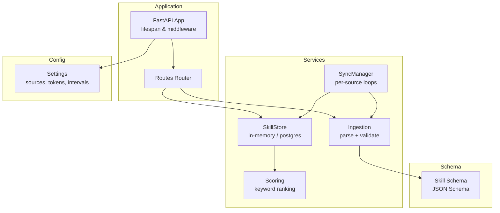
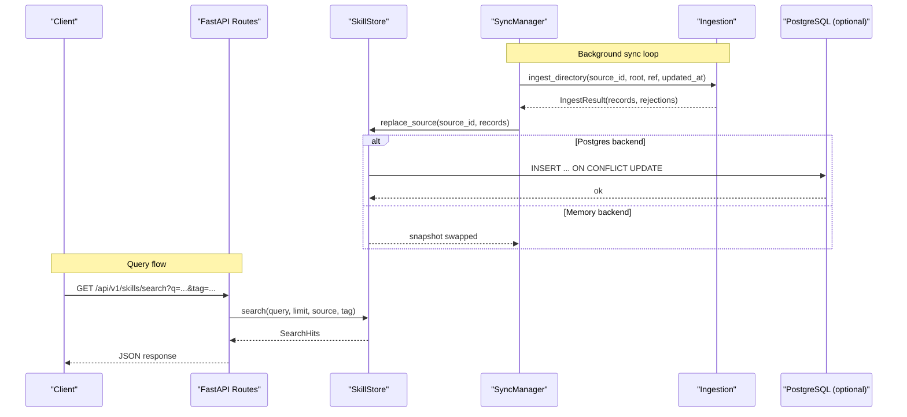
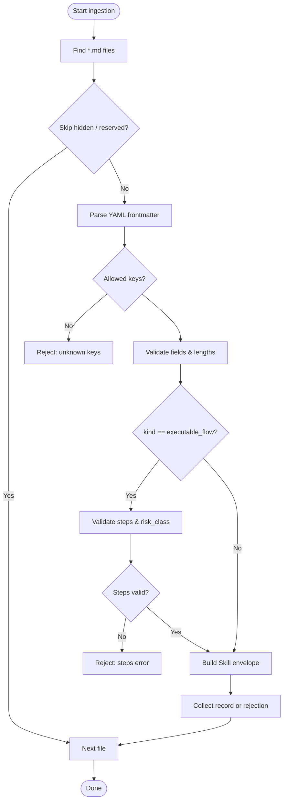
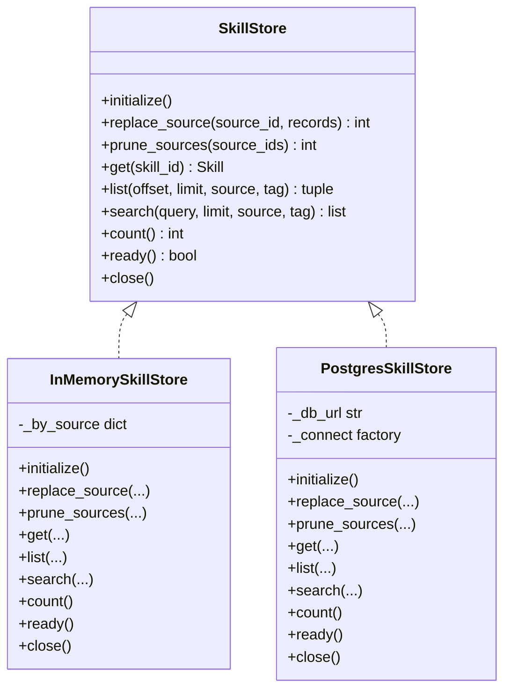
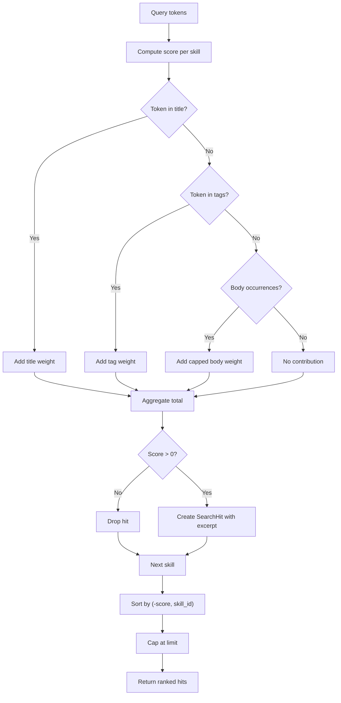
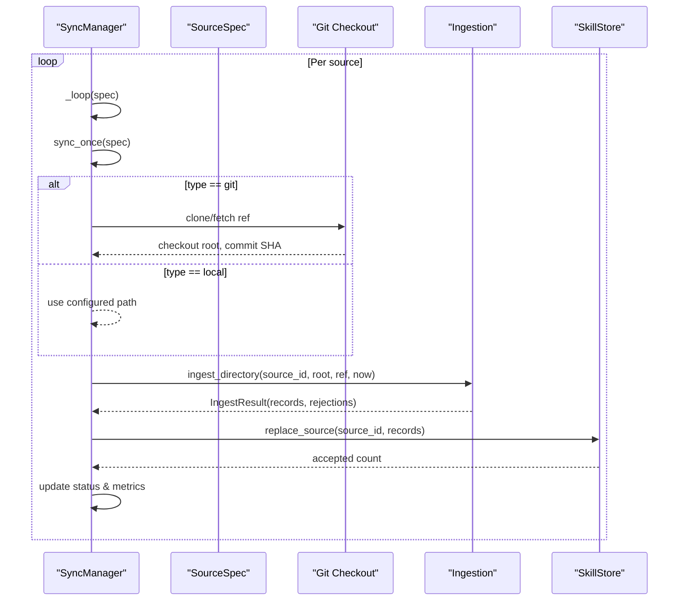
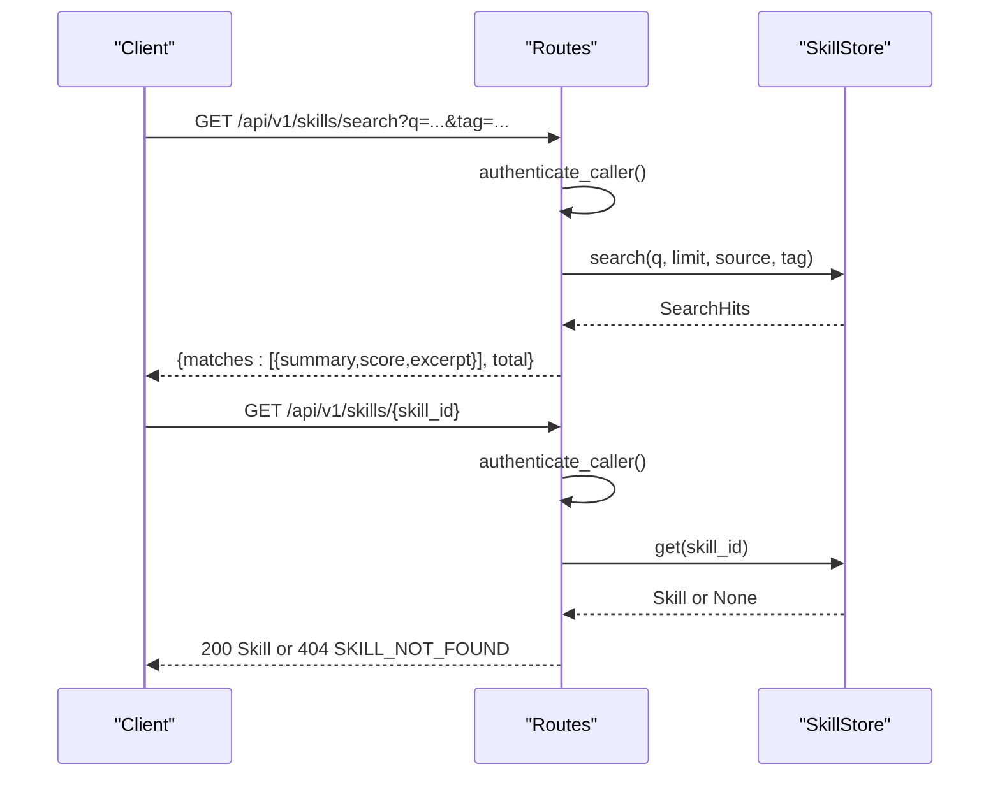
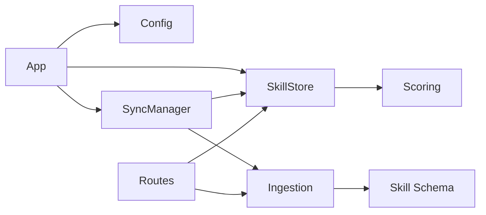

# Skills Hub Service

<cite>
**Referenced Files in This Document**
- [app.py](file://products/skills-hub/src/skills_hub/app.py)
- [main.py](file://products/skills-hub/src/skills_hub/main.py)
- [config.py](file://products/skills-hub/src/skills_hub/core/config.py)
- [skill_store.py](file://products/skills-hub/src/skills_hub/services/skill_store.py)
- [ingestion.py](file://products/skills-hub/src/skills_hub/services/ingestion.py)
- [scoring.py](file://products/skills-hub/src/skills_hub/services/scoring.py)
- [sync.py](file://products/skills-hub/src/skills_hub/services/sync.py)
- [skills.py](file://products/skills-hub/src/skills_hub/api/routes/skills.py)
- [status.py](file://products/skills-hub/src/skills_hub/api/routes/status.py)
- [health.py](file://products/skills-hub/src/skills_hub/api/routes/health.py)
- [skill.schema.json](file://shared/shared-contracts/schemas/skill.schema.json)
</cite>

## Table of Contents
1. [Introduction](#introduction)
2. [Project Structure](#project-structure)
3. [Core Components](#core-components)
4. [Architecture Overview](#architecture-overview)
5. [Detailed Component Analysis](#detailed-component-analysis)
6. [Dependency Analysis](#dependency-analysis)
7. [Performance Considerations](#performance-considerations)
8. [Troubleshooting Guide](#troubleshooting-guide)
9. [Conclusion](#conclusion)
10. [Appendices](#appendices)

## Introduction
The Skills Hub service ingests skills from Git repositories and local directories, validates them against the shared skill contract, stores them in a durable or in-memory store, and exposes APIs for search, retrieval, validation, and status. A background sync mechanism periodically materializes sources, validates documents, and atomically swaps validated snapshots into the store. A deterministic keyword-based scoring algorithm ranks search results by relevance to title, tags, and body content. The service supports filtering by source and tag, and provides health and readiness endpoints for operational monitoring.

## Project Structure
Skills Hub is organized as a FastAPI application with clear separation between API routes, services, core configuration, and schemas:
- Application lifecycle and middleware are defined in the app module.
- Configuration is loaded from environment variables and parsed into typed settings.
- Services implement ingestion, storage, scoring, synchronization, and query authentication.
- API routes expose retrieval, search, validation, and status endpoints.
- Shared schema defines the canonical skill envelope used across the platform.

**Diagram sources**
- [app.py:20-86](file://products/skills-hub/src/skills_hub/app.py#L20-L86)
- [config.py:161-209](file://products/skills-hub/src/skills_hub/core/config.py#L161-L209)
- [sync.py:154-324](file://products/skills-hub/src/skills_hub/services/sync.py#L154-L324)
- [ingestion.py:476-559](file://products/skills-hub/src/skills_hub/services/ingestion.py#L476-L559)
- [skill_store.py:30-66](file://products/skills-hub/src/skills_hub/services/skill_store.py#L30-L66)
- [scoring.py:28-97](file://products/skills-hub/src/skills_hub/services/scoring.py#L28-L97)
- [skill.schema.json:1-125](file://shared/shared-contracts/schemas/skill.schema.json#L1-L125)

**Section sources**
- [app.py:20-86](file://products/skills-hub/src/skills_hub/app.py#L20-L86)
- [main.py:6-9](file://products/skills-hub/src/skills_hub/main.py#L6-L9)
- [config.py:161-209](file://products/skills-hub/src/skills_hub/core/config.py#L161-L209)

## Core Components
- Application lifecycle initializes the skill store, prunes unconfigured sources, starts the sync manager, and wires metrics and telemetry.
- Configuration parses federation entries (sources), Git tokens, query/workload clients, and runtime options like sync interval and data path.
- Ingestion walks source directories, parses Markdown frontmatter, enforces size and vocabulary constraints, validates executable-flow steps when present, and builds Skill envelopes.
- Storage provides an in-memory backend for dev/test and a PostgreSQL backend for production, both implementing the same protocol for replace, list, search, get, count, prune, ready, and close.
- Scoring implements deterministic keyword matching with weighted contributions from title, tags, and body, plus bounded excerpts for search hits.
- Sync manages per-source async loops that materialize Git or local sources, run ingestion, and atomically swap validated snapshots into the store while tracking status and emitting audit events.
- API routes expose authenticated endpoints for listing, searching, retrieving, validating documents, and an auth-exempt status endpoint for operational visibility.

**Section sources**
- [app.py:20-86](file://products/skills-hub/src/skills_hub/app.py#L20-L86)
- [config.py:50-116](file://products/skills-hub/src/skills_hub/core/config.py#L50-L116)
- [ingestion.py:149-473](file://products/skills-hub/src/skills_hub/services/ingestion.py#L149-L473)
- [skill_store.py:30-66](file://products/skills-hub/src/skills_hub/services/skill_store.py#L30-L66)
- [scoring.py:28-97](file://products/skills-hub/src/skills_hub/services/scoring.py#L28-L97)
- [sync.py:154-324](file://products/skills-hub/src/skills_hub/services/sync.py#L154-L324)
- [skills.py:68-215](file://products/skills-hub/src/skills_hub/api/routes/skills.py#L68-L215)
- [status.py:20-29](file://products/skills-hub/src/skills_hub/api/routes/status.py#L20-L29)
- [health.py:14-35](file://products/skills-hub/src/skills_hub/api/routes/health.py#L14-L35)

## Architecture Overview
The service runs as a FastAPI process with a lifespan that prepares the store and sync engine. Sources are configured via environment; each source runs an independent sync loop that checks out Git refs or reads local paths, validates documents against the shared skill contract, and replaces the source’s snapshot in the store atomically. Clients authenticate queries using registered credentials or workload tokens and call search/list/get/validate endpoints. Status and health endpoints provide operational insights without requiring authentication.

**Diagram sources**
- [sync.py:181-281](file://products/skills-hub/src/skills_hub/services/sync.py#L181-L281)
- [ingestion.py:476-559](file://products/skills-hub/src/skills_hub/services/ingestion.py#L476-L559)
- [skill_store.py:318-363](file://products/skills-hub/src/skills_hub/services/skill_store.py#L318-L363)
- [skills.py:99-146](file://products/skills-hub/src/skills_hub/api/routes/skills.py#L99-L146)

## Detailed Component Analysis

### Ingestion and Validation
- Walks all Markdown files under a source root, skipping hidden segments and known base names.
- Derives stable slugs from relative paths and enforces uniqueness within a source.
- Parses YAML frontmatter, validates required fields, length limits, allowed keys, URL formats, risk class values, and optional flow intent requirements.
- For executable flows, validates kind discriminator, non-empty step lists, maximum step counts and sizes, required risk_class, tool naming, argument JSON compatibility, and credential hole policy.
- Produces Skill envelopes with metadata and body, returning both accepted records and detailed rejection reasons.

**Diagram sources**
- [ingestion.py:476-559](file://products/skills-hub/src/skills_hub/services/ingestion.py#L476-L559)
- [ingestion.py:149-473](file://products/skills-hub/src/skills_hub/services/ingestion.py#L149-L473)

**Section sources**
- [ingestion.py:149-473](file://products/skills-hub/src/skills_hub/services/ingestion.py#L149-L473)
- [ingestion.py:476-559](file://products/skills-hub/src/skills_hub/services/ingestion.py#L476-L559)
- [skill.schema.json:1-125](file://shared/shared-contracts/schemas/skill.schema.json#L1-L125)

### Storage Backends
- Protocol defines initialize, replace_source, prune_sources, get, list, search, count, ready, close.
- In-memory store keeps per-source snapshots and supports filtering by source and tag with deterministic ordering.
- PostgreSQL store creates the skills table and indexes, performs atomic per-source replacement via delete+insert, and uses full-text search with GIN index followed by shared scorer for identical ranking.
- Both backends support tag filtering with case-insensitive exact match and consistent behavior.

**Diagram sources**
- [skill_store.py:30-66](file://products/skills-hub/src/skills_hub/services/skill_store.py#L30-L66)
- [skill_store.py:72-154](file://products/skills-hub/src/skills_hub/services/skill_store.py#L72-L154)
- [skill_store.py:283-483](file://products/skills-hub/src/skills_hub/services/skill_store.py#L283-L483)

**Section sources**
- [skill_store.py:30-66](file://products/skills-hub/src/skills_hub/services/skill_store.py#L30-L66)
- [skill_store.py:72-154](file://products/skills-hub/src/skills_hub/services/skill_store.py#L72-L154)
- [skill_store.py:283-483](file://products/skills-hub/src/skills_hub/services/skill_store.py#L283-L483)

### Scoring Algorithm
- Tokenization extracts lowercase alphanumeric tokens.
- Title matches contribute the highest weight, tags next, and body occurrences capped to prevent long documents from dominating.
- Zero-score results are excluded; ties break by skill_id ascending.
- Excerpts show the first matched region in the body, bounded to a fixed character cap, falling back to description head when matches are only in title/tags.

**Diagram sources**
- [scoring.py:28-97](file://products/skills-hub/src/skills_hub/services/scoring.py#L28-L97)

**Section sources**
- [scoring.py:28-97](file://products/skills-hub/src/skills_hub/services/scoring.py#L28-L97)

### Sync Mechanism
- One asyncio task per configured source runs continuously with jittered intervals.
- Materializes Git repositories with shallow clones/fetches and optional subpaths, or reads local directories directly.
- Runs ingestion in a thread to avoid blocking the event loop, then atomically replaces the source snapshot in the store.
- Tracks per-source status including last sync time, error messages, accepted counts, and bounded rejection lists.
- Emits audit events for successful and failed cycles and updates metrics counters.

**Diagram sources**
- [sync.py:154-324](file://products/skills-hub/src/skills_hub/services/sync.py#L154-L324)
- [ingestion.py:476-559](file://products/skills-hub/src/skills_hub/services/ingestion.py#L476-L559)

**Section sources**
- [sync.py:154-324](file://products/skills-hub/src/skills_hub/services/sync.py#L154-L324)

### API Endpoints
- List skills: paginated enumeration with optional source and tag filters; returns summaries excluding body.
- Search skills: requires query parameter; supports source and tag filters; returns ranked hits with scores and excerpts.
- Get skill by ID: returns full skill envelope if found; emits usage audit on success or not-found error.
- Validate document: read-only validation of a candidate skill document against the shared contract; no store writes or sync triggers.
- Status: auth-exempt endpoint reporting store backend, sync interval, and per-source sync outcomes.
- Health: live and ready probes; ready includes store readiness and skill count when available.

**Diagram sources**
- [skills.py:68-215](file://products/skills-hub/src/skills_hub/api/routes/skills.py#L68-L215)
- [status.py:20-29](file://products/skills-hub/src/skills_hub/api/routes/status.py#L20-L29)
- [health.py:14-35](file://products/skills-hub/src/skills_hub/api/routes/health.py#L14-L35)

**Section sources**
- [skills.py:68-215](file://products/skills-hub/src/skills_hub/api/routes/skills.py#L68-L215)
- [status.py:20-29](file://products/skills-hub/src/skills_hub/api/routes/status.py#L20-L29)
- [health.py:14-35](file://products/skills-hub/src/skills_hub/api/routes/health.py#L14-L35)

## Dependency Analysis
- Application depends on configuration for sources, tokens, and runtime options; it constructs the store and sync manager during lifespan.
- Sync depends on ingestion and store; ingestion depends on the shared skill schema and produces Skill envelopes.
- Store depends on scoring for search ranking; both backends delegate to the shared scorer to ensure byte-identical ordering.
- API routes depend on store and ingestion; they also rely on query authentication and emit audit events.

**Diagram sources**
- [app.py:20-86](file://products/skills-hub/src/skills_hub/app.py#L20-L86)
- [config.py:161-209](file://products/skills-hub/src/skills_hub/core/config.py#L161-L209)
- [sync.py:154-324](file://products/skills-hub/src/skills_hub/services/sync.py#L154-L324)
- [ingestion.py:476-559](file://products/skills-hub/src/skills_hub/services/ingestion.py#L476-L559)
- [skill_store.py:30-66](file://products/skills-hub/src/skills_hub/services/skill_store.py#L30-L66)
- [scoring.py:28-97](file://products/skills-hub/src/skills_hub/services/scoring.py#L28-L97)
- [skills.py:68-215](file://products/skills-hub/src/skills_hub/api/routes/skills.py#L68-L215)

**Section sources**
- [app.py:20-86](file://products/skills-hub/src/skills_hub/app.py#L20-L86)
- [config.py:161-209](file://products/skills-hub/src/skills_hub/core/config.py#L161-L209)
- [sync.py:154-324](file://products/skills-hub/src/skills_hub/services/sync.py#L154-L324)
- [ingestion.py:476-559](file://products/skills-hub/src/skills_hub/services/ingestion.py#L476-L559)
- [skill_store.py:30-66](file://products/skills-hub/src/skills_hub/services/skill_store.py#L30-L66)
- [scoring.py:28-97](file://products/skills-hub/src/skills_hub/services/scoring.py#L28-L97)
- [skills.py:68-215](file://products/skills-hub/src/skills_hub/api/routes/skills.py#L68-L215)

## Performance Considerations
- Search pre-filtering: PostgreSQL uses a GIN full-text index on title and body and OR-joins tokenized lexemes to keep candidates relevant before re-ranking in Python.
- Deterministic scoring: shared scorer ensures identical ordering regardless of backend; tag-only matches are preserved by explicit tag branch in search vector.
- Bounded payloads: document body and steps are size-capped to control memory and network overhead; list responses omit body and search responses include bounded excerpts.
- Atomic swaps: replace_source deletes and inserts per source in one transaction (Postgres) or swaps references (in-memory), preventing partial snapshots.
- Concurrency: sync loops run independently per source with jitter to avoid stampedes; ingestion runs in a thread to avoid blocking the event loop.
- Connection management: Postgres store opens connections per operation suitable for low-volume retrieval traffic.

[No sources needed since this section provides general guidance]

## Troubleshooting Guide
- Source pruning: On startup, sources removed from configuration are pruned from the store to keep the catalog aligned with federation entries; warnings are logged when the sources list is empty.
- Rejection categories: Sync categorizes rejections into bounded labels (duplicate slug, size, unreadable, path, missing source, frontmatter) for metrics and reporting.
- Error masking: Git errors and sync failures scrub tokens from logs and status reports to avoid leaking credentials.
- Readiness: Ready probe checks store connectivity and returns degraded status when unavailable; skill count is included when store is ready.
- Audit events: Successful and failed sync cycles emit audit events with details such as source_id, type, ref, accepted/rejected counts, and error messages.

**Section sources**
- [app.py:20-56](file://products/skills-hub/src/skills_hub/app.py#L20-L56)
- [sync.py:54-76](file://products/skills-hub/src/skills_hub/services/sync.py#L54-L76)
- [sync.py:247-281](file://products/skills-hub/src/skills_hub/services/sync.py#L247-L281)
- [health.py:19-35](file://products/skills-hub/src/skills_hub/api/routes/health.py#L19-L35)

## Conclusion
Skills Hub provides a robust pipeline for ingesting, validating, storing, and serving skills from federated sources. Its design emphasizes deterministic validation and ranking, atomic snapshot updates, and operational transparency through status and health endpoints. The service integrates with platform-wide contracts and supports scalable querying with efficient indexing and bounded payloads.

[No sources needed since this section summarizes without analyzing specific files]

## Appendices

### Configuration Options
- Federation sources: Configure SKILLS_SOURCES as a JSON list of objects with source_id, type ("git" or "local"), and type-specific fields (url/ref/path).
- Git tokens: Configure SKILLS_GIT_TOKENS as a JSON map from source_id to token for authenticated cloning.
- Sync interval: Configure SKILLS_SYNC_INTERVAL_SECONDS to adjust polling frequency.
- Data path: Configure SKILLS_DATA_PATH for Git checkout cache location.
- Store backend: Configure SKILLS_STORE_BACKEND ("memory" or "postgres"); when "postgres", set SKILLS_DB_URL.
- Query authentication: Configure SKILLS_QUERY_CLIENTS and/or SKILLS_WORKLOAD_ISSUER_URL/AUDIENCE/CLIENTS for client identity.
- Audit integration: Configure SKILLS_AUDIT_SERVICE_URL, AUDIT_CLIENT_ID, and AUDIT_CLIENT_SECRET to emit audit events.

**Section sources**
- [config.py:50-116](file://products/skills-hub/src/skills_hub/core/config.py#L50-L116)
- [config.py:119-158](file://products/skills-hub/src/skills_hub/core/config.py#L119-L158)
- [config.py:161-209](file://products/skills-hub/src/skills_hub/core/config.py#L161-L209)

### Example Queries and Filtering
- List skills with pagination and tag filter: GET /api/v1/skills?offset=0&limit=20&tag=incident
- Search skills with source and tag filters: GET /api/v1/skills/search?q=kubernetes+incident&source=sre-alerting&tag=alerting&limit=5
- Retrieve full skill: GET /api/v1/skills/{skill_id}
- Validate a draft document: POST /api/v1/skills/validate with JSON body containing a document string

**Section sources**
- [skills.py:68-215](file://products/skills-hub/src/skills_hub/api/routes/skills.py#L68-L215)

### Integration Patterns
- Platform Gateway: Consumes search and retrieval endpoints to surface skills in agent workflows and confirmations.
- Tool Gateway: Uses skill metadata (web_target, risk_class, kind, steps) to bind browser flows and enforce mutation gates.
- Audit Service: Receives usage and sync audit events for traceability and compliance.

**Section sources**
- [skills.py:47-66](file://products/skills-hub/src/skills_hub/api/routes/skills.py#L47-L66)
- [sync.py:218-234](file://products/skills-hub/src/skills_hub/services/sync.py#L218-L234)