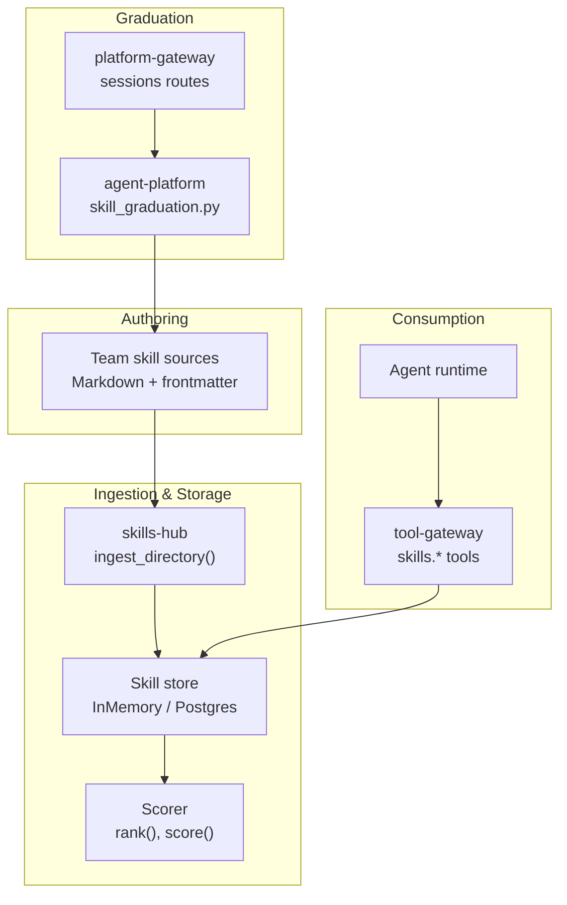
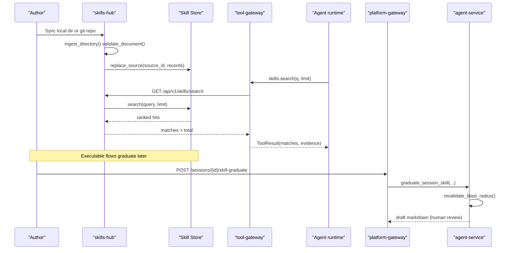
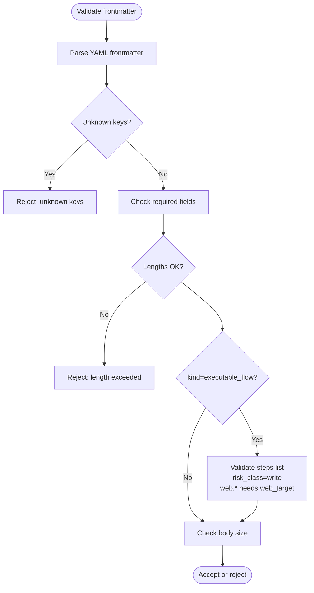
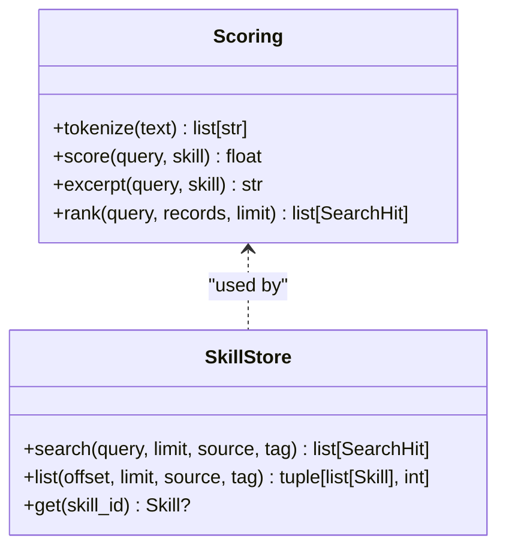
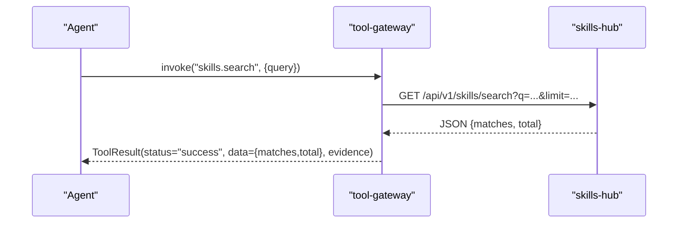
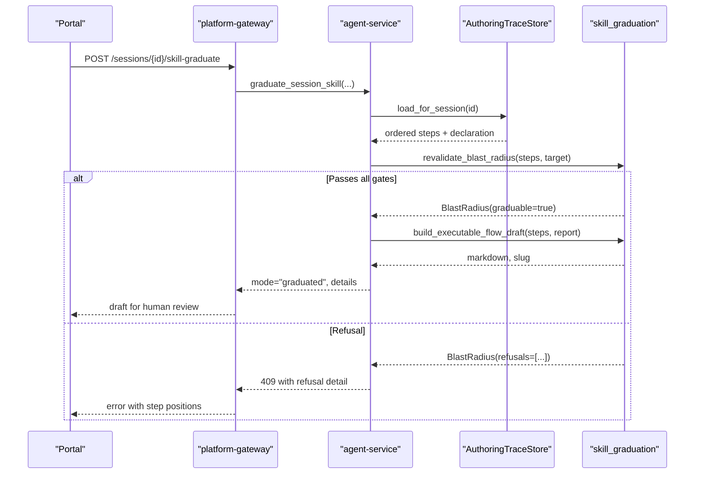
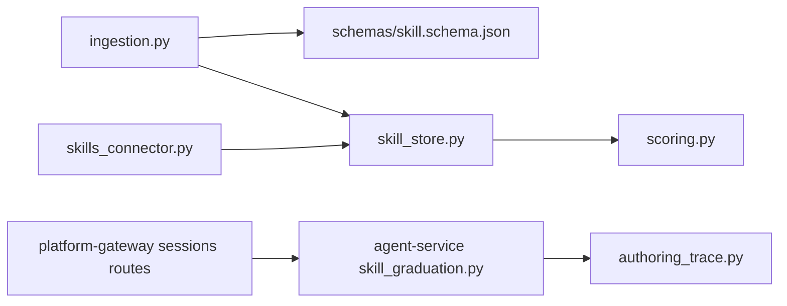

# Skills and Operational Guidance

<cite>
**Referenced Files in This Document**
- [skill-format.md](file://shared/shared-contracts/skill-format.md)
- [skills-guide.md](file://docs/guides/skills-guide.md)
- [validate.py](file://products/skills-hub/src/skills_hub/validate.py)
- [ingestion.py](file://products/skills-hub/src/skills_hub/services/ingestion.py)
- [scoring.py](file://products/skills-hub/src/skills_hub/services/scoring.py)
- [skill_store.py](file://products/skills-hub/src/skills_hub/services/skill_store.py)
- [skills routes](file://products/skills-hub/src/skills_hub/api/routes/skills.py)
- [skills_connector.py](file://products/tool-gateway/src/tool_gateway/tools/skills_connector.py)
- [test_skills_connector.py](file://products/tool-gateway/tests/test_skills_connector.py)
- [skill_graduation.py](file://products/agent-platform/src/agent_service/services/skill_graduation.py)
- [authoring_trace.py](file://products/agent-platform/src/agent_service/services/authoring_trace.py)
- [sessions routes](file://products/platform-gateway/src/platform_gateway/api/routes/sessions.py)
- [gateway_service.py](file://products/platform-gateway/src/platform_gateway/services/gateway_service.py)
- [agent_client.py](file://products/platform-gateway/src/platform_gateway/services/agent_client.py)
- [SRE sample README](file://shared/platform-ops/skills/sre-alerting/README.md)
</cite>

## Table of Contents
1. [Introduction](#introduction)
2. [Project Structure](#project-structure)
3. [Core Components](#core-components)
4. [Architecture Overview](#architecture-overview)
5. [Detailed Component Analysis](#detailed-component-analysis)
6. [Dependency Analysis](#dependency-analysis)
7. [Performance Considerations](#performance-considerations)
8. [Troubleshooting Guide](#troubleshooting-guide)
9. [Conclusion](#conclusion)
10. [Appendices](#appendices)

## Introduction
This document explains the skills system that enables team-owned operational guidance in Markdown format. It covers the complete lifecycle from authoring drafts through validation, testing, graduation to production, and consumption by agents during operations. It also documents the skill format specification, the skills-hub service that ingests and serves skills, the graduation workflow with quality gates, common patterns, best practices, and integration with the agent runtime for grounded responses.

## Project Structure
The skills system spans several components:
- Skill format contract defines the Markdown + YAML frontmatter schema consumed by ingestion.
- skills-hub ingests skills from local directories or Git repositories, validates them, stores them, and exposes search/list/get endpoints.
- tool-gateway exposes read-only skills tools to agents (skills.search, skills.get, skills.list).
- agent-platform captures approved authoring traces and supports drafting and graduating executable-flow skills.
- platform-gateway enforces policy and proxies draft/graduation requests to the agent service.

**Diagram sources**
- [ingestion.py:476-559](file://products/skills-hub/src/skills_hub/services/ingestion.py#L476-L559)
- [skill_store.py:158-200](file://products/skills-hub/src/skills_hub/services/skill_store.py#L158-L200)
- [scoring.py:33-97](file://products/skills-hub/src/skills_hub/services/scoring.py#L33-L97)
- [skills_connector.py:219-250](file://products/tool-gateway/src/tool_gateway/tools/skills_connector.py#L219-L250)
- [skill_graduation.py:587-664](file://products/agent-platform/src/agent_service/services/skill_graduation.py#L587-L664)
- [sessions routes:267-322](file://products/platform-gateway/src/platform_gateway/api/routes/sessions.py#L267-L322)

**Section sources**
- [skills-guide.md:12-35](file://docs/guides/skills-guide.md#L12-L35)
- [skill-store.py:1-67](file://products/skills-hub/src/skills_hub/services/skill_store.py#L1-L67)

## Core Components
- Skill Format v2: Markdown with YAML frontmatter; optional executable-flow steps; strict validation rules and size caps.
- Ingestion pipeline: walks source directories, parses frontmatter, validates against the contract, builds records, and returns rejections.
- Store backends: in-memory for dev/test; PostgreSQL for production with full-text search index and per-source atomic replacement.
- Search and ranking: deterministic keyword scoring with title/tag/body weights and bounded excerpts.
- Agent tools: read-only skills tools exposed via tool-gateway, returning ranked matches and evidence.
- Graduation: deterministic rendering of an approved authoring trace into an executable-flow skill draft with blast-radius re-validation and human merge.

**Section sources**
- [skill-format.md:1-203](file://shared/shared-contracts/skill-format.md#L1-L203)
- [ingestion.py:1-113](file://products/skills-hub/src/skills_hub/services/ingestion.py#L1-L113)
- [skill_store.py:158-200](file://products/skills-hub/src/skills_hub/services/skill_store.py#L158-L200)
- [scoring.py:1-97](file://products/skills-hub/src/skills_hub/services/scoring.py#L1-L97)
- [skills_connector.py:219-250](file://products/tool-gateway/src/tool_gateway/tools/skills_connector.py#L219-L250)
- [skill_graduation.py:1-42](file://products/agent-platform/src/agent_service/services/skill_graduation.py#L1-L42)

## Architecture Overview
Skills flow from team-authored Markdown into a validated catalog, then are consumed by agents through gateway tools. Executable flows can be graduated from approved session traces into production-ready skills after quality gates.

**Diagram sources**
- [ingestion.py:476-559](file://products/skills-hub/src/skills_hub/services/ingestion.py#L476-L559)
- [skill_store.py:417-443](file://products/skills-hub/src/skills_hub/services/skill_store.py#L417-L443)
- [skills routes:99-146](file://products/skills-hub/src/skills_hub/api/routes/skills.py#L99-L146)
- [skills_connector.py:219-250](file://products/tool-gateway/src/tool_gateway/tools/skills_connector.py#L219-L250)
- [skill_graduation.py:217-497](file://products/agent-platform/src/agent_service/services/skill_graduation.py#L217-L497)
- [sessions routes:267-322](file://products/platform-gateway/src/platform_gateway/api/routes/sessions.py#L267-L322)

## Detailed Component Analysis

### Skill Format Specification
- Frontmatter keys include title, description, tags, version, source_url, web_target, risk_class, flow_intent, kind, steps. Unknown keys are rejected.
- Size caps: body ≤ 64 KiB; description ≤ 500 chars; ≤ 10 tags; steps ≤ 200 and ≤ 64 KiB serialized.
- Identity: skill_id = <source_id>/<slug>, slug derived from file path; duplicate slugs within one source are rejected; README.md and NOTICE files are skipped.
- Executable-flow class: kind=executable_flow requires non-empty steps and risk_class=write; any web.* step requires web_target; credential values must be references, never literals.

**Diagram sources**
- [skill-format.md:31-147](file://shared/shared-contracts/skill-format.md#L31-L147)
- [ingestion.py:149-276](file://products/skills-hub/src/skills_hub/services/ingestion.py#L149-L276)
- [ingestion.py:375-460](file://products/skills-hub/src/skills_hub/services/ingestion.py#L375-L460)

**Section sources**
- [skill-format.md:31-147](file://shared/shared-contracts/skill-format.md#L31-L147)
- [ingestion.py:149-276](file://products/skills-hub/src/skills_hub/services/ingestion.py#L149-L276)
- [ingestion.py:375-460](file://products/skills-hub/src/skills_hub/services/ingestion.py#L375-L460)

### Ingestion and Validation Pipeline
- The CLI uses the same code path as sync time: python -m skills_hub.validate <directory>.
- ingest_directory walks *.md files, skips hidden segments and base names, derives slugs, validates frontmatter and steps, deduplicates slugs per source, and builds Skill records.
- Rejections are reported per document with reasons; accepted records form a snapshot replaced atomically per source.

**Diagram sources**
- [ingestion.py:476-559](file://products/skills-hub/src/skills_hub/services/ingestion.py#L476-L559)
- [validate.py:23-43](file://products/skills-hub/src/skills_hub/validate.py#L23-L43)

**Section sources**
- [validate.py:1-48](file://products/skills-hub/src/skills_hub/validate.py#L1-L48)
- [ingestion.py:476-559](file://products/skills-hub/src/skills_hub/services/ingestion.py#L476-L559)

### Search, Ranking, and Retrieval API
- Search endpoint: GET /api/v1/skills/search?q=... with optional source/tag filters and capped limit.
- Ranking is deterministic: tokenized query scored against title (×3), tags (×2), body occurrences (×1, capped). Zero-score results excluded; ties broken by skill_id ascending.
- Postgres backend pre-filters candidates using tsvector and re-ranks in Python to match in-memory behavior.

**Diagram sources**
- [scoring.py:28-97](file://products/skills-hub/src/skills_hub/services/scoring.py#L28-L97)
- [skill_store.py:137-145](file://products/skills-hub/src/skills_hub/services/skill_store.py#L137-L145)
- [skill_store.py:417-443](file://products/skills-hub/src/skills_hub/services/skill_store.py#L417-L443)

**Section sources**
- [skills routes:99-146](file://products/skills-hub/src/skills_hub/api/routes/skills.py#L99-L146)
- [scoring.py:1-97](file://products/skills-hub/src/skills_hub/services/scoring.py#L1-L97)
- [skill_store.py:158-200](file://products/skills-hub/src/skills_hub/services/skill_store.py#L158-L200)

### Agent Consumption via tool-gateway
- tool-gateway registers three read-only skills tools: skills.search, skills.get, skills.list.
- On success, returns ToolResult with data and evidence; transport errors return TOOL_EXECUTION_ERROR.
- Tests assert registered tool names, risk_level=read, category=skills, and projected match keys.

**Diagram sources**
- [skills_connector.py:219-250](file://products/tool-gateway/src/tool_gateway/tools/skills_connector.py#L219-L250)
- [test_skills_connector.py:87-135](file://products/tool-gateway/tests/test_skills_connector.py#L87-L135)

**Section sources**
- [skills_connector.py:219-250](file://products/tool-gateway/src/tool_gateway/tools/skills_connector.py#L219-L250)
- [test_skills_connector.py:87-135](file://products/tool-gateway/tests/test_skills_connector.py#L87-L135)

### Graduation Workflow and Quality Gates
- Draft creation: agent-service builds a validated skill draft from a session or incident; validation runs on skills-hub’s code path before returning.
- Graduation: deterministic rendering of an approved authoring trace into an executable-flow skill draft with blast-radius re-validation.
- Quality gates enforced at graduation:
  - Step budget check against replay budget.
  - Origin allowlist: every observed browser step origin must match declared target origin.
  - Consistent risk_class=write for executable flows; no read-tier steps in write-class traces.
  - Credential holes refused; secret-literal shapes refused.
  - Steps serialize within capacity limits.
- Human-in-the-loop: the platform never auto-publishes executable mutating skills; operators review and merge into their Git skills repo.

**Diagram sources**
- [skill_graduation.py:217-497](file://products/agent-platform/src/agent_service/services/skill_graduation.py#L217-L497)
- [skill_graduation.py:587-664](file://products/agent-platform/src/agent_service/services/skill_graduation.py#L587-L664)
- [sessions routes:267-322](file://products/platform-gateway/src/platform_gateway/api/routes/sessions.py#L267-L322)
- [gateway_service.py:607-613](file://products/platform-gateway/src/platform_gateway/services/gateway_service.py#L607-L613)

**Section sources**
- [skill_graduation.py:1-42](file://products/agent-platform/src/agent_service/services/skill_graduation.py#L1-L42)
- [skill_graduation.py:217-497](file://products/agent-platform/src/agent_service/services/skill_graduation.py#L217-L497)
- [skill_graduation.py:587-664](file://products/agent-platform/src/agent_service/services/skill_graduation.py#L587-L664)
- [sessions routes:267-322](file://products/platform-gateway/src/platform_gateway/api/routes/sessions.py#L267-L322)

### Authoring Best Practices and Common Patterns
- Knowledge skills: Markdown runbooks with frontmatter; ideal for procedural guidance without execution.
- Web-check skills: declare web_target and risk_class=read for browser-driven checks; no steps needed.
- Executable-flow skills: kind=executable_flow with steps; risk_class=write; web.* steps require web_target; credentials referenced via named sets.
- Adapted open-source content: keep source_url pointing upstream and include NOTICE with project, URL, license.
- Tagging: tag alert runbooks with alert names to enable alert→runbook lookups.

**Section sources**
- [skill-format.md:31-147](file://shared/shared-contracts/skill-format.md#L31-L147)
- [skills-guide.md:37-84](file://docs/guides/skills-guide.md#L37-L84)
- [SRE sample README:1-31](file://shared/platform-ops/skills/sre-alerting/README.md#L1-L31)

### Integration with Agent Runtime for Grounded Responses
- Agents consume skills through read-only tools; successful tool calls surface cited guidance chips in the portal.
- Evidence panels capture reads and provenance; search results include excerpt and full provenance for citations.
- For executable flows, graduation produces a draft that operators merge into a skills repo; ingestion validates it and makes it available for grounding and replay under policy.

**Section sources**
- [skills-guide.md:294-336](file://docs/guides/skills-guide.md#L294-L336)
- [skills routes:99-146](file://products/skills-hub/src/skills_hub/api/routes/skills.py#L99-L146)
- [skills_connector.py:219-250](file://products/tool-gateway/src/tool_gateway/tools/skills_connector.py#L219-L250)

## Dependency Analysis
- skills-hub depends on:
  - Ingestion module for parsing and validating skills.
  - Scorer for deterministic ranking.
  - Store backends (in-memory or PostgreSQL) for persistence and retrieval.
- tool-gateway depends on skills-hub via HTTP for skills tools.
- agent-platform depends on authoring trace store and graduation logic to produce executable-flow drafts.
- platform-gateway enforces policy and proxies to agent-service for draft/graduation endpoints.

**Diagram sources**
- [ingestion.py:1-113](file://products/skills-hub/src/skills_hub/services/ingestion.py#L1-L113)
- [skill_store.py:1-67](file://products/skills-hub/src/skills_hub/services/skill_store.py#L1-L67)
- [scoring.py:1-97](file://products/skills-hub/src/skills_hub/services/scoring.py#L1-L97)
- [skills_connector.py:219-250](file://products/tool-gateway/src/tool_gateway/tools/skills_connector.py#L219-L250)
- [sessions routes:267-322](file://products/platform-gateway/src/platform_gateway/api/routes/sessions.py#L267-L322)
- [skill_graduation.py:587-664](file://products/agent-platform/src/agent_service/services/skill_graduation.py#L587-L664)
- [authoring_trace.py:1-48](file://products/agent-platform/src/agent_service/services/authoring_trace.py#L1-L48)

**Section sources**
- [skill_store.py:1-67](file://products/skills-hub/src/skills_hub/services/skill_store.py#L1-L67)
- [skills_connector.py:219-250](file://products/tool-gateway/src/tool_gateway/tools/skills_connector.py#L219-L250)
- [skill_graduation.py:587-664](file://products/agent-platform/src/agent_service/services/skill_graduation.py#L587-L664)
- [authoring_trace.py:1-48](file://products/agent-platform/src/agent_service/services/authoring_trace.py#L1-L48)

## Performance Considerations
- Search performance: Postgres uses GIN tsvector index on title||body; tags filtered separately due to STABLE functions; final ranking done in Python for determinism.
- Limits: search limit capped at 20; list limit capped at 100; excerpts bounded to 400 chars; steps capped at 200 and 64 KiB serialized.
- Ingestion: atomic per-source replacement ensures readers always see consistent snapshots; failed syncs do not poison healthy sources.
- Graduation: blast-radius checks run before rendering to avoid producing un-replayable artifacts; large arguments elided in runbook to respect body cap.

[No sources needed since this section provides general guidance]

## Troubleshooting Guide
- New/revised skill not visible: wait one sync interval or restart deployment; verify ConfigMap wiring for local sources.
- Source reports rejections: inspect status endpoint for per-document reasons; fix frontmatter or steps per contract.
- Git source errors mention auth or subpath: update SKILLS_GIT_TOKENS or correct configured path; previous snapshot remains served.
- Search returns no matches: use skills.list to confirm existence; check status and sync outcomes.
- kustomize build fails: align kustomization.yaml keys with actual files under skills directory.
- Agent claims no skills exist: verify GATEWAY_SKILLS_SERVICE_URL and query-secret match.

**Section sources**
- [skills-guide.md:338-374](file://docs/guides/skills-guide.md#L338-L374)

## Conclusion
The skills system provides a robust, team-owned operational guidance model with clear contracts, deterministic ingestion and search, safe agent consumption, and a high-trust graduation pathway for executable flows. By enforcing strict validation, blast-radius re-validation, and human-in-the-loop merges, it balances agility with safety, enabling grounded responses during operations while preserving auditability and reproducibility.

[No sources needed since this section summarizes without analyzing specific files]

## Appendices

### Skill Lifecycle Summary
- Authoring: create Markdown skill with frontmatter; validate locally with CLI.
- Ingestion: skills-hub syncs sources, validates documents, stores records.
- Consumption: agents call skills tools; results include provenance and excerpts.
- Graduation: approve session trace, re-validate blast radius, render draft, merge into repo.
- Production: merged skill ingested and available for grounding and replay under policy.

**Section sources**
- [skills-guide.md:12-35](file://docs/guides/skills-guide.md#L12-L35)
- [skill-format.md:1-203](file://shared/shared-contracts/skill-format.md#L1-L203)
- [skill_graduation.py:217-497](file://products/agent-platform/src/agent_service/services/skill_graduation.py#L217-L497)