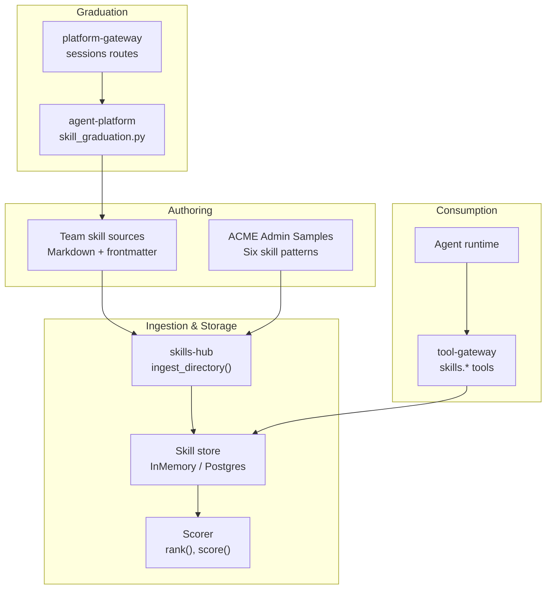
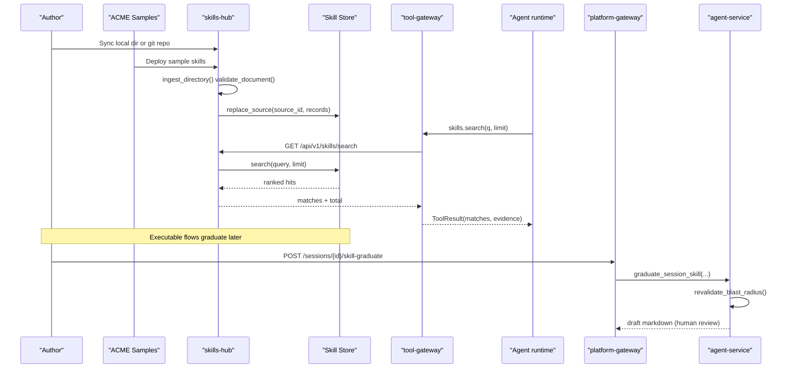
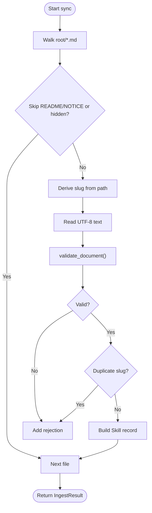
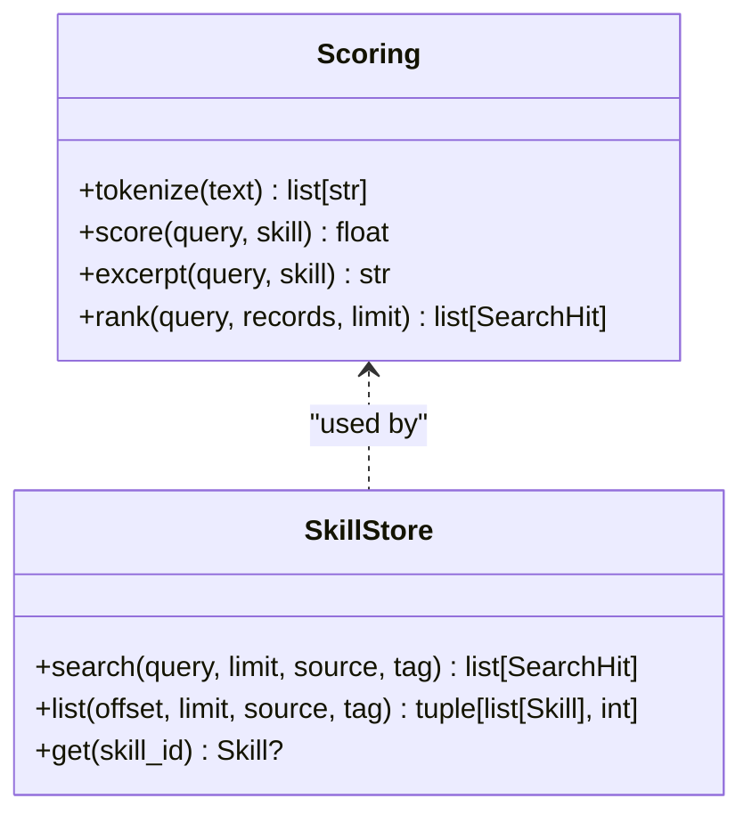
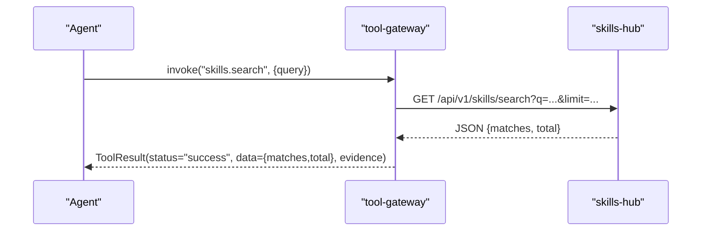
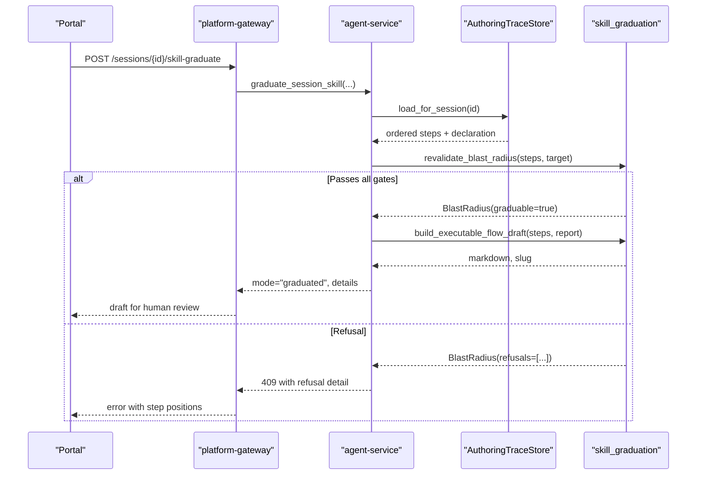
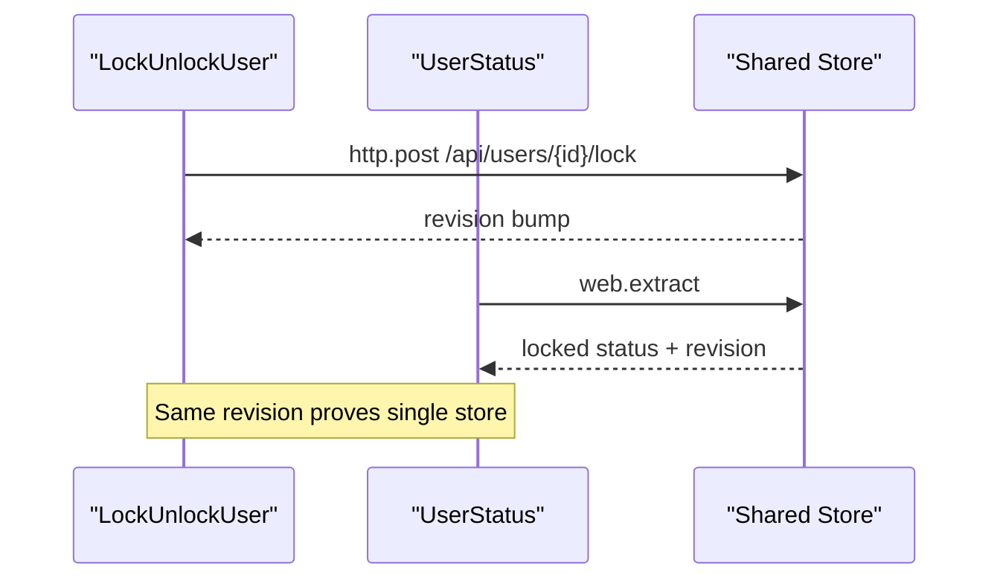
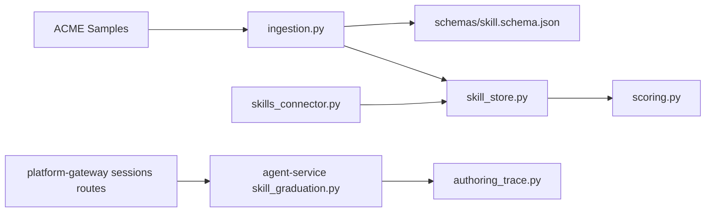

# Skills and Operational Guidance

<cite>
**Referenced Files in This Document**
- [skill-format.md](file://shared/shared-contracts/skill-format.md)
- [skills-guide.md](file://docs/guides/skills-guide.md)
- [validate.py](file://products/skills-hub/src/skills_hub/validate.py)
- [ingestion.py](file://products/skills-hub/src/skills_hub/services/ingestion.py)
- [scoring.py](file://products/skills-hub/src/skills_hub/services/scoring.py)
- [skill_store.py](file://products/skills-hub/src/skills_hub/services/skill_store.py)
- [skills routes](file://products/skills-hub/src/skills_hub/api/routes/skills.py)
- [skills_connector.py](file://products/tool-gateway/src/tool_gateway/tools/skills_connector.py)
- [test_skills_connector.py](file://products/tool-gateway/tests/test_skills_connector.py)
- [skill_graduation.py](file://products/agent-platform/src/agent_service/services/skill_graduation.py)
- [authoring_trace.py](file://products/agent-platform/src/agent_service/services/authoring_trace.py)
- [sessions routes](file://products/platform-gateway/src/platform_gateway/api/routes/sessions.py)
- [gateway_service.py](file://products/platform-gateway/src/platform_gateway/services/gateway_service.py)
- [SRE sample README](file://shared/platform-ops/skills/sre-alerting/README.md)
- [ACME Admin README](file://samples/acme-admin/README.md)
- [health-check skill](file://samples/acme-admin/health-check/skill/CheckServiceHealth.md)
- [user-status skill](file://samples/acme-admin/user-status/skill/CheckUserStatus.md)
- [lock-unlock-user skill](file://samples/acme-admin/lock-unlock-user/skill/LockUnlockUser.md)
- [password-reset skill](file://samples/acme-admin/password-reset/skill/ResetAcmePassword.md)
- [adhoc-password-reset skill](file://samples/acme-admin/adhoc-password-reset/skill/ResetPasswordAdHoc.md)
- [demo-suite.sh](file://samples/acme-admin/demo-suite.sh)
</cite>

## Update Summary
**Changes Made**
- Updated ACME Admin sample application documentation to include the newly migrated `adhoc-password-reset` and `skill-graduation` samples that were moved from `samples/web-checks/` to `samples/acme-admin/`
- Enhanced the four-rung ladder with two additional approval model samples demonstrating ad-hoc per-action approval and develop-as-you-go graduation workflows
- Updated skill pattern examples to include both bound flow and unbound per-action approval models
- Reflected the retirement of the `web-checks` category while maintaining browser-check-target for platform consumers
- Added comprehensive documentation for the complete approval model triad: flow cards, action cards, and graduation workflow

## Table of Contents
1. [Introduction](#introduction)
2. [Project Structure](#project-structure)
3. [Core Components](#core-components)
4. [Architecture Overview](#architecture-overview)
5. [Detailed Component Analysis](#detailed-component-analysis)
6. [Dependency Analysis](#dependency-analysis)
7. [Performance Considerations](#performance-considerations)
8. [Troubleshooting Guide](#troubleshooting-guide)
9. [Conclusion](#conclusion)
10. [Appendices](#appendices)

## Introduction
This document explains the skills system that enables team-owned operational guidance in Markdown format. It covers the complete lifecycle from authoring drafts through validation, testing, graduation to production, and consumption by agents during operations. It also documents the skill format specification, the skills-hub service that ingests and serves skills, the graduation workflow with quality gates, common patterns, best practices, and integration with the agent runtime for grounded responses.

The system now includes comprehensive examples through the ACME Admin sample application, which demonstrates a complete approval model triad: health checks (read-only HTTP), user status verification (browser-based read), user account locking (action card), password resets (flow card), ad-hoc per-action approval, and develop-as-you-go skill graduation. These examples provide concrete implementations of abstract concepts and serve as templates for creating new skills.

## Project Structure
The skills system spans several components:
- Skill format contract defines the Markdown + YAML frontmatter schema consumed by ingestion.
- skills-hub ingests skills from local directories or Git repositories, validates them, stores them, and exposes search/list/get endpoints.
- tool-gateway exposes read-only skills tools to agents (skills.search, skills.get, skills.list).
- agent-platform captures approved authoring traces and supports drafting and graduating executable-flow skills.
- platform-gateway enforces policy and proxies draft/graduation requests to the agent service.
- ACME Admin sample application provides six complete skill examples demonstrating different approval models and patterns.



**Diagram sources**
- [ingestion.py:476-559](file://products/skills-hub/src/skills_hub/services/ingestion.py#L476-L559)
- [skill_store.py:158-200](file://products/skills-hub/src/skills_hub/services/skill_store.py#L158-L200)
- [scoring.py:33-97](file://products/skills-hub/src/skills_hub/services/scoring.py#L33-L97)
- [skills_connector.py:219-250](file://products/tool-gateway/src/tool_gateway/tools/skills_connector.py#L219-L250)
- [skill_graduation.py:587-664](file://products/agent-platform/src/agent_service/services/skill_graduation.py#L587-L664)
- [sessions routes:267-322](file://products/platform-gateway/src/platform_gateway/api/routes/sessions.py#L267-L322)

**Section sources**
- [skills-guide.md:12-35](file://docs/guides/skills-guide.md#L12-L35)
- [skill-store.py:1-67](file://products/skills-hub/src/skills_hub/services/skill_store.py#L1-L67)
- [ACME Admin README:18-36](file://samples/acme-admin/README.md#L18-L36)

## Core Components
- Skill Format v2: Markdown with YAML frontmatter; optional executable-flow steps; strict validation rules and size caps.
- Ingestion pipeline: walks source directories, parses frontmatter, validates against the contract, builds records, and returns rejections.
- Store backends: in-memory for dev/test; PostgreSQL for production with full-text search index and per-source atomic replacement.
- Search and ranking: deterministic keyword scoring with title/tag/body weights and bounded excerpts.
- Agent tools: read-only skills tools exposed via tool-gateway, returning ranked matches and evidence.
- Graduation: deterministic rendering of an approved authoring trace into an executable-flow skill draft with blast-radius re-validation and human merge.
- Sample applications: ACME Admin provides six complete skill examples demonstrating different approval models including flow cards, action cards, and graduation workflows.

**Section sources**
- [skill-format.md:1-203](file://shared/shared-contracts/skill-format.md#L1-L203)
- [ingestion.py:1-113](file://products/skills-hub/src/skills_hub/services/ingestion.py#L1-L113)
- [skill_store.py:158-200](file://products/skills-hub/src/skills_hub/services/skill_store.py#L158-L200)
- [scoring.py:1-97](file://products/skills-hub/src/skills_hub/services/scoring.py#L1-L97)
- [skills_connector.py:219-250](file://products/tool-gateway/src/tool_gateway/tools/skills_connector.py#L219-L250)
- [skill_graduation.py:1-42](file://products/agent-platform/src/agent_service/services/skill_graduation.py#L1-L42)

## Architecture Overview
Skills flow from team-authored Markdown into a validated catalog, then are consumed by agents through gateway tools. Executable flows can be graduated from approved session traces into production-ready skills after quality gates. The ACME Admin sample demonstrates how different approval models integrate with this architecture.



**Diagram sources**
- [ingestion.py:476-559](file://products/skills-hub/src/skills_hub/services/ingestion.py#L476-L559)
- [skill_store.py:417-443](file://products/skills-hub/src/skills_hub/services/skill_store.py#L417-L443)
- [skills routes:99-146](file://products/skills-hub/src/skills_hub/api/routes/skills.py#L99-L146)
- [skills_connector.py:219-250](file://products/tool-gateway/src/tool_gateway/tools/skills_connector.py#L219-L250)
- [skill_graduation.py:217-497](file://products/agent-platform/src/agent_service/services/skill_graduation.py#L217-L497)
- [sessions routes:267-322](file://products/platform-gateway/src/platform_gateway/api/routes/sessions.py#L267-L322)

## Detailed Component Analysis

### Skill Format Specification
- Frontmatter keys include title, description, tags, version, source_url, web_target, risk_class, flow_intent, kind, steps. Unknown keys are rejected.
- Size caps: body ≤ 64 KiB; description ≤ 500 chars; ≤ 10 tags; steps ≤ 200 and ≤ 64 KiB serialized.
- Identity: skill_id = <source_id>/<slug>, slug derived from file path; duplicate slugs within one source are rejected; README.md and NOTICE files are skipped.
- Executable-flow class: kind=executable_flow requires non-empty steps and risk_class=write; any web.* step requires web_target; credential values must be references, never literals.


**Diagram sources**
- [skill-format.md:31-147](file://shared/shared-contracts/skill-format.md#L31-L147)
- [ingestion.py:149-276](file://products/skills-hub/src/skills_hub/services/ingestion.py#L149-L276)
- [ingestion.py:375-460](file://products/skills-hub/src/skills_hub/services/ingestion.py#L375-L460)

**Section sources**
- [skill-format.md:31-147](file://shared/shared-contracts/skill-format.md#L31-L147)
- [ingestion.py:149-276](file://products/skills-hub/src/skills_hub/services/ingestion.py#L149-L276)
- [ingestion.py:375-460](file://products/skills-hub/src/skills_hub/services/ingestion.py#L375-L460)

### Ingestion and Validation Pipeline
- The CLI uses the same code path as sync time: python -m skills_hub.validate <directory>.
- ingest_directory walks *.md files, skips hidden segments and base names, derives slugs, validates frontmatter and steps, deduplicates slugs per source, and builds Skill records.
- Rejections are reported per document with reasons; accepted records form a snapshot replaced atomically per source.



**Diagram sources**
- [ingestion.py:476-559](file://products/skills-hub/src/skills_hub/services/ingestion.py#L476-L559)
- [validate.py:23-43](file://products/skills-hub/src/skills_hub/validate.py#L23-L43)

**Section sources**
- [validate.py:1-48](file://products/skills-hub/src/skills_hub/validate.py#L1-L48)
- [ingestion.py:476-559](file://products/skills-hub/src/skills_hub/services/ingestion.py#L476-L559)

### Search, Ranking, and Retrieval API
- Search endpoint: GET /api/v1/skills/search?q=... with optional source/tag filters and capped limit.
- Ranking is deterministic: tokenized query scored against title (×3), tags (×2), body occurrences (×1, capped). Zero-score results excluded; ties broken by skill_id ascending.
- Postgres backend pre-filters candidates using tsvector and re-ranks in Python to match in-memory behavior.



**Diagram sources**
- [scoring.py:28-97](file://products/skills-hub/src/skills_hub/services/scoring.py#L28-L97)
- [skill_store.py:137-145](file://products/skills-hub/src/skills_hub/services/skill_store.py#L137-L145)
- [skill_store.py:417-443](file://products/skills-hub/src/skills_hub/services/skill_store.py#L417-L443)

**Section sources**
- [skills routes:99-146](file://products/skills-hub/src/skills_hub/api/routes/skills.py#L99-L146)
- [scoring.py:1-97](file://products/skills-hub/src/skills_hub/services/scoring.py#L1-L97)
- [skill_store.py:158-200](file://products/skills-hub/src/skills_hub/services/skill_store.py#L158-L200)

### Agent Consumption via tool-gateway
- tool-gateway registers three read-only skills tools: skills.search, skills.get, skills.list.
- On success, returns ToolResult with data and evidence; transport errors return TOOL_EXECUTION_ERROR.
- Tests assert registered tool names, risk_level=read, category=skills, and projected match keys.



**Diagram sources**
- [skills_connector.py:219-250](file://products/tool-gateway/src/tool_gateway/tools/skills_connector.py#L219-L250)
- [test_skills_connector.py:87-135](file://products/tool-gateway/tests/test_skills_connector.py#L87-L135)

**Section sources**
- [skills_connector.py:219-250](file://products/tool-gateway/src/tool_gateway/tools/skills_connector.py#L219-L250)
- [test_skills_connector.py:87-135](file://products/tool-gateway/tests/test_skills_connector.py#L87-L135)

### Graduation Workflow and Quality Gates
- Draft creation: agent-service builds a validated skill draft from a session or incident; validation runs on skills-hub's code path before returning.
- Graduation: deterministic rendering of an approved authoring trace into an executable-flow skill draft with blast-radius re-validation.
- Quality gates enforced at graduation:
  - Step budget check against replay budget.
  - Origin allowlist: every observed browser step origin must match declared target origin.
  - Consistent risk_class=write for executable flows; no read-tier steps in write-class traces.
  - Credential holes refused; secret-literal shapes refused.
  - Steps serialize within capacity limits.
- Human-in-the-loop: the platform never auto-publishes executable mutating skills; operators review and merge into their Git skills repo.



**Diagram sources**
- [skill_graduation.py:217-497](file://products/agent-platform/src/agent_service/services/skill_graduation.py#L217-L497)
- [skill_graduation.py:587-664](file://products/agent-platform/src/agent_service/services/skill_graduation.py#L587-L664)
- [sessions routes:267-322](file://products/platform-gateway/src/platform_gateway/api/routes/sessions.py#L267-L322)
- [gateway_service.py:607-613](file://products/platform-gateway/src/platform_gateway/services/gateway_service.py#L607-L613)

**Section sources**
- [skill_graduation.py:1-42](file://products/agent-platform/src/agent_service/services/skill_graduation.py#L1-L42)
- [skill_graduation.py:217-497](file://products/agent-platform/src/agent_service/services/skill_graduation.py#L217-L497)
- [skill_graduation.py:587-664](file://products/agent-platform/src/agent_service/services/skill_graduation.py#L587-L664)
- [sessions routes:267-322](file://products/platform-gateway/src/platform_gateway/api/routes/sessions.py#L267-L322)

### ACME Admin Sample Application and Approval Model Triad

**Updated** Added comprehensive documentation for the ACME Admin sample application demonstrating the complete approval model triad with six distinct skill patterns that showcase different aspects of the skills system.

The ACME Admin sample application provides a complete demonstration of the skills system through six carefully designed skill patterns that form a progressive learning ladder covering the entire approval model spectrum:

#### Complete Approval Model Triad

| # | Sample | Surface | Effect | Cards | `approval_kind` | Pattern |
|---|---|---|---|---|---|---|
| 1 | [health-check](samples/acme-admin/health-check/) | `http.get` | read | **0** | — | Pure Read |
| 2 | [user-status](samples/acme-admin/user-status/) | bound browser flow | read | **0** | — | Browser Read |
| 3 | [lock-unlock-user](samples/acme-admin/lock-unlock-user/) | `http.post` | write | **1** | `action` | Action Card |
| 4 | [password-reset](samples/acme-admin/password-reset/) | bound browser flow | write | **1** | `flow` | Flow Card |
| 5 | [adhoc-password-reset](samples/acme-admin/adhoc-password-reset/) | unbound browser | write | N | `action` | Per-Action |
| 6 | [skill-graduation](samples/acme-admin/skill-graduation/) | none → graduated | write | N→1 | `action`→`flow` | Graduation |

#### Pattern 1: Health Check (Pure Read Operation)
The health-check skill demonstrates a purely read-only operation using HTTP GET calls to verify service health. Key characteristics:
- No `risk_class` or `web_target` declarations (purely API-based)
- Zero confirmation cards due to read-only effect
- Uses `http.get` tool with unauthenticated endpoints
- Demonstrates proper error handling for upstream 4xx/5xx responses

**Section sources**
- [health-check skill:1-158](file://samples/acme-admin/health-check/skill/CheckServiceHealth.md#L1-L158)
- [health-check README:1-142](file://samples/acme-admin/health-check/README.md#L1-L142)
- [health-check demo:1-178](file://samples/acme-admin/health-check/demo/demo.sh#L1-L178)

#### Pattern 2: User Status Check (Browser-Based Read)
The user-status skill shows how to perform read-only operations through a browser interface while maintaining zero confirmation cards:
- Declares `web_target` without `risk_class` (treated as read)
- Signs in using `web.fill_credential` (read tier)
- Uses `web.extract` to read rendered table data
- Demonstrates element ID contracts and stable selectors

**Section sources**
- [user-status skill:1-175](file://samples/acme-admin/user-status/skill/CheckUserStatus.md#L1-L175)
- [user-status README:1-150](file://samples/acme-admin/user-status/README.md#L1-L150)
- [user-status demo:1-185](file://samples/acme-admin/user-status/demo/demo.sh#L1-L185)

#### Pattern 3: Lock/Unlock User (Action Card)
The lock-unlock-user skill demonstrates write operations that require explicit approval through action cards:
- Declares `risk_class: write` without browser flow
- Parks exactly one `action` type confirmation card
- Uses `http.post` for direct API mutations
- Shows proper credential handling via `credential_set`

**Section sources**
- [lock-unlock-user skill:1-186](file://samples/acme-admin/lock-unlock-user/skill/LockUnlockUser.md#L1-L186)
- [lock-unlock-user README:1-152](file://samples/acme-admin/lock-unlock-user/README.md#L1-L152)

#### Pattern 4: Password Reset (Flow Card)
The password-reset skill demonstrates complex browser workflows requiring flow-level approval:
- Binds a browser flow with `web_target` and `risk_class: write`
- Parks one `flow` type confirmation card covering multiple interactions
- Uses `flow_intent` to describe the operator-facing intent
- Demonstrates one-time secret handling and cross-surface verification

**Section sources**
- [password-reset skill:1-222](file://samples/acme-admin/password-reset/skill/ResetAcmePassword.md#L1-L222)
- [password-reset README:1-171](file://samples/acme-admin/password-reset/README.md#L1-L171)

#### Pattern 5: Ad-Hoc Password Reset (Per-Action Approval)
The adhoc-password-reset skill demonstrates the unbound, per-action HITL approval model:
- **No `web_target` declaration** - intentionally stays unbound
- Each write-tier interaction parks its own per-action change-request card
- Uses `web.fill_credential` by reference (SPEC-054 R-2 relaxation)
- Demonstrates credential safety in unbound context
- Shows change-request projections with masked secrets

**Section sources**
- [adhoc-password-reset skill:1-230](file://samples/acme-admin/adhoc-password-reset/skill/ResetPasswordAdHoc.md#L1-L230)
- [adhoc-password-reset README:1-157](file://samples/acme-admin/adhoc-password-reset/README.md#L1-L157)

#### Pattern 6: Skill Graduation (Develop-as-You-Go)
The skill-graduation sample demonstrates the complete graduation workflow end-to-end:
- **No initial skill** - the skill is the artifact produced by the demo
- Authors ad-hoc with per-action approvals, then graduates to one-gate replay
- Captures authoring trace during ad-hoc work
- Re-validates blast radius and renders executable-flow draft
- Demonstrates human-in-the-loop merge process

**Section sources**
- [skill-graduation README:1-238](file://samples/acme-admin/skill-graduation/README.md#L1-L238)

#### Cross-Skill Verification
The demo suite demonstrates how mutations made through one skill can be verified through another, proving that both surfaces access the same underlying store:



**Diagram sources**
- [demo-suite.sh:139-224](file://samples/acme-admin/demo-suite.sh#L139-L224)

**Section sources**
- [ACME Admin README:18-36](file://samples/acme-admin/README.md#L18-L36)
- [demo-suite.sh:1-289](file://samples/acme-admin/demo-suite.sh#L1-L289)

### Integration with Agent Runtime for Grounded Responses
- Agents consume skills through read-only tools; successful tool calls surface cited guidance chips in the portal.
- Evidence panels capture reads and provenance; search results include excerpt and full provenance for citations.
- For executable flows, graduation produces a draft that operators merge into a skills repo; ingestion validates it and makes it available for grounding and replay under policy.
- ACME Admin samples demonstrate how different approval models integrate with the agent runtime, from simple health checks to complex browser workflows with multi-step approvals.

**Section sources**
- [skills-guide.md:294-336](file://docs/guides/skills-guide.md#L294-L336)
- [skills routes:99-146](file://products/skills-hub/src/skills_hub/api/routes/skills.py#L99-L146)
- [skills_connector.py:219-250](file://products/tool-gateway/src/tool_gateway/tools/skills_connector.py#L219-L250)

## Dependency Analysis
- skills-hub depends on:
  - Ingestion module for parsing and validating skills.
  - Scorer for deterministic ranking.
  - Store backends (in-memory or PostgreSQL) for persistence and retrieval.
- tool-gateway depends on skills-hub via HTTP for skills tools.
- agent-platform depends on authoring trace store and graduation logic to produce executable-flow drafts.
- platform-gateway enforces policy and proxies to agent-service for draft/graduation endpoints.
- ACME Admin samples depend on skills-hub for skill ingestion and tool-gateway for execution.



**Diagram sources**
- [ingestion.py:1-113](file://products/skills-hub/src/skills_hub/services/ingestion.py#L1-L113)
- [skill_store.py:1-67](file://products/skills-hub/src/skills_hub/services/skill_store.py#L1-L67)
- [scoring.py:1-97](file://products/skills-hub/src/skills_hub/services/scoring.py#L1-L97)
- [skills_connector.py:219-250](file://products/tool-gateway/src/tool_gateway/tools/skills_connector.py#L219-L250)
- [sessions routes:267-322](file://products/platform-gateway/src/platform_gateway/api/routes/sessions.py#L267-L322)
- [skill_graduation.py:587-664](file://products/agent-platform/src/agent_service/services/skill_graduation.py#L587-L664)
- [authoring_trace.py:1-48](file://products/agent-platform/src/agent_service/services/authoring_trace.py#L1-L48)

**Section sources**
- [skill_store.py:1-67](file://products/skills-hub/src/skills_hub/services/skill_store.py#L1-L67)
- [skills_connector.py:219-250](file://products/tool-gateway/src/tool_gateway/tools/skills_connector.py#L219-L250)
- [skill_graduation.py:587-664](file://products/agent-platform/src/agent_service/services/skill_graduation.py#L587-L664)
- [authoring_trace.py:1-48](file://products/agent-platform/src/agent_service/services/authoring_trace.py#L1-L48)

## Performance Considerations
- Search performance: Postgres uses GIN tsvector index on title||body; tags filtered separately due to STABLE functions; final ranking done in Python for determinism.
- Limits: search limit capped at 20; list limit capped at 100; excerpts bounded to 400 chars; steps capped at 200 and 64 KiB serialized.
- Ingestion: atomic per-source replacement ensures readers always see consistent snapshots; failed syncs do not poison healthy sources.
- Graduation: blast-radius checks run before rendering to avoid producing un-replayable artifacts; large arguments elided in runbook to respect body cap.
- ACME Admin samples demonstrate performance considerations including connection pooling, response caching, and efficient browser automation.

## Troubleshooting Guide
- New/revised skill not visible: wait one sync interval or restart deployment; verify ConfigMap wiring for local sources.
- Source reports rejections: inspect status endpoint for per-document reasons; fix frontmatter or steps per contract.
- Git source errors mention auth or subpath: update SKILLS_GIT_TOKENS or correct configured path; previous snapshot remains served.
- Search returns no matches: use skills.list to confirm existence; check status and sync outcomes.
- kustomize build fails: align kustomization.yaml keys with actual files under skills directory.
- Agent claims no skills exist: verify GATEWAY_SKILLS_SERVICE_URL and query-secret match.
- ACME Admin samples fail: check credential synchronization, browser sidecar status, and network policies.
- **Updated**: After web-checks migration, ensure all browser samples point to acme-admin instead of the retired static target.

**Section sources**
- [skills-guide.md:338-374](file://docs/guides/skills-guide.md#L338-L374)

## Conclusion
The skills system provides a robust, team-owned operational guidance model with clear contracts, deterministic ingestion and search, safe agent consumption, and a high-trust graduation pathway for executable flows. By enforcing strict validation, blast-radius re-validation, and human-in-the-loop merges, it balances agility with safety, enabling grounded responses during operations while preserving auditability and reproducibility.

The ACME Admin sample application enhances this foundation by providing concrete, working examples of the complete approval model triad—from simple health checks to complex browser workflows with multi-step approvals, ad-hoc per-action approval, and develop-as-you-go skill graduation. These samples serve as both educational resources and practical templates for creating new operational skills, demonstrating that the card count tracks the effect of a skill, not the surface it uses.

## Appendices

### Skill Lifecycle Summary
- Authoring: create Markdown skill with frontmatter; validate locally with CLI.
- Ingestion: skills-hub syncs sources, validates documents, stores records.
- Consumption: agents call skills tools; results include provenance and excerpts.
- Graduation: approve session trace, re-validate blast radius, render draft, merge into repo.
- Production: merged skill ingested and available for grounding and replay under policy.
- Testing: ACME Admin samples provide comprehensive test suites for each skill pattern.

**Section sources**
- [skills-guide.md:12-35](file://docs/guides/skills-guide.md#L12-L35)
- [skill-format.md:1-203](file://shared/shared-contracts/skill-format.md#L1-L203)
- [skill_graduation.py:217-497](file://products/agent-platform/src/agent_service/services/skill_graduation.py#L217-L497)

### ACME Admin Sample Deployment and Usage

**Updated** Added comprehensive deployment and usage instructions for the complete ACME Admin sample application including the newly migrated samples.

#### Prerequisites
- Platform deployed with browser-dev and mutating-dev runtime profiles
- ACME Admin application deployed (`make deploy-sample-app`)
- Browser credentials synchronized (`sync-browser-credentials.sh`)
- Skills installed (`make deploy-samples`)

#### Running the Demo Suite
```bash
# Run all six skill demonstrations in order
RUN_CHAT_LEG=true samples/acme-admin/demo-suite.sh

# Run individual skill demos
samples/acme-admin/health-check/demo/demo.sh
samples/acme-admin/user-status/demo/demo.sh
samples/acme-admin/lock-unlock-user/demo/demo.sh
samples/acme-admin/password-reset/demo/demo.sh
samples/acme-admin/adhoc-password-reset/demo/demo.sh
samples/acme-admin/skill-graduation/demo/demo.sh
```

#### Key Features Demonstrated
- **Zero-card read operations**: Health checks and user status verification
- **Action cards**: Single-operation mutations requiring explicit approval
- **Flow cards**: Complex browser workflows with multi-step approvals
- **Per-action approval**: Unbound browser interactions with individual gating
- **Skill graduation**: Develop-as-you-go workflow from ad-hoc to reusable flow
- **Cross-skill verification**: Proving mutations across different interfaces
- **Credential management**: Secure handling of secrets through credential sets
- **Error handling**: Proper treatment of upstream errors and edge cases

**Section sources**
- [ACME Admin README:38-77](file://samples/acme-admin/README.md#L38-L77)
- [ACME Admin README:232-250](file://samples/acme-admin/README.md#L232-L250)
- [demo-suite.sh:127-137](file://samples/acme-admin/demo-suite.sh#L127-L137)

### Common Skill Patterns Reference

**Updated** Enhanced common patterns section with concrete examples from the complete ACME Admin sample suite including the newly migrated samples.

#### Complete Pattern Categories

1. **Pure Read Operations** (Zero Cards)
   - HTTP GET calls to APIs
   - Browser-based reads with auto-submit forms
   - Examples: `CheckServiceHealth`, `CheckUserStatus`

2. **Single-Operation Mutations** (Action Cards)
   - Direct API calls that change state
   - Require explicit approval for each operation
   - Example: `LockUnlockUser`

3. **Complex Browser Workflows** (Flow Cards)
   - Multi-step browser interactions
   - One approval covers entire workflow
   - Example: `ResetAcmePassword`

4. **Unbound Per-Action Approval** (N Action Cards)
   - Interactive browser sessions without flow binding
   - Each write-tier interaction parks its own card
   - Example: `ResetPasswordAdHoc`

5. **Develop-as-You-Go Graduation** (N Action → 1 Flow)
   - Author ad-hoc, capture trace, graduate to reusable flow
   - Initial per-action approvals become one-gate replay
   - Example: `skill-graduation`

6. **Composition Patterns**
   - Combining multiple skills for complex operations
   - Cross-skill verification and state consistency
   - Demonstrated through demo suite

#### Best Practices from Samples

- **Separation of concerns**: Keep mutation and verification as separate skills
- **Proper error handling**: Treat upstream errors as findings, not failures
- **Credential management**: Use credential sets, never embed secrets
- **Element stability**: Assert element IDs from outside the application
- **Cross-surface verification**: Verify changes through multiple interfaces
- **Documentation**: Include comprehensive README and WALKTHROUGH files
- **Approval model selection**: Choose between flow, action, or per-action based on workflow complexity

**Section sources**
- [health-check README:63-89](file://samples/acme-admin/health-check/README.md#L63-L89)
- [user-status README:63-99](file://samples/acme-admin/user-status/README.md#L63-L99)
- [lock-unlock-user README:55-100](file://samples/acme-admin/lock-unlock-user/README.md#L55-L100)
- [password-reset README:80-121](file://samples/acme-admin/password-reset/README.md#L80-L121)
- [adhoc-password-reset README:60-104](file://samples/acme-admin/adhoc-password-reset/README.md#L60-L104)
- [skill-graduation README:96-169](file://samples/acme-admin/skill-graduation/README.md#L96-L169)

### Web-Checks Migration Notes

**Updated** Documentation reflecting the migration of samples from `samples/web-checks/` to `samples/acme-admin/`.

The `web-checks` category has been retired as part of SPEC-060, with the following changes:

- **Migrated samples**: `adhoc-password-reset` and `skill-graduation` moved to `samples/acme-admin/`
- **Retired sample**: Static `password-reset` sample removed (superseded by `acme-admin/password-reset`)
- **Platform consumers**: `browser-check-target` remains shipped for platform consumers only
- **Skill IDs**: Preserved for migrated samples to maintain backward compatibility
- **References**: All documentation and guides updated to point to new locations

The migration consolidates all browser samples under the stateful `acme-admin` application, ensuring every tutorial demonstrates against a target that really mutates and can be verified.

**Section sources**
- [SPEC-060 spec:47-80](file://docs/specs/SPEC-060-rebase-web-checks-samples-onto-acme-admin/spec.md#L47-L80)
- [SPEC-060 plan:1-101](file://docs/specs/SPEC-060-rebase-web-checks-samples-onto-acme-admin/plan.md#L1-L101)
- [release notes:59-80](file://docs/agentic-aiops-platform/release-notes/2026-09-19-web-checks-consolidation.md#L59-L80)