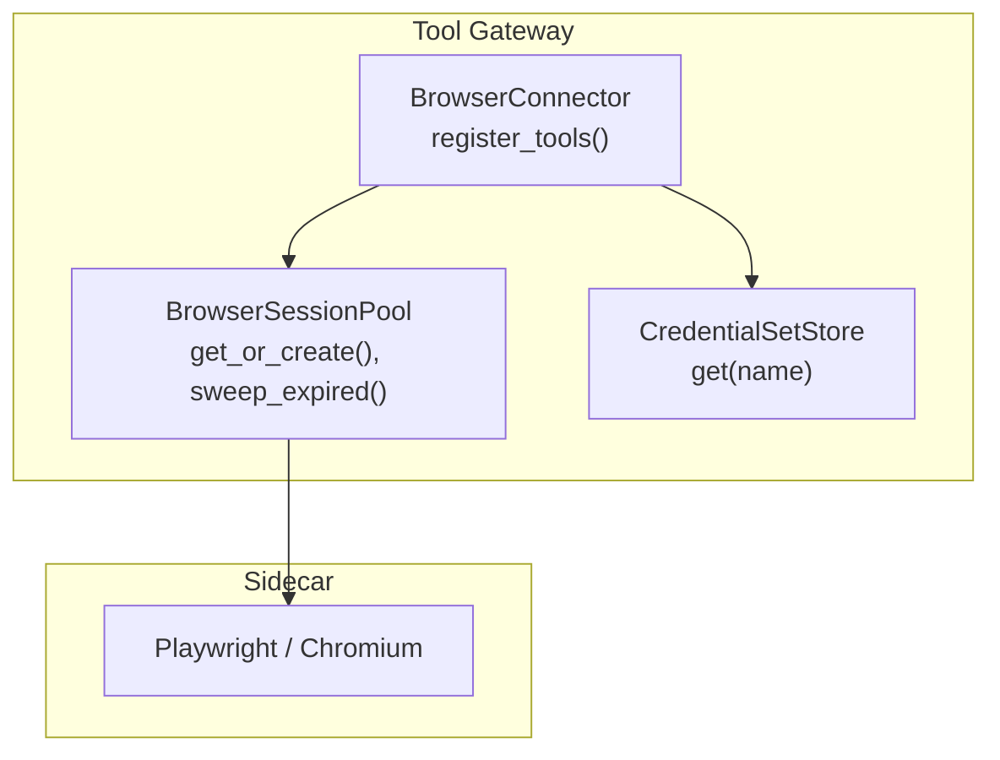
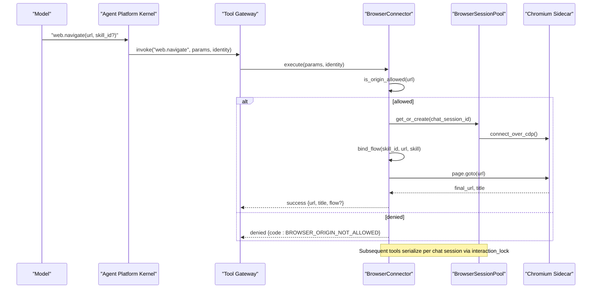
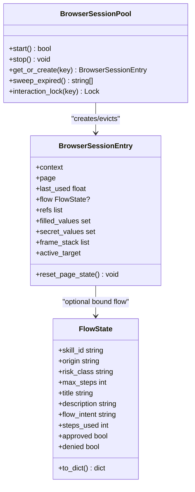
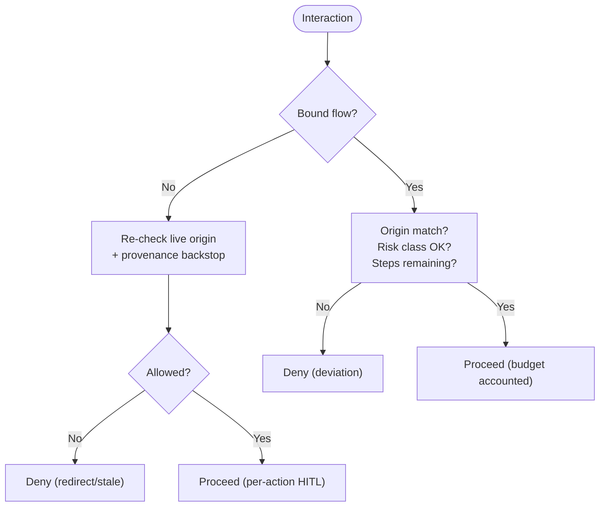
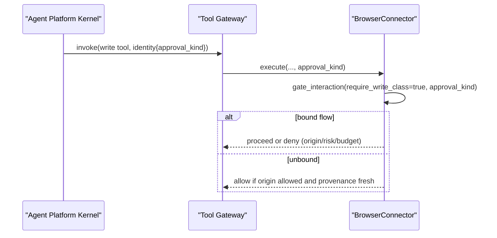
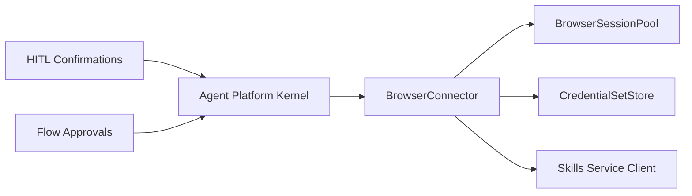

# Browser Connector

<cite>
**Referenced Files in This Document**
- [browser_connector.py](file://products/tool-gateway/src/tool_gateway/tools/browser_connector.py)
- [browser_sessions.py](file://products/tool-gateway/src/tool_gateway/tools/browser_sessions.py)
- [credential_sets.py](file://products/tool-gateway/src/tool_gateway/tools/credential_sets.py)
- [config.py](file://products/tool-gateway/src/tool_gateway/core/config.py)
- [test_browser_connector.py](file://products/tool-gateway/tests/test_browser_connector.py)
- [runtime_kernel.py](file://products/agent-platform/src/agent_service/runtime_kernel.py)
- [hitl_confirmations.py](file://products/agent-platform/src/agent_service/services/hitl_confirmations.py)
- [flow_approvals.py](file://products/agent-platform/src/agent_service/services/flow_approvals.py)
</cite>

## Table of Contents
1. Introduction
2. Project Structure
3. Core Components
4. Architecture Overview
5. Detailed Component Analysis
6. Dependency Analysis
7. Performance Considerations
8. Troubleshooting Guide
9. Conclusion
10. Appendices

## Introduction
This document describes the browser connector that provides bounded web automation through a headless Chromium sidecar reached via Chrome DevTools Protocol (CDP). It exposes a fixed tool surface split into read-tier and write-tier tools, enforces origin allowlists, binds flows to sessions with skill validation, manages credential sets, and handles session state safely under concurrent model calls. Security controls include step budgets, risk-class enforcement, deviation guards, and per-action approval for unbound interactions. Configuration knobs cover CDP endpoints, session limits, screenshot quality caps, upload directories, and flow budgets.

## Project Structure
The browser connector lives in the tool gateway and is composed of:
- A connector that registers tools and enforces policy surfaces
- A session pool managing one shared CDP connection and per-session contexts keyed by chat session id
- Credential set storage loaded from a secret-mounted JSON file
- Tool implementations for navigation, observation, interaction, evaluation, and frame control

**Diagram sources**
- [browser_connector.py:315-399](file://products/tool-gateway/src/tool_gateway/tools/browser_connector.py#L315-L399)
- [browser_sessions.py:169-344](file://products/tool-gateway/src/tool_gateway/tools/browser_sessions.py#L169-L344)
- [credential_sets.py:30-103](file://products/tool-gateway/src/tool_gateway/tools/credential_sets.py#L30-L103)

**Section sources**
- [browser_connector.py:1-61](file://products/tool-gateway/src/tool_gateway/tools/browser_connector.py#L1-L61)
- [browser_sessions.py:1-27](file://products/tool-gateway/src/tool_gateway/tools/browser_sessions.py#L1-L27)
- [credential_sets.py:1-17](file://products/tool-gateway/src/tool_gateway/tools/credential_sets.py#L1-L17)

## Core Components
- BrowserConnector: Registers all web.* tools, validates origins, resolves sessions, binds flows, and gates interactions/captures.
- BrowserSessionPool: Manages one Playwright host, connects over CDP, creates per-chat-session contexts, enforces TTL and max sessions, and serializes interactions per key.
- FlowState: Tracks bound skill_id, origin, risk_class, step budget, human-readable metadata, and approval accounting.
- BrowserSessionEntry: Holds page/frame target, refs, filled values, secret values, and frame stack.
- CredentialSetStore: Loads named credential sets from a mounted JSON file on mtime change; never logs or serializes secrets.

Key responsibilities:
- Origin allowlist enforcement before navigation and re-checks on captures and unbound writes.
- Flow binding at web.navigate with skill validation against skills-hub.
- Deviation guard enforcing origin match, risk class, and step budget inside bound flows.
- Per-action HITL gate for unbound write interactions.
- Screenshot masking of password-tier values and URL redaction for evidence.

**Section sources**
- [browser_connector.py:315-699](file://products/tool-gateway/src/tool_gateway/tools/browser_connector.py#L315-L699)
- [browser_sessions.py:61-167](file://products/tool-gateway/src/tool_gateway/tools/browser_sessions.py#L61-L167)
- [credential_sets.py:30-103](file://products/tool-gateway/src/tool_gateway/tools/credential_sets.py#L30-L103)

## Architecture Overview
End-to-end flow for a typical bounded web automation:

**Diagram sources**
- [browser_connector.py:730-863](file://products/tool-gateway/src/tool_gateway/tools/browser_connector.py#L730-L863)
- [browser_sessions.py:240-344](file://products/tool-gateway/src/tool_gateway/tools/browser_sessions.py#L240-L344)

## Detailed Component Analysis

### Tool Surface
Read-tier tools (auto-allowed when origin and flow rules permit):
- web.navigate: Open URL, optional skill_id to bind flow; enforces allowlist pre/post navigation; returns masked URL and flow context when bound.
- web.snapshot: Enumerates interactive elements as 1-based refs with masked sensitive values; bounded text output.
- web.screenshot: Captures JPEG with quality/clip fallback to meet byte cap; masks password-tier values.
- web.fill_credential: Fills username/password from a named credential set into a snapshot ref; read-tier by design; tracks filled values for masking.
- web.extract: Extracts structured data from CSS selector; table mode returns headers and rows; bounded items and columns.
- web.wait_for: Waits for element state (attached/detached/visible/hidden) with timeout cap.
- web.hover: Hovers an element identified by snapshot ref.
- web.scroll: Scrolls by delta_x/delta_y; respects active frame context.
- web.switch_frame: Switches into iframe by CSS selector; resets on navigate.

Write-tier tools (require operator confirmation via SPEC-020/037 path):
- web.click: Clicks element ref; committing action.
- web.type: Types text into element ref; payload-bearing mutation.
- web.select: Selects option in <select>; payload-bearing mutation.
- web.press_key: Presses key(s); optionally focuses element first; submitting keys are write-tier.
- web.upload_file: Uploads file from configured upload directory; validates path containment.
- web.evaluate: Executes JS expression; write-tier due to arbitrary DOM access; includes mutation pattern guard and result size cap.

Important constraints:
- Element refs come only from web.snapshot and invalidate on navigation/snapshot.
- Evidence URLs report the active frame’s URL with secret query parameters masked.
- Screenshot masking targets password-tier values even if rendered as type=text.

**Section sources**
- [browser_connector.py:730-863](file://products/tool-gateway/src/tool_gateway/tools/browser_connector.py#L730-L863)
- [browser_connector.py:866-964](file://products/tool-gateway/src/tool_gateway/tools/browser_connector.py#L866-L964)
- [browser_connector.py:967-1077](file://products/tool-gateway/src/tool_gateway/tools/browser_connector.py#L967-L1077)
- [browser_connector.py:1274-1386](file://products/tool-gateway/src/tool_gateway/tools/browser_connector.py#L1274-L1386)
- [browser_connector.py:1711-1846](file://products/tool-gateway/src/tool_gateway/tools/browser_connector.py#L1711-L1846)
- [browser_connector.py:1849-1955](file://products/tool-gateway/src/tool_gateway/tools/browser_connector.py#L1849-L1955)
- [browser_connector.py:1958-2025](file://products/tool-gateway/src/tool_gateway/tools/browser_connector.py#L1958-L2025)
- [browser_connector.py:2236-2322](file://products/tool-gateway/src/tool_gateway/tools/browser_connector.py#L2236-L2322)
- [browser_connector.py:2325-2399](file://products/tool-gateway/src/tool_gateway/tools/browser_connector.py#L2325-L2399)
- [browser_connector.py:2028-2233](file://products/tool-gateway/src/tool_gateway/tools/browser_connector.py#L2028-L2233)

### Session State and Concurrency
- Sessions are keyed by chat session id so one browser context spans a full flow across owner→approver identity switches.
- One page per session; concurrent model calls are serialized per session via interaction_lock to avoid race conditions on focus, refs, and step accounting.
- Idle sessions expire after TTL; pool evicts oldest when exceeding max sessions.
- Frame stack supports nested frames; navigate resets to main frame.

**Diagram sources**
- [browser_sessions.py:61-167](file://products/tool-gateway/src/tool_gateway/tools/browser_sessions.py#L61-L167)
- [browser_sessions.py:169-380](file://products/tool-gateway/src/tool_gateway/tools/browser_sessions.py#L169-L380)

**Section sources**
- [browser_sessions.py:169-380](file://products/tool-gateway/src/tool_gateway/tools/browser_sessions.py#L169-L380)
- [browser_connector.py:269-313](file://products/tool-gateway/src/tool_gateway/tools/browser_connector.py#L269-L313)

### Flow Binding and Deviation Guard
- Flow binding occurs at web.navigate when skill_id is provided. The connector fetches the skill from skills-hub, validates web_target/risk_class, and binds FlowState to the session.
- Inside a bound flow, interactions must:
  - Land on the approved origin (re-checked against active_target.url)
  - Respect risk_class (write-tier actions require write-class flow)
  - Stay within step budget (steps_used increments on bound interactions)
- Unbound interactions are not hard-denied; they undergo live-origin re-check and provenance backstop. If signed under a stale flow authority, execution is refused.

**Diagram sources**
- [browser_connector.py:533-653](file://products/tool-gateway/src/tool_gateway/tools/browser_connector.py#L533-L653)
- [browser_connector.py:482-531](file://products/tool-gateway/src/tool_gateway/tools/browser_connector.py#L482-L531)

**Section sources**
- [browser_connector.py:482-653](file://products/tool-gateway/src/tool_gateway/tools/browser_connector.py#L482-L653)

### Credential Set Management
- Credentials are resolved at call time from a secret-mounted JSON file; unknown set names return a structured error without enumerating available sets.
- Filled values are tracked per session to mask them in snapshots and screenshots; password-tier values are additionally masked in screenshots even if rendered as text fields.
- File reloads on mtime change to support secret rotation without restart.

**Section sources**
- [credential_sets.py:30-103](file://products/tool-gateway/src/tool_gateway/tools/credential_sets.py#L30-L103)
- [browser_connector.py:1274-1386](file://products/tool-gateway/src/tool_gateway/tools/browser_connector.py#L1274-L1386)

### Security Model
- Origin allowlist: deny-by-default; empty allowlist denies everything; enforced before navigation and re-checked on captures and unbound writes.
- Step budgets: Bound flows enforce max steps; each bound interaction increments steps_used.
- Risk class enforcement: Write-tier tools require write-class flow when bound; otherwise per-action approval applies.
- Deviation guards: Prevent off-origin drift, unauthorized tier escalation, and budget exhaustion.
- Staleness backstop: Rejects executions claiming flow authority when no flow is bound.
- Evidence sanitization: Secret-bearing query parameters are masked in reported URLs; password-tier values are masked in screenshots.

**Section sources**
- [browser_connector.py:402-699](file://products/tool-gateway/src/tool_gateway/tools/browser_connector.py#L402-L699)
- [browser_connector.py:830-863](file://products/tool-gateway/src/tool_gateway/tools/browser_connector.py#L830-L863)
- [browser_connector.py:1030-1077](file://products/tool-gateway/src/tool_gateway/tools/browser_connector.py#L1030-L1077)

### HITL Gate and Approval Kind
- Write-tier interactions route through the platform’s confirmation bridge and signing path; approval_kind indicates whether the execution was authorized as part of a flow or as a standalone action.
- The kernel determines approval_kind based on whether a browser-write batch has a bound flow; this ensures consistent card semantics.

**Diagram sources**
- [runtime_kernel.py:1232-1251](file://products/agent-platform/src/agent_service/runtime_kernel.py#L1232-L1251)
- [browser_connector.py:533-653](file://products/tool-gateway/src/tool_gateway/tools/browser_connector.py#L533-L653)

**Section sources**
- [runtime_kernel.py:1232-1251](file://products/agent-platform/src/agent_service/runtime_kernel.py#L1232-L1251)
- [browser_connector.py:533-653](file://products/tool-gateway/src/tool_gateway/tools/browser_connector.py#L533-L653)

## Dependency Analysis
- BrowserConnector depends on:
  - BrowserSessionPool for CDP connectivity and session lifecycle
  - CredentialSetStore for login values
  - Skills service client for flow binding validation
- Flow approvals and HITL integration depend on agent-platform services that define write-tier tool sets and build confirmation cards.

**Diagram sources**
- [browser_connector.py:315-399](file://products/tool-gateway/src/tool_gateway/tools/browser_connector.py#L315-L399)
- [runtime_kernel.py:1232-1251](file://products/agent-platform/src/agent_service/runtime_kernel.py#L1232-L1251)

**Section sources**
- [browser_connector.py:315-399](file://products/tool-gateway/src/tool_gateway/tools/browser_connector.py#L315-L399)
- [runtime_kernel.py:1232-1251](file://products/agent-platform/src/agent_service/runtime_kernel.py#L1232-L1251)

## Performance Considerations
- Screenshot capture uses a quality loop followed by viewport clipping to meet byte caps; this avoids large payloads while preserving visual fidelity.
- Snapshot enumeration is capped to a maximum number of elements and character length to prevent oversized responses.
- Interaction serialization prevents contention on a single page and protects step accounting integrity.
- Session TTL and eviction keep memory usage bounded; idle contexts are closed proactively.

[No sources needed since this section provides general guidance]

## Troubleshooting Guide
Common errors and their meanings:
- BROWSER_ORIGIN_NOT_ALLOWED: Navigation target origin is not on the allowlist.
- BROWSER_REDIRECT_NOT_ALLOWED: Page drifted off allowlist or off-bound flow; session halted/reset.
- BROWSER_FLOW_TARGET_MISMATCH: Navigated URL does not match skill’s declared web_target.
- BROWSER_FLOW_ORIGIN_DEVIATED: Current page origin differs from bound flow’s origin.
- BROWSER_FLOW_READ_ONLY: Write-tier action attempted on read-class flow.
- BROWSER_FLOW_EXHAUSTED: Step budget exceeded.
- BROWSER_FLOW_AUTHORITY_STALE: Execution signed under flow authority but no flow bound.
- BROWSER_REF_UNKNOWN: Invalid or stale snapshot ref.
- BROWSER_EVAL_MUTATION_BLOCKED: Expression contains known mutating patterns; use dedicated write tools.
- BROWSER_SCREENSHOT_TOO_LARGE: Could not compress screenshot within configured byte cap.
- CREDENTIAL_SET_NOT_FOUND: Named credential set not configured.

Verification tips:
- Ensure GATEWAY_BROWSER_ALLOW_ORIGINS includes the intended origins; an empty list denies all.
- Confirm CDP endpoint connectivity; missing sidecar yields BROWSER_NOT_READY.
- Validate skill_id format and availability in skills-hub when binding flows.
- Check upload directory configuration and path containment for file uploads.

**Section sources**
- [browser_connector.py:730-863](file://products/tool-gateway/src/tool_gateway/tools/browser_connector.py#L730-L863)
- [browser_connector.py:967-1077](file://products/tool-gateway/src/tool_gateway/tools/browser_connector.py#L967-L1077)
- [browser_connector.py:1590-1705](file://products/tool-gateway/src/tool_gateway/tools/browser_connector.py#L1590-L1705)
- [browser_connector.py:2028-2233](file://products/tool-gateway/src/tool_gateway/tools/browser_connector.py#L2028-L2233)
- [test_browser_connector.py:613-646](file://products/tool-gateway/tests/test_browser_connector.py#L613-L646)

## Conclusion
The browser connector delivers a secure, bounded web automation surface backed by a headless Chromium sidecar. It enforces strict origin policies, binds flows to sessions with skill validation, accounts steps, and routes mutations through operator approval. Read-tier tools provide safe observation with origin re-checks, while write-tier tools are gated to protect against unintended changes. Proper configuration of CDP endpoints, session limits, screenshot caps, and upload directories ensures reliable operation in production environments.

[No sources needed since this section summarizes without analyzing specific files]

## Appendices

### Configuration Options
- GATEWAY_BROWSER_ENABLED: Enable/disable the browser connector.
- GATEWAY_BROWSER_CDP_ENDPOINT: CDP endpoint for the Chromium sidecar.
- GATEWAY_BROWSER_SESSION_TTL: Idle TTL for browser sessions.
- GATEWAY_BROWSER_MAX_SESSIONS: Maximum concurrent sessions per pod.
- GATEWAY_BROWSER_ALLOW_ORIGINS: Comma-separated allowlist of origins.
- GATEWAY_BROWSER_FLOW_MAX_STEPS: Maximum steps per bound flow.
- GATEWAY_BROWSER_CREDENTIAL_SETS: Path to credential sets JSON file.
- GATEWAY_BROWSER_SCREENSHOT_MAX_BYTES: Maximum screenshot payload size.
- GATEWAY_BROWSER_UPLOAD_DIR: Directory for file uploads; path traversal is denied.

Defaults and behavior:
- Allowlist defaults to empty (deny-by-default).
- Credential sets file is optional; unknown set names produce structured errors.
- Screenshot capture falls back to lower quality and clipped regions to meet caps.

**Section sources**
- [config.py:17-24](file://products/tool-gateway/src/tool_gateway/core/config.py#L17-L24)
- [config.py:141-157](file://products/tool-gateway/src/tool_gateway/core/config.py#L141-L157)
- [test_browser_connector.py:370-396](file://products/tool-gateway/tests/test_browser_connector.py#L370-L396)

### Usage Examples
- Navigate to an allowlisted page and bind a flow:
  - Call web.navigate with url and skill_id; verify returned flow context and masked URL.
- Take a snapshot and interact:
  - Call web.snapshot to obtain refs; then use web.click/web.type/web.select on valid refs.
- Fill credentials securely:
  - Use web.fill_credential with credential_set and field; ensure ref points to username/password input.
- Capture evidence:
  - Use web.screenshot to capture base64-encoded JPEG; results will mask password-tier values.
- Wait for dynamic content:
  - Use web.wait_for with selector and state; adjust timeout_ms as needed.
- Operate within frames:
  - Use web.switch_frame to enter an iframe; subsequent operations target the frame; navigate resets to main frame.
- Execute limited JavaScript:
  - Use web.evaluate for read-only expressions; expect mutation blocks and result size caps.

[No sources needed since this section provides general guidance]

### Error Handling Patterns
- All tools return structured ToolResult with status, data/evidence, and error codes.
- Errors include source_system and duration metrics for observability.
- Sensitive values are masked in evidence URLs and snapshots; exceptions are logged without leaking secrets.

**Section sources**
- [browser_connector.py:259-266](file://products/tool-gateway/src/tool_gateway/tools/browser_connector.py#L259-L266)
- [browser_connector.py:830-863](file://products/tool-gateway/src/tool_gateway/tools/browser_connector.py#L830-L863)
- [browser_connector.py:1030-1077](file://products/tool-gateway/src/tool_gateway/tools/browser_connector.py#L1030-L1077)