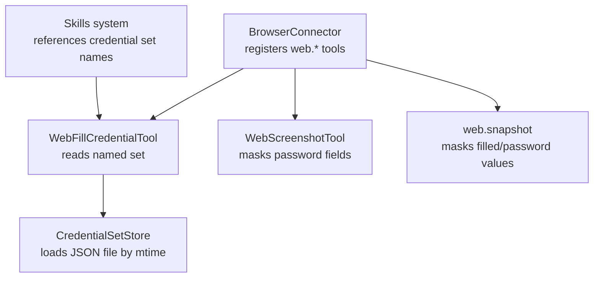
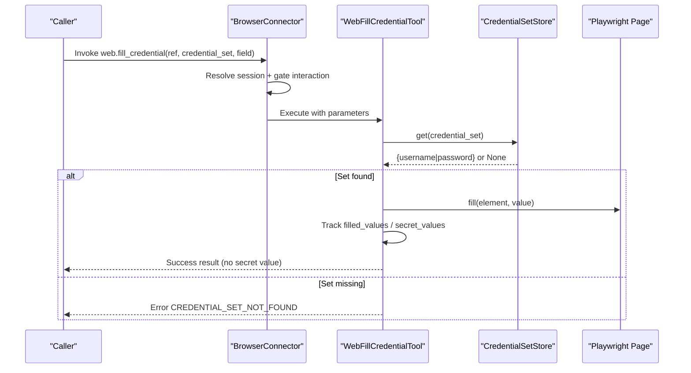
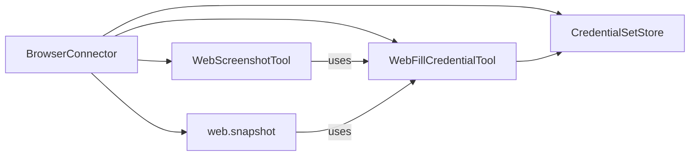

# Credential Management

<cite>
**Referenced Files in This Document**
- [credential_sets.py](file://products/tool-gateway/src/tool_gateway/tools/credential_sets.py)
- [browser_connector.py](file://products/tool-gateway/src/tool_gateway/tools/browser_connector.py)
- [test_browser_connector.py](file://products/tool-gateway/tests/test_browser_connector.py)
- [configuration-reference.md](file://docs/guides/configuration-reference.md)
- [sync-browser-credentials.sh](file://shared/platform-ops/gitops/sync-browser-credentials.sh)
- [SPEC-055 plan.md](file://docs/specs/SPEC-055-develop-as-you-go-skill-graduation/plan.md)
- [hitl_confirmations.py](file://products/agent-platform/src/agent_service/services/hitl_confirmations.py)
</cite>

## Table of Contents
1. Introduction
2. Project Structure
3. Core Components
4. Architecture Overview
5. Detailed Component Analysis
6. Dependency Analysis
7. Performance Considerations
8. Troubleshooting Guide
9. Conclusion
10. Appendices

## Introduction
This document explains the credential set system that powers secure login automation for web tools. It covers how credentials are stored, loaded, resolved at fill time, and protected from leaking into results, snapshots, evidence, logs, or screenshots. It also documents integration with the skills system, naming conventions, usage via the web.fill_credential tool, and security considerations for storage and access control.

## Project Structure
Credential management is implemented in the tool-gateway product and integrated with browser automation and skills:

- Credential storage and resolution live in a dedicated module that reads a secret-mounted JSON file on demand.
- The browser connector registers web.* tools, including web.fill_credential, and enforces masking for screenshots and snapshot values.
- Configuration documentation describes where the credential sets file is mounted and how it is provisioned.
- Skills integration references credential set names (not secrets) in executable flows.

**Diagram sources**
- [browser_connector.py:315-399](file://products/tool-gateway/src/tool_gateway/tools/browser_connector.py#L315-L399)
- [browser_connector.py:1274-1386](file://products/tool-gateway/src/tool_gateway/tools/browser_connector.py#L1274-L1386)
- [credential_sets.py:30-102](file://products/tool-gateway/src/tool_gateway/tools/credential_sets.py#L30-L102)
- [browser_connector.py:941-964](file://products/tool-gateway/src/tool_gateway/tools/browser_connector.py#L941-L964)
- [browser_connector.py:967-1068](file://products/tool-gateway/src/tool_gateway/tools/browser_connector.py#L967-L1068)

**Section sources**
- [configuration-reference.md:651-656](file://docs/guides/configuration-reference.md#L651-L656)
- [SPEC-055 plan.md:148-163](file://docs/specs/SPEC-055-develop-as-you-go-skill-graduation/plan.md#L148-L163)

## Core Components
- CredentialSetStore: Lazy, mtime-refreshed loader for a JSON file containing named credential sets. Each set must include non-empty username and password strings. Unknown or malformed sets are ignored safely; the last good load is retained.
- WebFillCredentialTool: Read-tier tool that fills a username or password field identified by a snapshot ref using a named credential set. Values never appear in results, snapshots, evidence, or logs.
- Screenshot masking: Before capturing a screenshot, the connector injects JavaScript to mask any input whose value matches tracked secret values, then restores them afterward. Snapshot text also masks password-type fields and filled values.

Key behaviors:
- Credentials are platform configuration, not skill content.
- File reloads on change without restart.
- Errors for unknown sets are structured and do not enumerate available sets.
- Masking is fail-closed: if injection fails, no screenshot is taken rather than risk leakage.

**Section sources**
- [credential_sets.py:1-102](file://products/tool-gateway/src/tool_gateway/tools/credential_sets.py#L1-L102)
- [browser_connector.py:1274-1386](file://products/tool-gateway/src/tool_gateway/tools/browser_connector.py#L1274-L1386)
- [browser_connector.py:941-964](file://products/tool-gateway/src/tool_gateway/tools/browser_connector.py#L941-L964)
- [browser_connector.py:967-1068](file://products/tool-gateway/src/tool_gateway/tools/browser_connector.py#L967-L1068)

## Architecture Overview
The credential flow is designed so secrets never leave the process boundary except as direct inputs to Playwright’s fill operation.

**Diagram sources**
- [browser_connector.py:315-399](file://products/tool-gateway/src/tool_gateway/tools/browser_connector.py#L315-L399)
- [browser_connector.py:1274-1386](file://products/tool-gateway/src/tool_gateway/tools/browser_connector.py#L1274-L1386)
- [credential_sets.py:30-102](file://products/tool-gateway/src/tool_gateway/tools/credential_sets.py#L30-L102)

## Detailed Component Analysis

### CredentialSetStore
Responsibilities:
- Load a JSON file mapping set names to objects with username and password.
- Reload only when the file’s modification time changes.
- Validate structure and required fields; ignore invalid entries.
- Expose names() and get(name) for safe enumeration and lookup.

Security properties:
- Only a file path is accepted; no inline secrets.
- On read errors or disappearance, the last known-good cache is kept and warnings are logged without leaking contents.
- Names are safe to surface; values are never serialized outside the fill call.

Complexity:
- Loading is O(N) over the number of sets in the file.
- Lookup is O(1) after parsing.

Error handling:
- Malformed JSON or missing file triggers a warning and retains previous state.
- Invalid set entries are skipped with a per-set warning.

**Section sources**
- [credential_sets.py:30-102](file://products/tool-gateway/src/tool_gateway/tools/credential_sets.py#L30-L102)

### WebFillCredentialTool
Behavior:
- Parameters: ref (snapshot element), credential_set (name), field (username or password).
- Resolves the named set at call time; returns a structured error if not found.
- Fills the target element via Playwright; tracks filled values and marks passwords as secret values.
- Risk level is read because filling does not submit data; submission remains gated by write-tier tools.

Data protection:
- The filled value is added to filled_values and, for password, to secret_values.
- These values are masked in snapshots and screenshots but never included in results or logs.

Error handling:
- Filling exceptions log only the exception class; messages avoid echoing input state.
- Unknown credential sets return CREDENTIAL_SET_NOT_FOUND without enumerating available sets.

**Section sources**
- [browser_connector.py:1274-1386](file://products/tool-gateway/src/tool_gateway/tools/browser_connector.py#L1274-L1386)
- [test_browser_connector.py:1493-1517](file://products/tool-gateway/tests/test_browser_connector.py#L1493-L1517)

### Screenshot Masking and Snapshot Redaction
Screenshot masking:
- Before capture, JavaScript scans all input/textarea elements and replaces values matching tracked secret_values with a fixed-length dot string, recording originals in a marker attribute.
- After capture, the original values are restored. If masking fails, no screenshot is taken (fail-closed).

Snapshot redaction:
- Snapshot text includes element metadata and values. Password-type fields and values present in filled_values are rendered as "***".

URL redaction:
- Evidence URLs are sanitized to mask secret-bearing query parameters and userinfo passwords.

**Section sources**
- [browser_connector.py:123-148](file://products/tool-gateway/src/tool_gateway/tools/browser_connector.py#L123-L148)
- [browser_connector.py:941-964](file://products/tool-gateway/src/tool_gateway/tools/browser_connector.py#L941-L964)
- [browser_connector.py:967-1068](file://products/tool-gateway/src/tool_gateway/tools/browser_connector.py#L967-L1068)
- [browser_connector.py:174-257](file://products/tool-gateway/src/tool_gateway/tools/browser_connector.py#L174-L257)

### Integration with the Skills System
- Executable-flow steps reference credential sets by name; they never embed literal secrets.
- During graduation validation, credential refs resolve to named credential sets.
- Change-request projections for web.fill_credential omit secret values even if accidentally provided in parameters.

**Section sources**
- [SPEC-055 plan.md:148-163](file://docs/specs/SPEC-055-develop-as-you-go-skill-graduation/plan.md#L148-L163)
- [hitl_confirmations.py:396-416](file://products/agent-platform/src/agent_service/services/hitl_confirmations.py#L396-L416)

### Naming Conventions and Organization Patterns
- Use descriptive, scoped names for credential sets (for example, inventory-app, legacy-crm).
- Organize sets by application or environment boundaries to simplify rotation and auditing.
- Keep set names stable; rotate values by updating the mounted JSON file.

[No sources needed since this section provides general guidance]

### Usage in web.fill_credential
Typical workflow:
1. Navigate to the login page and take a snapshot to obtain refs.
2. Identify the username and password element refs.
3. Call web.fill_credential with ref, credential_set, and field for each.
4. Submit using a write-tier tool (for example, web.click) which requires operator approval.

Constraints:
- field must be username or password.
- credential_set must exist in the configured file; otherwise an error is returned.
- The tool is read-tier and does not park an approval card.

**Section sources**
- [browser_connector.py:1286-1321](file://products/tool-gateway/src/tool_gateway/tools/browser_connector.py#L1286-L1321)
- [test_browser_connector.py:1493-1517](file://products/tool-gateway/tests/test_browser_connector.py#L1493-L1517)

## Dependency Analysis
- BrowserConnector depends on CredentialSetStore to resolve named sets at runtime.
- WebFillCredentialTool consumes CredentialSetStore and updates session tracking for filled/secret values.
- Screenshot and snapshot logic depend on those tracked values to enforce masking.
- Skills system references credential set names in executable flows; validation ensures refs resolve to named sets.

**Diagram sources**
- [browser_connector.py:315-399](file://products/tool-gateway/src/tool_gateway/tools/browser_connector.py#L315-L399)
- [browser_connector.py:1274-1386](file://products/tool-gateway/src/tool_gateway/tools/browser_connector.py#L1274-L1386)
- [credential_sets.py:30-102](file://products/tool-gateway/src/tool_gateway/tools/credential_sets.py#L30-L102)

**Section sources**
- [browser_connector.py:315-399](file://products/tool-gateway/src/tool_gateway/tools/browser_connector.py#L315-L399)
- [credential_sets.py:30-102](file://products/tool-gateway/src/tool_gateway/tools/credential_sets.py#L30-L102)

## Performance Considerations
- CredentialSetStore reloads only on file mtime change, avoiding repeated disk reads.
- Screenshot masking runs once per capture and restores DOM state immediately after.
- Snapshot generation limits character length and caps element count to keep responses bounded.

[No sources needed since this section provides general guidance]

## Troubleshooting Guide
Common issues and resolutions:
- Unknown credential set: Returns CREDENTIAL_SET_NOT_FOUND. Verify the set name exists in the mounted JSON file. Do not rely on error messages to enumerate available sets.
- Invalid field: Returns INVALID_PARAMETERS when field is not username or password.
- Missing or unreadable credential file: Last good load is retained; check logs for warnings about file disappearance or parse errors.
- Screenshot not captured: Masking failure is fail-closed; investigate JavaScript execution or page state before retrying.
- Snapshot shows masked values: Expected behavior for password fields and filled values.

Operational checks:
- Ensure GATEWAY_BROWSER_CREDENTIAL_SETS points to the correct mounted file.
- Confirm the JSON object contains non-empty username and password for each set.
- Rotate credentials by updating the file; no restart is required.

**Section sources**
- [test_browser_connector.py:1493-1517](file://products/tool-gateway/tests/test_browser_connector.py#L1493-L1517)
- [credential_sets.py:52-102](file://products/tool-gateway/src/tool_gateway/tools/credential_sets.py#L52-L102)
- [browser_connector.py:967-1068](file://products/tool-gateway/src/tool_gateway/tools/browser_connector.py#L967-L1068)
- [configuration-reference.md:651-656](file://docs/guides/configuration-reference.md#L651-L656)

## Conclusion
The credential set system centralizes login credentials as platform-managed configuration, resolves them securely at fill time, and enforces strict masking across snapshots and screenshots. By keeping secrets out of results, logs, and skills, and by gating submissions through write-tier interactions, the system balances usability with strong security guarantees. Proper naming, organization, and provisioning of the credential sets file ensure reliable operation and safe rotation.

[No sources needed since this section summarizes without analyzing specific files]

## Appendices

### File-Based Credential Storage Format
- Location: Mounted via the tool-gateway runtime secret key credential-sets.json under GATEWAY_BROWSER_CREDENTIAL_SETS.
- Shape: A JSON object mapping set names to objects with username and password strings.
- Provisioning: Managed by sync-browser-credentials.sh or equivalent secret synchronization.

**Section sources**
- [configuration-reference.md:651-656](file://docs/guides/configuration-reference.md#L651-L656)
- [sync-browser-credentials.sh](file://shared/platform-ops/gitops/sync-browser-credentials.sh)

### Security Considerations
- Storage: Keep the credential sets file in a secret volume accessible only to the tool-gateway process.
- Access control: Limit filesystem permissions and Kubernetes RBAC to the minimal set of pods that need access.
- Rotation: Update the mounted file; the store reloads automatically on mtime change.
- Leakage prevention: Never log or serialize credential values; rely on built-in masking and parameter constraints.
- Flow binding: Credential filling is read-tier; submission remains gated by write-tier approvals.

**Section sources**
- [browser_connector.py:1274-1386](file://products/tool-gateway/src/tool_gateway/tools/browser_connector.py#L1274-L1386)
- [credential_sets.py:1-102](file://products/tool-gateway/src/tool_gateway/tools/credential_sets.py#L1-L102)
- [configuration-reference.md:651-656](file://docs/guides/configuration-reference.md#L651-L656)