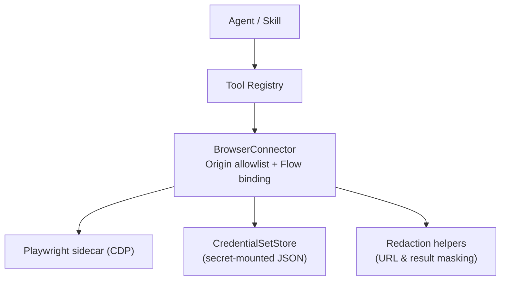
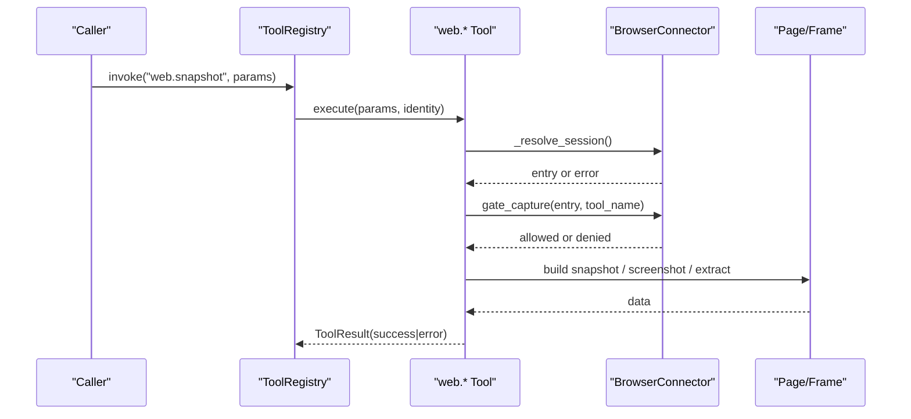
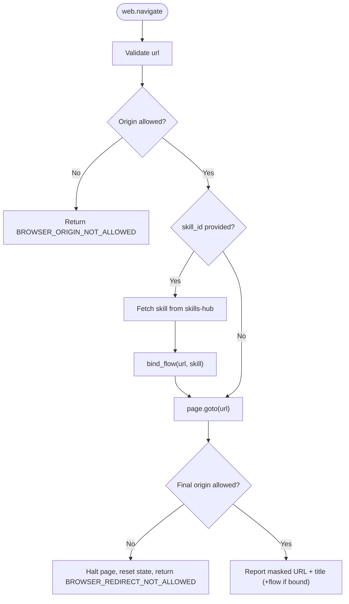
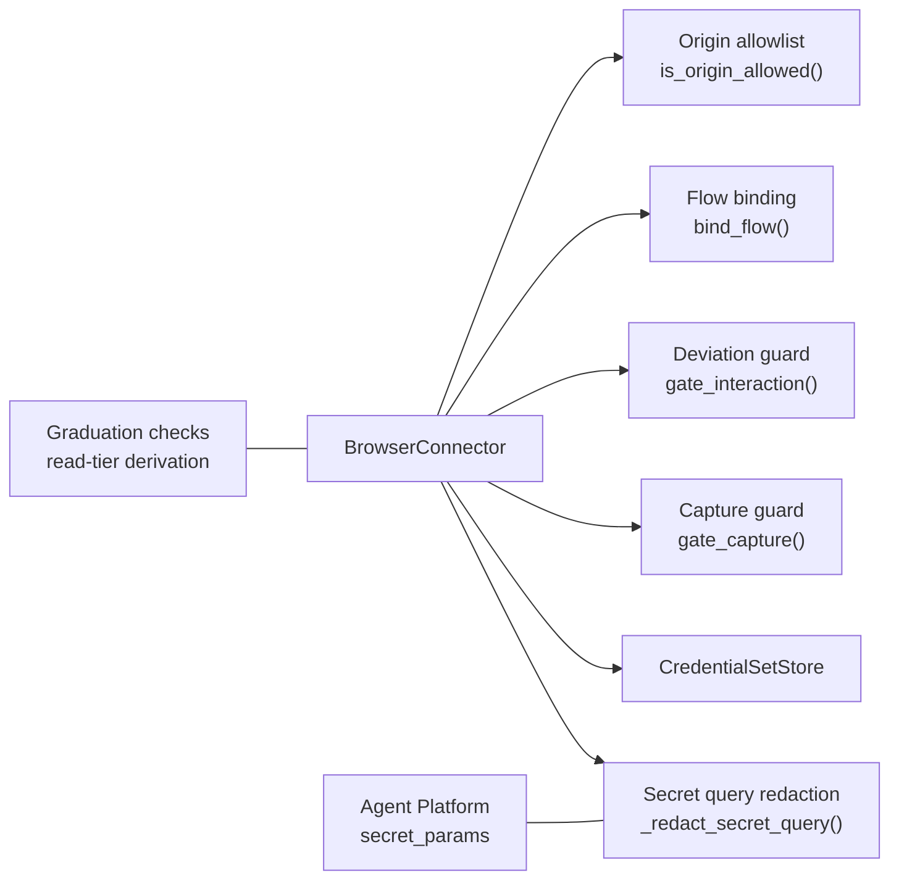

# Read-Tier Tools

<cite>
**Referenced Files in This Document**
- [browser_connector.py](file://products/tool-gateway/src/tool_gateway/tools/browser_connector.py)
- [credential_sets.py](file://products/tool-gateway/src/tool_gateway/tools/credential_sets.py)
- [redaction.py](file://products/tool-gateway/src/tool_gateway/tools/redaction.py)
- [config.py](file://products/tool-gateway/src/tool_gateway/core/config.py)
- [secret_params.py](file://products/agent-platform/src/agent_service/services/secret_params.py)
- [skill_graduation.py](file://products/agent-platform/src/agent_service/services/skill_graduation.py)
- [SPEC-049 spec.md](file://docs/specs/SPEC-049-browser-web-check-tools/spec.md)
- [SPEC-050 spec.md](file://docs/specs/SPEC-050-browser-tools-expansion-and-samples/spec.md)
- [test_browser_connector.py](file://products/tool-gateway/tests/test_browser_connector.py)
</cite>

## Table of Contents
1. Introduction
2. Project Structure
3. Core Components
4. Architecture Overview
5. Detailed Component Analysis
6. Dependency Analysis
7. Performance Considerations
8. Troubleshooting Guide
9. Conclusion

## Introduction
This document describes the read-tier browser tools exposed by the platform’s tool-gateway: web.navigate, web.snapshot, web.screenshot, web.fill_credential, web.extract, web.wait_for, web.hover, web.scroll, and web.switch_frame. It explains parameters, return values, error codes, usage patterns, and the server-side enforcement that keeps operations within approved flows and origins. It also covers credential masking for screenshots and secret parameter redaction in URLs, plus practical automation scenarios and performance best practices.

## Project Structure
The read-tier tools are implemented as part of a bounded browser connector that registers a fixed surface of web.* tools. Enforcement is centralized in the connector (origin allowlist, flow binding, deviation guard), while secrets and output redaction are handled by dedicated modules. Configuration is driven by environment variables with deny-by-default posture.

**Diagram sources**
- [browser_connector.py:360-398](file://products/tool-gateway/src/tool_gateway/tools/browser_connector.py#L360-L398)
- [credential_sets.py:30-103](file://products/tool-gateway/src/tool_gateway/tools/credential_sets.py#L30-L103)
- [redaction.py:126-151](file://products/tool-gateway/src/tool_gateway/tools/redaction.py#L126-L151)
- [config.py:141-183](file://products/tool-gateway/src/tool_gateway/core/config.py#L141-L183)

**Section sources**
- [browser_connector.py:1-61](file://products/tool-gateway/src/tool_gateway/tools/browser_connector.py#L1-L61)
- [config.py:141-183](file://products/tool-gateway/src/tool_gateway/core/config.py#L141-L183)

## Core Components
- BrowserConnector: Registers all web.* tools, enforces origin allowlist, binds flows via skill declarations, and applies deviation guards to interactions and captures.
- CredentialSetStore: Loads named credential sets from a secret-mounted file at call time; values never appear in results or logs.
- Redaction utilities: Mask secret-bearing query parameters in reported URLs and apply value/key-based redaction to tool results before release.
- Secret vocabulary alignment: Agent-platform and gateway share matching secret detection logic to ensure consistent masking across surfaces.

Key enforcement surfaces:
- Origin allowlist: Deny-by-default; empty list denies everything.
- Flow binding: web.navigate can bind a skill’s declared web_target and risk_class to the session.
- Deviation guard: Interactions must stay on-bound origin, within step budget, and respect risk_class.
- Capture guard: Every read capture re-validates live origin and bound flow before snapshotting or extracting.

**Section sources**
- [browser_connector.py:402-698](file://products/tool-gateway/src/tool_gateway/tools/browser_connector.py#L402-L698)
- [credential_sets.py:30-103](file://products/tool-gateway/src/tool_gateway/tools/credential_sets.py#L30-L103)
- [redaction.py:126-151](file://products/tool-gateway/src/tool_gateway/tools/redaction.py#L126-L151)
- [secret_params.py:97-156](file://products/agent-platform/src/agent_service/services/secret_params.py#L97-L156)

## Architecture Overview
Read-tier tools follow a common execution path: resolve identity and session, validate parameters, run gate_capture to re-check live origin and flow binding, perform the read operation, and return a ToolResult with evidence. Write-tier tools additionally go through gate_interaction and HITL confirmation when required.

**Diagram sources**
- [browser_connector.py:866-919](file://products/tool-gateway/src/tool_gateway/tools/browser_connector.py#L866-L919)
- [browser_connector.py:967-1027](file://products/tool-gateway/src/tool_gateway/tools/browser_connector.py#L967-L1027)
- [browser_connector.py:1711-1811](file://products/tool-gateway/src/tool_gateway/tools/browser_connector.py#L1711-L1811)

## Detailed Component Analysis

### web.navigate
- Purpose: Open an absolute http(s) URL in the session, wait for load, and report final URL and title. Optionally bind a skill’s declared flow.
- Parameters:
  - url (string, required): Absolute http(s) URL.
  - skill_id (string, optional): Namespaced skill id declaring web_target/risk_class frontmatter.
- Returns:
  - success: {url, title, flow?}
  - error/denied: structured code and message.
- Error codes:
  - INVALID_PARAMETERS: malformed or non-http(s) URL.
  - BROWSER_ORIGIN_NOT_ALLOWED: origin not on allowlist.
  - SKILL_NOT_WEB_FLOW / SKILL_NOT_FOUND / SKILLS_UNAVAILABLE: flow binding failures.
  - BROWSER_NAVIGATION_ERROR: navigation exception.
  - BROWSER_REDIRECT_NOT_ALLOWED: redirect landed off allowlist.
- Security notes:
  - Pre-navigation allowlist check.
  - Post-load redirect check; off-allowlist redirects halt the page and clear flow state.
  - Flow binding validates target origin and path under declared web_target; sets FlowState with origin, risk_class, and step budget.
  - Reported URL has secret query values masked.

**Diagram sources**
- [browser_connector.py:730-863](file://products/tool-gateway/src/tool_gateway/tools/browser_connector.py#L730-L863)
- [browser_connector.py:482-531](file://products/tool-gateway/src/tool_gateway/tools/browser_connector.py#L482-L531)

**Section sources**
- [browser_connector.py:730-863](file://products/tool-gateway/src/tool_gateway/tools/browser_connector.py#L730-L863)
- [browser_connector.py:482-531](file://products/tool-gateway/src/tool_gateway/tools/browser_connector.py#L482-L531)
- [SPEC-049 spec.md:91-125](file://docs/specs/SPEC-049-browser-web-check-tools/spec.md#L91-L125)

### web.snapshot
- Purpose: Return a bounded text snapshot of the current page with interactive elements enumerated as refs.
- Parameters: none.
- Returns:
  - success: {url, title, elements, snapshot}
  - error: BROWSER_SNAPSHOT_ERROR.
- Security notes:
  - Re-checks live origin and bound flow via gate_capture before capturing.
  - Snapshot header URL is masked for secret query params.
  - Filled credentials and password fields are masked in element listings.

**Section sources**
- [browser_connector.py:866-964](file://products/tool-gateway/src/tool_gateway/tools/browser_connector.py#L866-L964)
- [browser_connector.py:655-698](file://products/tool-gateway/src/tool_gateway/tools/browser_connector.py#L655-L698)

### web.screenshot
- Purpose: Capture a bounded JPEG screenshot (base64-encoded) of the current page.
- Parameters: none.
- Returns:
  - success: {title, url, format, bytes, screenshot}
  - error: BROWSER_SCREENSHOT_ERROR, BROWSER_SCREENSHOT_TOO_LARGE.
- Security notes:
  - Re-checks live origin and bound flow via gate_capture.
  - Password-tier values are masked out of the captured image before encoding; unmasking is attempted afterward.
  - Screenshot size is capped; quality loop and viewport clipping are used to fit the limit.

**Section sources**
- [browser_connector.py:967-1077](file://products/tool-gateway/src/tool_gateway/tools/browser_connector.py#L967-L1077)
- [browser_connector.py:655-698](file://products/tool-gateway/src/tool_gateway/tools/browser_connector.py#L655-L698)

### web.fill_credential
- Purpose: Fill a username or password field identified by a snapshot ref from a named credential set.
- Parameters:
  - ref (integer, required): Element ref from the latest web.snapshot.
  - credential_set (string, required): Name of the configured credential set.
  - field (string, enum: username|password, required): Which credential value to fill.
- Returns:
  - success: {url, filled, credential_set, steps_used?, steps_budget?}
  - error: INVALID_PARAMETERS, CREDENTIAL_SET_NOT_FOUND, BROWSER_ACTION_ERROR.
- Security notes:
  - Read tier by design: filling a field submits nothing; write-class gate lands on submitting actions.
  - Credential values never appear in results, snapshots, evidence, or logs.
  - Tracks filled values and passwords for screenshot masking.
  - In bound flows, consumes step budget like other ref-addressed interactions.

**Section sources**
- [browser_connector.py:1274-1386](file://products/tool-gateway/src/tool_gateway/tools/browser_connector.py#L1274-L1386)
- [credential_sets.py:30-103](file://products/tool-gateway/src/tool_gateway/tools/credential_sets.py#L30-L103)
- [secret_params.py:134-142](file://products/agent-platform/src/agent_service/services/secret_params.py#L134-L142)

### web.extract
- Purpose: Extract structured data from DOM elements matching a CSS selector. For tables, returns headers and rows; otherwise returns a list of item texts.
- Parameters:
  - selector (string, required): CSS selector.
  - max_rows (integer, optional, default 100, cap 500): Maximum rows to extract.
- Returns:
  - success: {items: [...], count} or {headers: [...], rows: [[...]], count}
  - error: BROWSER_EXTRACT_ERROR.
- Security notes:
  - Reads from active frame; respects gate_capture origin and flow checks.
  - Result bounded: row/column caps and cell text truncation.

**Section sources**
- [browser_connector.py:1711-1846](file://products/tool-gateway/src/tool_gateway/tools/browser_connector.py#L1711-L1846)
- [browser_connector.py:655-698](file://products/tool-gateway/src/tool_gateway/tools/browser_connector.py#L655-L698)

### web.wait_for
- Purpose: Wait for an element matching a CSS selector to reach a specific state.
- Parameters:
  - selector (string, required): CSS selector to wait for.
  - state (string, enum: attached|detached|visible|hidden, default visible).
  - timeout_ms (integer, optional, default 5000, cap 30000).
- Returns:
  - success: {selector, state, text}
  - error: BROWSER_WAIT_TIMEOUT.
- Security notes:
  - Uses gate_capture to enforce origin and flow constraints.
  - Timeout is capped server-side.

**Section sources**
- [browser_connector.py:1849-1955](file://products/tool-gateway/src/tool_gateway/tools/browser_connector.py#L1849-L1955)
- [browser_connector.py:655-698](file://products/tool-gateway/src/tool_gateway/tools/browser_connector.py#L655-L698)

### web.hover
- Purpose: Hover over an element identified by a snapshot ref to reveal tooltips, menus, or popover actions.
- Parameters:
  - ref (integer, required): Element ref from the latest web.snapshot.
- Returns:
  - success: {url, tag}
  - error: BROWSER_REF_UNKNOWN, BROWSER_ACTION_ERROR.
- Security notes:
  - Ref resolution and gate_capture enforced.

**Section sources**
- [browser_connector.py:1958-2025](file://products/tool-gateway/src/tool_gateway/tools/browser_connector.py#L1958-L2025)
- [browser_connector.py:701-724](file://products/tool-gateway/src/tool_gateway/tools/browser_connector.py#L701-L724)
- [browser_connector.py:655-698](file://products/tool-gateway/src/tool_gateway/tools/browser_connector.py#L655-L698)

### web.scroll
- Purpose: Scroll the page or active iframe by pixel offsets using mouse wheel events.
- Parameters:
  - delta_x (integer, optional, default 0).
  - delta_y (integer, optional, default 300).
- Returns:
  - success: {url, delta_x, delta_y}
  - error: INVALID_PARAMETERS, BROWSER_ACTION_ERROR.
- Security notes:
  - When an iframe is active, cursor is moved to frame center before wheeling so scrolling targets the frame.
  - Enforced via gate_capture.

**Section sources**
- [browser_connector.py:2236-2322](file://products/tool-gateway/src/tool_gateway/tools/browser_connector.py#L2236-L2322)
- [browser_connector.py:655-698](file://products/tool-gateway/src/tool_gateway/tools/browser_connector.py#L655-L698)

### web.switch_frame
- Purpose: Switch the browser context into an iframe identified by a CSS selector. Subsequent operations target the frame’s document.
- Parameters:
  - selector (string, required): CSS selector for the iframe element.
- Returns:
  - success: {url, frame_depth}
  - error: BROWSER_FRAME_NOT_FOUND, BROWSER_FRAME_ORIGIN_MISMATCH.
- Security notes:
  - Validates that the frame’s origin matches the bound flow’s origin when a flow is present.
  - Resets page state and tracks frame stack.

**Section sources**
- [browser_connector.py:2325-2439](file://products/tool-gateway/src/tool_gateway/tools/browser_connector.py#L2325-L2439)

## Dependency Analysis
- Origin allowlist and flow binding are enforced centrally in BrowserConnector.
- Credential sets are resolved at call time from a secret-mounted file; unknown names produce a structured error without enumerating available sets.
- URL redaction and result redaction ensure secrets do not leak into results, evidence, or audit trails.
- Agent-platform and tool-gateway share secret vocabulary to keep masking consistent across surfaces.
- Graduation validation treats any web.* tool outside the write set as read-tier by construction, including web.fill_credential.

**Diagram sources**
- [browser_connector.py:402-698](file://products/tool-gateway/src/tool_gateway/tools/browser_connector.py#L402-L698)
- [credential_sets.py:30-103](file://products/tool-gateway/src/tool_gateway/tools/credential_sets.py#L30-L103)
- [secret_params.py:97-156](file://products/agent-platform/src/agent_service/services/secret_params.py#L97-L156)
- [skill_graduation.py:358-383](file://products/agent-platform/src/agent_service/services/skill_graduation.py#L358-L383)

**Section sources**
- [browser_connector.py:402-698](file://products/tool-gateway/src/tool_gateway/tools/browser_connector.py#L402-L698)
- [credential_sets.py:30-103](file://products/tool-gateway/src/tool_gateway/tools/credential_sets.py#L30-L103)
- [secret_params.py:97-156](file://products/agent-platform/src/agent_service/services/secret_params.py#L97-L156)
- [skill_graduation.py:358-383](file://products/agent-platform/src/agent_service/services/skill_graduation.py#L358-L383)

## Performance Considerations
- Navigation timeout: web.navigate uses a bounded timeout to avoid hanging sessions.
- Snapshot bounds: Interactive elements are limited to a maximum count and snapshot text is truncated to a character cap.
- Screenshot sizing: Quality loop and viewport clipping reduce JPEG size to meet a configurable byte cap; too-large images return a specific error.
- Extraction limits: web.extract caps rows and columns and truncates cell text to prevent oversized payloads.
- Wait timeouts: web.wait_for caps timeout server-side to prevent long waits.
- Session concurrency: Each chat session serializes browser interactions to avoid race conditions on shared state.

Best practices:
- Prefer targeted selectors for extraction rather than broad scans.
- Use web.wait_for to synchronize async content instead of polling.
- Keep screenshots small by navigating to focused views and using scroll/hover judiciously.
- Avoid unnecessary navigations; reuse frames via switch_frame when appropriate.

[No sources needed since this section provides general guidance]

## Troubleshooting Guide
Common errors and their meanings:
- BROWSER_ORIGIN_NOT_ALLOWED: The requested URL’s origin is not on the allowlist. Configure GATEWAY_BROWSER_ALLOW_ORIGINS to include the target.
- BROWSER_REDIRECT_NOT_ALLOWED: Navigation or capture landed on an off-allowlist origin; the page was halted. Ensure the target does not redirect externally.
- BROWSER_FLOW_TARGET_MISMATCH: The URL does not match the skill’s declared web_target origin/path. Adjust skill frontmatter or navigate to the correct target.
- BROWSER_FLOW_ORIGIN_DEVIATED: Current page origin differs from the bound flow’s origin. Navigate back to the flow’s target before interacting.
- BROWSER_FLOW_READ_ONLY: Bound flow declares read-only but a write-tier action was attempted.
- BROWSER_FLOW_EXHAUSTED: Step budget exceeded; adjust flow_max_steps or split work.
- BROWSER_NO_IDENTITY / BROWSER_NOT_READY: Missing caller identity or browser sidecar not ready.
- BROWSER_REF_UNKNOWN: Invalid or stale snapshot ref; take a fresh snapshot.
- BROWSER_ACTION_ERROR: Generic failure during interaction; inspect logs for underlying cause.
- BROWSER_SCREENSHOT_TOO_LARGE: Screenshot could not be compressed within the configured byte cap.
- BROWSER_WAIT_TIMEOUT: Element did not reach desired state within the capped timeout.
- BROWSER_FRAME_NOT_FOUND / BROWSER_FRAME_ORIGIN_MISMATCH: Frame selector mismatch or cross-origin frame access denied.

Operational checks:
- Verify GATEWAY_BROWSER_ENABLED and GATEWAY_BROWSER_CDP_ENDPOINT are set correctly.
- Confirm GATEWAY_BROWSER_ALLOW_ORIGINS includes all intended targets.
- Ensure GATEWAY_BROWSER_CREDENTIAL_SETS points to a valid secret-mounted JSON file.
- Review flow declarations in skills (web_target, risk_class) and step budgets.

**Section sources**
- [browser_connector.py:259-266](file://products/tool-gateway/src/tool_gateway/tools/browser_connector.py#L259-L266)
- [browser_connector.py:445-531](file://products/tool-gateway/src/tool_gateway/tools/browser_connector.py#L445-L531)
- [browser_connector.py:599-698](file://products/tool-gateway/src/tool_gateway/tools/browser_connector.py#L599-L698)
- [browser_connector.py:701-724](file://products/tool-gateway/src/tool_gateway/tools/browser_connector.py#L701-L724)
- [browser_connector.py:805-863](file://products/tool-gateway/src/tool_gateway/tools/browser_connector.py#L805-L863)
- [browser_connector.py:967-1027](file://products/tool-gateway/src/tool_gateway/tools/browser_connector.py#L967-L1027)
- [browser_connector.py:1849-1955](file://products/tool-gateway/src/tool_gateway/tools/browser_connector.py#L1849-L1955)
- [browser_connector.py:2325-2439](file://products/tool-gateway/src/tool_gateway/tools/browser_connector.py#L2325-L2439)
- [config.py:141-183](file://products/tool-gateway/src/tool_gateway/core/config.py#L141-L183)

## Practical Usage Patterns
- Form login flow:
  1) web.navigate to the login page (optionally bind a skill flow).
  2) web.snapshot to obtain refs for username/password fields.
  3) web.fill_credential to fill username and password from a named credential set.
  4) web.click or web.press_key to submit.
  5) web.snapshot/web.screenshot to verify success.
- Data extraction:
  1) web.navigate to the dashboard.
  2) web.wait_for for key elements to appear.
  3) web.extract with a table selector to get headers and rows.
  4) Use web.scroll to reveal additional sections if needed.
- Cross-frame workflows:
  1) web.switch_frame to enter an iframe.
  2) Perform reads/writes within the frame context.
  3) web.navigate resets to main frame when needed.

[No sources needed since this section doesn't analyze specific files]

## Conclusion
The read-tier browser tools provide a secure, bounded, and auditable surface for automating web checks. They operate within strict origin allowlists, flow bindings, and deviation guards, with robust credential masking and secret redaction. By following the documented parameters, error codes, and best practices, operators can reliably automate form filling, data extraction, and navigation within approved flows while maintaining strong security and performance characteristics.

[No sources needed since this section summarizes without analyzing specific files]