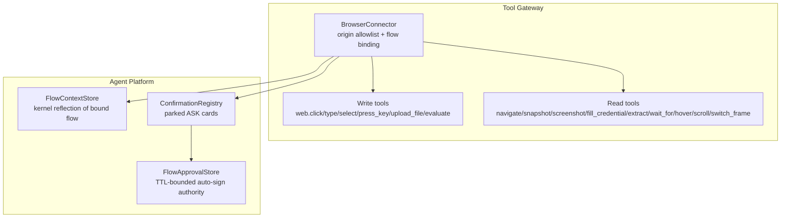
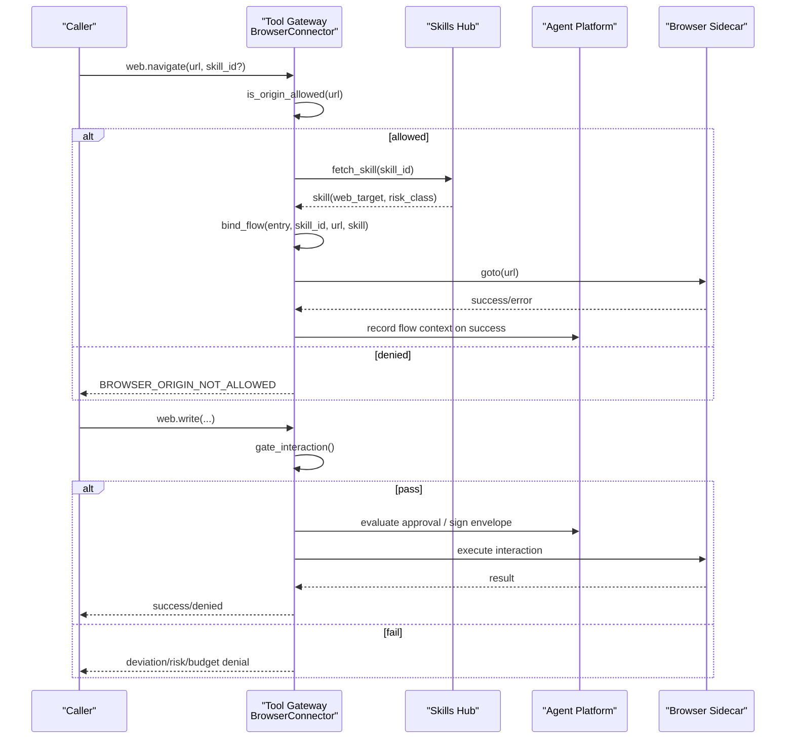
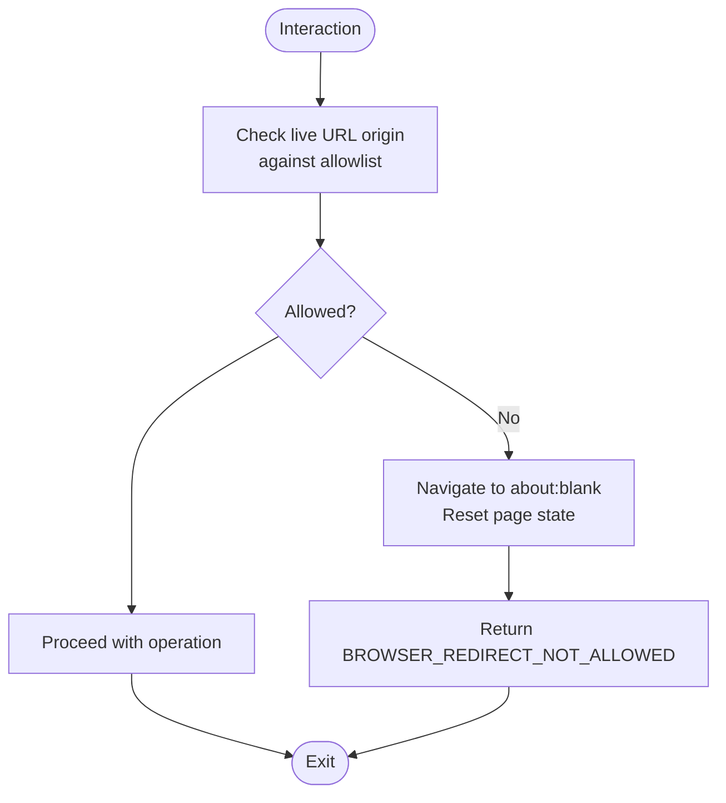
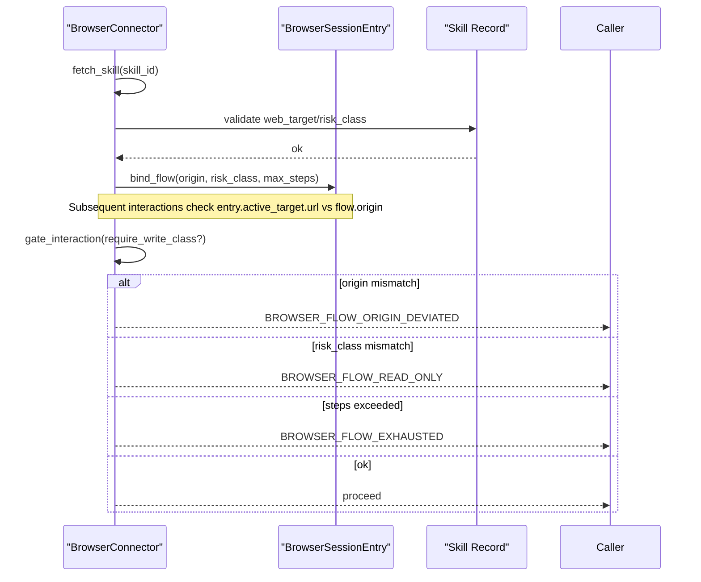
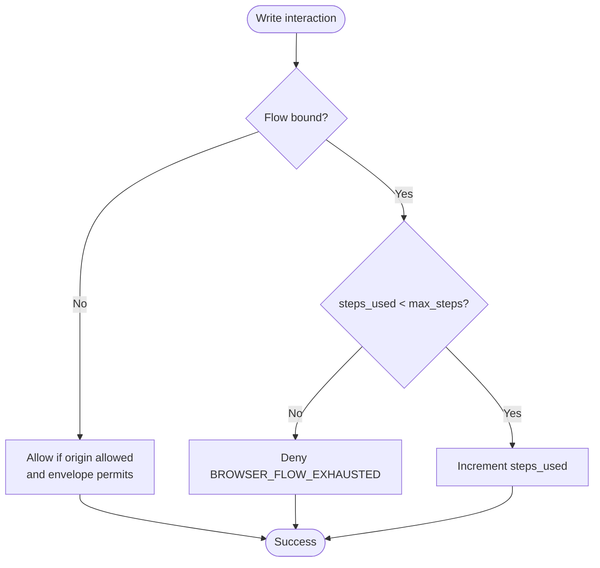
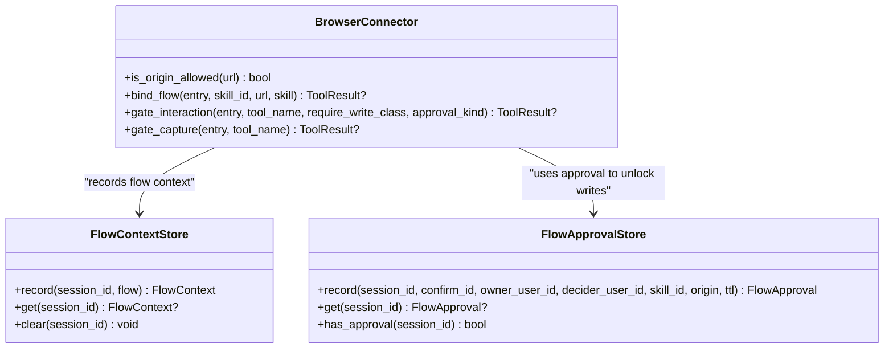
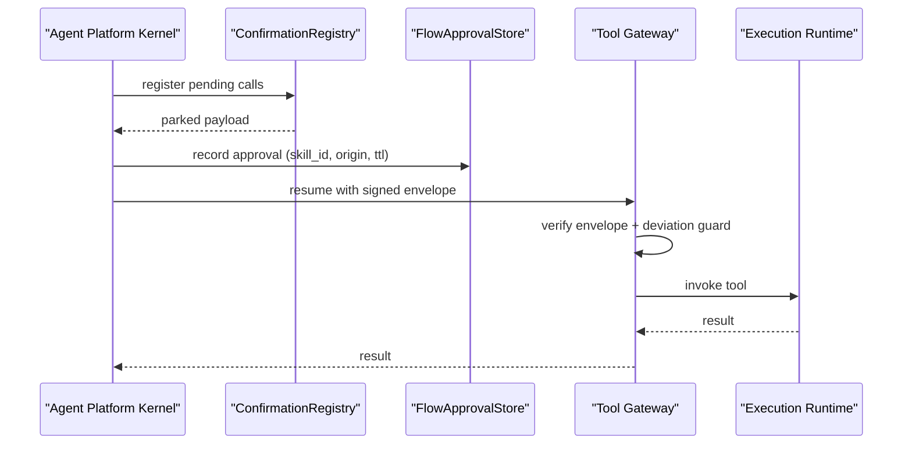
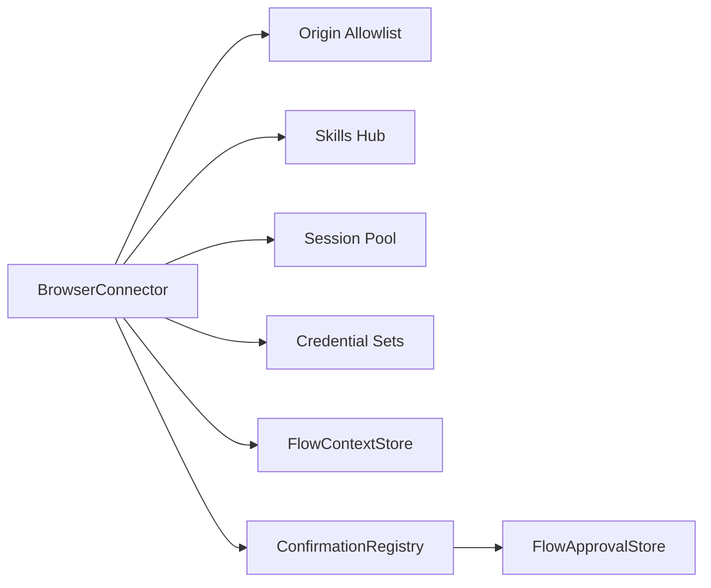

# Security Enforcement

<cite>
**Referenced Files in This Document**
- [browser_connector.py](file://products/tool-gateway/src/tool_gateway/tools/browser_connector.py)
- [flow_approvals.py](file://products/agent-platform/src/agent_service/services/flow_approvals.py)
- [hitl_confirmations.py](file://products/agent-platform/src/agent_service/services/hitl_confirmations.py)
- [test_browser_connector.py](file://products/tool-gateway/tests/test_browser_connector.py)
- [authorization-matrix.md](file://docs/agentic-aiops-platform/authorization-matrix.md)
- [approval-and-hitl.md](file://docs/guides/approval-and-hitl.md)
- [SPEC-054-action-approval-and-change-request-card/spec.md](file://docs/specs/SPEC-054-action-approval-and-change-request-card/spec.md)
- [SPEC-054-action-approval-and-change-request-card/plan.md](file://docs/specs/SPEC-054-action-approval-and-change-request-card/plan.md)
</cite>

## Table of Contents
1. Introduction
2. Project Structure
3. Core Components
4. Architecture Overview
5. Detailed Component Analysis
6. Dependency Analysis
7. Performance Considerations
8. Troubleshooting Guide
9. Conclusion

## Introduction
This document explains the browser connector’s security enforcement mechanisms that protect web-check flows from unauthorized navigation, cross-site scripting via flow boundary violations, and abuse through unbounded interactions. It covers:
- Origin allowlist validation to prevent off-allowlist navigation and capture
- Flow binding and deviation guards to enforce boundaries between approved targets and live page origins
- Step budget enforcement to limit write-tier interactions within a bound flow
- Risk class controls to separate read-only and mutating operations
- The relationship between browser security and the platform authorization model (HITL approvals, signed execution envelopes, and policy evaluation)

## Project Structure
The browser security surface spans two products:
- Tool gateway: enforces origin allowlists, flow binding, deviation guards, step budgets, and read/write risk-class checks at runtime
- Agent platform: records flow context reflections, manages HITL confirmations, and bridges approvals into signed execution

**Diagram sources**
- [browser_connector.py:315-399](file://products/tool-gateway/src/tool_gateway/tools/browser_connector.py#L315-L399)
- [flow_approvals.py:78-165](file://products/agent-platform/src/agent_service/services/flow_approvals.py#L78-L165)
- [hitl_confirmations.py:452-595](file://products/agent-platform/src/agent_service/services/hitl_confirmations.py#L452-L595)

**Section sources**
- [browser_connector.py:1-61](file://products/tool-gateway/src/tool_gateway/tools/browser_connector.py#L1-L61)
- [flow_approvals.py:1-34](file://products/agent-platform/src/agent_service/services/flow_approvals.py#L1-L34)
- [hitl_confirmations.py:1-12](file://products/agent-platform/src/agent_service/services/hitl_confirmations.py#L1-L12)

## Core Components
- BrowserConnector: registers web.* tools, validates origins, binds flows, and applies deviation guards and step budgets
- FlowContextStore: kernel-side reflection of the bound flow identity and metadata
- FlowApprovalStore: TTL-bounded authority enabling auto-signing for subsequent writes in the same flow
- ConfirmationRegistry: parks tool calls for operator approval and drives the bridge to signed execution

Key behaviors:
- Origin allowlist denies any navigation or capture outside configured origins
- Flow binding ties a session to a declared skill target; deviations are refused
- Write-tier tools require either a write-class flow or per-action approval
- Step budget limits write interactions inside a bound flow
- Read captures re-validate live origins to block post-load client-side redirects

**Section sources**
- [browser_connector.py:315-399](file://products/tool-gateway/src/tool_gateway/tools/browser_connector.py#L315-L399)
- [browser_connector.py:482-531](file://products/tool-gateway/src/tool_gateway/tools/browser_connector.py#L482-L531)
- [browser_connector.py:533-698](file://products/tool-gateway/src/tool_gateway/tools/browser_connector.py#L533-L698)
- [flow_approvals.py:78-165](file://products/agent-platform/src/agent_service/services/flow_approvals.py#L78-L165)
- [flow_approvals.py:167-260](file://products/agent-platform/src/agent_service/services/flow_approvals.py#L167-L260)
- [hitl_confirmations.py:47-181](file://products/agent-platform/src/agent_service/services/hitl_confirmations.py#L47-L181)

## Architecture Overview
The enforcement path is layered:
1. Tool gateway validates origin allowlist before any navigation
2. On navigate with skill_id, the connector binds a flow to the session using the skill’s declared target and risk_class
3. Every interaction checks:
   - Deviation guard: current origin must match bound flow origin
   - Risk class: write tools require write-class flow or per-action approval
   - Step budget: bounded number of write interactions per flow
4. Read captures re-validate live origin to catch client-side redirects after load
5. Agent platform records flow context and, when applicable, records an approval that can auto-sign subsequent writes under the same flow identity until TTL expiry or invalidation

**Diagram sources**
- [browser_connector.py:765-831](file://products/tool-gateway/src/tool_gateway/tools/browser_connector.py#L765-L831)
- [browser_connector.py:482-531](file://products/tool-gateway/src/tool_gateway/tools/browser_connector.py#L482-L531)
- [browser_connector.py:533-698](file://products/tool-gateway/src/tool_gateway/tools/browser_connector.py#L533-L698)
- [flow_approvals.py:78-165](file://products/agent-platform/src/agent_service/services/flow_approvals.py#L78-L165)
- [hitl_confirmations.py:452-595](file://products/agent-platform/src/agent_service/services/hitl_confirmations.py#L452-L595)

## Detailed Component Analysis

### Origin Allowlist Validation
- All navigations are checked against a configured allowlist before any network activity
- Captures (snapshot/screenshot) re-validate the live origin to prevent capturing off-allowlist pages after client-side redirects
- Off-allowlist pages are halted by navigating to about:blank and resetting page state

**Diagram sources**
- [browser_connector.py:402-406](file://products/tool-gateway/src/tool_gateway/tools/browser_connector.py#L402-L406)
- [browser_connector.py:655-698](file://products/tool-gateway/src/tool_gateway/tools/browser_connector.py#L655-L698)
- [browser_connector.py:599-653](file://products/tool-gateway/src/tool_gateway/tools/browser_connector.py#L599-L653)

**Section sources**
- [browser_connector.py:765-781](file://products/tool-gateway/src/tool_gateway/tools/browser_connector.py#L765-L781)
- [browser_connector.py:655-698](file://products/tool-gateway/src/tool_gateway/tools/browser_connector.py#L655-L698)
- [test_browser_connector.py:613-646](file://products/tool-gateway/tests/test_browser_connector.py#L613-L646)

### Flow Binding and Deviation Guards
- Flow binding occurs on navigate with skill_id: the connector validates the skill’s declared web_target and risk_class and binds them to the session
- Deviation guard ensures every interaction executes only on the bound flow’s origin; frame-aware checks use the active frame’s URL
- If a flow is absent but the envelope claims flow provenance, the call is refused as stale authority

**Diagram sources**
- [browser_connector.py:482-531](file://products/tool-gateway/src/tool_gateway/tools/browser_connector.py#L482-L531)
- [browser_connector.py:533-597](file://products/tool-gateway/src/tool_gateway/tools/browser_connector.py#L533-L597)

**Section sources**
- [browser_connector.py:482-531](file://products/tool-gateway/src/tool_gateway/tools/browser_connector.py#L482-L531)
- [browser_connector.py:533-597](file://products/tool-gateway/src/tool_gateway/tools/browser_connector.py#L533-L597)
- [test_browser_connector.py:2278-2300](file://products/tool-gateway/tests/test_browser_connector.py#L2278-L2300)
- [test_browser_connector.py:2535-2564](file://products/tool-gateway/tests/test_browser_connector.py#L2535-L2564)

### Step Budget Enforcement
- Each bound flow has a maximum step count set at bind time
- Write-tier interactions increment a counter and are denied once the budget is exhausted
- Unbound interactions do not consume flow steps; per-action consent is the bound

**Diagram sources**
- [browser_connector.py:533-597](file://products/tool-gateway/src/tool_gateway/tools/browser_connector.py#L533-L597)
- [test_browser_connector.py:1230-1239](file://products/tool-gateway/tests/test_browser_connector.py#L1230-L1239)
- [test_browser_connector.py:2498-2531](file://products/tool-gateway/tests/test_browser_connector.py#L2498-L2531)

**Section sources**
- [browser_connector.py:533-597](file://products/tool-gateway/src/tool_gateway/tools/browser_connector.py#L533-L597)
- [test_browser_connector.py:1230-1239](file://products/tool-gateway/tests/test_browser_connector.py#L1230-L1239)
- [test_browser_connector.py:2498-2531](file://products/tool-gateway/tests/test_browser_connector.py#L2498-L2531)

### Risk Class Controls
- Tools are classified as read or write; write tools include web.click, web.type, web.select, web.press_key, web.upload_file, and web.evaluate
- A bound flow declares risk_class; write tools require a write-class flow or per-action approval
- Read tools are auto-allowed when origin- and flow-bound checks pass

**Diagram sources**
- [browser_connector.py:315-399](file://products/tool-gateway/src/tool_gateway/tools/browser_connector.py#L315-L399)
- [browser_connector.py:482-531](file://products/tool-gateway/src/tool_gateway/tools/browser_connector.py#L482-L531)
- [browser_connector.py:533-698](file://products/tool-gateway/src/tool_gateway/tools/browser_connector.py#L533-L698)
- [flow_approvals.py:78-165](file://products/agent-platform/src/agent_service/services/flow_approvals.py#L78-L165)
- [flow_approvals.py:167-260](file://products/agent-platform/src/agent_service/services/flow_approvals.py#L167-L260)

**Section sources**
- [browser_connector.py:315-399](file://products/tool-gateway/src/tool_gateway/tools/browser_connector.py#L315-L399)
- [browser_connector.py:533-597](file://products/tool-gateway/src/tool_gateway/tools/browser_connector.py#L533-L597)
- [flow_approvals.py:41-75](file://products/agent-platform/src/agent_service/services/flow_approvals.py#L41-L75)

### Unbound Interactions and Staleness Backstop
- An unbound write on an allowlisted origin may proceed if it has per-action approval; no flow steps are consumed
- If an envelope claims flow provenance without a bound flow, the call is refused as stale authority
- This replaces the previous hard deny for missing flow with an explicit staleness check

**Section sources**
- [browser_connector.py:599-653](file://products/tool-gateway/src/tool_gateway/tools/browser_connector.py#L599-L653)
- [test_browser_connector.py:1140-1161](file://products/tool-gateway/tests/test_browser_connector.py#L1140-L1161)
- [SPEC-054-action-approval-and-change-request-card/spec.md:32-84](file://docs/specs/SPEC-054-action-approval-and-change-request-card/spec.md#L32-L84)
- [SPEC-054-action-approval-and-change-request-card/plan.md:390-446](file://docs/specs/SPEC-054-action-approval-and-change-request-card/plan.md#L390-L446)

### Relationship to Platform Authorization Model
- HITL confirmation cards park tool calls and present decision-relevant summaries
- Approved batches are bridged to signed execution envelopes; mismatches reject execution
- Flow approvals enable auto-signing for subsequent writes within the same flow identity until TTL expiry or invalidation
- Policy evaluation gates actions based on role, environment, and risk tier

**Diagram sources**
- [hitl_confirmations.py:47-181](file://products/agent-platform/src/agent_service/services/hitl_confirmations.py#L47-L181)
- [hitl_confirmations.py:452-595](file://products/agent-platform/src/agent_service/services/hitl_confirmations.py#L452-L595)
- [flow_approvals.py:167-260](file://products/agent-platform/src/agent_service/services/flow_approvals.py#L167-L260)
- [approval-and-hitl.md:236-325](file://docs/guides/approval-and-hitl.md#L236-L325)

**Section sources**
- [hitl_confirmations.py:47-181](file://products/agent-platform/src/agent_service/services/hitl_confirmations.py#L47-L181)
- [approval-and-hitl.md:236-325](file://docs/guides/approval-and-hitl.md#L236-L325)
- [authorization-matrix.md:224-347](file://docs/agentic-aiops-platform/authorization-matrix.md#L224-L347)

## Dependency Analysis
- BrowserConnector depends on:
  - Origin allowlist configuration
  - Skills hub for flow binding validation
  - Browser session pool for page/frame state
  - Credential sets for safe credential filling
- Agent platform components depend on:
  - Flow context reflection from successful navigations
  - Confirmation registry for parking and resuming calls
  - Approval store for TTL-bounded auto-signing

**Diagram sources**
- [browser_connector.py:315-399](file://products/tool-gateway/src/tool_gateway/tools/browser_connector.py#L315-L399)
- [flow_approvals.py:78-165](file://products/agent-platform/src/agent_service/services/flow_approvals.py#L78-L165)
- [hitl_confirmations.py:452-595](file://products/agent-platform/src/agent_service/services/hitl_confirmations.py#L452-L595)

**Section sources**
- [browser_connector.py:315-399](file://products/tool-gateway/src/tool_gateway/tools/browser_connector.py#L315-L399)
- [flow_approvals.py:78-165](file://products/agent-platform/src/agent_service/services/flow_approvals.py#L78-L165)
- [hitl_confirmations.py:452-595](file://products/agent-platform/src/agent_service/services/hitl_confirmations.py#L452-L595)

## Performance Considerations
- Per-session serialization prevents concurrent interactions from corrupting shared page state
- Snapshot and screenshot sizes are bounded to avoid large payloads
- Navigation timeouts and request timeouts constrain resource usage
- Frame switching and snapshot element counts are capped to reduce overhead

[No sources needed since this section provides general guidance]

## Troubleshooting Guide
Common failure modes and diagnostics:
- BROWSER_ORIGIN_NOT_ALLOWED: navigate attempted to an off-allowlist origin; configure allow_origins correctly
- BROWSER_REDIRECT_NOT_ALLOWED: live page drifted off-allowlist; system halts to about:blank and resets state
- BROWSER_FLOW_ORIGIN_DEVIATED: interaction on a different origin than the bound flow; navigate back to the approved origin
- BROWSER_FLOW_READ_ONLY: write tool invoked under a read-class flow; ensure flow declares write risk_class
- BROWSER_FLOW_EXHAUSTED: step budget exceeded; increase flow_max_steps or refactor workflow
- BROWSER_FLOW_AUTHORITY_STALE: envelope claimed flow provenance but no flow is bound; re-bind flow or adjust approval scope
- BROWSER_REF_UNKNOWN: invalid snapshot ref; take a fresh snapshot

Debugging techniques:
- Inspect error codes and messages returned by tool invocations
- Verify skill declarations (web_target, risk_class) match intended targets
- Confirm allowlist entries include all required origins
- Use snapshots to inspect interactive elements and refs before write operations
- Validate frame stack depth and active frame origin when using switch_frame

**Section sources**
- [browser_connector.py:533-698](file://products/tool-gateway/src/tool_gateway/tools/browser_connector.py#L533-L698)
- [test_browser_connector.py:613-646](file://products/tool-gateway/tests/test_browser_connector.py#L613-L646)
- [test_browser_connector.py:1140-1161](file://products/tool-gateway/tests/test_browser_connector.py#L1140-L1161)
- [test_browser_connector.py:1230-1239](file://products/tool-gateway/tests/test_browser_connector.py#L1230-L1239)
- [test_browser_connector.py:2278-2300](file://products/tool-gateway/tests/test_browser_connector.py#L2278-L2300)
- [test_browser_connector.py:2498-2531](file://products/tool-gateway/tests/test_browser_connector.py#L2498-L2531)

## Conclusion
The browser connector enforces strict security boundaries around web-check flows:
- Origin allowlist prevents unauthorized navigation and capture
- Flow binding and deviation guards ensure interactions occur only on approved targets
- Step budgets limit mutating interactions within a flow
- Risk-class controls maintain separation between read and write operations
- Integration with HITL approvals and signed execution ensures operator oversight and tamper-evident workflows

These mechanisms collectively mitigate unauthorized navigation, cross-site scripting via flow boundary violations, and abuse through unbounded interactions, while aligning with the broader platform authorization model.

[No sources needed since this section summarizes without analyzing specific files]