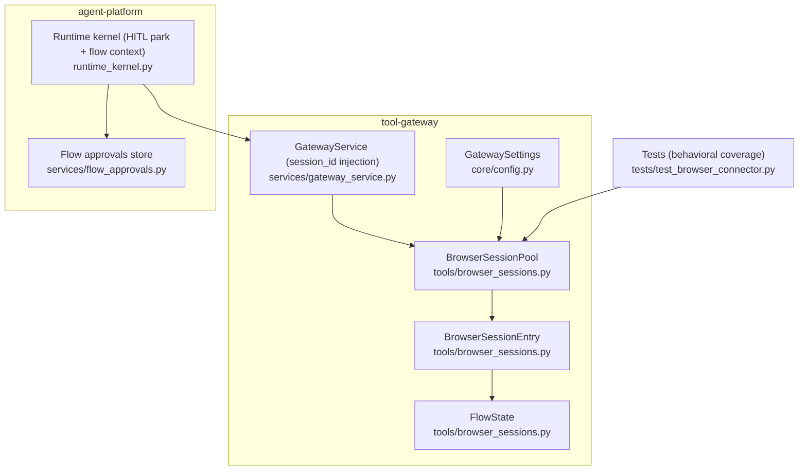
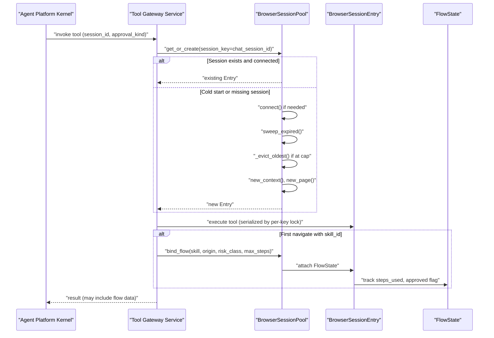
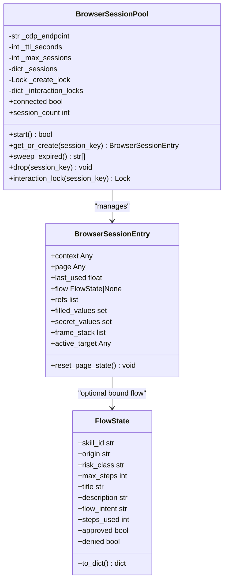
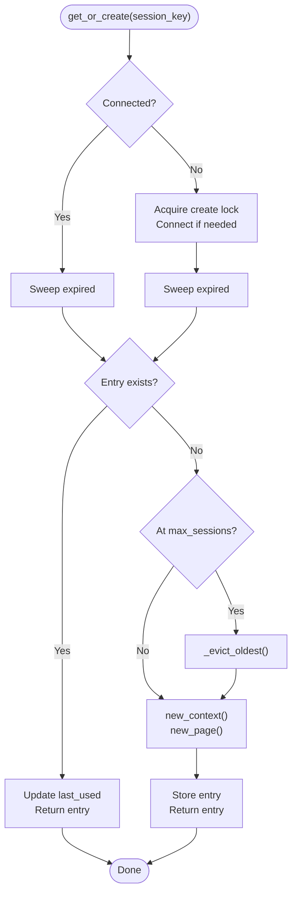
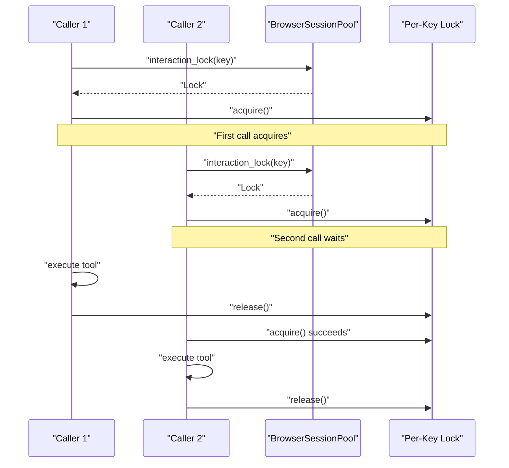
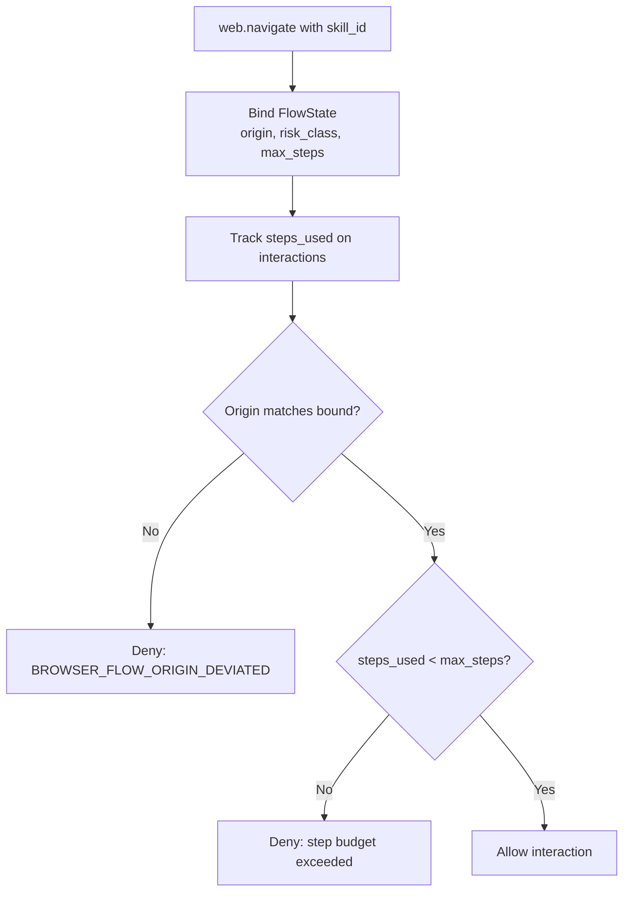
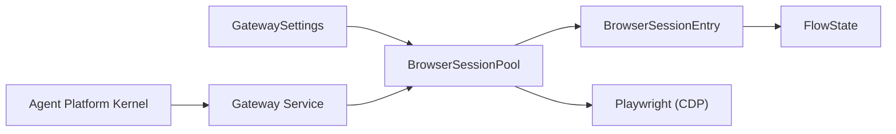

# Session Management and State

<cite>
**Referenced Files in This Document**
- [browser_sessions.py](file://products/tool-gateway/src/tool_gateway/tools/browser_sessions.py)
- [config.py](file://products/tool-gateway/src/tool_gateway/core/config.py)
- [gateway_service.py](file://products/tool-gateway/src/tool_gateway/services/gateway_service.py)
- [runtime_kernel.py](file://products/agent-platform/src/agent_service/runtime_kernel.py)
- [flow_approvals.py](file://products/agent-platform/src/agent_service/services/flow_approvals.py)
- [test_browser_connector.py](file://products/tool-gateway/tests/test_browser_connector.py)
</cite>

## Table of Contents
1. Introduction
2. Project Structure
3. Core Components
4. Architecture Overview
5. Detailed Component Analysis
6. Dependency Analysis
7. Performance Considerations
8. Troubleshooting Guide
9. Conclusion

## Introduction
This document explains browser session management for the tool-gateway’s web-check flow support. It focuses on three core classes: BrowserSessionPool, BrowserSessionEntry, and FlowState. It covers how sessions are created, keyed by chat session ID, maintained across identity switches during HITL approval flows, expired via TTL, evicted under capacity limits, and cleaned up. It also documents the per-session interaction locking that serializes concurrent tool calls to prevent race conditions on shared page state, as well as flow binding with skill validation, step budget tracking, and origin enforcement. Configuration options for session limits, TTL values, pool sizing, and related knobs are included, along with examples of session state transitions and error handling patterns when the browser sidecar is unavailable.

## Project Structure
The browser session subsystem lives primarily in the tool-gateway product, with supporting configuration and integration points in agent-platform and tests.

**Diagram sources**
- [browser_sessions.py:169-380](file://products/tool-gateway/src/tool_gateway/tools/browser_sessions.py#L169-L380)
- [config.py:17-73](file://products/tool-gateway/src/tool_gateway/core/config.py#L17-L73)
- [gateway_service.py:168-195](file://products/tool-gateway/src/tool_gateway/services/gateway_service.py#L168-L195)
- [runtime_kernel.py:1232-1258](file://products/agent-platform/src/agent_service/runtime_kernel.py#L1232-L1258)
- [flow_approvals.py:239-273](file://products/agent-platform/src/agent_service/services/flow_approvals.py#L239-L273)
- [test_browser_connector.py:426-486](file://products/tool-gateway/tests/test_browser_connector.py#L426-L486)

**Section sources**
- [browser_sessions.py:1-27](file://products/tool-gateway/src/tool_gateway/tools/browser_sessions.py#L1-L27)
- [config.py:17-73](file://products/tool-gateway/src/tool_gateway/core/config.py#L17-L73)
- [gateway_service.py:168-195](file://products/tool-gateway/src/tool_gateway/services/gateway_service.py#L168-L195)

## Core Components
- BrowserSessionPool: Manages a single Playwright host connected over CDP to a headless browser sidecar. It maintains a map of active sessions keyed by chat session ID, enforces TTL-based idle expiration, caps total sessions with oldest-idle eviction, and provides per-key interaction locks to serialize concurrent tool calls against the same page.
- BrowserSessionEntry: Represents one caller’s browser context, page, last-used timestamp, optional bound FlowState, element refs from the latest snapshot, masked credential values, and a frame stack for multi-frame navigation.
- FlowState: Captures skill-declared flow metadata bound to a session, including skill ID, origin, risk class, max steps, title/description, flow intent, steps used, and approval flags. It is serialized into navigate results for the kernel to render confirmation cards and enforce policy.

Key responsibilities:
- Session lifecycle: get_or_create, sweep_expired, _evict_oldest, drop, start/stop.
- Concurrency control: create lock for cold starts; per-key interaction locks for tool serialization.
- Flow binding: attach FlowState on successful bind and track step usage and origin.
- Error signaling: raise BrowserNotReady when the sidecar is unreachable.

**Section sources**
- [browser_sessions.py:61-167](file://products/tool-gateway/src/tool_gateway/tools/browser_sessions.py#L61-L167)
- [browser_sessions.py:169-380](file://products/tool-gateway/src/tool_gateway/tools/browser_sessions.py#L169-L380)
- [browser_sessions.py:383-391](file://products/tool-gateway/src/tool_gateway/tools/browser_sessions.py#L383-L391)

## Architecture Overview
The runtime kernel parks mutating tool calls for HITL approval and forwards them through the gateway service, which injects the chat session ID and approval kind. The tool-gateway uses this chat session ID to key browser sessions so that a single page persists across owner→approver identity switches. When a web.navigate binds a skill flow, FlowState is attached to the session entry and subsequent interactions are validated against the bound origin and step budget.

**Diagram sources**
- [gateway_service.py:168-195](file://products/tool-gateway/src/tool_gateway/services/gateway_service.py#L168-L195)
- [browser_sessions.py:306-344](file://products/tool-gateway/src/tool_gateway/tools/browser_sessions.py#L306-L344)
- [browser_sessions.py:346-368](file://products/tool-gateway/src/tool_gateway/tools/browser_sessions.py#L346-L368)
- [runtime_kernel.py:1232-1258](file://products/agent-platform/src/agent_service/runtime_kernel.py#L1232-L1258)

## Detailed Component Analysis

### BrowserSessionPool
Responsibilities:
- Connect to the browser sidecar over CDP once per pod.
- Provide get_or_create(session_key) that returns an existing session or creates one under a create lock to avoid duplicate contexts.
- Enforce TTL-based idle expiration via sweep_expired and capacity cap via _evict_oldest.
- Provide interaction_lock(session_key) to serialize concurrent tool calls per session.
- Cleanly stop all resources.

Concurrency model:
- A global create lock prevents multiple cold starts and duplicate context creation for the same key.
- Per-key interaction locks ensure that even before a session exists, callers can serialize operations to avoid races on the same page.

Lifecycle highlights:
- start(): idempotent bootstrap; returns False if sidecar is unreachable.
- get_or_create(): fast path if connected and session exists; slow path connects, sweeps, evicts, then creates context/page.
- sweep_expired(): closes idle contexts beyond TTL and prunes stale interaction locks.
- drop(): explicit removal and close.

Error handling:
- Raises BrowserNotReady when the sidecar cannot be reached; upstream tools surface structured errors.

Configuration:
- cdp_endpoint, ttl_seconds, max_sessions are injected at construction; defaults come from GatewaySettings.

**Diagram sources**
- [browser_sessions.py:61-167](file://products/tool-gateway/src/tool_gateway/tools/browser_sessions.py#L61-L167)
- [browser_sessions.py:169-380](file://products/tool-gateway/src/tool_gateway/tools/browser_sessions.py#L169-L380)

**Section sources**
- [browser_sessions.py:169-380](file://products/tool-gateway/src/tool_gateway/tools/browser_sessions.py#L169-L380)
- [browser_sessions.py:383-391](file://products/tool-gateway/src/tool_gateway/tools/browser_sessions.py#L383-L391)

### BrowserSessionEntry
Holds the live browser context and page, tracks last use time for TTL, and carries FlowState when bound. It also manages:
- Element refs from the most recent snapshot, invalidated on navigation or re-snapshot.
- Masked filled and secret values to prevent credential leakage in snapshots/screenshots.
- A frame stack for multi-frame navigation; reset on navigation.

Key behaviors:
- reset_page_state(): clears refs and frame stack after navigation or snapshot refresh.
- active_target: returns current frame if switched, otherwise the main page.

**Section sources**
- [browser_sessions.py:130-167](file://products/tool-gateway/src/tool_gateway/tools/browser_sessions.py#L130-L167)

### FlowState
Captures the declared flow bound to a session:
- Skill identity and provenance (skill_id, origin).
- Risk classification (read/write) and step budget (max_steps).
- Human-readable metadata (title, description) and flow intent for confirmation cards.
- Step accounting (steps_used) and approval flags (approved, denied) for write-tier evidence.

Serialization:
- to_dict() emits a fixed envelope used by navigate results to carry flow context to the kernel for rendering and policy checks.

**Section sources**
- [browser_sessions.py:61-128](file://products/tool-gateway/src/tool_gateway/tools/browser_sessions.py#L61-L128)

### Session Lifecycle and TTL Handling
- Creation: get_or_create(session_key) either returns an existing entry or creates a new context/page under a create lock. On first use, it ensures connection to the sidecar; failure raises BrowserNotReady.
- TTL: sweep_expired() runs before each lookup and closes contexts idle longer than ttl_seconds. Expired entries are removed and their contexts closed asynchronously.
- Capacity: when the number of sessions reaches max_sessions, _evict_oldest() removes the least recently used session before creating a new one.
- Cleanup: drop(session_key) explicitly removes and closes a session; stop() tears down all sessions and the browser connection.

**Diagram sources**
- [browser_sessions.py:306-344](file://products/tool-gateway/src/tool_gateway/tools/browser_sessions.py#L306-L344)
- [browser_sessions.py:346-368](file://products/tool-gateway/src/tool_gateway/tools/browser_sessions.py#L346-L368)

**Section sources**
- [browser_sessions.py:306-380](file://products/tool-gateway/src/tool_gateway/tools/browser_sessions.py#L306-L380)

### Interaction Locking Mechanism
To prevent race conditions when multiple tool calls target the same page concurrently:
- Each session key has a dedicated asyncio.Lock returned by interaction_lock(session_key).
- The lock is created lazily and pruned when no longer associated with a live session and not held.
- Callers must acquire the lock without awaiting between acquisition and release to avoid pruning races.
- This ensures serialization of tool calls per session, protecting shared page state.

**Diagram sources**
- [browser_sessions.py:201-236](file://products/tool-gateway/src/tool_gateway/tools/browser_sessions.py#L201-L236)

**Section sources**
- [browser_sessions.py:201-236](file://products/tool-gateway/src/tool_gateway/tools/browser_sessions.py#L201-L236)

### Flow Binding, Skill Validation, Step Budget, and Origin Enforcement
- Binding: When web.navigate includes a skill_id, the connector binds a FlowState to the session entry. The flow’s origin, risk class, and max steps are recorded.
- Skill validation: The bound flow’s origin is enforced on subsequent interactions; deviations result in denial with a specific error code.
- Step budget: Interactions increment steps_used; exceeding max_steps denies further write-tier actions.
- Approval semantics: For read-tier flows, approved is set at bind time; for write-tier flows, approval is evidenced by execution through the HITL path.

**Diagram sources**
- [test_browser_connector.py:2535-2564](file://products/tool-gateway/tests/test_browser_connector.py#L2535-L2564)

**Section sources**
- [test_browser_connector.py:2535-2564](file://products/tool-gateway/tests/test_browser_connector.py#L2535-L2564)

### Chat Session Keying Across Identity Switches
- The gateway service injects chat_session_id from trusted internal callers (kernel or signed envelope), never from model-controlled parameters.
- Sessions are keyed by this chat session ID, ensuring one browser context spans the entire flow across owner→approver identity changes during HITL approval.
- The approval_kind discriminator (“flow” vs “action”) is also injected and validated to restrict flow-provenance execution when no flow is bound.

**Section sources**
- [gateway_service.py:168-195](file://products/tool-gateway/src/tool_gateway/services/gateway_service.py#L168-L195)
- [runtime_kernel.py:1232-1258](file://products/agent-platform/src/agent_service/runtime_kernel.py#L1232-L1258)

### Configuration Options
Browser-related settings are loaded from environment variables and exposed via GatewaySettings:
- GATEWAY_BROWSER_ENABLED: enable/disable the browser connector.
- GATEWAY_BROWSER_CDP_ENDPOINT: CDP endpoint for the sidecar.
- GATEWAY_BROWSER_SESSION_TTL: TTL in seconds for idle sessions.
- GATEWAY_BROWSER_MAX_SESSIONS: maximum concurrent sessions per pod.
- GATEWAY_BROWSER_ALLOW_ORIGINS: comma-separated allowlist of origins for navigation.
- GATEWAY_BROWSER_FLOW_MAX_STEPS: default max steps for flows.
- GATEWAY_BROWSER_CREDENTIAL_SETS: path to credential sets file.
- GATEWAY_BROWSER_SCREENSHOT_MAX_BYTES: screenshot size limit.
- GATEWAY_BROWSER_UPLOAD_DIR: upload directory for files.

Defaults are defined in config constants and applied when environment variables are absent.

**Section sources**
- [config.py:17-73](file://products/tool-gateway/src/tool_gateway/core/config.py#L17-L73)
- [config.py:141-183](file://products/tool-gateway/src/tool_gateway/core/config.py#L141-L183)

### Examples: Session State Transitions
- Reuse within TTL: Two calls with the same session key return the same page; session count remains 1.
- Expiration after TTL: After advancing time beyond TTL, a new call triggers cleanup of the expired session and creation of a fresh one.
- Capacity eviction: When the pool reaches max_sessions, the oldest-idle session is evicted to make room.
- Explicit drop: Dropping a session closes its context and reduces session count.

These behaviors are verified in tests.

**Section sources**
- [test_browser_connector.py:426-486](file://products/tool-gateway/tests/test_browser_connector.py#L426-L486)

### Error Handling Patterns for Browser Unavailability
- If the sidecar is unreachable, start() returns False and get_or_create() raises BrowserNotReady with the endpoint.
- Tools should treat this as a transient unavailability and surface a structured error upstream rather than crashing.
- Tests assert that a failing factory leads to BrowserNotReady being raised on get_or_create.

**Section sources**
- [browser_sessions.py:240-273](file://products/tool-gateway/src/tool_gateway/tools/browser_sessions.py#L240-L273)
- [browser_sessions.py:383-391](file://products/tool-gateway/src/tool_gateway/tools/browser_sessions.py#L383-L391)
- [test_browser_connector.py:476-486](file://products/tool-gateway/tests/test_browser_connector.py#L476-L486)

## Dependency Analysis
- BrowserSessionPool depends on:
  - Playwright async API (via injected factory) to connect over CDP.
  - asyncio.Lock for concurrency control.
  - GatewaySettings for defaults and environment-driven configuration.
- BrowserSessionEntry depends on Playwright context/page abstractions and optionally holds FlowState.
- FlowState is consumed by navigate results to inform the kernel about flow context for UI and policy.
- Integration points:
  - Agent platform kernel injects HITL context and flow metadata.
  - Gateway service injects chat session ID and approval kind into tool invocations.

**Diagram sources**
- [config.py:17-73](file://products/tool-gateway/src/tool_gateway/core/config.py#L17-L73)
- [browser_sessions.py:169-380](file://products/tool-gateway/src/tool_gateway/tools/browser_sessions.py#L169-L380)
- [gateway_service.py:168-195](file://products/tool-gateway/src/tool_gateway/services/gateway_service.py#L168-L195)
- [runtime_kernel.py:1232-1258](file://products/agent-platform/src/agent_service/runtime_kernel.py#L1232-L1258)

**Section sources**
- [config.py:17-73](file://products/tool-gateway/src/tool_gateway/core/config.py#L17-L73)
- [browser_sessions.py:169-380](file://products/tool-gateway/src/tool_gateway/tools/browser_sessions.py#L169-L380)
- [gateway_service.py:168-195](file://products/tool-gateway/src/tool_gateway/services/gateway_service.py#L168-L195)
- [runtime_kernel.py:1232-1258](file://products/agent-platform/src/agent_service/runtime_kernel.py#L1232-L1258)

## Performance Considerations
- TTL and eviction run on every lookup, ensuring memory stays bounded without background timers.
- Per-key interaction locks serialize tool calls to avoid page-level races, reducing flakiness and inconsistent state.
- Create lock prevents duplicate cold starts and orphaned contexts under load.
- Best-effort async closing of contexts avoids blocking teardown paths.

[No sources needed since this section provides general guidance]

## Troubleshooting Guide
Common issues and resolutions:
- Browser sidecar unreachable:
  - Symptom: get_or_create raises BrowserNotReady; tools fail with structured errors.
  - Action: Verify GATEWAY_BROWSER_CDP_ENDPOINT and sidecar health; restart sidecar if needed.
- Too many sessions:
  - Symptom: New sessions cause eviction of oldest-idle; logs indicate eviction.
  - Action: Increase GATEWAY_BROWSER_MAX_SESSIONS or reduce TTL/GC pressure.
- Flow origin deviation:
  - Symptom: Interactions denied with origin mismatch after navigating away from bound origin.
  - Action: Ensure navigations stay within allowed origins; re-bind flow if necessary.
- Step budget exceeded:
  - Symptom: Write-tier interactions denied due to steps_used >= max_steps.
  - Action: Adjust skill’s max_steps or refactor flow to reduce steps.

**Section sources**
- [browser_sessions.py:346-368](file://products/tool-gateway/src/tool_gateway/tools/browser_sessions.py#L346-L368)
- [test_browser_connector.py:2535-2564](file://products/tool-gateway/tests/test_browser_connector.py#L2535-L2564)

## Conclusion
Browser session management in the tool-gateway centers on BrowserSessionPool, BrowserSessionEntry, and FlowState to provide robust, stateful web automation across identity switches during HITL flows. Sessions are keyed by chat session ID, expire based on TTL, and are capped by pool size. Per-key interaction locks serialize concurrent tool calls to protect shared page state. Flow binding enforces origin and step budgets, while configuration knobs allow operators to tune behavior. Errors such as browser unavailability are surfaced clearly to upstream components for graceful handling.