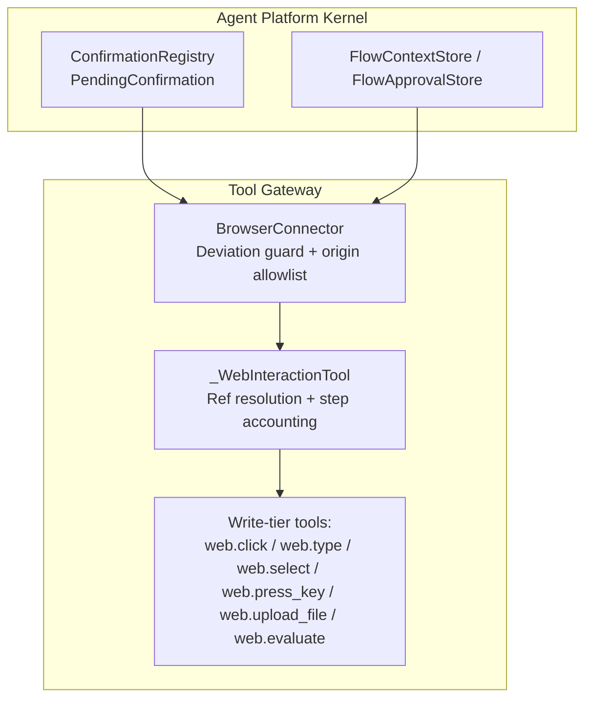
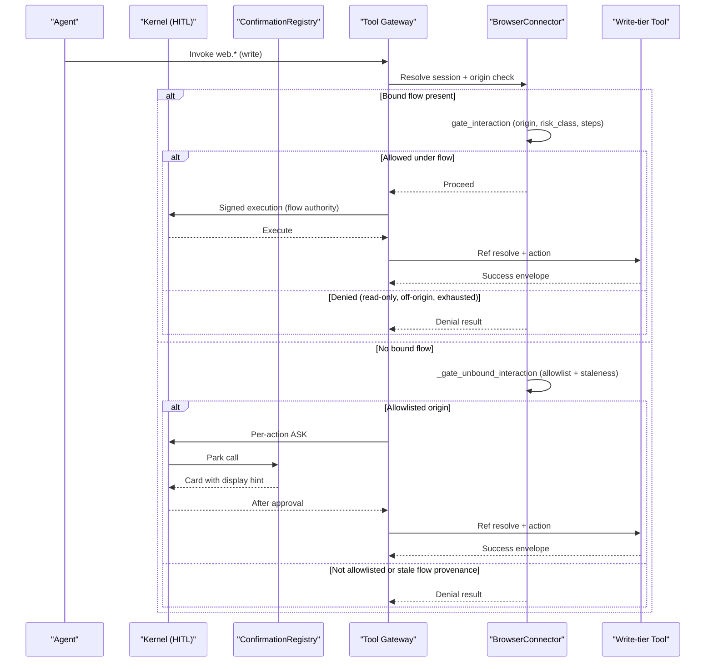
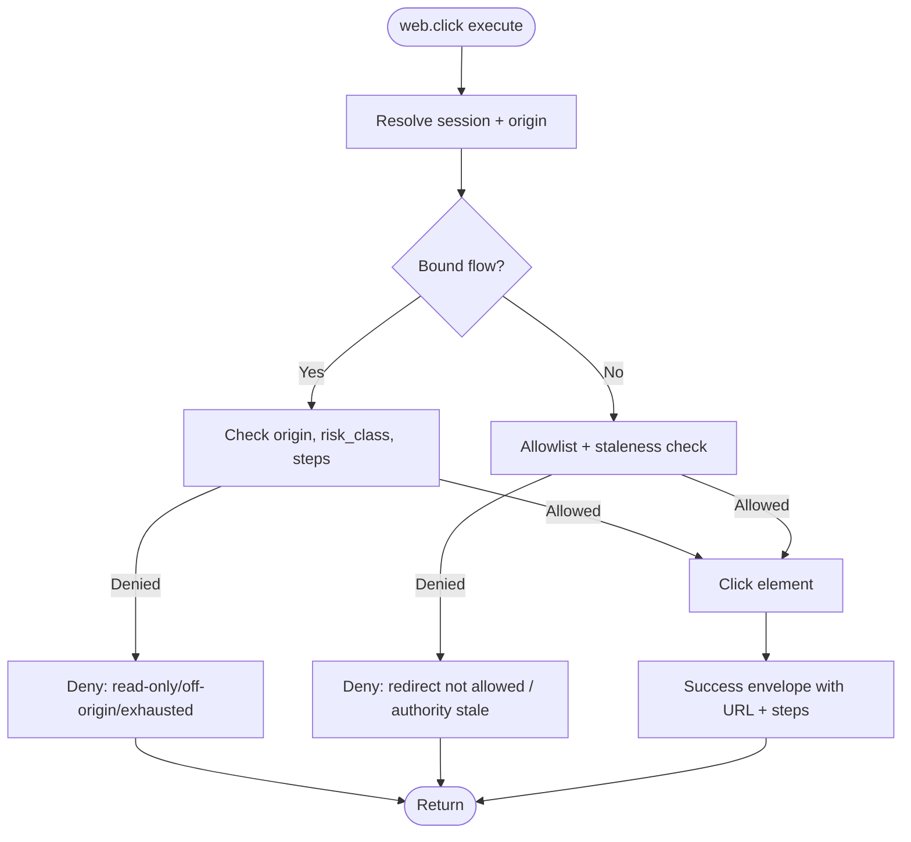
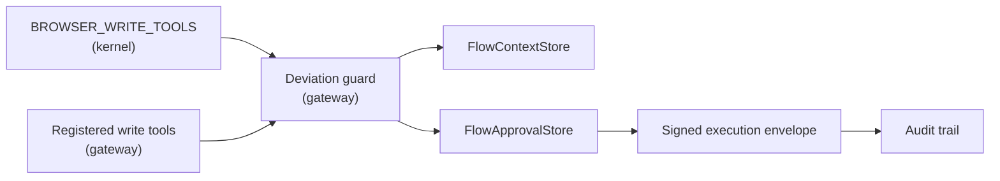

# Write-Tier Tools

<cite>
**Referenced Files in This Document**
- [browser_connector.py](file://products/tool-gateway/src/tool_gateway/tools/browser_connector.py)
- [browser_sessions.py](file://products/tool-gateway/src/tool_gateway/tools/browser_sessions.py)
- [hitl_confirmations.py](file://products/agent-platform/src/agent_service/services/hitl_confirmations.py)
- [flow_approvals.py](file://products/agent-platform/src/agent_service/services/flow_approvals.py)
- [SPEC-049-browser-web-check-tools/spec.md](file://docs/specs/SPEC-049-browser-web-check-tools/spec.md)
- [SPEC-050-browser-tools-expansion-and-samples/spec.md](file://docs/specs/SPEC-050-browser-tools-expansion-and-samples/spec.md)
- [SPEC-051-browser-flow-hitl-gate-enforcement/spec.md](file://docs/specs/SPEC-051-browser-flow-hitl-gate-enforcement/spec.md)
</cite>

## Table of Contents
1. [Introduction](#introduction)
2. [Project Structure](#project-structure)
3. [Core Components](#core-components)
4. [Architecture Overview](#architecture-overview)
5. [Detailed Component Analysis](#detailed-component-analysis)
6. [Dependency Analysis](#dependency-analysis)
7. [Performance Considerations](#performance-considerations)
8. [Troubleshooting Guide](#troubleshooting-guide)
9. [Conclusion](#conclusion)

## Introduction
This document explains the write-tier browser tools that mutate a bounded web session: web.click, web.type, web.select, web.press_key, web.upload_file, and web.evaluate. It covers parameters, element reference resolution, return values, error handling, and the security model that requires human-in-the-loop approval through the confirmation bridge and signed execution envelopes. It also explains step budget enforcement within bound flows, risk-class gating, differences between ad-hoc writes and flow-bound writes, and how approvals are recorded and audited.

## Project Structure
Write-tier browser tools are implemented in the tool-gateway’s browser connector and coordinated by the agent-platform kernel for HITL bridging, flow-scoped approvals, and signed execution envelopes.

**Diagram sources**
- [hitl_confirmations.py:47-180](file://products/agent-platform/src/agent_service/services/hitl_confirmations.py#L47-L180)
- [flow_approvals.py:78-127](file://products/agent-platform/src/agent_service/services/flow_approvals.py#L78-L127)
- [browser_connector.py:533-698](file://products/tool-gateway/src/tool_gateway/tools/browser_connector.py#L533-L698)
- [browser_connector.py:1079-1141](file://products/tool-gateway/src/tool_gateway/tools/browser_connector.py#L1079-L1141)

**Section sources**
- [browser_connector.py:360-398](file://products/tool-gateway/src/tool_gateway/tools/browser_connector.py#L360-L398)
- [browser_sessions.py:61-127](file://products/tool-gateway/src/tool_gateway/tools/browser_sessions.py#L61-L127)
- [hitl_confirmations.py:47-180](file://products/agent-platform/src/agent_service/services/hitl_confirmations.py#L47-L180)
- [flow_approvals.py:41-75](file://products/agent-platform/src/agent_service/services/flow_approvals.py#L41-L75)

## Core Components
- BrowserConnector enforces server-side boundaries: origin allowlist, flow binding, deviation guard, and read/write tier checks. It serializes per-session interactions to avoid concurrent Playwright races.
- _WebInteractionTool provides shared plumbing for ref-addressed write tools: deviation guard, snapshot ref resolution, step accounting, and success envelope construction.
- ConfirmationRegistry parks tool calls when policy requires operator approval and renders decision cards with display hints and change requests.
- FlowApprovals maintains per-session flow context and time-bounded approvals scoped to the approved flow identity (skill_id + origin).

Key behaviors grounded in source:
- The write-tier set includes web.click, web.type, web.select, web.press_key, web.upload_file, and web.evaluate.
- web.evaluate is write-tier because arbitrary JS can mutate DOM and read masked secrets; it does not take an element ref.
- Element targeting uses refs from web.snapshot; invalid or stale refs produce structured errors.
- Step budget is enforced per bound flow; exceeding budget denies further interactions.
- Ad-hoc writes (no bound flow) still require per-action approval and execute only after approval.

**Section sources**
- [flow_approvals.py:41-54](file://products/agent-platform/src/agent_service/services/flow_approvals.py#L41-L54)
- [browser_connector.py:1079-1141](file://products/tool-gateway/src/tool_gateway/tools/browser_connector.py#L1079-L1141)
- [browser_connector.py:701-724](file://products/tool-gateway/src/tool_gateway/tools/browser_connector.py#L701-L724)
- [hitl_confirmations.py:98-145](file://products/agent-platform/src/agent_service/services/hitl_confirmations.py#L98-L145)

## Architecture Overview
The end-to-end flow for a write-tier interaction:

**Diagram sources**
- [browser_connector.py:533-653](file://products/tool-gateway/src/tool_gateway/tools/browser_connector.py#L533-L653)
- [browser_connector.py:1079-1141](file://products/tool-gateway/src/tool_gateway/tools/browser_connector.py#L1079-L1141)
- [hitl_confirmations.py:98-180](file://products/agent-platform/src/agent_service/services/hitl_confirmations.py#L98-L180)
- [flow_approvals.py:167-249](file://products/agent-platform/src/agent_service/services/flow_approvals.py#L167-L249)

## Detailed Component Analysis

### web.click
- Purpose: Click an interactive element identified by a snapshot ref.
- Parameters:
  - ref: integer, 1-based index from the latest web.snapshot.
- Element reference resolution:
  - Resolved via shared ref resolver; invalid or out-of-range refs return a structured error.
- Return value:
  - Success envelope including current URL and, if bound, steps_used/steps_budget.
- Error handling:
  - Invalid ref, unknown ref, off-origin deviation, read-only flow, step budget exceeded, or browser action failure return structured errors.
- Security:
  - Write-tier; requires bound write-class flow approval or ad-hoc per-action approval.

**Diagram sources**
- [browser_connector.py:1144-1200](file://products/tool-gateway/src/tool_gateway/tools/browser_connector.py#L1144-L1200)
- [browser_connector.py:1079-1141](file://products/tool-gateway/src/tool_gateway/tools/browser_connector.py#L1079-L1141)
- [browser_connector.py:533-653](file://products/tool-gateway/src/tool_gateway/tools/browser_connector.py#L533-L653)

**Section sources**
- [browser_connector.py:1144-1200](file://products/tool-gateway/src/tool_gateway/tools/browser_connector.py#L1144-L1200)
- [browser_connector.py:701-724](file://products/tool-gateway/src/tool_gateway/tools/browser_connector.py#L701-L724)
- [browser_connector.py:533-653](file://products/tool-gateway/src/tool_gateway/tools/browser_connector.py#L533-L653)

### web.type
- Purpose: Type text into an input-like element identified by a snapshot ref.
- Parameters:
  - ref: integer, 1-based index from the latest web.snapshot.
  - text: string to type.
- Element reference resolution:
  - Same as click; invalid refs produce structured errors.
- Return value:
  - Success envelope with URL and, if bound, steps_used/steps_budget.
- Error handling:
  - Invalid ref, off-origin deviation, read-only flow, step budget exceeded, or browser action failure return structured errors.
- Security:
  - Write-tier; requires bound write-class flow approval or ad-hoc per-action approval.

**Section sources**
- [browser_connector.py:1202-1260](file://products/tool-gateway/src/tool_gateway/tools/browser_connector.py#L1202-L1260)
- [browser_connector.py:1079-1141](file://products/tool-gateway/src/tool_gateway/tools/browser_connector.py#L1079-L1141)
- [browser_connector.py:533-653](file://products/tool-gateway/src/tool_gateway/tools/browser_connector.py#L533-L653)

### web.select
- Purpose: Select an option in a <select> element by value or visible label using a snapshot ref.
- Parameters:
  - ref: integer, 1-based index from the latest web.snapshot.
  - value: option value or label text.
- Element reference resolution:
  - Must target a <select>; wrong element type returns a specific error.
- Return value:
  - Success envelope with selected option details and, if bound, steps_used/steps_budget.
- Error handling:
  - Wrong element type, missing option, invalid ref, deviation guard failures return structured errors.
- Security:
  - Write-tier; requires bound write-class flow approval or ad-hoc per-action approval.

**Section sources**
- [browser_connector.py:1392-1470](file://products/tool-gateway/src/tool_gateway/tools/browser_connector.py#L1392-L1470)
- [browser_connector.py:1079-1141](file://products/tool-gateway/src/tool_gateway/tools/browser_connector.py#L1079-L1141)
- [browser_connector.py:533-653](file://products/tool-gateway/src/tool_gateway/tools/browser_connector.py#L533-L653)

### web.press_key
- Purpose: Press a key or key combination; optionally focus a ref before pressing.
- Parameters:
  - key: Playwright key name or combination.
  - ref: optional integer ref to focus first.
- Element reference resolution:
  - If provided, resolves like other ref tools; otherwise presses on the active target.
- Return value:
  - Success envelope with URL and, if bound, steps_used/steps_budget.
- Error handling:
  - Invalid ref, deviation guard failures, or action errors return structured errors.
- Security:
  - Write-tier; requires bound write-class flow approval or ad-hoc per-action approval.

**Section sources**
- [browser_connector.py:1475-1588](file://products/tool-gateway/src/tool_gateway/tools/browser_connector.py#L1475-L1588)
- [browser_connector.py:1079-1141](file://products/tool-gateway/src/tool_gateway/tools/browser_connector.py#L1079-L1141)
- [browser_connector.py:533-653](file://products/tool-gateway/src/tool_gateway/tools/browser_connector.py#L533-L653)

### web.upload_file
- Purpose: Upload a file via an <input type="file"> element identified by a snapshot ref.
- Parameters:
  - ref: integer, must be a file input element.
  - filename: name of a file resolved against the configured upload directory.
- Element reference resolution:
  - Must target an <input type="file">; wrong element type returns a specific error.
- Return value:
  - Success envelope with URL and, if bound, steps_used/steps_budget.
- Error handling:
  - Path outside upload directory, wrong element type, invalid ref, deviation guard failures return structured errors.
- Security:
  - Write-tier; requires bound write-class flow approval or ad-hoc per-action approval.

**Section sources**
- [browser_connector.py:1590-1700](file://products/tool-gateway/src/tool_gateway/tools/browser_connector.py#L1590-L1700)
- [browser_connector.py:1079-1141](file://products/tool-gateway/src/tool_gateway/tools/browser_connector.py#L1079-L1141)
- [browser_connector.py:533-653](file://products/tool-gateway/src/tool_gateway/tools/browser_connector.py#L533-L653)

### web.evaluate
- Purpose: Execute JavaScript in the page context and return the serialized result.
- Parameters:
  - expression: non-empty JavaScript expression string.
- Element reference resolution:
  - Does not accept a ref; runs in the current page/frame context.
- Return value:
  - Success envelope with serialized result (bounded size), URL, and evidence.
- Error handling:
  - Invalid parameters, non-serializable results, result too large, mutation-blocked expressions, and origin deviations return structured errors.
- Security:
  - Write-tier; every invocation requires operator confirmation. Pre-execution mutation guard steers agents away from DOM mutations via regex; the real boundary is the write-tier HITL gate.

**Section sources**
- [browser_connector.py:2028-2177](file://products/tool-gateway/src/tool_gateway/tools/browser_connector.py#L2028-L2177)
- [SPEC-050-browser-tools-expansion-and-samples/spec.md:142-172](file://docs/specs/SPEC-050-browser-tools-expansion-and-samples/spec.md#L142-L172)

## Dependency Analysis
- Write-tier tool set alignment:
  - The gateway registers write-tier tools and aligns with the kernel’s BROWSER_WRITE_TOOLS set so flow-unlock and graduation validation remain consistent.
- Deviation guard and flow state:
  - BrowserConnector.gate_interaction enforces origin, risk class, and step budget for bound flows; unbound interactions use a stricter backstop for stale flow-provenance executions.
- HITL bridging and change requests:
  - ConfirmationRegistry builds pending-call payloads, attaches display hints for ref-taking tools, and produces change-request summaries for operator review.
- Flow-scoped approvals:
  - FlowContextStore tracks the live bound flow identity; FlowApprovalStore records time-bounded approvals scoped to skill_id + origin.

**Diagram sources**
- [flow_approvals.py:41-75](file://products/agent-platform/src/agent_service/services/flow_approvals.py#L41-L75)
- [browser_connector.py:533-653](file://products/tool-gateway/src/tool_gateway/tools/browser_connector.py#L533-L653)
- [hitl_confirmations.py:98-180](file://products/agent-platform/src/agent_service/services/hitl_confirmations.py#L98-L180)

**Section sources**
- [flow_approvals.py:41-75](file://products/agent-platform/src/agent_service/services/flow_approvals.py#L41-L75)
- [browser_connector.py:360-398](file://products/tool-gateway/src/tool_gateway/tools/browser_connector.py#L360-L398)
- [browser_connector.py:533-653](file://products/tool-gateway/src/tool_gateway/tools/browser_connector.py#L533-L653)
- [hitl_confirmations.py:98-180](file://products/agent-platform/src/agent_service/services/hitl_confirmations.py#L98-L180)

## Performance Considerations
- Per-session serialization: Each chat session’s browser context is driven one call at a time to prevent concurrent Playwright races on a shared page.
- Screenshot bounding: Screenshots are compressed and clipped to fit a configurable byte cap to keep evidence bounded.
- Snapshot bounding: Snapshots are truncated to a fixed character limit to control payload size.
- Session lifecycle: Sessions idle-expire and are evicted under a cap to bound memory usage.

[No sources needed since this section provides general guidance]

## Troubleshooting Guide
Common errors and their meanings:
- BROWSER_REF_UNKNOWN: The ref is not a valid integer or points beyond the current snapshot range; take a fresh web.snapshot.
- BROWSER_ACTION_ERROR: The underlying Playwright action failed; inspect logs and retry with a stable snapshot.
- BROWSER_ORIGIN_NOT_ALLOWED: Navigation target is not on the origin allowlist; configure the allowlist or navigate to an allowed target.
- BROWSER_REDIRECT_NOT_ALLOWED: Page drifted off the allowlist; the session was halted and state reset.
- BROWSER_FLOW_ORIGIN_DEVIATED: Current page origin differs from the bound flow’s origin; navigate back to the approved target.
- BROWSER_FLOW_READ_ONLY: The bound flow declares read-only; write-tier actions are refused.
- BROWSER_FLOW_EXHAUSTED: The flow exceeded its step budget; no further interactions until a new flow is bound.
- BROWSER_EVAL_MUTATION_BLOCKED: Expression contains known mutating DOM APIs; use dedicated write tools instead.
- BROWSER_EVAL_NOT_SERIALIZABLE / BROWSER_EVAL_RESULT_TOO_LARGE: Result cannot be serialized or exceeds bounds.

Operational tips:
- Always re-snapshot after navigation or significant page changes before interacting.
- For uploads, ensure filenames resolve under the configured upload directory.
- For evaluate, keep expressions simple and bounded; prefer dedicated tools for DOM mutations.

**Section sources**
- [browser_connector.py:701-724](file://products/tool-gateway/src/tool_gateway/tools/browser_connector.py#L701-L724)
- [browser_connector.py:533-698](file://products/tool-gateway/src/tool_gateway/tools/browser_connector.py#L533-L698)
- [browser_connector.py:2028-2177](file://products/tool-gateway/src/tool_gateway/tools/browser_connector.py#L2028-L2177)

## Conclusion
Write-tier browser tools provide safe, bounded automation over web applications. They enforce origin allowlists, flow binding, risk-class checks, and step budgets, while requiring human-in-the-loop approval for mutations. Flow-bound writes enjoy a single approval gate scoped to the approved flow identity, whereas ad-hoc writes require per-action approval. All operations are signed, audited, and receipted, ensuring traceability and compliance.