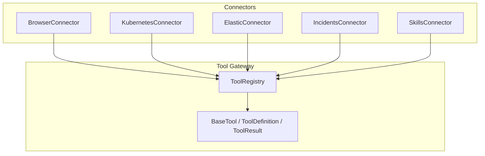
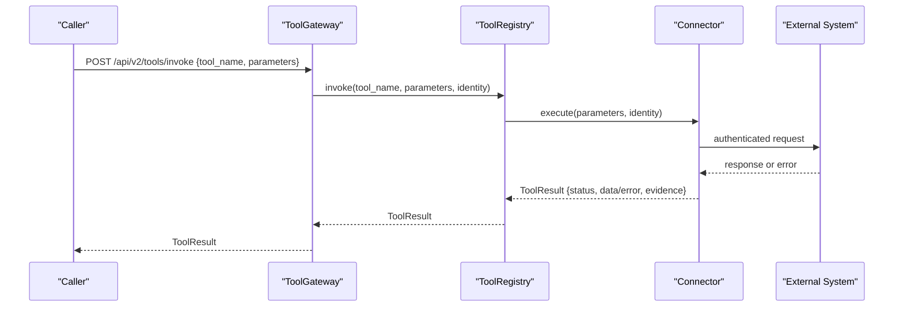
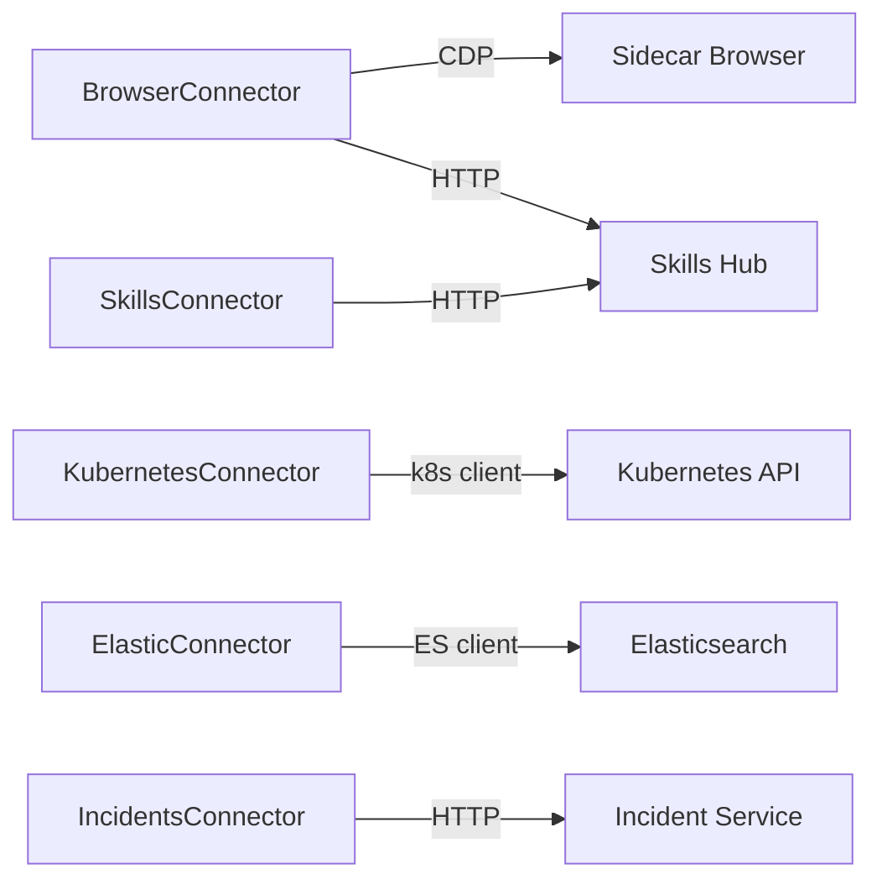

# Built-in Connectors

<cite>
**Referenced Files in This Document**
- [README.md](file://products/tool-gateway/README.md)
- [browser_connector.py](file://products/tool-gateway/src/tool_gateway/tools/browser_connector.py)
- [k8s_connector.py](file://products/tool-gateway/src/tool_gateway/tools/k8s_connector.py)
- [elastic_connector.py](file://products/tool-gateway/src/tool_gateway/tools/elastic_connector.py)
- [incidents_connector.py](file://products/tool-gateway/src/tool_gateway/tools/incidents_connector.py)
- [skills_connector.py](file://products/tool-gateway/src/tool_gateway/tools/skills_connector.py)
- [base.py](file://products/tool-gateway/src/tool_gateway/tools/base.py)
- [registry.py](file://products/tool-gateway/src/tool_gateway/tools/registry.py)
</cite>

## Table of Contents
1. [Introduction](#introduction)
2. [Project Structure](#project-structure)
3. [Core Components](#core-components)
4. [Architecture Overview](#architecture-overview)
5. [Detailed Component Analysis](#detailed-component-analysis)
6. [Dependency Analysis](#dependency-analysis)
7. [Performance Considerations](#performance-considerations)
8. [Troubleshooting Guide](#troubleshooting-guide)
9. [Conclusion](#conclusion)

## Introduction
This document describes the built-in tool connectors provided by the platform’s Tool Gateway. It covers:
- Browser automation connector for bounded web operations (navigation, snapshots, screenshots, credential filling, and interactions).
- Kubernetes connector for cluster inspection and a bounded mutating primitive.
- Elasticsearch connector for log querying and service health/alerts.
- Incidents connector for read-only access to incident records.
- Skills connector for skill repository discovery and retrieval.

For each connector, you will find usage examples, parameter specifications, error handling patterns, security considerations, and access control requirements.

## Project Structure
The connectors are implemented under the Tool Gateway product as individual modules that register tools via a shared registry and base framework. Each connector exposes a small, stable surface with typed parameters, structured results, and evidence envelopes.

**Diagram sources**
- [registry.py:18-89](file://products/tool-gateway/src/tool_gateway/tools/registry.py#L18-L89)
- [base.py:15-123](file://products/tool-gateway/src/tool_gateway/tools/base.py#L15-L123)

**Section sources**
- [README.md:1-167](file://products/tool-gateway/README.md#L1-L167)

## Core Components
- Base abstractions define tool metadata, execution contracts, and standardized result/evidence envelopes.
- The registry enforces risk-tier admission and dispatches invocations to registered tools.
- Each connector implements a set of tools with consistent parameter validation, error mapping, and evidence generation.

Key behaviors:
- Risk tiers: read, write, admin; mutating tools require explicit enablement and authorization.
- Evidence envelope: every result includes execution time, risk level, and source system.
- Structured errors: all failures return a code/message pair for reliable handling.

**Section sources**
- [base.py:15-123](file://products/tool-gateway/src/tool_gateway/tools/base.py#L15-L123)
- [registry.py:18-89](file://products/tool-gateway/src/tool_gateway/tools/registry.py#L18-L89)

## Architecture Overview
The Tool Gateway exposes two endpoints: tool discovery and tool invocation. Tools are registered per connector and gated by policy and risk tier. External integrations are isolated behind connector classes that manage client lifecycles and authentication.

**Diagram sources**
- [registry.py:65-89](file://products/tool-gateway/src/tool_gateway/tools/registry.py#L65-L89)
- [base.py:35-69](file://products/tool-gateway/src/tool_gateway/tools/base.py#L35-L69)

## Detailed Component Analysis

### Browser Connector
Purpose: Bounded web-check automation over a sidecar browser using CDP. Provides navigation, snapshots, screenshots, credential filling, and interaction tools with strict origin allowlisting, flow binding, and deviation guards.

Tools:
- Read tier: web.navigate, web.snapshot, web.screenshot, web.fill_credential, web.extract, web.wait_for, web.hover, web.scroll, web.switch_frame
- Write tier: web.click, web.type, web.select, web.press_key, web.upload_file, web.evaluate

Key parameters and behavior:
- web.navigate
  - url (required): absolute http(s) URL
  - skill_id (optional): binds a web-check flow from skills-hub; validates declared web_target and risk_class
- web.fill_credential
  - Uses platform-managed credential sets; values never appear in results, snapshots, or logs
- web.snapshot/web.screenshot
  - Capture current page state; screenshot supports compression and clipping to meet size limits
- Interaction tools
  - Require element refs from web.snapshot; write-tier actions are subject to HITL gates and step budgets when bound to a flow

Security and access control:
- Origin allowlist: navigation and captures enforce an operator-configured allowlist; off-allowlist pages are halted
- Flow binding: optional skill-based binding constrains allowed origins, risk class, and step budget
- Identity: sessions keyed by chat session id; fallback to verified subject
- Credential masking: password-like values are masked in screenshots and URLs in evidence

Error handling patterns:
- Denials: BROWSER_ORIGIN_NOT_ALLOWED, BROWSER_FLOW_TARGET_MISMATCH, BROWSER_FLOW_READ_ONLY, BROWSER_FLOW_EXHAUSTED, BROWSER_REDIRECT_NOT_ALLOWED, BROWSER_FLOW_ORIGIN_DEVIATED, BROWSER_FLOW_DENIED, BROWSER_FLOW_AUTHORITY_STALE
- Configuration/runtime: BROWSER_NO_IDENTITY, BROWSER_NOT_READY
- Parameter/validation: INVALID_PARAMETERS, BROWSER_REF_UNKNOWN

Usage example:
- Navigate to an allowlisted URL and bind a skill flow, then take a snapshot and click a ref after approval if write-tier.

Configuration flags:
- GATEWAY_BROWSER_ENABLED, GATEWAY_BROWSER_CDP_ENDPOINT, GATEWAY_BROWSER_ALLOW_ORIGINS, GATEWAY_BROWSER_SESSION_TTL, GATEWAY_BROWSER_MAX_SESSIONS, GATEWAY_BROWSER_FLOW_MAX_STEPS, GATEWAY_BROWSER_CREDENTIAL_SETS, GATEWAY_BROWSER_SCREENSHOT_MAX_BYTES

**Section sources**
- [browser_connector.py:1-105](file://products/tool-gateway/src/tool_gateway/tools/browser_connector.py#L1-L105)
- [browser_connector.py:315-399](file://products/tool-gateway/src/tool_gateway/tools/browser_connector.py#L315-L399)
- [browser_connector.py:730-800](file://products/tool-gateway/src/tool_gateway/tools/browser_connector.py#L730-L800)
- [browser_connector.py:482-598](file://products/tool-gateway/src/tool_gateway/tools/browser_connector.py#L482-L598)
- [browser_connector.py:599-698](file://products/tool-gateway/src/tool_gateway/tools/browser_connector.py#L599-L698)
- [README.md:56-63](file://products/tool-gateway/README.md#L56-L63)

### Kubernetes Connector
Purpose: Read-only cluster inspection plus one bounded mutating action for restart-like workflows.

Tools:
- k8s.list_pods(namespace?, label_selector?)
- k8s.get_pod(name, namespace?)
- k8s.get_events(namespace?, field_selector?)
- k8s.get_pod_logs(name, namespace?, container?, tail_lines?)
- k8s.delete_pod(name, namespace?) — write-tier, only when mutating tools are enabled

Parameters:
- namespace defaults to configured default or “default”
- label_selector and field_selector filter lists
- tail_lines clamped to a safe maximum

Security and access control:
- Uses in-cluster config or kubeconfig; requires RBAC permissions for reads and pod deletion
- Mutating tool registration is controlled by environment flag and policy

Error handling patterns:
- K8S_NOT_CONFIGURED when client not available
- INVALID_PARAMETERS for missing/invalid inputs
- K8S_API_ERROR for API failures
- POD_NOT_FOUND for 404 on delete
- K8S_PERMISSION_DENIED for 403 on delete

Usage example:
- List pods in a namespace with a label selector; get detailed pod status; retrieve recent logs; delete a pod to trigger controller recreation.

Configuration flags:
- GATEWAY_K8S_ENABLED, GATEWAY_MUTATING_TOOLS_ENABLED, GATEWAY_K8S_NAMESPACE

**Section sources**
- [k8s_connector.py:1-16](file://products/tool-gateway/src/tool_gateway/tools/k8s_connector.py#L1-L16)
- [k8s_connector.py:41-92](file://products/tool-gateway/src/tool_gateway/tools/k8s_connector.py#L41-L92)
- [k8s_connector.py:231-276](file://products/tool-gateway/src/tool_gateway/tools/k8s_connector.py#L231-L276)
- [k8s_connector.py:278-327](file://products/tool-gateway/src/tool_gateway/tools/k8s_connector.py#L278-L327)
- [k8s_connector.py:329-374](file://products/tool-gateway/src/tool_gateway/tools/k8s_connector.py#L329-L374)
- [k8s_connector.py:376-437](file://products/tool-gateway/src/tool_gateway/tools/k8s_connector.py#L376-L437)
- [k8s_connector.py:439-518](file://products/tool-gateway/src/tool_gateway/tools/k8s_connector.py#L439-L518)
- [README.md:56-57](file://products/tool-gateway/README.md#L56-L57)

### Elasticsearch Connector
Purpose: Read-only observability queries against an Elastic cluster for logs, service health metrics, and active alerts.

Tools:
- elastic.search_logs(query, index?, time_range_minutes?, max_results?)
- elastic.get_service_health(service_name, time_range_minutes?)
- elastic.get_active_alerts(severity?, max_results?)

Parameters:
- query required for search_logs
- index defaults to “*”
- time_range_minutes clamped to a safe maximum
- max_results clamped to a safe maximum
- severity enum for alerts: critical, warning, info

Security and access control:
- Authenticates via API key or basic auth
- TLS verification configurable

Error handling patterns:
- ELASTIC_NOT_CONFIGURED when not enabled or unreachable
- INVALID_PARAMETERS for bad inputs
- ELASTIC_CONNECTION_ERROR for transport/query failures

Usage example:
- Search logs with KQL over a time window; compute error rate and latency for a service; list active alerts filtered by severity.

Configuration flags:
- GATEWAY_ELASTIC_ENABLED, GATEWAY_ELASTIC_URL, GATEWAY_ELASTIC_API_KEY, GATEWAY_ELASTIC_USERNAME, GATEWAY_ELASTIC_PASSWORD, GATEWAY_ELASTIC_VERIFY_TLS, GATEWAY_ELASTIC_ALERTS_INDEX

**Section sources**
- [elastic_connector.py:1-12](file://products/tool-gateway/src/tool_gateway/tools/elastic_connector.py#L1-L12)
- [elastic_connector.py:40-103](file://products/tool-gateway/src/tool_gateway/tools/elastic_connector.py#L40-L103)
- [elastic_connector.py:287-380](file://products/tool-gateway/src/tool_gateway/tools/elastic_connector.py#L287-L380)
- [elastic_connector.py:382-457](file://products/tool-gateway/src/tool_gateway/tools/elastic_connector.py#L382-L457)
- [elastic_connector.py:459-535](file://products/tool-gateway/src/tool_gateway/tools/elastic_connector.py#L459-L535)
- [README.md:57-58](file://products/tool-gateway/README.md#L57-L58)

### Incidents Connector
Purpose: Read-only access to the incident-service for listing and retrieving incidents.

Tools:
- incidents.list(status?, severity?, source?, limit?, offset?)
- incidents.get(incident_id)

Parameters:
- Filtered list by lifecycle status, severity, and source
- Pagination via limit and offset
- incident_id validated against a strict pattern

Security and access control:
- Uses Basic-auth credentials held by the gateway
- No mutating incident tools; writes are internal service-to-service only

Error handling patterns:
- INCIDENT_NOT_FOUND for 404
- UPSTREAM_ERROR for non-200 responses
- TOOL_EXECUTION_ERROR for transport failures

Usage example:
- List new or triaging incidents with a limit; fetch full details including triage report for a specific incident.

Configuration flags:
- GATEWAY_INCIDENTS_SERVICE_URL, GATEWAY_INCIDENTS_CLIENT_ID, GATEWAY_INCIDENTS_CLIENT_SECRET

**Section sources**
- [incidents_connector.py:1-13](file://products/tool-gateway/src/tool_gateway/tools/incidents_connector.py#L1-L13)
- [incidents_connector.py:68-94](file://products/tool-gateway/src/tool_gateway/tools/incidents_connector.py#L68-L94)
- [incidents_connector.py:154-273](file://products/tool-gateway/src/tool_gateway/tools/incidents_connector.py#L154-L273)
- [incidents_connector.py:275-339](file://products/tool-gateway/src/tool_gateway/tools/incidents_connector.py#L275-L339)
- [README.md:59-60](file://products/tool-gateway/README.md#L59-L60)

### Skills Connector
Purpose: Read-only access to the skills-hub for discovering and retrieving operational skills and runbooks.

Tools:
- skills.search(query, source?, tag?, limit?)
- skills.get(skill_id)
- skills.list(source?, tag?, limit?, offset?)

Parameters:
- Free-text search with optional filters
- Namespaced skill_id validated before use
- Pagination support for list

Security and access control:
- Uses Basic-auth credentials held by the gateway
- Forwards x-request-id for audit correlation

Error handling patterns:
- SKILL_NOT_FOUND for 404
- UPSTREAM_ERROR for non-200 responses
- TOOL_EXECUTION_ERROR for transport failures

Usage example:
- Search for skills by keywords and tags; retrieve full content of a skill; list available skills with pagination.

Configuration flags:
- GATEWAY_SKILLS_SERVICE_URL, GATEWAY_SKILLS_CLIENT_ID, GATEWAY_SKILLS_CLIENT_SECRET

**Section sources**
- [skills_connector.py:1-12](file://products/tool-gateway/src/tool_gateway/tools/skills_connector.py#L1-L12)
- [skills_connector.py:71-109](file://products/tool-gateway/src/tool_gateway/tools/skills_connector.py#L71-L109)
- [skills_connector.py:154-246](file://products/tool-gateway/src/tool_gateway/tools/skills_connector.py#L154-L246)
- [skills_connector.py:248-310](file://products/tool-gateway/src/tool_gateway/tools/skills_connector.py#L248-L310)
- [skills_connector.py:312-419](file://products/tool-gateway/src/tool_gateway/tools/skills_connector.py#L312-L419)
- [README.md:58-59](file://products/tool-gateway/README.md#L58-L59)

## Dependency Analysis
Connectors depend on external clients and services:
- Browser connector depends on Playwright CDP and skills-hub for flow binding.
- Kubernetes connector depends on kubernetes-client/python and in-cluster or kubeconfig.
- Elasticsearch connector depends on elasticsearch Python client.
- Incidents and skills connectors depend on HTTP clients and respective services.

**Diagram sources**
- [browser_connector.py:315-351](file://products/tool-gateway/src/tool_gateway/tools/browser_connector.py#L315-L351)
- [k8s_connector.py:41-76](file://products/tool-gateway/src/tool_gateway/tools/k8s_connector.py#L41-L76)
- [elastic_connector.py:40-97](file://products/tool-gateway/src/tool_gateway/tools/elastic_connector.py#L40-L97)
- [incidents_connector.py:68-94](file://products/tool-gateway/src/tool_gateway/tools/incidents_connector.py#L68-L94)
- [skills_connector.py:71-109](file://products/tool-gateway/src/tool_gateway/tools/skills_connector.py#L71-L109)

**Section sources**
- [README.md:56-63](file://products/tool-gateway/README.md#L56-L63)

## Performance Considerations
- Browser sessions: idle TTL and pool caps prevent resource exhaustion; screenshots compress to meet byte limits.
- Kubernetes operations: executed in executors to avoid blocking event loops; tail_lines capped to protect resources.
- Elastic queries: time ranges and result counts are clamped to safe bounds; aggregations used for health metrics.
- HTTP connectors: timeouts enforced; upstream errors mapped quickly to structured results.

[No sources needed since this section provides general guidance]

## Troubleshooting Guide
Common issues and resolutions:
- Not configured:
  - K8S_NOT_CONFIGURED: ensure in-cluster config or kubeconfig is present.
  - ELASTIC_NOT_CONFIGURED: verify URL and credentials; check TLS settings.
  - SKILLS_NOT_CONFIGURED or SKILLS_UNAVAILABLE: confirm skills-hub URL and credentials.
  - INCIDENT_NOT_FOUND: validate incident_id format and existence.
- Authorization denials:
  - Policy denies mutating tools unless explicitly enabled and authorized.
- Browser-specific:
  - BROWSER_ORIGIN_NOT_ALLOWED: add target origin to allowlist.
  - BROWSER_FLOW_* errors: ensure skill binding matches target and risk class; respect step budget.
  - BROWSER_REF_UNKNOWN: re-take snapshot to refresh refs.
- Transport errors:
  - Upstream unreachable returns TOOL_EXECUTION_ERROR; retry or check service health.

**Section sources**
- [k8s_connector.py:439-518](file://products/tool-gateway/src/tool_gateway/tools/k8s_connector.py#L439-L518)
- [elastic_connector.py:287-380](file://products/tool-gateway/src/tool_gateway/tools/elastic_connector.py#L287-L380)
- [incidents_connector.py:125-149](file://products/tool-gateway/src/tool_gateway/tools/incidents_connector.py#L125-L149)
- [skills_connector.py:128-149](file://products/tool-gateway/src/tool_gateway/tools/skills_connector.py#L128-L149)
- [browser_connector.py:482-698](file://products/tool-gateway/src/tool_gateway/tools/browser_connector.py#L482-L698)

## Conclusion
The platform’s built-in connectors provide a secure, standardized interface to external systems. They enforce risk-tier policies, produce structured results with evidence, and handle errors consistently. Operators can enable features selectively via configuration flags and rely on robust validation and guardrails to keep automated operations safe and auditable.

[No sources needed since this section summarizes without analyzing specific files]