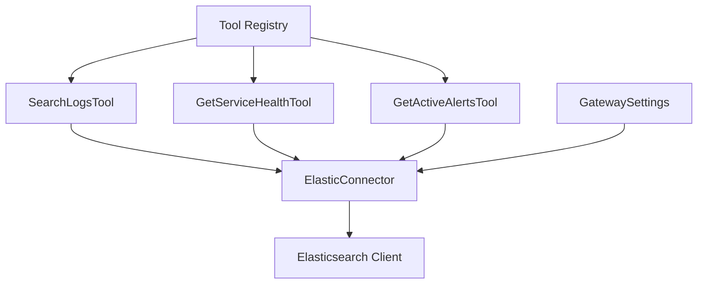
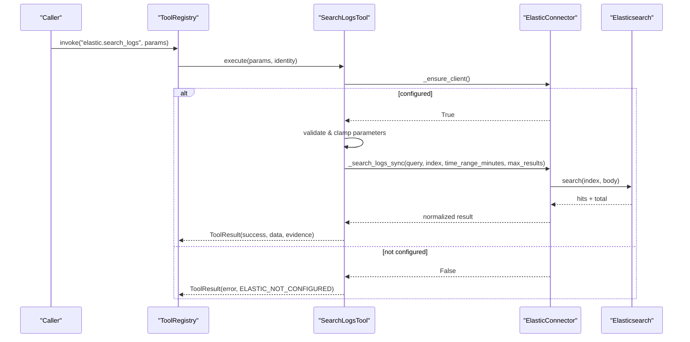
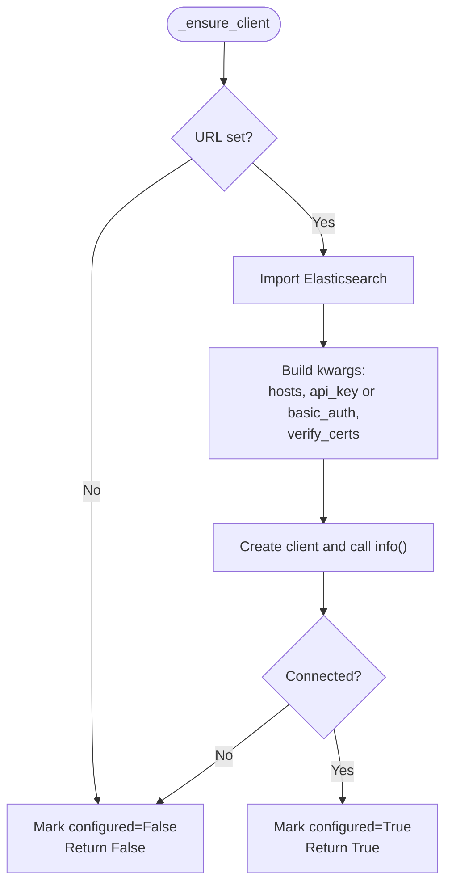
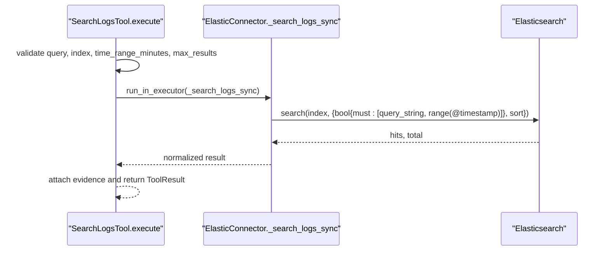
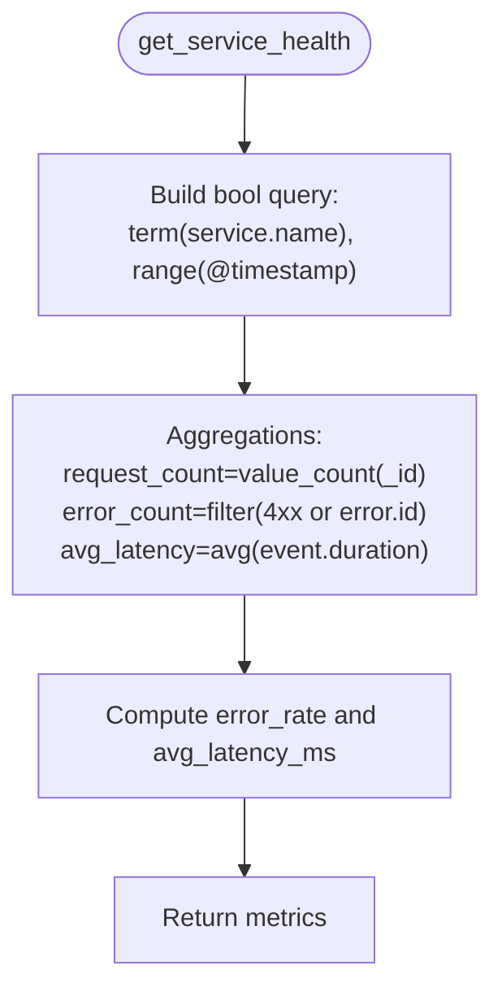
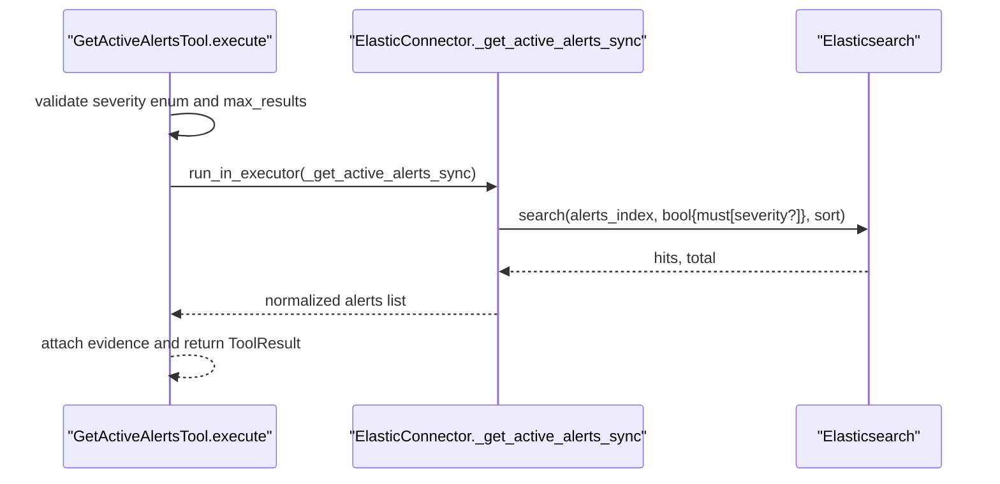
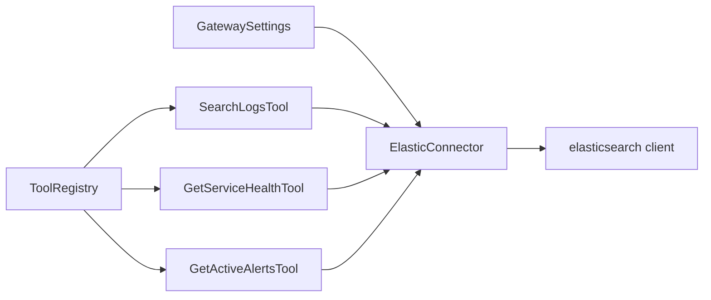

# Elasticsearch Connector

<cite>
**Referenced Files in This Document**
- [elastic_connector.py](file://products/tool-gateway/src/tool_gateway/tools/elastic_connector.py)
- [base.py](file://products/tool-gateway/src/tool_gateway/tools/base.py)
- [config.py](file://products/tool-gateway/src/tool_gateway/core/config.py)
- [test_elastic_connector.py](file://products/tool-gateway/tests/test_elastic_connector.py)
- [README.md](file://products/tool-gateway/README.md)
- [configuration-reference.md](file://docs/guides/configuration-reference.md)
- [tool-configuration.md](file://docs/guides/tool-configuration.md)
- [SPEC-011 spec.md](file://docs/specs/SPEC-011-observability-and-evidence-panels/spec.md)
- [SPEC-011 plan.md](file://docs/specs/SPEC-011-observability-and-evidence-panels/plan.md)
- [app.py](file://products/tool-gateway/src/tool_gateway/app.py)
</cite>

## Table of Contents
1. [Introduction](#introduction)
2. [Project Structure](#project-structure)
3. [Core Components](#core-components)
4. [Architecture Overview](#architecture-overview)
5. [Detailed Component Analysis](#detailed-component-analysis)
6. [Dependency Analysis](#dependency-analysis)
7. [Performance Considerations](#performance-considerations)
8. [Troubleshooting Guide](#troubleshooting-guide)
9. [Conclusion](#conclusion)
10. [Appendices](#appendices)

## Introduction
This document describes the Elasticsearch connector implemented in the tool-gateway product. It provides read-only observability tools that query logs, compute service health metrics, and list active alerts from an Elasticsearch cluster. The connector supports API-key or basic authentication, enforces parameter limits, builds structured evidence for audit trails, and integrates with the platform’s tool execution framework.

## Project Structure
The Elasticsearch connector is implemented as a set of tools registered into the tool-gateway registry when enabled by configuration. Key files:
- Connector and tools: products/tool-gateway/src/tool_gateway/tools/elastic_connector.py
- Tool base abstractions and evidence helpers: products/tool-gateway/src/tool_gateway/tools/base.py
- Configuration and feature gate: products/tool-gateway/src/tool_gateway/core/config.py
- Tests validating behavior: products/tool-gateway/tests/test_elastic_connector.py
- Feature documentation and environment variables: docs/guides/configuration-reference.md, docs/guides/tool-configuration.md, products/tool-gateway/README.md, docs/specs/SPEC-011-observability-and-evidence-panels/spec.md

**Diagram sources**
- [elastic_connector.py:98-102](file://products/tool-gateway/src/tool_gateway/tools/elastic_connector.py#L98-L102)
- [config.py:47-53](file://products/tool-gateway/src/tool_gateway/core/config.py#L47-L53)

**Section sources**
- [elastic_connector.py:1-102](file://products/tool-gateway/src/tool_gateway/tools/elastic_connector.py#L1-L102)
- [config.py:32-53](file://products/tool-gateway/src/tool_gateway/core/config.py#L32-L53)

## Core Components
- ElasticConnector: Manages the Elasticsearch client lifecycle, authentication, TLS settings, and registers three read-only tools.
- SearchLogsTool: Executes log searches using KQL or simple text, with time-range filtering and result limits.
- GetServiceHealthTool: Computes request count, error count, error rate, and average latency for a service using aggregations.
- GetActiveAlertsTool: Lists active alerts from a configurable index pattern, optionally filtered by severity.

All tools are marked as read-level and return structured results with evidence metadata for auditability.

**Section sources**
- [elastic_connector.py:40-102](file://products/tool-gateway/src/tool_gateway/tools/elastic_connector.py#L40-L102)
- [base.py:15-69](file://products/tool-gateway/src/tool_gateway/tools/base.py#L15-L69)

## Architecture Overview
The connector is feature-gated via configuration and lazily initializes the Elasticsearch client on first use. Authentication prefers API keys; if not provided, it falls back to basic auth. Each tool validates parameters, clamps values to safe bounds, executes queries synchronously in an executor to avoid blocking the event loop, and returns either success data or a structured error. Evidence is attached to every result for audit trail integration.

**Diagram sources**
- [elastic_connector.py:61-96](file://products/tool-gateway/src/tool_gateway/tools/elastic_connector.py#L61-L96)
- [elastic_connector.py:106-149](file://products/tool-gateway/src/tool_gateway/tools/elastic_connector.py#L106-L149)
- [elastic_connector.py:328-379](file://products/tool-gateway/src/tool_gateway/tools/elastic_connector.py#L328-L379)

## Detailed Component Analysis

### ElasticConnector
Responsibilities:
- Lazy initialization of the Elasticsearch client with API key or basic auth.
- Optional TLS verification control.
- Registration of read-only tools into the tool registry.
- Synchronous query methods executed off the event loop.

Authentication flow:
- If an API key is present, it is used.
- Otherwise, if username and password are present, basic auth is used.
- TLS verification can be disabled via configuration.

Connectivity check:
- On successful client creation, a connectivity probe is performed.

Error handling:
- Import errors (missing elasticsearch package) and connection failures mark the connector as not configured.

**Diagram sources**
- [elastic_connector.py:61-96](file://products/tool-gateway/src/tool_gateway/tools/elastic_connector.py#L61-L96)

**Section sources**
- [elastic_connector.py:40-96](file://products/tool-gateway/src/tool_gateway/tools/elastic_connector.py#L40-L96)

### SearchLogsTool
Capabilities:
- Accepts a query string (KQL or simple text), optional index pattern, time range, and maximum results.
- Enforces minimum and maximum bounds for time range and result size.
- Builds a bool query combining a query_string clause and a timestamp range filter.
- Sorts results by timestamp descending.
- Normalizes hits into documents including id and index metadata.

Index pattern matching:
- Defaults to all indices when none is specified.

Pagination:
- Uses size to limit returned hits; no cursor-based pagination is implemented.

Time range filtering:
- Applies a range filter on @timestamp relative to current UTC time.

Field-specific searches:
- Supported through the query string passed to query_string.

**Diagram sources**
- [elastic_connector.py:106-149](file://products/tool-gateway/src/tool_gateway/tools/elastic_connector.py#L106-L149)
- [elastic_connector.py:328-379](file://products/tool-gateway/src/tool_gateway/tools/elastic_connector.py#L328-L379)

**Section sources**
- [elastic_connector.py:106-149](file://products/tool-gateway/src/tool_gateway/tools/elastic_connector.py#L106-L149)
- [elastic_connector.py:287-379](file://products/tool-gateway/src/tool_gateway/tools/elastic_connector.py#L287-L379)

### GetServiceHealthTool
Capabilities:
- Aggregates request_count via value_count on _id.
- Computes error_count using a filter that matches HTTP status codes >= 400 or presence of error.id.
- Calculates avg_latency_ms from event.duration (nanoseconds converted to milliseconds).
- Derives error_rate as error_count / request_count with zero division protection.

Aggregation functions:
- value_count, filter, avg.

Scope:
- Searches across all indices to compute metrics for a given service.name.

**Diagram sources**
- [elastic_connector.py:151-211](file://products/tool-gateway/src/tool_gateway/tools/elastic_connector.py#L151-L211)

**Section sources**
- [elastic_connector.py:151-211](file://products/tool-gateway/src/tool_gateway/tools/elastic_connector.py#L151-L211)
- [elastic_connector.py:382-456](file://products/tool-gateway/src/tool_gateway/tools/elastic_connector.py#L382-L456)

### GetActiveAlertsTool
Capabilities:
- Queries a configurable alerts index pattern (default .alerts-*).
- Optionally filters by severity (critical, warning, info).
- Returns alert details including id, severity, status, rule name, message, and timestamp.

Sorting:
- By severity ascending and timestamp descending.

**Diagram sources**
- [elastic_connector.py:213-247](file://products/tool-gateway/src/tool_gateway/tools/elastic_connector.py#L213-L247)
- [elastic_connector.py:459-534](file://products/tool-gateway/src/tool_gateway/tools/elastic_connector.py#L459-L534)

**Section sources**
- [elastic_connector.py:213-247](file://products/tool-gateway/src/tool_gateway/tools/elastic_connector.py#L213-L247)
- [elastic_connector.py:459-534](file://products/tool-gateway/src/tool_gateway/tools/elastic_connector.py#L459-L534)

### Evidence and Audit Trail Integration
Every tool result includes an evidence envelope containing execution timestamp, duration, risk level, and source system. This evidence is consumed by the platform’s audit trail and evidence panels, enabling traceability of tool invocations and their outcomes.

Evidence fields:
- executed_at: ISO timestamp.
- duration_ms: measured by each tool.
- risk_level: read for all Elastic tools.
- source_system: elastic.

Integration points:
- Tool results are serialized and surfaced in the operator portal’s evidence panel.
- Errors include structured codes and messages for consistent auditing.

**Section sources**
- [base.py:35-86](file://products/tool-gateway/src/tool_gateway/tools/base.py#L35-L86)
- [test_elastic_connector.py:80-97](file://products/tool-gateway/tests/test_elastic_connector.py#L80-L97)

## Dependency Analysis
External dependencies:
- Official elasticsearch Python client, version-capped below major 9.

Configuration dependencies:
- Feature gate: GATEWAY_ELASTIC_ENABLED.
- Connection settings: URL, API key or username/password, TLS verification, alerts index pattern.

Platform integration:
- Tools are registered only when the feature is enabled.
- Results integrate with the tool execution framework and evidence system.

**Diagram sources**
- [config.py:47-53](file://products/tool-gateway/src/tool_gateway/core/config.py#L47-L53)
- [elastic_connector.py:98-102](file://products/tool-gateway/src/tool_gateway/tools/elastic_connector.py#L98-L102)

**Section sources**
- [config.py:75-127](file://products/tool-gateway/src/tool_gateway/core/config.py#L75-L127)
- [README.md:57-98](file://products/tool-gateway/README.md#L57-L98)

## Performance Considerations
- Time range clamping: time_range_minutes is bounded to a maximum to prevent overly broad scans.
- Result size limiting: max_results is capped to reduce payload sizes and network overhead.
- Executor usage: synchronous Elasticsearch calls are run in a thread executor to avoid blocking the async event loop.
- Aggregation efficiency: service health uses size: 0 and server-side aggregations to minimize data transfer.
- Sorting: timestamps are sorted to provide recent-first ordering without additional client processing.

Recommendations:
- Use narrow index patterns to limit scan scope.
- Prefer specific field filters in the query string to leverage index mappings.
- Keep time ranges as small as necessary for the analysis.
- Avoid large max_results; paginate at the application layer if needed by issuing multiple calls with different time windows.

[No sources needed since this section provides general guidance]

## Troubleshooting Guide
Common issues and resolutions:
- Not configured:
  - Symptom: Tools return ELASTIC_NOT_CONFIGURED.
  - Cause: Missing URL or failed client initialization.
  - Resolution: Set GATEWAY_ELASTIC_ENABLED=true and configure GATEWAY_ELASTIC_URL plus credentials.

- Invalid parameters:
  - Symptom: INVALID_PARAMETERS errors for missing or out-of-range values.
  - Causes: Missing required fields, non-integer types, or values outside allowed ranges.
  - Resolution: Provide required parameters and ensure integers are within bounds enforced by the connector.

- Connection errors:
  - Symptom: ELASTIC_CONNECTION_ERROR with exception details.
  - Causes: Network issues, TLS misconfiguration, or unreachable cluster.
  - Resolution: Verify endpoint reachability, TLS settings, and credentials.

- Package not installed:
  - Symptom: Connector reports missing elasticsearch package.
  - Resolution: Install the elasticsearch client dependency in the tool-gateway runtime.

Operational checks:
- Confirm feature flag and environment variables are set correctly.
- Validate that the Elasticsearch cluster responds to basic connectivity checks.
- Review tool evidence for duration and timestamps to diagnose slow queries.

**Section sources**
- [test_elastic_connector.py:15-41](file://products/tool-gateway/tests/test_elastic_connector.py#L15-L41)
- [test_elastic_connector.py:228-234](file://products/tool-gateway/tests/test_elastic_connector.py#L228-L234)
- [test_elastic_connector.py:245-290](file://products/tool-gateway/tests/test_elastic_connector.py#L245-L290)
- [configuration-reference.md:22-22](file://docs/guides/configuration-reference.md#L22-L22)
- [tool-configuration.md:187-192](file://docs/guides/tool-configuration.md#L187-L192)

## Conclusion
The Elasticsearch connector provides secure, auditable, and performant read-only access to logs, service health metrics, and alerts. It integrates cleanly with the platform’s tool execution framework, enforcing parameter safety, attaching evidence, and surfacing structured errors. Operators should configure appropriate index patterns, credential scopes, and time ranges to optimize performance and maintain least privilege access.

[No sources needed since this section summarizes without analyzing specific files]

## Appendices

### Configuration Reference
- Feature gate: GATEWAY_ELASTIC_ENABLED
- Connection: GATEWAY_ELASTIC_URL
- Authentication: GATEWAY_ELASTIC_API_KEY or GATEWAY_ELASTIC_USERNAME + GATEWAY_ELASTIC_PASSWORD
- TLS: GATEWAY_ELASTIC_VERIFY_TLS
- Alerts index: GATEWAY_ELASTIC_ALERTS_INDEX

Environment loading and defaults are defined in the gateway settings.

**Section sources**
- [config.py:47-53](file://products/tool-gateway/src/tool_gateway/core/config.py#L47-L53)
- [config.py:113-127](file://products/tool-gateway/src/tool_gateway/core/config.py#L113-L127)
- [README.md:95-98](file://products/tool-gateway/README.md#L95-L98)
- [configuration-reference.md:468-468](file://docs/guides/configuration-reference.md#L468-L468)

### Common Log Analysis Queries
Examples of typical queries you can pass to SearchLogsTool:
- Find errors in the last 15 minutes:
  - query: "level:error"
  - time_range_minutes: 15
  - index: "logs-*"
  - max_results: 50
- Search for a specific service and keyword:
  - query: "service.name:web-api AND 'connection refused'"
  - time_range_minutes: 30
  - index: "application-logs-*"
  - max_results: 100
- Filter by HTTP status codes:
  - query: "http.response.status_code:>=500"
  - time_range_minutes: 60
  - index: "api-logs-*"
  - max_results: 200

Note: These examples illustrate how to construct KQL-style queries compatible with the connector’s query_string usage.

[No sources needed since this section provides conceptual examples]

### Index Permissions and Data Access Controls
- The connector performs read-only operations against configured indices.
- Ensure the Elasticsearch user or API key has read permissions only to the intended indices and index patterns.
- For alerts, restrict access to the alerts index pattern configured via GATEWAY_ELASTIC_ALERTS_INDEX.
- Apply least privilege principles to prevent unintended data exposure.

[No sources needed since this section provides general guidance]

### Advanced Features and Limitations
- Date range filtering: Implemented via @timestamp range filter based on current UTC time.
- Field-specific searches: Achieved through query_string expressions targeting specific fields.
- Result pagination: Implemented via size-limited hits; cursor-based pagination is not supported. Applications can implement logical pagination by splitting time windows or using multiple calls.

[No sources needed since this section provides general guidance]

### Error Handling Summary
- ELASTIC_NOT_CONFIGURED: Connector not initialized due to missing configuration or failed connectivity.
- INVALID_PARAMETERS: Missing or invalid parameters such as query, service_name, severity, or out-of-range values.
- ELASTIC_CONNECTION_ERROR: Network or client errors during Elasticsearch communication.

Each error includes structured code and message fields and attaches evidence for auditability.

**Section sources**
- [elastic_connector.py:328-379](file://products/tool-gateway/src/tool_gateway/tools/elastic_connector.py#L328-L379)
- [elastic_connector.py:412-456](file://products/tool-gateway/src/tool_gateway/tools/elastic_connector.py#L412-L456)
- [elastic_connector.py:489-534](file://products/tool-gateway/src/tool_gateway/tools/elastic_connector.py#L489-L534)
- [test_elastic_connector.py:228-234](file://products/tool-gateway/tests/test_elastic_connector.py#L228-L234)