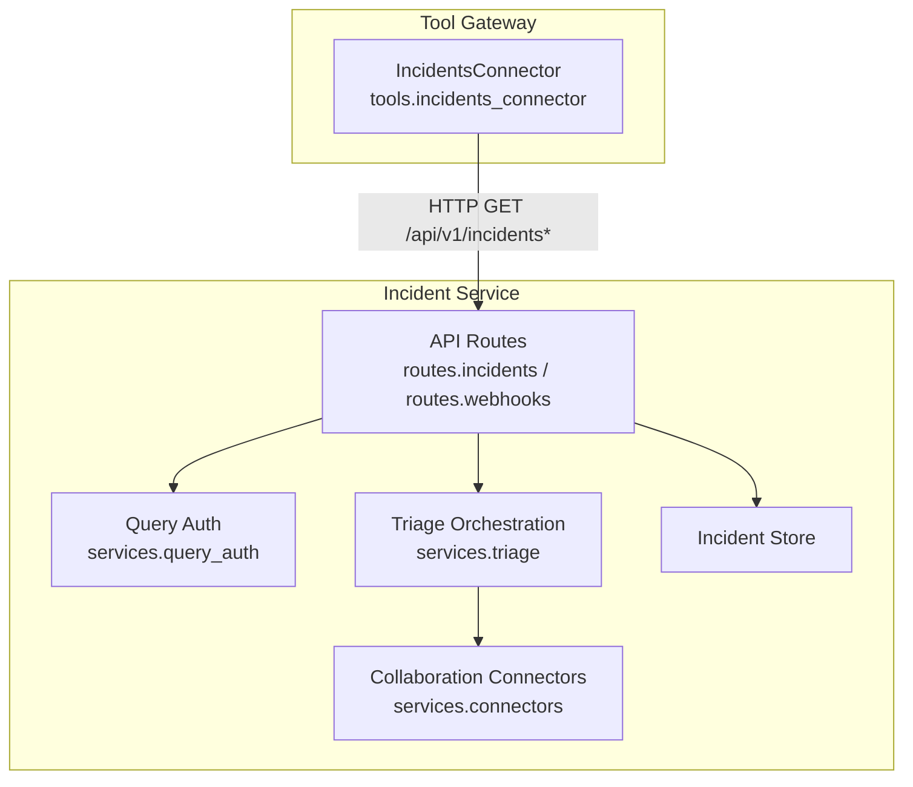
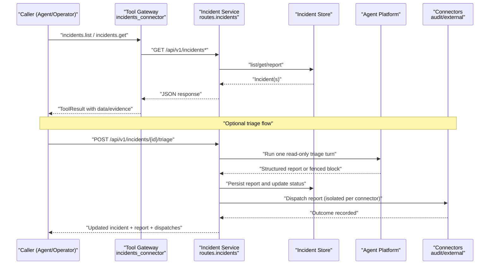
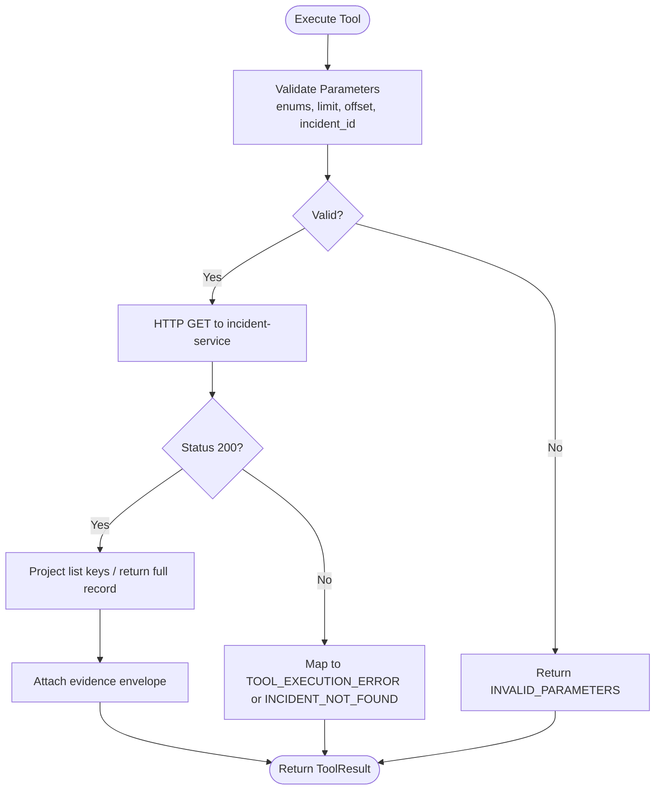
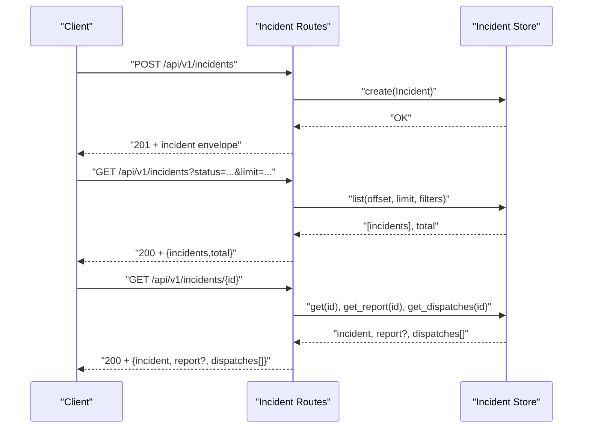
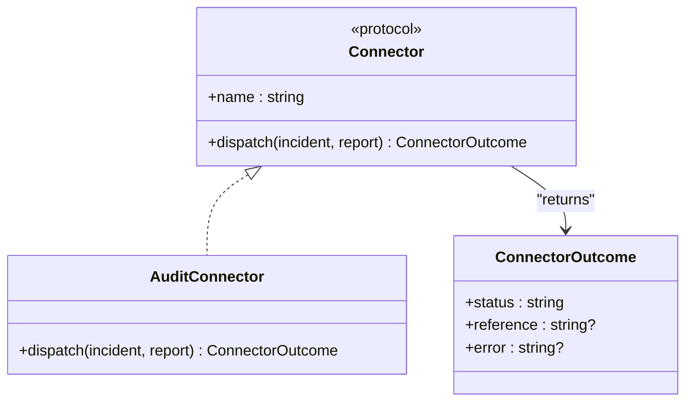
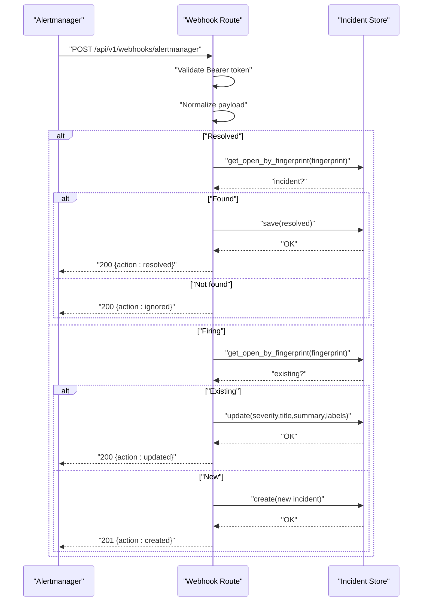
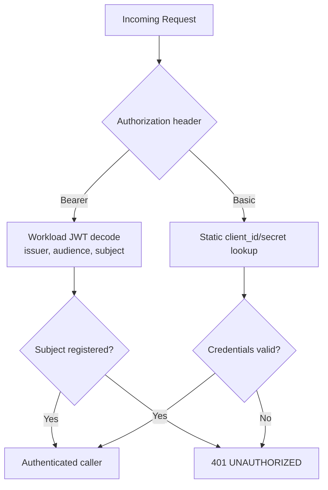
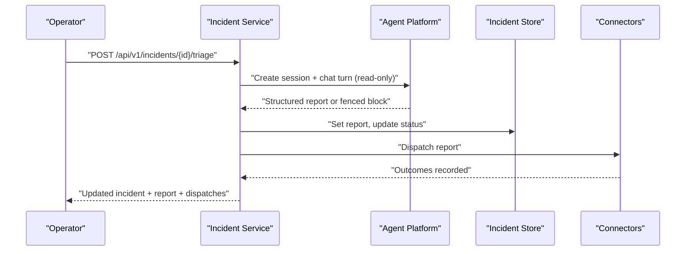
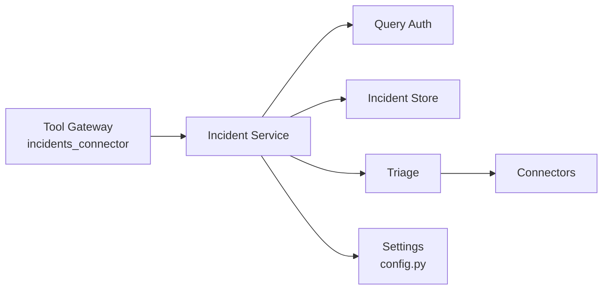

# Incidents Connector

<cite>
**Referenced Files in This Document**
- [incidents_connector.py](file://products/tool-gateway/src/tool_gateway/tools/incidents_connector.py)
- [incidents.py](file://products/incident-service/src/incident_service/api/routes/incidents.py)
- [webhooks.py](file://products/incident-service/src/incident_service/api/routes/webhooks.py)
- [connectors.py](file://products/incident-service/src/incident_service/services/connectors.py)
- [query_auth.py](file://products/incident-service/src/incident_service/services/query_auth.py)
- [config.py](file://products/incident-service/src/incident_service/core/config.py)
- [incident.schema.json](file://shared/shared-contracts/schemas/incident.schema.json)
- [triage.py](file://products/incident-service/src/incident_service/services/triage.py)
</cite>

## Table of Contents
1. Introduction
2. Project Structure
3. Core Components
4. Architecture Overview
5. Detailed Component Analysis
6. Dependency Analysis
7. Performance Considerations
8. Troubleshooting Guide
9. Conclusion

## Introduction
This document explains the incidents connector that enables read-only interaction with the incident management system, and how it fits into end-to-end incident workflows including creation, status updates, collaboration, webhooks, authentication, automation, and error handling. The connector exposes two tools:
- incidents.list: list tracked incidents with filters and pagination
- incidents.get: fetch a single incident by id, including its latest triage report and dispatch outcomes

The connector is strictly read-only; write-back to incident data is internal service-to-service only.

## Project Structure
The incidents feature spans two main components:
- Tool-gateway incidents connector: registers read-only tools that call the incident-service over HTTP using gateway-held credentials
- Incident-service: provides APIs for manual intake, webhook intake, query endpoints, triage orchestration, and collaboration connectors

**Diagram sources**
- [incidents_connector.py:68-93](file://products/tool-gateway/src/tool_gateway/tools/incidents_connector.py#L68-L93)
- [incidents.py:74-206](file://products/incident-service/src/incident_service/api/routes/incidents.py#L74-L206)
- [webhooks.py:69-102](file://products/incident-service/src/incident_service/api/routes/webhooks.py#L69-L102)
- [connectors.py:87-126](file://products/incident-service/src/incident_service/services/connectors.py#L87-L126)
- [triage.py:219-276](file://products/incident-service/src/incident_service/services/triage.py#L219-L276)

**Section sources**
- [incidents_connector.py:1-13](file://products/tool-gateway/src/tool_gateway/tools/incidents_connector.py#L1-L13)
- [incidents.py:1-8](file://products/incident-service/src/incident_service/api/routes/incidents.py#L1-L8)
- [webhooks.py:1-9](file://products/incident-service/src/incident_service/api/routes/webhooks.py#L1-L9)

## Core Components
- IncidentsConnector (tool-gateway): Registers read-only tools and issues authenticated HTTP requests to incident-service using Basic auth credentials held by the gateway.
- ListIncidentsTool and GetIncidentTool: Validate parameters, enforce enums and limits, and map upstream errors to structured tool results with evidence envelopes.
- Incident-service API routes: Provide manual incident creation, listing, retrieval, reporting, and triage triggering; also accept Alertmanager webhooks for real-time intake.
- Query authentication: Validates platform callers via static Basic credentials or projected workload tokens.
- Triage orchestration: Runs one agent turn in a dedicated session, validates structured output, and persists reports.
- Collaboration connectors: Dispatch validated triage reports to configured sinks (e.g., audit), recording outcomes without failing the triage path on connector errors.

**Section sources**
- [incidents_connector.py:68-93](file://products/tool-gateway/src/tool_gateway/tools/incidents_connector.py#L68-L93)
- [incidents_connector.py:154-272](file://products/tool-gateway/src/tool_gateway/tools/incidents_connector.py#L154-L272)
- [incidents_connector.py:275-339](file://products/tool-gateway/src/tool_gateway/tools/incidents_connector.py#L275-L339)
- [incidents.py:74-206](file://products/incident-service/src/incident_service/api/routes/incidents.py#L74-L206)
- [webhooks.py:69-102](file://products/incident-service/src/incident_service/api/routes/webhooks.py#L69-L102)
- [query_auth.py:104-116](file://products/incident-service/src/incident_service/services/query_auth.py#L104-L116)
- [triage.py:290-371](file://products/incident-service/src/incident_service/services/triage.py#L290-L371)
- [connectors.py:87-126](file://products/incident-service/src/incident_service/services/connectors.py#L87-L126)

## Architecture Overview
The incidents connector integrates with the incident-service through secure, authenticated HTTP calls. Webhooks provide real-time intake from monitoring systems. Triage runs as an operator-initiated workflow that produces a validated report and optionally dispatches it to collaboration sinks.

**Diagram sources**
- [incidents_connector.py:86-93](file://products/tool-gateway/src/tool_gateway/tools/incidents_connector.py#L86-L93)
- [incidents.py:131-206](file://products/incident-service/src/incident_service/api/routes/incidents.py#L131-L206)
- [triage.py:219-276](file://products/incident-service/src/incident_service/services/triage.py#L219-L276)
- [connectors.py:87-126](file://products/incident-service/src/incident_service/services/connectors.py#L87-L126)

## Detailed Component Analysis

### Incidents Connector (Tool-Gateway)
- Purpose: Expose read-only access to incident data via two tools.
- Authentication: Uses gateway-held Basic credentials when calling incident-service; never uses user tokens.
- Parameter validation: Enforces allowed enums for status/severity/source, clamps limit to a maximum, and validates offset.
- Error mapping: Converts upstream HTTP errors into structured tool errors with codes like INCIDENT_NOT_FOUND and UPSTREAM_ERROR.
- Evidence: Every outcome includes a standard evidence envelope with duration metrics.

**Diagram sources**
- [incidents_connector.py:96-148](file://products/tool-gateway/src/tool_gateway/tools/incidents_connector.py#L96-L148)
- [incidents_connector.py:208-272](file://products/tool-gateway/src/tool_gateway/tools/incidents_connector.py#L208-L272)
- [incidents_connector.py:301-339](file://products/tool-gateway/src/tool_gateway/tools/incidents_connector.py#L301-L339)

**Section sources**
- [incidents_connector.py:1-13](file://products/tool-gateway/src/tool_gateway/tools/incidents_connector.py#L1-L13)
- [incidents_connector.py:68-93](file://products/tool-gateway/src/tool_gateway/tools/incidents_connector.py#L68-L93)
- [incidents_connector.py:154-272](file://products/tool-gateway/src/tool_gateway/tools/incidents_connector.py#L154-L272)
- [incidents_connector.py:275-339](file://products/tool-gateway/src/tool_gateway/tools/incidents_connector.py#L275-L339)

### Incident Creation and Status Updates
- Manual creation: POST /api/v1/incidents accepts title, summary, severity, labels; creates a new incident with unique fingerprint and NEW status.
- Listing: GET /api/v1/incidents supports filtering by status, severity, source, with pagination and total count.
- Retrieval: GET /api/v1/incidents/{incident_id} returns the incident envelope plus latest report and dispatches.
- Reporting: GET /api/v1/incidents/{incident_id}/report returns the triage report if present.
- Status transitions: New -> Triaging -> Triaged/Triage_Failed; Resolved is terminal for intake lifecycle.

**Diagram sources**
- [incidents.py:74-128](file://products/incident-service/src/incident_service/api/routes/incidents.py#L74-L128)
- [incidents.py:131-176](file://products/incident-service/src/incident_service/api/routes/incidents.py#L131-L176)
- [incidents.py:179-206](file://products/incident-service/src/incident_service/api/routes/incidents.py#L179-L206)

**Section sources**
- [incidents.py:74-128](file://products/incident-service/src/incident_service/api/routes/incidents.py#L74-L128)
- [incidents.py:131-176](file://products/incident-service/src/incident_service/api/routes/incidents.py#L131-L176)
- [incidents.py:179-206](file://products/incident-service/src/incident_service/api/routes/incidents.py#L179-L206)
- [incident.schema.json:1-95](file://shared/shared-contracts/schemas/incident.schema.json#L1-L95)

### Comment Posting and Collaboration Features
- Comments are not exposed as a separate endpoint in the analyzed code. Collaboration is implemented via the connector framework that pushes validated triage reports to configured sinks.
- Built-in sink: audit connector records triage outcomes for observability and compliance.
- Extensibility: Additional collaboration adapters (e.g., Slack, Jira) can implement the same protocol and register in the registry.

**Diagram sources**
- [connectors.py:35-53](file://products/incident-service/src/incident_service/services/connectors.py#L35-L53)
- [connectors.py:59-63](file://products/incident-service/src/incident_service/services/connectors.py#L59-L63)

**Section sources**
- [connectors.py:1-10](file://products/incident-service/src/incident_service/services/connectors.py#L1-L10)
- [connectors.py:66-84](file://products/incident-service/src/incident_service/services/connectors.py#L66-L84)
- [connectors.py:87-126](file://products/incident-service/src/incident_service/services/connectors.py#L87-L126)

### Webhook Integration for Real-Time Notifications
- Alertmanager webhook: POST /api/v1/webhooks/alertmanager authenticates via a shared bearer token and normalizes payloads.
- Deduplication: Fingerprint-based dedupe; firing updates existing open incidents, resolved closes them; resolution for unknown fingerprint is an idempotent no-op success.
- Metrics and events: Intake counts and open incident counters are updated; events logged for created/updated/resolved actions.

**Diagram sources**
- [webhooks.py:57-102](file://products/incident-service/src/incident_service/api/routes/webhooks.py#L57-L102)
- [webhooks.py:105-144](file://products/incident-service/src/incident_service/api/routes/webhooks.py#L105-L144)
- [webhooks.py:147-206](file://products/incident-service/src/incident_service/api/routes/webhooks.py#L147-L206)

**Section sources**
- [webhooks.py:1-9](file://products/incident-service/src/incident_service/api/routes/webhooks.py#L1-L9)
- [webhooks.py:69-102](file://products/incident-service/src/incident_service/api/routes/webhooks.py#L69-L102)
- [webhooks.py:105-144](file://products/incident-service/src/incident_service/api/routes/webhooks.py#L105-L144)
- [webhooks.py:147-206](file://products/incident-service/src/incident_service/api/routes/webhooks.py#L147-L206)

### Authentication and Authorization
- Query authentication supports two paths:
  - Static Basic credentials against a registered client set
  - Workload identity using projected Kubernetes service-account tokens validated against cluster OIDC issuer JWKS with audience and subject checks
- Triage requires operator identity headers relayed by platform-gateway; triage always runs under a real operator identity.

**Diagram sources**
- [query_auth.py:33-42](file://products/incident-service/src/incident_service/services/query_auth.py#L33-L42)
- [query_auth.py:68-92](file://products/incident-service/src/incident_service/services/query_auth.py#L68-L92)
- [query_auth.py:104-116](file://products/incident-service/src/incident_service/services/query_auth.py#L104-L116)

**Section sources**
- [query_auth.py:1-11](file://products/incident-service/src/incident_service/services/query_auth.py#L1-L11)
- [query_auth.py:33-42](file://products/incident-service/src/incident_service/services/query_auth.py#L33-L42)
- [query_auth.py:68-92](file://products/incident-service/src/incident_service/services/query_auth.py#L68-L92)
- [query_auth.py:104-116](file://products/incident-service/src/incident_service/services/query_auth.py#L104-L116)
- [incidents.py:1-8](file://products/incident-service/src/incident_service/api/routes/incidents.py#L1-L8)

### Automated Incident Response Workflows and Escalation Procedures
- Triage run: Operator triggers triage; a single agent turn runs in a dedicated session, gathers evidence using read-only tools, and produces a validated triage report.
- Report persistence and status: On success, incident status advances to TRIAGED with session attribution; on failure, status becomes TRIAGE_FAILED with raw text preserved for inspection.
- Escalation via connectors: After triage, reports are dispatched to configured connectors (e.g., audit). External escalation targets can be added by implementing the connector protocol.

**Diagram sources**
- [incidents.py:235-283](file://products/incident-service/src/incident_service/api/routes/incidents.py#L235-L283)
- [triage.py:290-371](file://products/incident-service/src/incident_service/services/triage.py#L290-L371)
- [connectors.py:87-126](file://products/incident-service/src/incident_service/services/connectors.py#L87-L126)

**Section sources**
- [triage.py:1-14](file://products/incident-service/src/incident_service/services/triage.py#L1-L14)
- [triage.py:219-276](file://products/incident-service/src/incident_service/services/triage.py#L219-L276)
- [triage.py:290-371](file://products/incident-service/src/incident_service/services/triage.py#L290-L371)
- [connectors.py:1-10](file://products/incident-service/src/incident_service/services/connectors.py#L1-L10)

### Integration with External Monitoring Systems
- Alertmanager integration: Webhook endpoint accepts normalized alert groups, deduplicates by fingerprint, updates or creates incidents, and resolves on resolution signals.
- Normalization: Incoming payloads are normalized before storage; malformed or unauthorized payloads are rejected early.

**Section sources**
- [webhooks.py:69-102](file://products/incident-service/src/incident_service/api/routes/webhooks.py#L69-L102)
- [webhooks.py:147-206](file://products/incident-service/src/incident_service/api/routes/webhooks.py#L147-L206)

## Dependency Analysis
- Tool-gateway depends on incident-service HTTP API for read-only operations.
- Incident-service depends on:
  - Query authentication for callers
  - Incident store for persistence
  - Triage orchestration for agent-driven analysis
  - Collaboration connectors for post-triage distribution
- Configuration drives behavior: webhook token, query clients, workload identity settings, connector selection, and timeouts.

**Diagram sources**
- [incidents_connector.py:68-93](file://products/tool-gateway/src/tool_gateway/tools/incidents_connector.py#L68-L93)
- [query_auth.py:104-116](file://products/incident-service/src/incident_service/services/query_auth.py#L104-L116)
- [triage.py:290-371](file://products/incident-service/src/incident_service/services/triage.py#L290-L371)
- [connectors.py:73-84](file://products/incident-service/src/incident_service/services/connectors.py#L73-L84)
- [config.py:72-126](file://products/incident-service/src/incident_service/core/config.py#L72-L126)

**Section sources**
- [config.py:72-126](file://products/incident-service/src/incident_service/core/config.py#L72-L126)
- [connectors.py:66-84](file://products/incident-service/src/incident_service/services/connectors.py#L66-L84)

## Performance Considerations
- Timeouts: Connector HTTP calls use a fixed request timeout; triage calls configure a global timeout with connect timeout separately.
- Limits: List operations clamp limit to a maximum and default to a safe value; server-side list enforces a maximum limit.
- Pagination: Offset and limit enable controlled data transfer for large datasets.
- Isolation: Connector dispatch failures do not abort triage; each connector is isolated to avoid cascading failures.

[No sources needed since this section provides general guidance]

## Troubleshooting Guide
Common error scenarios and handling:
- Network failures: Transport errors from incident-service are mapped to TOOL_EXECUTION_ERROR with details; triage HTTP errors raise TriageError and mark incidents as TRIAGE_FAILED.
- Permission issues: Unauthorized or invalid credentials result in 401 UNAUTHORIZED; missing required headers for triage return INVALID_PARAMETERS.
- Data synchronization conflicts: Webhook resolution for unknown fingerprints is idempotent; duplicate firing updates existing open incidents rather than creating duplicates.

Operational tips:
- Verify webhook token configuration; unconfigured token rejects webhooks with 503.
- Ensure query clients or workload identities are correctly registered for service-to-service calls.
- Inspect triage_raw when triage fails to diagnose prompt or schema issues.

**Section sources**
- [incidents_connector.py:125-148](file://products/tool-gateway/src/tool_gateway/tools/incidents_connector.py#L125-L148)
- [incidents_connector.py:248-257](file://products/tool-gateway/src/tool_gateway/tools/incidents_connector.py#L248-L257)
- [incidents_connector.py:319-328](file://products/tool-gateway/src/tool_gateway/tools/incidents_connector.py#L319-L328)
- [incidents.py:74-90](file://products/incident-service/src/incident_service/api/routes/incidents.py#L74-L90)
- [incidents.py:235-256](file://products/incident-service/src/incident_service/api/routes/incidents.py#L235-L256)
- [webhooks.py:73-82](file://products/incident-service/src/incident_service/api/routes/webhooks.py#L73-L82)
- [triage.py:321-349](file://products/incident-service/src/incident_service/services/triage.py#L321-L349)

## Conclusion
The incidents connector provides a secure, read-only interface to incident data while the incident-service manages creation, updates, triage, and collaboration. Webhooks integrate external monitoring systems for real-time intake. Authentication supports both static and workload identities. Triage orchestrates agent-driven diagnostics with robust error handling and isolation. Connectors enable extensible collaboration and escalation workflows.

[No sources needed since this section summarizes without analyzing specific files]