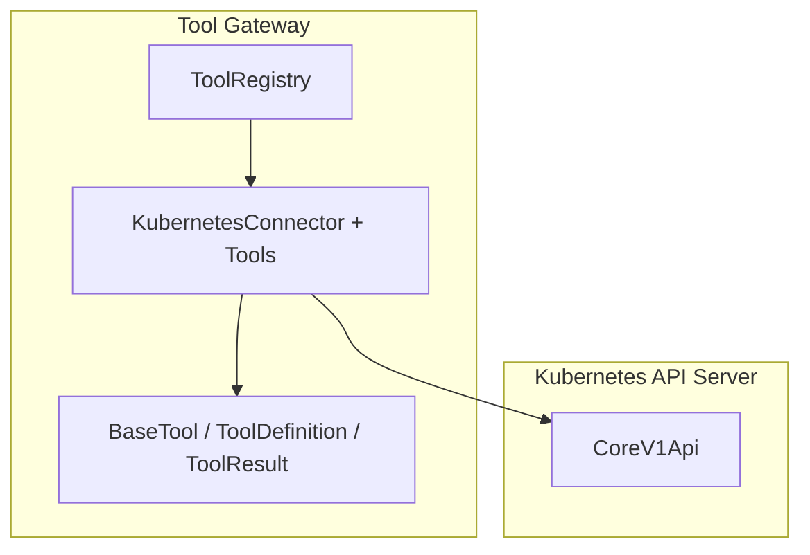
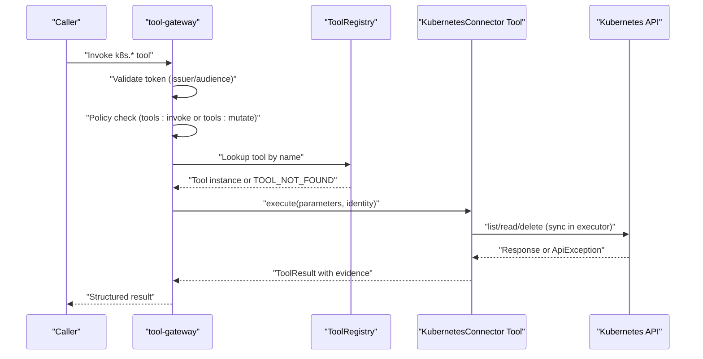
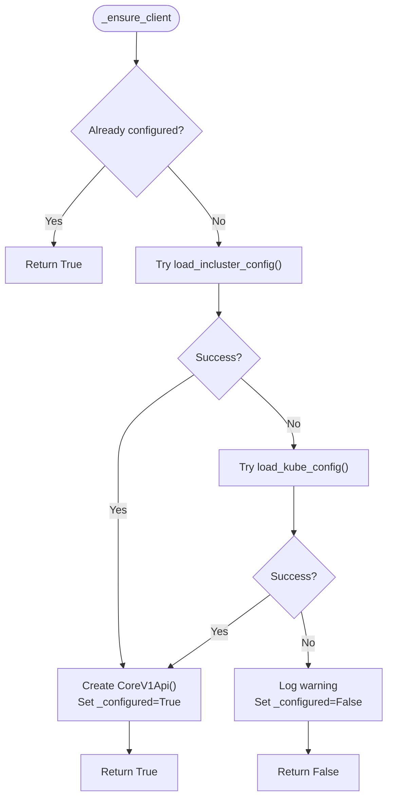
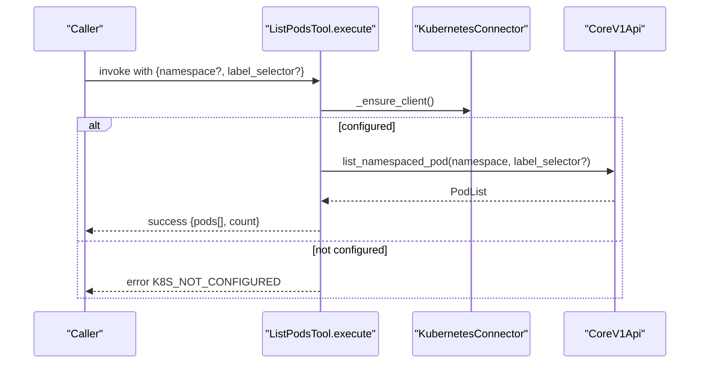
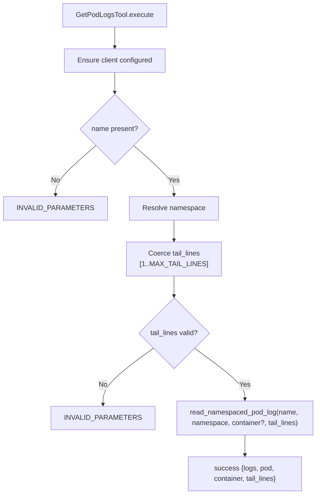
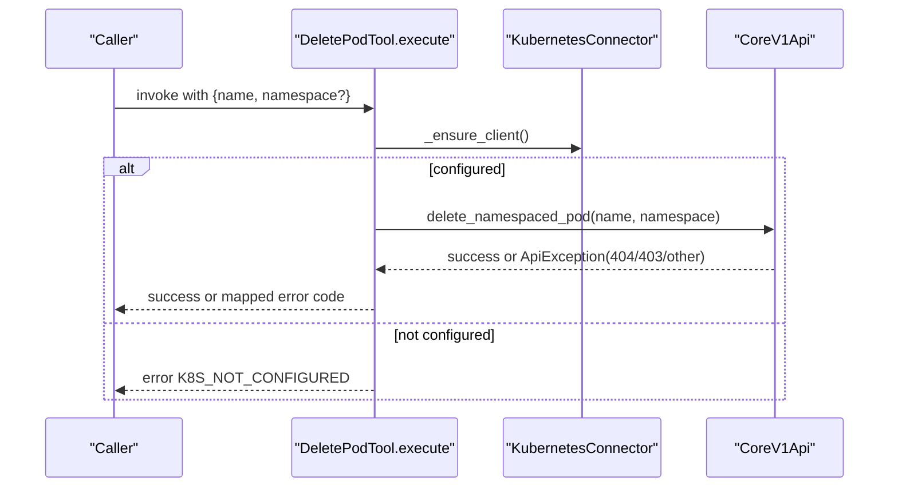
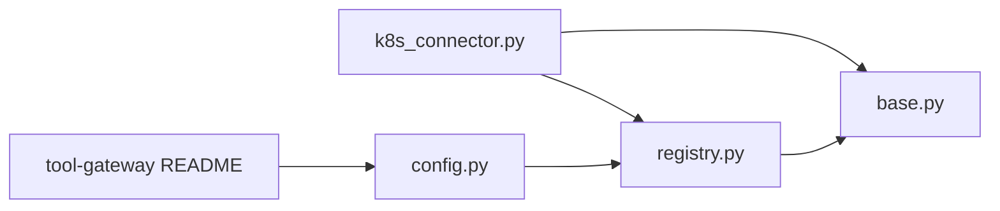

# Kubernetes Connector

<cite>
**Referenced Files in This Document**
- [k8s_connector.py](file://products/tool-gateway/src/tool_gateway/tools/k8s_connector.py)
- [base.py](file://products/tool-gateway/src/tool_gateway/tools/base.py)
- [registry.py](file://products/tool-gateway/src/tool_gateway/tools/registry.py)
- [config.py](file://products/tool-gateway/src/tool_gateway/core/config.py)
- [README.md](file://products/tool-gateway/README.md)
- [tool-configuration.md](file://docs/guides/tool-configuration.md)
- [configuration-reference.md](file://docs/guides/configuration-reference.md)
- [test_k8s_connector.py](file://products/tool-gateway/tests/test_k8s_connector.py)
- [rbac.yaml](file://shared/platform-ops/gitops/dev-k8s/base/tool-gateway/rbac.yaml)
</cite>

## Table of Contents
1. [Introduction](#introduction)
2. [Project Structure](#project-structure)
3. [Core Components](#core-components)
4. [Architecture Overview](#architecture-overview)
5. [Detailed Component Analysis](#detailed-component-analysis)
6. [Dependency Analysis](#dependency-analysis)
7. [Performance Considerations](#performance-considerations)
8. [Troubleshooting Guide](#troubleshooting-guide)
9. [Conclusion](#conclusion)
10. [Appendices](#appendices)

## Introduction
This document describes the Kubernetes connector that enables cluster operations, pod management, and resource inspection through a set of tools exposed by the tool-gateway. It covers available tools, authentication and authorization flows, RBAC requirements, namespace scoping, error handling, safe operation patterns, and audit trail generation for mutating actions.

The connector currently exposes:
- Read-only tools: list pods, get pod details, list events, retrieve pod logs
- One bounded mutating tool: delete a single named pod (opt-in via configuration and policy)

## Project Structure
The Kubernetes connector is implemented as a tool within the tool-gateway product. It registers tool definitions with the tool registry, executes them asynchronously while offloading synchronous Kubernetes client calls to an executor, and returns structured results with evidence for auditing.

**Diagram sources**
- [k8s_connector.py:41-91](file://products/tool-gateway/src/tool_gateway/tools/k8s_connector.py#L41-L91)
- [base.py:15-123](file://products/tool-gateway/src/tool_gateway/tools/base.py#L15-L123)
- [registry.py:18-89](file://products/tool-gateway/src/tool_gateway/tools/registry.py#L18-L89)

**Section sources**
- [k8s_connector.py:1-16](file://products/tool-gateway/src/tool_gateway/tools/k8s_connector.py#L1-L16)
- [registry.py:18-25](file://products/tool-gateway/src/tool_gateway/tools/registry.py#L18-L25)
- [base.py:15-123](file://products/tool-gateway/src/tool_gateway/tools/base.py#L15-L123)

## Core Components
- KubernetesConnector: manages client lifecycle, resolves default namespace, and provides sync helpers for Kubernetes API calls.
- Tool classes: ListPodsTool, GetPodTool, GetEventsTool, GetPodLogsTool, DeletePodTool. Each implements definition metadata and async execute logic.
- Base abstractions: ToolDefinition, ToolResult, build_evidence, make_error_result, make_denied_result.
- ToolRegistry: risk-tier admission gate; filters write/admin tools unless mutating tools are enabled.

Key behaviors:
- In-cluster config preferred; falls back to kubeconfig; otherwise returns K8S_NOT_CONFIGURED.
- All I/O runs in an executor to avoid blocking the event loop.
- Structured errors map common Kubernetes API failures to stable codes.
- Evidence includes execution timestamp, duration, risk level, and source system.

**Section sources**
- [k8s_connector.py:41-91](file://products/tool-gateway/src/tool_gateway/tools/k8s_connector.py#L41-L91)
- [k8s_connector.py:231-518](file://products/tool-gateway/src/tool_gateway/tools/k8s_connector.py#L231-L518)
- [base.py:15-123](file://products/tool-gateway/src/tool_gateway/tools/base.py#L15-L123)
- [registry.py:18-89](file://products/tool-gateway/src/tool_gateway/tools/registry.py#L18-L89)

## Architecture Overview
The connector integrates with the platform’s identity and policy layers:
- Authentication: tool-gateway validates delegated tokens from the identity broker using JWKS and issuer/audience settings.
- Authorization: read tools require tools:invoke; mutating tools additionally require tools:mutate and are gated by GATEWAY_MUTATING_TOOLS_ENABLED.
- Audit: every tool result carries evidence; when configured, tool-gateway emits audit events to the audit-service.

**Diagram sources**
- [k8s_connector.py:251-326](file://products/tool-gateway/src/tool_gateway/tools/k8s_connector.py#L251-L326)
- [k8s_connector.py:349-436](file://products/tool-gateway/src/tool_gateway/tools/k8s_connector.py#L349-L436)
- [k8s_connector.py:474-518](file://products/tool-gateway/src/tool_gateway/tools/k8s_connector.py#L474-L518)
- [registry.py:65-89](file://products/tool-gateway/src/tool_gateway/tools/registry.py#L65-L89)
- [config.py:75-106](file://products/tool-gateway/src/tool_gateway/core/config.py#L75-L106)
- [README.md:65-146](file://products/tool-gateway/README.md#L65-L146)

## Detailed Component Analysis

### KubernetesConnector
- Lazy client initialization: attempts in-cluster config first, then kubeconfig; caches configuration state.
- Default namespace resolution: uses provided parameter or configured default.
- Sync helpers: list_namespaced_pod, read_namespaced_pod, list_namespaced_event, read_namespaced_pod_log, delete_namespaced_pod.

**Diagram sources**
- [k8s_connector.py:49-75](file://products/tool-gateway/src/tool_gateway/tools/k8s_connector.py#L49-L75)

**Section sources**
- [k8s_connector.py:41-79](file://products/tool-gateway/src/tool_gateway/tools/k8s_connector.py#L41-L79)

### Tool Implementations

#### List Pods
- Purpose: list pods in a namespace with optional label selector.
- Parameters: namespace (optional), label_selector (optional).
- Behavior: runs list_namespaced_pod in executor; returns pods with key fields and container summaries.

**Diagram sources**
- [k8s_connector.py:231-276](file://products/tool-gateway/src/tool_gateway/tools/k8s_connector.py#L231-L276)

**Section sources**
- [k8s_connector.py:95-121](file://products/tool-gateway/src/tool_gateway/tools/k8s_connector.py#L95-L121)
- [k8s_connector.py:231-276](file://products/tool-gateway/src/tool_gateway/tools/k8s_connector.py#L231-L276)

#### Get Pod
- Purpose: get detailed status of a specific pod.
- Parameters: name (required), namespace (optional).
- Behavior: reads pod and returns phase, node, start time, containers, labels, conditions.

**Section sources**
- [k8s_connector.py:123-145](file://products/tool-gateway/src/tool_gateway/tools/k8s_connector.py#L123-L145)
- [k8s_connector.py:278-326](file://products/tool-gateway/src/tool_gateway/tools/k8s_connector.py#L278-L326)

#### Get Events
- Purpose: list events in a namespace with optional field selector.
- Parameters: namespace (optional), field_selector (optional).
- Behavior: lists namespaced events and returns reason, message, type, count, timestamps, involved object.

**Section sources**
- [k8s_connector.py:147-166](file://products/tool-gateway/src/tool_gateway/tools/k8s_connector.py#L147-L166)
- [k8s_connector.py:329-373](file://products/tool-gateway/src/tool_gateway/tools/k8s_connector.py#L329-L373)

#### Get Pod Logs
- Purpose: retrieve recent logs from a pod container.
- Parameters: name (required), namespace (optional), container (optional), tail_lines (integer, clamped to [1, MAX_TAIL_LINES]).
- Behavior: validates tail_lines; reads pod logs; returns logs string and parameters used.

**Diagram sources**
- [k8s_connector.py:376-436](file://products/tool-gateway/src/tool_gateway/tools/k8s_connector.py#L376-L436)
- [k8s_connector.py:211-226](file://products/tool-gateway/src/tool_gateway/tools/k8s_connector.py#L211-L226)

**Section sources**
- [k8s_connector.py:168-183](file://products/tool-gateway/src/tool_gateway/tools/k8s_connector.py#L168-L183)
- [k8s_connector.py:376-436](file://products/tool-gateway/src/tool_gateway/tools/k8s_connector.py#L376-L436)

#### Delete Pod (Bounded Mutating)
- Purpose: delete a single named pod; intended as a bounded “restart” primitive when managed by controllers.
- Risk level: write; registered only when mutating tools are enabled.
- Parameters: name (required), namespace (optional).
- Behavior: deletes pod; maps 404 to POD_NOT_FOUND, 403 to K8S_PERMISSION_DENIED, others to K8S_API_ERROR.

**Diagram sources**
- [k8s_connector.py:439-518](file://products/tool-gateway/src/tool_gateway/tools/k8s_connector.py#L439-L518)

**Section sources**
- [k8s_connector.py:185-195](file://products/tool-gateway/src/tool_gateway/tools/k8s_connector.py#L185-L195)
- [k8s_connector.py:439-518](file://products/tool-gateway/src/tool_gateway/tools/k8s_connector.py#L439-L518)

### Tool Definitions and Execution Model
- ToolDefinition: declares name, description, risk_level, category, parameters_schema.
- ToolResult: wraps status, data, evidence, and optional error.
- Evidence: includes executed_at, duration_ms, risk_level, source_system.
- Error utilities: make_error_result and make_denied_result standardize responses.

**Section sources**
- [base.py:15-123](file://products/tool-gateway/src/tool_gateway/tools/base.py#L15-L123)

### Registration and Risk-Tier Admission
- ToolRegistry.register enforces risk_level ∈ {"read","write","admin"} and blocks write/admin tools unless allow_mutating is true.
- The connector always registers all tools; the registry filters out mutating ones when disabled.

**Section sources**
- [registry.py:18-55](file://products/tool-gateway/src/tool_gateway/tools/registry.py#L18-L55)
- [k8s_connector.py:80-91](file://products/tool-gateway/src/tool_gateway/tools/k8s_connector.py#L80-L91)

## Dependency Analysis
- External dependency: kubernetes-client/python (lazy import on first use).
- Internal dependencies: base abstractions and registry for consistent tool behavior and policy gating.
- Configuration-driven: GATEWAY_K8S_ENABLED controls registration; GATEWAY_K8S_NAMESPACE sets default namespace; GATEWAY_MUTATING_TOOLS_ENABLED gates write tools.

**Diagram sources**
- [k8s_connector.py:25-33](file://products/tool-gateway/src/tool_gateway/tools/k8s_connector.py#L25-L33)
- [base.py:1-123](file://products/tool-gateway/src/tool_gateway/tools/base.py#L1-123)
- [registry.py:1-89](file://products/tool-gateway/src/tool_gateway/tools/registry.py#L1-L89)
- [config.py:75-106](file://products/tool-gateway/src/tool_gateway/core/config.py#L75-L106)
- [README.md:65-146](file://products/tool-gateway/README.md#L65-L146)

**Section sources**
- [k8s_connector.py:25-33](file://products/tool-gateway/src/tool_gateway/tools/k8s_connector.py#L25-L33)
- [config.py:75-106](file://products/tool-gateway/src/tool_gateway/core/config.py#L75-L106)
- [README.md:65-146](file://products/tool-gateway/README.md#L65-L146)

## Performance Considerations
- Synchronous Kubernetes client calls run in a thread executor to prevent blocking the asyncio event loop.
- Tail lines capped to a maximum to limit payload size and network usage.
- Evidence records duration_ms per invocation for observability.

[No sources needed since this section provides general guidance]

## Troubleshooting Guide
Common issues and their mapped error codes:
- K8S_NOT_CONFIGURED: no in-cluster config and no kubeconfig found.
- INVALID_PARAMETERS: missing required parameters or invalid tail_lines.
- K8S_API_ERROR: generic Kubernetes API failure (e.g., connection refused).
- POD_NOT_FOUND: delete attempted on non-existent pod (HTTP 404).
- K8S_PERMISSION_DENIED: delete denied due to insufficient RBAC (HTTP 403).

Operational checks:
- Verify GATEWAY_K8S_ENABLED and GATEWAY_K8S_NAMESPACE are set.
- Confirm service account and Role/RoleBinding grant read access to pods, pods/log, and events in the target namespace.
- For delete_pod, ensure GATEWAY_MUTATING_TOOLS_ENABLED=true, tools:mutate policy grant, and pod-delete RBAC are in place.

Verification examples:
- List tools via tool-gateway endpoint to confirm k8s.* tools are registered.
- Port-forward and call tool endpoints to validate connectivity and permissions.

**Section sources**
- [k8s_connector.py:251-326](file://products/tool-gateway/src/tool_gateway/tools/k8s_connector.py#L251-L326)
- [k8s_connector.py:349-436](file://products/tool-gateway/src/tool_gateway/tools/k8s_connector.py#L349-L436)
- [k8s_connector.py:474-518](file://products/tool-gateway/src/tool_gateway/tools/k8s_connector.py#L474-L518)
- [tool-configuration.md:128-182](file://docs/guides/tool-configuration.md#L128-L182)
- [test_k8s_connector.py:15-50](file://products/tool-gateway/tests/test_k8s_connector.py#L15-L50)
- [test_k8s_connector.py:230-324](file://products/tool-gateway/tests/test_k8s_connector.py#L230-L324)

## Conclusion
The Kubernetes connector provides a safe, auditable interface to inspect and manage Kubernetes resources through well-defined tools. Read operations are always available when enabled; mutating operations are strictly controlled by configuration, policy, and human confirmation. Namespace scoping, RBAC, and structured error handling ensure predictable behavior and clear diagnostics.

[No sources needed since this section summarizes without analyzing specific files]

## Appendices

### Available Kubernetes Tools Summary
- k8s.list_pods: list pods with optional label selector filtering.
- k8s.get_pod: get detailed status of a specific pod.
- k8s.get_events: list events in a namespace with optional field selector.
- k8s.get_pod_logs: retrieve recent logs from a pod container with tail_lines cap.
- k8s.delete_pod: bounded mutating action to delete a single named pod (opt-in).

**Section sources**
- [k8s_connector.py:231-518](file://products/tool-gateway/src/tool_gateway/tools/k8s_connector.py#L231-L518)
- [tool-configuration.md:20-24](file://docs/guides/tool-configuration.md#L20-L24)

### RBAC Requirements
- Read-only access: Role granting get/list on pods, pods/log, events in the target namespace; bound to the tool-gateway service account.
- Mutating access (delete_pod): additional pod-delete permission; requires explicit opt-in via configuration and policy.

**Section sources**
- [tool-configuration.md:141-170](file://docs/guides/tool-configuration.md#L141-L170)
- [rbac.yaml:1-4](file://shared/platform-ops/gitops/dev-k8s/base/tool-gateway/rbac.yaml#L1-L4)

### Authentication and Authorization
- Authentication: tool-gateway validates delegated tokens using issuer and audience settings; supports workload token fallback.
- Authorization: read tools require tools:invoke; mutating tools require tools:mutate and are gated by GATEWAY_MUTATING_TOOLS_ENABLED.
- Approval: mutating tools park for HITL confirmation before execution.

**Section sources**
- [README.md:65-146](file://products/tool-gateway/README.md#L65-L146)
- [configuration-reference.md:15-21](file://docs/guides/configuration-reference.md#L15-L21)
- [configuration-reference.md:90-127](file://docs/guides/configuration-reference.md#L90-L127)

### Safe Operation Patterns and Audit Trail
- Use read tools for inspection; reserve delete_pod for controller-managed workloads where deletion acts as restart.
- Always specify namespace explicitly when possible; rely on defaults only when intentional.
- Every tool execution produces evidence with timestamp, duration, risk level, and source system; when configured, audit events are emitted to the audit-service.

**Section sources**
- [base.py:58-86](file://products/tool-gateway/src/tool_gateway/tools/base.py#L58-L86)
- [configuration-reference.md:128-157](file://docs/guides/configuration-reference.md#L128-L157)