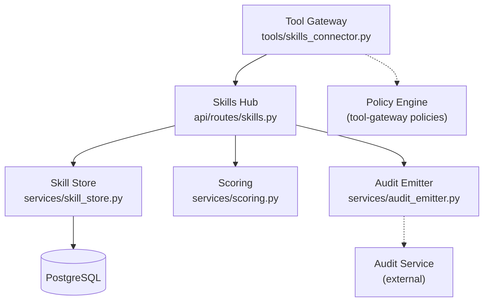
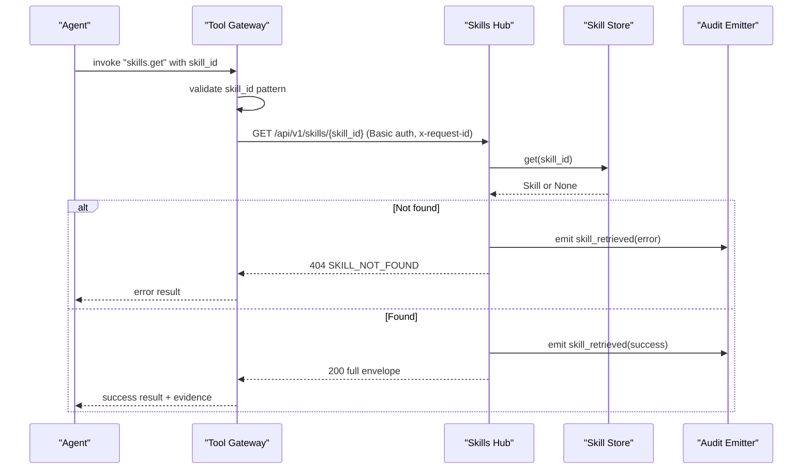
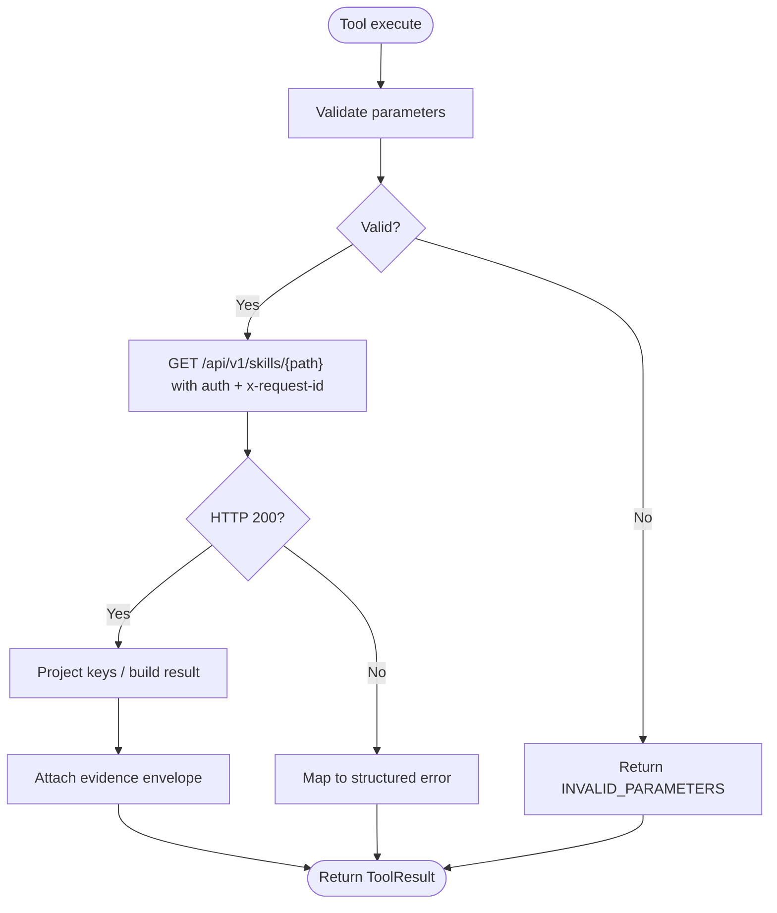
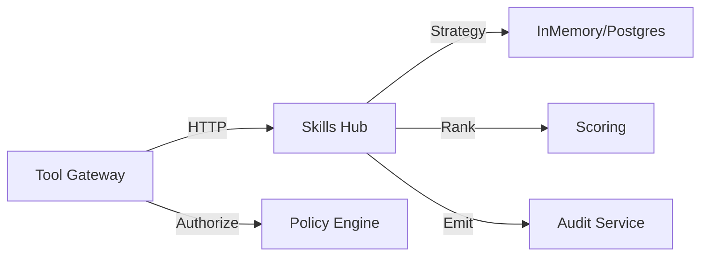

# Skills Connector

<cite>
**Referenced Files in This Document**
- [skills_connector.py](file://products/tool-gateway/src/tool_gateway/tools/skills_connector.py)
- [test_skills_connector.py](file://products/tool-gateway/tests/test_skills_connector.py)
- [skills.py](file://products/skills-hub/src/skills_hub/api/routes/skills.py)
- [skill_store.py](file://products/skills-hub/src/skills_hub/services/skill_store.py)
- [ingestion.py](file://products/skills-hub/src/skills_hub/services/ingestion.py)
- [scoring.py](file://products/skills-hub/src/skills_hub/services/scoring.py)
- [audit_emitter.py](file://products/skills-hub/src/skills_hub/services/audit_emitter.py)
- [config.py](file://products/skills-hub/src/skills_hub/core/config.py)
- [skill.schema.json](file://shared/shared-contracts/schemas/skill.schema.json)
- [skill-format.md](file://shared/shared-contracts/skill-format.md)
- [audit-event.schema.json](file://shared/shared-contracts/schemas/audit-event.schema.json)
</cite>

## Table of Contents
1. Introduction
2. Project Structure
3. Core Components
4. Architecture Overview
5. Detailed Component Analysis
6. Dependency Analysis
7. Performance Considerations
8. Troubleshooting Guide
9. Conclusion
10. Appendices

## Introduction
This document explains the skills connector that provides read-only access to the platform’s skill repository from the tool gateway, and how skills are authored, validated, stored, retrieved, versioned, and audited across the system. It covers:
- Skill retrieval via tools (search, get, list) with parameter validation and error mapping.
- Versioning through source refs and updated timestamps; slug-based identity rules.
- Validation against the shared skill schema and format contract.
- Skill composition and dependency resolution via executable flows and steps.
- Execution context management including request correlation and policy integration points.
- Lifecycle from draft to production, approval workflows, and rollback considerations.
- Authoring patterns, testing strategies, and deployment procedures.
- Integration with the policy engine and durable audit trail for usage and modifications.

## Project Structure
The skills connector spans two services:
- Tool Gateway: exposes three read-only tools that call the skills hub over HTTP with Basic authentication and structured evidence.
- Skills Hub: ingests Markdown skills, validates them against the shared contract, stores them (in-memory or PostgreSQL), and serves retrieval endpoints with search, listing, and full retrieval.

**Diagram sources**
- [skills_connector.py:71-108](file://products/tool-gateway/src/tool_gateway/tools/skills_connector.py#L71-L108)
- [skills.py:68-215](file://products/skills-hub/src/skills_hub/api/routes/skills.py#L68-L215)
- [skill_store.py:158-200](file://products/skills-hub/src/skills_hub/services/skill_store.py#L158-L200)
- [scoring.py:85-97](file://products/skills-hub/src/skills_hub/services/scoring.py#L85-L97)
- [audit_emitter.py:67-98](file://products/skills-hub/src/skills_hub/services/audit_emitter.py#L67-L98)

**Section sources**
- [skills_connector.py:1-108](file://products/tool-gateway/src/tool_gateway/tools/skills_connector.py#L1-L108)
- [skills.py:1-215](file://products/skills-hub/src/skills_hub/api/routes/skills.py#L1-L215)

## Core Components
- SkillsConnector and tools: register and implement skills.search, skills.get, skills.list with input validation, upstream error mapping, and evidence envelopes.
- Retrieval API: authenticated endpoints for list, search, validate, and get with limits, pagination, and usage audit emission.
- Skill store: strategy pattern selecting in-memory or PostgreSQL backend; deterministic ranking and search.
- Ingestion and validation: parses Markdown frontmatter, enforces size caps, step constraints, credential-hole checks, and executable-flow class rules.
- Scoring: deterministic keyword scoring with title/tag/body weights and capped body occurrences.
- Audit emitter: fire-and-forget events correlated by request_id to the audit service.
- Configuration: environment-driven settings for sources, query clients, workload clients, and audit service.

**Section sources**
- [skills_connector.py:154-419](file://products/tool-gateway/src/tool_gateway/tools/skills_connector.py#L154-L419)
- [skills.py:68-215](file://products/skills-hub/src/skills_hub/api/routes/skills.py#L68-L215)
- [skill_store.py:30-67](file://products/skills-hub/src/skills_hub/services/skill_store.py#L30-L67)
- [ingestion.py:149-473](file://products/skills-hub/src/skills_hub/services/ingestion.py#L149-L473)
- [scoring.py:28-97](file://products/skills-hub/src/skills_hub/services/scoring.py#L28-L97)
- [audit_emitter.py:29-98](file://products/skills-hub/src/skills_hub/services/audit_emitter.py#L29-L98)
- [config.py:161-209](file://products/skills-hub/src/skills_hub/core/config.py#L161-L209)

## Architecture Overview
The connector is a thin, read-only adapter that:
- Validates parameters and constructs safe paths.
- Issues authenticated GET requests to skills-hub with correlation headers.
- Normalizes responses into tool results with evidence.
- Propagates upstream errors as structured tool errors.

**Diagram sources**
- [skills_connector.py:271-309](file://products/tool-gateway/src/tool_gateway/tools/skills_connector.py#L271-L309)
- [skills.py:184-215](file://products/skills-hub/src/skills_hub/api/routes/skills.py#L184-L215)
- [skill_store.py:378-389](file://products/skills-hub/src/skills_hub/services/skill_store.py#L378-L389)
- [audit_emitter.py:67-98](file://products/skills-hub/src/skills_hub/services/audit_emitter.py#L67-L98)

## Detailed Component Analysis

### Skills Connector Tools (Search, Get, List)
- Input validation:
  - skills.search requires query; limit coerced to [1, MAX_RESULTS].
  - skills.get requires a namespaced skill_id matching a strict pattern to prevent path injection.
  - skills.list supports source, tag, limit, offset with bounds checking.
- Upstream calls:
  - Uses httpx AsyncClient with timeout and Basic auth.
  - Forwards caller’s request_id via x-request-id header for audit correlation.
- Response handling:
  - Success returns ToolResult with data and evidence.
  - Non-200 maps to structured errors; transport errors map to TOOL_EXECUTION_ERROR.
  - Search/list project stable key sets to keep payloads predictable.

**Diagram sources**
- [skills_connector.py:111-148](file://products/tool-gateway/src/tool_gateway/tools/skills_connector.py#L111-L148)
- [skills_connector.py:198-245](file://products/tool-gateway/src/tool_gateway/tools/skills_connector.py#L198-L245)
- [skills_connector.py:271-309](file://products/tool-gateway/src/tool_gateway/tools/skills_connector.py#L271-L309)
- [skills_connector.py:359-418](file://products/tool-gateway/src/tool_gateway/tools/skills_connector.py#L359-L418)

**Section sources**
- [skills_connector.py:154-419](file://products/tool-gateway/src/tool_gateway/tools/skills_connector.py#L154-L419)
- [test_skills_connector.py:106-416](file://products/tool-gateway/tests/test_skills_connector.py#L106-L416)

### Retrieval API (List, Search, Validate, Get)
- Authentication:
  - All retrieval endpoints require registered query credentials or projected workload token.
- Limits and pagination:
  - List: offset >= 0, limit within [1, MAX_LIST_LIMIT].
  - Search: q required, limit within [1, MAX_SEARCH_LIMIT].
- Usage audit:
  - Search emits skill_searched on success.
  - Get emits skill_retrieved on both success and not-found outcomes.
- Validate endpoint:
  - POST /skills/validate runs the same ingestion validation used by sync; no store write or sync trigger.

**Section sources**
- [skills.py:68-215](file://products/skills-hub/src/skills_hub/api/routes/skills.py#L68-L215)
- [audit-emitter.py:29-98](file://products/skills-hub/src/skills_hub/services/audit_emitter.py#L29-L98)

### Skill Storage and Search
- Strategy pattern:
  - InMemorySkillStore for tests/dev; PostgresSkillStore for production.
  - Deterministic ordering via shared scorer ensures identical ranking across backends.
- PostgreSQL schema:
  - DDL includes columns for web_target, risk_class, flow_intent, kind, steps; idempotent ALTERs support upgrades.
  - GIN index on title+body tsvector; tags pre-filtered at query time.
- Operations:
  - replace_source performs atomic per-source swap (delete + insert).
  - prune_sources removes records for unconfigured sources.
  - search uses tokenized lexemes and re-ranks candidates with scorer.

**Section sources**
- [skill_store.py:30-67](file://products/skills-hub/src/skills_hub/services/skill_store.py#L30-L67)
- [skill_store.py:158-200](file://products/skills-hub/src/skills_hub/services/skill_store.py#L158-L200)
- [skill_store.py:318-443](file://products/skills-hub/src/skills_hub/services/skill_store.py#L318-L443)
- [scoring.py:28-97](file://products/skills-hub/src/skills_hub/services/scoring.py#L28-L97)

### Ingestion and Validation (Skill Format v2)
- Frontmatter parsing and constraints:
  - Required fields: title, description; optional: tags, version, source_url, web_target, risk_class, flow_intent, kind, steps.
  - Size caps enforced for body, description, tags, steps.
- Executable-flow class:
  - kind must be knowledge or executable_flow; steps require executable_flow and non-empty list.
  - executable_flow requires risk_class: write; web.* steps require web_target.
  - Credential values must reference named sets; unresolved holes rejected.
- Slug identity:
  - Derived from file path segments normalized to lowercase alphanumeric with hyphens; duplicates within a source are errors.

**Section sources**
- [ingestion.py:149-473](file://products/skills-hub/src/skills_hub/services/ingestion.py#L149-L473)
- [skill-format.md:1-203](file://shared/shared-contracts/skill-format.md#L1-L203)
- [skill.schema.json:1-125](file://shared/shared-contracts/schemas/skill.schema.json#L1-L125)

### Policy Integration and Approval Workflow
- Policy gating:
  - The tool gateway applies policy decisions before invoking tools; skills tools are read-level and category “skills”.
  - Graduation actions (producing executable-flow drafts) are separate, higher-trust operations governed by policy roles.
- Approval and HITL:
  - Browser-driven flows use origin binding and confirmation cards; mutation gates apply per policy configuration.
- Rollback:
  - Skills are immutable by id; moving or renaming changes skill_id, making stale citations visible.
  - Per-source replace_source enables operator-driven replacement; pruning removes unconfigured sources.

**Section sources**
- [skills_connector.py:158-196](file://products/tool-gateway/src/tool_gateway/tools/skills_connector.py#L158-L196)
- [skill-store.py:318-376](file://products/skills-hub/src/skills_hub/services/skill_store.py#L318-L376)
- [skill-format.md:162-175](file://shared/shared-contracts/skill-format.md#L162-L175)

### Execution Context Management
- Request correlation:
  - Tools forward request_id via x-request-id; skills-hub correlates audit events using this header.
- Evidence envelopes:
  - Each tool result carries an evidence envelope indicating source_system and risk_level.
- Audit trail:
  - skill_searched and skill_retrieved events emitted with outcome and details; events conform to the shared audit schema.

**Section sources**
- [skills_connector.py:90-108](file://products/tool-gateway/src/tool_gateway/tools/skills_connector.py#L90-L108)
- [skills.py:47-66](file://products/skills-hub/src/skills_hub/api/routes/skills.py#L47-L66)
- [audit-event.schema.json:1-94](file://shared/shared-contracts/schemas/audit-event.schema.json#L1-L94)

## Dependency Analysis
- Tool Gateway depends on:
  - Base tool abstractions and registry for tool definitions and execution.
  - httpx for outbound HTTP to skills-hub.
  - Policy engine for authorization prior to tool invocation.
- Skills Hub depends on:
  - Config for federation entries, query/workload clients, and audit service URL.
  - Store abstraction for persistence and search.
  - Scorer for deterministic ranking.
  - Audit emitter for durable event delivery.

**Diagram sources**
- [skills_connector.py:71-108](file://products/tool-gateway/src/tool_gateway/tools/skills_connector.py#L71-L108)
- [skill_store.py:489-498](file://products/skills-hub/src/skills_hub/services/skill_store.py#L489-L498)
- [scoring.py:85-97](file://products/skills-hub/src/skills_hub/services/scoring.py#L85-L97)
- [audit_emitter.py:67-98](file://products/skills-hub/src/skills_hub/services/audit_emitter.py#L67-L98)

**Section sources**
- [config.py:161-209](file://products/skills-hub/src/skills_hub/core/config.py#L161-L209)
- [skills_connector.py:71-108](file://products/tool-gateway/src/tool_gateway/tools/skills_connector.py#L71-L108)

## Performance Considerations
- Search performance:
  - PostgreSQL uses GIN tsvector index on title+body; tags filtered at query time to avoid index incompatibilities.
  - Tokenization mirrors scorer behavior to ensure consistent candidate sets.
- Result projection:
  - Search and list project minimal key sets to reduce payload sizes.
- Timeouts and retries:
  - Connector uses a fixed request timeout; upstream failures map to structured errors without retry logic at the connector layer.
- Store selection:
  - In-memory store suitable for dev/testing; PostgreSQL for durability and scale.

[No sources needed since this section provides general guidance]

## Troubleshooting Guide
Common issues and resolutions:
- Invalid parameters:
  - Missing query for search, invalid limit/offset types, or malformed skill_id pattern will return INVALID_PARAMETERS.
- Upstream errors:
  - Non-200 responses map to structured codes; 404 becomes SKILL_NOT_FOUND; other codes pass through upstream code/message.
- Transport errors:
  - Network failures produce TOOL_EXECUTION_ERROR with duration_ms in evidence.
- Validation failures:
  - Use POST /skills/validate to check documents; rejection reasons mirror ingestion reports.
- Audit visibility:
  - Ensure x-request-id is forwarded; verify audit_service_url configured if durable auditing is required.

**Section sources**
- [skills_connector.py:111-148](file://products/tool-gateway/src/tool_gateway/tools/skills_connector.py#L111-L148)
- [skills_connector.py:198-245](file://products/tool-gateway/src/tool_gateway/tools/skills_connector.py#L198-L245)
- [skills_connector.py:271-309](file://products/tool-gateway/src/tool_gateway/tools/skills_connector.py#L271-L309)
- [skills_connector.py:359-418](file://products/tool-gateway/src/tool_gateway/tools/skills_connector.py#L359-L418)
- [skills.py:149-181](file://products/skills-hub/src/skills_hub/api/routes/skills.py#L149-L181)

## Conclusion
The skills connector provides a secure, validated, and auditable interface to the platform’s skill repository. It enforces strict parameter validation, projects stable payloads, and integrates with policy and audit systems to ensure traceability and compliance. Skills are authored under a robust contract, validated during ingestion, and served through efficient storage and search mechanisms. The lifecycle supports draft-to-production workflows with clear identity rules, versioning, and rollback capabilities through source replacement and pruning.

[No sources needed since this section summarizes without analyzing specific files]

## Appendices

### Skill Schema and Format Reference
- Canonical schema defines required fields, constraints, and optional executable-flow additions.
- Format specification describes document layout, frontmatter keys, executable-flow rules, size caps, identity rules, and local validation CLI.

**Section sources**
- [skill.schema.json:1-125](file://shared/shared-contracts/schemas/skill.schema.json#L1-L125)
- [skill-format.md:1-203](file://shared/shared-contracts/skill-format.md#L1-L203)

### Testing Strategies
- Connector tests assert:
  - Tool registration and definitions.
  - Parameter validation and limit coercion.
  - Upstream error mapping and transport failure handling.
  - Payload conformance to skill.schema.json.
  - Request correlation via x-request-id.
- Use the provided test utilities to mock skills-hub responses and verify tool outputs and evidence.

**Section sources**
- [test_skills_connector.py:87-416](file://products/tool-gateway/tests/test_skills_connector.py#L87-L416)
- [test_skills_connector.py:418-535](file://products/tool-gateway/tests/test_skills_connector.py#L418-L535)

### Deployment Procedures
- Configure skills-hub:
  - Set SKILLS_SOURCES for federation entries (local/git).
  - Choose store_backend (memory/postgres) and provide db_url when using postgres.
  - Configure query_clients or workload_issuer/audience for authentication.
  - Optionally set SKILLS_AUDIT_SERVICE_URL for durable auditing.
- Configure tool gateway:
  - Set GATEWAY_SKILLS_SERVICE_URL and client secret to enable skills tools.
  - Ensure policy engine allows read-level skills tools.
- Validate skills locally:
  - Use the skills-hub validate endpoint or CLI to lint documents before publishing.

**Section sources**
- [config.py:161-209](file://products/skills-hub/src/skills_hub/core/config.py#L161-L209)
- [skills_connector.py:1-12](file://products/tool-gateway/src/tool_gateway/tools/skills_connector.py#L1-L12)
- [skills.py:149-181](file://products/skills-hub/src/skills_hub/api/routes/skills.py#L149-L181)