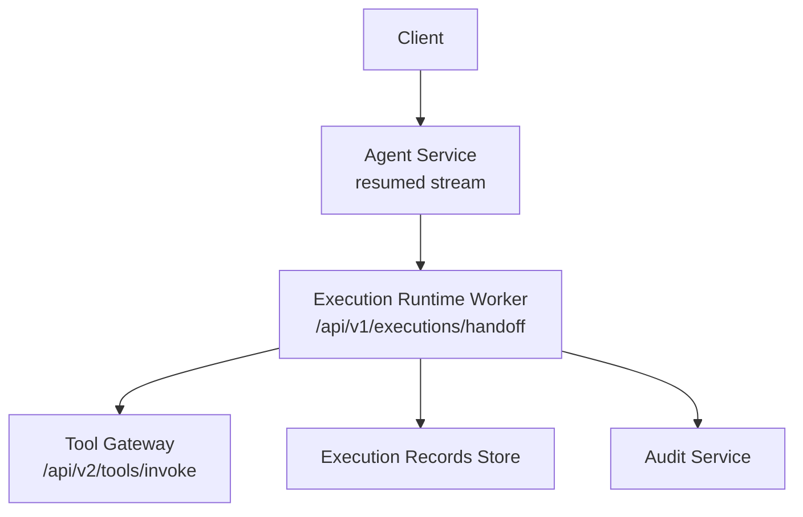
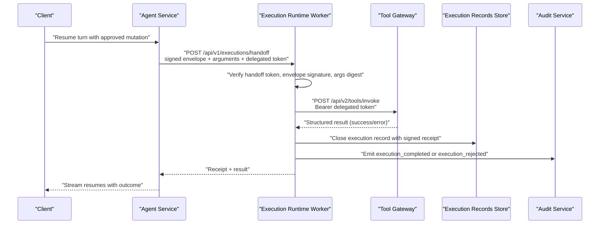
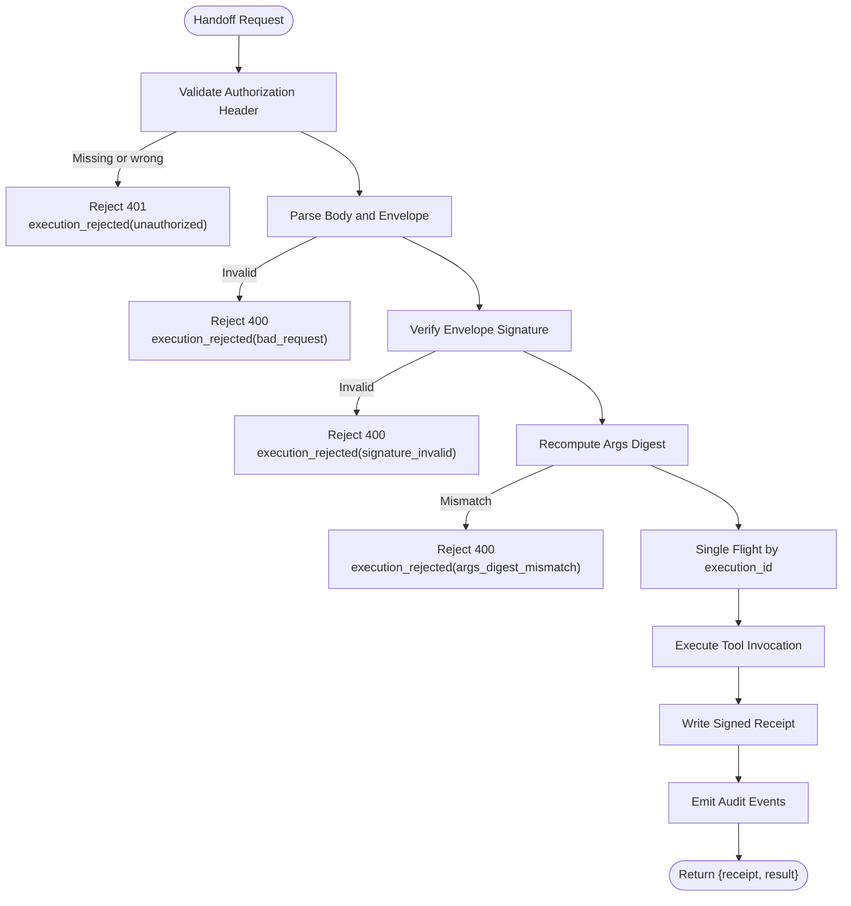
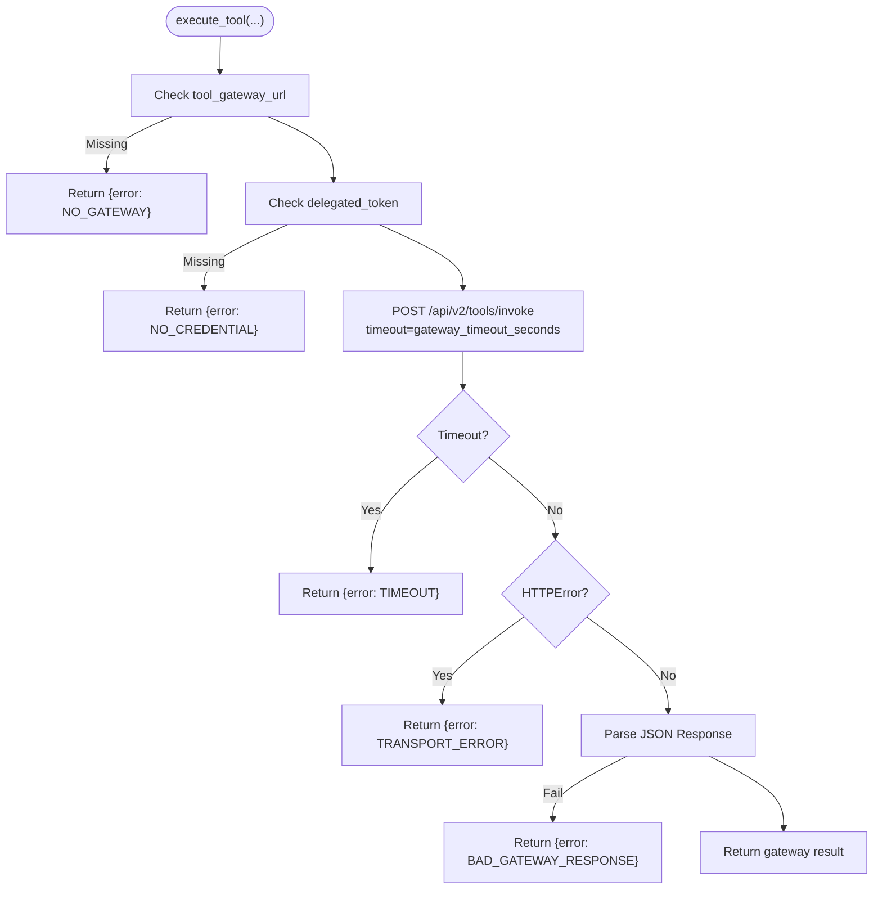
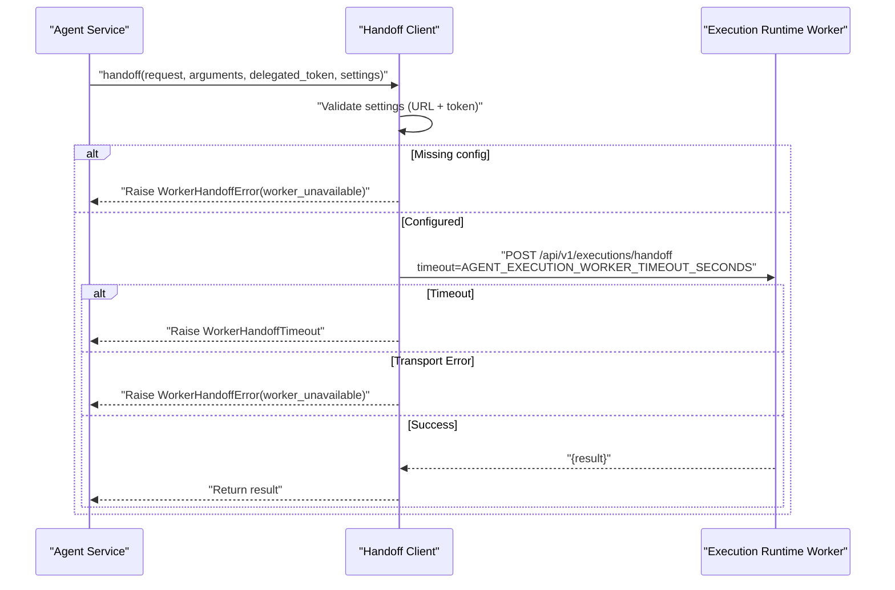
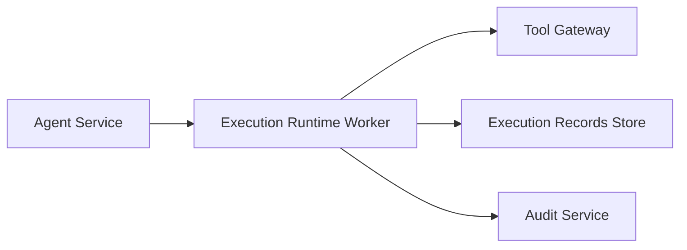

# Execution Isolation and Bounded Execution

<cite>
**Referenced Files in This Document**
- [SPEC-038-isolated-execution-worker/spec.md](file://docs/specs/SPEC-038-isolated-execution-worker/spec.md)
- [SPEC-021-bounded-mutating-actions/spec.md](file://docs/specs/SPEC-021-bounded-mutating-actions/spec.md)
- [2026-08-27-isolated-execution-worker.md](file://docs/agentic-aiops-platform/release-notes/2026-08-27-isolated-execution-worker.md)
- [2026-08-22-bounded-mutating-actions.md](file://docs/agentic-aiops-platform/release-notes/2026-08-22-bounded-mutating-actions.md)
- [handoff.py](file://products/execution-runtime/src/execution_runtime/api/routes/handoff.py)
- [executor.py](file://products/execution-runtime/src/execution_runtime/services/executor.py)
- [config.py](file://products/execution-runtime/src/execution_runtime/core/config.py)
- [execution_worker_client.py](file://products/agent-platform/src/agent_service/services/execution_worker_client.py)
</cite>

## Table of Contents
1. Introduction
2. Project Structure
3. Core Components
4. Architecture Overview
5. Detailed Component Analysis
6. Dependency Analysis
7. Performance Considerations
8. Troubleshooting Guide
9. Conclusion

## Introduction
This document explains the execution isolation model that prevents runaway operations and enforces resource limits for potentially mutating tool calls. It focuses on the bounded execution model: each handoff performs exactly one tool invocation, prevents privilege escalation by forwarding only a delegated token, and maintains strict isolation boundaries between execution contexts. It also documents timeout mechanisms, resource constraints, failure handling strategies, configuration options for execution policies, and the security model that preserves audit integrity across the execution lifecycle.

## Project Structure
The isolation model spans two products:
- Agent platform (agent-service): routes approved mutating calls to an isolated worker via a bounded handoff client.
- Execution runtime (execution-runtime worker): authenticates the handoff, verifies the signed envelope and argument digest, executes exactly one tool call through the tool-gateway, records a signed receipt, and emits correlated audit events.

**Diagram sources**
- [handoff.py:66-169](file://products/execution-runtime/src/execution_runtime/api/routes/handoff.py#L66-L169)
- [executor.py:23-121](file://products/execution-runtime/src/execution_runtime/services/executor.py#L23-L121)
- [execution_worker_client.py:54-145](file://products/agent-platform/src/agent_service/services/execution_worker_client.py#L54-L145)

**Section sources**
- [SPEC-038-isolated-execution-worker/spec.md:11-25](file://docs/specs/SPEC-038-isolated-execution-worker/spec.md#L11-L25)
- [2026-08-27-isolated-execution-worker.md:26-91](file://docs/agentic-aiops-platform/release-notes/2026-08-27-isolated-execution-worker.md#L26-L91)

## Core Components
- Handoff route: authenticates agent-service with a static handoff token, validates the signed execution envelope and argument digest, then delegates execution once per unique execution id.
- Executor: performs exactly one tool-gateway invocation using the forwarded delegated token, maps timeouts and transport errors to structured results, and never logs or persists tokens.
- Handoff client: blocks the resumed stream with a bounded timeout, raises fail-closed exceptions when the worker is unavailable or unreachable, and surfaces structured timeout results.
- Settings: frozen configuration loaded from environment variables with startup validation; controls gateway timeouts, store backends, retention, and audit integration.

Key responsibilities:
- Enforce one-invocation-per-handoff semantics.
- Maintain isolation boundaries: no in-process fallback, no token persistence, no policy bypass.
- Provide deterministic failure modes: unauthorized, signature invalid, args digest mismatch, bad request, timeout, transport error, bad gateway response.

**Section sources**
- [handoff.py:1-16](file://products/execution-runtime/src/execution_runtime/api/routes/handoff.py#L1-L16)
- [executor.py:1-37](file://products/execution-runtime/src/execution_runtime/services/executor.py#L1-L37)
- [execution_worker_client.py:1-18](file://products/agent-platform/src/agent_service/services/execution_worker_client.py#L1-L18)
- [config.py:1-49](file://products/execution-runtime/src/execution_runtime/core/config.py#L1-L49)

## Architecture Overview
The bounded execution flow ensures that every mutating action is executed outside the agent process, under independent verification and strict resource budgets.

**Diagram sources**
- [handoff.py:66-169](file://products/execution-runtime/src/execution_runtime/api/routes/handoff.py#L66-L169)
- [executor.py:53-121](file://products/execution-runtime/src/execution_runtime/services/executor.py#L53-L121)
- [execution_worker_client.py:54-145](file://products/agent-platform/src/agent_service/services/execution_worker_client.py#L54-L145)

## Detailed Component Analysis

### Handoff Route: Authenticated Internal Handoff and Fail-Closed Verification
- Authenticates the caller using a constant-time comparison of a static handoff token.
- Parses and validates the body shape and required envelope fields before trusting any content.
- Verifies the envelope signature and recomputes the argument digest; mismatches are rejected immediately.
- Executes at most once per execution id using single-flight idempotency.
- On success, signs and writes a receipt, emits audit events, and returns both receipt and result.

**Diagram sources**
- [handoff.py:66-169](file://products/execution-runtime/src/execution_runtime/api/routes/handoff.py#L66-L169)
- [handoff.py:203-263](file://products/execution-runtime/src/execution_runtime/api/routes/handoff.py#L203-L263)
- [handoff.py:306-356](file://products/execution-runtime/src/execution_runtime/api/routes/handoff.py#L306-L356)

**Section sources**
- [handoff.py:66-169](file://products/execution-runtime/src/execution_runtime/api/routes/handoff.py#L66-L169)
- [handoff.py:203-263](file://products/execution-runtime/src/execution_runtime/api/routes/handoff.py#L203-L263)
- [handoff.py:306-356](file://products/execution-runtime/src/execution_runtime/api/routes/handoff.py#L306-L356)

### Executor: One-Shot Tool Invocation with Structured Failure Mapping
- Ensures exactly one tool invocation per handoff.
- Forwards the confirmer’s delegated token as bearer; never logs or persists it.
- Applies a gateway timeout configured in settings.
- Maps failures to structured results:
  - Timeout: TIMEOUT
  - Transport error: TRANSPORT_ERROR
  - Non-JSON response: BAD_GATEWAY_RESPONSE
  - Missing configuration or credential: NO_GATEWAY / NO_CREDENTIAL
- Maps gateway results to receipt statuses: succeeded, timeout, failed.

**Diagram sources**
- [executor.py:23-121](file://products/execution-runtime/src/execution_runtime/services/executor.py#L23-L121)
- [executor.py:124-137](file://products/execution-runtime/src/execution_runtime/services/executor.py#L124-L137)

**Section sources**
- [executor.py:23-121](file://products/execution-runtime/src/execution_runtime/services/executor.py#L23-L121)
- [executor.py:124-137](file://products/execution-runtime/src/execution_runtime/services/executor.py#L124-L137)

### Handoff Client: Bounded Timeout and Fail-Closed Behavior
- Validates settings presence; missing URL or token raises a fail-closed error.
- Sends the signed envelope, parked arguments, and delegated token to the worker.
- Uses a bounded timeout; timeouts raise a dedicated exception so the resumed stream can surface a structured timeout result.
- Transport errors raise a fail-closed error with reason worker_unavailable.
- Successful responses return the worker’s result; malformed responses are treated as worker_unavailable.

**Diagram sources**
- [execution_worker_client.py:54-145](file://products/agent-platform/src/agent_service/services/execution_worker_client.py#L54-L145)

**Section sources**
- [execution_worker_client.py:54-145](file://products/agent-platform/src/agent_service/services/execution_worker_client.py#L54-L145)

### Configuration and Resource Constraints
- Frozen settings with startup validation enforce safe defaults and required values.
- Key knobs:
  - EXECUTION_SIGNING_KEY: signing key for receipts and envelope verification.
  - EXECUTION_HANDOFF_TOKEN: static token for internal handoff authentication.
  - TOOL_GATEWAY_URL: endpoint used by the worker to invoke tools.
  - EXECUTION_GATEWAY_TIMEOUT_SECONDS: timeout for tool-gateway calls.
  - EXECUTION_STATE_STORE_BACKEND and EXECUTION_STATE_DB_URL: record store backend selection.
  - EXECUTION_AUDIT_SERVICE_URL, EXECUTION_AUDIT_CLIENT_ID, EXECUTION_AUDIT_CLIENT_SECRET: audit emission configuration.
  - EXECUTION_FLIGHT_RETENTION_SECONDS: single-flight registry retention window.
- Agent-side knobs:
  - AGENT_EXECUTION_WORKER_URL, AGENT_EXECUTION_HANDOFF_TOKEN, AGENT_EXECUTION_WORKER_TIMEOUT_SECONDS: handoff client configuration and timeout budget.

**Section sources**
- [config.py:20-78](file://products/execution-runtime/src/execution_runtime/core/config.py#L20-L78)
- [2026-08-27-isolated-execution-worker.md:59-69](file://docs/agentic-aiops-platform/release-notes/2026-08-27-isolated-execution-worker.md#L59-L69)

### Security Model and Privilege Boundaries
- The worker authenticates agent-service with a scope-limited static handoff token; unauthenticated requests are rejected.
- Envelope signature and argument digest are verified before any execution; tampered envelopes or mutated arguments are rejected.
- The executor forwards only the delegated token as bearer; it never logs or persists tokens, preserving identity posture and preventing privilege escalation.
- Infrastructure isolation: the worker is reachable only internally via ClusterIP and has no portal or LLM exposure.
- Risk-tier enforcement at the tool-gateway gates mutating tools behind a deny-by-default policy action, ensuring read-only auto-allow cannot bypass approval.

**Section sources**
- [handoff.py:66-169](file://products/execution-runtime/src/execution_runtime/api/routes/handoff.py#L66-L169)
- [executor.py:53-87](file://products/execution-runtime/src/execution_runtime/services/executor.py#L53-L87)
- [SPEC-038-isolated-execution-worker/spec.md:79-105](file://docs/specs/SPEC-038-isolated-execution-worker/spec.md#L79-L105)
- [SPEC-021-bounded-mutating-actions/spec.md:26-35](file://docs/specs/SPEC-021-bounded-mutating-actions/spec.md#L26-L35)

### Audit Integrity Across the Lifecycle
- Every rejection emits an execution_rejected event with a structured reason.
- Completed executions emit execution_completed correlated with confirm_id, execution_id, call_id, tool_name, status, duration_ms, and request_id.
- Late completions are detected and logged without overwriting earlier closes, preserving first-write-wins semantics.
- The resumed stream’s x-request-id is propagated into the worker and tool-gateway to correlate tool_invoked with execution_completed.

**Section sources**
- [handoff.py:266-303](file://products/execution-runtime/src/execution_runtime/api/routes/handoff.py#L266-L303)
- [handoff.py:306-356](file://products/execution-runtime/src/execution_runtime/api/routes/handoff.py#L306-L356)
- [executor.py:53-87](file://products/execution-runtime/src/execution_runtime/services/executor.py#L53-L87)

## Dependency Analysis
The execution isolation model introduces clear dependencies and boundaries:
- Agent service depends on the execution-runtime worker for all approved mutating actions.
- Execution-runtime worker depends on:
  - Tool-gateway for actual tool invocation.
  - Execution records store for durable receipt closure.
  - Audit service for best-effort emission.
- Policy enforcement remains at the tool-gateway; the worker does not evaluate policy but forwards the confirmer’s delegated token.

**Diagram sources**
- [execution_worker_client.py:54-145](file://products/agent-platform/src/agent_service/services/execution_worker_client.py#L54-L145)
- [handoff.py:66-169](file://products/execution-runtime/src/execution_runtime/api/routes/handoff.py#L66-L169)
- [executor.py:53-121](file://products/execution-runtime/src/execution_runtime/services/executor.py#L53-L121)

**Section sources**
- [SPEC-038-isolated-execution-worker/spec.md:119-134](file://docs/specs/SPEC-038-isolated-execution-worker/spec.md#L119-L134)

## Performance Considerations
- Bounded timeouts:
  - Agent-side handoff timeout (default 60s) bounds the resumed stream wait.
  - Worker-side gateway timeout (default 30s) bounds tool-gateway calls.
- Single-flight idempotency:
  - Prevents duplicate executions for the same execution_id.
  - Retains completed outcomes for replay within a bounded retention window.
- First-write-wins receipt closure:
  - Ensures late arrivals do not overwrite earlier closes.
- No retry path:
  - The worker has no automatic retries; recovery relies on correlation against tool_invoked events.

[No sources needed since this section provides general guidance]

## Troubleshooting Guide
Common failure scenarios and their handling:

- Network timeouts:
  - Agent-side: WorkerHandoffTimeout raised; the resumed stream surfaces a structured timeout result and closes the record with timeout.
  - Worker-side: httpx.TimeoutException mapped to TIMEOUT result.
- Transport errors:
  - Agent-side: WorkerHandoffError with reason worker_unavailable.
  - Worker-side: httpx.HTTPError mapped to TRANSPORT_ERROR.
- Invalid responses:
  - Worker-side: Non-JSON gateway response mapped to BAD_GATEWAY_RESPONSE.
- Authentication and signature failures:
  - Unauthorized handoff token: 401 with execution_rejected(unauthorized).
  - Invalid envelope signature: 400 with execution_rejected(signature_invalid).
  - Argument digest mismatch: 400 with execution_rejected(args_digest_mismatch).
- Misconfiguration:
  - Missing tool-gateway URL or delegated token: structured error results (NO_GATEWAY / NO_CREDENTIAL).
  - Missing worker URL or handoff token: fail-closed error before any network call.

Operational checks:
- Ensure EXECUTION_SIGNING_KEY and EXECUTION_HANDOFF_TOKEN are provisioned; otherwise, every handoff is rejected.
- Validate AGENT_EXECUTION_WORKER_URL, AGENT_EXECUTION_HANDOFF_TOKEN, and AGENT_EXECUTION_WORKER_TIMEOUT_SECONDS are set correctly.
- Confirm tool-gateway risk-tier gating and policy grants for mutating tools if enabling write capabilities.

**Section sources**
- [executor.py:38-121](file://products/execution-runtime/src/execution_runtime/services/executor.py#L38-L121)
- [execution_worker_client.py:70-145](file://products/agent-platform/src/agent_service/services/execution_worker_client.py#L70-L145)
- [handoff.py:71-157](file://products/execution-runtime/src/execution_runtime/api/routes/handoff.py#L71-L157)
- [2026-08-27-isolated-execution-worker.md:36-69](file://docs/agentic-aiops-platform/release-notes/2026-08-27-isolated-execution-worker.md#L36-L69)

## Conclusion
The execution isolation model enforces a bounded, fail-closed execution path for mutating actions. Each handoff performs exactly one tool invocation under independent verification, with strict isolation boundaries, bounded timeouts, and durable audit trails. The combination of authenticated handoff, envelope signature and argument digest verification, single-flight idempotency, and infrastructure-level isolation ensures that untrusted code cannot escalate privileges or access sensitive resources beyond the forwarded delegated token. Operators can configure execution policies and safety boundaries through well-defined settings while maintaining full observability and audit integrity throughout the execution lifecycle.