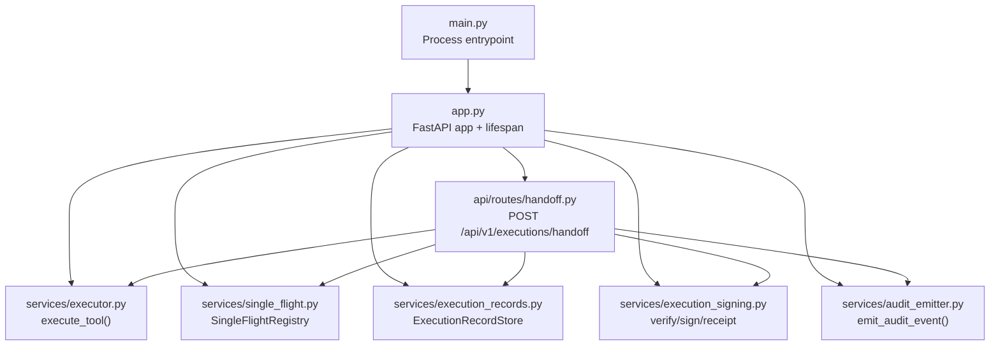
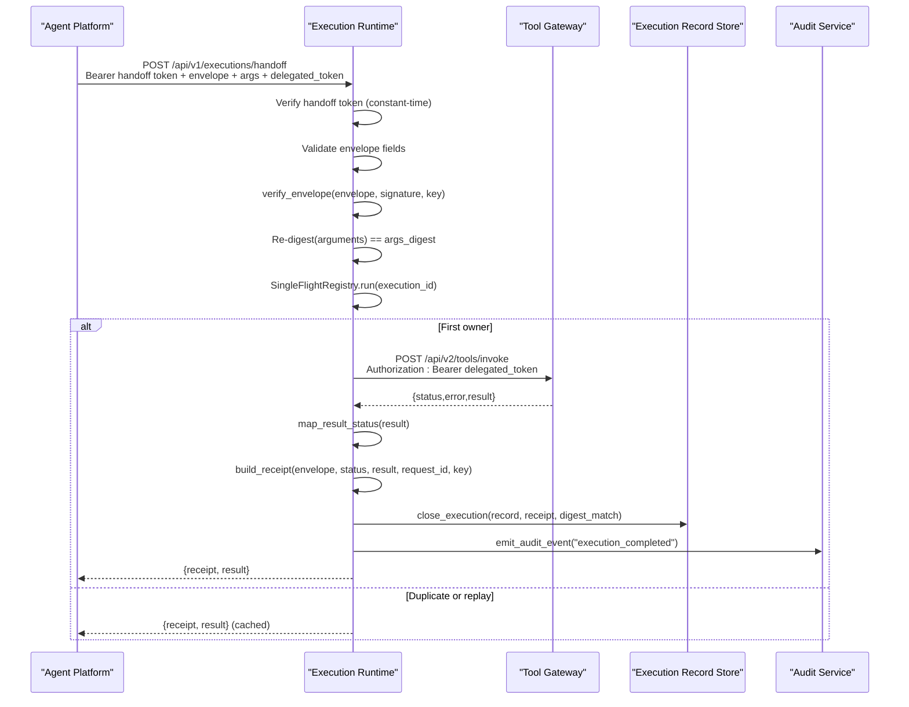
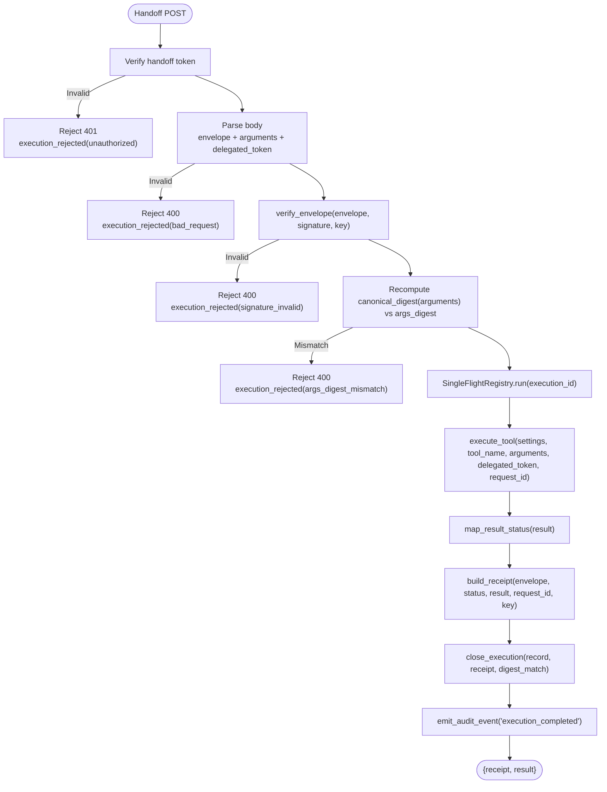
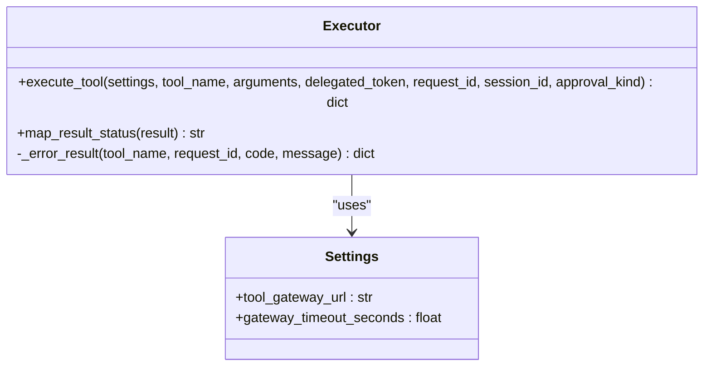
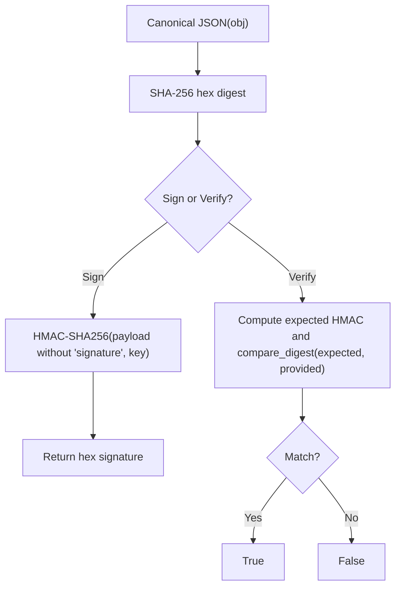
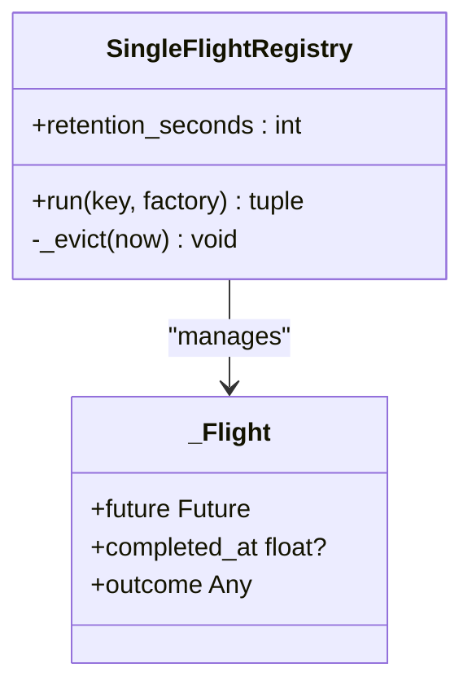
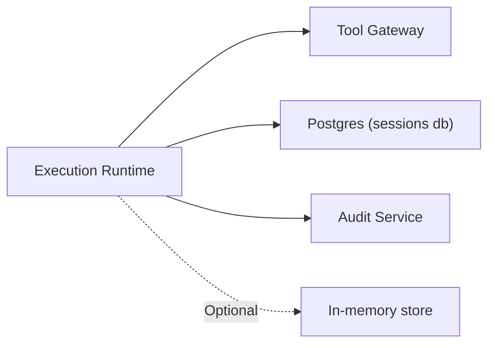

# Execution Runtime

<cite>
**Referenced Files in This Document**
- [main.py](file://products/execution-runtime/src/execution_runtime/main.py)
- [app.py](file://products/execution-runtime/src/execution_runtime/app.py)
- [config.py](file://products/execution-runtime/src/execution_runtime/core/config.py)
- [handoff.py](file://products/execution-runtime/src/execution_runtime/api/routes/handoff.py)
- [executor.py](file://products/execution-runtime/src/execution_runtime/services/executor.py)
- [execution_signing.py](file://products/execution-runtime/src/execution_runtime/services/execution_signing.py)
- [single_flight.py](file://products/execution-runtime/src/execution_runtime/services/single_flight.py)
- [execution_records.py](file://products/execution-runtime/src/execution_runtime/services/execution_records.py)
- [audit_emitter.py](file://products/execution-runtime/src/execution_runtime/services/audit_emitter.py)
- [execution-request.schema.json](file://shared/shared-contracts/schemas/execution-request.schema.json)
- [execution-receipt.schema.json](file://shared/shared-contracts/schemas/execution-receipt.schema.json)
- [SPEC-037-signed-execution-requests/spec.md](file://docs/specs/SPEC-037-signed-execution-requests/spec.md)
- [SPEC-038-isolated-execution-worker/spec.md](file://docs/specs/SPEC-038-isolated-execution-worker/spec.md)
</cite>

## Table of Contents
1. [Introduction](#introduction)
2. [Project Structure](#project-structure)
3. [Core Components](#core-components)
4. [Architecture Overview](#architecture-overview)
5. [Detailed Component Analysis](#detailed-component-analysis)
6. [Dependency Analysis](#dependency-analysis)
7. [Performance Considerations](#performance-considerations)
8. [Troubleshooting Guide](#troubleshooting-guide)
9. [Conclusion](#conclusion)
10. [Appendices](#appendices)

## Introduction
This document describes the execution runtime service that provides isolated workers for potentially mutating tool actions. It explains the bounded execution model, the signing and verification system, the handoff mechanism between the agent platform and the worker, the executor architecture (request processing, isolation boundaries, result collection), configuration options, security posture for untrusted code execution, and examples for executing mutating tools and handling failures.

The runtime is a dedicated process that:
- Receives signed execution envelopes from the agent platform over an authenticated internal handoff endpoint.
- Verifies signatures and argument digests before any execution.
- Executes exactly one tool invocation per envelope through the tool gateway using the confirmer’s delegated token.
- Produces tamper-evident receipts and persists them to a durable store.
- Emits audit events correlating with the resumed stream.

**Section sources**
- [SPEC-038-isolated-execution-worker/spec.md:11-25](file://docs/specs/SPEC-038-isolated-execution-worker/spec.md#L11-L25)
- [SPEC-037-signed-execution-requests/spec.md:11-22](file://docs/specs/SPEC-037-signed-execution-requests/spec.md#L11-L22)

## Project Structure
The execution runtime product is organized as a FastAPI application with clear separation of concerns:
- Entry point and lifecycle setup
- Configuration loaded from environment variables
- API routes exposing the handoff endpoint
- Services for execution, signing, single-flight idempotency, record persistence, and audit emission

**Diagram sources**
- [main.py:1-9](file://products/execution-runtime/src/execution_runtime/main.py#L1-L9)
- [app.py:19-67](file://products/execution-runtime/src/execution_runtime/app.py#L19-L67)
- [handoff.py:66-169](file://products/execution-runtime/src/execution_runtime/api/routes/handoff.py#L66-L169)
- [executor.py:23-152](file://products/execution-runtime/src/execution_runtime/services/executor.py#L23-L152)
- [single_flight.py:34-84](file://products/execution-runtime/src/execution_runtime/services/single_flight.py#L34-L84)
- [execution_records.py:310-332](file://products/execution-runtime/src/execution_runtime/services/execution_records.py#L310-L332)
- [execution_signing.py:54-93](file://products/execution-runtime/src/execution_runtime/services/execution_signing.py#L54-L93)
- [audit_emitter.py:68-99](file://products/execution-runtime/src/execution_runtime/services/audit_emitter.py#L68-L99)

**Section sources**
- [main.py:1-9](file://products/execution-runtime/src/execution_runtime/main.py#L1-L9)
- [app.py:19-67](file://products/execution-runtime/src/execution_runtime/app.py#L19-L67)

## Core Components
- Handoff route: authenticates caller via static handoff token, validates envelope shape, verifies signature and argument digest, enforces single-flight idempotency, executes the tool, signs and persists receipt, emits audit event.
- Executor: performs one HTTP call to the tool gateway with the forwarded delegated token; maps timeouts and transport errors into structured results.
- Signing module: canonical JSON, HMAC-SHA256 signing and verification, receipt construction with outcome digest.
- Single-flight registry: ensures each execution_id runs at most once; joins concurrent duplicates and replays return cached outcomes with bounded retention.
- Execution records: first-write-wins close of execution rows; supports memory and Postgres backends with best-effort durability.
- Audit emitter: fire-and-forget delivery to the audit service; never degrades the execution path.

**Section sources**
- [handoff.py:66-169](file://products/execution-runtime/src/execution_runtime/api/routes/handoff.py#L66-L169)
- [executor.py:23-152](file://products/execution-runtime/src/execution_runtime/services/executor.py#L23-L152)
- [execution_signing.py:40-93](file://products/execution-runtime/src/execution_runtime/services/execution_signing.py#L40-L93)
- [single_flight.py:27-107](file://products/execution-runtime/src/execution_runtime/services/single_flight.py#L27-L107)
- [execution_records.py:78-119](file://products/execution-runtime/src/execution_runtime/services/execution_records.py#L78-L119)
- [execution_records.py:196-303](file://products/execution-runtime/src/execution_runtime/services/execution_records.py#L196-L303)
- [audit_emitter.py:30-99](file://products/execution-runtime/src/execution_runtime/services/audit_emitter.py#L30-L99)

## Architecture Overview
The runtime isolates execution from the agent platform by receiving only pre-verified, signed requests. The agent platform constructs the envelope, signs it, and forwards it along with the parked arguments and delegated token to the worker. The worker re-verifies everything, executes the tool once, and returns a signed receipt.

**Diagram sources**
- [handoff.py:66-169](file://products/execution-runtime/src/execution_runtime/api/routes/handoff.py#L66-L169)
- [executor.py:23-152](file://products/execution-runtime/src/execution_runtime/services/executor.py#L23-L152)
- [execution_signing.py:54-93](file://products/execution-runtime/src/execution_runtime/services/execution_signing.py#L54-L93)
- [single_flight.py:42-84](file://products/execution-runtime/src/execution_runtime/services/single_flight.py#L42-L84)
- [execution_records.py:239-293](file://products/execution-runtime/src/execution_runtime/services/execution_records.py#L239-L293)
- [audit_emitter.py:68-99](file://products/execution-runtime/src/execution_runtime/services/audit_emitter.py#L68-L99)

## Detailed Component Analysis

### Handoff Endpoint and Request Processing
- Authentication: constant-time comparison of the presented bearer token against the configured handoff secret; missing secret fails closed.
- Envelope validation: required fields enforced; arguments must be a dict; optional delegated_token must be string if present.
- Signature verification: uses canonical JSON and HMAC-SHA256; rejects invalid or non-ASCII signatures.
- Argument digest check: recomputes SHA-256 of canonical JSON of arguments and compares to args_digest.
- Idempotency: SingleFlightRegistry keyed by execution_id ensures exactly-once execution semantics within the process lifetime.
- Result mapping and receipt authorship: maps gateway result to succeeded/failed/timeout, builds signed receipt, closes execution record, emits audit event.

**Diagram sources**
- [handoff.py:66-169](file://products/execution-runtime/src/execution_runtime/api/routes/handoff.py#L66-L169)
- [handoff.py:203-263](file://products/execution-runtime/src/execution_runtime/api/routes/handoff.py#L203-L263)
- [execution_signing.py:40-67](file://products/execution-runtime/src/execution_runtime/services/execution_signing.py#L40-L67)
- [executor.py:23-152](file://products/execution-runtime/src/execution_runtime/services/executor.py#L23-L152)

**Section sources**
- [handoff.py:66-169](file://products/execution-runtime/src/execution_runtime/api/routes/handoff.py#L66-L169)
- [handoff.py:203-263](file://products/execution-runtime/src/execution_runtime/api/routes/handoff.py#L203-L263)

### Executor Service and Isolation Boundaries
- Executes exactly one tool invocation per handoff.
- Forwards the confirmer’s delegated token as bearer; the token is never logged or persisted.
- Uses a bounded timeout for the gateway call; timeouts and transport errors are mapped to structured error results.
- Correlates tool_invoked events with execution_completed via the forwarded request_id.
- Optional session_id and approval_kind are forwarded as correlation/provenance handles; they do not confer authority.

**Diagram sources**
- [executor.py:23-152](file://products/execution-runtime/src/execution_runtime/services/executor.py#L23-L152)
- [config.py:20-49](file://products/execution-runtime/src/execution_runtime/core/config.py#L20-L49)

**Section sources**
- [executor.py:23-152](file://products/execution-runtime/src/execution_runtime/services/executor.py#L23-L152)

### Signing and Verification System
- Canonical JSON: sorted keys, no insignificant whitespace, ensuring deterministic serialization across processes.
- Envelope signing: HMAC-SHA256 over canonical JSON excluding signature field.
- Verification: constant-time comparison to prevent timing attacks.
- Receipt construction: includes execution_id, status, outcome_digest (SHA-256 of canonical JSON of result), request_id, completed_at, and signature.

**Diagram sources**
- [execution_signing.py:40-67](file://products/execution-runtime/src/execution_runtime/services/execution_signing.py#L40-L67)
- [execution-signing.py:70-93](file://products/execution-runtime/src/execution_runtime/services/execution_signing.py#L70-L93)

**Section sources**
- [execution_signing.py:40-93](file://products/execution-runtime/src/execution_runtime/services/execution_signing.py#L40-L93)

### Single-Flight Idempotency
- Keyed by execution_id; first caller owns execution, others await the same future.
- Completed flights are evicted after retention seconds and capped by a maximum count to bound memory usage.
- Failed flights are removed so subsequent replays can retry (though handoff does not retry automatically).

**Diagram sources**
- [single_flight.py:27-107](file://products/execution-runtime/src/execution_runtime/services/single_flight.py#L27-L107)

**Section sources**
- [single_flight.py:27-107](file://products/execution-runtime/src/execution_runtime/services/single_flight.py#L27-L107)

### Execution Records and Result Collection
- In-memory backend for development/CI; Postgres backend for production sharing the sessions database.
- First-write-wins close: only rows with status “requested” accept a receipt; late arrivals return existing receipt.
- Retention sweep deletes old rows on startup and periodically during writes.

**Diagram sources**
- [execution_records.py:78-119](file://products/execution-runtime/src/execution_runtime/services/execution_records.py#L78-L119)
- [execution_records.py:196-303](file://products/execution-runtime/src/execution_runtime/services/execution_records.py#L196-L303)

**Section sources**
- [execution_records.py:78-119](file://products/execution-runtime/src/execution_runtime/services/execution_records.py#L78-L119)
- [execution_records.py:196-303](file://products/execution-runtime/src/execution_runtime/services/execution_records.py#L196-L303)

### Audit Emission
- Fire-and-forget delivery on a daemon thread with short timeout.
- Unconfigured audit service URL results in no-op; failures are logged and counted but never propagate to the caller.
- Events include execution_completed and execution_rejected with details correlating confirm_id, execution_id, call_id, tool_name, and status.

**Section sources**
- [audit_emitter.py:30-99](file://products/execution-runtime/src/execution_runtime/services/audit_emitter.py#L30-L99)

## Dependency Analysis
The runtime depends on:
- Tool gateway for actual tool execution.
- Shared state Postgres for execution records (optional fallback to in-memory).
- Audit service for durable audit events (optional).
- Internal handoff secret and execution signing key for authentication and integrity.

**Diagram sources**
- [executor.py:79-107](file://products/execution-runtime/src/execution_runtime/services/executor.py#L79-L107)
- [execution_records.py:310-332](file://products/execution-runtime/src/execution_runtime/services/execution_records.py#L310-L332)
- [audit_emitter.py:68-99](file://products/execution-runtime/src/execution_runtime/services/audit_emitter.py#L68-L99)

**Section sources**
- [executor.py:79-107](file://products/execution-runtime/src/execution_runtime/services/executor.py#L79-L107)
- [execution_records.py:310-332](file://products/execution-runtime/src/execution_runtime/services/execution_records.py#L310-L332)
- [audit_emitter.py:68-99](file://products/execution-runtime/src/execution_runtime/services/audit_emitter.py#L68-L99)

## Performance Considerations
- Bounded timeouts: gateway calls use a configurable timeout to prevent runaway operations.
- Single-flight registry: bounded by retention seconds and a maximum number of completed entries to avoid unbounded growth.
- Best-effort persistence: record store failures degrade audit completeness but do not block responses.
- Non-blocking audit emission: audit events are delivered asynchronously with short timeouts.

[No sources needed since this section provides general guidance]

## Troubleshooting Guide
Common rejection reasons and their meanings:
- unauthorized: missing or invalid handoff token.
- bad_request: malformed body or missing required envelope fields.
- signature_invalid: envelope signature does not match the configured signing key.
- args_digest_mismatch: executed arguments differ from the parked arguments’ digest.
- NO_GATEWAY: tool-gateway URL not configured.
- NO_CREDENTIAL: delegated token missing.
- TIMEOUT: gateway call timed out.
- TRANSPORT_ERROR: unreachable gateway.
- BAD_GATEWAY_RESPONSE: non-JSON response from gateway.

Operational checks:
- Ensure EXECUTION_HANDOFF_TOKEN and EXECUTION_SIGNING_KEY are provisioned; missing secrets fail closed.
- Confirm TOOL_GATEWAY_URL is reachable and responds with JSON.
- Verify Postgres connectivity when using Postgres backend; otherwise the service falls back to in-memory.
- Inspect audit events for execution_rejected and execution_completed to correlate failures.

**Section sources**
- [handoff.py:71-157](file://products/execution-runtime/src/execution_runtime/api/routes/handoff.py#L71-L157)
- [executor.py:38-121](file://products/execution-runtime/src/execution_runtime/services/executor.py#L38-L121)
- [execution_records.py:310-332](file://products/execution-runtime/src/execution_runtime/services/execution_records.py#L310-L332)

## Conclusion
The execution runtime provides a secure, bounded, and auditable execution boundary for mutating tool actions. It enforces strict authentication, cryptographic verification of requests and outcomes, idempotent execution, and durable recording of results. By isolating execution in its own process and limiting resource exposure through timeouts and bounded registries, it prevents privilege escalation and runaway operations while preserving operator visibility and audit integrity.

[No sources needed since this section summarizes without analyzing specific files]

## Appendices

### Configuration Options
- EXECUTION_SIGNING_KEY: signing key for envelope verification and receipt signing.
- EXECUTION_HANDOFF_TOKEN: static token used to authenticate the agent platform’s handoff calls.
- TOOL_GATEWAY_URL: base URL of the tool gateway used for tool invocations.
- EXECUTION_GATEWAY_TIMEOUT_SECONDS: timeout for tool gateway calls (must be > 0).
- EXECUTION_STATE_STORE_BACKEND: backend selection (“memory” or “postgres”).
- EXECUTION_STATE_DB_URL: Postgres connection string when using Postgres backend.
- EXECUTION_AUDIT_SERVICE_URL, EXECUTION_AUDIT_CLIENT_ID, EXECUTION_AUDIT_CLIENT_SECRET: optional audit service integration.
- EXECUTION_FLIGHT_RETENTION_SECONDS: how long completed flight outcomes are retained (>= 1).

**Section sources**
- [config.py:20-49](file://products/execution-runtime/src/execution_runtime/core/config.py#L20-L49)
- [config.py:51-78](file://products/execution-runtime/src/execution_runtime/core/config.py#L51-L78)

### Security Model for Untrusted Code Execution
- Fail-closed posture: missing secrets reject all handoffs; no unsigned execution path exists.
- Minimal trust surface: only the authenticated handoff endpoint accepts requests; no portal or external routes expose the worker.
- Authority delegation unchanged: the worker forwards the confirmer’s delegated token to the tool gateway; policy and admission control remain enforced by the gateway.
- Provenance handles: optional session_id and approval_kind are forwarded as correlation/provenance metadata and do not grant additional authority.

**Section sources**
- [SPEC-038-isolated-execution-worker/spec.md:79-118](file://docs/specs/SPEC-038-isolated-execution-worker/spec.md#L79-L118)
- [executor.py:53-87](file://products/execution-runtime/src/execution_runtime/services/executor.py#L53-L87)

### Examples

#### Executing a Mutating Tool
- The agent platform constructs a signed execution envelope containing tool_name, args_digest, confirm_id, call_id, session_id, decider_user_id, requested_at, and signature.
- It sends a POST to the worker’s handoff endpoint with the envelope, parked arguments, and delegated token under a Bearer handoff token.
- The worker verifies the token, signature, and argument digest, executes the tool once, signs a receipt, persists it, and returns both the receipt and result.

**Section sources**
- [execution-request.schema.json:1-71](file://shared/shared-contracts/schemas/execution-request.schema.json#L1-L71)
- [handoff.py:66-169](file://products/execution-runtime/src/execution_runtime/api/routes/handoff.py#L66-L169)
- [executor.py:23-152](file://products/execution-runtime/src/execution_runtime/services/executor.py#L23-L152)
- [execution-receipt.schema.json:1-47](file://shared/shared-contracts/schemas/execution-receipt.schema.json#L1-L47)

#### Handling Execution Failures
- If the handoff token is invalid or missing, the worker returns a 401 with reason unauthorized.
- If the envelope signature is invalid or arguments mismatch, the worker returns 400 with signature_invalid or args_digest_mismatch.
- If the tool gateway times out or is unreachable, the worker returns a structured error result with TIMEOUT or TRANSPORT_ERROR and maps it to a failed/timeout receipt.
- Late completions after a prior timeout close are recorded as late completions and do not overwrite existing receipts.

**Section sources**
- [handoff.py:71-157](file://products/execution-runtime/src/execution_runtime/api/routes/handoff.py#L71-L157)
- [executor.py:79-121](file://products/execution-runtime/src/execution_runtime/services/executor.py#L79-L121)
- [execution_records.py:239-293](file://products/execution-runtime/src/execution_runtime/services/execution_records.py#L239-L293)