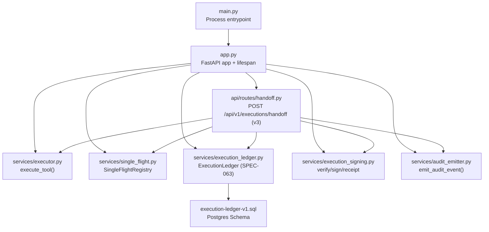
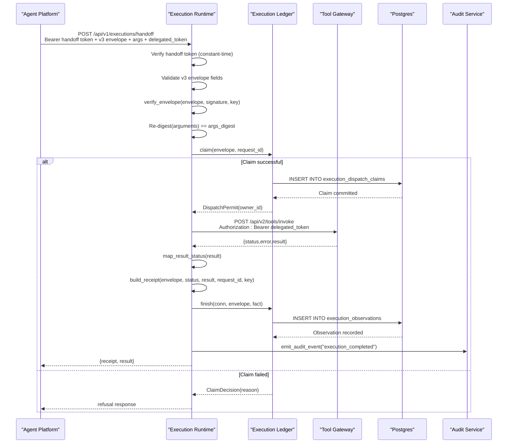
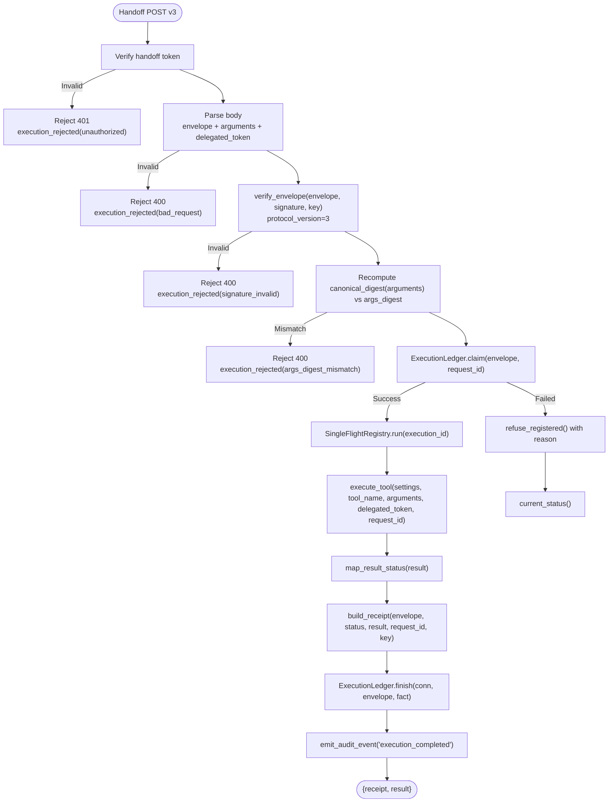
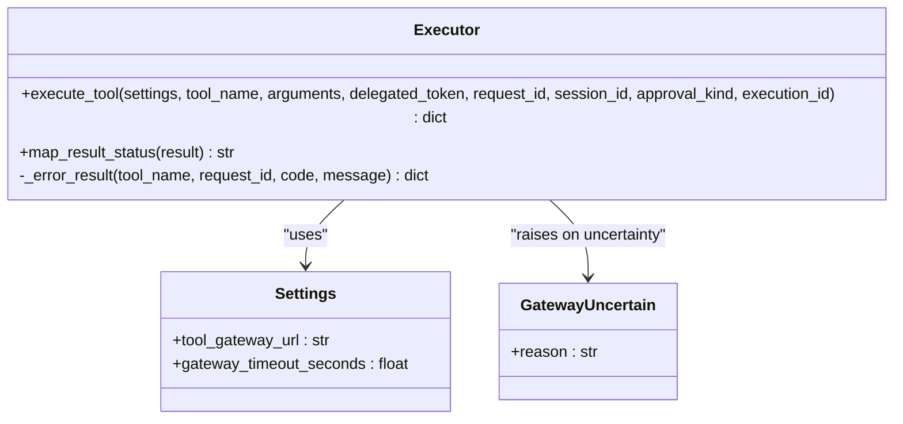
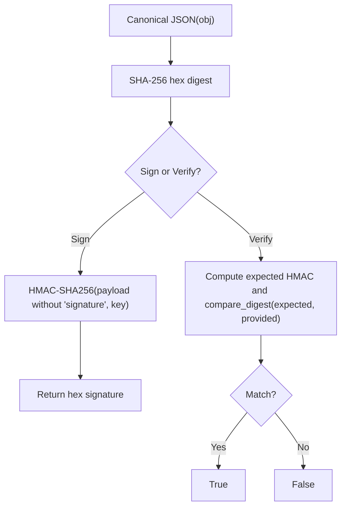
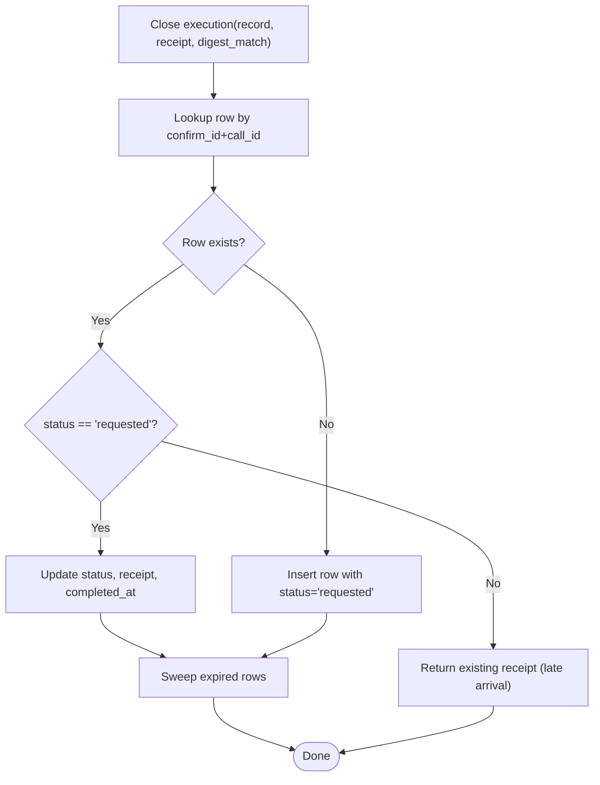
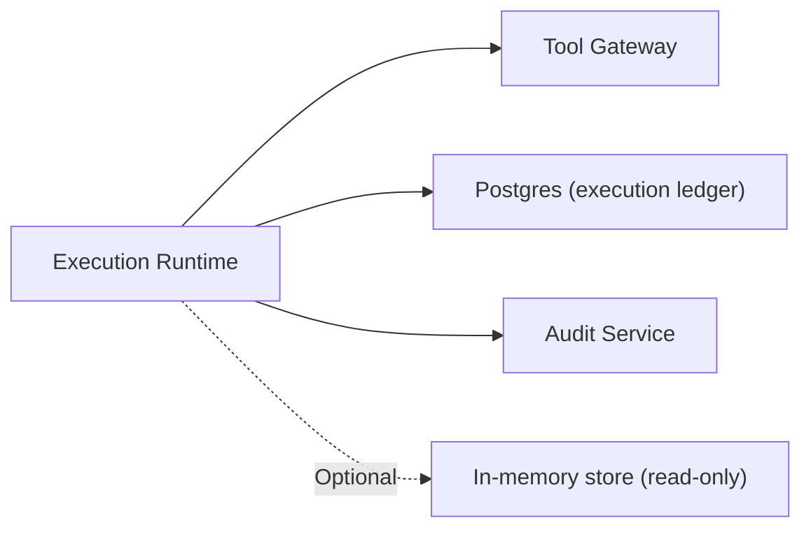

# Execution Runtime

<cite>
**Referenced Files in This Document**
- [main.py](file://products/execution-runtime/src/execution_runtime/main.py)
- [app.py](file://products/execution-runtime/src/execution_runtime/app.py)
- [config.py](file://products/execution-runtime/src/execution_runtime/core/config.py)
- [handoff.py](file://products/execution-runtime/src/execution_runtime/api/routes/handoff.py)
- [executor.py](file://products/execution-runtime/src/execution_runtime/services/executor.py)
- [execution_signing.py](file://products/execution-runtime/src/execution_runtime/services/execution_signing.py)
- [single_flight.py](file://products/execution-runtime/src/execution_runtime/services/single_flight.py)
- [execution_ledger.py](file://products/execution-runtime/src/execution_runtime/services/execution_ledger.py)
- [execution_io.py](file://products/execution-runtime/src/execution_runtime/services/execution_io.py)
- [execution_protocol.py](file://products/execution-runtime/src/execution_runtime/services/execution_protocol.py)
- [audit_emitter.py](file://products/execution-runtime/src/execution_runtime/services/audit_emitter.py)
- [execution-ledger-v1.sql](file://shared/shared-contracts/sql/execution-ledger-v1.sql)
- [execution-ledger-v1.sql](file://products/execution-runtime/src/execution_runtime/contracts/execution-ledger-v1.sql)
- [execution-request.schema.json](file://shared/shared-contracts/schemas/execution-request.schema.json)
- [execution-receipt.schema.json](file://shared/shared-contracts/schemas/execution-receipt.schema.json)
- [SPEC-037-signed-execution-requests/spec.md](file://docs/specs/SPEC-037-signed-execution-requests/spec.md)
- [SPEC-038-isolated-execution-worker/spec.md](file://docs/specs/SPEC-038-isolated-execution-worker/spec.md)
- [SPEC-063-crash-safe-execution/spec.md](file://docs/specs/SPEC-063-crash-safe-execution/spec.md)
</cite>

## Update Summary
**Changes Made**
- Updated execution model to reflect SPEC-063 crash-safe execution with durable single-use dispatch claims
- Added new execution ledger architecture with atomic claim mechanisms and persistent root-run identity binding
- Documented v3 admission flow replacing best-effort approach with synchronous run-stop latches
- Enhanced security model with owner-scoped visibility and execution recovery APIs
- Updated configuration options for admission control and epoch management
- Added new database schema documentation for execution-ledger-v1 tables
- Revised handoff endpoint to integrate with durable claim system

## Table of Contents
1. [Introduction](#introduction)
2. [Project Structure](#project-structure)
3. [Core Components](#core-components)
4. [Architecture Overview](#architecture-overview)
5. [Detailed Component Analysis](#detailed-component-analysis)
6. [Dependency Analysis](#dependency-analysis)
7. [Performance Considerations](#performance-considerations)
8. [Troubleshooting Guide](#troubleshooting-guide)
9. [Conclusion](#conclusion)
10. [Appendices](#appendices)

## Introduction
This document describes the execution runtime service that provides isolated workers for potentially mutating tool actions with crash-safe execution guarantees. The runtime implements SPEC-063 enhancements including durable single-use dispatch claims, atomic claim mechanisms, execution recovery APIs with owner-scoped visibility, and synchronous run-stop latches with persistent root-run identity binding.

The runtime is a dedicated process that:
- Receives signed execution envelopes from the agent platform over an authenticated internal handoff endpoint.
- Verifies signatures and argument digests before any execution through a v3 admission flow.
- Executes exactly one tool invocation per envelope through the tool gateway using the confirmer's delegated token.
- Produces tamper-evident receipts and persists them to a durable Postgres-backed execution ledger.
- Emits audit events correlating with the resumed stream while maintaining bounded observation windows.

**Updated** The runtime now enforces at-most-one worker dispatch attempts per approved call, preventing duplicate mutations even after process loss, database failure, or lost responses.

**Section sources**
- [SPEC-063-crash-safe-execution/spec.md:29-45](file://docs/specs/SPEC-063-crash-safe-execution/spec.md#L29-L45)
- [SPEC-038-isolated-execution-worker/spec.md:11-25](file://docs/specs/SPEC-038-isolated-execution-worker/spec.md#L11-L25)
- [SPEC-037-signed-execution-requests/spec.md:11-22](file://docs/specs/SPEC-037-signed-execution-requests/spec.md#L11-L22)

## Project Structure
The execution runtime product is organized as a FastAPI application with clear separation of concerns, enhanced by SPEC-063 durability components:
- Entry point and lifecycle setup
- Configuration loaded from environment variables with admission control settings
- API routes exposing the v3 handoff endpoint with durable claim integration
- Services for execution, signing, single-flight idempotency, execution ledger persistence, and audit emission
- Database schema management for execution-ledger-v1 tables

**Diagram sources**
- [main.py:1-9](file://products/execution-runtime/src/execution_runtime/main.py#L1-L9)
- [app.py:19-67](file://products/execution-runtime/src/execution_runtime/app.py#L19-L67)
- [handoff.py:144-235](file://products/execution-runtime/src/execution_runtime/api/routes/handoff.py#L144-L235)
- [executor.py:17-71](file://products/execution-runtime/src/execution_runtime/services/executor.py#L17-L71)
- [single_flight.py:34-107](file://products/execution-runtime/src/execution_runtime/services/single_flight.py#L34-L107)
- [execution_ledger.py:77-491](file://products/execution-runtime/src/execution_runtime/services/execution_ledger.py#L77-L491)
- [execution-signing.py:40-93](file://products/execution-runtime/src/execution_runtime/services/execution_signing.py#L40-L93)
- [audit_emitter.py:30-99](file://products/execution-runtime/src/execution_runtime/services/audit_emitter.py#L30-L99)

**Section sources**
- [main.py:1-9](file://products/execution-runtime/src/execution_runtime/main.py#L1-L9)
- [app.py:19-67](file://products/execution-runtime/src/execution_runtime/app.py#L19-L67)

## Core Components
- **Handoff route**: authenticates caller via static handoff token, validates v3 envelope shape, verifies signature and argument digest, enforces durable single-flight idempotency, executes the tool, signs and persists receipt, emits audit event.
- **Executor**: performs one HTTP call to the tool gateway with the forwarded delegated token; maps timeouts and transport errors into structured results with uncertainty reporting.
- **Signing module**: canonical JSON, HMAC-SHA256 signing and verification, receipt construction with outcome digest.
- **Single-flight registry**: ensures each execution_id runs at most once within process lifetime; joins concurrent duplicates and replays return cached outcomes with bounded retention.
- **Execution ledger**: Postgres-backed durable state machine with atomic claim mechanisms, observation tracking, and recovery projections.
- **Audit emitter**: fire-and-forget delivery to the audit service; never degrades the execution path.

**Updated** The execution ledger replaces simple record storage with a comprehensive state machine that tracks execution intent, dispatch claims, observations, and run lifecycle with immutable evidence preservation.

**Section sources**
- [handoff.py:144-235](file://products/execution-runtime/src/execution_runtime/api/routes/handoff.py#L144-L235)
- [executor.py:17-71](file://products/execution-runtime/src/execution_runtime/services/executor.py#L17-L71)
- [execution_signing.py:40-93](file://products/execution-runtime/src/execution_runtime/services/execution_signing.py#L40-L93)
- [single_flight.py:34-107](file://products/execution-runtime/src/execution_runtime/services/single_flight.py#L34-L107)
- [execution_ledger.py:77-491](file://products/execution-runtime/src/execution_runtime/services/execution_ledger.py#L77-L491)
- [audit_emitter.py:30-99](file://products/execution-runtime/src/execution_runtime/services/audit_emitter.py#L30-L99)

## Architecture Overview
The runtime isolates execution from the agent platform by receiving only pre-verified, signed requests through a v3 admission flow. The agent platform constructs the envelope, signs it with protocol version 3, and forwards it along with parked arguments and delegated token to the worker. The worker re-verifies everything, atomically claims dispatch authority, executes the tool once, and returns a signed receipt with uncertainty handling.

**Diagram sources**
- [handoff.py:144-235](file://products/execution-runtime/src/execution_runtime/api/routes/handoff.py#L144-L235)
- [executor.py:17-71](file://products/execution-runtime/src/execution_runtime/services/executor.py#L17-L71)
- [execution_ledger.py:158-221](file://products/execution-runtime/src/execution_runtime/services/execution_ledger.py#L158-L221)
- [execution_signing.py:40-93](file://products/execution-runtime/src/execution_runtime/services/execution_signing.py#L40-L93)
- [single_flight.py:42-84](file://products/execution-runtime/src/execution_runtime/services/single_flight.py#L42-L84)
- [audit_emitter.py:68-99](file://products/execution-runtime/src/execution_runtime/services/audit_emitter.py#L68-L99)

## Detailed Component Analysis

### Handoff Endpoint and v3 Request Processing
- **Authentication**: constant-time comparison of the presented bearer token against the configured handoff secret; missing secret fails closed.
- **Envelope validation**: required fields enforced for v3 protocol; arguments must be a dict; optional delegated_token must be string if present.
- **Signature verification**: uses canonical JSON and HMAC-SHA256; rejects invalid or non-ASCII signatures; enforces protocol_version = 3.
- **Argument digest check**: recomputes SHA-256 of canonical JSON of arguments and compares to args_digest.
- **Durable claim acquisition**: atomically commits execution_dispatch_claims before any gateway invocation; prevents duplicate dispatch even after process loss.
- **Result mapping and receipt authorship**: maps gateway result to succeeded/failed/timeout, builds signed receipt, records observation, emits audit event.

**Updated** The v3 admission flow replaces the previous best-effort approach with synchronous run-stop latches and persistent root-run identity binding, ensuring at-most-one dispatch semantics.

**Diagram sources**
- [handoff.py:144-235](file://products/execution-runtime/src/execution_runtime/api/routes/handoff.py#L144-L235)
- [execution_ledger.py:158-221](file://products/execution-runtime/src/execution_runtime/services/execution_ledger.py#L158-L221)
- [execution_protocol.py:81-92](file://products/execution-runtime/src/execution_runtime/services/execution_protocol.py#L81-L92)
- [executor.py:17-71](file://products/execution-runtime/src/execution_runtime/services/executor.py#L17-L71)

**Section sources**
- [handoff.py:144-235](file://products/execution-runtime/src/execution_runtime/api/routes/handoff.py#L144-L235)
- [execution_protocol.py:81-92](file://products/execution-runtime/src/execution_runtime/services/execution_protocol.py#L81-L92)

### Executor Service and Isolation Boundaries
- Executes exactly one tool invocation per handoff with uncertainty reporting.
- Forwards the confirmer's delegated token as bearer; the token is never logged or persisted.
- Uses a bounded timeout for the gateway call; timeouts and transport errors are mapped to structured error results with `GatewayUncertain` exceptions.
- Correlates tool_invoked events with execution_completed via the forwarded request_id.
- Optional session_id and approval_kind are forwarded as correlation/provenance handles; they do not confer authority.

**Updated** The executor now integrates with the execution ledger's uncertainty model, where transport errors and timeouts indicate potential target effects rather than definitive failures.

**Diagram sources**
- [executor.py:17-71](file://products/execution-runtime/src/execution_runtime/services/executor.py#L17-L71)
- [config.py:20-49](file://products/execution-runtime/src/execution_runtime/core/config.py#L20-L49)

**Section sources**
- [executor.py:17-71](file://products/execution-runtime/src/execution_runtime/services/executor.py#L17-L71)

### Signing and Verification System
- Canonical JSON: sorted keys, no insignificant whitespace, ensuring deterministic serialization across processes.
- Envelope signing: HMAC-SHA256 over canonical JSON excluding signature field.
- Verification: constant-time comparison to prevent timing attacks.
- Receipt construction: includes execution_id, status, outcome_digest (SHA-256 of canonical JSON of result), request_id, completed_at, and signature.

**Updated** Protocol version 3 enforcement ensures compatibility with the new execution ledger and admission controls.

**Diagram sources**
- [execution_signing.py:40-67](file://products/execution-runtime/src/execution_runtime/services/execution_signing.py#L40-L67)
- [execution-signing.py:70-93](file://products/execution-runtime/src/execution_runtime/services/execution_signing.py#L70-L93)

**Section sources**
- [execution_signing.py:40-93](file://products/execution-runtime/src/execution_runtime/services/execution_signing.py#L40-L93)

### Execution Ledger and Durable State Management
- **Postgres-backed state machine**: manages execution intent registration, dispatch claims, observations, and run lifecycle.
- **Atomic claim mechanism**: `execution_dispatch_claims` table ensures at-most-one dispatch per approved call with unique ownership.
- **Observation tracking**: `execution_observations` table records all execution events with immutable evidence preservation.
- **Run lifecycle**: `execution_runs` table tracks root-run identity binding with monotonic updates.
- **Retention policy**: 30-day minimum retention after request expiry with independent cleanup.

**Updated** The execution ledger replaces simple record storage with comprehensive state management that prevents duplicate mutations and provides recovery capabilities.

**Diagram sources**
- [execution_ledger.py:269-281](file://products/execution-runtime/src/execution_runtime/services/execution_ledger.py#L269-L281)
- [execution-ledger-v1.sql:16-30](file://shared/shared-contracts/sql/execution-ledger-v1.sql#L16-L30)

**Section sources**
- [execution_ledger.py:77-491](file://products/execution-runtime/src/execution_runtime/services/execution_ledger.py#L77-L491)
- [execution-ledger-v1.sql:16-30](file://shared/shared-contracts/sql/execution-ledger-v1.sql#L16-L30)

### Audit Emission
- Fire-and-forget delivery on a daemon thread with short timeout.
- Unconfigured audit service URL results in no-op; failures are logged and counted but never propagate to the caller.
- Events include execution_completed and execution_rejected with details correlating confirm_id, execution_id, call_id, tool_name, and status.

**Updated** Audit events now include additional context about execution ledger state and observation metadata for better recovery analysis.

**Section sources**
- [audit_emitter.py:30-99](file://products/execution-runtime/src/execution_runtime/services/audit_emitter.py#L30-L99)

## Dependency Analysis
The runtime depends on:
- Tool gateway for actual tool execution.
- Postgres database for execution ledger with SPEC-063 schema migration.
- Audit service for durable audit events (optional).
- Internal handoff secret and execution signing key for authentication and integrity.

**Updated** The execution ledger requires Postgres availability for mutation admission, replacing the previous memory fallback option.

**Diagram sources**
- [executor.py:27-59](file://products/execution-runtime/src/execution_runtime/services/executor.py#L27-L59)
- [execution_ledger.py:77-101](file://products/execution-runtime/src/execution_runtime/services/execution_ledger.py#L77-L101)
- [audit_emitter.py:68-99](file://products/execution-runtime/src/execution_runtime/services/audit_emitter.py#L68-L99)

**Section sources**
- [executor.py:27-59](file://products/execution-runtime/src/execution_runtime/services/executor.py#L27-L59)
- [execution_ledger.py:77-101](file://products/execution-runtime/src/execution_runtime/services/execution_ledger.py#L77-L101)
- [audit_emitter.py:68-99](file://products/execution-runtime/src/execution_runtime/services/audit_emitter.py#L68-L99)

## Performance Considerations
- **Bounded timeouts**: gateway calls use a configurable timeout to prevent runaway operations.
- **Single-flight registry**: bounded by retention seconds and a maximum number of completed entries to avoid unbounded growth.
- **Database budgeting**: execution_io provides bounded database operations with deadline enforcement.
- **Non-blocking audit emission**: audit events are delivered asynchronously with short timeouts.
- **Ledger retention**: efficient cleanup of old execution evidence after 30-day retention horizon.

**Updated** Performance considerations now include execution ledger operations, database connection management, and observation overflow handling.

## Troubleshooting Guide
Common rejection reasons and their meanings:
- unauthorized: missing or invalid handoff token.
- bad_request: malformed body or missing required envelope fields.
- signature_invalid: envelope signature does not match the configured signing key.
- args_digest_mismatch: executed arguments differ from the parked arguments' digest.
- NO_GATEWAY: tool-gateway URL not configured.
- NO_CREDENTIAL: delegated token missing.
- TIMEOUT: gateway call timed out.
- TRANSPORT_ERROR: unreachable gateway.
- BAD_GATEWAY_RESPONSE: non-JSON response from gateway.
- **NEW**: store_unavailable: execution ledger database unavailable.
- **NEW**: claim_commit_unconfirmed: ambiguous claim commit status.
- **NEW**: identity_conflict: conflicting execution identity or ownership.
- **NEW**: request_expired: v3 request outside validity window.
- **NEW**: admission_disabled: execution admission control disabled.

**Updated** New error codes reflect the execution ledger's state management and admission control requirements.

Operational checks:
- Ensure EXECUTION_HANDOFF_TOKEN and EXECUTION_SIGNING_KEY are provisioned; missing secrets fail closed.
- Confirm TOOL_GATEWAY_URL is reachable and responds with JSON.
- Verify Postgres connectivity when using execution ledger backend; service requires database for mutation admission.
- Inspect audit events for execution_rejected and execution_completed to correlate failures.
- Monitor execution ledger health and unresolved claim counts.

**Section sources**
- [handoff.py:144-235](file://products/execution-runtime/src/execution_runtime/api/routes/handoff.py#L144-L235)
- [executor.py:27-59](file://products/execution-runtime/src/execution_runtime/services/executor.py#L27-L59)
- [execution_ledger.py:90-101](file://products/execution-runtime/src/execution_runtime/services/execution_ledger.py#L90-L101)

## Conclusion
The execution runtime provides a secure, bounded, and auditable execution boundary for mutating tool actions with crash-safe guarantees. It enforces strict authentication, cryptographic verification of requests and outcomes, durable single-use dispatch claims, and immutable recording of results. By isolating execution in its own process, limiting resource exposure through timeouts and bounded registries, and implementing SPEC-063 durability guarantees, it prevents privilege escalation and runaway operations while preserving operator visibility and audit integrity.

**Updated** The runtime now provides at-most-one dispatch guarantees even after process loss, database failure, or network interruptions, making it suitable for critical mutation operations where duplicate execution could cause data corruption or inconsistent state.

## Appendices

### Configuration Options
- EXECUTION_SIGNING_KEY: signing key for envelope verification and receipt signing.
- EXECUTION_HANDOFF_TOKEN: static token used to authenticate the agent platform's handoff calls.
- TOOL_GATEWAY_URL: base URL of the tool gateway used for tool invocations.
- EXECUTION_GATEWAY_TIMEOUT_SECONDS: timeout for tool gateway calls (must be > 0 and <= 30).
- EXECUTION_STATE_STORE_BACKEND: backend selection ("memory" or "postgres").
- EXECUTION_STATE_DB_URL: Postgres connection string when using Postgres backend.
- EXECUTION_AUDIT_SERVICE_URL, EXECUTION_AUDIT_CLIENT_ID, EXECUTION_AUDIT_CLIENT_SECRET: optional audit service integration.
- EXECUTION_FLIGHT_RETENTION_SECONDS: how long completed flight outcomes are retained (>= 1).
- **NEW**: EXECUTION_ADMISSION_ENABLED: enables execution admission control (true/false).
- **NEW**: EXECUTION_ADMISSION_EPOCH: epoch identifier for admission control coordination.

**Updated** New configuration options support SPEC-063 admission control and epoch-based coordination.

**Section sources**
- [config.py:20-83](file://products/execution-runtime/src/execution_runtime/core/config.py#L20-L83)

### Security Model for Untrusted Code Execution
- Fail-closed posture: missing secrets reject all handoffs; no unsigned execution path exists.
- Minimal trust surface: only the authenticated handoff endpoint accepts requests; no portal or external routes expose the worker.
- Authority delegation unchanged: the worker forwards the confirmer's delegated token to the tool gateway; policy and admission control remain enforced by the gateway.
- Provenance handles: optional session_id and approval_kind are forwarded as correlation/provenance metadata and do not grant additional authority.
- **Enhanced**: Durable single-use claims prevent duplicate execution even with compromised state or process restarts.

**Updated** Security model now includes execution ledger protection against replay attacks and duplicate dispatch attempts.

**Section sources**
- [SPEC-038-isolated-execution-worker/spec.md:79-118](file://docs/specs/SPEC-038-isolated-execution-worker/spec.md#L79-L118)
- [executor.py:27-59](file://products/execution-runtime/src/execution_runtime/services/executor.py#L27-L59)

### Examples

#### Executing a Mutating Tool with v3 Admission
- The agent platform constructs a signed execution envelope containing tool_name, args_digest, confirm_id, call_id, session_id, decider_user_id, requested_at, expires_at, run_id, admission_epoch, approval_kind, protocol_version=3, and signature.
- It sends a POST to the worker's handoff endpoint with the envelope, parked arguments, and delegated token under a Bearer handoff token.
- The worker verifies the token, signature, and argument digest, atomically claims dispatch authority, executes the tool once, signs a receipt, persists it, and returns both the receipt and result.

**Updated** Example now includes v3 protocol requirements and execution ledger integration.

**Section sources**
- [execution-request.schema.json:1-71](file://shared/shared-contracts/schemas/execution-request.schema.json#L1-L71)
- [handoff.py:144-235](file://products/execution-runtime/src/execution_runtime/api/routes/handoff.py#L144-L235)
- [executor.py:17-71](file://products/execution-runtime/src/execution_runtime/services/executor.py#L17-L71)
- [execution-receipt.schema.json:1-47](file://shared/shared-contracts/schemas/execution-receipt.schema.json#L1-L47)

#### Handling Execution Failures with Uncertainty Reporting
- If the handoff token is invalid or missing, the worker returns a 401 with reason unauthorized.
- If the envelope signature is invalid or arguments mismatch, the worker returns 400 with signature_invalid or args_digest_mismatch.
- If the tool gateway times out or is unreachable, the worker returns a structured error result with TIMEOUT or TRANSPORT_ERROR and maps it to a failed/timeout receipt with uncertainty indication.
- Late completions after a prior timeout close are recorded as late completions and do not overwrite existing receipts.
- **New**: Execution ledger failures return store_unavailable or claim_commit_unconfirmed with appropriate HTTP status codes.

**Updated** Failure handling now includes execution ledger uncertainty states and improved error categorization.

**Section sources**
- [handoff.py:144-235](file://products/execution-runtime/src/execution_runtime/api/routes/handoff.py#L144-L235)
- [executor.py:27-59](file://products/execution-runtime/src/execution_runtime/services/executor.py#L27-L59)
- [execution_ledger.py:158-221](file://products/execution-runtime/src/execution_runtime/services/execution_ledger.py#L158-L221)

### Execution Ledger Schema
The execution ledger consists of several interconnected tables providing crash-safe execution guarantees:

- **execution_protocol_state**: Singleton table managing schema version, admission epoch, and enablement status.
- **execution_runs**: Root-run identity binding with monotonic updates and stop reason tracking.
- **execution_intents**: Registered execution requests with immutable content and expiration enforcement.
- **execution_dispatch_claims**: Atomic single-use dispatch authority with ownership tracking and retention policies.
- **execution_observation_state**: Aggregate counters and conflict detection for execution observations.
- **execution_observations**: Immutable, attributed execution events with reserved slots and content verification.

**Updated** Schema provides comprehensive state management for SPEC-063 crash-safe execution requirements.

**Section sources**
- [execution-ledger-v1.sql:8-200](file://shared/shared-contracts/sql/execution-ledger-v1.sql#L8-L200)
- [execution-ledger-v1.sql:8-200](file://products/execution-runtime/src/execution_runtime/contracts/execution-ledger-v1.sql#L8-L200)