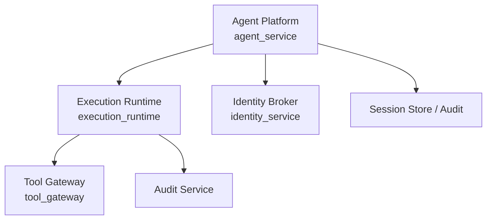
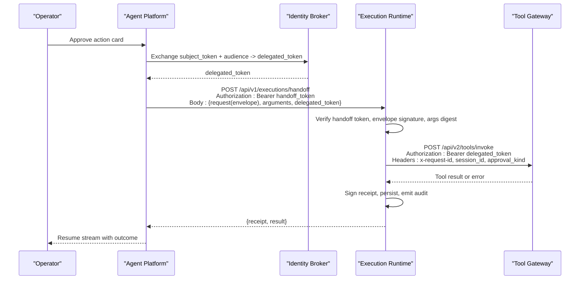
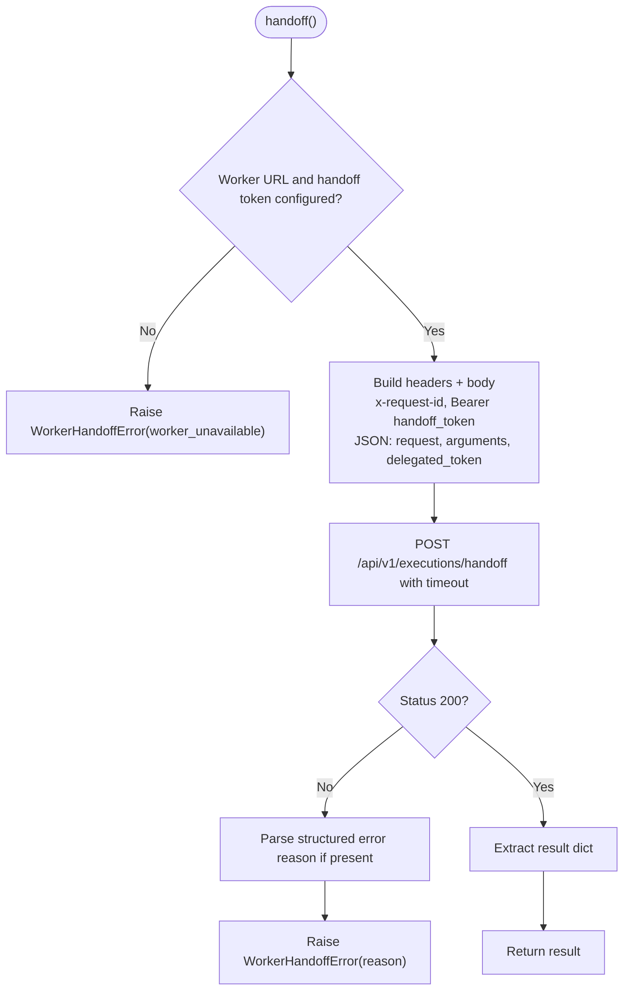
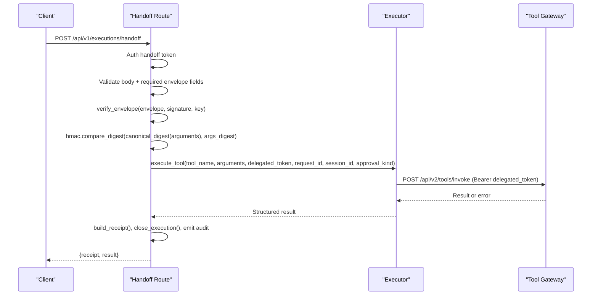
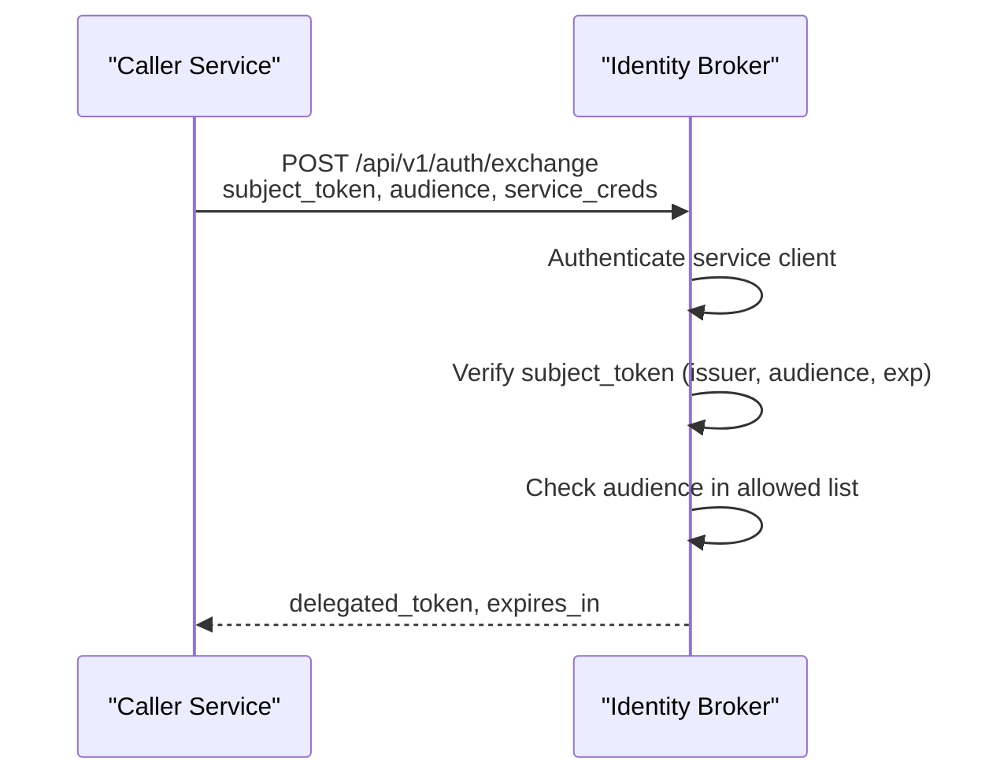
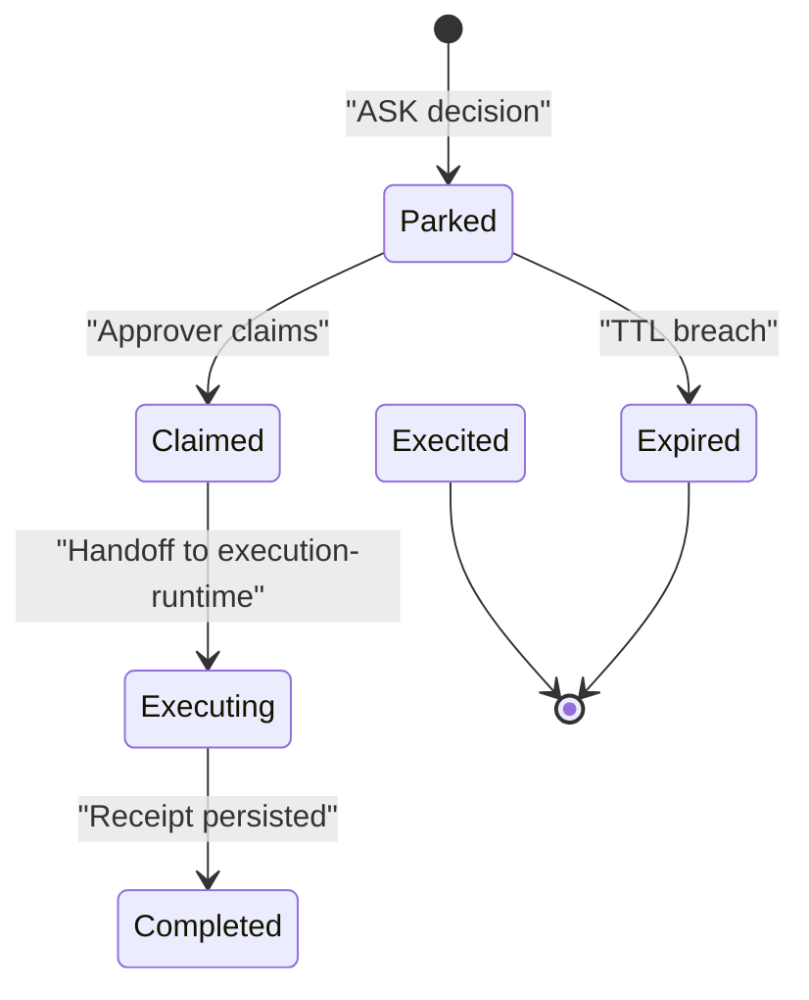
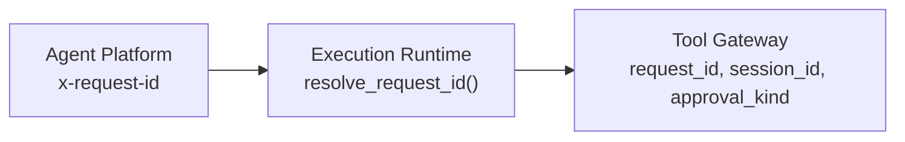
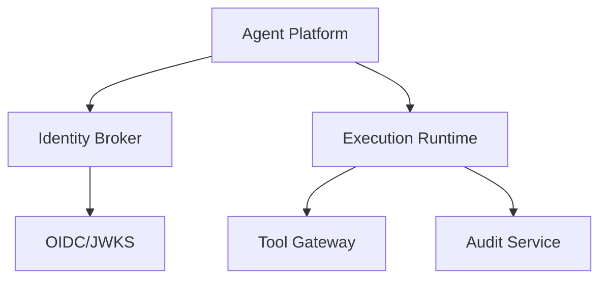

# Handoff Protocol and Request Flow

<cite>
**Referenced Files in This Document**
- [execution_worker_client.py](file://products/agent-platform/src/agent_service/services/execution_worker_client.py)
- [handoff.py](file://products/execution-runtime/src/execution_runtime/api/routes/handoff.py)
- [executor.py](file://products/execution-runtime/src/execution_runtime/services/executor.py)
- [exchange_service.py](file://products/identity-broker/src/identity_service/services/exchange_service.py)
- [hitl_confirmations.py](file://products/agent-platform/src/agent_service/services/hitl_confirmations.py)
- [execution_signing.py](file://products/agent-platform/src/agent_service/services/execution_signing.py)
- [request_context.py](file://products/audit-service/src/audit_service/core/request_context.py)
- [test_handoff.py](file://products/execution-runtime/tests/test_handoff.py)
- [SPEC-008 spec.md](file://docs/specs/SPEC-008-service-to-service-identity/spec.md)
- [SPEC-037 plan.md](file://docs/specs/SPEC-037-signed-execution-requests/plan.md)
- [SPEC-038 plan.md](file://docs/specs/SPEC-038-isolated-execution-worker/plan.md)
- [SPEC-054 action approval spec.md](file://docs/specs/SPEC-054-action-approval-and-change-request-card/spec.md)
- [approval-and-hitl guide](file://docs/guides/approval-and-hitl.md)
</cite>

## Table of Contents
1. Introduction
2. Project Structure
3. Core Components
4. Architecture Overview
5. Detailed Component Analysis
6. Dependency Analysis
7. Performance Considerations
8. Troubleshooting Guide
9. Conclusion
10. Appendices

## Introduction
This document explains the handoff protocol that transfers control from the agent platform to an isolated execution runtime for executing tool invocations after human-in-the-loop approval. It covers:
- The end-to-end request flow from parking an action card to bounded execution in the runtime.
- The handoff API endpoints, request/response schemas, and state transitions.
- Secure delegated token passing and re-authentication using the confirmer’s identity.
- Correlation across services via request IDs, session IDs, and approval provenance.
- Examples for different tool invocation types, error scenarios, and recovery procedures.
- Integration with the approval workflow system and audit trail maintenance.

## Project Structure
The handoff spans three primary components:
- Agent Platform (agent_service): builds signed execution envelopes, parks confirmation cards, and calls the execution runtime worker on approval.
- Execution Runtime (execution_runtime): authenticates the handoff, verifies the envelope, executes one tool call against the tool-gateway, signs a receipt, and emits audit events.
- Identity Broker (identity_service): issues short-lived delegated tokens bound to a requested audience, carrying the approver’s identity into downstream services.

**Diagram sources**
- [execution_worker_client.py:54-144](file://products/agent-platform/src/agent_service/services/execution_worker_client.py#L54-L144)
- [handoff.py:66-169](file://products/execution-runtime/src/execution_runtime/api/routes/handoff.py#L66-L169)
- [executor.py:23-121](file://products/execution-runtime/src/execution_runtime/services/executor.py#L23-L121)
- [exchange_service.py:148-194](file://products/identity-broker/src/identity_service/services/exchange_service.py#L148-L194)

**Section sources**
- [execution_worker_client.py:1-144](file://products/agent-platform/src/agent_service/services/execution_worker_client.py#L1-L144)
- [handoff.py:1-356](file://products/execution-runtime/src/execution_runtime/api/routes/handoff.py#L1-L356)
- [executor.py:1-152](file://products/execution-runtime/src/execution_runtime/services/executor.py#L1-L152)
- [exchange_service.py:1-195](file://products/identity-broker/src/identity_service/services/exchange_service.py#L1-L195)

## Core Components
- Signed execution envelope: built by the agent platform around approved tool calls; includes execution_id, confirm_id, call_id, tool_name, args_digest, optional session_id and approval_kind, and is HMAC-signed.
- Handoff client: agent platform posts the envelope, parked arguments, and delegated token to the execution runtime over a secure internal endpoint with a static handoff token.
- Handoff route: authenticates the caller, validates body shape, verifies envelope signature, re-verifies argument digest, enforces single-flight per execution_id, then executes exactly once.
- Executor: invokes the tool-gateway with the confirmer’s delegated token as bearer, forwards correlation fields (request_id, session_id, approval_kind), maps results to structured outcomes, and returns them to the handoff route.
- Receipt and audit: the runtime signs a receipt, persists it durably (first-write-wins), and emits completion or rejection audit events correlated to the original resume.

**Section sources**
- [execution_signing.py:36-75](file://products/agent-platform/src/agent_service/services/execution_signing.py#L36-L75)
- [execution_worker_client.py:54-144](file://products/agent-platform/src/agent_service/services/execution_worker_client.py#L54-L144)
- [handoff.py:66-169](file://products/execution-runtime/src/execution_runtime/api/routes/handoff.py#L66-L169)
- [executor.py:23-121](file://products/execution-runtime/src/execution_runtime/services/executor.py#L23-L121)

## Architecture Overview
The handoff protocol enforces fail-closed verification before any mutation occurs. The agent platform constructs a signed envelope and hands it off to the execution runtime only after approval. The runtime re-verifies everything, executes one tool call under the confirmer’s delegated identity, and produces a signed receipt.

**Diagram sources**
- [execution_worker_client.py:54-144](file://products/agent-platform/src/agent_service/services/execution_worker_client.py#L54-L144)
- [exchange_service.py:148-194](file://products/identity-broker/src/identity_service/services/exchange_service.py#L148-L194)
- [handoff.py:66-169](file://products/execution-runtime/src/execution_runtime/api/routes/handoff.py#L66-L169)
- [executor.py:23-121](file://products/execution-runtime/src/execution_runtime/services/executor.py#L23-L121)

## Detailed Component Analysis

### Handoff Client (Agent Platform)
- Posts to /api/v1/executions/handoff with Authorization Bearer handoff_token.
- Sends JSON body containing:
  - request: signed execution envelope
  - arguments: parked parameters
  - delegated_token: optional string forwarded from approval path
- Propagates x-request-id for correlation.
- Enforces bounded timeout and fail-closed errors:
  - WorkerHandoffError(reason, message) for transport/configuration failures and non-200 responses.
  - WorkerHandoffTimeout when the worker does not respond within budget.
- Never logs the handoff token or delegated token.

**Diagram sources**
- [execution_worker_client.py:54-144](file://products/agent-platform/src/agent_service/services/execution_worker_client.py#L54-L144)

**Section sources**
- [execution_worker_client.py:1-144](file://products/agent-platform/src/agent_service/services/execution_worker_client.py#L1-L144)

### Handoff Route (Execution Runtime)
- Endpoint: POST /api/v1/executions/handoff
- Authentication: constant-time comparison of presented Bearer token against configured handoff_token.
- Body validation: requires request (envelope), arguments (dict), optional delegated_token (string).
- Envelope verification:
  - Required fields: execution_id, confirm_id, call_id, tool_name, args_digest.
  - Signature verified against execution signing key.
- Argument integrity: canonical_digest(arguments) must match envelope.args_digest.
- Single-flight: concurrent duplicates for the same execution_id are deduplicated; replays reuse prior outcomes.
- Execution: delegates to executor.execute_tool with delegated_token as bearer to tool-gateway.
- Completion:
  - Signs receipt, persists with first-write-wins semantics.
  - Emits execution_completed or execution_rejected audit events.
  - Returns {"receipt": ..., "result": ...}.

**Diagram sources**
- [handoff.py:66-169](file://products/execution-runtime/src/execution_runtime/api/routes/handoff.py#L66-L169)
- [executor.py:23-121](file://products/execution-runtime/src/execution_runtime/services/executor.py#L23-L121)

**Section sources**
- [handoff.py:1-356](file://products/execution-runtime/src/execution_runtime/api/routes/handoff.py#L1-L356)
- [executor.py:1-152](file://products/execution-runtime/src/execution_runtime/services/executor.py#L1-L152)

### Delegated Token Exchange (Identity Broker)
- Endpoint: POST /api/v1/auth/exchange
- Caller authenticates as a registered service via:
  - Static HTTP Basic client credentials, or
  - Kubernetes projected workload token validated against cluster OIDC issuer.
- Verifies subject_token locally using broker’s own signing key and audience.
- Checks requested audience against client allow-list.
- Issues a short-lived delegated token with:
  - sub, username, roles copied verbatim from subject_token (never elevated).
  - act set to calling service identity.
  - aud set to requested audience.
  - iss set to platform issuer; iat/exp derived from TTL.

**Diagram sources**
- [exchange_service.py:148-194](file://products/identity-broker/src/identity_service/services/exchange_service.py#L148-L194)
- [SPEC-008 spec.md:41-53](file://docs/specs/SPEC-008-service-to-service-identity/spec.md#L41-L53)

**Section sources**
- [exchange_service.py:1-195](file://products/identity-broker/src/identity_service/services/exchange_service.py#L1-L195)
- [SPEC-008 spec.md:22-53](file://docs/specs/SPEC-008-service-to-service-identity/spec.md#L22-L53)

### Approval Workflow Integration and Provenance
- Parking: When the kernel parks a reply due to permission decisions, the agent platform registers a PendingConfirmation with tool calls, risk levels, gateway names, browser element hints, and optional flow context.
- Card rendering: For action-type approvals, a change_request projection is attached to each parked call for display; for flow-type approvals, a flow headline is shown instead.
- Resumption: On approval, the agent platform builds signed execution requests per parked call, including approval_kind carried through the envelope.
- Enforcement: The execution runtime forwards approval_kind to the tool-gateway so write paths can refuse stale flow authority when no flow is bound.

**Diagram sources**
- [hitl_confirmations.py:47-94](file://products/agent-platform/src/agent_service/services/hitl_confirmations.py#L47-L94)
- [handoff.py:203-263](file://products/execution-runtime/src/execution_runtime/api/routes/handoff.py#L203-L263)

**Section sources**
- [hitl_confirmations.py:1-595](file://products/agent-platform/src/agent_service/services/hitl_confirmations.py#L1-L595)
- [SPEC-054 action approval spec.md:334-345](file://docs/specs/SPEC-054-action-approval-and-change-request-card/spec.md#L334-L345)
- [approval-and-hitl guide:262-288](file://docs/guides/approval-and-hitl.md#L262-L288)

### Correlation Mechanisms
- Request ID: propagated via x-request-id from agent platform to execution runtime and tool-gateway; resolved consistently across services.
- Session ID: forwarded from the signed envelope to maintain stateful connector affinity across identity switches.
- Approval Kind: forwarded as untrusted provenance to gate write-path behavior without granting additional authority.

**Diagram sources**
- [request_context.py:8-19](file://products/audit-service/src/audit_service/core/request_context.py#L8-L19)
- [executor.py:53-78](file://products/execution-runtime/src/execution_runtime/services/executor.py#L53-L78)

**Section sources**
- [request_context.py:1-19](file://products/audit-service/src/audit_service/core/request_context.py#L1-L19)
- [executor.py:23-121](file://products/execution-runtime/src/execution_runtime/services/executor.py#L23-L121)

## Dependency Analysis
- Agent Platform depends on:
  - Identity Broker for delegated tokens.
  - Execution Runtime for bounded execution of approved actions.
  - Session store and audit systems for durability and observability.
- Execution Runtime depends on:
  - Tool Gateway for actual tool invocation.
  - Signing subsystem for receipts and envelope verification.
  - Audit emitter for completion/rejection events.
- Identity Broker depends on:
  - JWKS/OIDC discovery for workload identity validation.
  - Token issuance utilities for delegated tokens.

**Diagram sources**
- [execution_worker_client.py:54-144](file://products/agent-platform/src/agent_service/services/execution_worker_client.py#L54-L144)
- [exchange_service.py:65-120](file://products/identity-broker/src/identity_service/services/exchange_service.py#L65-L120)
- [executor.py:23-121](file://products/execution-runtime/src/execution_runtime/services/executor.py#L23-L121)

**Section sources**
- [execution_worker_client.py:1-144](file://products/agent-platform/src/agent_service/services/execution_worker_client.py#L1-L144)
- [exchange_service.py:1-195](file://products/identity-broker/src/identity_service/services/exchange_service.py#L1-L195)
- [executor.py:1-152](file://products/execution-runtime/src/execution_runtime/services/executor.py#L1-L152)

## Performance Considerations
- Bounded timeouts:
  - Agent platform handoff uses a configurable timeout; timeouts raise a distinct exception so resumed streams can surface structured timeout results.
  - Execution runtime tool invocation uses a separate gateway timeout; transport failures map to structured errors.
- Single-flight execution:
  - Deduplicates concurrent handoffs keyed by execution_id; replays reuse prior outcomes.
- Fail-closed posture:
  - Missing configuration or unreachable workers raise immediately; no in-process fallback.
- Minimal logging of secrets:
  - Handoff token and delegated token are never logged; transport errors log class names only.

[No sources needed since this section provides general guidance]

## Troubleshooting Guide
Common failure modes and how they surface:
- Missing or misconfigured worker URL/handoff token:
  - Agent platform raises WorkerHandoffError(reason=worker_unavailable) before any network call.
- Transport errors to execution runtime:
  - Agent platform raises WorkerHandoffError(reason=worker_unavailable); logs only exception class.
- Handoff timeout:
  - Agent platform raises WorkerHandoffTimeout; resumed stream surfaces structured timeout result.
- Unauthorized handoff token:
  - Execution runtime rejects with 401 and reason unauthorized; emits execution_rejected audit event.
- Invalid envelope signature or args digest mismatch:
  - Execution runtime rejects with 400 and reasons signature_invalid or args_digest_mismatch; emits execution_rejected audit event.
- No delegated token forwarded:
  - Executor returns structured error NO_CREDENTIAL; receipt status closed as failed.
- Tool gateway unreachable or non-JSON response:
  - Executor returns structured errors TRANSPORT_ERROR or BAD_GATEWAY_RESPONSE; receipt status closed as failed.

Recovery procedures:
- If the worker is temporarily unavailable, the agent platform can retry with backoff; the execution runtime’s single-flight ensures idempotent replay.
- For timeouts, the resumed stream records a timeout receipt; the worker may still complete in background, but first-write-wins preserves the timeout outcome.
- For authorization or signature failures, inspect the signed envelope and handoff token configuration; correct policy or signing keys before retry.

**Section sources**
- [execution_worker_client.py:36-144](file://products/agent-platform/src/agent_service/services/execution_worker_client.py#L36-L144)
- [handoff.py:66-169](file://products/execution-runtime/src/execution_runtime/api/routes/handoff.py#L66-L169)
- [executor.py:23-152](file://products/execution-runtime/src/execution_runtime/services/executor.py#L23-L152)
- [test_handoff.py:212-234](file://products/execution-runtime/tests/test_handoff.py#L212-L234)

## Conclusion
The handoff protocol provides a secure, auditable bridge between the agent platform and an isolated execution runtime for mutating tool invocations. It enforces fail-closed verification, bounded execution, and strict separation of concerns:
- The agent platform prepares signed envelopes and manages approval workflows.
- The execution runtime authenticates handoff, verifies integrity, executes exactly once, and signs receipts.
- The identity broker issues audience-bound delegated tokens that carry the confirmer’s identity downstream.
Correlation via request IDs, session IDs, and approval kind maintains context across boundaries while preserving security and auditability.

[No sources needed since this section summarizes without analyzing specific files]

## Appendices

### Handoff API Definitions

- Endpoint: POST /api/v1/executions/handoff
- Headers:
  - Authorization: Bearer <handoff_token>
  - x-request-id: optional correlation ID
- Request body:
  - request: object (signed execution envelope)
  - arguments: object (parked tool parameters)
  - delegated_token: string | null (confirmer’s delegated token)
- Success response:
  - { receipt: object, result: object }
- Error responses:
  - 400/401 with { request_id, error: { code, reason, message } }

**Section sources**
- [handoff.py:66-169](file://products/execution-runtime/src/execution_runtime/api/routes/handoff.py#L66-L169)
- [execution_worker_client.py:54-144](file://products/agent-platform/src/agent_service/services/execution_worker_client.py#L54-L144)

### Signed Execution Envelope Fields
- Required:
  - execution_id, confirm_id, call_id, tool_name, args_digest
- Optional:
  - session_id, approval_kind, decider_user_id, requested_at
- Signature:
  - HMAC-SHA256 over canonical JSON excluding signature field

**Section sources**
- [handoff.py:56-63](file://products/execution-runtime/src/execution_runtime/api/routes/handoff.py#L56-L63)
- [execution_signing.py:36-75](file://products/agent-platform/src/agent_service/services/execution_signing.py#L36-L75)
- [SPEC-037 plan.md:1-200](file://docs/specs/SPEC-037-signed-execution-requests/plan.md#L1-L200)

### Example Flows

- Browser write tool (e.g., web.click):
  - Operator approves action card; agent platform exchanges delegated token; posts handoff with signed envelope and arguments; execution runtime verifies and invokes tool-gateway; receipt signed and persisted; stream resumes with success or failure.
- K8s mutating tool (e.g., k8s.delete_pod):
  - Same flow; approval_kind is action; tool-gateway enforces policy and writes changes; receipt reflects succeeded/failed/timeout.
- Read-only tool:
  - Typically does not park; if it does, the flow mirrors above but without mutating side effects.

[No sources needed since this section describes conceptual flows grounded by referenced sections above]