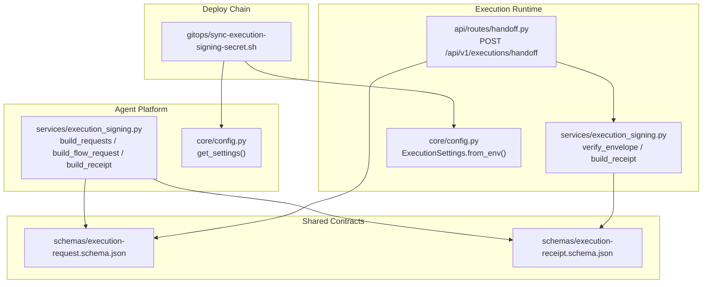
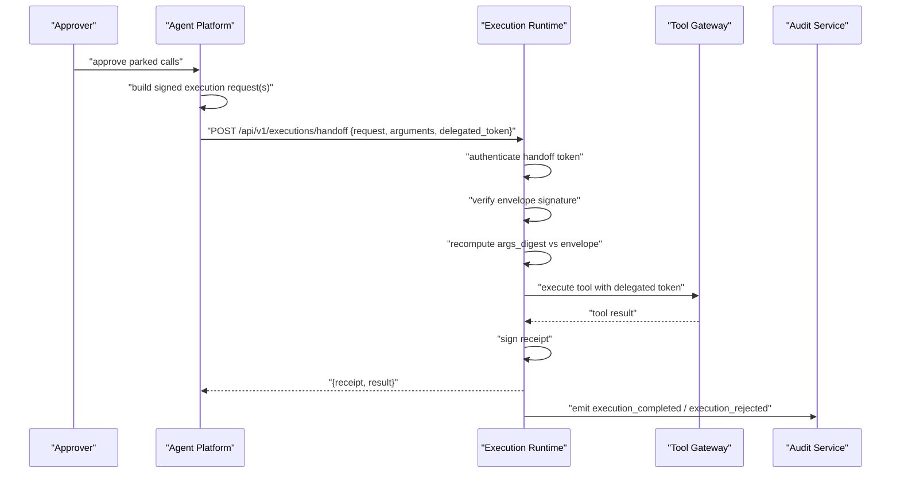
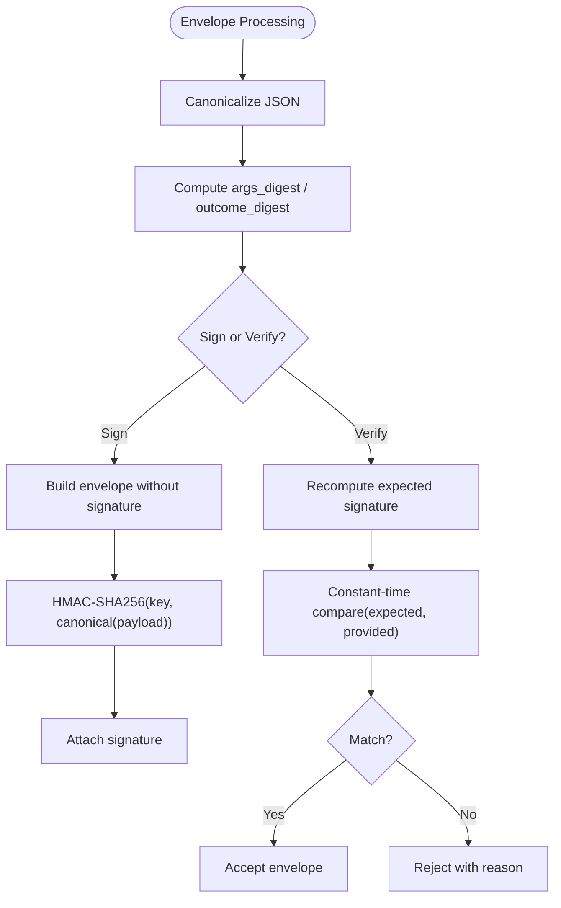
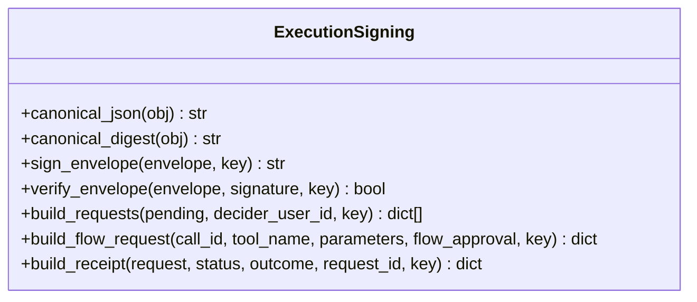
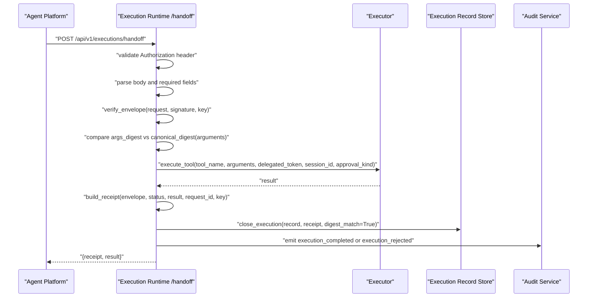
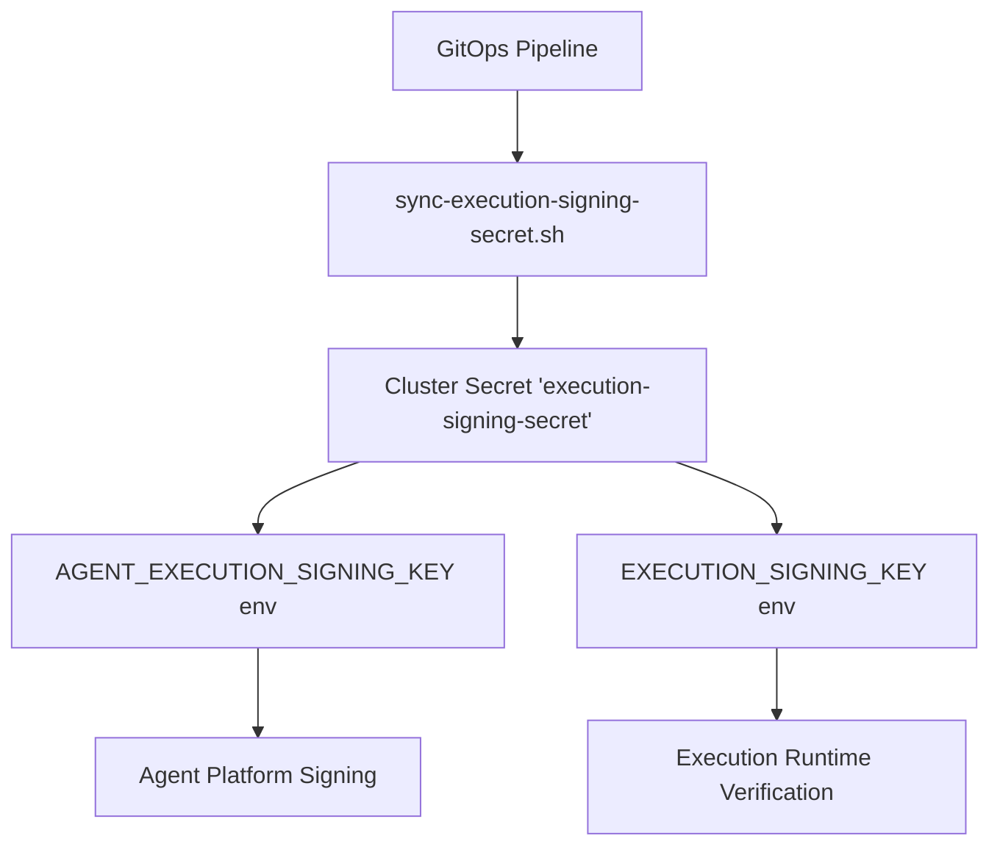
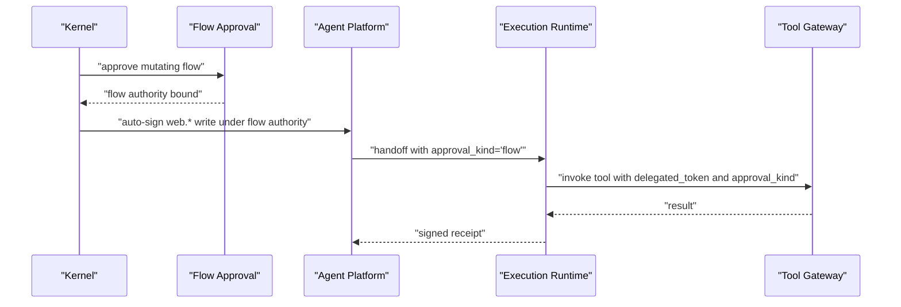
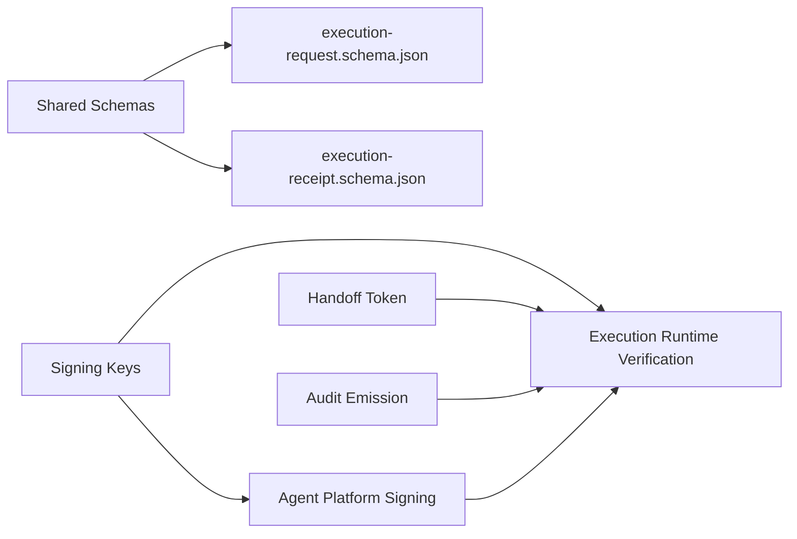

# Signing and Verification System

<cite>
**Referenced Files in This Document**
- [execution_signing.py](file://products/agent-platform/src/agent_service/services/execution_signing.py)
- [execution_signing.py](file://products/execution-runtime/src/execution_runtime/services/execution_signing.py)
- [handoff.py](file://products/execution-runtime/src/execution_runtime/api/routes/handoff.py)
- [execution-request.schema.json](file://shared/shared-contracts/schemas/execution-request.schema.json)
- [execution-receipt.schema.json](file://shared/shared-contracts/schemas/execution-receipt.schema.json)
- [sync-execution-signing-secret.sh](file://shared/platform-ops/gitops/sync-execution-signing-secret.sh)
- [config.py](file://products/agent-platform/src/agent_service/core/config.py)
- [config.py](file://products/execution-runtime/src/execution_runtime/core/config.py)
- [test_execution_signing.py](file://products/agent-platform/tests/test_execution_signing.py)
- [test_handoff.py](file://products/execution-runtime/tests/test_handoff.py)
- [SPEC-037 spec.md](file://docs/specs/SPEC-037-signed-execution-requests/spec.md)
- [SPEC-038 plan.md](file://docs/specs/SPEC-038-isolated-execution-worker/plan.md)
</cite>

## Table of Contents
1. Introduction
2. Project Structure
3. Core Components
4. Architecture Overview
5. Detailed Component Analysis
6. Dependency Analysis
7. Performance Considerations
8. Troubleshooting Guide
9. Conclusion

## Introduction
This document explains the signing and verification system that authenticates execution requests and maintains audit integrity across the execution runtime. It covers how execution envelopes are signed with HMAC-SHA256 to prove authenticity and integrity, how signatures are generated and verified, how keys are managed, and how the system integrates with delegation tokens and approval workflows. It also documents error handling patterns and compliance-oriented audit trails for tamper-evident execution records.

## Project Structure
The signing and verification system spans two product services and shared contracts:
- Agent platform signs approved execution requests and builds receipts.
- Execution runtime verifies incoming handoffs, executes tools, and signs receipts.
- Shared JSON schemas define the request and receipt envelope structures.
- GitOps scripts provision the shared signing key into the cluster.

**Diagram sources**
- [execution_signing.py:70-149](file://products/agent-platform/src/agent_service/services/execution_signing.py#L70-L149)
- [execution_signing.py:54-92](file://products/execution-runtime/src/execution_runtime/services/execution_signing.py#L54-L92)
- [handoff.py:66-169](file://products/execution-runtime/src/execution_runtime/api/routes/handoff.py#L66-L169)
- [execution-request.schema.json:1-71](file://shared/shared-contracts/schemas/execution-request.schema.json#L1-L71)
- [execution-receipt.schema.json:1-47](file://shared/shared-contracts/schemas/execution-receipt.schema.json#L1-L47)
- [sync-execution-signing-secret.sh:37-71](file://shared/platform-ops/gitops/sync-execution-signing-secret.sh#L37-L71)
- [config.py:8-11](file://products/agent-platform/src/agent_service/core/config.py#L8-L11)
- [config.py:20-84](file://products/execution-runtime/src/execution_runtime/core/config.py#L20-L84)

**Section sources**
- [execution_signing.py:70-149](file://products/agent-platform/src/agent_service/services/execution_signing.py#L70-L149)
- [execution_signing.py:54-92](file://products/execution-runtime/src/execution_runtime/services/execution_signing.py#L54-L92)
- [handoff.py:66-169](file://products/execution-runtime/src/execution_runtime/api/routes/handoff.py#L66-L169)
- [execution-request.schema.json:1-71](file://shared/shared-contracts/schemas/execution-request.schema.json#L1-L71)
- [execution-receipt.schema.json:1-47](file://shared/shared-contracts/schemas/execution-receipt.schema.json#L1-L47)
- [sync-execution-signing-secret.sh:37-71](file://shared/platform-ops/gitops/sync-execution-signing-secret.sh#L37-L71)
- [config.py:8-11](file://products/agent-platform/src/agent_service/core/config.py#L8-L11)
- [config.py:20-84](file://products/execution-runtime/src/execution_runtime/core/config.py#L20-L84)

## Core Components
- Canonicalization and digests: deterministic JSON serialization and SHA-256 hashing used by both sides to ensure stable payloads and digests.
- Envelope signing: HMAC-SHA256 over canonical JSON excluding the signature field.
- Request builders: create one signed execution request per parked tool call or flow-authorized write; stamp authority provenance inside the signature.
- Receipt builder: sign a receipt closing an execution request with outcome digest and timestamps.
- Handoff verification: authenticate internal caller, validate envelope shape, verify signature, recompute argument digest, execute once, and close the record.

Key behaviors:
- Missing signing keys fail closed; no unsigned execution is allowed.
- Argument mismatch at invocation boundary blocks execution and emits audit events.
- Provenance (approval_kind) is covered by the HMAC so it cannot be altered without invalidating the envelope.

**Section sources**
- [execution_signing.py:40-67](file://products/agent-platform/src/agent_service/services/execution_signing.py#L40-L67)
- [execution_signing.py:70-149](file://products/agent-platform/src/agent_service/services/execution_signing.py#L70-L149)
- [execution_signing.py:54-92](file://products/execution-runtime/src/execution_runtime/services/execution_signing.py#L54-L92)
- [handoff.py:66-169](file://products/execution-runtime/src/execution_runtime/api/routes/handoff.py#L66-L169)
- [SPEC-037 spec.md:45-139](file://docs/specs/SPEC-037-signed-execution-requests/spec.md#L45-L139)

## Architecture Overview
The signing and verification system enforces a strict chain from approval to execution:
- Agent platform constructs signed execution requests when approvals resume.
- Execution runtime authenticates the handoff, verifies the envelope signature, re-verifies arguments, executes the tool exactly once, and signs a receipt.
- Shared schemas guarantee contract stability between services.
- Deploy scripts provision the shared signing key consistently across environments.

**Diagram sources**
- [execution_signing.py:70-149](file://products/agent-platform/src/agent_service/services/execution_signing.py#L70-L149)
- [handoff.py:66-169](file://products/execution-runtime/src/execution_runtime/api/routes/handoff.py#L66-L169)
- [execution-signing.py:54-92](file://products/execution-runtime/src/execution_runtime/services/execution_signing.py#L54-L92)
- [SPEC-038 plan.md:40-66](file://docs/specs/SPEC-038-isolated-execution-worker/plan.md#L40-L66)

## Detailed Component Analysis

### Envelope Signing and Verification
- Canonical JSON: sorted keys, compact separators, ensuring deterministic serialization.
- Digest: SHA-256 hex of canonical JSON for arguments and outcomes.
- Signature: HMAC-SHA256 hex over canonical envelope excluding the signature field.
- Verification: constant-time comparison to prevent timing attacks.

**Diagram sources**
- [execution_signing.py:40-67](file://products/agent-platform/src/agent_service/services/execution_signing.py#L40-L67)
- [execution_signing.py:54-92](file://products/execution-runtime/src/execution_runtime/services/execution_signing.py#L54-L92)

**Section sources**
- [execution_signing.py:40-67](file://products/agent-platform/src/agent_service/services/execution_signing.py#L40-L67)
- [execution_signing.py:54-92](file://products/execution-runtime/src/execution_runtime/services/execution_signing.py#L54-L92)

### Execution Request Builder (Agent Platform)
- Creates one signed execution request per approved parked tool call.
- Binds the envelope to the parked arguments via args_digest.
- Stamps approval_kind inside the signature to bind authority provenance.
- Emits execution_requested audit events and persists execution records.

**Diagram sources**
- [execution_signing.py:70-149](file://products/agent-platform/src/agent_service/services/execution_signing.py#L70-L149)
- [execution_signing.py:152-175](file://products/agent-platform/src/agent_service/services/execution_signing.py#L152-L175)

**Section sources**
- [execution_signing.py:70-149](file://products/agent-platform/src/agent_service/services/execution_signing.py#L70-L149)
- [execution_signing.py:152-175](file://products/agent-platform/src/agent_service/services/execution_signing.py#L152-L175)
- [test_execution_signing.py:1-46](file://products/agent-platform/tests/test_execution_signing.py#L1-L46)

### Handoff Verification and Execution Closure (Execution Runtime)
- Authenticates the internal caller using a static handoff token.
- Validates envelope shape and required fields.
- Verifies envelope signature using the shared signing key.
- Re-verifies arguments by comparing canonical digest to envelope’s args_digest.
- Executes the tool exactly once (single-flight on execution_id).
- Signs a receipt and closes the execution record; emits completion/rejection audits.

**Diagram sources**
- [handoff.py:66-169](file://products/execution-runtime/src/execution_runtime/api/routes/handoff.py#L66-L169)
- [handoff.py:203-263](file://products/execution-runtime/src/execution_runtime/api/routes/handoff.py#L203-L263)
- [execution_signing.py:54-92](file://products/execution-runtime/src/execution_runtime/services/execution_signing.py#L54-L92)

**Section sources**
- [handoff.py:66-169](file://products/execution-runtime/src/execution_runtime/api/routes/handoff.py#L66-L169)
- [handoff.py:203-263](file://products/execution-runtime/src/execution_runtime/api/routes/handoff.py#L203-L263)
- [SPEC-038 plan.md:40-66](file://docs/specs/SPEC-038-isolated-execution-worker/plan.md#L40-L66)

### Key Management and Provisioning
- The signing key is provisioned via a GitOps script that creates or reuses a cluster secret.
- Agent platform reads the key from environment configuration.
- Execution runtime reads its own EXECUTION_SIGNING_KEY from environment configuration.
- Missing keys cause fail-closed behavior; no unsigned execution is permitted.

**Diagram sources**
- [sync-execution-signing-secret.sh:37-71](file://shared/platform-ops/gitops/sync-execution-signing-secret.sh#L37-L71)
- [config.py:8-11](file://products/agent-platform/src/agent_service/core/config.py#L8-L11)
- [config.py:20-84](file://products/execution-runtime/src/execution_runtime/core/config.py#L20-L84)

**Section sources**
- [sync-execution-signing-secret.sh:37-71](file://shared/platform-ops/gitops/sync-execution-signing-secret.sh#L37-L71)
- [config.py:8-11](file://products/agent-platform/src/agent_service/core/config.py#L8-L11)
- [config.py:20-84](file://products/execution-runtime/src/execution_runtime/core/config.py#L20-L84)

### Approval Workflows and Delegation Tokens
- Signed envelopes carry approval_kind to distinguish per-action approvals from flow-authorized writes.
- The worker forwards approval_kind to the gateway so downstream policies can enforce additional constraints.
- Delegated tokens accompany handoff payloads to authorize tool invocations under the confirmer’s identity.

**Diagram sources**
- [execution_signing.py:108-149](file://products/agent-platform/src/agent_service/services/execution_signing.py#L108-L149)
- [handoff.py:203-231](file://products/execution-runtime/src/execution_runtime/api/routes/handoff.py#L203-L231)

**Section sources**
- [execution_signing.py:108-149](file://products/agent-platform/src/agent_service/services/execution_signing.py#L108-L149)
- [handoff.py:203-231](file://products/execution-runtime/src/execution_runtime/api/routes/handoff.py#L203-L231)

### Examples and Error Handling Patterns
- Successful flow: approved parking → signed request → verified handoff → executed tool → signed receipt → audit completion.
- Forgery detection: altering approval_kind without re-signing causes signature_invalid rejection before execution.
- Argument tampering: modified arguments cause args_digest_mismatch rejection before execution.
- Missing key: missing signing key fails closed; resumed mutations are rejected and audited.

Representative references:
- Forged provenance rejection test path: [test_handoff.py:222-234](file://products/execution-runtime/tests/test_handoff.py#L222-L234)
- Args digest mismatch audit path: [test_gateway_tools.py:623-632](file://products/agent-platform/tests/test_gateway_tools.py#L623-L632)
- Missing key fail-closed behavior: [SPEC-037 spec.md:69-81](file://docs/specs/SPEC-037-signed-execution-requests/spec.md#L69-L81)

**Section sources**
- [test_handoff.py:222-234](file://products/execution-runtime/tests/test_handoff.py#L222-L234)
- [test_gateway_tools.py:623-632](file://products/agent-platform/tests/test_gateway_tools.py#L623-L632)
- [SPEC-037 spec.md:69-81](file://docs/specs/SPEC-037-signed-execution-requests/spec.md#L69-L81)

## Dependency Analysis
The signing and verification system depends on:
- Shared schemas for request and receipt structure.
- Environment-provisioned signing keys for agent platform and execution runtime.
- Internal handoff authentication via static token.
- Audit emission for tamper-evident trails.

**Diagram sources**
- [execution-request.schema.json:1-71](file://shared/shared-contracts/schemas/execution-request.schema.json#L1-L71)
- [execution-receipt.schema.json:1-47](file://shared/shared-contracts/schemas/execution-receipt.schema.json#L1-L47)
- [config.py:20-84](file://products/execution-runtime/src/execution_runtime/core/config.py#L20-L84)
- [handoff.py:66-169](file://products/execution-runtime/src/execution_runtime/api/routes/handoff.py#L66-L169)

**Section sources**
- [execution-request.schema.json:1-71](file://shared/shared-contracts/schemas/execution-request.schema.json#L1-L71)
- [execution-receipt.schema.json:1-47](file://shared/shared-contracts/schemas/execution-receipt.schema.json#L1-L47)
- [config.py:20-84](file://products/execution-runtime/src/execution_runtime/core/config.py#L20-L84)
- [handoff.py:66-169](file://products/execution-runtime/src/execution_runtime/api/routes/handoff.py#L66-L169)

## Performance Considerations
- Constant-time comparisons for tokens and signatures reduce timing side-channel risks.
- Single-flight execution keyed by execution_id prevents duplicate executions and replays reuse existing results.
- Outcome digests avoid storing large results while preserving integrity.
- Minimal payload sizes (digests instead of full bodies) reduce network overhead.

[No sources needed since this section provides general guidance]

## Troubleshooting Guide
Common failure modes and their indicators:
- Unauthorized handoff: missing or invalid Authorization header; returns 401 unauthorized.
- Bad request: malformed body or missing required envelope fields; returns 400 bad_request.
- Signature invalid: missing key, missing signature, non-ASCII signature, or HMAC mismatch; returns 400 signature_invalid.
- Arguments mismatch: recomputed args_digest differs from envelope; returns 400 args_digest_mismatch.
- Late completion: receipt already written; logged and counted without overwriting.

Operational checks:
- Ensure sync-execution-signing-secret.sh provisions the correct secret and restarts dependent services.
- Validate environment variables for signing keys and handoff tokens.
- Inspect audit events for execution_rejected and execution_completed to correlate failures.

**Section sources**
- [handoff.py:66-169](file://products/execution-runtime/src/execution_runtime/api/routes/handoff.py#L66-L169)
- [handoff.py:306-356](file://products/execution-runtime/src/execution_runtime/api/routes/handoff.py#L306-L356)
- [sync-execution-signing-secret.sh:37-71](file://shared/platform-ops/gitops/sync-execution-signing-secret.sh#L37-L71)

## Conclusion
The signing and verification system establishes a tamper-evident chain from approval to execution. By signing execution envelopes with HMAC-SHA256, verifying signatures and argument digests at the invocation boundary, and persisting signed receipts, the platform ensures that only authorized and unmodified actions execute. Key provisioning is centralized and fail-closed, and audit emissions provide compliance-grade traceability. The design cleanly separates signing responsibilities between agent platform and execution runtime while maintaining a shared contract through schemas and cross-verification tests.