# Security and Access Control

<cite>
**Referenced Files in This Document**
- [gateway_service.py](file://products/tool-gateway/src/tool_gateway/services/gateway_service.py)
- [policy_engine.py](file://products/tool-gateway/src/tool_gateway/services/policy_engine.py)
- [base.py](file://products/tool-gateway/src/tool_gateway/tools/base.py)
- [registry.py](file://products/tool-gateway/src/tool_gateway/tools/registry.py)
- [redaction.py](file://products/tool-gateway/src/tool_gateway/tools/redaction.py)
- [secret_params.py](file://products/agent-platform/src/agent_service/services/secret_params.py)
- [prose_redaction.py](file://products/agent-platform/src/agent_service/services/prose_redaction.py)
- [browser_connector.py](file://products/tool-gateway/src/tool_gateway/tools/browser_connector.py)
- [delegation_client.py](file://products/platform-gateway/src/platform_gateway/services/delegation_client.py)
- [test_policy_engine.py](file://products/tool-gateway/tests/test_policy_engine.py)
- [test_redaction.py](file://products/tool-gateway/tests/test_redaction.py)
- [test_secret_params.py](file://products/agent-platform/tests/test_secret_params.py)
- [test_tool_registry.py](file://products/tool-gateway/tests/test_tool_registry.py)
- [adding-a-tool.md](file://docs/guides/adding-a-tool.md)
- [authorization-matrix.md](file://docs/agentic-aiops-platform/authorization-matrix.md)
- [part-2-reference-architecture.md](file://docs/agentic-aiops-platform/part-2-reference-architecture.md)
- [SPEC-062 spec.md](file://docs/specs/SPEC-062-secure-password-generation-and-delivery/spec.md)
- [ADR-0012](file://docs/adr/0012-one-time-secret-delivery-handoff.md)
- [policy-default.yaml](file://shared/shared-contracts/policies/policy-default.yaml)
</cite>

## Update Summary
**Changes Made**
- Added new section on CSPRNG-based password generation capabilities from SPEC-062
- Updated credential management section to include one-time secret delivery handoff mechanism
- Enhanced policy engine integration documentation with new `secrets:deliver` action
- Added new diagram showing the redemption-on-click delivery flow
- Updated configuration guidance to include new environment variables for secret delivery
- Expanded audit trail documentation to cover `secret_delivered` events

## Table of Contents
1. Introduction
2. Project Structure
3. Core Components
4. Architecture Overview
5. Detailed Component Analysis
6. Dependency Analysis
7. Performance Considerations
8. Troubleshooting Guide
9. Conclusion
10. Appendices

## Introduction
This document explains the security model governing tool execution in the Luban AIOPS platform. It covers:
- The three-tier risk classification system (read, write, admin) and how it controls invocation permissions.
- The policy engine integration that evaluates authorization decisions before tool execution.
- Credential management and secret handling for external system authentication.
- **New**: One-time secret delivery handoff mechanism and CSPRNG-based password generation capabilities from SPEC-062.
- Output redaction to prevent sensitive data leakage in tool responses.
- Audit trail generation for all tool invocations, including successful and denied requests.
- Separation between read-only and mutating tools and their respective security models.
- Guidance on configuring tool permissions and implementing custom authorization rules.

## Project Structure
The security model spans several components across the platform:
- Tool Gateway enforces identity, policy, risk-tier gating, output redaction, and audit emission.
- Policy Engine loads and evaluates a YAML-based policy bundle with deny-by-default semantics.
- Tool Registry validates tool definitions and dispatches invocations safely.
- Agent Platform provides credential parameter masking, evidence projection masking, and prose redaction for chat transcripts.
- Platform Gateway handles service-to-service token delegation for internal calls.
- **New**: Secret delivery buffer with pluggable backends (in-memory/Redis) for one-time secret handoff.

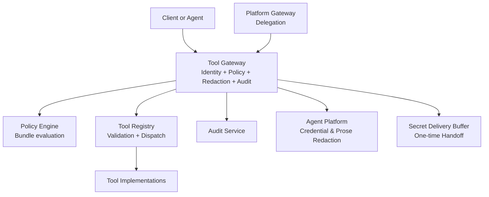

**Diagram sources**
- [gateway_service.py:158-376](file://products/tool-gateway/src/tool_gateway/services/gateway_service.py#L158-L376)
- [policy_engine.py:299-355](file://products/tool-gateway/src/tool_gateway/services/policy_engine.py#L299-L355)
- [registry.py:18-89](file://products/tool-gateway/src/tool_gateway/tools/registry.py#L18-L89)
- [redaction.py:126-151](file://products/tool-gateway/src/tool_gateway/tools/redaction.py#L126-L151)
- [secret_params.py:186-206](file://products/agent-platform/src/agent_service/services/secret_params.py#L186-L206)
- [delegation_client.py:81-104](file://products/platform-gateway/src/platform_gateway/services/delegation_client.py#L81-L104)

**Section sources**
- [part-2-reference-architecture.md:518-606](file://docs/agentic-aiops-platform/part-2-reference-architecture.md#L518-L606)

## Core Components
- Risk tiers: Tools declare a risk_level from the validated set {read, write, admin}. Read tools require only tools:invoke; write/admin tools additionally require tools:mutate at the gateway and are subject to stricter controls.
- Policy engine: Loads a YAML bundle, matches roles and actions, and returns allow/deny/require_approval. Deny-by-default applies when no rule matches.
- Tool registry: Validates risk_level values and gates registration of mutating tools unless explicitly allowed by configuration.
- Redaction: Applies pattern-based and key-based masking to tool results before response and audit emission, with fail-closed overflow protection.
- Credential handling: Parameter masking, evidence masking, and prose masking ensure secrets do not leak into approvals, transcripts, or stored traces.
- Delegation: Internal services exchange tokens via the identity broker using workload or static credentials.
- **New**: Secret delivery: One-time, owner-scoped, server-mediated handoff with redemption-on-click mechanism and pluggable backends.

**Section sources**
- [base.py:9-12](file://products/tool-gateway/src/tool_gateway/tools/base.py#L9-L12)
- [policy_engine.py:32-52](file://products/tool-gateway/src/tool_gateway/services/policy_engine.py#L32-L52)
- [registry.py:18-49](file://products/tool-gateway/src/tool_gateway/tools/registry.py#L18-L49)
- [redaction.py:1-14](file://products/tool-gateway/src/tool_gateway/tools/redaction.py#L1-L14)
- [secret_params.py:1-35](file://products/agent-platform/src/agent_service/services/secret_params.py#L1-L35)
- [delegation_client.py:81-104](file://products/platform-gateway/src/platform_gateway/services/delegation_client.py#L81-L104)

## Architecture Overview
The tool execution path enforces layered security:
1. Identity resolution via JWT verification or synthetic dev identity.
2. Policy evaluation for tools:invoke and, for non-read tools, tools:mutate.
3. Registry dispatch to the target tool implementation.
4. Output redaction with overflow protection.
5. Structured logging and durable audit emission.
6. **New**: Optional one-time secret delivery through redemption-on-click mechanism.

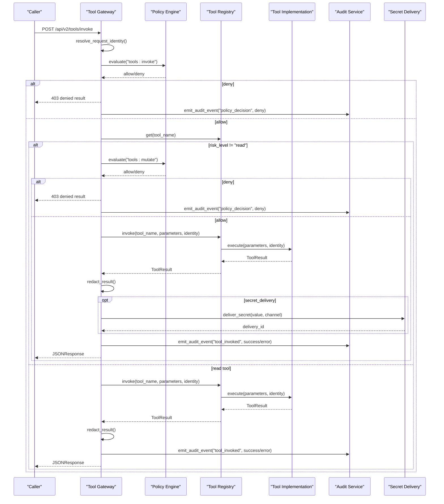

**Diagram sources**
- [gateway_service.py:158-376](file://products/tool-gateway/src/tool_gateway/services/gateway_service.py#L158-L376)
- [policy_engine.py:299-355](file://products/tool-gateway/src/tool_gateway/services/policy_engine.py#L299-L355)
- [registry.py:65-89](file://products/tool-gateway/src/tool_gateway/tools/registry.py#L65-L89)
- [redaction.py:126-151](file://products/tool-gateway/src/tool_gateway/tools/redaction.py#L126-L151)

## Detailed Component Analysis

### Three-Tier Risk Classification and Permission Model
- Valid risk levels: read, write, admin.
- Read tools: require tools:invoke only.
- Write/admin tools: require tools:mutate in addition to tools:invoke; they also trigger approval card behavior and are gated by configuration.
- Authorization matrix guidance recommends broad read access for authenticated users and narrower rights for actions, with stronger approval boundaries in production.

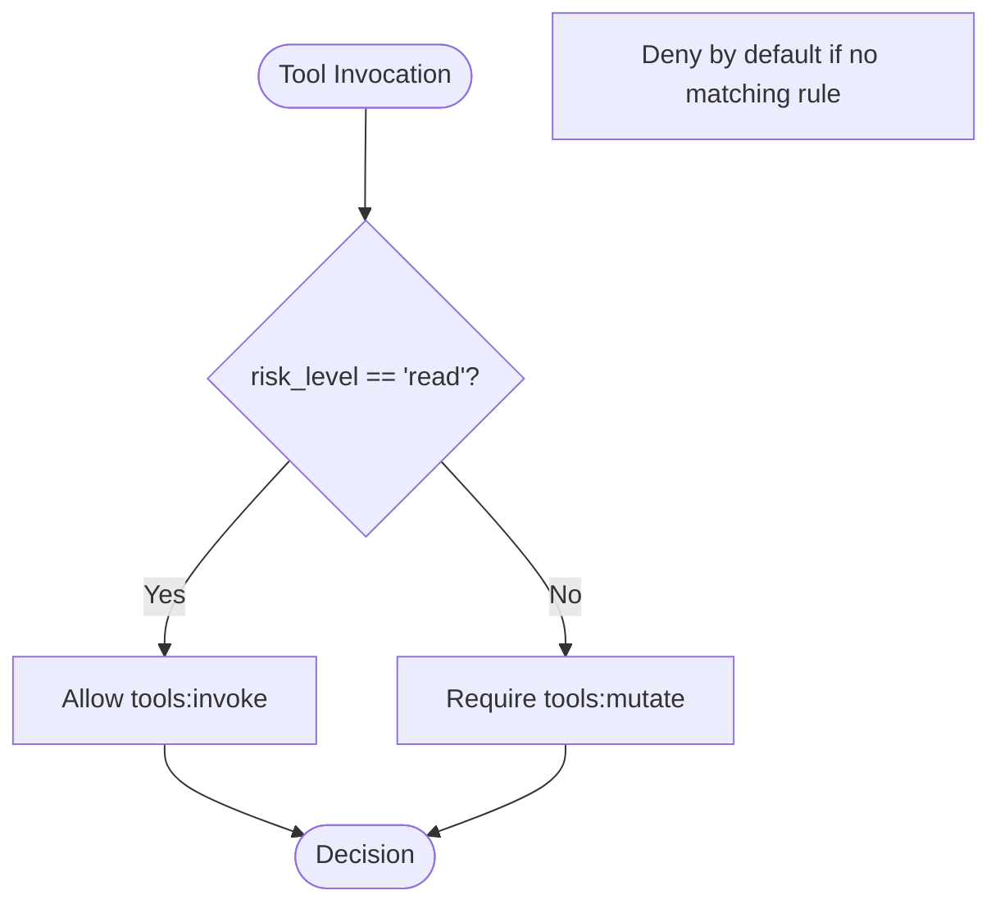

**Diagram sources**
- [base.py:9-12](file://products/tool-gateway/src/tool_gateway/tools/base.py#L9-L12)
- [gateway_service.py:250-291](file://products/tool-gateway/src/tool_gateway/services/gateway_service.py#L250-L291)
- [adding-a-tool.md:127-134](file://docs/guides/adding-a-tool.md#L127-L134)
- [authorization-matrix.md:517-528](file://docs/agentic-aiops-platform/authorization-matrix.md#L517-L528)

**Section sources**
- [base.py:9-12](file://products/tool-gateway/src/tool_gateway/tools/base.py#L9-L12)
- [gateway_service.py:250-291](file://products/tool-gateway/src/tool_gateway/services/gateway_service.py#L250-L291)
- [adding-a-tool.md:127-134](file://docs/guides/adding-a-tool.md#L127-L134)
- [authorization-matrix.md:517-528](file://docs/agentic-aiops-platform/authorization-matrix.md#L517-L528)

### Policy Engine Integration
- Actions: tools:list, tools:invoke, tools:mutate, **new**: secrets:deliver.
- Evaluation order: explicit deny overrides require_approval and allow; require_approval overrides allow; higher priority wins within an outcome class; disabled rules ignored.
- Bundles: loaded from configured path or packaged default; content fingerprint exposed for readiness checks.
- Tests confirm observer roles can list and invoke read-only tools and unknown actions are denied by default.
- **New**: The `secrets:deliver` action is required for email delivery channels and follows the same tier-based authorization model.

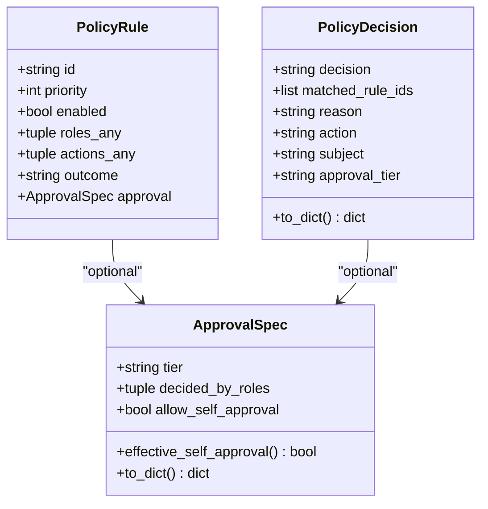

**Diagram sources**
- [policy_engine.py:66-133](file://products/tool-gateway/src/tool_gateway/services/policy_engine.py#L66-L133)

**Section sources**
- [policy_engine.py:32-52](file://products/tool-gateway/src/tool_gateway/services/policy_engine.py#L32-L52)
- [policy_engine.py:254-287](file://products/tool-gateway/src/tool_gateway/services/policy_engine.py#L254-L287)
- [policy_engine.py:299-355](file://products/tool-gateway/src/tool_gateway/services/policy_engine.py#L299-L355)
- [test_policy_engine.py:43-69](file://products/tool-gateway/tests/test_policy_engine.py#L43-L69)

### Credential Management and Secret Handling
- Change-request and trace projections mask secrets using a fail-closed posture: values mask unless positively listed as known-safe.
- Evidence frames preserve structure while removing secret values; URLs have query parameters masked.
- Authoring traces replace credential values with placeholders to enforce replay-time parameterization.
- Browser connector uses credential sets and field validation; missing sets return generic errors to avoid enumeration.
- Platform gateway exchanges delegated tokens using either projected workload tokens or static client credentials.
- **New**: CSPRNG-based password generation using Python's `secrets` module, never model-invented randomness.
- **New**: One-time secret delivery handoff with redemption-on-click mechanism - generated values never enter human-readable projections.

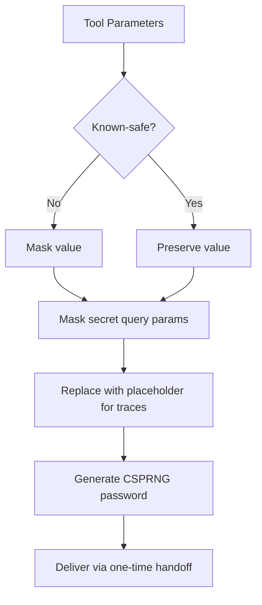

**Diagram sources**
- [secret_params.py:186-206](file://products/agent-platform/src/agent_service/services/secret_params.py#L186-L206)
- [secret_params.py:214-260](file://products/agent-platform/src/agent_service/services/secret_params.py#L214-L260)
- [secret_params.py:332-368](file://products/agent-platform/src/agent_service/services/secret_params.py#L332-L368)
- [secret_params.py:400-423](file://products/agent-platform/src/agent_service/services/secret_params.py#L400-L423)
- [browser_connector.py:1323-1357](file://products/tool-gateway/src/tool_gateway/tools/browser_connector.py#L1323-L1357)
- [delegation_client.py:81-104](file://products/platform-gateway/src/platform_gateway/services/delegation_client.py#L81-L104)

**Section sources**
- [secret_params.py:1-35](file://products/agent-platform/src/agent_service/services/secret_params.py#L1-L35)
- [secret_params.py:186-206](file://products/agent-platform/src/agent_service/services/secret_params.py#L186-L206)
- [secret_params.py:214-260](file://products/agent-platform/src/agent_service/services/secret_params.py#L214-L260)
- [secret_params.py:332-368](file://products/agent-platform/src/agent_service/services/secret_params.py#L332-L368)
- [secret_params.py:400-423](file://products/agent-platform/src/agent_service/services/secret_params.py#L400-L423)
- [browser_connector.py:1323-1357](file://products/tool-gateway/src/tool_gateway/tools/browser_connector.py#L1323-L1357)
- [delegation_client.py:81-104](file://products/platform-gateway/src/platform_gateway/services/delegation_client.py#L81-L104)

### One-Time Secret Delivery Handoff
**New**: The platform now supports secure delivery of generated secrets through a redemption-on-click mechanism that ensures secrets never enter human-readable projections.

- **Generation**: CSPRNG-based password generation using Python's `secrets` module, bound to centralized policy enforcement.
- **Delivery**: Server-mediated handoff where generated values are stashed in ephemeral, single-use, TTL-bounded, owner-scoped buffers.
- **Redemption**: Portal renders Copy password button bound to opaque `delivery_id`; clicking performs authenticated, single-use redemption.
- **Backends**: Pluggable Protocol with in-memory backend (default) and Redis backend (for multi-replica deployments).
- **Channels**: Extensible interface supporting portal-copy (primary) and email (gated outbound) channels.
- **Security**: Generated values ride no projection - structural guarantee rather than rendering convention.

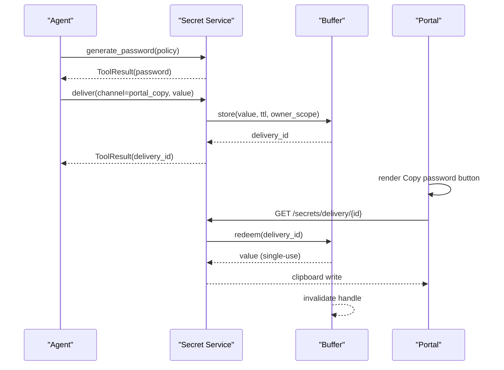

**Diagram sources**
- [SPEC-062 spec.md:171-223](file://docs/specs/SPEC-062-secure-password-generation-and-delivery/spec.md#L171-L223)
- [ADR-0012:45-69](file://docs/adr/0012-one-time-secret-delivery-handoff.md#L45-L69)

**Section sources**
- [SPEC-062 spec.md:90-121](file://docs/specs/SPEC-062-secure-password-generation-and-delivery/spec.md#L90-L121)
- [SPEC-062 spec.md:171-223](file://docs/specs/SPEC-062-secure-password-generation-and-delivery/spec.md#L171-L223)
- [SPEC-062 spec.md:224-279](file://docs/specs/SPEC-062-secure-password-generation-and-delivery/spec.md#L224-L279)
- [ADR-0012:45-69](file://docs/adr/0012-one-time-secret-delivery-handoff.md#L45-L69)

### Output Redaction System
- Two-layer redaction:
  - Value patterns: PEM private keys, JWTs, Bearer/Basic headers, AWS access key IDs.
  - Explicit key list: exact, case-insensitive match on sensitive string fields (password, secret, token, etc.).
- Overflow protection: If too much of the payload would be redacted, the response is withheld with a REDACTION_OVERFLOW error.
- Tests verify clean outputs pass through unchanged and overflow is fail-closed.
- **New**: Generated passwords are automatically added to the secret vocabulary for comprehensive masking across all surfaces.

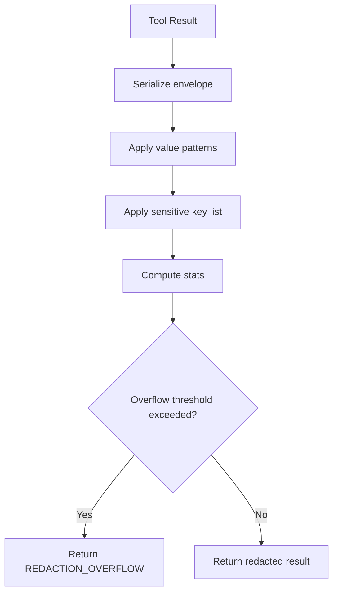

**Diagram sources**
- [redaction.py:1-14](file://products/tool-gateway/src/tool_gateway/tools/redaction.py#L1-L14)
- [redaction.py:26-57](file://products/tool-gateway/src/tool_gateway/tools/redaction.py#L26-L57)
- [redaction.py:60-73](file://products/tool-gateway/src/tool_gateway/tools/redaction.py#L60-L73)
- [redaction.py:87-127](file://products/tool-gateway/src/tool_gateway/tools/redaction.py#L87-L127)
- [redaction.py:126-151](file://products/tool-gateway/src/tool_gateway/tools/redaction.py#L126-L151)
- [test_redaction.py:102-126](file://products/tool-gateway/tests/test_redaction.py#L102-L126)
- [test_redaction.py:228-247](file://products/tool-gateway/tests/test_redaction.py#L228-L247)

**Section sources**
- [redaction.py:1-14](file://products/tool-gateway/src/tool_gateway/tools/redaction.py#L1-L14)
- [redaction.py:26-57](file://products/tool-gateway/src/tool_gateway/tools/redaction.py#L26-L57)
- [redaction.py:60-73](file://products/tool-gateway/src/tool_gateway/tools/redaction.py#L60-L73)
- [redaction.py:87-127](file://products/tool-gateway/src/tool_gateway/tools/redaction.py#L87-L127)
- [redaction.py:126-151](file://products/tool-gateway/src/tool_gateway/tools/redaction.py#L126-L151)
- [test_redaction.py:102-126](file://products/tool-gateway/tests/test_redaction.py#L102-L126)
- [test_redaction.py:228-247](file://products/tool-gateway/tests/test_redaction.py#L228-L247)

### Audit Trail Generation
- Every tool invocation emits both local log events and durable audit events.
- Events include request correlation, tool name, status, duration, risk level, identity context, and redacted span counts.
- Denied policy decisions emit policy_decision events with reasons and matched rule IDs.
- Audit service supports summary aggregation and retention policies.
- **New**: `secret_delivered` audit events capture delivery attempts without exposing the actual secret values.

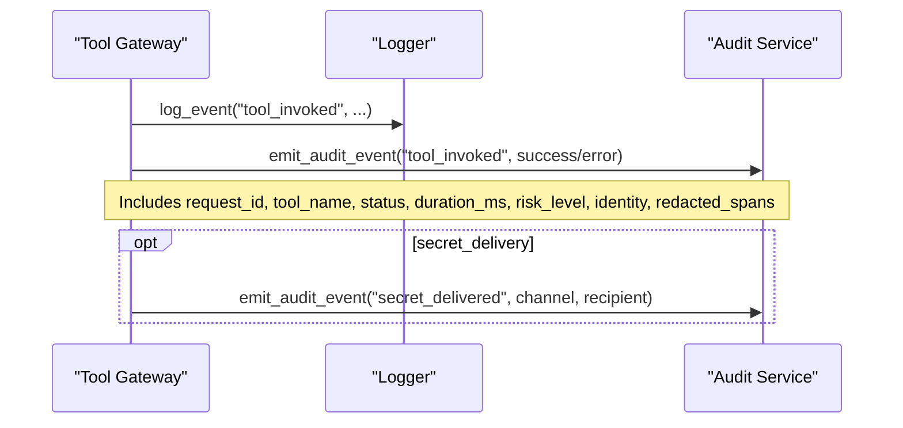

**Diagram sources**
- [gateway_service.py:336-375](file://products/tool-gateway/src/tool_gateway/services/gateway_service.py#L336-L375)

**Section sources**
- [gateway_service.py:197-248](file://products/tool-gateway/src/tool_gateway/services/gateway_service.py#L197-L248)
- [gateway_service.py:336-375](file://products/tool-gateway/src/tool_gateway/services/gateway_service.py#L336-L375)

### Separation Between Read-Only and Mutating Tools
- Read tools:
  - Require only tools:invoke.
  - Unaffected by mutating tools gate.
  - Safe for observers and broad operational use per authorization matrix.
- Mutating tools (write/admin):
  - Require tools:mutate in addition to tools:invoke.
  - Registration gated by allow_mutating configuration.
  - Produce approval cards and are subject to stricter approval boundaries.
- **New**: Password generation is read-tier and requires no mutation approval; email delivery is write-tier and requires `secrets:deliver` action.

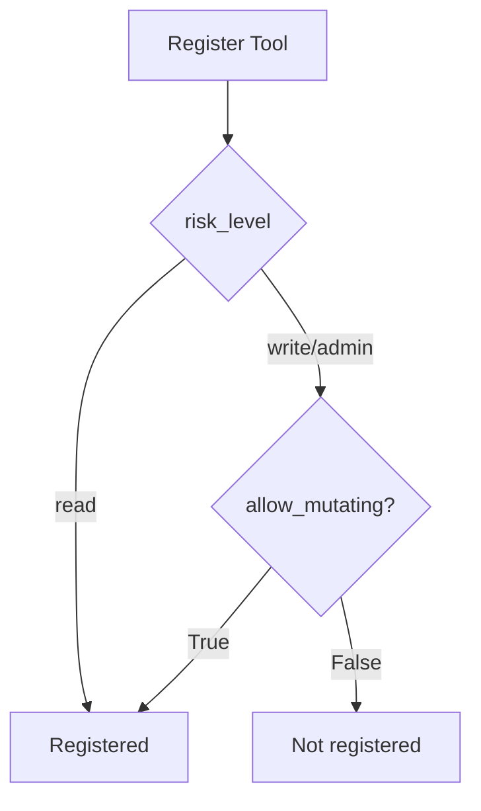

**Diagram sources**
- [registry.py:18-49](file://products/tool-gateway/src/tool_gateway/tools/registry.py#L18-L49)
- [test_tool_registry.py:112-129](file://products/tool-gateway/tests/test_tool_registry.py#L112-L129)

**Section sources**
- [registry.py:18-49](file://products/tool-gateway/src/tool_gateway/tools/registry.py#L18-L49)
- [test_tool_registry.py:112-129](file://products/tool-gateway/tests/test_tool_registry.py#L112-L129)
- [adding-a-tool.md:127-134](file://docs/guides/adding-a-tool.md#L127-L134)

### Prose Redaction for Chat Transcripts
- User-authored text is masked with four layers: pinned shapes, URL query masking, key=value masking, and heuristic token masking when a secret hint is present.
- Assistant text is masked more narrowly: pinned shapes, URL query masking, and exact literal matches harvested from user text.
- Streaming redactor holds back partial matches to avoid splitting credentials across deltas.
- **New**: Generated passwords are treated as secrets from the moment they exist, ensuring consistent masking across all transcript surfaces.

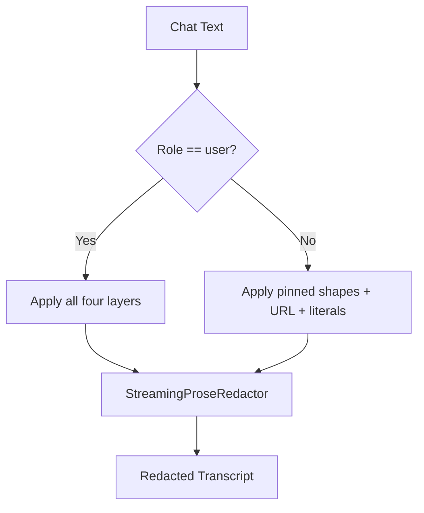

**Diagram sources**
- [prose_redaction.py:1-75](file://products/agent-platform/src/agent_service/services/prose_redaction.py#L1-L75)
- [prose_redaction.py:249-270](file://products/agent-platform/src/agent_service/services/prose_redaction.py#L249-L270)
- [prose_redaction.py:381-400](file://products/agent-platform/src/agent_service/services/prose_redaction.py#L381-L400)
- [prose_redaction.py:459-536](file://products/agent-platform/src/agent_service/services/prose_redaction.py#L459-L536)

**Section sources**
- [prose_redaction.py:1-75](file://products/agent-platform/src/agent_service/services/prose_redaction.py#L1-L75)
- [prose_redaction.py:249-270](file://products/agent-platform/src/agent_service/services/prose_redaction.py#L249-L270)
- [prose_redaction.py:381-400](file://products/agent-platform/src/agent_service/services/prose_redaction.py#L381-L400)
- [prose_redaction.py:459-536](file://products/agent-platform/src/agent_service/services/prose_redaction.py#L459-L536)

## Dependency Analysis
- Tool Gateway depends on Policy Engine for authorization decisions and on Tool Registry for safe dispatch.
- Redaction is applied post-execution and before audit emission.
- Agent Platform modules provide complementary masking for different surfaces (parameters, evidence, prose).
- Platform Gateway delegates tokens to internal services, ensuring secure service-to-service communication.
- **New**: Secret delivery depends on pluggable buffer backends (in-memory/Redis) and integrates with existing audit infrastructure.

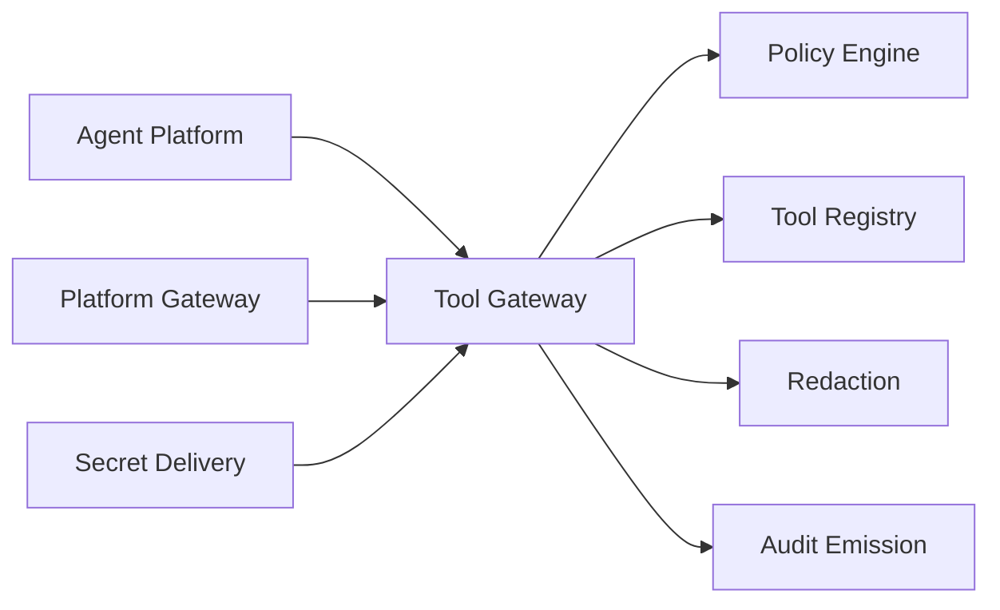

**Diagram sources**
- [gateway_service.py:158-376](file://products/tool-gateway/src/tool_gateway/services/gateway_service.py#L158-L376)
- [policy_engine.py:299-355](file://products/tool-gateway/src/tool_gateway/services/policy_engine.py#L299-L355)
- [registry.py:65-89](file://products/tool-gateway/src/tool_gateway/tools/registry.py#L65-L89)
- [redaction.py:126-151](file://products/tool-gateway/src/tool_gateway/tools/redaction.py#L126-L151)
- [secret_params.py:186-206](file://products/agent-platform/src/agent_service/services/secret_params.py#L186-L206)
- [delegation_client.py:81-104](file://products/platform-gateway/src/platform_gateway/services/delegation_client.py#L81-L104)

**Section sources**
- [gateway_service.py:158-376](file://products/tool-gateway/src/tool_gateway/services/gateway_service.py#L158-L376)
- [policy_engine.py:299-355](file://products/tool-gateway/src/tool_gateway/services/policy_engine.py#L299-L355)
- [registry.py:65-89](file://products/tool-gateway/src/tool_gateway/tools/registry.py#L65-L89)
- [redaction.py:126-151](file://products/tool-gateway/src/tool_gateway/tools/redaction.py#L126-L151)
- [secret_params.py:186-206](file://products/agent-platform/src/agent_service/services/secret_params.py#L186-L206)
- [delegation_client.py:81-104](file://products/platform-gateway/src/platform_gateway/services/delegation_client.py#L81-L104)

## Performance Considerations
- Redaction computes original and redacted character counts to detect overflow; keep tool outputs concise to avoid REDACTION_OVERFLOW failures.
- Policy bundle evaluation is in-memory after load; ensure bundles remain small and well-structured.
- Streaming prose redaction holds bounded tails to avoid splitting credentials; tune thresholds implicitly via anchor caps.
- Token verification and delegation caching reduce network overhead.
- **New**: Secret delivery buffer performance depends on backend choice - in-memory for single-replica, Redis for multi-replica deployments.
- **New**: CSPRNG generation is lightweight but should be rate-limited to prevent abuse.

## Troubleshooting Guide
- 403 denied by policy:
  - Verify identity context and roles; check tools:invoke and tools:mutate evaluations.
  - Inspect matched rule IDs and reasons in audit events.
- REDACTION_OVERFLOW:
  - Reduce sensitive content in tool outputs or tighten parameters.
  - Review redaction statistics and overflow fraction settings.
- Unknown tool or execution error:
  - Confirm tool registration and risk_level validity.
  - Check registry logs for registration warnings and execution exceptions.
- Credential issues:
  - Ensure credential sets are configured and referenced correctly.
  - Validate parameter names against secret vocabulary and opaque fields.
- **New**: Secret delivery issues:
  - Check buffer backend availability (in-memory vs Redis).
  - Verify delivery_id expiration and owner scope.
  - Review `secret_delivered` audit events for delivery attempts.

**Section sources**
- [gateway_service.py:197-248](file://products/tool-gateway/src/tool_gateway/services/gateway_service.py#L197-L248)
- [gateway_service.py:307-334](file://products/tool-gateway/src/tool_gateway/services/gateway_service.py#L307-L334)
- [registry.py:65-89](file://products/tool-gateway/src/tool_gateway/tools/registry.py#L65-L89)
- [test_redaction.py:228-247](file://products/tool-gateway/tests/test_redaction.py#L228-L247)
- [test_secret_params.py:64-75](file://products/agent-platform/tests/test_secret_params.py#L64-L75)

## Conclusion
The Luban AIOPS platform enforces a robust, layered security model for tool execution:
- Clear risk tiers separate read-only operations from mutating actions.
- A deny-by-default policy engine governs authorization with explicit role-action rules.
- Comprehensive redaction prevents credential leakage across responses, approvals, and transcripts.
- Durable audit trails capture every decision and invocation for accountability.
- Credential management ensures secrets are never persisted or displayed in plaintext.
- **New**: One-time secret delivery handoff provides secure distribution of generated secrets without projection exposure.
- **New**: CSPRNG-based password generation ensures cryptographically strong randomness independent of LLM capabilities.
Operators should configure policies carefully, classify tools accurately, monitor audit and redaction metrics, and leverage the new secret delivery capabilities for secure password distribution while maintaining the platform's strict no-projection security posture.

## Appendices

### Configuring Tool Permissions
- Define tool risk_level accurately; anything changing upstream state must be at least write.
- Enable mutating tools only when necessary via configuration; observe registry logs for registration gating.
- Use policy bundles to grant tools:list and tools:invoke broadly for read-only roles, and restrict tools:mutate to approver/operator roles.
- **New**: Configure `secrets:deliver` action separately from other mutating actions to control email delivery capabilities.

**Section sources**
- [adding-a-tool.md:127-134](file://docs/guides/adding-a-tool.md#L127-L134)
- [registry.py:18-49](file://products/tool-gateway/src/tool_gateway/tools/registry.py#L18-L49)
- [policy_engine.py:32-52](file://products/tool-gateway/src/tool_gateway/services/policy_engine.py#L32-L52)

### Implementing Custom Authorization Rules
- Add rules matching roles and actions; prefer explicit deny for high-risk scenarios.
- Use require_approval for workflows requiring human confirmation; note that tool-gateway invocation path does not enforce approval directly—approval enforcement lives on the platform-gateway confirm path.
- Validate bundles during deployment; readiness endpoints expose bundle fingerprints.
- **New**: Create specific rules for `secrets:deliver` action to control email delivery capabilities independently from other mutating actions.

**Section sources**
- [policy_engine.py:192-251](file://products/tool-gateway/src/tool_gateway/services/policy_engine.py#L192-L251)
- [policy_engine.py:299-355](file://products/tool-gateway/src/tool_gateway/services/policy_engine.py#L299-L355)
- [gateway_service.py:40-58](file://products/tool-gateway/src/tool_gateway/services/gateway_service.py#L40-L58)

### Secret Delivery Configuration
**New**: Configuration requirements for one-time secret delivery handoff:

- **Buffer Backend**: Choose between in-memory (default, single-replica) and Redis (multi-replica) backends.
- **Email Channel**: Configure SMTP settings and recipient allowlists for optional email delivery.
- **Policy Action**: Register `secrets:deliver` action in policy bundle for email delivery control.
- **Environment Variables**: Set appropriate configuration for buffer TTL, email allowlists, and delivery timeouts.
- **Testing**: Validate delivery functionality across both backends and channels.

**Section sources**
- [SPEC-062 spec.md:298-320](file://docs/specs/SPEC-062-secure-password-generation-and-delivery/spec.md#L298-L320)
- [SPEC-062 spec.md:407-434](file://docs/specs/SPEC-062-secure-password-generation-and-delivery/spec.md#L407-L434)