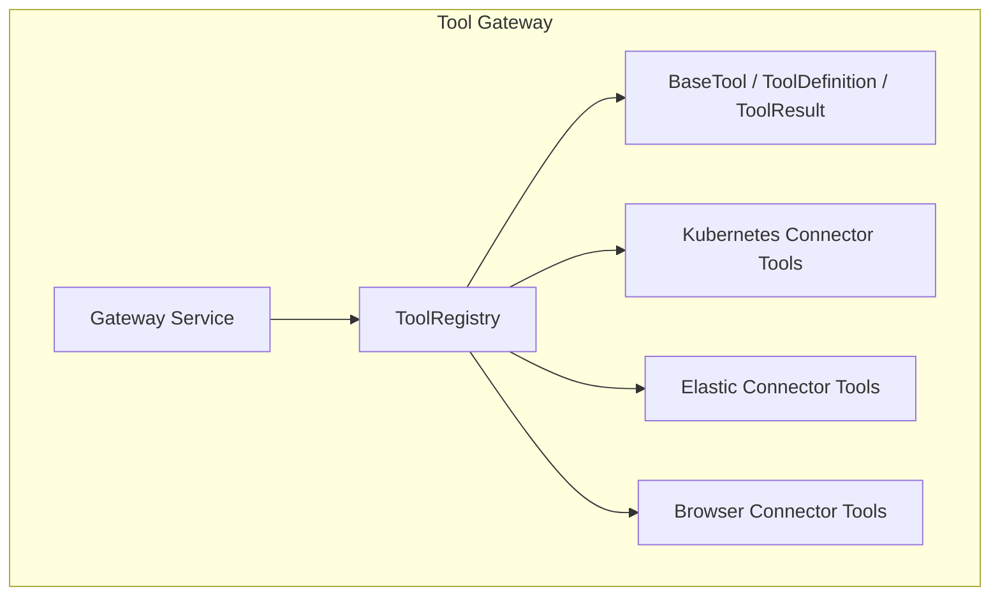
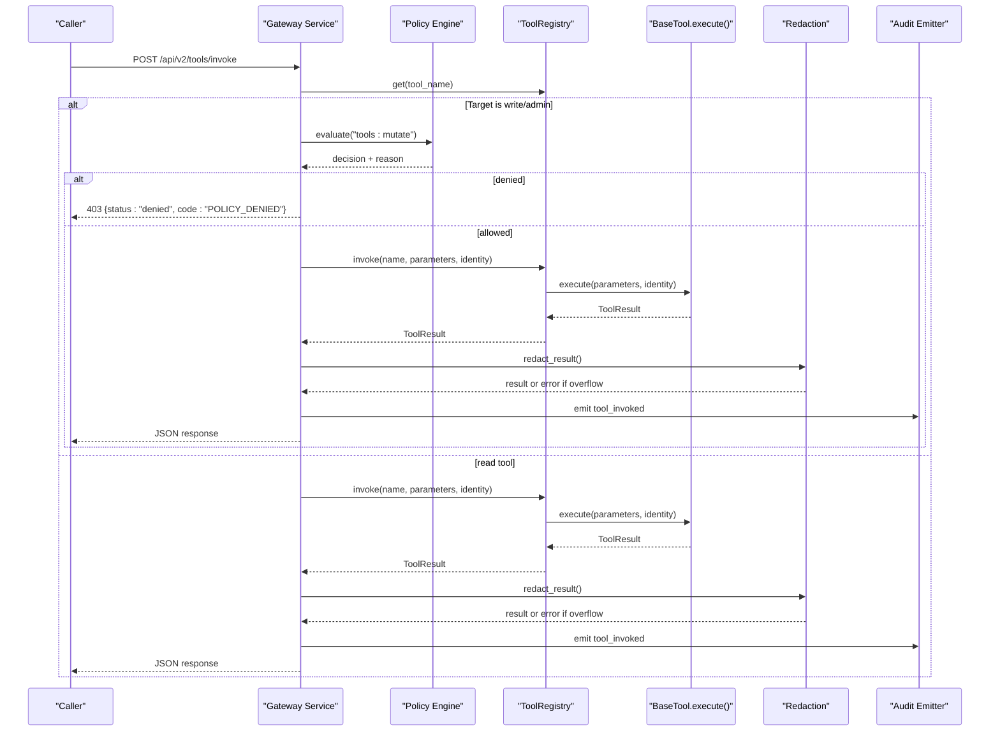
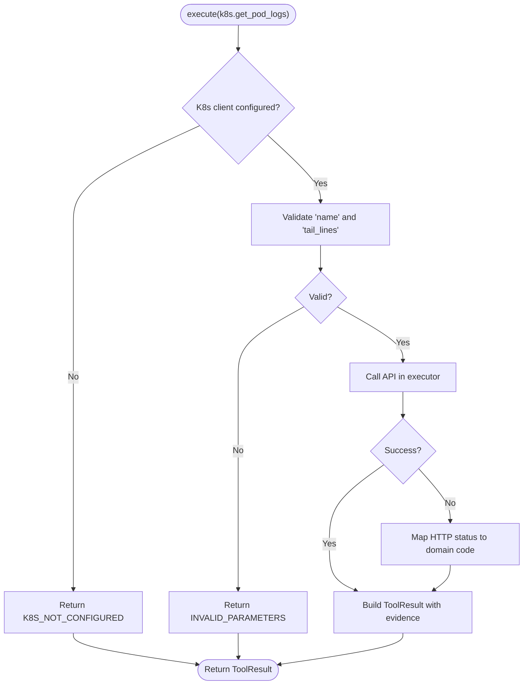
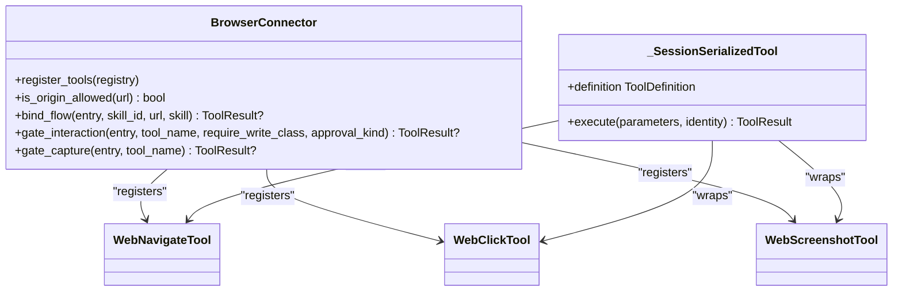
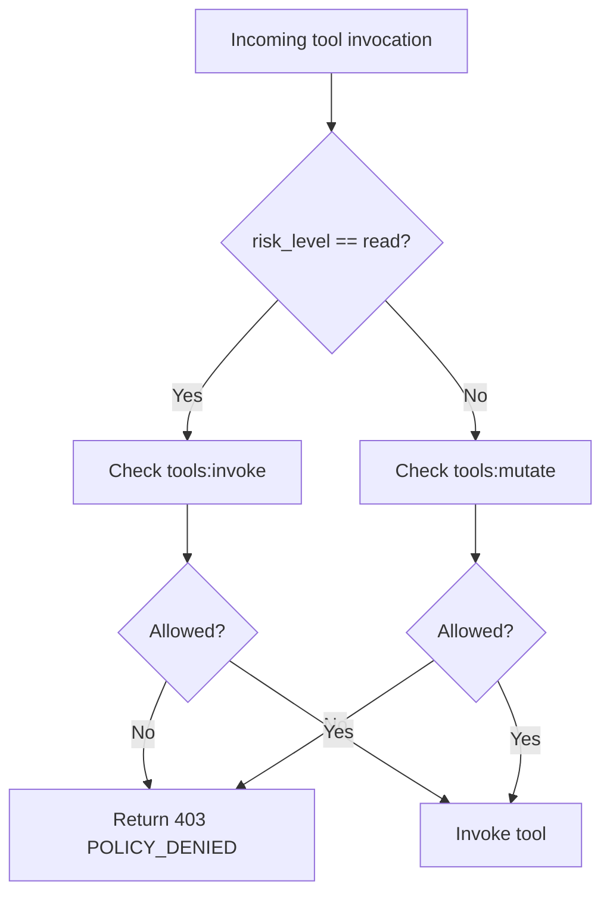
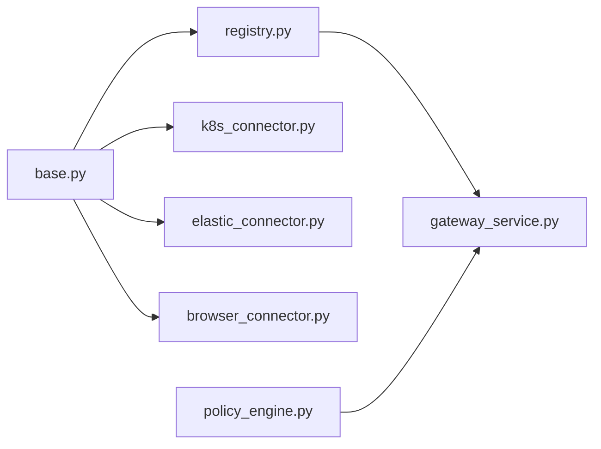

# Tool Development Guide

<cite>
**Referenced Files in This Document**
- [base.py](file://products/tool-gateway/src/tool_gateway/tools/base.py)
- [registry.py](file://products/tool-gateway/src/tool_gateway/tools/registry.py)
- [k8s_connector.py](file://products/tool-gateway/src/tool_gateway/tools/k8s_connector.py)
- [elastic_connector.py](file://products/tool-gateway/src/tool_gateway/tools/elastic_connector.py)
- [browser_connector.py](file://products/tool-gateway/src/tool_gateway/tools/browser_connector.py)
- [gateway_service.py](file://products/tool-gateway/src/tool_gateway/services/gateway_service.py)
- [policy_engine.py](file://products/platform-gateway/src/platform_gateway/services/policy_engine.py)
- [adding-a-tool.md](file://docs/guides/adding-a-tool.md)
- [test_tool_registry.py](file://products/tool-gateway/tests/test_tool_registry.py)
- [test_tool_invoke.py](file://products/tool-gateway/tests/test_tool_invoke.py)
</cite>

## Table of Contents
1. Introduction
2. Project Structure
3. Core Components
4. Architecture Overview
5. Detailed Component Analysis
6. Dependency Analysis
7. Performance Considerations
8. Troubleshooting Guide
9. Conclusion
10. Appendices

## Introduction
This guide explains how to build custom tools for the Luban AIOPS platform’s tool execution framework. It covers the BaseTool abstract interface, ToolDefinition metadata, parameter validation, identity context handling, evidence collection, registration and discovery via the registry, risk levels (read, write, admin), policy integration, testing strategies, and secure integration with external systems.

## Project Structure
Tools live under the tool gateway package and are discovered by name through a central registry. The gateway enforces policy before invoking tools and wraps results with redaction and audit logging.

**Diagram sources**
- [gateway_service.py:250-305](file://products/tool-gateway/src/tool_gateway/services/gateway_service.py#L250-L305)
- [registry.py:18-89](file://products/tool-gateway/src/tool_gateway/tools/registry.py#L18-L89)
- [base.py:15-123](file://products/tool-gateway/src/tool_gateway/tools/base.py#L15-L123)

**Section sources**
- [gateway_service.py:250-376](file://products/tool-gateway/src/tool_gateway/services/gateway_service.py#L250-L376)
- [registry.py:18-89](file://products/tool-gateway/src/tool_gateway/tools/registry.py#L18-L89)
- [base.py:15-123](file://products/tool-gateway/src/tool_gateway/tools/base.py#L15-L123)

## Core Components
- BaseTool: Abstract base class defining the contract every tool must implement.
- ToolDefinition: Immutable metadata describing a tool’s name, description, risk level, category, and parameters schema.
- ToolResult: Structured envelope returned by execute(), including status, data, evidence, and optional error.
- ToolRegistry: In-process lookup and dispatch that validates risk levels and gates mutating tools.

Key behaviors:
- Risk levels are validated against a fixed vocabulary: read, write, admin.
- Mutating tools (write/admin) are refused registration unless explicitly allowed at runtime.
- All invocations return a ToolResult; exceptions are wrapped into structured errors.

**Section sources**
- [base.py:15-123](file://products/tool-gateway/src/tool_gateway/tools/base.py#L15-L123)
- [registry.py:18-89](file://products/tool-gateway/src/tool_gateway/tools/registry.py#L18-L89)

## Architecture Overview
The gateway service resolves the target tool, applies policy checks based on risk level, builds an identity context, invokes the registry, then applies redaction and emits audit events.

**Diagram sources**
- [gateway_service.py:250-376](file://products/tool-gateway/src/tool_gateway/services/gateway_service.py#L250-L376)
- [policy_engine.py:287-315](file://products/platform-gateway/src/platform_gateway/services/policy_engine.py#L287-L315)
- [registry.py:65-89](file://products/tool-gateway/src/tool_gateway/tools/registry.py#L65-L89)
- [base.py:58-105](file://products/tool-gateway/src/tool_gateway/tools/base.py#L58-L105)

## Detailed Component Analysis

### BaseTool, ToolDefinition, ToolResult, and Evidence
- BaseTool requires:
  - definition property returning ToolDefinition
  - async execute(parameters, identity) returning ToolResult
- ToolDefinition fields:
  - name: unique tool identifier used by policy and catalog
  - description: LLM-facing explanation
  - risk_level: one of read, write, admin
  - category: grouping label (e.g., kubernetes, observability, browser)
  - parameters_schema: JSON Schema describing inputs
- ToolResult fields:
  - tool_name, status ("success", "error", "denied"), data, evidence, error
- Evidence envelope:
  - executed_at, duration_ms, risk_level, source_system
- Helpers:
  - build_evidence(risk_level, source_system, duration_ms)
  - make_error_result(code, message, risk_level, source_system, duration_ms)
  - make_denied_result(reason, risk_level)

Implementation guidance:
- Always measure duration and attach evidence using build_evidence.
- Never raise from execute(); return structured ToolResult for all failures.
- Use make_error_result for transport and upstream errors; use make_denied_result for policy denials.

**Section sources**
- [base.py:15-123](file://products/tool-gateway/src/tool_gateway/tools/base.py#L15-L123)

### ToolRegistry: Registration and Discovery
- register(tool):
  - Validates risk_level against the fixed set
  - Refuses write/admin tools unless allow_mutating is enabled
  - Logs warnings for overwrites
- get(name): returns tool instance or None
- list_definitions(): exposes metadata for discovery
- invoke(name, parameters, identity):
  - Unknown tools return TOOL_NOT_FOUND
  - Exceptions during execute are caught and returned as TOOL_EXECUTION_ERROR with correct risk_level and source_system

Discovery flow:
- Connectors call register_tools(registry) to register their tools at startup.
- The gateway lists definitions via list_definitions() for the portal tool catalog.

**Section sources**
- [registry.py:18-89](file://products/tool-gateway/src/tool_gateway/tools/registry.py#L18-L89)

### Kubernetes Connector Example
- Provides read-only tools: k8s.list_pods, k8s.get_pod, k8s.get_events, k8s.get_pod_logs
- Provides a bounded mutating tool: k8s.delete_pod (write)
- Uses in-cluster config when available, falls back to kubeconfig; otherwise returns K8S_NOT_CONFIGURED
- Parameter validation:
  - Required fields enforced (e.g., name)
  - tail_lines clamped to [1, MAX_TAIL_LINES]
- Error mapping:
  - 404 -> POD_NOT_FOUND
  - 403 -> K8S_PERMISSION_DENIED
  - Others -> K8S_API_ERROR
- Evidence uses risk_level matching the tool definition

**Diagram sources**
- [k8s_connector.py:376-436](file://products/tool-gateway/src/tool_gateway/tools/k8s_connector.py#L376-L436)
- [k8s_connector.py:439-518](file://products/tool-gateway/src/tool_gateway/tools/k8s_connector.py#L439-L518)

**Section sources**
- [k8s_connector.py:41-92](file://products/tool-gateway/src/tool_gateway/tools/k8s_connector.py#L41-L92)
- [k8s_connector.py:231-276](file://products/tool-gateway/src/tool_gateway/tools/k8s_connector.py#L231-L276)
- [k8s_connector.py:376-436](file://products/tool-gateway/src/tool_gateway/tools/k8s_connector.py#L376-L436)
- [k8s_connector.py:439-518](file://products/tool-gateway/src/tool_gateway/tools/k8s_connector.py#L439-L518)

### Elastic Connector Example
- Provides read-only tools: elastic.search_logs, elastic.get_service_health, elastic.get_active_alerts
- Lazy client initialization; returns ELASTIC_NOT_CONFIGURED when not configured
- Parameter coercion:
  - time_range_minutes clamped to [1, MAX_TIME_RANGE_MINUTES]
  - max_results clamped to [1, MAX_RESULTS]
- Errors map to ELASTIC_CONNECTION_ERROR with evidence duration

**Section sources**
- [elastic_connector.py:40-103](file://products/tool-gateway/src/tool_gateway/tools/elastic_connector.py#L40-L103)
- [elastic_connector.py:287-379](file://products/tool-gateway/src/tool_gateway/tools/elastic_connector.py#L287-L379)
- [elastic_connector.py:382-456](file://products/tool-gateway/src/tool_gateway/tools/elastic_connector.py#L382-L456)
- [elastic_connector.py:459-535](file://products/tool-gateway/src/tool_gateway/tools/elastic_connector.py#L459-L535)

### Browser Connector Example
- Bounded web-check tool surface with explicit read/write tiers:
  - Read tier: web.navigate, web.snapshot, web.screenshot, web.fill_credential, web.extract, web.wait_for, web.hover, web.scroll, web.switch_frame
  - Write tier: web.click, web.type, web.select, web.press_key, web.upload_file, web.evaluate
- Enforcement surfaces:
  - Origin allowlist: empty deny-by-default; redirects off-allowlist halt and error
  - Flow binding + deviation guard: skill_id binds web_target/risk_class; interactions checked against bound origin, risk_class, and step budget
  - Credential sets: secrets resolved at fill time and never appear in results or evidence
- Identity handling:
  - Sessions keyed by chat_session_id (falls back to subject); supports owner→approver identity switch across HITL flows
- Per-call serialization per session ensures safe interaction with shared page state

**Diagram sources**
- [browser_connector.py:315-399](file://products/tool-gateway/src/tool_gateway/tools/browser_connector.py#L315-L399)
- [browser_connector.py:269-313](file://products/tool-gateway/src/tool_gateway/tools/browser_connector.py#L269-L313)
- [browser_connector.py:730-800](file://products/tool-gateway/src/tool_gateway/tools/browser_connector.py#L730-L800)

**Section sources**
- [browser_connector.py:1-95](file://products/tool-gateway/src/tool_gateway/tools/browser_connector.py#L1-L95)
- [browser_connector.py:269-313](file://products/tool-gateway/src/tool_gateway/tools/browser_connector.py#L269-L313)
- [browser_connector.py:315-399](file://products/tool-gateway/src/tool_gateway/tools/browser_connector.py#L315-L399)
- [browser_connector.py:482-598](file://products/tool-gateway/src/tool_gateway/tools/browser_connector.py#L482-L598)
- [browser_connector.py:655-698](file://products/tool-gateway/src/tool_gateway/tools/browser_connector.py#L655-L698)

### Policy Integration and Permission Checks
- Gateway enforces:
  - tools:invoke for all tools
  - tools:mutate for write/admin tools
- Policy engine validates rule outcomes and approval blocks; invalid rules cause load-time errors.
- Denied mutations produce 403 responses with POLICY_DENIED and preserve the tool’s risk_level in evidence.

**Diagram sources**
- [gateway_service.py:250-291](file://products/tool-gateway/src/tool_gateway/services/gateway_service.py#L250-L291)
- [policy_engine.py:287-315](file://products/platform-gateway/src/platform_gateway/services/policy_engine.py#L287-L315)

**Section sources**
- [gateway_service.py:250-291](file://products/tool-gateway/src/tool_gateway/services/gateway_service.py#L250-L291)
- [policy_engine.py:287-315](file://products/platform-gateway/src/platform_gateway/services/policy_engine.py#L287-L315)

## Dependency Analysis
- Base abstractions define the contract and helpers used by all connectors.
- Registry depends on BaseTool and validates risk levels.
- Connectors depend on BaseTool and optionally on registry.register_tools().
- Gateway service depends on registry and policy engine to enforce permissions.

**Diagram sources**
- [base.py:15-123](file://products/tool-gateway/src/tool_gateway/tools/base.py#L15-L123)
- [registry.py:18-89](file://products/tool-gateway/src/tool_gateway/tools/registry.py#L18-L89)
- [k8s_connector.py:25-33](file://products/tool-gateway/src/tool_gateway/tools/k8s_connector.py#L25-L33)
- [elastic_connector.py:22-30](file://products/tool-gateway/src/tool_gateway/tools/elastic_connector.py#L22-L30)
- [browser_connector.py:75-90](file://products/tool-gateway/src/tool_gateway/tools/browser_connector.py#L75-L90)
- [gateway_service.py:250-305](file://products/tool-gateway/src/tool_gateway/services/gateway_service.py#L250-L305)
- [policy_engine.py:287-315](file://products/platform-gateway/src/platform_gateway/services/policy_engine.py#L287-L315)

**Section sources**
- [base.py:15-123](file://products/tool-gateway/src/tool_gateway/tools/base.py#L15-L123)
- [registry.py:18-89](file://products/tool-gateway/src/tool_gateway/tools/registry.py#L18-L89)
- [gateway_service.py:250-376](file://products/tool-gateway/src/tool_gateway/services/gateway_service.py#L250-L376)

## Performance Considerations
- Measure execution time accurately and report duration_ms in evidence.
- Run blocking I/O in executors to avoid blocking the event loop (see connector examples).
- Clamp large or unbounded parameters (e.g., tail_lines, max_results) to prevent resource exhaustion.
- Redaction runs once at the gateway choke point; keep payloads minimal to reduce processing overhead.

[No sources needed since this section provides general guidance]

## Troubleshooting Guide
Common issues and resolutions:
- TOOL_NOT_FOUND: Ensure the tool is registered and the name matches exactly.
- TOOL_EXECUTION_ERROR: Inspect logs; ensure execute() catches exceptions and returns structured errors.
- POLICY_DENIED: Verify roles and policy grants for tools:mutate on write/admin tools.
- K8S_NOT_CONFIGURED: Provide in-cluster config or kubeconfig.
- ELASTIC_NOT_CONFIGURED: Configure URL and credentials.
- BROWSER_ORIGIN_NOT_ALLOWED/BROWSER_FLOW_ORIGIN_DEVIATED: Navigate to an allowlisted origin and ensure flow binding matches current page.

Evidence and audit:
- Evidence includes risk_level and source_system; use these to trace denials and errors.
- Audit events include tool_invoked and policy_decision with matched_rule_ids.

**Section sources**
- [registry.py:65-89](file://products/tool-gateway/src/tool_gateway/tools/registry.py#L65-L89)
- [gateway_service.py:250-376](file://products/tool-gateway/src/tool_gateway/services/gateway_service.py#L250-L376)
- [k8s_connector.py:439-518](file://products/tool-gateway/src/tool_gateway/tools/k8s_connector.py#L439-L518)
- [elastic_connector.py:287-379](file://products/tool-gateway/src/tool_gateway/tools/elastic_connector.py#L287-L379)
- [browser_connector.py:730-800](file://products/tool-gateway/src/tool_gateway/tools/browser_connector.py#L730-L800)

## Conclusion
To build robust tools for Luban AIOPS:
- Implement BaseTool with a precise ToolDefinition and a resilient execute() method.
- Validate parameters strictly, handle identity safely, and always attach evidence.
- Register tools via connectors and rely on the registry for discovery and risk-tier enforcement.
- Respect risk levels: read needs tools:invoke; write/admin need tools:mutate and produce approval cards.
- Follow the established patterns from Kubernetes, Elastic, and Browser connectors for secure, testable implementations.

[No sources needed since this section summarizes without analyzing specific files]

## Appendices

### Step-by-Step: Building a New Connector
1. Create a connector class that owns configuration and registers tools.
2. Define each tool as a subclass of BaseTool with:
   - A clear ToolDefinition (name, description, risk_level, category, parameters_schema)
   - An execute() that validates parameters, calls upstream, and returns ToolResult with evidence
3. Add settings and wire the connector behind a feature flag in app startup.
4. Ensure policy grants match your risk_level (read vs mutate).
5. Add tests covering parameters, transport, upstream errors, success, and registration.
6. Update operator documentation with activation variables and new error codes.

**Section sources**
- [adding-a-tool.md:29-46](file://docs/guides/adding-a-tool.md#L29-L46)
- [adding-a-tool.md:47-203](file://docs/guides/adding-a-tool.md#L47-L203)
- [adding-a-tool.md:212-248](file://docs/guides/adding-a-tool.md#L212-L248)
- [adding-a-tool.md:250-290](file://docs/guides/adding-a-tool.md#L250-L290)

### Testing Tool Implementations
- Unit tests for registry behavior:
  - Registration, listing definitions, invoke success/failure
  - Mutating tool gating and invalid risk_level rejection
- Integration-style tests for invoke endpoint:
  - Authentication required
  - Successful operator invocation with request correlation
  - Discovery exposing risk_level
  - Approver can invoke mutating tool after approval
  - Observer can still invoke read tools

**Section sources**
- [test_tool_registry.py:10-81](file://products/tool-gateway/tests/test_tool_registry.py#L10-L81)
- [test_tool_registry.py:112-144](file://products/tool-gateway/tests/test_tool_registry.py#L112-L144)
- [test_tool_invoke.py:195-231](file://products/tool-gateway/tests/test_tool_invoke.py#L195-L231)
- [test_tool_invoke.py:456-484](file://products/tool-gateway/tests/test_tool_invoke.py#L456-L484)

### Secure Integration Patterns
- Validate and sanitize all LLM-supplied parameters before use.
- Use strict patterns for values interpolated into URLs or queries.
- Prefer least-privilege credentials and scoped tokens for upstream services.
- Keep payloads minimal; project only necessary fields to reduce exposure.
- Rely on gateway redaction; do not log sensitive data in tool outputs.

**Section sources**
- [k8s_connector.py:211-226](file://products/tool-gateway/src/tool_gateway/tools/k8s_connector.py#L211-L226)
- [elastic_connector.py:250-282](file://products/tool-gateway/src/tool_gateway/tools/elastic_connector.py#L250-L282)
- [adding-a-tool.md:151-167](file://docs/guides/adding-a-tool.md#L151-L167)