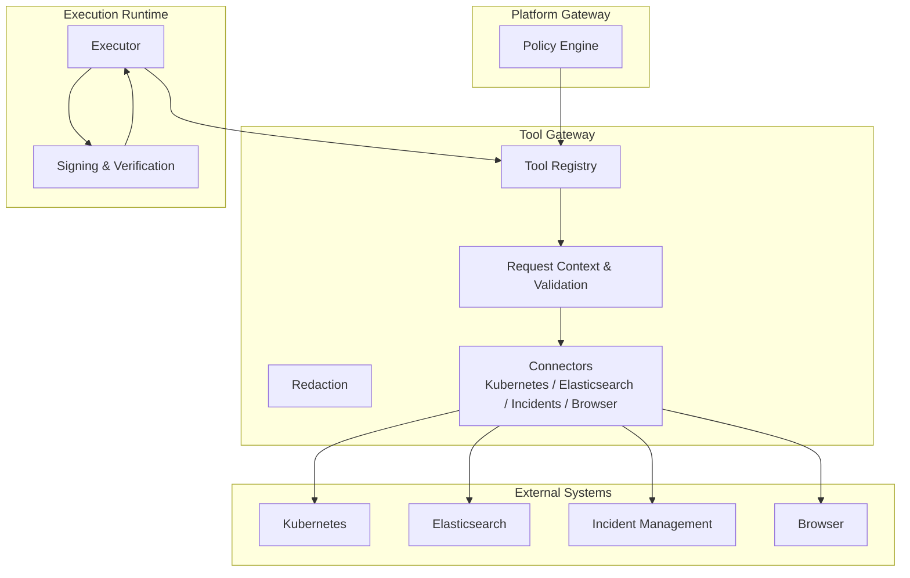
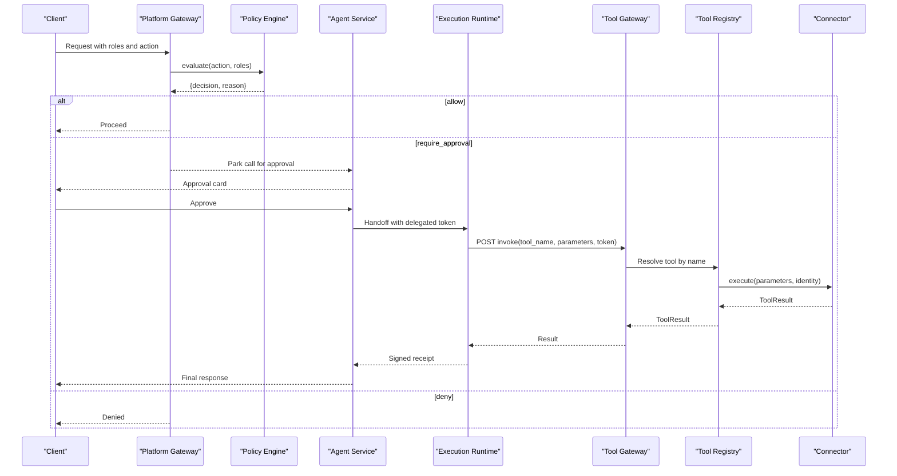
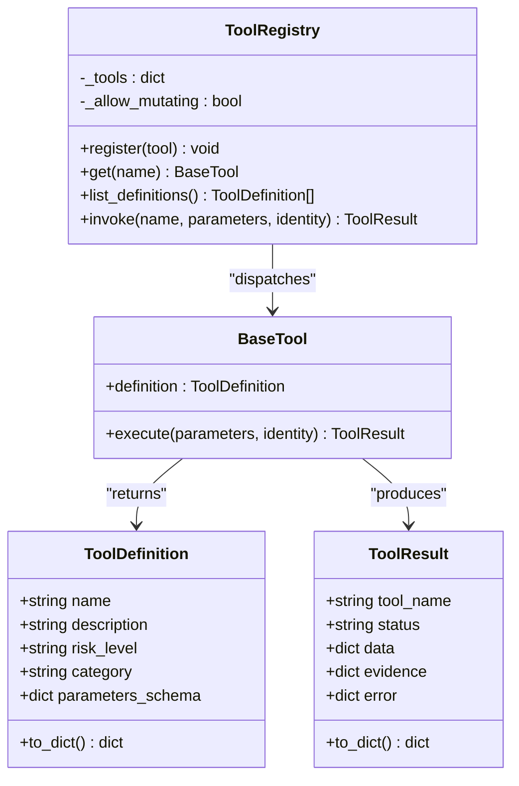
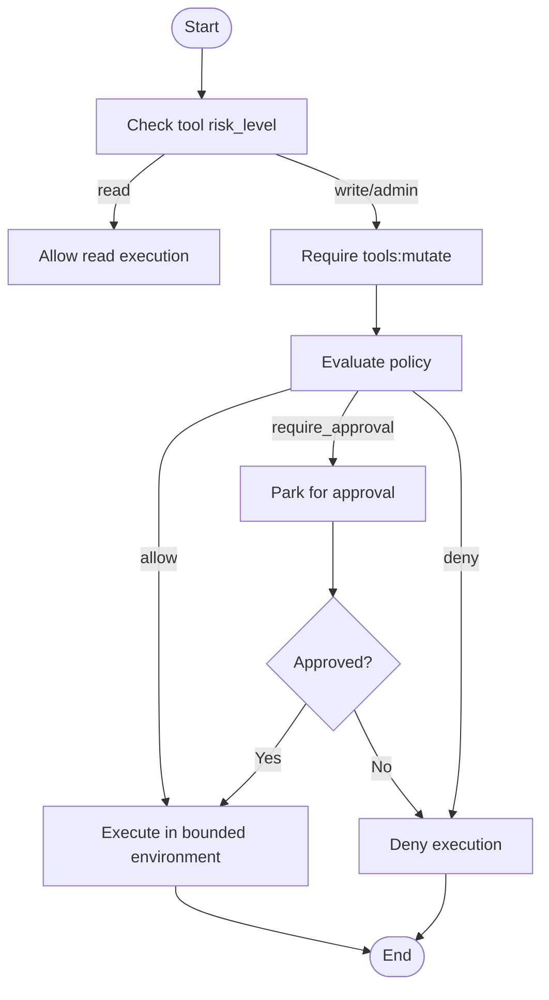
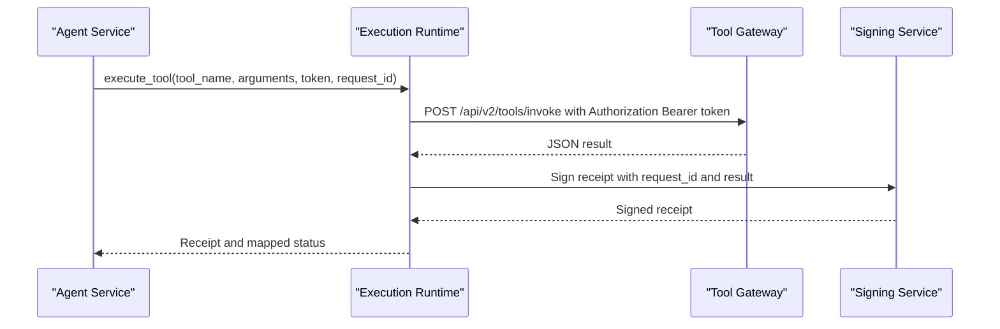
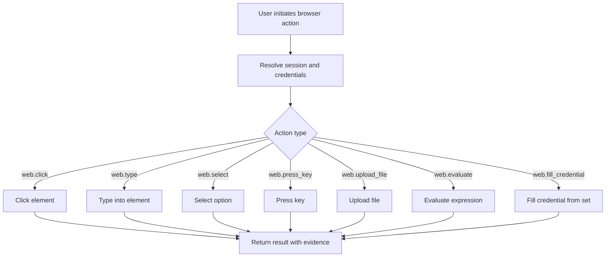
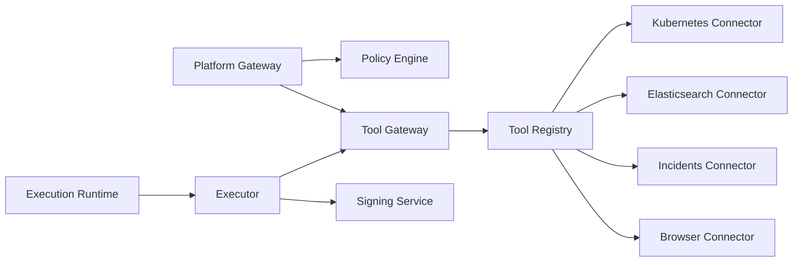

# Tool Execution Framework

<cite>
**Referenced Files in This Document**
- [base.py](file://products/tool-gateway/src/tool_gateway/tools/base.py)
- [registry.py](file://products/tool-gateway/src/tool_gateway/tools/registry.py)
- [executor.py](file://products/execution-runtime/src/execution_runtime/services/executor.py)
- [policy_engine.py](file://products/platform-gateway/src/platform_gateway/services/policy_engine.py)
- [tools.py](file://products/tool-gateway/src/tool_gateway/api/routes/tools.py)
- [browser_connector.py](file://products/tool-gateway/src/tool_gateway/tools/browser_connector.py)
- [k8s_connector.py](file://products/tool-gateway/src/tool_gateway/tools/k8s_connector.py)
- [elastic_connector.py](file://products/tool-gateway/src/tool_gateway/tools/elastic_connector.py)
- [incidents_connector.py](file://products/tool-gateway/src/tool_gateway/tools/incidents_connector.py)
- [credential_sets.py](file://products/tool-gateway/src/tool_gateway/tools/credential_sets.py)
- [redaction.py](file://products/tool-gateway/src/tool_gateway/tools/redaction.py)
- [execution_signing.py](file://products/execution-runtime/src/execution_runtime/services/execution_signing.py)
- [execution_worker_client.py](file://products/agent-platform/src/agent_service/services/execution_worker_client.py)
- [hitl_confirmations.py](file://products/agent-platform/src/agent_service/services/hitl_confirmations.py)
- [flow_approvals.py](file://products/agent-platform/src/agent_service/services/flow_approvals.py)
- [SPEC-007 spec.md](file://docs/specs/SPEC-007-tool-execution-framework/spec.md)
- [SPEC-021 spec.md](file://docs/specs/SPEC-021-bounded-mutating-actions/spec.md)
- [SPEC-037 spec.md](file://docs/specs/SPEC-037-signed-execution-requests/spec.md)
- [SPEC-038 spec.md](file://docs/specs/SPEC-038-isolated-execution-worker/spec.md)
- [SPEC-049 spec.md](file://docs/specs/SPEC-049-browser-web-check-tools/spec.md)
- [SPEC-050 spec.md](file://docs/specs/SPEC-050-browser-tools-expansion-and-samples/spec.md)
- [SPEC-051 spec.md](file://docs/specs/SPEC-051-browser-flow-hitl-gate-enforcement/spec.md)
</cite>

## Table of Contents
1. [Introduction](#introduction)
2. [Project Structure](#project-structure)
3. [Core Components](#core-components)
4. [Architecture Overview](#architecture-overview)
5. [Detailed Component Analysis](#detailed-component-analysis)
6. [Dependency Analysis](#dependency-analysis)
7. [Performance Considerations](#performance-considerations)
8. [Troubleshooting Guide](#troubleshooting-guide)
9. [Conclusion](#conclusion)
10. [Appendices](#appendices)

## Introduction
This document explains the tool execution framework that provides safe, auditable access to external systems and operational capabilities. It covers the tool registry pattern, parameter validation, output redaction, bounded execution environments, and the separation between read-only and mutating tools. It also documents the execution-runtime service that isolates potentially mutating actions behind signing and verification, browser automation tools for web-based operations, credential management, element interaction, and guidance for developing new tools, testing them, and integrating with the policy engine for permission checks.

## Project Structure
The tool execution framework spans three main products:
- Tool gateway: registers tools, enforces policies, validates parameters, redacts outputs, and dispatches invocations.
- Execution runtime: runs one-shot, isolated worker calls against the tool gateway using delegated tokens and signed receipts.
- Platform gateway: evaluates policies (allow, deny, require_approval) and bridges approval flows for mutating tool actions.

**Diagram sources**
- [policy_engine.py:390-444](file://products/platform-gateway/src/platform_gateway/services/policy_engine.py#L390-L444)
- [registry.py:18-89](file://products/tool-gateway/src/tool_gateway/tools/registry.py#L18-L89)
- [executor.py:23-152](file://products/execution-runtime/src/execution_runtime/services/executor.py#L23-L152)

**Section sources**
- [policy_engine.py:390-444](file://products/platform-gateway/src/platform_gateway/services/policy_engine.py#L390-L444)
- [registry.py:18-89](file://products/tool-gateway/src/tool_gateway/tools/registry.py#L18-L89)
- [executor.py:23-152](file://products/execution-runtime/src/execution_runtime/services/executor.py#L23-L152)

## Core Components
- Base tool interface and result envelope: defines tool metadata, structured results, evidence building, and error/denied result helpers.
- Tool registry: in-process lookup and dispatch with risk-tier admission control for mutating tools.
- Policy engine: deny-by-default evaluation with allow, deny, and require_approval outcomes; bridges approvals for mutating tool actions.
- Execution runtime executor: one-shot invocation through the tool gateway with delegated token, timeouts, transport errors, and status mapping.
- Browser connectors and credential sets: web interaction tools and credential handling for browser automation.
- Redaction: output sanitization to prevent secrets leakage.

**Section sources**
- [base.py:15-123](file://products/tool-gateway/src/tool_gateway/tools/base.py#L15-L123)
- [registry.py:18-89](file://products/tool-gateway/src/tool_gateway/tools/registry.py#L18-L89)
- [policy_engine.py:390-444](file://products/platform-gateway/src/platform_gateway/services/policy_engine.py#L390-L444)
- [executor.py:23-152](file://products/execution-runtime/src/execution_runtime/services/executor.py#L23-L152)
- [browser_connector.py](file://products/tool-gateway/src/tool_gateway/tools/browser_connector.py)
- [credential_sets.py](file://products/tool-gateway/src/tool_gateway/tools/credential_sets.py)
- [redaction.py](file://products/tool-gateway/src/tool_gateway/tools/redaction.py)

## Architecture Overview
The platform gateway evaluates whether an action is allowed, denied, or requires approval. For mutating tool actions, the flow can be bridged into a human-in-the-loop approval process. When approved, the agent service may hand off execution to the execution runtime, which invokes the tool gateway with a delegated token. The tool gateway resolves the tool via its registry, validates parameters, optionally redacts outputs, and executes the connector against external systems.

**Diagram sources**
- [policy_engine.py:390-444](file://products/platform-gateway/src/platform_gateway/services/policy_engine.py#L390-L444)
- [executor.py:23-152](file://products/execution-runtime/src/execution_runtime/services/executor.py#L23-L152)
- [registry.py:18-89](file://products/tool-gateway/src/tool_gateway/tools/registry.py#L18-L89)

## Detailed Component Analysis

### Tool Registry Pattern and Base Interface
The base interface defines a uniform contract for all tools:
- ToolDefinition carries name, description, risk_level, category, and parameters_schema.
- ToolResult standardizes success/error/denied responses with evidence and optional data.
- Evidence helpers build consistent audit fields including duration, risk level, and source system.
- Error and denied result builders ensure callers always receive a structured envelope.

The registry:
- Validates risk_level against the allowed vocabulary.
- Refuses registration of mutating tools unless explicitly enabled.
- Provides list_definitions for discovery and invoke for dispatch.
- Wraps exceptions into structured TOOL_EXECUTION_ERROR results.

**Diagram sources**
- [base.py:15-123](file://products/tool-gateway/src/tool_gateway/tools/base.py#L15-L123)
- [registry.py:18-89](file://products/tool-gateway/src/tool_gateway/tools/registry.py#L18-L89)

**Section sources**
- [base.py:15-123](file://products/tool-gateway/src/tool_gateway/tools/base.py#L15-L123)
- [registry.py:18-89](file://products/tool-gateway/src/tool_gateway/tools/registry.py#L18-L89)

### Parameter Validation and Output Redaction
- Parameter validation is driven by each tool’s parameters_schema declared in ToolDefinition. The registry and invoking layers rely on this schema to gate inputs before execution.
- Output redaction is applied to tool results to prevent sensitive values from leaking into transcripts or logs. Connectors should produce clean data; redaction acts as a safety net.

Best practices:
- Define precise schemas for required and optional fields.
- Use enums and ranges where possible to constrain inputs.
- Ensure connectors never return raw secrets; rely on redaction as a final safeguard.

**Section sources**
- [base.py:15-33](file://products/tool-gateway/src/tool_gateway/tools/base.py#L15-L33)
- [redaction.py](file://products/tool-gateway/src/tool_gateway/tools/redaction.py)

### Bounded Execution Environments and Mutating Tools
Mutating tools are those with risk_level not equal to "read". They require explicit enablement at the registry level and additional authorization at the gateway. The policy engine exposes a dedicated action for mutating tool execution and supports require_approval outcomes that bridge into HITL flows.

Key behaviors:
- Registry refuses mutating tool registration unless allow_mutating is set.
- Policy engine treats tools:mutate as a protected action and can require tiered approvals.
- Execution runtime invokes the tool gateway with a delegated token and maps failures to structured results.

**Diagram sources**
- [registry.py:18-55](file://products/tool-gateway/src/tool_gateway/tools/registry.py#L18-L55)
- [policy_engine.py:390-444](file://products/platform-gateway/src/platform_gateway/services/policy_engine.py#L390-L444)

**Section sources**
- [registry.py:18-55](file://products/tool-gateway/src/tool_gateway/tools/registry.py#L18-L55)
- [policy_engine.py:390-444](file://products/platform-gateway/src/platform_gateway/services/policy_engine.py#L390-L444)

### Execution-Runtime Service: Isolated Workers with Signing and Verification
The execution runtime provides one-shot execution for handed-off requests:
- Validates configuration and presence of delegated token.
- Invokes the tool gateway over HTTP with timeout and transport error handling.
- Maps gateway results to receipt statuses for resumed-stream handling.
- Works with signing and verification services to produce signed receipts for auditability.

**Diagram sources**
- [executor.py:23-152](file://products/execution-runtime/src/execution_runtime/services/executor.py#L23-L152)
- [execution_signing.py](file://products/execution-runtime/src/execution_runtime/services/execution_signing.py)

**Section sources**
- [executor.py:23-152](file://products/execution-runtime/src/execution_runtime/services/executor.py#L23-L152)
- [execution_signing.py](file://products/execution-runtime/src/execution_runtime/services/execution_signing.py)

### Browser Automation Tools, Credentials, and Element Interaction
Browser tools provide web-based operations such as clicking, typing, selecting, pressing keys, uploading files, evaluating expressions, and filling credentials. The project author guidelines specify exact tool membership:
- Read-tier tools include web.fill_credential.
- Write-tier tools include web.click, web.type, web.select, web.press_key, web.upload_file, and web.evaluate.
- web.evaluate takes only expression and no element ref.
- web.fill_credential parks no card and names its credential set.

Credential management:
- Credential sets define named groups of secrets used by browser tools.
- Tools reference credential sets rather than embedding secrets directly.

Element interaction:
- Tools operate within browser sessions managed by the connector.
- Some write-tier interactions are gated by HITL enforcement when bound to per-action approvals.

**Diagram sources**
- [browser_connector.py](file://products/tool-gateway/src/tool_gateway/tools/browser_connector.py)
- [credential_sets.py](file://products/tool-gateway/src/tool_gateway/tools/credential_sets.py)

**Section sources**
- [browser_connector.py](file://products/tool-gateway/src/tool_gateway/tools/browser_connector.py)
- [credential_sets.py](file://products/tool-gateway/src/tool_gateway/tools/credential_sets.py)
- [hitl_confirmations.py](file://products/agent-platform/src/agent_service/services/hitl_confirmations.py)
- [flow_approvals.py](file://products/agent-platform/src/agent_service/services/flow_approvals.py)

### Kubernetes, Elasticsearch, and Incident Management Connectors
Connectors implement BaseTool and expose domain-specific operations:
- Kubernetes connector: cluster-scoped reads and writes depending on risk_level.
- Elasticsearch connector: index/query operations with strict parameter schemas.
- Incident management connector: create/read/update incidents with evidence capture.

Implementation patterns:
- Each connector declares ToolDefinition with accurate risk_level and parameters_schema.
- execute measures duration and builds evidence using the base helper.
- Errors are returned as ToolResult with structured error codes and messages.

**Section sources**
- [k8s_connector.py](file://products/tool-gateway/src/tool_gateway/tools/k8s_connector.py)
- [elastic_connector.py](file://products/tool-gateway/src/tool_gateway/tools/elastic_connector.py)
- [incidents_connector.py](file://products/tool-gateway/src/tool_gateway/tools/incidents_connector.py)
- [base.py:58-123](file://products/tool-gateway/src/tool_gateway/tools/base.py#L58-L123)

### Integrating with the Policy Engine for Permission Checks
The policy engine enforces deny-by-default semantics and supports three outcomes:
- allow: proceed without further checks.
- deny: block the action immediately.
- require_approval: park the action for tiered approval; only bridged actions like tools:mutate can use require_approval here.

Integration points:
- Platform gateway evaluates actions before routing to tool-gateway endpoints.
- Tool-gateway routes consult policy decisions for mutating tool invocations.
- Agent service coordinates approval cards and resumes execution after approval.

**Section sources**
- [policy_engine.py:390-444](file://products/platform-gateway/src/platform_gateway/services/policy_engine.py#L390-L444)
- [tools.py](file://products/tool-gateway/src/tool_gateway/api/routes/tools.py)

## Dependency Analysis
The framework exhibits clear layering:
- Platform gateway depends on policy_engine for authorization.
- Tool gateway depends on registry and connectors for execution.
- Execution runtime depends on executor and signing services for isolated, verifiable runs.
- Connectors depend on external systems and credential sets.

**Diagram sources**
- [policy_engine.py:390-444](file://products/platform-gateway/src/platform_gateway/services/policy_engine.py#L390-L444)
- [registry.py:18-89](file://products/tool-gateway/src/tool_gateway/tools/registry.py#L18-L89)
- [executor.py:23-152](file://products/execution-runtime/src/execution_runtime/services/executor.py#L23-L152)

**Section sources**
- [policy_engine.py:390-444](file://products/platform-gateway/src/platform_gateway/services/policy_engine.py#L390-L444)
- [registry.py:18-89](file://products/tool-gateway/src/tool_gateway/tools/registry.py#L18-L89)
- [executor.py:23-152](file://products/execution-runtime/src/execution_runtime/services/executor.py#L23-L152)

## Performance Considerations
- Keep tool schemas minimal and precise to reduce validation overhead.
- Prefer read-only tools for high-frequency queries; reserve mutating tools for controlled workflows.
- Use connection pooling in connectors where applicable to reduce latency.
- Avoid returning large payloads; prefer references or summaries in tool results.
- Leverage redaction early to minimize downstream processing costs.

[No sources needed since this section provides general guidance]

## Troubleshooting Guide
Common issues and resolutions:
- TOOL_NOT_FOUND: Ensure the tool is registered and the name matches exactly.
- TOOL_EXECUTION_ERROR: Inspect connector logs and parameter validation errors.
- NO_GATEWAY or TRANSPORT_ERROR: Verify execution-runtime configuration and network reachability.
- BAD_GATEWAY_RESPONSE: Confirm tool-gateway returns valid JSON.
- POLICY_DENIED: Review policy bundle and role grants; adjust permissions or seek approval.

Debugging steps:
- Check tool definitions and risk levels.
- Validate parameters against schemas.
- Inspect evidence envelopes for duration and source_system.
- Correlate request_id across platform gateway, tool gateway, and execution runtime.

**Section sources**
- [registry.py:65-89](file://products/tool-gateway/src/tool_gateway/tools/registry.py#L65-L89)
- [executor.py:38-152](file://products/execution-runtime/src/execution_runtime/services/executor.py#L38-L152)

## Conclusion
The tool execution framework provides a robust, auditable path to external systems with clear separation between read-only and mutating operations. The registry pattern standardizes tool contracts, the policy engine enforces least privilege with approval workflows, and the execution runtime ensures isolated, signed execution for sensitive actions. Browser automation tools extend capabilities to web-based workflows with strong credential and HITL controls. Following the documented patterns ensures secure, maintainable integrations.

[No sources needed since this section summarizes without analyzing specific files]

## Appendices

### Developing New Tools
Steps:
- Implement BaseTool with definition and execute.
- Declare accurate risk_level and parameters_schema.
- Build evidence using the base helper and return ToolResult.
- Register the tool in the gateway with appropriate mutating flags if needed.
- Add tests covering success, error, and denied paths.

**Section sources**
- [base.py:108-123](file://products/tool-gateway/src/tool_gateway/tools/base.py#L108-L123)
- [registry.py:31-55](file://products/tool-gateway/src/tool_gateway/tools/registry.py#L31-L55)

### Testing Tool Implementations
Recommended test cases:
- Valid parameters and successful execution.
- Invalid parameters rejected by schema validation.
- Network failures mapped to structured errors.
- Policy denials for mutating tools without proper grants.
- Evidence correctness and redaction behavior.

**Section sources**
- [registry.py:65-89](file://products/tool-gateway/src/tool_gateway/tools/registry.py#L65-L89)
- [executor.py:79-152](file://products/execution-runtime/src/execution_runtime/services/executor.py#L79-L152)

### Read-Only vs Mutating Tools Security Model
- Read tools: require tools:invoke; suitable for discovery and diagnostics.
- Mutating tools: require tools:mutate; cannot be auto-approved by the agent; enforced at registry and policy layers.
- Browser write-tier tools are subject to HITL gates when bound to per-action approvals.

**Section sources**
- [base.py:9-12](file://products/tool-gateway/src/tool_gateway/tools/base.py#L9-L12)
- [registry.py:21-45](file://products/tool-gateway/src/tool_gateway/tools/registry.py#L21-L45)
- [policy_engine.py:119-127](file://products/platform-gateway/src/platform_gateway/services/policy_engine.py#L119-L127)

### Key Specifications
- Tool execution framework baseline and contracts.
- Bounded mutating actions and approval flows.
- Signed execution requests and isolated workers.
- Browser web check tools and expansion samples.
- Browser flow HITL gate enforcement.

**Section sources**
- [SPEC-007 spec.md](file://docs/specs/SPEC-007-tool-execution-framework/spec.md)
- [SPEC-021 spec.md](file://docs/specs/SPEC-021-bounded-mutating-actions/spec.md)
- [SPEC-037 spec.md](file://docs/specs/SPEC-037-signed-execution-requests/spec.md)
- [SPEC-038 spec.md](file://docs/specs/SPEC-038-isolated-execution-worker/spec.md)
- [SPEC-049 spec.md](file://docs/specs/SPEC-049-browser-web-check-tools/spec.md)
- [SPEC-050 spec.md](file://docs/specs/SPEC-050-browser-tools-expansion-and-samples/spec.md)
- [SPEC-051 spec.md](file://docs/specs/SPEC-051-browser-flow-hitl-gate-enforcement/spec.md)