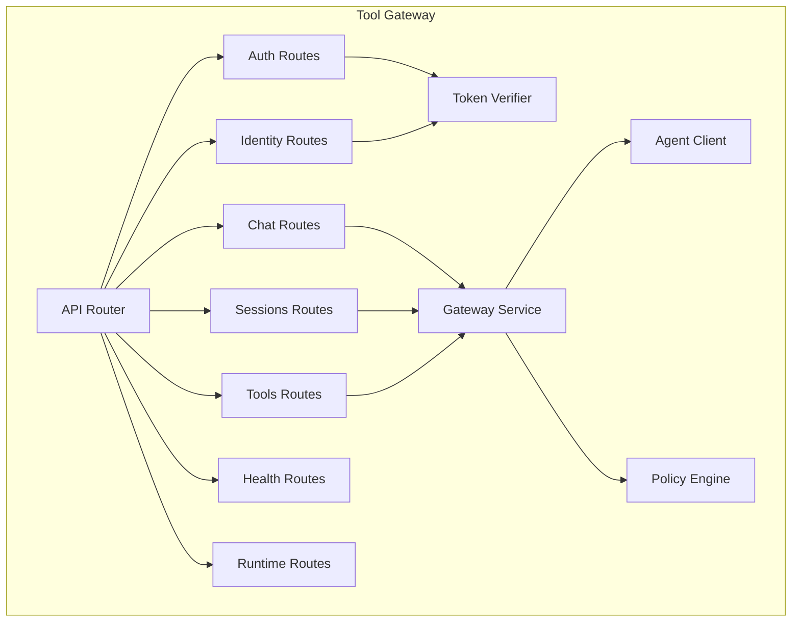
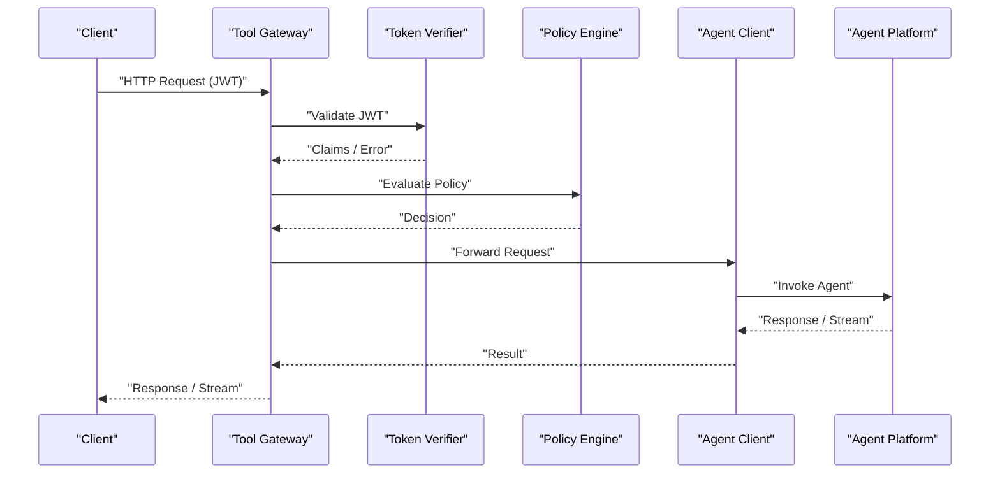
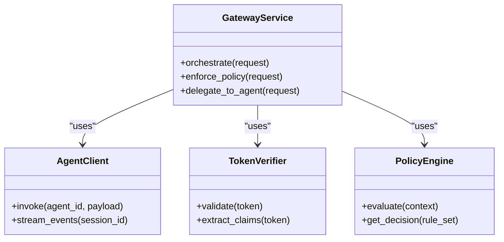

# API Endpoints and Authentication

<cite>
**Referenced Files in This Document**
- [main.py](file://products/tool-gateway/src/api_gateway/main.py)
- [app.py](file://products/tool-gateway/src/api_gateway/app.py)
- [router.py](file://products/tool-gateway/src/api_gateway/api/router.py)
- [routes.py](file://products/tool-gateway/src/api_gateway/api/routes/__init__.py)
- [auth.py](file://products/tool-gateway/src/api_gateway/api/routes/auth.py)
- [chat.py](file://products/tool-gateway/src/api_gateway/api/routes/chat.py)
- [sessions.py](file://products/tool-gateway/src/api_gateway/api/routes/sessions.py)
- [tools.py](file://products/tool-gateway/src/api_gateway/api/routes/tools.py)
- [identity.py](file://products/tool-gateway/src/api_gateway/api/routes/identity.py)
- [health.py](file://products/tool-gateway/src/api_gateway/api/routes/health.py)
- [runtime.py](file://products/tool-gateway/src/api_gateway/api/routes/runtime.py)
- [gateway_service.py](file://products/tool-gateway/src/api_gateway/services/gateway_service.py)
- [agent_client.py](file://products/tool-gateway/src/api_gateway/services/agent_client.py)
- [token_verifier.py](file://products/tool-gateway/src/api_gateway/services/token_verifier.py)
- [policy_engine.py](file://products/tool-gateway/src/api_gateway/services/policy_engine.py)
- [api.py](file://products/tool-gateway/src/api_gateway/schemas/api.py)
- [config.py](file://products/tool-gateway/src/api_gateway/core/config.py)
- [dependencies.py](file://products/tool-gateway/src/api_gateway/core/dependencies.py)
- [tool_invocation.schema.json](file://shared/shared-contracts/schemas/tool-invocation.schema.json)
- [tool_result.schema.json](file://shared/shared-contracts/schemas/tool-result.schema.json)
- [chat-request.schema.json](file://shared/shared-contracts/schemas/chat-request.schema.json)
- [chat-response.schema.json](file://shared/shared-contracts/schemas/chat-response.schema.json)
- [stream-event.schema.json](file://shared/shared-contracts/schemas/stream-event.schema.json)
- [session.schema.json](file://shared/shared-contracts/schemas/session.schema.json)
- [identity-token.schema.json](file://shared/shared-contracts/schemas/identity-token.schema.json)
- [identity-context.schema.json](file://shared/shared-contracts/schemas/identity-context.schema.json)
</cite>

## Table of Contents
1. [Introduction](#introduction)
2. [Project Structure](#project-structure)
3. [Core Components](#core-components)
4. [Architecture Overview](#architecture-overview)
5. [Detailed Component Analysis](#detailed-component-analysis)
6. [Dependency Analysis](#dependency-analysis)
7. [Performance Considerations](#performance-considerations)
8. [Troubleshooting Guide](#troubleshooting-guide)
9. [Conclusion](#conclusion)
10. [Appendices](#appendices)

## Introduction
This document provides comprehensive API documentation for the Tool Gateway Service, covering authentication, chat operations, tool invocation, session management, and health/runtime endpoints. It explains RESTful patterns, request/response schemas, JWT-based authentication, error handling conventions, WebSocket support for streaming and events, rate limiting, pagination, filtering, versioning strategies, client integration guidelines, and troubleshooting tips.

## Project Structure
The Tool Gateway Service is organized into:
- API routes under api/routes for HTTP endpoints (auth, chat, sessions, tools, identity, health, runtime).
- Services under services for business logic (gateway orchestration, agent client, token verification, policy enforcement).
- Schemas under schemas for shared Pydantic models and validation.
- Core configuration and dependencies under core.
- Shared contracts under shared/shared-contracts for JSON schema definitions used across services.

**Diagram sources**
- [router.py](file://products/tool-gateway/src/api_gateway/api/router.py)
- [auth.py](file://products/tool-gateway/src/api_gateway/api/routes/auth.py)
- [chat.py](file://products/tool-gateway/src/api_gateway/api/routes/chat.py)
- [sessions.py](file://products/tool-gateway/src/api_gateway/api/routes/sessions.py)
- [tools.py](file://products/tool-gateway/src/api_gateway/api/routes/tools.py)
- [identity.py](file://products/tool-gateway/src/api_gateway/api/routes/identity.py)
- [health.py](file://products/tool-gateway/src/api_gateway/api/routes/health.py)
- [runtime.py](file://products/tool-gateway/src/api_gateway/api/routes/runtime.py)
- [gateway_service.py](file://products/tool-gateway/src/api_gateway/services/gateway_service.py)
- [agent_client.py](file://products/tool-gateway/src/api_gateway/services/agent_client.py)
- [token_verifier.py](file://products/tool-gateway/src/api_gateway/services/token_verifier.py)
- [policy_engine.py](file://products/tool-gateway/src/api_gateway/services/policy_engine.py)

**Section sources**
- [main.py](file://products/tool-gateway/src/api_gateway/main.py)
- [app.py](file://products/tool-gateway/src/api_gateway/app.py)
- [router.py](file://products/tool-gateway/src/api_gateway/api/router.py)
- [routes.py](file://products/tool-gateway/src/api_gateway/api/routes/__init__.py)

## Core Components
- API Router: Registers all route groups and mounts middleware (auth, observability, metrics).
- Auth Routes: Handle token issuance/validation flows and expose identity context.
- Chat Routes: Provide REST and streaming endpoints for chat interactions with agents.
- Sessions Routes: Manage lifecycle and persistence of chat sessions.
- Tools Routes: Expose tool discovery and invocation endpoints.
- Identity Routes: Bridge to identity broker for token introspection and context enrichment.
- Health and Runtime Routes: Provide service health checks and runtime metadata.
- Services:
  - Gateway Service: Orchestrates requests, enforces policies, and delegates to agents.
  - Agent Client: Communicates with downstream agent platforms.
  - Token Verifier: Validates JWTs and extracts claims.
  - Policy Engine: Evaluates access control policies against requests.

**Section sources**
- [router.py](file://products/tool-gateway/src/api_gateway/api/router.py)
- [gateway_service.py](file://products/tool-gateway/src/api_gateway/services/gateway_service.py)
- [agent_client.py](file://products/tool-gateway/src/api_gateway/services/agent_client.py)
- [token_verifier.py](file://products/tool-gateway/src/api_gateway/services/token_verifier.py)
- [policy_engine.py](file://products/tool-gateway/src/api_gateway/services/policy_engine.py)

## Architecture Overview
The Tool Gateway Service acts as a secure, policy-enforced gateway between clients and agent platforms. Clients authenticate via JWT tokens issued by the identity broker. Requests are validated, authorized by policy, and forwarded to agents through the agent client. Streaming responses are supported over WebSockets or Server-Sent Events where applicable.

**Diagram sources**
- [auth.py](file://products/tool-gateway/src/api_gateway/api/routes/auth.py)
- [chat.py](file://products/tool-gateway/src/api_gateway/api/routes/chat.py)
- [tools.py](file://products/tool-gateway/src/api_gateway/api/routes/tools.py)
- [gateway_service.py](file://products/tool-gateway/src/api_gateway/services/gateway_service.py)
- [agent_client.py](file://products/tool-gateway/src/api_gateway/services/agent_client.py)
- [token_verifier.py](file://products/tool-gateway/src/api_gateway/services/token_verifier.py)
- [policy_engine.py](file://products/tool-gateway/src/api_gateway/services/policy_engine.py)

## Detailed Component Analysis

### Authentication and Identity
- JWT-based authentication: Clients must include a valid JWT in the Authorization header. The Token Verifier validates signatures, expiration, and scopes.
- Identity context: Identity routes provide endpoints to retrieve or refresh identity context and validate tokens.
- Security headers: Recommended to enforce HTTPS, CORS, and strict transport security at the gateway layer.

Key behaviors:
- Reject invalid or expired tokens with standardized error responses.
- Enforce scope-based authorization via policy engine before forwarding requests.
- Support token introspection for service-to-service calls.

**Section sources**
- [auth.py](file://products/tool-gateway/src/api_gateway/api/routes/auth.py)
- [identity.py](file://products/tool-gateway/src/api_gateway/api/routes/identity.py)
- [token_verifier.py](file://products/tool-gateway/src/api_gateway/services/token_verifier.py)
- [identity-token.schema.json](file://shared/shared-contracts/schemas/identity-token.schema.json)
- [identity-context.schema.json](file://shared/shared-contracts/schemas/identity-context.schema.json)

### Chat Operations
- REST endpoints: Submit chat messages and receive responses synchronously.
- Streaming: Real-time event streams using WebSockets or SSE for incremental updates.
- Session binding: Chat requests can be associated with a session ID for continuity.

Request/Response patterns:
- Chat request includes message content, optional parameters, and session context.
- Responses may be full text or streamed events containing partial results.

Error handling:
- Validation errors return structured error payloads with codes and messages.
- Rate-limited requests return appropriate status codes and retry-after hints.

**Section sources**
- [chat.py](file://products/tool-gateway/src/api_gateway/api/routes/chat.py)
- [chat-request.schema.json](file://shared/shared-contracts/schemas/chat-request.schema.json)
- [chat-response.schema.json](file://shared/shared-contracts/schemas/chat-response.schema.json)
- [stream-event.schema.json](file://shared/shared-contracts/schemas/stream-event.schema.json)

### Tool Invocation
- Discovery: List available tools and their capabilities.
- Invocation: Execute tools with typed parameters; results conform to tool result schema.
- Context: Tool execution inherits identity and policy decisions from the gateway.

Patterns:
- Use POST for invocations with request bodies validated against schemas.
- Return standardized success/error envelopes.

**Section sources**
- [tools.py](file://products/tool-gateway/src/api_gateway/api/routes/tools.py)
- [tool-invocation.schema.json](file://shared/shared-contracts/schemas/tool-invocation.schema.json)
- [tool-result.schema.json](file://shared/shared-contracts/schemas/tool-result.schema.json)

### Session Management
- Create, read, update, delete sessions.
- Persist session state for continuity across requests.
- Bind chat and tool invocations to sessions for auditability.

Lifecycle:
- Initialize session on first interaction.
- Extend TTL based on activity.
- Clean up expired sessions.

**Section sources**
- [sessions.py](file://products/tool-gateway/src/api_gateway/api/routes/sessions.py)
- [session.schema.json](file://shared/shared-contracts/schemas/session.schema.json)

### Health and Runtime
- Health endpoint: Returns service readiness and liveness status.
- Runtime metadata: Provides runtime configuration and environment details for diagnostics.

Usage:
- Probes for orchestrators (e.g., Kubernetes) use health endpoints.
- Operators query runtime metadata for debugging.

**Section sources**
- [health.py](file://products/tool-gateway/src/api_gateway/api/routes/health.py)
- [runtime.py](file://products/tool-gateway/src/api_gateway/api/routes/runtime.py)

### Versioning Strategy
- API versions are exposed via URL paths (e.g., /v1, /v2).
- Backward compatibility is maintained within major versions.
- Deprecation notices are included in responses when applicable.

**Section sources**
- [router.py](file://products/tool-gateway/src/api_gateway/api/router.py)
- [routes.py](file://products/tool-gateway/src/api_gateway/api/routes/__init__.py)

## Dependency Analysis
The gateway depends on:
- Token Verifier for JWT validation.
- Policy Engine for authorization decisions.
- Agent Client for downstream communication.
- Configuration and telemetry modules for runtime behavior and observability.

**Diagram sources**
- [gateway_service.py](file://products/tool-gateway/src/api_gateway/services/gateway_service.py)
- [agent_client.py](file://products/tool-gateway/src/api_gateway/services/agent_client.py)
- [token_verifier.py](file://products/tool-gateway/src/api_gateway/services/token_verifier.py)
- [policy_engine.py](file://products/tool-gateway/src/api_gateway/services/policy_engine.py)

**Section sources**
- [gateway_service.py](file://products/tool-gateway/src/api_gateway/services/gateway_service.py)
- [agent_client.py](file://products/tool-gateway/src/api_gateway/services/agent_client.py)
- [token_verifier.py](file://products/tool-gateway/src/api_gateway/services/token_verifier.py)
- [policy_engine.py](file://products/tool-gateway/src/api_gateway/services/policy_engine.py)

## Performance Considerations
- Connection pooling: Reuse HTTP connections to agents to reduce latency.
- Streaming: Prefer streaming for long-running operations to improve responsiveness.
- Caching: Cache immutable tool metadata and policy decisions where safe.
- Rate limiting: Apply per-client limits to protect backend resources.
- Pagination: Implement cursor-based pagination for large result sets.
- Filtering: Support query parameters to minimize payload sizes.

[No sources needed since this section provides general guidance]

## Troubleshooting Guide
Common issues and resolutions:
- Invalid JWT: Ensure token is signed correctly, not expired, and contains required scopes.
- Policy denial: Review policy rules and identity context; adjust permissions if necessary.
- Rate limiting: Observe Retry-After headers and implement exponential backoff.
- Streaming failures: Verify WebSocket handshake and network connectivity; handle reconnection.
- Session errors: Check session TTL and persistence backend availability.

Diagnostic steps:
- Inspect health and runtime endpoints for service status.
- Enable observability and telemetry to trace request flows.
- Validate request payloads against shared schemas.

**Section sources**
- [health.py](file://products/tool-gateway/src/api_gateway/api/routes/health.py)
- [runtime.py](file://products/tool-gateway/src/api_gateway/api/routes/runtime.py)
- [config.py](file://products/tool-gateway/src/api_gateway/core/config.py)
- [dependencies.py](file://products/tool-gateway/src/api_gateway/core/dependencies.py)

## Conclusion
The Tool Gateway Service provides a robust, secure, and extensible API surface for interacting with agent platforms. By leveraging JWT authentication, policy enforcement, and streaming capabilities, it enables reliable and efficient integrations. Adhering to the documented patterns and best practices ensures consistent and maintainable client implementations.

[No sources needed since this section summarizes without analyzing specific files]

## Appendices

### API Endpoints Summary
- Authentication:
  - POST /auth/token: Issue or refresh tokens.
  - GET /auth/verify: Validate token and return claims.
- Chat:
  - POST /chat: Send message and receive response.
  - WS /chat/stream: Real-time streaming of chat events.
- Sessions:
  - POST /sessions: Create session.
  - GET /sessions/{id}: Retrieve session.
  - PATCH /sessions/{id}: Update session.
  - DELETE /sessions/{id}: Delete session.
- Tools:
  - GET /tools: List available tools.
  - POST /tools/invoke: Invoke a tool with parameters.
- Identity:
  - GET /identity/context: Retrieve identity context.
  - POST /identity/introspect: Introspect token.
- Health and Runtime:
  - GET /health: Service health check.
  - GET /runtime/metadata: Runtime configuration and metadata.

[No sources needed since this section lists endpoints conceptually]

### Request/Response Schemas
- Chat Request: See [chat-request.schema.json](file://shared/shared-contracts/schemas/chat-request.schema.json)
- Chat Response: See [chat-response.schema.json](file://shared/shared-contracts/schemas/chat-response.schema.json)
- Stream Event: See [stream-event.schema.json](file://shared/shared-contracts/schemas/stream-event.schema.json)
- Tool Invocation: See [tool-invocation.schema.json](file://shared/shared-contracts/schemas/tool-invocation.schema.json)
- Tool Result: See [tool-result.schema.json](file://shared/shared-contracts/schemas/tool-result.schema.json)
- Session: See [session.schema.json](file://shared/shared-contracts/schemas/session.schema.json)
- Identity Token: See [identity-token.schema.json](file://shared/shared-contracts/schemas/identity-token.schema.json)
- Identity Context: See [identity-context.schema.json](file://shared/shared-contracts/schemas/identity-context.schema.json)

[No sources needed since this section references schemas without analyzing code]

### Client Implementation Guidelines
- Use HTTPS and enforce certificate validation.
- Include Authorization header with valid JWT.
- Implement retries with exponential backoff for transient errors.
- Handle streaming events incrementally and manage connection lifecycle.
- Respect rate limit headers and pagination cursors.
- Validate responses against shared schemas.

[No sources needed since this section provides general guidance]

### SDK Usage
- Initialize SDK with base URL and credentials.
- Authenticate using provided methods to obtain tokens.
- Call chat, sessions, and tools endpoints via SDK abstractions.
- Subscribe to streaming events for real-time updates.
- Configure observability and telemetry as needed.

[No sources needed since this section provides general guidance]