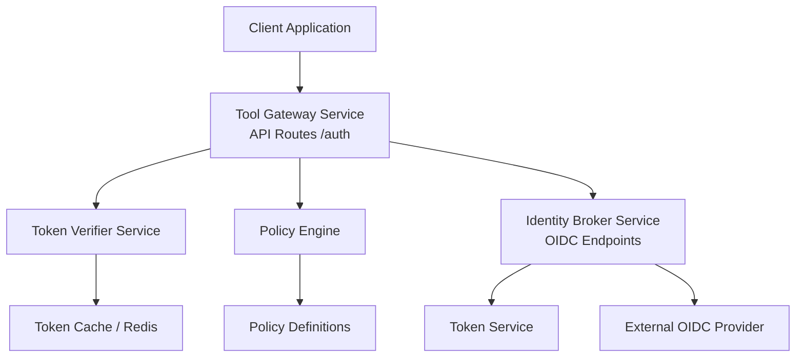
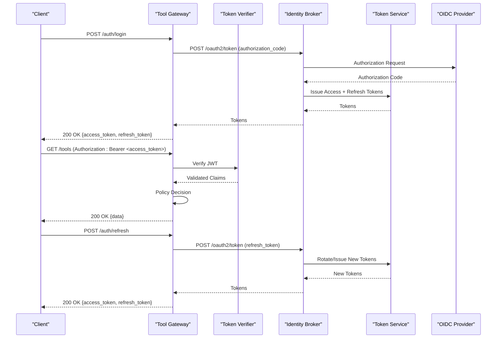
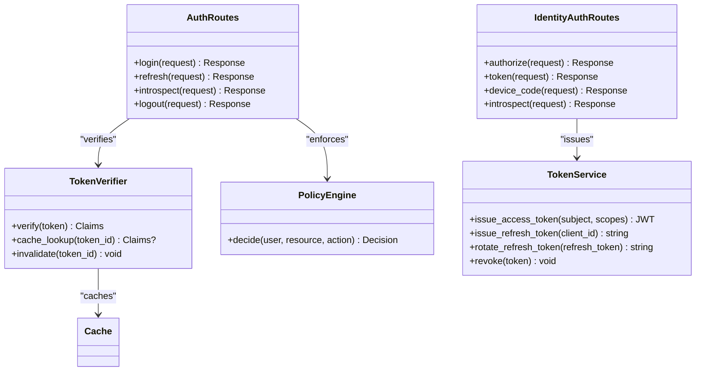

# Authentication API

<cite>
**Referenced Files in This Document**
- [auth.py](file://products/tool-gateway/src/api_gateway/api/routes/auth.py)
- [token_verifier.py](file://products/tool-gateway/src/api_gateway/services/token_verifier.py)
- [api.py](file://products/tool-gateway/src/api_gateway/schemas/api.py)
- [auth.py](file://products/identity-broker/src/identity_service/api/routes/auth.py)
- [token_service.py](file://products/identity-broker/src/identity_service/services/token_service.py)
- [auth.py](file://products/identity-broker/src/identity_service/schemas/auth.py)
- [router.py](file://products/tool-gateway/src/api_gateway/api/router.py)
- [config.py](file://products/tool-gateway/src/api_gateway/core/config.py)
- [dependencies.py](file://products/tool-gateway/src/api_gateway/core/dependencies.py)
</cite>

## Table of Contents
1. [Introduction](#introduction)
2. [Project Structure](#project-structure)
3. [Core Components](#core-components)
4. [Architecture Overview](#architecture-overview)
5. [Detailed Component Analysis](#detailed-component-analysis)
6. [Dependency Analysis](#dependency-analysis)
7. [Performance Considerations](#performance-considerations)
8. [Troubleshooting Guide](#troubleshooting-guide)
9. [Conclusion](#conclusion)
10. [Appendices](#appendices)

## Introduction
This document provides detailed API documentation for authentication endpoints in the Tool Gateway Service. It covers JWT token generation, validation, refresh mechanisms, OIDC integration, token verification, session establishment, request/response schemas, error codes, security considerations, and practical client implementation examples. It also addresses token lifecycle management, expiration handling, and security best practices.

## Project Structure
The authentication functionality spans two primary services:
- Tool Gateway Service: Exposes public-facing authentication routes and enforces policy-based access control using tokens.
- Identity Broker Service: Implements OIDC flows, token issuance, validation, and refresh logic.

**Diagram sources**
- [auth.py](file://products/tool-gateway/src/api_gateway/api/routes/auth.py)
- [token_verifier.py](file://products/tool-gateway/src/api_gateway/services/token_verifier.py)
- [auth.py](file://products/identity-broker/src/identity_service/api/routes/auth.py)
- [token_service.py](file://products/identity-broker/src/identity_service/services/token_service.py)

**Section sources**
- [router.py](file://products/tool-gateway/src/api_gateway/api/router.py)
- [config.py](file://products/tool-gateway/src/api_gateway/core/config.py)

## Core Components
- Authentication Routes (Tool Gateway): Define endpoints for login, token exchange, refresh, and introspection. They validate incoming requests, delegate token verification to the Token Verifier, and enforce policies via the Policy Engine.
- Token Verifier: Validates JWTs against issuer metadata, checks signatures, scopes, audience, and expiration; caches results for performance.
- Identity Broker Routes: Implement OIDC authorization code flow, device code flow, and token endpoint operations.
- Token Service: Issues access tokens (JWT), refresh tokens, handles rotation, revocation, and introspection responses.

Key responsibilities:
- Secure credential handling and OIDC provider integration
- Token issuance with appropriate claims and lifetimes
- Verification and caching strategies
- Session establishment and state management
- Error modeling and consistent response formats

**Section sources**
- [auth.py](file://products/tool-gateway/src/api_gateway/api/routes/auth.py)
- [token_verifier.py](file://products/tool-gateway/src/api_gateway/services/token_verifier.py)
- [auth.py](file://products/identity-broker/src/identity_service/api/routes/auth.py)
- [token_service.py](file://products/identity-broker/src/identity_service/services/token_service.py)

## Architecture Overview
The authentication architecture follows a layered approach:
- Clients interact with Tool Gateway endpoints for user-facing operations.
- Tool Gateway delegates token verification to an internal service and enforces policies.
- Identity Broker manages OIDC flows and token lifecycle.
- External OIDC providers are used for identity federation when configured.

**Diagram sources**
- [auth.py](file://products/tool-gateway/src/api_gateway/api/routes/auth.py)
- [token_verifier.py](file://products/tool-gateway/src/api_gateway/services/token_verifier.py)
- [auth.py](file://products/identity-broker/src/identity_service/api/routes/auth.py)
- [token_service.py](file://products/identity-broker/src/identity_service/services/token_service.py)

## Detailed Component Analysis

### Authentication Routes (Tool Gateway)
Endpoints exposed by Tool Gateway include:
- Login: Accepts credentials or authorization code, returns tokens.
- Refresh: Accepts refresh token, rotates and returns new tokens.
- Introspection: Validates tokens server-side for downstream services.
- Logout: Revokes tokens and invalidates sessions.

Request/Response Schemas:
- Login Request:
  - grant_type: string (required)
  - code: string (optional, authorization code)
  - client_id: string (required)
  - client_secret: string (required)
  - redirect_uri: string (optional)
- Login Response:
  - access_token: string (JWT)
  - token_type: string ("Bearer")
  - expires_in: integer (seconds)
  - refresh_token: string
  - scope: string (space-delimited)
- Refresh Request:
  - grant_type: string ("refresh_token")
  - refresh_token: string
  - client_id: string
  - client_secret: string
- Refresh Response:
  - access_token: string
  - token_type: string
  - expires_in: integer
  - refresh_token: string
  - scope: string
- Introspection Request:
  - token: string
  - token_type_hint: string (optional)
- Introspection Response:
  - active: boolean
  - sub: string
  - aud: array<string>
  - exp: integer
  - iat: integer
  - scope: string

Error Codes:
- 400 Bad Request: Invalid parameters or malformed payload
- 401 Unauthorized: Missing or invalid credentials/tokens
- 403 Forbidden: Insufficient scopes or policy denial
- 404 Not Found: Unknown client or endpoint
- 409 Conflict: Duplicate authorization code usage
- 429 Too Many Requests: Rate limiting exceeded
- 500 Internal Server Error: Unexpected failures

Security Considerations:
- Enforce HTTPS for all endpoints
- Validate client_id and client_secret using PKCE where applicable
- Limit token lifetimes and enforce refresh rotation
- Reject expired or revoked tokens immediately
- Log authentication events without sensitive data

**Section sources**
- [auth.py](file://products/tool-gateway/src/api_gateway/api/routes/auth.py)
- [api.py](file://products/tool-gateway/src/api_gateway/schemas/api.py)

### Token Verifier Service
Responsibilities:
- Decode and verify JWT signature using issuer’s public keys
- Validate claims: iss, aud, exp, nbf, scope, sub
- Cache verified tokens to reduce external calls
- Return standardized validated claims to callers

Complexity:
- Decoding and signature verification: O(1) per token
- Cache lookup: O(1) average case
- Memory usage proportional to cache size

Optimization Opportunities:
- Use short-lived access tokens with refresh rotation
- Implement LRU cache with TTL for verified tokens
- Batch key retrieval from JWKS endpoint

Error Handling:
- InvalidSignature: Reject token with 401
- ExpiredToken: Redirect to refresh flow
- InvalidAudience: Reject with 403
- MissingClaims: Reject with 400

**Section sources**
- [token_verifier.py](file://products/tool-gateway/src/api_gateway/services/token_verifier.py)

### Identity Broker Routes and Token Service
OIDC Integration:
- Authorization Endpoint: Handles authorization code flow
- Token Endpoint: Issues and refreshes tokens
- Device Code Endpoint: Supports headless clients
- Introspection Endpoint: Validates tokens server-side

Token Lifecycle Management:
- Issuance: Generate JWT access tokens with minimal claims
- Rotation: Replace refresh tokens on each use
- Revocation: Support token blacklist or immediate invalidation
- Expiration: Enforce strict expiry checks during verification

Session Establishment:
- Create session state tied to refresh token
- Persist session metadata in secure storage
- Invalidate sessions on logout or suspicious activity

Practical Client Implementation Examples:
- Obtain Access Token:
  - Perform authorization code flow with PKCE
  - Exchange code for tokens at /oauth2/token
  - Store tokens securely and attach to subsequent requests
- Use Access Token:
  - Include Authorization header: Bearer <access_token>
  - Handle 401 responses by refreshing token
- Refresh Token Flow:
  - POST /oauth2/token with grant_type=refresh_token
  - Rotate refresh token and update stored values
- Logout:
  - Call /logout to revoke tokens and clear session

**Section sources**
- [auth.py](file://products/identity-broker/src/identity_service/api/routes/auth.py)
- [token_service.py](file://products/identity-broker/src/identity_service/services/token_service.py)
- [auth.py](file://products/identity-broker/src/identity_service/schemas/auth.py)

### Configuration and Dependencies
Configuration Options:
- OIDC Provider URLs: authorization_endpoint, token_endpoint, jwks_uri
- Client Credentials: client_id, client_secret, redirect_uris
- Token Settings: access_token_ttl, refresh_token_ttl, signing_algorithm
- Cache Settings: token_cache_ttl, max_entries
- Security Flags: require_pkce, enforce_https_only

Dependencies:
- HTTP Client for OIDC Provider communication
- Cryptographic libraries for JWT verification
- Cache backend (Redis or in-memory)
- Policy Engine for authorization decisions

**Section sources**
- [config.py](file://products/tool-gateway/src/api_gateway/core/config.py)
- [dependencies.py](file://products/tool-gateway/src/api_gateway/core/dependencies.py)

## Dependency Analysis
The authentication system has clear separation of concerns:
- Tool Gateway depends on Token Verifier and Policy Engine
- Identity Broker depends on Token Service and external OIDC Provider
- Token Verifier depends on cryptographic libraries and cache
- All components depend on configuration and observability utilities

**Diagram sources**
- [auth.py](file://products/tool-gateway/src/api_gateway/api/routes/auth.py)
- [token_verifier.py](file://products/tool-gateway/src/api_gateway/services/token_verifier.py)
- [auth.py](file://products/identity-broker/src/identity_service/api/routes/auth.py)
- [token_service.py](file://products/identity-broker/src/identity_service/services/token_service.py)

**Section sources**
- [router.py](file://products/tool-gateway/src/api_gateway/api/router.py)
- [config.py](file://products/tool-gateway/src/api_gateway/core/config.py)

## Performance Considerations
- Token Verification Latency: Minimize by caching verified tokens and using efficient cryptographic operations
- Cache Hit Ratio: Optimize TTL settings and cache size to balance memory usage and performance
- Network Calls: Reduce OIDC provider calls by caching JWKS keys and validating locally
- Concurrency: Use async I/O for token verification and refresh operations
- Monitoring: Track verification success rates, cache hit ratios, and latency percentiles

[No sources needed since this section provides general guidance]

## Troubleshooting Guide
Common Issues and Resolutions:
- Invalid Signature Errors:
  - Check issuer configuration and JWKS endpoint availability
  - Ensure correct signing algorithm is configured
- Expired Token Errors:
  - Implement automatic refresh before expiration
  - Extend token TTL if necessary for long-running operations
- Scope Denial Errors:
  - Verify requested scopes match client permissions
  - Update client registration to include required scopes
- Rate Limiting:
  - Implement exponential backoff for retry logic
  - Monitor rate limit headers and adjust client behavior

Debugging Steps:
- Enable detailed logging for authentication flows
- Inspect token contents using JWT decoders (without secrets)
- Test OIDC provider connectivity and metadata endpoints
- Validate client credentials and redirect URIs

**Section sources**
- [token_verifier.py](file://products/tool-gateway/src/api_gateway/services/token_verifier.py)
- [token_service.py](file://products/identity-broker/src/identity_service/services/token_service.py)

## Conclusion
The Tool Gateway Service provides a robust authentication framework integrating with OIDC providers through the Identity Broker. The system implements secure token management with verification, caching, and policy enforcement. Proper client implementation following the documented flows ensures reliable and secure access to protected resources. Regular monitoring and adherence to security best practices maintain system integrity and performance.

[No sources needed since this section summarizes without analyzing specific files]

## Appendices

### Security Best Practices
- Always use HTTPS for all authentication endpoints
- Implement PKCE for public clients
- Set appropriate token lifetimes (short-lived access tokens)
- Rotate refresh tokens on each use
- Validate all token claims thoroughly
- Log authentication events without sensitive data
- Implement rate limiting and brute force protection
- Regularly rotate signing keys and client secrets

### Token Lifecycle Management
- Access Token: Short-lived (5-15 minutes), used for API calls
- Refresh Token: Longer-lived (days to months), used to obtain new access tokens
- Session State: Tied to refresh token, managed by Identity Broker
- Revocation: Immediate invalidation upon logout or security events

### Error Code Reference
- 400: Invalid request parameters or malformed payloads
- 401: Missing or invalid credentials/tokens
- 403: Insufficient permissions or policy violations
- 404: Resource not found
- 409: Conflicting requests (e.g., duplicate authorization codes)
- 429: Rate limit exceeded
- 500: Internal server errors

[No sources needed since this section provides general guidance]