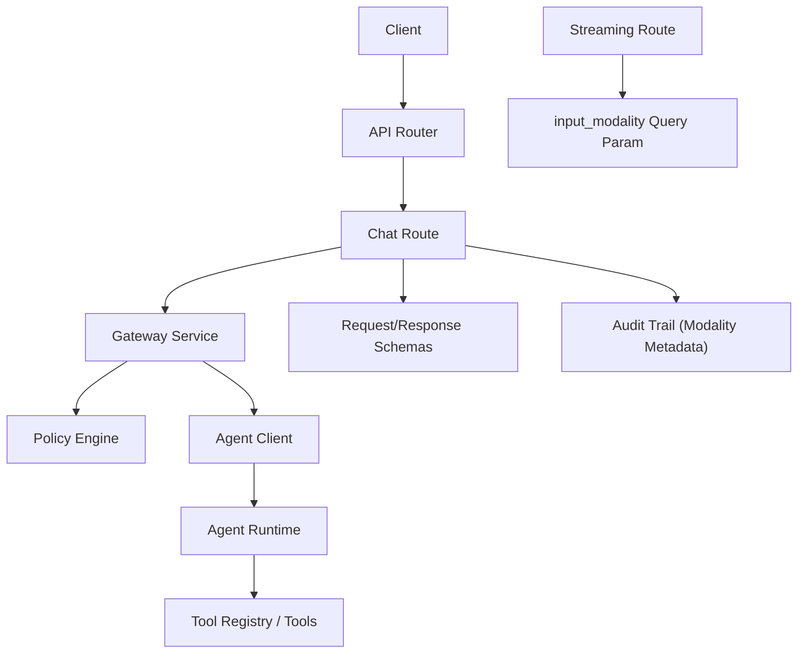
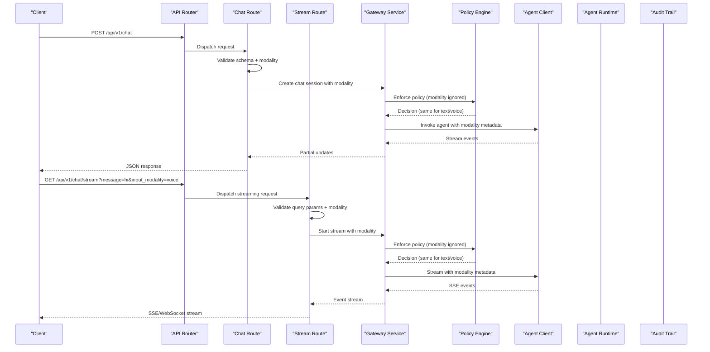
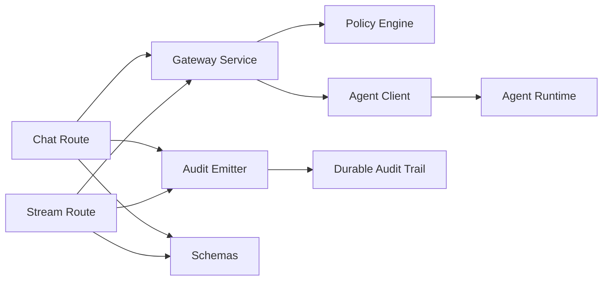

# Chat API

<cite>
**Referenced Files in This Document**
- [chat.py](file://products/platform-gateway/src/platform_gateway/api/routes/chat.py)
- [api.py](file://products/platform-gateway/src/platform_gateway/schemas/api.py)
- [gateway_service.py](file://products/tool-gateway/src/tool_gateway/services/gateway_service.py)
- [agent_client.py](file://products/platform-gateway/src/platform_gateway/services/agent_client.py)
- [policy_engine.py](file://products/tool-gateway/src/tool_gateway/services/policy_engine.py)
- [token_verifier.py](file://products/tool-gateway/src/tool_gateway/services/token_verifier.py)
- [router.py](file://products/tool-gateway/src/tool_gateway/api/router.py)
- [app.py](file://tool-gateway/src/tool_gateway/app.py)
- [main.py](file://tool-gateway/src/tool_gateway/main.py)
- [chat-request.schema.json](file://shared/shared-contracts/schemas/chat-request.schema.json)
- [chat-response.schema.json](file://shared/shared-contracts/schemas/chat-response.schema.json)
- [stream-event.schema.json](file://shared/shared-contracts/schemas/stream-event.schema.json)
- [tool-invocation.schema.json](file://shared/shared-contracts/schemas/tool-invocation.schema.json)
- [tool-result.schema.json](file://shared/shared-contracts/schemas/tool-result.schema.json)
- [v2.py](file://products/agent-platform/src/agent_service/schemas/v2.py)
- [test_session_workspace.py](file://products/platform-gateway/tests/test_session_workspace.py)
- [test_chat_stream_modality.py](file://products/platform-gateway/tests/test_chat_stream_modality.py)
</cite>

## Update Summary
**Changes Made**
- Enhanced streaming endpoint documentation to include new `input_modality` query parameter (text|voice) with default text value
- Updated WebSocket streaming section to document voice modality support for real-time responses
- Added examples demonstrating modality propagation through streaming endpoints
- Updated error scenarios to include modality validation failures for streaming requests
- Enhanced security considerations to address voice-readiness contract implementation

## Table of Contents
1. [Introduction](#introduction)
2. [Project Structure](#project-structure)
3. [Core Components](#core-components)
4. [Architecture Overview](#architecture-overview)
5. [Detailed Component Analysis](#detailed-component-analysis)
6. [Voice-Readiness Contract](#voice-readiness-contract)
7. [Dependency Analysis](#dependency-analysis)
8. [Performance Considerations](#performance-considerations)
9. [Troubleshooting Guide](#troubleshooting-guide)
10. [Conclusion](#conclusion)

## Introduction
This document provides comprehensive API documentation for the chat endpoints exposed by the Tool Gateway Service. It covers RESTful request/response patterns, WebSocket streaming for real-time responses, and message formatting. It also details the enhanced chat request schema including agent selection, conversation context, tool invocation parameters, and the new voice-readiness contract with optional `input_modality` field. The streaming endpoint now supports both synchronous and asynchronous interactions with modality-aware processing while maintaining backward compatibility. Examples are provided for both synchronous and asynchronous chat interactions, along with guidance on rate limiting, message size limits, and performance optimization.

## Project Structure
The Tool Gateway Service exposes chat functionality through HTTP routes that delegate to a gateway service, which interacts with an agent client and enforces policies. Schemas for requests, responses, and streaming events are defined in shared contracts. The system now supports voice-readiness with modality metadata that flows through the audit trail while maintaining security invariants. The streaming endpoint has been enhanced to accept an `input_modality` query parameter for parity with the POST endpoint.

**Diagram sources**
- [chat.py:36-86](file://products/platform-gateway/src/platform_gateway/api/routes/chat.py#L36-L86)
- [chat.py:90-143](file://products/platform-gateway/src/platform_gateway/api/routes/chat.py#L90-L143)
- [api.py:9-20](file://products/platform-gateway/src/platform_gateway/schemas/api.py#L9-L20)
- [agent_client.py:92-114](file://products/platform-gateway/src/platform_gateway/services/agent_client.py#L92-L114)

**Section sources**
- [chat.py:36-86](file://products/platform-gateway/src/platform_gateway/api/routes/chat.py#L36-L86)
- [chat.py:90-143](file://products/platform-gateway/src/platform_gateway/api/routes/chat.py#L90-L143)
- [api.py:9-20](file://products/platform-gateway/src/platform_gateway/schemas/api.py#L9-L20)
- [agent_client.py:92-114](file://products/platform-gateway/src/platform_gateway/services/agent_client.py#L92-L114)

## Core Components
- Chat Route: Defines REST endpoints for chat requests and WebSocket streaming with enhanced modality support.
- Streaming Route: Enhanced GET endpoint for real-time streaming with `input_modality` query parameter support.
- Gateway Service: Orchestrates policy checks, session management, and calls to the agent runtime with modality propagation.
- Agent Client: Communicates with the agent runtime over HTTP or streaming protocols, forwarding modality as metadata.
- Policy Engine: Enforces access control and usage policies for chat operations (modality does not affect policy decisions).
- Token Verifier: Validates authentication tokens for secure access.
- Schemas: Define request/response structures and streaming event formats with voice-readiness support.

Key responsibilities:
- Validate incoming chat requests against schemas including modality validation.
- Enforce policies before invoking agents (modality is metadata only, never decision-bearing).
- Stream partial responses via WebSocket events with modality awareness.
- Aggregate final results into structured responses.
- Propagate modality through audit trail for observability without affecting security.

**Updated** Enhanced streaming route now accepts `input_modality` query parameter with default "text" value

**Section sources**
- [chat.py:36-86](file://products/platform-gateway/src/platform_gateway/api/routes/chat.py#L36-L86)
- [chat.py:90-143](file://products/platform-gateway/src/platform_gateway/api/routes/chat.py#L90-L143)
- [gateway_service.py:121-153](file://products/tool-gateway/src/tool_gateway/services/gateway_service.py#L121-L153)
- [agent_client.py:92-114](file://products/platform-gateway/src/platform_gateway/services/agent_client.py#L92-L114)
- [api.py:9-20](file://products/platform-gateway/src/platform_gateway/schemas/api.py#L9-L20)

## Architecture Overview
The chat flow involves routing HTTP requests to the chat endpoint, validating inputs including modality, enforcing policies, invoking the agent runtime, and returning either a complete response or streaming partial updates. For streaming requests, the `input_modality` query parameter is validated and propagated through the entire request lifecycle as metadata only, never affecting policy decisions or security outcomes.

**Diagram sources**
- [chat.py:36-86](file://products/platform-gateway/src/platform_gateway/api/routes/chat.py#L36-L86)
- [chat.py:90-143](file://products/platform-gateway/src/platform_gateway/api/routes/chat.py#L90-L143)
- [agent_client.py:92-114](file://products/platform-gateway/src/platform_gateway/services/agent_client.py#L92-L114)
- [agent_client.py:117-144](file://products/platform-gateway/src/platform_gateway/services/agent_client.py#L117-L144)

## Detailed Component Analysis

### Chat Endpoints
- REST Endpoint: POST /api/v1/chat accepts a chat request and returns a JSON response with enhanced modality support.
- WebSocket Endpoint: GET /api/v1/chat/stream establishes a real-time connection for streaming partial responses with `input_modality` query parameter.

Enhanced Request Schema:
- agent_id: Identifier for the target agent.
- messages: Array of conversation messages with role and content.
- tools: Optional list of tool invocation parameters.
- session_id: Optional identifier for conversation continuity.
- metadata: Optional key-value pairs for tracing and analytics.
- **input_modality**: Optional field with enum values ["text", "voice"], defaults to "text". Voice-readiness contract ensures this is metadata only and never affects policy decisions.

Streaming Request Parameters:
- message: Required string parameter containing the user's message.
- session_id: Optional string parameter for conversation continuity.
- **input_modality**: Optional query parameter with enum values ["text", "voice"], defaults to "text". Validated at FastAPI level before route execution.

Response Schema:
- id: Unique response identifier.
- created_at: Timestamp of response creation.
- choices: Array of generated content items.
- usage: Token usage statistics.
- error: Error details if applicable.

Streaming Events:
- delta: Partial content update.
- tool_call: Tool invocation details.
- tool_result: Result from tool execution.
- done: Indicates completion of the stream.

Error Scenarios:
- Invalid request schema including unknown modality values.
- Policy denial (unaffected by modality).
- Authentication failure.
- Agent runtime errors.
- **Streaming Validation Errors**: Invalid `input_modality` query parameter values rejected with 422 status.

**Updated** Enhanced with voice-readiness contract, modality validation, and streaming endpoint support

**Section sources**
- [chat.py:36-86](file://products/platform-gateway/src/platform_gateway/api/routes/chat.py#L36-L86)
- [chat.py:90-143](file://products/platform-gateway/src/platform_gateway/api/routes/chat.py#L90-L143)
- [api.py:9-20](file://products/platform-gateway/src/platform_gateway/schemas/api.py#L9-L20)
- [chat-request.schema.json:26-31](file://shared/shared-contracts/schemas/chat-request.schema.json#L26-L31)

### Streaming Endpoint Implementation
The streaming endpoint (`GET /api/v1/chat/stream`) has been enhanced with voice-readiness support:

Query Parameters:
- `message`: Required - The user's message to process
- `session_id`: Optional - Session identifier for conversation continuity  
- `input_modality`: Optional - Input modality ("text"|"voice"), defaults to "text"

Processing Flow:
1. Request validation with FastAPI Literal type checking for `input_modality`
2. Identity resolution and policy enforcement (modality ignored for decisions)
3. Delegation token acquisition
4. Logging and audit event emission with modality metadata
5. Streaming response generation with modality propagation

Security Invariants:
- Modality is metadata only - never affects policy decisions
- Unknown modality values rejected at FastAPI validation layer (422 status)
- Backward compatible - defaults to "text" when not specified
- Complete audit trail with modality information for observability

**Updated** New streaming endpoint with full voice-readiness parity to POST endpoint

**Section sources**
- [chat.py:90-143](file://products/platform-gateway/src/platform_gateway/api/routes/chat.py#L90-L143)
- [test_chat_stream_modality.py:80-116](file://products/platform-gateway/tests/test_chat_stream_modality.py#L80-L116)

### Gateway Service
The gateway service orchestrates chat operations by:
- Validating and transforming requests including modality validation.
- Checking policies for authorization and rate limiting (modality does not affect policy decisions).
- Managing sessions for conversation context.
- Invoking the agent client for processing with modality metadata.
- Handling streaming events and aggregating results.
- Emitting audit events with modality information for observability.

**Updated** Now handles modality propagation through the entire request lifecycle while maintaining security invariants for both sync and streaming endpoints

**Section sources**
- [gateway_service.py:121-153](file://products/tool-gateway/src/tool_gateway/services/gateway_service.py#L121-L153)
- [gateway_service.py:389-430](file://products/platform-gateway/src/platform_gateway/services/gateway_service.py#L389-L430)

### Agent Client
The agent client communicates with the agent runtime using:
- HTTP requests for synchronous responses with modality metadata.
- Streaming connections for real-time updates with modality query parameters.
- Error handling and retries for robustness.
- Modality propagation as metadata only (never affects downstream behavior).

**Updated** Now forwards input_modality as metadata to agent runtime per SPEC-022 R-2 and SPEC-023 R-4

**Section sources**
- [agent_client.py:92-114](file://products/platform-gateway/src/platform_gateway/services/agent_client.py#L92-L114)
- [agent_client.py:117-144](file://products/platform-gateway/src/platform_gateway/services/agent_client.py#L117-L144)

### Policy Engine
The policy engine enforces:
- Access control based on user roles and permissions (modality has no effect).
- Rate limiting and quota enforcement.
- Custom rules for tool invocation and data access.
- Security invariants ensuring modality cannot be used for privilege escalation.

**Updated** Maintains security invariant that modality never affects policy decisions for both sync and streaming endpoints

**Section sources**
- [policy_engine.py:121-153](file://products/tool-gateway/src/tool_gateway/services/policy_engine.py#L121-L153)

### Token Verifier
The token verifier ensures:
- JWT validation and expiration checks.
- Scope verification for API access.
- Secure context propagation.

**Section sources**
- [token_verifier.py:58-118](file://products/tool-gateway/src/tool_gateway/services/token_verifier.py#L58-L118)

## Voice-Readiness Contract

The voice-readiness contract (SPEC-022 R-2, SPEC-023 R-4) establishes critical security invariants for modality handling across all endpoints:

### Core Principles
1. **Metadata Only**: Input modality is metadata only and never changes policy, auto-allow, or HITL outcomes.
2. **Security Invariant**: Modality can never approve or deny a parked confirmation.
3. **Identical Behavior**: Text and voice inputs follow identical policy paths and produce identical results.
4. **Audit Trail**: Modality flows through the audit trail for observability but never affects security decisions.

### Streaming Endpoint Implementation
- **Query Parameter**: `input_modality` accepts "text"|"voice" with default "text"
- **Validation**: FastAPI Literal type validation rejects unknown values with 422 status
- **Propagation**: Modality forwarded to agent runtime as query parameter
- **Backward Compatibility**: Existing clients without modality parameter continue working

### Security Guarantees
- No privilege escalation through input modality manipulation
- Consistent behavior across different input modalities
- Complete audit trail for compliance and debugging
- Prevention of modality-based bypass attempts
- Streaming parity with POST endpoint behavior

**Updated** Extended to cover streaming endpoint implementation and validation

**Section sources**
- [chat-request.schema.json:26-31](file://shared/shared-contracts/schemas/chat-request.schema.json#L26-L31)
- [chat.py:67-78](file://products/platform-gateway/src/platform_gateway/api/routes/chat.py#L67-L78)
- [chat.py:90-143](file://products/platform-gateway/src/platform_gateway/api/routes/chat.py#L90-L143)
- [test_chat_stream_modality.py:80-116](file://products/platform-gateway/tests/test_chat_stream_modality.py#L80-L116)

## Dependency Analysis
The chat system has clear dependencies between components with enhanced modality support:
- Chat route depends on gateway service, schemas, and audit emitter for modality logging.
- Streaming route depends on gateway service with enhanced modality query parameter handling.
- Gateway service depends on policy engine, agent client, and session management with modality propagation.
- Agent client depends on agent runtime and network libraries, forwarding modality as metadata.
- Policy engine depends on configuration and rule definitions, ignoring modality for decisions.

**Diagram sources**
- [chat.py:36-86](file://products/platform-gateway/src/platform_gateway/api/routes/chat.py#L36-L86)
- [chat.py:90-143](file://products/platform-gateway/src/platform_gateway/api/routes/chat.py#L90-L143)
- [agent_client.py:92-114](file://products/platform-gateway/src/platform_gateway/services/agent_client.py#L92-L114)
- [agent_client.py:117-144](file://products/platform-gateway/src/platform_gateway/services/agent_client.py#L117-L144)
- [gateway_service.py:389-430](file://products/platform-gateway/src/platform_gateway/services/gateway_service.py#L389-L430)

**Section sources**
- [chat.py:36-86](file://products/platform-gateway/src/platform_gateway/api/routes/chat.py#L36-L86)
- [chat.py:90-143](file://products/platform-gateway/src/platform_gateway/api/routes/chat.py#L90-L143)
- [gateway_service.py:389-430](file://products/platform-gateway/src/platform_gateway/services/gateway_service.py#L389-L430)
- [agent_client.py:92-114](file://products/platform-gateway/src/platform_gateway/services/agent_client.py#L92-L114)
- [agent_client.py:117-144](file://products/platform-gateway/src/platform_gateway/services/agent_client.py#L117-L144)

## Performance Considerations
- Use WebSocket streaming for long-running operations to reduce latency.
- Implement request batching for multiple tool invocations.
- Cache frequently accessed agent configurations.
- Monitor and optimize network timeouts and retry logic.
- Apply rate limiting at the gateway level to prevent overload.
- **Modality Impact**: Modality processing adds minimal overhead as it's handled as metadata only.
- **Streaming Performance**: Streaming endpoint maintains low latency with efficient SSE handling.
- **Audit Trail**: Durable audit logging may add slight latency but provides essential compliance capabilities.
- **Backward Compatibility**: Default modality behavior ensures existing clients continue working without changes.

## Troubleshooting Guide
Common issues and resolutions:
- Authentication failures: Verify token validity and scopes.
- Policy denials: Check user permissions and custom rules (modality should not affect these).
- Streaming interruptions: Implement reconnection logic and handle partial responses.
- Agent runtime errors: Log detailed error messages and implement fallback strategies.
- **Modality Validation Errors**: Ensure input_modality is either "text" or "voice"; unknown values will be rejected with 422 status.
- **Streaming Validation Errors**: Check FastAPI validation errors for invalid query parameters.
- **Audit Trail Issues**: Verify audit service connectivity and storage backend availability.
- **Backward Compatibility**: Existing clients without modality parameter continue working with default "text" behavior.

**Updated** Added streaming-specific troubleshooting guidance and validation error handling

**Section sources**
- [token_verifier.py:58-118](file://products/tool-gateway/src/tool_gateway/services/token_verifier.py#L58-L118)
- [policy_engine.py:121-153](file://products/tool-gateway/src/tool_gateway/services/policy_engine.py#L121-L153)
- [agent_client.py:92-114](file://products/platform-gateway/src/platform_gateway/services/agent_client.py#L92-L114)
- [test_chat_stream_modality.py:103-116](file://products/platform-gateway/tests/test_chat_stream_modality.py#L103-L116)

## Conclusion
The Tool Gateway Service provides a robust chat API with support for both synchronous and asynchronous interactions, enhanced with voice-readiness capabilities. By leveraging WebSocket streaming, policy enforcement, well-defined schemas, and the voice-readiness contract, it enables efficient and secure communication with agent runtimes while maintaining strict security invariants. The enhanced modality support allows for future voice-based interactions without compromising security or altering existing behavior. The new streaming endpoint provides parity with the POST endpoint, enabling real-time voice-enabled conversations while maintaining backward compatibility. Proper implementation of error handling, rate limiting, performance optimizations, and the voice-readiness contract ensures reliable operation in production environments while providing comprehensive audit trails for compliance and debugging purposes.