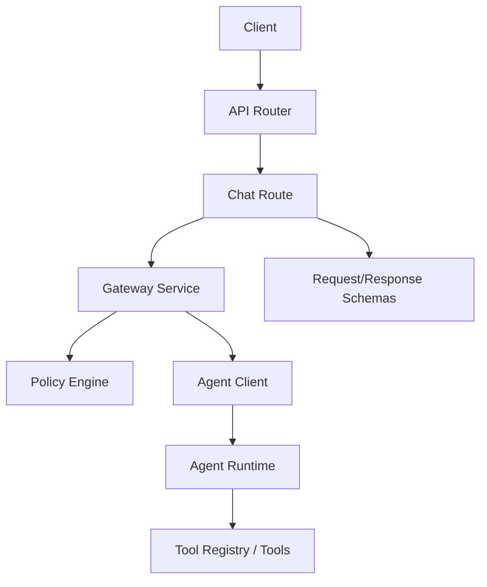
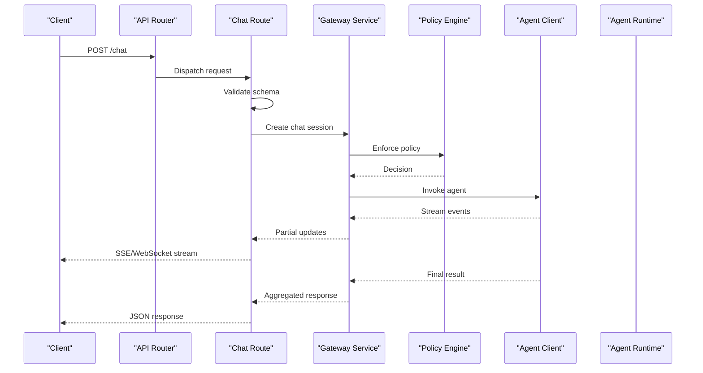
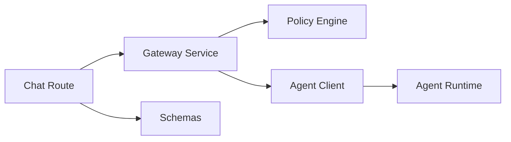

# Chat API

<cite>
**Referenced Files in This Document**
- [chat.py](file://products/tool-gateway/src/api_gateway/api/routes/chat.py)
- [api.py](file://products/tool-gateway/src/api_gateway/schemas/api.py)
- [gateway_service.py](file://products/tool-gateway/src/api_gateway/services/gateway_service.py)
- [agent_client.py](file://products/tool-gateway/src/api_gateway/services/agent_client.py)
- [policy_engine.py](file://products/tool-gateway/src/api_gateway/services/policy_engine.py)
- [token_verifier.py](file://products/tool-gateway/src/api_gateway/services/token_verifier.py)
- [router.py](file://products/tool-gateway/src/api_gateway/api/router.py)
- [app.py](file://products/tool-gateway/src/api_gateway/app.py)
- [main.py](file://products/tool-gateway/src/api_gateway/main.py)
- [chat-request.schema.json](file://shared/shared-contracts/schemas/chat-request.schema.json)
- [chat-response.schema.json](file://shared/shared-contracts/schemas/chat-response.schema.json)
- [stream-event.schema.json](file://shared/shared-contracts/schemas/stream-event.schema.json)
- [tool-invocation.schema.json](file://shared/shared-contracts/schemas/tool-invocation.schema.json)
- [tool-result.schema.json](file://shared/shared-contracts/schemas/tool-result.schema.json)
</cite>

## Table of Contents
1. [Introduction](#introduction)
2. [Project Structure](#project-structure)
3. [Core Components](#core-components)
4. [Architecture Overview](#architecture-overview)
5. [Detailed Component Analysis](#detailed-component-analysis)
6. [Dependency Analysis](#dependency-analysis)
7. [Performance Considerations](#performance-considerations)
8. [Troubleshooting Guide](#troubleshooting-guide)
9. [Conclusion](#conclusion)

## Introduction
This document provides comprehensive API documentation for the chat endpoints exposed by the Tool Gateway Service. It covers RESTful request/response patterns, WebSocket streaming for real-time responses, and message formatting. It also details the chat request schema (including agent selection, conversation context, and tool invocation parameters), streaming event types, partial response handling, and error scenarios. Examples are provided for both synchronous and asynchronous chat interactions, along with guidance on rate limiting, message size limits, and performance optimization.

## Project Structure
The Tool Gateway Service exposes chat functionality through HTTP routes that delegate to a gateway service, which interacts with an agent client and enforces policies. Schemas for requests, responses, and streaming events are defined in shared contracts.

**Diagram sources**
- [router.py:1-200](file://products/tool-gateway/src/api_gateway/api/router.py#L1-L200)
- [chat.py:1-200](file://products/tool-gateway/src/api_gateway/api/routes/chat.py#L1-L200)
- [gateway_service.py:1-200](file://products/tool-gateway/src/api_gateway/services/gateway_service.py#L1-L200)
- [agent_client.py:1-200](file://products/tool-gateway/src/api_gateway/services/agent_client.py#L1-L200)
- [policy_engine.py:1-200](file://products/tool-gateway/src/api_gateway/services/policy_engine.py#L1-L200)

**Section sources**
- [router.py:1-200](file://products/tool-gateway/src/api_gateway/api/router.py#L1-L200)
- [chat.py:1-200](file://products/tool-gateway/src/api_gateway/api/routes/chat.py#L1-L200)
- [gateway_service.py:1-200](file://products/tool-gateway/src/api_gateway/services/gateway_service.py#L1-L200)
- [agent_client.py:1-200](file://products/tool-gateway/src/api_gateway/services/agent_client.py#L1-L200)
- [policy_engine.py:1-200](file://products/tool-gateway/src/api_gateway/services/policy_engine.py#L1-L200)

## Core Components
- Chat Route: Defines REST endpoints for chat requests and WebSocket streaming.
- Gateway Service: Orchestrates policy checks, session management, and calls to the agent runtime.
- Agent Client: Communicates with the agent runtime over HTTP or streaming protocols.
- Policy Engine: Enforces access control and usage policies for chat operations.
- Token Verifier: Validates authentication tokens for secure access.
- Schemas: Define request/response structures and streaming event formats.

Key responsibilities:
- Validate incoming chat requests against schemas.
- Enforce policies before invoking agents.
- Stream partial responses via WebSocket events.
- Aggregate final results into structured responses.

**Section sources**
- [chat.py:1-200](file://products/tool-gateway/src/api_gateway/api/routes/chat.py#L1-L200)
- [gateway_service.py:1-200](file://products/tool-gateway/src/api_gateway/services/gateway_service.py#L1-L200)
- [agent_client.py:1-200](file://products/tool-gateway/src/api_gateway/services/agent_client.py#L1-L200)
- [policy_engine.py:1-200](file://products/tool-gateway/src/api_gateway/services/policy_engine.py#L1-L200)
- [token_verifier.py:1-200](file://products/tool-gateway/src/api_gateway/services/token_verifier.py#L1-L200)
- [api.py:1-200](file://products/tool-gateway/src/api_gateway/schemas/api.py#L1-L200)

## Architecture Overview
The chat flow involves routing HTTP requests to the chat endpoint, validating inputs, enforcing policies, invoking the agent runtime, and returning either a complete response or streaming partial updates.

**Diagram sources**
- [chat.py:1-200](file://products/tool-gateway/src/api_gateway/api/routes/chat.py#L1-L200)
- [gateway_service.py:1-200](file://products/tool-gateway/src/api_gateway/services/gateway_service.py#L1-L200)
- [agent_client.py:1-200](file://products/tool-gateway/src/api_gateway/services/agent_client.py#L1-L200)
- [policy_engine.py:1-200](file://products/tool-gateway/src/api_gateway/services/policy_engine.py#L1-L200)

## Detailed Component Analysis

### Chat Endpoints
- REST Endpoint: POST /chat accepts a chat request and returns a JSON response.
- WebSocket Endpoint: WS /chat-stream establishes a real-time connection for streaming partial responses.

Request Schema:
- agent_id: Identifier for the target agent.
- messages: Array of conversation messages with role and content.
- tools: Optional list of tool invocation parameters.
- session_id: Optional identifier for conversation continuity.
- metadata: Optional key-value pairs for tracing and analytics.

Response Schema:
- id: Unique response identifier.
- created_at: Timestamp of response creation.
- choices: Array of generated content items.
- usage: Token usage statistics.
- error: Error details if applicable.

Streaming Events:
- delta: Partial content update.
- tool_call: Tool invocation details.
- tool_result: Result from tool execution.
- done: Indicates completion of the stream.

Error Scenarios:
- Invalid request schema.
- Policy denial.
- Authentication failure.
- Agent runtime errors.

**Section sources**
- [chat.py:1-200](file://products/tool-gateway/src/api_gateway/api/routes/chat.py#L1-L200)
- [api.py:1-200](file://products/tool-gateway/src/api_gateway/schemas/api.py#L1-L200)
- [chat-request.schema.json:1-200](file://shared/shared-contracts/schemas/chat-request.schema.json#L1-L200)
- [chat-response.schema.json:1-200](file://shared/shared-contracts/schemas/chat-response.schema.json#L1-L200)
- [stream-event.schema.json:1-200](file://shared/shared-contracts/schemas/stream-event.schema.json#L1-L200)

### Gateway Service
The gateway service orchestrates chat operations by:
- Validating and transforming requests.
- Checking policies for authorization and rate limiting.
- Managing sessions for conversation context.
- Invoking the agent client for processing.
- Handling streaming events and aggregating results.

**Section sources**
- [gateway_service.py:1-200](file://products/tool-gateway/src/api_gateway/services/gateway_service.py#L1-L200)

### Agent Client
The agent client communicates with the agent runtime using:
- HTTP requests for synchronous responses.
- Streaming connections for real-time updates.
- Error handling and retries for robustness.

**Section sources**
- [agent_client.py:1-200](file://products/tool-gateway/src/api_gateway/services/agent_client.py#L1-200)

### Policy Engine
The policy engine enforces:
- Access control based on user roles and permissions.
- Rate limiting and quota enforcement.
- Custom rules for tool invocation and data access.

**Section sources**
- [policy_engine.py:1-200](file://products/tool-gateway/src/api_gateway/services/policy_engine.py#L1-200)

### Token Verifier
The token verifier ensures:
- JWT validation and expiration checks.
- Scope verification for API access.
- Secure context propagation.

**Section sources**
- [token_verifier.py:1-200](file://products/tool-gateway/src/api_gateway/services/token_verifier.py#L1-200)

## Dependency Analysis
The chat system has clear dependencies between components:
- Chat route depends on gateway service and schemas.
- Gateway service depends on policy engine, agent client, and session management.
- Agent client depends on agent runtime and network libraries.
- Policy engine depends on configuration and rule definitions.

**Diagram sources**
- [chat.py:1-200](file://products/tool-gateway/src/api_gateway/api/routes/chat.py#L1-200)
- [gateway_service.py:1-200](file://products/tool-gateway/src/api_gateway/services/gateway_service.py#L1-200)
- [agent_client.py:1-200](file://products/tool-gateway/src/api_gateway/services/agent_client.py#L1-200)
- [policy_engine.py:1-200](file://products/tool-gateway/src/api_gateway/services/policy_engine.py#L1-200)

**Section sources**
- [chat.py:1-200](file://products/tool-gateway/src/api_gateway/api/routes/chat.py#L1-200)
- [gateway_service.py:1-200](file://products/tool-gateway/src/api_gateway/services/gateway_service.py#L1-200)
- [agent_client.py:1-200](file://products/tool-gateway/src/api_gateway/services/agent_client.py#L1-200)
- [policy_engine.py:1-200](file://products/tool-gateway/src/api_gateway/services/policy_engine.py#L1-200)

## Performance Considerations
- Use WebSocket streaming for long-running operations to reduce latency.
- Implement request batching for multiple tool invocations.
- Cache frequently accessed agent configurations.
- Monitor and optimize network timeouts and retry logic.
- Apply rate limiting at the gateway level to prevent overload.

[No sources needed since this section provides general guidance]

## Troubleshooting Guide
Common issues and resolutions:
- Authentication failures: Verify token validity and scopes.
- Policy denials: Check user permissions and custom rules.
- Streaming interruptions: Implement reconnection logic and handle partial responses.
- Agent runtime errors: Log detailed error messages and implement fallback strategies.

**Section sources**
- [token_verifier.py:1-200](file://products/tool-gateway/src/api_gateway/services/token_verifier.py#L1-200)
- [policy_engine.py:1-200](file://products/tool-gateway/src/api_gateway/services/policy_engine.py#L1-200)
- [agent_client.py:1-200](file://products/tool-gateway/src/api_gateway/services/agent_client.py#L1-200)

## Conclusion
The Tool Gateway Service provides a robust chat API with support for both synchronous and asynchronous interactions. By leveraging WebSocket streaming, policy enforcement, and well-defined schemas, it enables efficient and secure communication with agent runtimes. Proper implementation of error handling, rate limiting, and performance optimizations ensures reliable operation in production environments.

[No sources needed since this section summarizes without analyzing specific files]