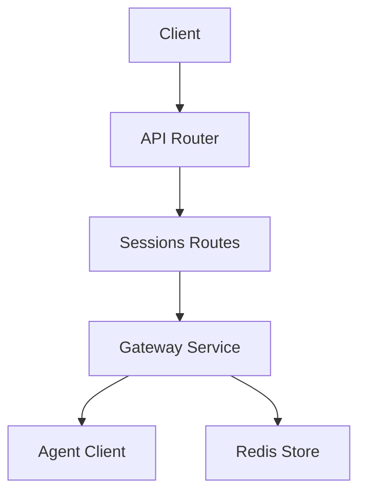
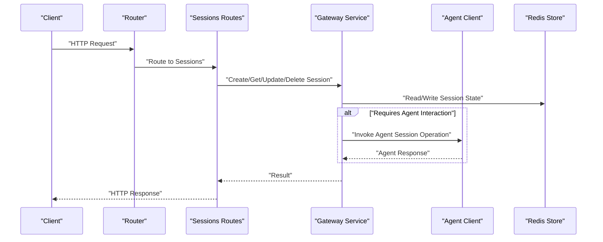
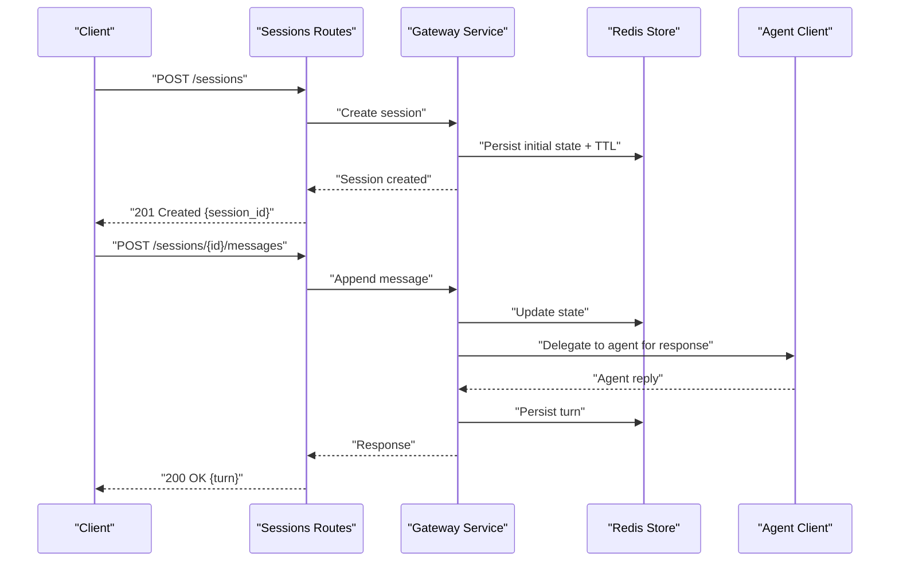
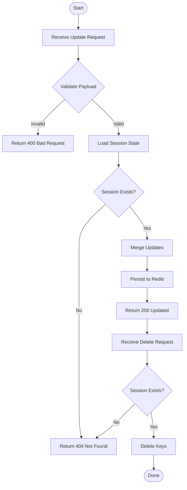
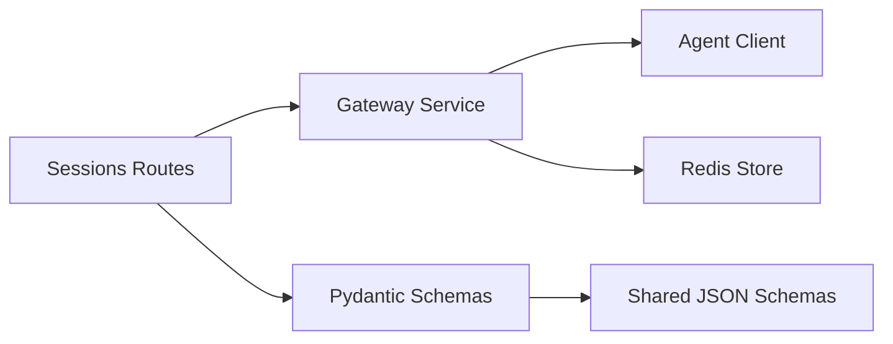

# Sessions API

<cite>
**Referenced Files in This Document**
- [sessions.py](file://products/tool-gateway/src/api_gateway/api/routes/sessions.py)
- [router.py](file://products/tool-gateway/src/api_gateway/api/router.py)
- [gateway_service.py](file://products/tool-gateway/src/api_gateway/services/gateway_service.py)
- [agent_client.py](file://products/tool-gateway/src/api_gateway/services/agent_client.py)
- [api.py](file://products/tool-gateway/src/api_gateway/schemas/api.py)
- [session.schema.json](file://shared/shared-contracts/schemas/session.schema.json)
- [agent-session.schema.json](file://shared/shared-contracts/schemas/agent-session.schema.json)
- [runtime-config.env](file://shared/platform-ops/gitops/dev-k8s/base/tool-gateway/runtime-config.env)
- [redis-deployment.yaml](file://shared/platform-ops/gitops/dev-k8s/base/infra/redis-deployment.yaml)
- [redis-service.yaml](file://shared/platform-ops/gitops/dev-k8s/base/infra/redis-service.yaml)
</cite>

## Table of Contents
1. [Introduction](#introduction)
2. [Project Structure](#project-structure)
3. [Core Components](#core-components)
4. [Architecture Overview](#architecture-overview)
5. [Detailed Component Analysis](#detailed-component-analysis)
6. [Dependency Analysis](#dependency-analysis)
7. [Performance Considerations](#performance-considerations)
8. [Troubleshooting Guide](#troubleshooting-guide)
9. [Conclusion](#conclusion)
10. [Appendices](#appendices)

## Introduction
This document provides comprehensive API documentation for session management endpoints exposed by the Tool Gateway Service. It covers session creation, retrieval, update, and deletion operations; explains session state management, persistence strategies, and distributed session handling; and details lifecycle events, timeout handling, and cleanup procedures. It also includes examples of session-based workflows and stateful conversations, along with security, isolation, and scalability considerations.

## Project Structure
The Tool Gateway Service exposes REST endpoints under a unified router. Session-related routes are defined in a dedicated module and wired into the application’s router. The gateway service coordinates requests to downstream agent services and persists session state via a shared Redis store configured at runtime.

**Diagram sources**
- [router.py](file://products/tool-gateway/src/api_gateway/api/router.py)
- [sessions.py](file://products/tool-gateway/src/api_gateway/api/routes/sessions.py)
- [gateway_service.py](file://products/tool-gateway/src/api_gateway/services/gateway_service.py)
- [agent_client.py](file://products/tool-gateway/src/api_gateway/services/agent_client.py)

**Section sources**
- [router.py](file://products/tool-gateway/src/api_gateway/api/router.py)
- [sessions.py](file://products/tool-gateway/src/api_gateway/api/routes/sessions.py)

## Core Components
- Sessions Routes: Define HTTP endpoints for session CRUD operations and expose request/response schemas.
- Gateway Service: Orchestrates session lifecycle, delegates to agent clients when needed, and manages persistence to Redis.
- Agent Client: Communicates with downstream agent services for session-aware operations (e.g., chat continuation).
- Schemas: Pydantic models enforce validation for requests and responses, aligned with shared JSON schemas.

Key responsibilities:
- Validate inputs against schemas.
- Enforce identity and policy constraints before mutating sessions.
- Persist session metadata and state to Redis with TTLs.
- Return consistent error codes and messages.

**Section sources**
- [sessions.py](file://products/tool-gateway/src/api_gateway/api/routes/sessions.py)
- [gateway_service.py](file://products/tool-gateway/src/api_gateway/services/gateway_service.py)
- [agent_client.py](file://products/tool-gateway/src/api_gateway/services/agent_client.py)
- [api.py](file://products/tool-gateway/src/api_gateway/schemas/api.py)

## Architecture Overview
The session management flow integrates HTTP routing, service orchestration, external agent calls, and Redis-backed persistence.

**Diagram sources**
- [router.py](file://products/tool-gateway/src/api_gateway/api/router.py)
- [sessions.py](file://products/tool-gateway/src/api_gateway/api/routes/sessions.py)
- [gateway_service.py](file://products/tool-gateway/src/api_gateway/services/gateway_service.py)
- [agent_client.py](file://products/tool-gateway/src/api_gateway/services/agent_client.py)

## Detailed Component Analysis

### Sessions API Endpoints
Endpoints provide full CRUD capabilities for sessions. All endpoints validate payloads using Pydantic models and return standardized responses.

- Create Session
  - Purpose: Initialize a new session with optional initial context and configuration.
  - Behavior: Validates input, generates a unique session ID, persists initial state to Redis with TTL, and returns created session metadata.
  - Errors: Validation failure, conflict if duplicate ID provided, internal server errors on persistence failures.

- Get Session
  - Purpose: Retrieve current session state and metadata.
  - Behavior: Reads from Redis, returns not found if missing or expired, otherwise returns session data.
  - Errors: Not found, malformed request.

- Update Session
  - Purpose: Modify session attributes or append conversation turns.
  - Behavior: Validates updates, merges into existing state, persists changes, and returns updated session.
  - Errors: Not found, validation failure, permission denied.

- Delete Session
  - Purpose: Terminate and remove session state.
  - Behavior: Deletes keys from Redis, returns confirmation.
  - Errors: Not found, internal server errors.

Request/Response Schemas:
- Requests and responses conform to Pydantic models defined in the schemas module and align with shared JSON schemas for sessions.

**Section sources**
- [sessions.py](file://products/tool-gateway/src/api_gateway/api/routes/sessions.py)
- [api.py](file://products/tool-gateway/src/api_gateway/schemas/api.py)
- [session.schema.json](file://shared/shared-contracts/schemas/session.schema.json)
- [agent-session.schema.json](file://shared/shared-contracts/schemas/agent-session.schema.json)

### Session Lifecycle Management
Lifecycle stages:
- Creation: Assigns ID, initializes state, sets TTL based on configuration.
- Retrieval: Loads state from Redis, refreshes TTL on read/write where applicable.
- Update: Merges partial updates, validates integrity, persists atomically.
- Deletion: Removes all related keys and indexes.

Timeout Handling:
- TTL is applied to session keys; expired sessions are automatically evicted by Redis.
- Clients should handle expiration by creating new sessions or refreshing TTL through explicit operations.

Cleanup Procedures:
- Background tasks may purge orphaned keys or perform compaction.
- On delete, ensure cascading removal of related artifacts (e.g., logs, indices).

**Section sources**
- [gateway_service.py](file://products/tool-gateway/src/api_gateway/services/gateway_service.py)
- [runtime-config.env](file://shared/platform-ops/gitops/dev-k8s/base/tool-gateway/runtime-config.env)

### Persistence Strategy and Distributed Session Handling
Persistence:
- Redis is used as the distributed session store. Keys include session IDs and associated metadata/state.
- TTL ensures automatic expiration and memory control.

Distributed Handling:
- Multiple gateway instances share the same Redis cluster, enabling horizontal scaling.
- Atomic operations prevent race conditions during concurrent updates.

Configuration:
- Redis connection parameters and TTL defaults are set via environment variables.

**Section sources**
- [redis-deployment.yaml](file://shared/platform-ops/gitops/dev-k8s/base/infra/redis-deployment.yaml)
- [redis-service.yaml](file://shared/platform-ops/gitops/dev-k8s/base/infra/redis-service.yaml)
- [runtime-config.env](file://shared/platform-ops/gitops/dev-k8s/base/tool-gateway/runtime-config.env)

### Security, Isolation, and Scalability
Security:
- Authentication and authorization are enforced before session mutations.
- Tokens are verified via the identity broker; policies restrict access per tenant/user.

Isolation:
- Session keys are namespaced by user/tenant identifiers to prevent cross-tenant leakage.
- Strict schema validation prevents injection of invalid state.

Scalability:
- Stateless gateway instances scale horizontally behind a load balancer.
- Redis clustering supports high throughput and availability.

**Section sources**
- [gateway_service.py](file://products/tool-gateway/src/api_gateway/services/gateway_service.py)
- [token_verifier.py](file://products/tool-gateway/src/api_gateway/services/token_verifier.py)
- [policy_engine.py](file://products/tool-gateway/src/api_gateway/services/policy_engine.py)

### Example Workflows

#### Creating a Session and Starting a Conversation

**Diagram sources**
- [sessions.py](file://products/tool-gateway/src/api_gateway/api/routes/sessions.py)
- [gateway_service.py](file://products/tool-gateway/src/api_gateway/services/gateway_service.py)
- [agent_client.py](file://products/tool-gateway/src/api_gateway/services/agent_client.py)

#### Updating and Deleting a Session

**Diagram sources**
- [sessions.py](file://products/tool-gateway/src/api_gateway/api/routes/sessions.py)
- [gateway_service.py](file://products/tool-gateway/src/api_gateway/services/gateway_service.py)

## Dependency Analysis
The sessions subsystem depends on routing, service orchestration, external agents, and Redis.

**Diagram sources**
- [sessions.py](file://products/tool-gateway/src/api_gateway/api/routes/sessions.py)
- [gateway_service.py](file://products/tool-gateway/src/api_gateway/services/gateway_service.py)
- [agent_client.py](file://products/tool-gateway/src/api_gateway/services/agent_client.py)
- [api.py](file://products/tool-gateway/src/api_gateway/schemas/api.py)
- [session.schema.json](file://shared/shared-contracts/schemas/session.schema.json)
- [agent-session.schema.json](file://shared/shared-contracts/schemas/agent-session.schema.json)

**Section sources**
- [sessions.py](file://products/tool-gateway/src/api_gateway/api/routes/sessions.py)
- [gateway_service.py](file://products/tool-gateway/src/api_gateway/services/gateway_service.py)
- [agent_client.py](file://products/tool-gateway/src/api_gateway/services/agent_client.py)
- [api.py](file://products/tool-gateway/src/api_gateway/schemas/api.py)

## Performance Considerations
- Use atomic Redis operations for updates to minimize contention.
- Keep session payloads compact; avoid storing large binaries in session state.
- Tune TTL values based on expected conversation durations.
- Monitor Redis latency and memory usage; consider sharding by tenant if necessary.
- Cache frequently accessed metadata locally within short-lived boundaries if safe.

[No sources needed since this section provides general guidance]

## Troubleshooting Guide
Common issues and resolutions:
- 404 Not Found: Session expired or never created; verify TTL and client behavior.
- 400 Bad Request: Invalid payload; check schema definitions and required fields.
- 401/403 Unauthorized: Missing or invalid token; ensure identity verification passes.
- 500 Internal Server Error: Redis connectivity issues; check environment configuration and network.

Debugging steps:
- Inspect Redis keys for session existence and TTL.
- Review gateway logs for validation and persistence errors.
- Verify agent client health and downstream availability.

**Section sources**
- [gateway_service.py](file://products/tool-gateway/src/api_gateway/services/gateway_service.py)
- [runtime-config.env](file://shared/platform-ops/gitops/dev-k8s/base/tool-gateway/runtime-config.env)

## Conclusion
The Tool Gateway Service provides robust session management through well-defined APIs, secure orchestration, and scalable Redis-backed persistence. By adhering to the documented lifecycle, timeouts, and security practices, clients can implement reliable stateful conversations and distributed workflows.

[No sources needed since this section summarizes without analyzing specific files]

## Appendices

### API Endpoint Reference
- POST /sessions: Create a new session.
- GET /sessions/{id}: Retrieve session state.
- PATCH /sessions/{id}: Update session attributes or append turns.
- DELETE /sessions/{id}: Delete session and related state.

All endpoints use standard HTTP status codes and return structured JSON responses validated against shared schemas.

**Section sources**
- [sessions.py](file://products/tool-gateway/src/api_gateway/api/routes/sessions.py)
- [api.py](file://products/tool-gateway/src/api_gateway/schemas/api.py)
- [session.schema.json](file://shared/shared-contracts/schemas/session.schema.json)