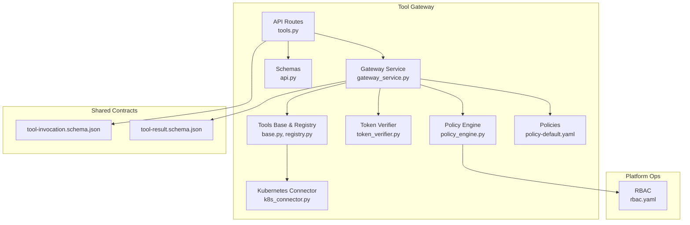
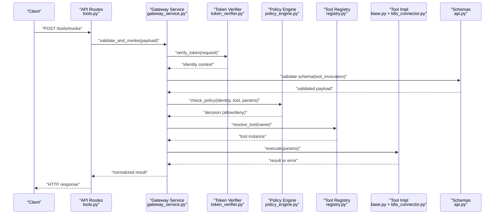
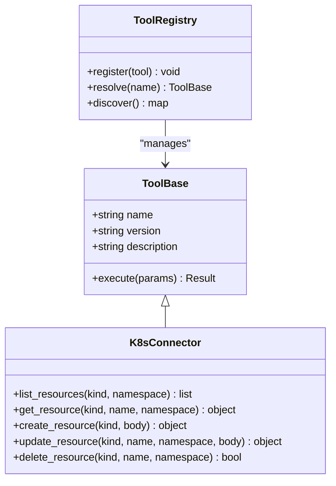
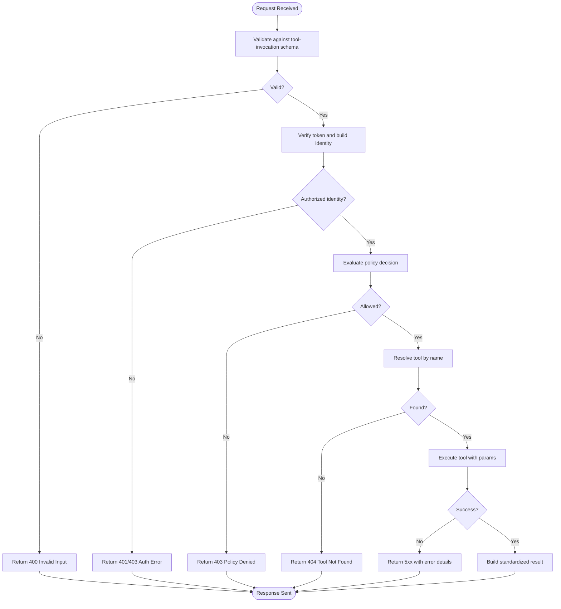
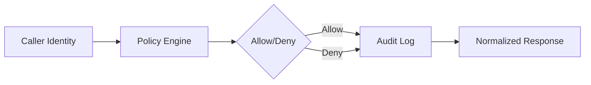
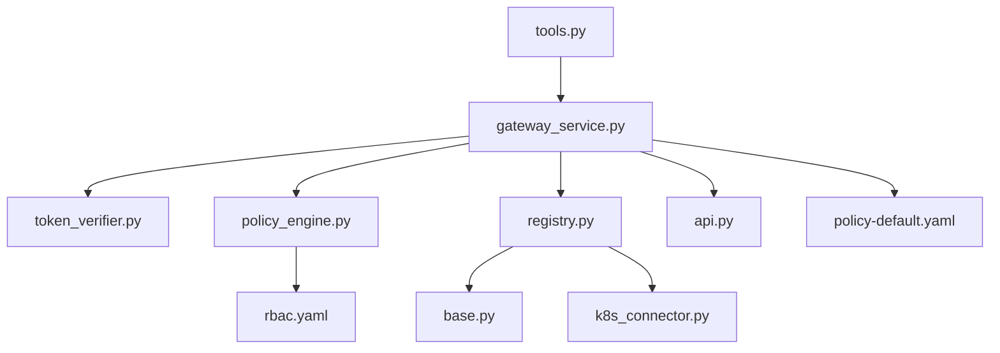

# Tools API

<cite>
**Referenced Files in This Document**
- [tools.py](file://products/tool-gateway/src/api_gateway/api/routes/tools.py)
- [gateway_service.py](file://products/tool-gateway/src/api_gateway/services/gateway_service.py)
- [policy_engine.py](file://products/tool-gateway/src/api_gateway/services/policy_engine.py)
- [token_verifier.py](file://products/tool-gateway/src/api_gateway/services/token_verifier.py)
- [base.py](file://products/tool-gateway/src/api_gateway/tools/base.py)
- [registry.py](file://products/tool-gateway/src/api_gateway/tools/registry.py)
- [k8s_connector.py](file://products/tool-gateway/src/api_gateway/tools/k8s_connector.py)
- [api.py](file://products/tool-gateway/src/api_gateway/schemas/api.py)
- [tool-invocation.schema.json](file://shared/shared-contracts/schemas/tool-invocation.schema.json)
- [tool-result.schema.json](file://shared/shared-contracts/schemas/tool-result.schema.json)
- [policy-default.yaml](file://products/tool-gateway/src/api_gateway/policies/policy-default.yaml)
- [rbac.yaml](file://shared/platform-ops/gitops/dev-k8s/base/tool-gateway/rbac.yaml)
- [test_tool_invoke.py](file://products/tool-gateway/tests/test_tool_invoke.py)
- [test_tool_registry.py](file://products/tool-gateway/tests/test_tool_registry.py)
</cite>

## Table of Contents
1. [Introduction](#introduction)
2. [Project Structure](#project-structure)
3. [Core Components](#core-components)
4. [Architecture Overview](#architecture-overview)
5. [Detailed Component Analysis](#detailed-component-analysis)
6. [Dependency Analysis](#dependency-analysis)
7. [Performance Considerations](#performance-considerations)
8. [Troubleshooting Guide](#troubleshooting-guide)
9. [Conclusion](#conclusion)
10. [Appendices](#appendices)

## Introduction
This document provides detailed API documentation for tool invocation endpoints exposed by the Tool Gateway Service. It covers:
- Tool discovery and registration
- Tool execution APIs, including parameter validation, result handling, and error propagation
- Built-in tools (e.g., Kubernetes operations) and custom tool integration patterns
- Tool permissions, policy enforcement, and audit logging
- Guidance for developing and integrating new tools

The Tool Gateway centralizes tool access, enforces policies, validates inputs, and returns standardized results to callers such as agents or client applications.

## Project Structure
The Tool Gateway service is implemented under products/tool-gateway with clear separation between API routes, services, tools, schemas, and policies. Shared contracts define request/response schemas used across services.

**Diagram sources**
- [tools.py](file://products/tool-gateway/src/api_gateway/api/routes/tools.py)
- [gateway_service.py](file://products/tool-gateway/src/api_gateway/services/gateway_service.py)
- [policy_engine.py](file://products/tool-gateway/src/api_gateway/services/policy_engine.py)
- [token_verifier.py](file://products/tool-gateway/src/api_gateway/services/token_verifier.py)
- [base.py](file://products/tool-gateway/src/api_gateway/tools/base.py)
- [registry.py](file://products/tool-gateway/src/api_gateway/tools/registry.py)
- [k8s_connector.py](file://products/tool-gateway/src/api_gateway/tools/k8s_connector.py)
- [api.py](file://products/tool-gateway/src/api_gateway/schemas/api.py)
- [tool-invocation.schema.json](file://shared/shared-contracts/schemas/tool-invocation.schema.json)
- [tool-result.schema.json](file://shared/shared-contracts/schemas/tool-result.schema.json)
- [policy-default.yaml](file://products/tool-gateway/src/api_gateway/policies/policy-default.yaml)
- [rbac.yaml](file://shared/platform-ops/gitops/dev-k8s/base/tool-gateway/rbac.yaml)

**Section sources**
- [tools.py](file://products/tool-gateway/src/api_gateway/api/routes/tools.py)
- [gateway_service.py](file://products/tool-gateway/src/api_gateway/services/gateway_service.py)
- [policy_engine.py](file://products/tool-gateway/src/api_gateway/services/policy_engine.py)
- [token_verifier.py](file://products/tool-gateway/src/api_gateway/services/token_verifier.py)
- [base.py](file://products/tool-gateway/src/api_gateway/tools/base.py)
- [registry.py](file://products/tool-gateway/src/api_gateway/tools/registry.py)
- [k8s_connector.py](file://products/tool-gateway/src/api_gateway/tools/k8s_connector.py)
- [api.py](file://products/tool-gateway/src/api_gateway/schemas/api.py)
- [tool-invocation.schema.json](file://shared/shared-contracts/schemas/tool-invocation.schema.json)
- [tool-result.schema.json](file://shared/shared-contracts/schemas/tool-result.schema.json)
- [policy-default.yaml](file://products/tool-gateway/src/api_gateway/policies/policy-default.yaml)
- [rbac.yaml](file://shared/platform-ops/gitops/dev-k8s/base/tool-gateway/rbac.yaml)

## Core Components
- API routes expose endpoints for tool discovery and invocation.
- Gateway service orchestrates authentication, policy checks, tool resolution, execution, and response formatting.
- Policy engine evaluates rules against requests and identities.
- Token verifier validates caller identity tokens.
- Tools base and registry provide a plugin interface and dynamic discovery.
- Kubernetes connector implements built-in Kubernetes operations.
- Schemas define request/response structures for tool invocations and results.
- Policies define default authorization and auditing behavior.
- RBAC defines Kubernetes-level permissions required by the gateway.

Key responsibilities:
- Validate incoming tool invocation payloads against shared schemas.
- Resolve tool implementations via the registry.
- Enforce policies before execution.
- Execute tools safely and capture results or errors.
- Return standardized responses with consistent error shapes.

**Section sources**
- [tools.py](file://products/tool-gateway/src/api_gateway/api/routes/tools.py)
- [gateway_service.py](file://products/tool-gateway/src/api_gateway/services/gateway_service.py)
- [policy_engine.py](file://products/tool-gateway/src/api_gateway/services/policy_engine.py)
- [token_verifier.py](file://products/tool-gateway/src/api_gateway/services/token_verifier.py)
- [base.py](file://products/tool-gateway/src/api_gateway/tools/base.py)
- [registry.py](file://products/tool-gateway/src/api_gateway/tools/registry.py)
- [k8s_connector.py](file://products/tool-gateway/src/api_gateway/tools/k8s_connector.py)
- [api.py](file://products/tool-gateway/src/api_gateway/schemas/api.py)
- [tool-invocation.schema.json](file://shared/shared-contracts/schemas/tool-invocation.schema.json)
- [tool-result.schema.json](file://shared/shared-contracts/schemas/tool-result.schema.json)
- [policy-default.yaml](file://products/tool-gateway/src/api_gateway/policies/policy-default.yaml)
- [rbac.yaml](file://shared/platform-ops/gitops/dev-k8s/base/tool-gateway/rbac.yaml)

## Architecture Overview
The tool invocation flow authenticates the caller, validates the request, resolves the target tool, enforces policies, executes the tool, and returns a standardized result. Errors are normalized and propagated consistently.

**Diagram sources**
- [tools.py](file://products/tool-gateway/src/api_gateway/api/routes/tools.py)
- [gateway_service.py](file://products/tool-gateway/src/api_gateway/services/gateway_service.py)
- [token_verifier.py](file://products/tool-gateway/src/api_gateway/services/token_verifier.py)
- [policy_engine.py](file://products/tool-gateway/src/api_gateway/services/policy_engine.py)
- [registry.py](file://products/tool-gateway/src/api_gateway/tools/registry.py)
- [base.py](file://products/tool-gateway/src/api_gateway/tools/base.py)
- [k8s_connector.py](file://products/tool-gateway/src/api_gateway/tools/k8s_connector.py)
- [api.py](file://products/tool-gateway/src/api_gateway/schemas/api.py)

## Detailed Component Analysis

### Tool Discovery and Registration
- The registry maintains a mapping from tool names to implementations and exposes discovery endpoints.
- Tools implement a common base interface ensuring consistent signatures and metadata.
- Built-in tools include Kubernetes operations; custom tools can be registered dynamically at runtime.

**Diagram sources**
- [base.py](file://products/tool-gateway/src/api_gateway/tools/base.py)
- [k8s_connector.py](file://products/tool-gateway/src/api_gateway/tools/k8s_connector.py)
- [registry.py](file://products/tool-gateway/src/api_gateway/tools/registry.py)

**Section sources**
- [registry.py](file://products/tool-gateway/src/api_gateway/tools/registry.py)
- [base.py](file://products/tool-gateway/src/api_gateway/tools/base.py)
- [k8s_connector.py](file://products/tool-gateway/src/api_gateway/tools/k8s_connector.py)

### Tool Execution API
- Endpoint: POST /tools/invoke
- Request body follows the tool invocation schema.
- Validation ensures required fields and types are present.
- Execution returns a standardized result or error structure.

**Diagram sources**
- [tools.py](file://products/tool-gateway/src/api_gateway/api/routes/tools.py)
- [gateway_service.py](file://products/tool-gateway/src/api_gateway/services/gateway_service.py)
- [policy_engine.py](file://products/tool-gateway/src/api_gateway/services/policy_engine.py)
- [token_verifier.py](file://products/tool-gateway/src/api_gateway/services/token_verifier.py)
- [registry.py](file://products/tool-gateway/src/api_gateway/tools/registry.py)
- [tool-invocation.schema.json](file://shared/shared-contracts/schemas/tool-invocation.schema.json)
- [tool-result.schema.json](file://shared/shared-contracts/schemas/tool-result.schema.json)

**Section sources**
- [tools.py](file://products/tool-gateway/src/api_gateway/api/routes/tools.py)
- [gateway_service.py](file://products/tool-gateway/src/api_gateway/services/gateway_service.py)
- [policy_engine.py](file://products/tool-gateway/src/api_gateway/services/policy_engine.py)
- [token_verifier.py](file://products/tool-gateway/src/api_gateway/services/token_verifier.py)
- [registry.py](file://products/tool-gateway/src/api_gateway/tools/registry.py)
- [tool-invocation.schema.json](file://shared/shared-contracts/schemas/tool-invocation.schema.json)
- [tool-result.schema.json](file://shared/shared-contracts/schemas/tool-result.schema.json)

### Parameter Validation and Result Handling
- Requests are validated against the shared tool invocation schema to ensure correctness and safety.
- Results conform to the tool result schema, providing consistent fields for success and error cases.
- Errors are normalized with structured messages and codes for predictable client handling.

**Section sources**
- [api.py](file://products/tool-gateway/src/api_gateway/schemas/api.py)
- [tool-invocation.schema.json](file://shared/shared-contracts/schemas/tool-invocation.schema.json)
- [tool-result.schema.json](file://shared/shared-contracts/schemas/tool-result.schema.json)

### Error Propagation
- Authentication failures return appropriate HTTP status codes with standardized error bodies.
- Policy denials are clearly indicated to clients.
- Tool execution errors include actionable details while avoiding sensitive information leakage.

**Section sources**
- [gateway_service.py](file://products/tool-gateway/src/api_gateway/services/gateway_service.py)
- [policy_engine.py](file://products/tool-gateway/src/api_gateway/services/policy_engine.py)
- [token_verifier.py](file://products/tool-gateway/src/api_gateway/services/token_verifier.py)

### Tool Permissions, Policy Enforcement, and Audit Logging
- Policies define who can invoke which tools with what parameters.
- RBAC resources constrain Kubernetes-level operations performed by built-in tools.
- Audit logs record invocation attempts, decisions, and outcomes for compliance and debugging.

**Diagram sources**
- [policy_engine.py](file://products/tool-gateway/src/api_gateway/services/policy_engine.py)
- [policy-default.yaml](file://products/tool-gateway/src/api_gateway/policies/policy-default.yaml)
- [rbac.yaml](file://shared/platform-ops/gitops/dev-k8s/base/tool-gateway/rbac.yaml)

**Section sources**
- [policy_engine.py](file://products/tool-gateway/src/api_gateway/services/policy_engine.py)
- [policy-default.yaml](file://products/tool-gateway/src/api_gateway/policies/policy-default.yaml)
- [rbac.yaml](file://shared/platform-ops/gitops/dev-k8s/base/tool-gateway/rbac.yaml)

### Examples: Calling Built-in and Custom Tools
- Built-in Kubernetes operations:
  - Use the Kubernetes connector tool to list, get, create, update, or delete resources.
  - Parameters should match the expected schema for each operation.
- Custom tools:
  - Implement the tool base interface and register via the registry.
  - Ensure metadata (name, version, description) is provided for discovery.

Usage guidance:
- Construct the tool invocation payload according to the shared schema.
- Include necessary identity tokens for authentication.
- Handle standardized responses and errors in clients.

**Section sources**
- [k8s_connector.py](file://products/tool-gateway/src/api_gateway/tools/k8s_connector.py)
- [registry.py](file://products/tool-gateway/src/api_gateway/tools/registry.py)
- [base.py](file://products/tool-gateway/src/api_gateway/tools/base.py)
- [tool-invocation.schema.json](file://shared/shared-contracts/schemas/tool-invocation.schema.json)
- [tool-result.schema.json](file://shared/shared-contracts/schemas/tool-result.schema.json)

### Guidance for Tool Development and Integration Patterns
- Implement the tool base interface to ensure compatibility.
- Provide robust parameter validation within the tool implementation.
- Register tools through the registry for dynamic discovery.
- Follow error handling conventions to maintain consistency.
- Add tests to validate behavior and edge cases.

Best practices:
- Keep tool functions idempotent where possible.
- Avoid leaking sensitive data in logs or responses.
- Use metrics and observability hooks for monitoring.

**Section sources**
- [base.py](file://products/tool-gateway/src/api_gateway/tools/base.py)
- [registry.py](file://products/tool-gateway/src/api_gateway/tools/registry.py)
- [test_tool_invoke.py](file://products/tool-gateway/tests/test_tool_invoke.py)
- [test_tool_registry.py](file://products/tool-gateway/tests/test_tool_registry.py)

## Dependency Analysis
The Tool Gateway components have clear dependencies:
- API routes depend on the gateway service and schemas.
- Gateway service depends on token verification, policy engine, tool registry, and tool implementations.
- Policies and RBAC influence authorization decisions.

**Diagram sources**
- [tools.py](file://products/tool-gateway/src/api_gateway/api/routes/tools.py)
- [gateway_service.py](file://products/tool-gateway/src/api_gateway/services/gateway_service.py)
- [token_verifier.py](file://products/tool-gateway/src/api_gateway/services/token_verifier.py)
- [policy_engine.py](file://products/tool-gateway/src/api_gateway/services/policy_engine.py)
- [registry.py](file://products/tool-gateway/src/api_gateway/tools/registry.py)
- [base.py](file://products/tool-gateway/src/api_gateway/tools/base.py)
- [k8s_connector.py](file://products/tool-gateway/src/api_gateway/tools/k8s_connector.py)
- [api.py](file://products/tool-gateway/src/api_gateway/schemas/api.py)
- [policy-default.yaml](file://products/tool-gateway/src/api_gateway/policies/policy-default.yaml)
- [rbac.yaml](file://shared/platform-ops/gitops/dev-k8s/base/tool-gateway/rbac.yaml)

**Section sources**
- [tools.py](file://products/tool-gateway/src/api_gateway/api/routes/tools.py)
- [gateway_service.py](file://products/tool-gateway/src/api_gateway/services/gateway_service.py)
- [policy_engine.py](file://products/tool-gateway/src/api_gateway/services/policy_engine.py)
- [token_verifier.py](file://products/tool-gateway/src/api_gateway/services/token_verifier.py)
- [registry.py](file://products/tool-gateway/src/api_gateway/tools/registry.py)
- [base.py](file://products/tool-gateway/src/api_gateway/tools/base.py)
- [k8s_connector.py](file://products/tool-gateway/src/api_gateway/tools/k8s_connector.py)
- [api.py](file://products/tool-gateway/src/api_gateway/schemas/api.py)
- [policy-default.yaml](file://products/tool-gateway/src/api_gateway/policies/policy-default.yaml)
- [rbac.yaml](file://shared/platform-ops/gitops/dev-k8s/base/tool-gateway/rbac.yaml)

## Performance Considerations
- Minimize validation overhead by leveraging shared schemas.
- Cache tool registrations where appropriate to reduce lookup latency.
- Use asynchronous execution for long-running tool operations if supported.
- Monitor metrics and traces to identify bottlenecks in policy evaluation and tool execution.

[No sources needed since this section provides general guidance]

## Troubleshooting Guide
Common issues and resolutions:
- Invalid input: Ensure the request matches the tool invocation schema.
- Authentication failures: Verify token validity and issuer configuration.
- Policy denial: Review policy rules and RBAC settings for the caller’s identity.
- Tool not found: Confirm tool registration and correct tool name.
- Execution errors: Inspect tool logs and error messages for root causes.

Debugging tips:
- Enable detailed logging for policy decisions and tool executions.
- Use test suites to reproduce issues locally.
- Validate RBAC permissions for Kubernetes operations.

**Section sources**
- [test_tool_invoke.py](file://products/tool-gateway/tests/test_tool_invoke.py)
- [test_tool_registry.py](file://products/tool-gateway/tests/test_tool_registry.py)
- [policy-engine.py](file://products/tool-gateway/src/api_gateway/services/policy_engine.py)
- [token_verifier.py](file://products/tool-gateway/src/api_gateway/services/token_verifier.py)

## Conclusion
The Tool Gateway Service provides a secure, standardized, and extensible framework for tool invocation. By enforcing policies, validating inputs, and returning consistent results, it enables safe integration of both built-in and custom tools. Following the development guidelines and best practices ensures reliable and auditable tool operations.

[No sources needed since this section summarizes without analyzing specific files]

## Appendices

### API Endpoints Summary
- POST /tools/invoke
  - Purpose: Invoke a registered tool with validated parameters.
  - Request: Tool invocation schema.
  - Response: Standardized tool result schema.
  - Errors: Authentication, policy, validation, and execution errors with normalized bodies.

**Section sources**
- [tools.py](file://products/tool-gateway/src/api_gateway/api/routes/tools.py)
- [tool-invocation.schema.json](file://shared/shared-contracts/schemas/tool-invocation.schema.json)
- [tool-result.schema.json](file://shared/shared-contracts/schemas/tool-result.schema.json)

### Built-in Tools Reference
- Kubernetes operations via the Kubernetes connector:
  - List resources
  - Get resource
  - Create resource
  - Update resource
  - Delete resource

**Section sources**
- [k8s_connector.py](file://products/tool-gateway/src/api_gateway/tools/k8s_connector.py)

### Policy and RBAC
- Default policy file defines authorization rules.
- RBAC manifests configure Kubernetes permissions for tool operations.

**Section sources**
- [policy-default.yaml](file://products/tool-gateway/src/api_gateway/policies/policy-default.yaml)
- [rbac.yaml](file://shared/platform-ops/gitops/dev-k8s/base/tool-gateway/rbac.yaml)