# Configuration and Environment Setup

<cite>
**Referenced Files in This Document**
- [config.py](file://products/platform-gateway/src/platform_gateway/core/config.py)
- [runtime.py](file://products/platform-gateway/src/platform_gateway/core/runtime.py)
- [telemetry.py](file://products/platform-gateway/src/platform_gateway/core/telemetry.py)
- [tools.py](file://products/platform-gateway/src/platform_gateway/api/routes/tools.py)
- [skills.py](file://products/platform-gateway/src/platform_gateway/api/routes/skills.py)
- [tool_gateway_client.py](file://products/platform-gateway/src/platform_gateway/services/tool_gateway_client.py)
- [skills_hub_client.py](file://products/platform-gateway/src/platform_gateway/services/skills_hub_client.py)
- [kernel_middleware.py](file://products/agent-platform/src/agent_service/services/kernel_middleware.py)
- [runtime_settings.py](file://products/agent-platform/src/agent_service/runtime_settings.py)
- [gateway_tools.py](file://products/agent-platform/src/agent_service/tools/gateway_tools.py)
- [config.py](file://products/tool-gateway/src/tool_gateway/core/config.py)
- [registry.py](file://products/tool-gateway/src/tool_gateway/tools/registry.py)
- [app.py](file://products/tool-gateway/src/tool_gateway/app.py)
- [sync-otel-secrets.sh](file://shared/platform-ops/gitops/sync-otel-secrets.sh)
- [sync-delegation-secrets.sh](file://shared/platform-ops/gitops/sync-delegation-secrets.sh)
- [sync-audit-secrets.sh](file://shared/platform-ops/gitops/sync-audit-secrets.sh)
- [sync-skills-secrets.sh](file://shared/platform-ops/gitops/sync-skills-secrets.sh)
- [platform-gateway-deployment.yaml](file://shared/platform-ops/gitops/dev-k8s/base/platform-gateway/platform-gateway-deployment.yaml)
- [runtime-config.env](file://shared/platform-ops/gitops/dev-k8s/base/platform-gateway/runtime-config.env)
- [runtime-config.env](file://shared/platform-ops/gitops/dev-k8s/base/agent-platform/runtime-config.env)
- [runtime-config.env](file://shared/platform-ops/gitops/dev-k8s/base/tool-gateway/runtime-config.env)
- [runtime-secrets.example.env](file://shared/platform-ops/gitops/dev-k8s/base/platform-gateway/runtime-secrets.example.env)
- [spec.md](file://docs/specs/SPEC-019-portal-transparency-navigation/spec.md)
- [approval-and-hitl.md](file://docs/guides/approval-and-hitl.md)
- [kustomization.yaml](file://shared/platform-ops/gitops/dev-k8s/kustomization.yaml)
- [mutating.env](file://shared/platform-ops/gitops/runtime-profiles/mutating-dev/mutating.env)
- [kustomization.yaml](file://shared/platform-ops/gitops/runtime-profiles/mutating-dev/kustomization.yaml)
- [tool-gateway-pod-delete.yaml](file://shared/platform-ops/gitops/runtime-profiles/mutating-dev/tool-gateway-pod-delete.yaml)
- [rbac.yaml](file://shared/platform-ops/gitops/dev-k8s/base/tool-gateway/rbac.yaml)
- [README.md](file://shared/platform-ops/gitops/runtime-profiles/README.md)
- [tool-configuration.md](file://docs/guides/tool-configuration.md)
</cite>

## Update Summary
**Changes Made**
- Added comprehensive documentation for the new mutating-dev kustomize profile that enables GATEWAY_MUTATING_TOOLS_ENABLED=true for development environments
- Updated configuration reference to include the new runtime-profiles/mutating-dev overlay and its pod-delete Role/RoleBinding
- Enhanced environment-specific settings section with detailed guidance for the mutating-dev profile integration
- Added new section documenting the mutating-dev profile architecture and deployment considerations
- Updated troubleshooting guide with profile-specific issues and resolution steps

## Table of Contents
1. [Introduction](#introduction)
2. [Project Structure](#project-structure)
3. [Core Components](#core-components)
4. [Architecture Overview](#architecture-overview)
5. [Detailed Component Analysis](#detailed-component-analysis)
6. [Dependency Analysis](#dependency-analysis)
7. [Performance Considerations](#performance-considerations)
8. [Troubleshooting Guide](#troubleshooting-guide)
9. [Conclusion](#conclusion)
10. [Appendices](#appendices)

## Introduction
This document explains how the Platform Gateway Service manages configuration and environment setup across layers: environment variables, configuration files, and runtime overrides. It details available options, defaults, validation rules, and deployment-specific settings for development, staging, and production. It also provides examples for Docker and Kubernetes (ConfigMaps/Secrets), and outlines security best practices for secrets management and consistent configuration across environments.

**Updated** Enhanced documentation now includes comprehensive workspace resource integration capabilities through new platform-gateway configuration settings that enable read-only proxies for tools catalog and skills inventory, durable OpenTelemetry secret provisioning that maintains authentication headers across all deployment operations, risk-tier admission gates for mutating tools via GATEWAY_MUTATING_TOOLS_ENABLED, configurable HITL confirmation timeouts through AGENT_HITL_CONFIRM_TIMEOUT, enhanced agent auto-allow list functionality with read-only enforcement and misconfiguration logging, and the new mutating-dev kustomize profile that provides a committed, environment-scoped development posture for enabling mutating tools safely.

## Project Structure
The Platform Gateway Service is implemented under products/platform-gateway with its core configuration logic in the core module. Deployment manifests and environment templates are maintained under shared/platform-ops/gitops/dev-k8s/base/platform-gateway. The service includes workspace resource integration features that proxy requests to tool-gateway and skills-hub services for read-only inventory access, plus enhanced OpenTelemetry configuration with durable secret management. The new mutating-dev profile provides a dedicated development posture for enabling mutating tools with appropriate RBAC controls.

```mermaid
graph TB
subgraph "Platform Gateway Service"
A["src/platform_gateway/core/config.py"]
B["src/platform_gateway/core/runtime.py"]
C["src/platform_gateway/core/telemetry.py"]
D["src/platform_gateway/api/routes/tools.py"]
E["src/platform_gateway/api/routes/skills.py"]
F["src/platform_gateway/services/tool_gateway_client.py"]
G["src/platform_gateway/services/skills_hub_client.py"]
end
subgraph "Agent Platform Integration"
H["kernel_middleware.py"]
I["runtime_settings.py"]
J["gateway_tools.py"]
K["AGENT_GATEWAY_TOOL_AUTO_ALLOW"]
L["AGENT_HITL_CONFIRM_TIMEOUT"]
M["Risk Tier Enforcement"]
end
subgraph "Tool Gateway Risk Control"
N["tool-gateway config.py"]
O["registry.py"]
P["GATEWAY_MUTATING_TOOLS_ENABLED"]
Q["Risk-Tier Admission Gate"]
R["Policy Enforcement"]
end
subgraph "Workspace Resource Integration"
S["tool_gateway_url"]
T["skills_hub_url"]
U["skills_client_id"]
V["skills_client_secret"]
W["Delegated Token Flow"]
X["Basic Auth Flow"]
end
subgraph "Enhanced OTel Secret Management"
Y["sync-otel-secrets.sh"]
Z["OTEL_EXPORTER_OTLP_HEADERS"]
AA["Cluster Secret Merge"]
AB["Local File Preservation"]
AC["Sibling Script Hooks"]
end
subgraph "Mutating Dev Profile"
AD["dev-k8s/kustomization.yaml"]
AE["runtime-profiles/mutating-dev/"]
AF["mutating.env"]
AG["tool-gateway-pod-delete.yaml"]
AH["RBAC Role/RoleBinding"]
AI["ConfigMap Merge"]
end
subgraph "Kubernetes Base (dev)"
AJ["base/platform-gateway/runtime-config.env"]
AK["base/platform-gateway/platform-gateway-deployment.yaml"]
AL["base/platform-gateway/runtime-secrets.example.env"]
AM["base/shared/runtime.env"]
AN["base/agent-platform/runtime-config.env"]
AO["base/tool-gateway/runtime-config.env"]
AP["base/tool-gateway/rbac.yaml"]
end
A --> AJ
B --> AK
C --> Y
D --> F
E --> G
F --> S
G --> T
AJ --> AK
AL --> AK
AM --> AK
H --> K
I --> L
J --> M
N --> P
O --> Q
P --> R
Y --> AA
Y --> AB
Y --> AC
AD --> AE
AE --> AF
AE --> AG
AF --> AI
AG --> AH
AP --> AP
```

**Diagram sources**
- [config.py](file://products/platform-gateway/src/platform_gateway/core/config.py)
- [runtime.py](file://products/platform-gateway/src/platform_gateway/core/runtime.py)
- [telemetry.py](file://products/platform-gateway/src/platform_gateway/core/telemetry.py)
- [tools.py](file://products/platform-gateway/src/platform_gateway/api/routes/tools.py)
- [skills.py](file://products/platform-gateway/src/platform_gateway/api/routes/skills.py)
- [kernel_middleware.py](file://products/agent-platform/src/agent_service/services/kernel_middleware.py)
- [runtime_settings.py](file://products/agent-platform/src/agent_service/runtime_settings.py)
- [gateway_tools.py](file://products/agent-platform/src/agent_service/tools/gateway_tools.py)
- [config.py](file://products/tool-gateway/src/tool_gateway/core/config.py)
- [registry.py](file://products/tool-gateway/src/tool_gateway/tools/registry.py)
- [tool_gateway_client.py](file://products/platform-gateway/src/platform_gateway/services/tool_gateway_client.py)
- [skills_hub_client.py](file://products/platform-gateway/src/platform_gateway/services/skills_hub_client.py)
- [sync-otel-secrets.sh](file://shared/platform-ops/gitops/sync-otel-secrets.sh)
- [platform-gateway-deployment.yaml](file://shared/platform-ops/gitops/dev-k8s/base/platform-gateway/platform-gateway-deployment.yaml)
- [runtime-config.env](file://shared/platform-ops/gitops/dev-k8s/base/platform-gateway/runtime-config.env)
- [runtime-config.env](file://shared/platform-ops/gitops/dev-k8s/base/agent-platform/runtime-config.env)
- [runtime-config.env](file://shared/platform-ops/gitops/dev-k8s/base/tool-gateway/runtime-config.env)
- [runtime-secrets.example.env](file://shared/platform-ops/gitops/dev-k8s/base/platform-gateway/runtime-secrets.example.env)
- [kustomization.yaml](file://shared/platform-ops/gitops/dev-k8s/kustomization.yaml)
- [kustomization.yaml](file://shared/platform-ops/gitops/runtime-profiles/mutating-dev/kustomization.yaml)
- [mutating.env](file://shared/platform-ops/gitops/runtime-profiles/mutating-dev/mutating.env)
- [tool-gateway-pod-delete.yaml](file://shared/platform-ops/gitops/runtime-profiles/mutating-dev/tool-gateway-pod-delete.yaml)
- [rbac.yaml](file://shared/platform-ops/gitops/dev-k8s/base/tool-gateway/rbac.yaml)

**Section sources**
- [config.py](file://products/platform-gateway/src/platform_gateway/core/config.py)
- [runtime.py](file://products/platform-gateway/src/platform_gateway/core/runtime.py)
- [telemetry.py](file://products/platform-gateway/src/platform_gateway/core/telemetry.py)
- [tools.py](file://products/platform-gateway/src/platform_gateway/api/routes/tools.py)
- [skills.py](file://products/platform-gateway/src/platform_gateway/api/routes/skills.py)
- [kernel_middleware.py](file://products/agent-platform/src/agent_service/services/kernel_middleware.py)
- [runtime_settings.py](file://products/agent-platform/src/agent_service/runtime_settings.py)
- [gateway_tools.py](file://products/agent-platform/src/agent_service/tools/gateway_tools.py)
- [config.py](file://products/tool-gateway/src/tool_gateway/core/config.py)
- [registry.py](file://products/tool-gateway/src/tool_gateway/tools/registry.py)
- [tool_gateway_client.py](file://products/platform-gateway/src/platform_gateway/services/tool_gateway_client.py)
- [skills_hub_client.py](file://products/platform-gateway/src/platform_gateway/services/skills_hub_client.py)
- [sync-otel-secrets.sh](file://shared/platform-ops/gitops/sync-otel-secrets.sh)
- [platform-gateway-deployment.yaml](file://shared/platform-ops/gitops/dev-k8s/base/platform-gateway/platform-gateway-deployment.yaml)
- [runtime-config.env](file://shared/platform-ops/gitops/dev-k8s/base/platform-gateway/runtime-config.env)
- [runtime-config.env](file://shared/platform-ops/gitops/dev-k8s/base/agent-platform/runtime-config.env)
- [runtime-config.env](file://shared/platform-ops/gitops/dev-k8s/base/tool-gateway/runtime-config.env)
- [runtime-secrets.example.env](file://shared/platform-ops/gitops/dev-k8s/base/platform-gateway/runtime-secrets.example.env)
- [kustomization.yaml](file://shared/platform-ops/gitops/dev-k8s/kustomization.yaml)
- [kustomization.yaml](file://shared/platform-ops/gitops/runtime-profiles/mutating-dev/kustomization.yaml)
- [mutating.env](file://shared/platform-ops/gitops/runtime-profiles/mutating-dev/mutating.env)
- [tool-gateway-pod-delete.yaml](file://shared/platform-ops/gitops/runtime-profiles/mutating-dev/tool-gateway-pod-delete.yaml)
- [rbac.yaml](file://shared/platform-ops/gitops/dev-k8s/base/tool-gateway/rbac.yaml)

## Core Components
- Configuration loader and model: centralizes environment variable parsing, file-based configuration, and runtime overrides; exposes validated configuration to the application.
- Runtime settings: handles service binding configuration with robust port resolution that ignores Kubernetes service-link formats.
- Enhanced telemetry system: opt-in OpenTelemetry push pipeline with fail-open behavior and durable secret provisioning.
- Workspace resource proxies: read-only proxy endpoints for tools catalog and skills inventory with appropriate authentication mechanisms.
- Policy engine configuration: loads default policy definitions from YAML and supports environment-driven overrides.
- Containerization and dependency management: Dockerfile defines runtime environment; pyproject.toml declares Python dependencies used by the gateway.
- **New**: Risk-tier admission gate for mutating tools controlled by GATEWAY_MUTATING_TOOLS_ENABLED with policy enforcement.
- **New**: Configurable HITL confirmation timeout via AGENT_HITL_CONFIRM_TIMEOUT for operator confirmation bridging.
- **New**: Enhanced agent auto-allow list with read-only enforcement and misconfiguration logging.
- **New**: Mutating-dev kustomize profile providing committed development posture for enabling mutating tools with appropriate RBAC controls.

Key responsibilities:
- Provide a single source of truth for configuration via typed models.
- Enforce validation rules and provide clear error messages on misconfiguration.
- Support layered precedence: defaults < config files < environment variables < runtime overrides.
- Handle DNS-based service discovery with proper fallback mechanisms.
- Ignore Kubernetes service-link environment variables to prevent conflicts.
- Manage workspace resource integration with secure authentication and authorization.
- **New**: Implement risk-tier admission gates to control access to mutating tools based on policy and RBAC.
- **New**: Configure HITL confirmation timeouts to balance operational efficiency with safety requirements.
- **New**: Maintain durable OpenTelemetry authentication headers across all deployment operations through cluster-side secret merging and local file preservation.
- **New**: Provide committed development posture through mutating-dev profile that safely enables mutating tools with bounded RBAC permissions.

**Updated** Enhanced core components to include comprehensive workspace resource integration capabilities with read-only proxies for tools catalog and skills inventory, supporting both delegated token flow for tools and Basic authentication for skills, risk-tier admission gates for mutating tools, configurable HITL confirmation timeouts, enhanced agent auto-allow list functionality with read-only enforcement, plus durable OpenTelemetry secret provisioning that persists authentication headers across deployment operations, and the new mutating-dev kustomize profile that provides a safe, committed development posture for enabling mutating tools with appropriate RBAC controls.

**Section sources**
- [config.py](file://products/platform-gateway/src/platform_gateway/core/config.py)
- [runtime.py](file://products/platform-gateway/src/platform_gateway/core/runtime.py)
- [telemetry.py](file://products/platform-gateway/src/platform_gateway/core/telemetry.py)
- [tools.py](file://products/platform-gateway/src/platform_gateway/api/routes/tools.py)
- [skills.py](file://products/platform-gateway/src/platform_gateway/api/routes/skills.py)
- [kernel_middleware.py](file://products/agent-platform/src/agent_service/services/kernel_middleware.py)
- [runtime_settings.py](file://products/agent-platform/src/agent_service/runtime_settings.py)
- [gateway_tools.py](file://products/agent-platform/src/agent_service/tools/gateway_tools.py)
- [config.py](file://products/tool-gateway/src/tool_gateway/core/config.py)
- [registry.py](file://products/tool-gateway/src/tool_gateway/tools/registry.py)
- [tool_gateway_client.py](file://products/platform-gateway/src/platform_gateway/services/tool_gateway_client.py)
- [skills_hub_client.py](file://products/platform-gateway/src/platform_gateway/services/skills_hub_client.py)

## Architecture Overview
The configuration system follows a layered approach with enhanced workspace resource integration, risk-tier admission gates, and durable secret management:
- Defaults: defined in code or default YAML policies.
- Config files: loaded from container filesystem or mounted volumes.
- Environment variables: injected at runtime via platform orchestration (e.g., Kubernetes).
- Runtime overrides: applied programmatically during startup or request processing.
- DNS-based service discovery: services communicate via Kubernetes DNS names instead of injected environment variables.
- Workspace resource proxies: read-only access to tools catalog and skills inventory with appropriate authentication.
- **New**: Risk-tier admission gates: control access to mutating tools through policy enforcement and RBAC checks.
- **New**: Configurable HITL confirmation timeouts: balance operational efficiency with safety requirements.
- **New**: Enhanced agent auto-allow list: read-only enforcement with misconfiguration logging.
- **New**: Durable OTel secret provisioning: cluster-side merging ensures authentication headers persist across all deployment operations.
- **New**: Mutating-dev profile: committed development posture that safely enables mutating tools with bounded RBAC permissions.

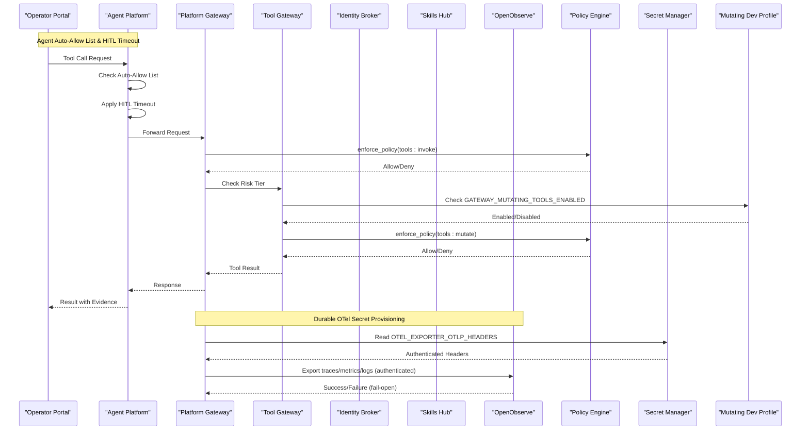

**Diagram sources**
- [tools.py](file://products/platform-gateway/src/platform_gateway/api/routes/tools.py)
- [skills.py](file://products/platform-gateway/src/platform_gateway/api/routes/skills.py)
- [kernel_middleware.py](file://products/agent-platform/src/agent_service/services/kernel_middleware.py)
- [runtime_settings.py](file://products/agent-platform/src/agent_service/runtime_settings.py)
- [gateway_tools.py](file://products/agent-platform/src/agent_service/tools/gateway_tools.py)
- [config.py](file://products/tool-gateway/src/tool_gateway/core/config.py)
- [registry.py](file://products/tool-gateway/src/tool_gateway/tools/registry.py)
- [tool_gateway_client.py](file://products/platform-gateway/src/platform_gateway/services/tool_gateway_client.py)
- [skills_hub_client.py](file://products/platform-gateway/src/platform_gateway/services/skills_hub_client.py)
- [telemetry.py](file://products/platform-gateway/src/platform_gateway/core/telemetry.py)
- [sync-otel-secrets.sh](file://shared/platform-ops/gitops/sync-otel-secrets.sh)
- [spec.md](file://docs/specs/SPEC-019-portal-transparency-navigation/spec.md)

## Detailed Component Analysis

### Configuration Loader and Model
- Purpose: Parse and validate configuration from multiple layers and expose it consistently.
- Precedence: Defaults < Config files < Environment variables < Runtime overrides.
- Validation: Type checks, required fields, range constraints, and cross-field validations.
- Error handling: Aggregates validation errors and surfaces actionable messages.
- Service discovery: Uses DNS-based resolution for inter-service communication.

**Updated** Enhanced to support workspace resource integration with new configuration fields for tool_gateway_url, skills_hub_url, skills_client_id, and skills_client_secret, enabling read-only proxies for tools catalog and skills inventory, plus risk-tier admission gate configuration for mutating tools and integration with the mutating-dev profile.


**Diagram sources**
- [config.py](file://products/platform-gateway/src/platform_gateway/core/config.py)

**Section sources**
- [config.py](file://products/platform-gateway/src/platform_gateway/core/config.py)

### Mutating Dev Profile Architecture
- Purpose: Provides a committed, environment-scoped development posture for enabling mutating tools safely.
- Integration: Wired permanently into dev-k8s overlay via kustomize configuration.
- Configuration: Merges GATEWAY_MUTATING_TOOLS_ENABLED=true into platform-runtime-config ConfigMap.
- RBAC: Carries bounded pod-delete Role/RoleBinding scoped to dev-luban-aiops namespace only.
- Safety: Maintains deny-by-default base posture while providing explicit opt-in for development.
- Triple-gate enforcement: Combines configuration flag, policy grants, and HITL confirmation requirements.

**New Section** Comprehensive mutating-dev profile implementation that provides a safe, committed development posture for enabling mutating tools with bounded RBAC permissions and triple-gate security controls.

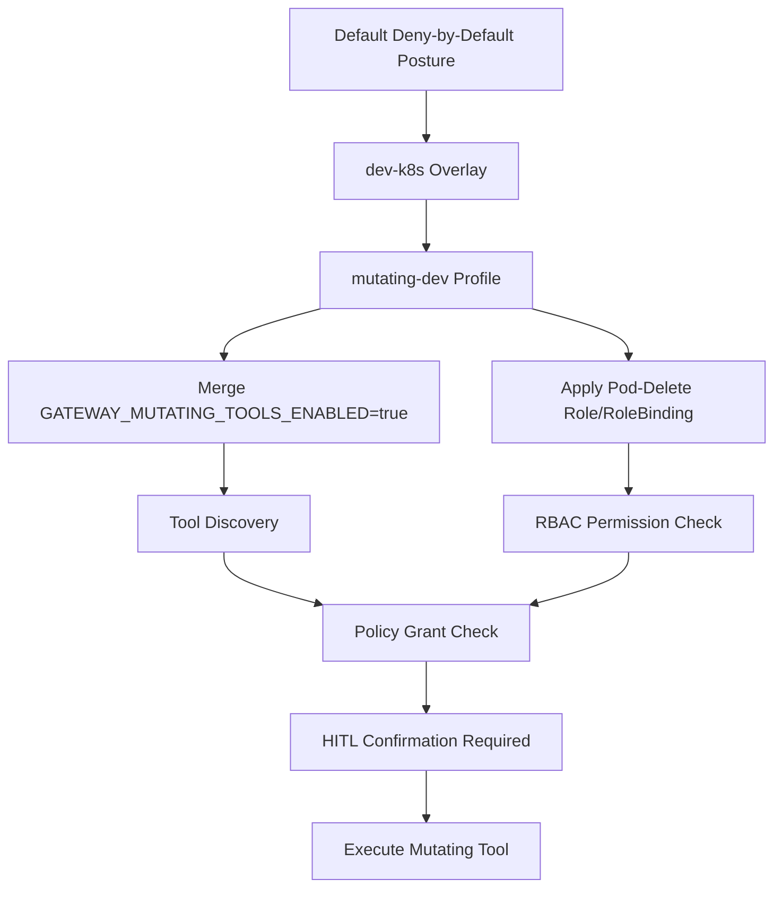

**Diagram sources**
- [kustomization.yaml](file://shared/platform-ops/gitops/dev-k8s/kustomization.yaml)
- [kustomization.yaml](file://shared/platform-ops/gitops/runtime-profiles/mutating-dev/kustomization.yaml)
- [mutating.env](file://shared/platform-ops/gitops/runtime-profiles/mutating-dev/mutating.env)
- [tool-gateway-pod-delete.yaml](file://shared/platform-ops/gitops/runtime-profiles/mutating-dev/tool-gateway-pod-delete.yaml)

**Section sources**
- [kustomization.yaml](file://shared/platform-ops/gitops/dev-k8s/kustomization.yaml)
- [kustomization.yaml](file://shared/platform-ops/gitops/runtime-profiles/mutating-dev/kustomization.yaml)
- [mutating.env](file://shared/platform-ops/gitops/runtime-profiles/mutating-dev/mutating.env)
- [tool-gateway-pod-delete.yaml](file://shared/platform-ops/gitops/runtime-profiles/mutating-dev/tool-gateway-pod-delete.yaml)

### Risk-Tier Admission Gate for Mutating Tools
- Purpose: Control access to mutating (write/admin) tools through policy enforcement and RBAC checks.
- Configuration: Controlled by GATEWAY_MUTATING_TOOLS_ENABLED environment variable (default: false).
- Enforcement: Mutating tools are not registered when disabled; require tools:mutate policy grant when enabled.
- Security: Provides defense-in-depth by combining configuration flags with policy and RBAC checks.
- Discovery: Mutating tools are absent from tool discovery when the gate is closed.
- Invocation: Returns TOOL_NOT_FOUND for mutating tools when gate is closed.
- **New**: Integrated with mutating-dev profile for safe development environment activation.

**Updated** Comprehensive risk-tier admission gate implementation that controls access to mutating tools through configuration, policy enforcement, and RBAC checks, with integrated support for the mutating-dev profile that provides a committed development posture for enabling mutating tools safely.

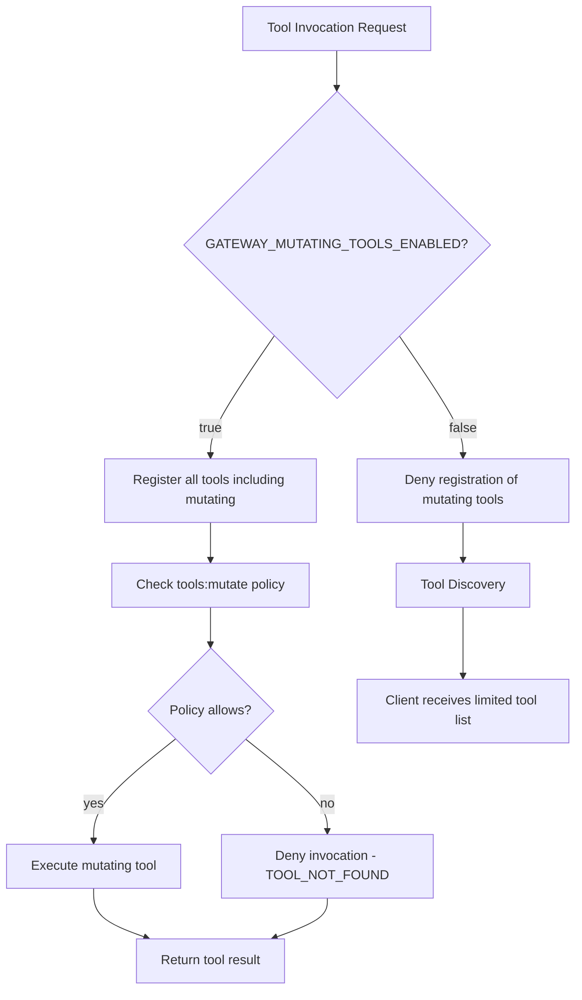

**Diagram sources**
- [config.py](file://products/tool-gateway/src/tool_gateway/core/config.py)
- [registry.py](file://products/tool-gateway/src/tool_gateway/tools/registry.py)
- [app.py](file://products/tool-gateway/src/tool_gateway/app.py)

**Section sources**
- [config.py](file://products/tool-gateway/src/tool_gateway/core/config.py)
- [registry.py](file://products/tool-gateway/src/tool_gateway/tools/registry.py)
- [app.py](file://products/tool-gateway/src/tool_gateway/app.py)

### Enhanced Agent Auto-Allow List Functionality
- Purpose: Provide read-only auto-approval for vetted tools while preventing accidental auto-execution of mutating tools.
- Configuration: Controlled by AGENT_GATEWAY_TOOL_AUTO_ALLOW environment variable (comma-separated tool names).
- Enforcement: Only tools marked as is_read_only=true AND in the allow list are auto-approved.
- Logging: Logs warnings when mutating tools appear in the auto-allow list to indicate misconfiguration.
- Safety: Maintains read-only invariant - mutating tools in the allow list still require HITL confirmation.
- Default: Built-in vetted read-only tools are auto-approved when no custom list is configured.

**New Section** Enhanced agent auto-allow list with read-only enforcement and comprehensive misconfiguration logging.

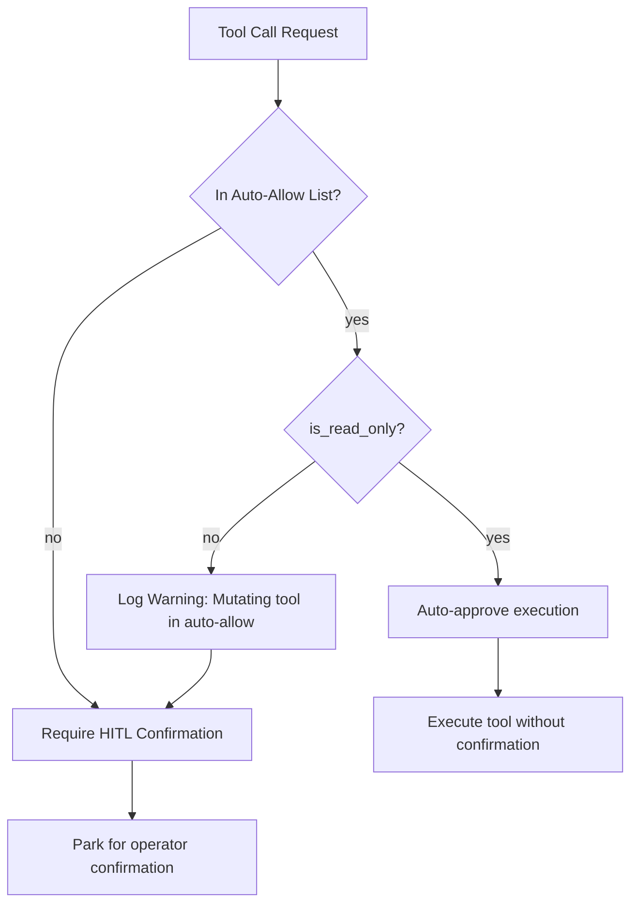

**Diagram sources**
- [kernel_middleware.py](file://products/agent-platform/src/agent_service/services/kernel_middleware.py)
- [gateway_tools.py](file://products/agent-platform/src/agent_service/tools/gateway_tools.py)

**Section sources**
- [kernel_middleware.py](file://products/agent-platform/src/agent_service/services/kernel_middleware.py)
- [gateway_tools.py](file://products/agent-platform/src/agent_service/tools/gateway_tools.py)

### HITL Confirmation Timeout Configuration
- Purpose: Control how long parked kernel confirmations remain answerable before timing out.
- Configuration: Controlled by AGENT_HITL_CONFIRM_TIMEOUT environment variable (default: 600 seconds).
- Behavior: When set to 0, disables the confirmation bridge and restores pre-SPEC-020 silent-park posture.
- Validation: Rejects negative values with clear error messages during startup.
- Use Case: Balances operational efficiency with safety requirements for different environments.
- Integration: Works with the confirmation bridge to park and resume tool calls requiring operator approval.

**New Section** Configurable HITL confirmation timeout that balances operational efficiency with safety requirements.

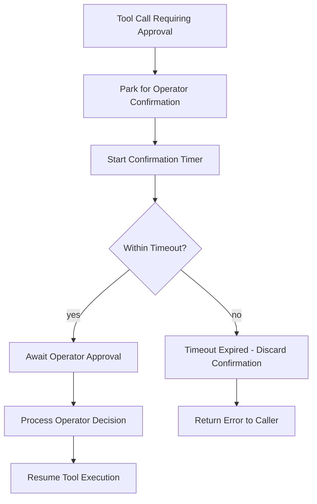

**Diagram sources**
- [runtime_settings.py](file://products/agent-platform/src/agent_service/runtime_settings.py)

**Section sources**
- [runtime_settings.py](file://products/agent-platform/src/agent_service/runtime_settings.py)

### Enhanced Telemetry System
- Purpose: Opt-in OpenTelemetry push pipeline with fail-open behavior and durable secret provisioning.
- Gating: Controlled by OTEL_ENABLED environment variable (default false).
- Authentication: Uses OTEL_EXPORTER_OTLP_HEADERS for Basic auth against OpenObserve ingest endpoint.
- Fail-open: Setup errors are logged but never raised into the request path.
- Signals: Exports traces, metrics, and logs via OTLP HTTP/protobuf.
- **New**: Durable secret provisioning ensures authentication headers persist across all deployment operations.

**New Section** Comprehensive telemetry implementation with enhanced secret management that maintains OTel authentication headers across deployment operations through cluster-side merging and local file preservation.

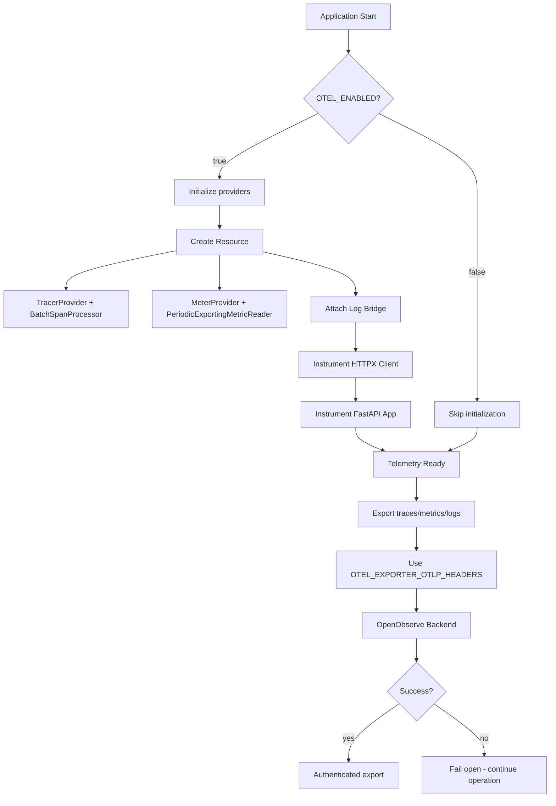

**Diagram sources**
- [telemetry.py](file://products/platform-gateway/src/platform_gateway/core/telemetry.py)
- [sync-otel-secrets.sh](file://shared/platform-ops/gitops/sync-otel-secrets.sh)

**Section sources**
- [telemetry.py](file://products/platform-gateway/src/platform_gateway/core/telemetry.py)

### Durable Secret Provisioning System
- Purpose: Ensure OpenTelemetry authentication headers persist across all deployment operations.
- Cluster-side merging: Uses `kubectl patch --type merge` to update only the OTEL key in existing secrets.
- Local file preservation: Mirrors headers into local env files to maintain consistency.
- Sibling script hooks: Other sync scripts preserve existing OTel headers during their operations.
- Agent-platform profile handling: Special handling for agent-platform runtime profile files.
- **New**: Automatic workload restarts after secret updates to apply changes immediately.

**New Section** Comprehensive secret provisioning system that maintains OTel authentication headers across all deployment operations through cluster-side merging and local file preservation.

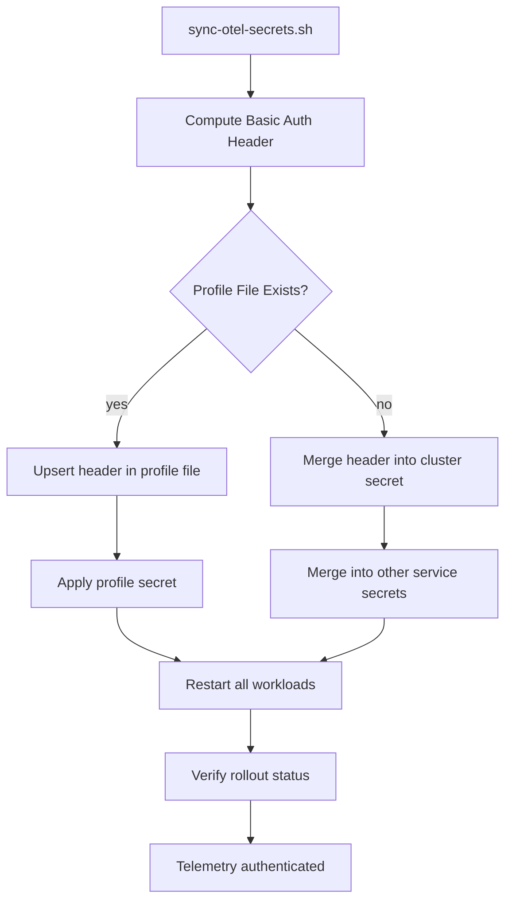

**Diagram sources**
- [sync-otel-secrets.sh](file://shared/platform-ops/gitops/sync-otel-secrets.sh)
- [sync-delegation-secrets.sh](file://shared/platform-ops/gitops/sync-delegation-secrets.sh)
- [sync-audit-secrets.sh](file://shared/platform-ops/gitops/sync-audit-secrets.sh)
- [sync-skills-secrets.sh](file://shared/platform-ops/gitops/sync-skills-secrets.sh)

**Section sources**
- [sync-otel-secrets.sh](file://shared/platform-ops/gitops/sync-otel-secrets.sh)
- [sync-delegation-secrets.sh](file://shared/platform-ops/gitops/sync-delegation-secrets.sh)
- [sync-audit-secrets.sh](file://shared/platform-ops/gitops/sync-audit-secrets.sh)
- [sync-skills-secrets.sh](file://shared/platform-ops/gitops/sync-skills-secrets.sh)

### Workspace Resource Proxy Routes
- Purpose: Provide read-only access to workspace resources (tools catalog and skills inventory) through the platform gateway.
- Tools proxy: `GET /api/v1/tools` enforces `tools:list` policy action and proxies to tool-gateway with delegated token.
- Skills proxy: `GET /api/v1/skills` enforces `skills:read` policy action and proxies to skills-hub with Basic authentication.
- Error handling: Returns 503 when services not configured, 502 on upstream failures, passes through 4xx client errors.

**New Section** Comprehensive workspace resource proxy implementation with appropriate authentication mechanisms and error handling.

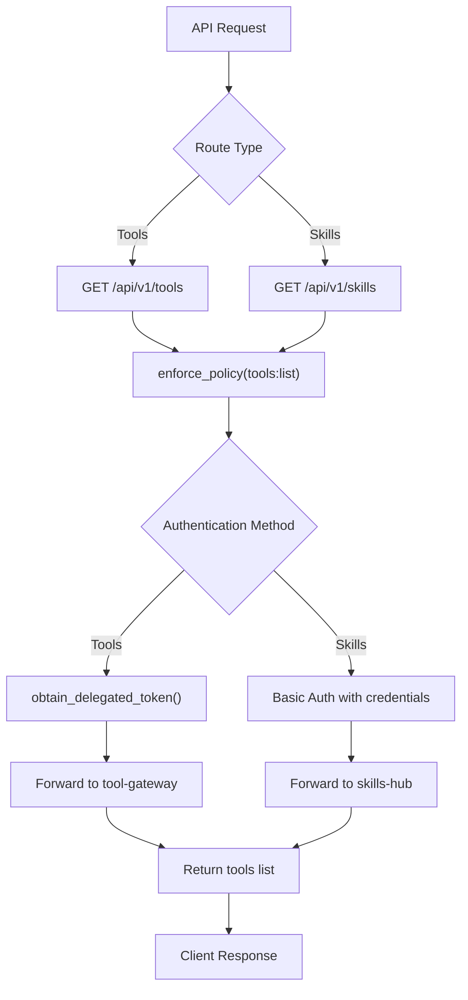

**Diagram sources**
- [tools.py](file://products/platform-gateway/src/platform_gateway/api/routes/tools.py)
- [skills.py](file://products/platform-gateway/src/platform_gateway/api/routes/skills.py)

**Section sources**
- [tools.py](file://products/platform-gateway/src/platform_gateway/api/routes/tools.py)
- [skills.py](file://products/platform-gateway/src/platform_gateway/api/routes/skills.py)

### Workspace Resource Clients
- Purpose: Handle HTTP communication with downstream workspace resource services.
- Tool gateway client: Forwards delegated tokens obtained through identity broker exchange.
- Skills hub client: Uses Basic authentication with configured client credentials.
- Error mapping: Consistent error handling with 503 for unconfigured services, 502 for upstream failures, 4xx passthrough for client errors.

**New Section** Dedicated client implementations for workspace resource integration with appropriate authentication and error handling patterns.

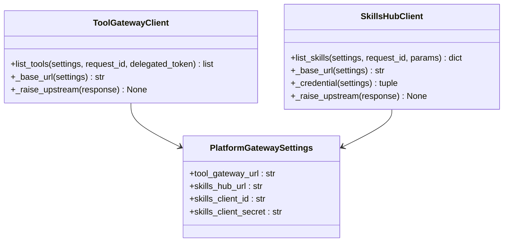

**Diagram sources**
- [tool_gateway_client.py](file://products/platform-gateway/src/platform_gateway/services/tool_gateway_client.py)
- [skills_hub_client.py](file://products/platform-gateway/src/platform_gateway/services/skills_hub_client.py)
- [config.py](file://products/platform-gateway/src/platform_gateway/core/config.py)

**Section sources**
- [tool_gateway_client.py](file://products/platform-gateway/src/platform_gateway/services/tool_gateway_client.py)
- [skills_hub_client.py](file://products/platform-gateway/src/platform_gateway/services/skills_hub_client.py)

### Runtime Settings and Port Resolution
- Purpose: Handle service binding configuration with robust port resolution.
- Port resolution: Ignores Kubernetes service-link format (`tcp://IP:PORT`) and extracts numeric ports.
- Default behavior: Falls back to default host and port when environment variables are not set.
- Development safety: Prevents conflicts between manual configuration and automatic service-link injection.

**Section sources**
- [runtime.py](file://products/platform-gateway/src/platform_gateway/core/runtime.py)

### DNS-Based Service Discovery
- Purpose: Enable reliable inter-service communication using Kubernetes DNS names.
- Configuration: Service endpoints configured via environment variables pointing to DNS names.
- Benefits: Eliminates service-link conflicts, improves reliability, and simplifies configuration.
- Implementation: Services resolve DNS names like `identity-service` to their cluster IPs.

**Section sources**
- [runtime-config.env](file://shared/platform-ops/gitops/dev-k8s/base/platform-gateway/runtime-config.env)
- [platform-gateway-deployment.yaml](file://shared/platform-ops/gitops/dev-k8s/base/platform-gateway/platform-gateway-deployment.yaml)

### Policy Engine Configuration
- Default policy: Loaded from a YAML file defining baseline rules and behaviors.
- Overrides: Can be adjusted via environment variables or mounted config files depending on implementation.
- Usage: Provides decision context for tool invocation, access control, and rate limiting.

**Section sources**
- [spec.md](file://docs/specs/SPEC-019-portal-transparency-navigation/spec.md)

### Docker Configuration
- Image build: Defines base image, working directory, and dependency installation.
- Entrypoint: Runs the Platform Gateway Service with environment variables passed through.
- Best practices: Use multi-stage builds, pin versions, minimize attack surface.

**Section sources**
- [platform-gateway-deployment.yaml](file://shared/platform-ops/gitops/dev-k8s/base/platform-gateway/platform-gateway-deployment.yaml)

### Kubernetes Deployment and ConfigMaps
- Deployment manifest: Mounts environment variables and config files into the pod.
- ConfigMap: Holds non-sensitive configuration values including service endpoints.
- Service discovery: Uses DNS names for inter-service communication.
- Environment injection: Maps ConfigMap entries to environment variables consumed by the configuration loader.
- Secrets management: Handles sensitive data like workspace resource credentials separately from ConfigMaps.
- **New**: Enhanced secret management with durable OTel header provisioning through cluster-side merging.
- **New**: Mutating-dev profile integration that merges GATEWAY_MUTATING_TOOLS_ENABLED=true into the runtime configuration.

**Updated** Enhanced deployment configuration with workspace resource integration, including tool gateway URL, skills hub URL, and skills client credentials for read-only workspace resource access, risk-tier admission gate configuration for mutating tools, configurable HITL confirmation timeouts, enhanced agent auto-allow list settings, plus durable OpenTelemetry secret provisioning that maintains authentication headers across deployment operations, and the new mutating-dev profile that provides a committed development posture for enabling mutating tools safely.

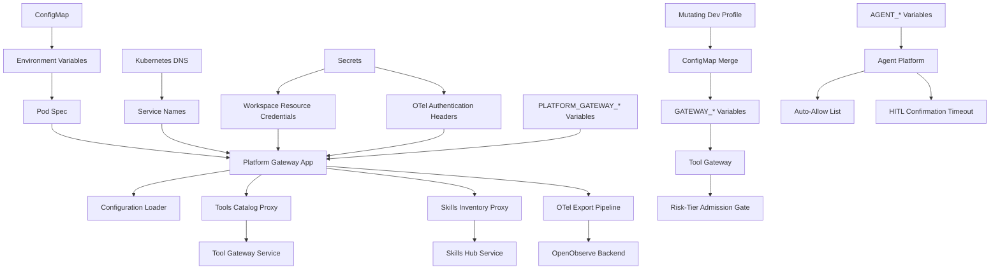

**Diagram sources**
- [platform-gateway-deployment.yaml](file://shared/platform-ops/gitops/dev-k8s/base/platform-gateway/platform-gateway-deployment.yaml)
- [runtime-config.env](file://shared/platform-ops/gitops/dev-k8s/base/platform-gateway/runtime-config.env)
- [runtime-config.env](file://shared/platform-ops/gitops/dev-k8s/base/agent-platform/runtime-config.env)
- [runtime-config.env](file://shared/platform-ops/gitops/dev-k8s/base/tool-gateway/runtime-config.env)
- [runtime-secrets.example.env](file://shared/platform-ops/gitops/dev-k8s/base/platform-gateway/runtime-secrets.example.env)
- [sync-otel-secrets.sh](file://shared/platform-ops/gitops/sync-otel-secrets.sh)
- [kustomization.yaml](file://shared/platform-ops/gitops/dev-k8s/kustomization.yaml)
- [mutating.env](file://shared/platform-ops/gitops/runtime-profiles/mutating-dev/mutating.env)

**Section sources**
- [platform-gateway-deployment.yaml](file://shared/platform-ops/gitops/dev-k8s/base/platform-gateway/platform-gateway-deployment.yaml)
- [runtime-config.env](file://shared/platform-ops/gitops/dev-k8s/base/platform-gateway/runtime-config.env)
- [runtime-config.env](file://shared/platform-ops/gitops/dev-k8s/base/agent-platform/runtime-config.env)
- [runtime-config.env](file://shared/platform-ops/gitops/dev-k8s/base/tool-gateway/runtime-config.env)
- [runtime-secrets.example.env](file://shared/platform-ops/gitops/dev-k8s/base/platform-gateway/runtime-secrets.example.env)

## Dependency Analysis
Configuration components depend on environment variables and files, while the runtime settings handle DNS-based service discovery. The Docker image encapsulates runtime dependencies, and Kubernetes manifests inject configuration at deployment time. Workspace resource integration adds dependencies on tool-gateway and skills-hub services with appropriate authentication mechanisms.

**Updated** Added dependencies for workspace resource integration including tool-gateway delegation flow and skills-hub Basic authentication, risk-tier admission gate enforcement, configurable HITL confirmation timeouts, enhanced agent auto-allow list functionality with read-only enforcement, plus enhanced OpenTelemetry secret provisioning dependencies that ensure authentication headers persist across deployment operations, and the new mutating-dev profile dependencies that provide committed development posture for enabling mutating tools safely.

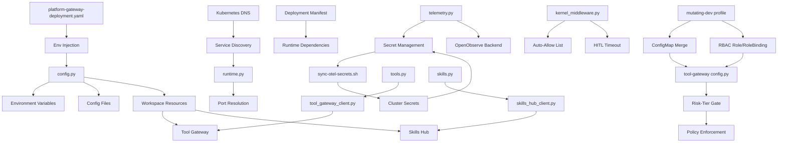

**Diagram sources**
- [config.py](file://products/platform-gateway/src/platform_gateway/core/config.py)
- [runtime.py](file://products/platform-gateway/src/platform_gateway/core/runtime.py)
- [telemetry.py](file://products/platform-gateway/src/platform_gateway/core/telemetry.py)
- [tools.py](file://products/platform-gateway/src/platform_gateway/api/routes/tools.py)
- [skills.py](file://products/platform-gateway/src/platform_gateway/api/routes/skills.py)
- [kernel_middleware.py](file://products/agent-platform/src/agent_service/services/kernel_middleware.py)
- [runtime_settings.py](file://products/agent-platform/src/agent_service/runtime_settings.py)
- [config.py](file://products/tool-gateway/src/tool_gateway/core/config.py)
- [registry.py](file://products/tool-gateway/src/tool_gateway/tools/registry.py)
- [tool_gateway_client.py](file://products/platform-gateway/src/platform_gateway/services/tool_gateway_client.py)
- [skills_hub_client.py](file://products/platform-gateway/src/platform_gateway/services/skills_hub_client.py)
- [sync-otel-secrets.sh](file://shared/platform-ops/gitops/sync-otel-secrets.sh)
- [platform-gateway-deployment.yaml](file://shared/platform-ops/gitops/dev-k8s/base/platform-gateway/platform-gateway-deployment.yaml)
- [kustomization.yaml](file://shared/platform-ops/gitops/dev-k8s/kustomization.yaml)
- [kustomization.yaml](file://shared/platform-ops/gitops/runtime-profiles/mutating-dev/kustomization.yaml)

**Section sources**
- [config.py](file://products/platform-gateway/src/platform_gateway/core/config.py)
- [runtime.py](file://products/platform-gateway/src/platform_gateway/core/runtime.py)
- [telemetry.py](file://products/platform-gateway/src/platform_gateway/core/telemetry.py)
- [tools.py](file://products/platform-gateway/src/platform_gateway/api/routes/tools.py)
- [skills.py](file://products/platform-gateway/src/platform_gateway/api/routes/skills.py)
- [kernel_middleware.py](file://products/agent-platform/src/agent_service/services/kernel_middleware.py)
- [runtime_settings.py](file://products/agent-platform/src/agent_service/runtime_settings.py)
- [config.py](file://products/tool-gateway/src/tool_gateway/core/config.py)
- [registry.py](file://products/tool-gateway/src/tool_gateway/tools/registry.py)
- [tool_gateway_client.py](file://products/platform-gateway/src/platform_gateway/services/tool_gateway_client.py)
- [skills_hub_client.py](file://products/platform-gateway/src/platform_gateway/services/skills_hub_client.py)
- [sync-otel-secrets.sh](file://shared/platform-ops/gitops/sync-otel-secrets.sh)
- [platform-gateway-deployment.yaml](file://shared/platform-ops/gitops/dev-k8s/base/platform-gateway/platform-gateway-deployment.yaml)

## Performance Considerations
- Minimize configuration lookups by caching validated configuration at startup.
- Avoid heavy I/O during request processing; pre-load policies and dependencies.
- Use efficient serialization formats for configuration files where applicable.
- Monitor configuration-related metrics and errors to detect misconfigurations early.
- Leverage Kubernetes DNS caching for improved service discovery performance.
- Optimize port resolution to avoid unnecessary string parsing operations.
- Workspace resource proxies use timeout-based connections to prevent hanging requests.
- Delegated token acquisition is cached where possible to reduce identity broker load.
- Skills hub requests use connection pooling for improved performance.
- Monitor workspace resource proxy latency and error rates for capacity planning.
- **New**: Risk-tier admission gates add minimal overhead through policy checks.
- **New**: Auto-allow list lookups use frozenset for O(1) performance.
- **New**: HITL confirmation timeouts prevent indefinite resource holding.
- **New**: OTel export pipeline uses batch processors for efficient telemetry collection.
- **New**: Secret provisioning operations are optimized to minimize cluster API calls.
- **New**: Failed OTel exports fail open to avoid impacting service performance.
- **New**: Mutating-dev profile integration is compile-time static, adding no runtime overhead.

## Troubleshooting Guide
Common issues and resolutions:
- Missing environment variables: Ensure all required variables are set in the deployment manifest or environment.
- Invalid configuration values: Check types, ranges, and cross-field constraints; review validation error messages.
- Policy loading failures: Verify YAML syntax and structure; ensure paths are correct and accessible.
- Secrets not mounted: Confirm Secret objects exist and are referenced correctly in the deployment.
- DNS resolution failures: Verify service names match Kubernetes Service resources and check network policies.
- Service link conflicts: Ensure `enableServiceLinks: false` is set in all deployment manifests.
- Port resolution issues: Check that port values are numeric and not in Kubernetes service-link format.
- Inter-service communication failures: Verify DNS names are resolvable and services are running.
- **New**: Workspace resource proxy failures: Check tool_gateway_url and skills_hub_url configuration; verify downstream services are running.
- **New**: Tools catalog proxy issues: Verify delegated token acquisition works; check identity broker configuration and permissions.
- **New**: Skills inventory proxy issues: Verify skills_client_id and skills_client_secret are properly configured; check skills-hub authentication.
- **New**: Workspace resource 503 errors: Indicates workspace resource services are not configured; verify PLATFORM_GATEWAY_TOOL_GATEWAY_URL and PLATFORM_GATEWAY_SKILLS_HUB_URL.
- **New**: Workspace resource 502 errors: Indicates upstream service failures; check tool-gateway and skills-hub service health and connectivity.
- **New**: Workspace resource 4xx errors: Indicates client-side issues; verify delegated token validity and skills authentication credentials.
- **New**: OTel authentication failures: Check if OTEL_EXPORTER_OTLP_HEADERS is properly provisioned; verify sync-otel-secrets.sh has been run successfully.
- **New**: OTel export failures: Verify OTEL_EXPORTER_OTLP_ENDPOINT is configured; check OpenObserve backend connectivity and authentication.
- **New**: Secret provisioning issues: Ensure OO_ROOT_USER_EMAIL and OO_ROOT_USER_PASSWORD are exported before running sync-otel-secrets.sh.
- **New**: Header persistence problems: Check that sibling sync scripts have preserved existing OTel headers during their operations.
- **New**: Mutating tools not available: Verify GATEWAY_MUTATING_TOOLS_ENABLED is set to true; check tools:mutate policy grants and RBAC permissions.
- **New**: Mutating tools still denied: Check policy bundle configuration; verify user roles have tools:mutate permission.
- **New**: Auto-allow list not working: Verify AGENT_GATEWAY_TOOL_AUTO_ALLOW is properly formatted; check that tools are marked as read-only.
- **New**: HITL confirmation timeout issues: Check AGENT_HITL_CONFIRM_TIMEOUT value; verify confirmation bridge is enabled.
- **New**: Negative timeout values rejected: Ensure AGENT_HITL_CONFIRM_TIMEOUT is set to 0 or positive integer.
- **New**: Mutating tools in auto-allow list: Review logs for warnings about mutating tools appearing in auto-allow list; remove them from configuration.
- **New**: Mutating-dev profile not active: Verify dev-k8s overlay includes the mutating-dev profile; check kustomize build output for ConfigMap merge.
- **New**: Pod-delete RBAC missing: Verify tool-gateway-pod-delete.yaml is applied; check namespace and service account configuration.
- **New**: Mutating tools appear in discovery but fail: Check all three gates: GATEWAY_MUTATING_TOOLS_ENABLED, tools:mutate policy grants, and AGENT_HITL_CONFIRM_TIMEOUT > 0.

**Updated** Added comprehensive troubleshooting guidance for workspace resource integration including proxy configuration, authentication issues, and downstream service connectivity problems, risk-tier admission gate configuration issues, HITL confirmation timeout problems, enhanced agent auto-allow list misconfiguration detection, plus detailed guidance for OpenTelemetry secret provisioning and authentication issues, and new troubleshooting steps for the mutating-dev profile integration including profile activation, RBAC verification, and triple-gate enforcement issues.

**Section sources**
- [config.py](file://products/platform-gateway/src/platform_gateway/core/config.py)
- [runtime.py](file://products/platform-gateway/src/platform_gateway/core/runtime.py)
- [telemetry.py](file://products/platform-gateway/src/platform_gateway/core/telemetry.py)
- [tools.py](file://products/platform-gateway/src/platform_gateway/api/routes/tools.py)
- [skills.py](file://products/platform-gateway/src/platform_gateway/api/routes/skills.py)
- [kernel_middleware.py](file://products/agent-platform/src/agent_service/services/kernel_middleware.py)
- [runtime_settings.py](file://products/agent-platform/src/agent_service/runtime_settings.py)
- [gateway_tools.py](file://products/agent-platform/src/agent_service/tools/gateway_tools.py)
- [config.py](file://products/tool-gateway/src/tool_gateway/core/config.py)
- [registry.py](file://products/tool-gateway/src/tool_gateway/tools/registry.py)
- [tool_gateway_client.py](file://products/platform-gateway/src/platform_gateway/services/tool_gateway_client.py)
- [skills_hub_client.py](file://products/platform-gateway/src/platform_gateway/services/skills_hub_client.py)
- [sync-otel-secrets.sh](file://shared/platform-ops/gitops/sync-otel-secrets.sh)
- [platform-gateway-deployment.yaml](file://shared/platform-ops/gitops/dev-k8s/base/platform-gateway/platform-gateway-deployment.yaml)

## Conclusion
The Platform Gateway Service employs a robust, layered configuration system that integrates environment variables, configuration files, and runtime overrides with strict validation. By following the outlined best practices for Docker and Kubernetes deployments, teams can maintain secure, consistent configurations across environments while ensuring reliability and performance. The architectural shift to DNS-based service discovery eliminates service-link conflicts and provides more reliable inter-service communication patterns. The addition of workspace resource integration enables operators to gain self-service visibility into their workspace resources through read-only proxies for tools catalog and skills inventory, enhancing operational transparency and reducing dependency on agent-mediated resource discovery.

**Updated** Enhanced conclusion reflecting the architectural improvements in service discovery, environment variable handling, comprehensive workspace resource integration capabilities that provide operators with direct visibility into their workspace resources, risk-tier admission gates that provide fine-grained control over mutating tool access, configurable HITL confirmation timeouts that balance operational efficiency with safety requirements, enhanced agent auto-allow list functionality with read-only enforcement and misconfiguration logging, plus durable OpenTelemetry secret provisioning that ensures authentication headers persist across all deployment operations, maintaining consistent telemetry collection regardless of deployment sequence or environment regeneration, and the new mutating-dev kustomize profile that provides a committed, safe development posture for enabling mutating tools with appropriate RBAC controls and triple-gate security enforcement.

## Appendices

### Environment-Specific Settings
- Development: Enable verbose logging, relaxed validation, local secrets, optional redaction disablement, memory-based storage, local git sources without authentication, enable workspace resource proxies with local tool-gateway and skills-hub instances, configure OTel with dev OpenObserve credentials, set GATEWAY_MUTATING_TOOLS_ENABLED=false for safety, configure AGENT_HITL_CONFIRM_TIMEOUT=600 for reasonable confirmation windows, enable enhanced agent auto-allow list with vetted read-only tools, **new**: Include the mutating-dev profile permanently for safe development access to mutating tools with bounded RBAC permissions.
- Staging: Mirror production settings with test data and limited scope, enable full redaction, PostgreSQL-backed storage, private repository access with test tokens, configure workspace resource proxies with staging backend services, provision OTel secrets with staging OpenObserve credentials, carefully evaluate GATEWAY_MUTATING_TOOLS_ENABLED for testing scenarios, tune AGENT_HITL_CONFIRM_TIMEOUT for staging workflows, monitor auto-allow list effectiveness, **new**: Consider including mutating-dev profile selectively for staging testing scenarios with appropriate RBAC scoping.
- Production: Strict validation, minimal logging, centralized secret management, mandatory workload identity, optimized sync intervals, secure private repository authentication, configure workspace resource proxies with production backend services and proper authentication, ensure OTel secrets are provisioned with production OpenObserve credentials, keep GATEWAY_MUTATING_TOOLS_ENABLED=false unless absolutely necessary, set AGENT_HITL_CONFIRM_TIMEOUT appropriately for production SLAs, audit auto-allow list regularly for security compliance, **new**: Never include mutating-dev profile in production deployments; use separate controlled overlays if mutating tools are absolutely required.

**Updated** Added guidance for workspace resource proxy configuration across environments, including tool gateway URL, skills hub URL, and skills client credentials for read-only workspace resource access, risk-tier admission gate configuration recommendations, HITL confirmation timeout tuning guidelines, enhanced agent auto-allow list configuration, plus comprehensive OTel secret provisioning requirements for each environment, and new guidance for the mutating-dev profile usage patterns across different deployment environments.

### Security and Secrets Management
- Store secrets in Kubernetes Secrets or external vaults; never hardcode.
- Rotate secrets regularly and audit access logs.
- Use least privilege principles for service accounts and RBAC.
- Prefer workload identity over static credentials in production environments.
- Configure appropriate redaction sensitivity levels based on data classification.
- Monitor redaction metrics and workload identity authentication attempts.
- Use DNS-based service discovery to avoid exposing service endpoints in environment variables.
- Disable service links to prevent accidental exposure of internal service information.
- **New**: Secure workspace resource credentials using Kubernetes Secrets; never commit PLATFORM_GATEWAY_SKILLS_CLIENT_SECRET to version control.
- **New**: Validate delegated token acquisition for tools catalog access; ensure proper identity broker configuration.
- **New**: Monitor workspace resource proxy authentication attempts and failed authentication attempts.
- **New**: Implement rate limiting for workspace resource proxy endpoints to prevent abuse.
- **New**: Audit workspace resource access patterns for security monitoring and compliance.
- **New**: Protect OTel authentication headers using Kubernetes Secrets; never commit OTEL_EXPORTER_OTLP_HEADERS to version control.
- **New**: Restrict access to sync-otel-secrets.sh script to authorized personnel only.
- **New**: Monitor OTel export success/failure rates for security and operational insights.
- **New**: Implement alerting for OTel authentication failures and secret provisioning issues.
- **New**: Keep GATEWAY_MUTATING_TOOLS_ENABLED=false in production unless explicitly required and approved.
- **New**: Regularly audit tools:mutate policy grants and RBAC permissions for mutating tool access.
- **New**: Monitor auto-allow list usage and log warnings for mutating tools appearing in the list.
- **New**: Set AGENT_HITL_CONFIRM_TIMEOUT appropriately to balance security with operational needs.
- **New**: Audit HITL confirmation patterns to identify potential security risks or operational inefficiencies.
- **New**: Treat the mutating-dev profile as a security boundary; never modify it to bypass triple-gate enforcement.
- **New**: Monitor pod-delete RBAC usage and audit logs for unauthorized deletion attempts.
- **New**: Implement change management processes for any modifications to the mutating-dev profile.

**Updated** Enhanced security guidance with workspace resource integration security considerations, including credential management, authentication monitoring, and access pattern auditing, risk-tier admission gate security controls, HITL confirmation timeout security implications, enhanced agent auto-allow list security enforcement, plus comprehensive OpenTelemetry secret management security practices, and new security considerations for the mutating-dev profile including profile integrity, RBAC scoping, and triple-gate enforcement monitoring.

### Complete Environment Variables Reference
**Updated** Comprehensive reference including workspace resource integration variables for tools catalog and skills inventory access, risk-tier admission gate configuration, HITL confirmation timeout settings, enhanced agent auto-allow list configuration, plus enhanced OpenTelemetry configuration variables, and new variables related to the mutating-dev profile integration.

#### Core Configuration
- `AGENT_SERVICE_URL`: Agent service endpoint URL (DNS-based)
- `IDENTITY_SERVICE_URL`: Identity broker service endpoint URL (DNS-based)
- `IDENTITY_JWKS_URL`: Identity service JWKS endpoint
- `IDENTITY_JWKS_CACHE_SECONDS`: JWCS cache duration (default: 300)
- `IDENTITY_TOKEN_ISSUER`: JWT issuer claim (default: "luban-identity-broker")
- `PLATFORM_GATEWAY_TOKEN_AUDIENCE`: Token audience (default: "platform-gateway")
- `PLATFORM_GATEWAY_DELEGATION_AUDIENCE`: Delegation audience (default: "tool-gateway")

#### Runtime Configuration
- `PLATFORM_GATEWAY_HOST`: Service bind host (default: 0.0.0.0)
- `PLATFORM_GATEWAY_PORT`: Service bind port (numeric only, service-link format ignored)

#### Operational Configuration
- `PLATFORM_GATEWAY_REQUIRE_AUTH`: Require authentication (default: true)
- `PLATFORM_GATEWAY_POLICY_PATH`: Policy file path
- `CHAT_RESPONSE_TIMEOUT_SECONDS`: Chat response timeout (default: 30)

#### Workspace Resource Integration
- `PLATFORM_GATEWAY_TOOL_GATEWAY_URL`: Tool gateway URL for tools catalog proxy (e.g., http://tool-gateway:8000)
- `PLATFORM_GATEWAY_SKILLS_HUB_URL`: Skills hub URL for skills inventory proxy (e.g., http://skills-hub:8000)
- `PLATFORM_GATEWAY_SKILLS_CLIENT_ID`: Skills hub client ID for Basic authentication (default: "platform-gateway")
- `PLATFORM_GATEWAY_SKILLS_CLIENT_SECRET`: Skills hub client secret for Basic authentication (stored in secrets)

#### Audit and Incident Services
- `PLATFORM_GATEWAY_AUDIT_SERVICE_URL`: Audit service URL for durable audit trail
- `PLATFORM_GATEWAY_AUDIT_CLIENT_ID`: Audit service client ID (default: "platform-gateway")
- `PLATFORM_GATEWAY_AUDIT_CLIENT_SECRET`: Audit service client secret (stored in secrets)
- `PLATFORM_GATEWAY_INCIDENT_SERVICE_URL`: Incident service URL for incident triage
- `PLATFORM_GATEWAY_INCIDENT_CLIENT_ID`: Incident service client ID (default: "platform-gateway")
- `PLATFORM_GATEWAY_INCIDENT_CLIENT_SECRET`: Incident service client secret (stored in secrets)
- `PLATFORM_GATEWAY_INCIDENT_TRIAGE_TIMEOUT_SECONDS`: Incident triage timeout (default: 120)

#### Risk-Tier Admission Gate (Tool Gateway)
- `GATEWAY_MUTATING_TOOLS_ENABLED`: Enable/disable mutating tools (default: false, overridden to true in mutating-dev profile)
- `GATEWAY_K8S_ENABLED`: Enable Kubernetes connector (default: false)
- `GATEWAY_K8S_NAMESPACE`: Default namespace for K8s operations

#### Agent Platform Configuration
- `AGENT_GATEWAY_TOOL_AUTO_ALLOW`: Comma-separated list of auto-allowed tools (default: built-in vetted read-only tools)
- `AGENT_HITL_CONFIRM_TIMEOUT`: HITL confirmation timeout in seconds (default: 600, 0 to disable)

#### Enhanced OpenTelemetry Configuration
- `OTEL_ENABLED`: Enable/disable OTel push pipeline (default: false)
- `OTEL_EXPORTER_OTLP_ENDPOINT`: OTLP endpoint for traces/metrics/logs (e.g., http://openobserve:5080)
- `OTEL_EXPORTER_OTLP_HEADERS`: Authentication headers for OTLP endpoint (provisioned by sync-otel-secrets.sh)
- `OTEL_SERVICE_NAME`: Service name for telemetry (default: derived from service)

#### Mutating Dev Profile Configuration
- **Note**: The mutating-dev profile automatically sets `GATEWAY_MUTATING_TOOLS_ENABLED=true` through kustomize ConfigMap merge in the dev-k8s overlay
- **Note**: No additional environment variables needed; the profile handles configuration merge and RBAC application automatically

**Section sources**
- [config.py](file://products/platform-gateway/src/platform_gateway/core/config.py)
- [runtime.py](file://products/platform-gateway/src/platform_gateway/core/runtime.py)
- [telemetry.py](file://products/platform-gateway/src/platform_gateway/core/telemetry.py)
- [kernel_middleware.py](file://products/agent-platform/src/agent_service/services/kernel_middleware.py)
- [runtime_settings.py](file://products/agent-platform/src/agent_service/runtime_settings.py)
- [config.py](file://products/tool-gateway/src/tool_gateway/core/config.py)
- [runtime-config.env](file://shared/platform-ops/gitops/dev-k8s/base/platform-gateway/runtime-config.env)
- [runtime-config.env](file://shared/platform-ops/gitops/dev-k8s/base/agent-platform/runtime-config.env)
- [runtime-config.env](file://shared/platform-ops/gitops/dev-k8s/base/tool-gateway/runtime-config.env)
- [runtime-secrets.example.env](file://shared/platform-ops/gitops/dev-k8s/base/platform-gateway/runtime-secrets.example.env)
- [sync-otel-secrets.sh](file://shared/platform-ops/gitops/sync-otel-secrets.sh)
- [mutating.env](file://shared/platform-ops/gitops/runtime-profiles/mutating-dev/mutating.env)

### Workspace Resource Integration Guide
**New Section** Step-by-step guide for configuring workspace resource integration with tools catalog and skills inventory proxies.

#### Prerequisites
- Tool-gateway service deployed and accessible
- Skills-hub service deployed and accessible
- Identity broker configured for delegated token exchange
- Skills-hub configured with query clients registry
- Proper network policies allowing platform-gateway to reach workspace resources
- OpenTelemetry backend configured and accessible

#### Configuration Steps
1. Set `PLATFORM_GATEWAY_TOOL_GATEWAY_URL` to point to tool-gateway service
2. Set `PLATFORM_GATEWAY_SKILLS_HUB_URL` to point to skills-hub service
3. Configure `PLATFORM_GATEWAY_SKILLS_CLIENT_ID` and `PLATFORM_GATEWAY_SKILLS_CLIENT_SECRET` in secrets
4. Deploy with proper secret mounting for workspace resource credentials
5. Run `sync-otel-secrets.sh` to provision OTel authentication headers
6. Verify workspace resource proxies by accessing `/api/v1/tools` and `/api/v1/skills`
7. Verify OTel telemetry is flowing to backend

#### Example Configuration
```yaml
apiVersion: v1
kind: ConfigMap
metadata:
  name: platform-runtime-config
data:
  PLATFORM_GATEWAY_TOOL_GATEWAY_URL: "http://tool-gateway:8000"
  PLATFORM_GATEWAY_SKILLS_HUB_URL: "http://skills-hub:8000"
  PLATFORM_GATEWAY_SKILLS_CLIENT_ID: "platform-gateway"
  OTEL_EXPORTER_OTLP_ENDPOINT: "http://openobserve:5080"
---
apiVersion: v1
kind: Secret
metadata:
  name: platform-gateway-runtime-secrets
type: Opaque
stringData:
  PLATFORM_GATEWAY_SKILLS_CLIENT_SECRET: "your-skills-client-secret"
  # OTEL_EXPORTER_OTLP_HEADERS will be provisioned by sync-otel-secrets.sh
```

#### Authentication Flow
- Tools catalog: Uses delegated token flow through identity broker exchange
- Skills inventory: Uses Basic authentication with configured client credentials
- Both proxies enforce appropriate policy actions before forwarding requests
- OTel exports use Basic authentication via OTEL_EXPORTER_OTLP_HEADERS

**Section sources**
- [runtime-config.env](file://shared/platform-ops/gitops/dev-k8s/base/platform-gateway/runtime-config.env)
- [runtime-secrets.example.env](file://shared/platform-ops/gitops/dev-k8s/base/platform-gateway/runtime-secrets.example.env)
- [tools.py](file://products/platform-gateway/src/platform_gateway/api/routes/tools.py)
- [skills.py](file://products/platform-gateway/src/platform_gateway/api/routes/skills.py)
- [sync-otel-secrets.sh](file://shared/platform-ops/gitops/sync-otel-secrets.sh)

### Enhanced Secret Provisioning Guide
**New Section** Comprehensive guide for managing OpenTelemetry secret provisioning and maintenance.

#### Prerequisites
- OpenObserve root credentials (OO_ROOT_USER_EMAIL, OO_ROOT_USER_PASSWORD)
- Access to Kubernetes cluster with kubectl configured
- Network connectivity to OpenObserve backend

#### Provisioning Steps
1. Export OpenObserve credentials: `export OO_ROOT_USER_EMAIL=your-email@example.com`
2. Export password: `export OO_ROOT_USER_PASSWORD=your-password`
3. Run provisioning script: `shared/platform-ops/gitops/sync-otel-secrets.sh`
4. Verify all secrets were updated: `kubectl get secrets -o custom-columns=NAME:.metadata.name,KEYS:.data | grep OTEL`
5. Check rollout status: `kubectl rollout status deployment/platform-gateway`

#### Maintenance Operations
- **Rotate credentials**: Re-run sync-otel-secrets.sh with new credentials
- **Verify headers**: Check pod environment variables for OTEL_EXPORTER_OTLP_HEADERS
- **Monitor exports**: Verify telemetry is flowing to OpenObserve backend
- **Troubleshoot failures**: Check pod logs for authentication errors

#### Security Considerations
- Never commit OpenObserve credentials to version control
- Restrict access to sync-otel-secrets.sh script
- Monitor secret rotation events and authentication failures
- Implement proper RBAC for secret management operations

**Section sources**
- [sync-otel-secrets.sh](file://shared/platform-ops/gitops/sync-otel-secrets.sh)
- [runtime-secrets.example.env](file://shared/platform-ops/gitops/dev-k8s/base/platform-gateway/runtime-secrets.example.env)

### Mutating Dev Profile Configuration Guide
**New Section** Comprehensive guide for understanding and managing the mutating-dev kustomize profile that provides a committed development posture for enabling mutating tools safely.

#### Profile Architecture
- **Location**: `shared/platform-ops/gitops/runtime-profiles/mutating-dev/`
- **Integration**: Permanently wired into dev-k8s overlay via kustomize configuration
- **Purpose**: Provides safe, committed development posture for enabling mutating tools with bounded RBAC permissions
- **Safety**: Maintains deny-by-default base posture while providing explicit opt-in for development

#### Configuration Components
- **mutating.env**: Contains `GATEWAY_MUTATING_TOOLS_ENABLED=true` that gets merged into platform-runtime-config ConfigMap
- **tool-gateway-pod-delete.yaml**: Provides bounded RBAC permissions (delete pods only in dev-luban-aiops namespace)
- **kustomization.yaml**: Declares the profile as a kustomize resource with RBAC manifests

#### Triple-Gate Security Model
The mutating-dev profile enables the first gate (risk-tier admission), but all three gates must pass:
1. **Risk-tier admission**: `GATEWAY_MUTATING_TOOLS_ENABLED=true` (provided by profile)
2. **Policy grants**: `tools:mutate` action granted to appropriate roles
3. **HITL confirmation**: `AGENT_HITL_CONFIRM_TIMEOUT > 0` for operator approval

#### Deployment and Verification
```bash
# Deploy with mutating-dev profile (already included in dev-k8s)
make deploy

# Verify the profile is active
kubectl get configmap platform-runtime-config -n dev-luban-aiops -o jsonpath='{.data.GATEWAY_MUTATING_TOOLS_ENABLED}'

# Verify RBAC permissions
kubectl auth can-i delete pods -n dev-luban-aiops \
  --as=system:serviceaccount:dev-luban-aiops:tool-gateway

# Verify tool discovery includes k8s.delete_pod
kubectl exec deployment/tool-gateway -n dev-luban-aiops -- \
  curl -s http://localhost:8000/api/v2/tools | jq '.[].name' | grep delete_pod
```

#### Security Considerations
- **Never modify** the mutating-dev profile to bypass triple-gate enforcement
- **Scope is bounded**: RBAC only allows delete on pods in dev-luban-aiops namespace
- **Audit regularly**: Monitor pod-delete operations and policy decisions
- **Change management**: Any modifications require security review and approval
- **Production isolation**: Never include this profile in production deployments

#### Deactivation Process
To temporarily deactivate the mutating-dev profile:
```bash
# Remove profile from dev-k8s overlay
sed -i '/mutating-dev/d' shared/platform-ops/gitops/dev-k8s/kustomization.yaml

# Remove ConfigMap merge block
sed -i '/configMapGenerator/,/mutating.env/d' shared/platform-ops/gitops/dev-k8s/kustomization.yaml

# Redeploy and clean up RBAC
make deploy
kubectl delete -f shared/platform-ops/gitops/runtime-profiles/mutating-dev/tool-gateway-pod-delete.yaml
```

**Section sources**
- [kustomization.yaml](file://shared/platform-ops/gitops/dev-k8s/kustomization.yaml)
- [kustomization.yaml](file://shared/platform-ops/gitops/runtime-profiles/mutating-dev/kustomization.yaml)
- [mutating.env](file://shared/platform-ops/gitops/runtime-profiles/mutating-dev/mutating.env)
- [tool-gateway-pod-delete.yaml](file://shared/platform-ops/gitops/runtime-profiles/mutating-dev/tool-gateway-pod-delete.yaml)
- [README.md](file://shared/platform-ops/gitops/runtime-profiles/README.md)

### Enhanced Agent Auto-Allow List Guide
**New Section** Comprehensive guide for configuring and managing the enhanced agent auto-allow list functionality.

#### Prerequisites
- Agent platform service deployed and configured
- Understanding of which tools are classified as read-only vs. mutating
- Knowledge of AGENT_GATEWAY_TOOL_AUTO_ALLOW environment variable format

#### Configuration Steps
1. Set `AGENT_GATEWAY_TOOL_AUTO_ALLOW` with comma-separated tool names
2. Verify tools are marked as read-only in their definitions
3. Monitor logs for warnings about mutating tools in auto-allow list
4. Test auto-approval behavior for configured tools
5. Regularly review and update auto-allow list as needed

#### Security Considerations
- Only include vetted read-only tools in the auto-allow list
- Monitor logs for warnings about mutating tools appearing in the list
- Regularly audit auto-allow list usage and effectiveness
- Remove tools from auto-allow list if they become unsafe or deprecated

#### Example Configuration
```yaml
apiVersion: v1
kind: ConfigMap
metadata:
  name: agent-platform-runtime-config
data:
  AGENT_GATEWAY_TOOL_AUTO_ALLOW: "k8s.list_pods,k8s.get_pod,skills.search,skills.list"
```

#### Monitoring and Diagnostics
- Check agent platform logs for auto-allow list warnings
- Monitor tool execution patterns to verify auto-approval behavior
- Review policy decisions for tools not in auto-allow list
- Track HITL confirmation frequency for operational insights

**Section sources**
- [kernel_middleware.py](file://products/agent-platform/src/agent_service/services/kernel_middleware.py)
- [gateway_tools.py](file://products/agent-platform/src/agent_service/tools/gateway_tools.py)
- [runtime-config.env](file://shared/platform-ops/gitops/dev-k8s/base/agent-platform/runtime-config.env)

### HITL Confirmation Timeout Configuration Guide
**New Section** Comprehensive guide for configuring HITL confirmation timeouts to balance operational efficiency with safety requirements.

#### Prerequisites
- Agent platform service deployed with SPEC-020 confirmation bridge
- Understanding of confirmation workflow and timeout implications
- Knowledge of different environment requirements (dev, staging, production)

#### Configuration Options
- `AGENT_HITL_CONFIRM_TIMEOUT=0`: Disables confirmation bridge (silent-park posture)
- `AGENT_HITL_CONFIRM_TIMEOUT=600`: Default 10-minute timeout (recommended for most environments)
- `AGENT_HITL_CONFIRM_TIMEOUT=300`: 5-minute timeout for faster-paced environments
- `AGENT_HITL_CONFIRM_TIMEOUT=1800`: 30-minute timeout for complex approval workflows

#### Environment Recommendations
- **Development**: AGENT_HITL_CONFIRM_TIMEOUT=300 for rapid iteration
- **Staging**: AGENT_HITL_CONFIRM_TIMEOUT=600 for realistic testing
- **Production**: AGENT_HITL_CONFIRM_TIMEOUT=600-1800 based on operational requirements

#### Monitoring and Diagnostics
- Monitor confirmation timeout expiration events
- Track HITL confirmation completion rates
- Analyze timeout patterns to optimize configuration
- Alert on excessive timeout expirations indicating operational issues

#### Example Configuration
```yaml
apiVersion: v1
kind: ConfigMap
metadata:
  name: agent-platform-runtime-config
data:
  AGENT_HITL_CONFIRM_TIMEOUT: "600"
```

**Section sources**
- [runtime_settings.py](file://products/agent-platform/src/agent_service/runtime_settings.py)
- [runtime-config.env](file://shared/platform-ops/gitops/dev-k8s/base/agent-platform/runtime-config.env)

### Workspace Resource Troubleshooting Guide
**New Section** Comprehensive troubleshooting guide for workspace resource integration configuration and connectivity issues.

#### Common Issues and Solutions
- **Workspace resource 503 errors**: Indicates workspace resource services are not configured; verify PLATFORM_GATEWAY_TOOL_GATEWAY_URL and PLATFORM_GATEWAY_SKILLS_HUB_URL are set correctly
- **Tools catalog 502 errors**: Indicates tool-gateway connectivity issues; check tool-gateway service health and network policies
- **Skills inventory 401 errors**: Indicates skills authentication failures; verify PLATFORM_GATEWAY_SKILLS_CLIENT_SECRET matches skills-hub configuration
- **Delegated token acquisition failures**: Check identity broker configuration and permissions for platform-gateway service
- **High latency on workspace resource requests**: Monitor downstream service performance and consider increasing timeouts if needed
- **OTel export failures**: Verify OTEL_EXPORTER_OTLP_HEADERS is present and valid; check OpenObserve backend connectivity
- **Secret provisioning failures**: Ensure OO_ROOT_USER_EMAIL and OO_ROOT_USER_PASSWORD are exported; verify kubectl access to cluster
- **Mutating tools not available**: Check GATEWAY_MUTATING_TOOLS_ENABLED setting and tools:mutate policy grants
- **Auto-allow list warnings**: Review logs for warnings about mutating tools appearing in auto-allow list
- **HITL confirmation timeouts**: Adjust AGENT_HITL_CONFIRM_TIMEOUT based on operational requirements
- **Mutating-dev profile not active**: Verify dev-k8s overlay includes the mutating-dev profile; check kustomize build output
- **Pod-delete RBAC missing**: Verify tool-gateway-pod-delete.yaml is applied; check namespace and service account configuration
- **Triple-gate enforcement failures**: Ensure all three gates pass: GATEWAY_MUTATING_TOOLS_ENABLED, tools:mutate policy grants, and AGENT_HITL_CONFIRM_TIMEOUT > 0

#### Monitoring and Diagnostics
- Check platform-gateway logs for workspace resource proxy errors
- Monitor delegated token acquisition success rates
- Track skills authentication attempt success/failure ratios
- Verify workspace resource proxy endpoint availability and response times
- Monitor OTel export success/failure rates and authentication errors
- Check secret provisioning logs for sync-otel-secrets.sh execution results
- Monitor risk-tier admission gate policy decisions
- Track auto-allow list usage and warning logs
- Analyze HITL confirmation timeout patterns
- Monitor mutating-dev profile activation status and RBAC permissions

**Section sources**
- [tool_gateway_client.py](file://products/platform-gateway/src/platform_gateway/services/tool_gateway_client.py)
- [skills_hub_client.py](file://products/platform-gateway/src/platform_gateway/services/skills_hub_client.py)
- [tools.py](file://products/platform-gateway/src/platform_gateway/api/routes/tools.py)
- [skills.py](file://products/platform-gateway/src/platform_gateway/api/routes/skills.py)
- [kernel_middleware.py](file://products/agent-platform/src/agent_service/services/kernel_middleware.py)
- [runtime_settings.py](file://products/agent-platform/src/agent_service/runtime_settings.py)
- [config.py](file://products/tool-gateway/src/tool_gateway/core/config.py)
- [registry.py](file://products/tool-gateway/src/tool_gateway/tools/registry.py)
- [sync-otel-secrets.sh](file://shared/platform-ops/gitops/sync-otel-secrets.sh)
- [kustomization.yaml](file://shared/platform-ops/gitops/dev-k8s/kustomization.yaml)
- [tool-gateway-pod-delete.yaml](file://shared/platform-ops/gitops/runtime-profiles/mutating-dev/tool-gateway-pod-delete.yaml)