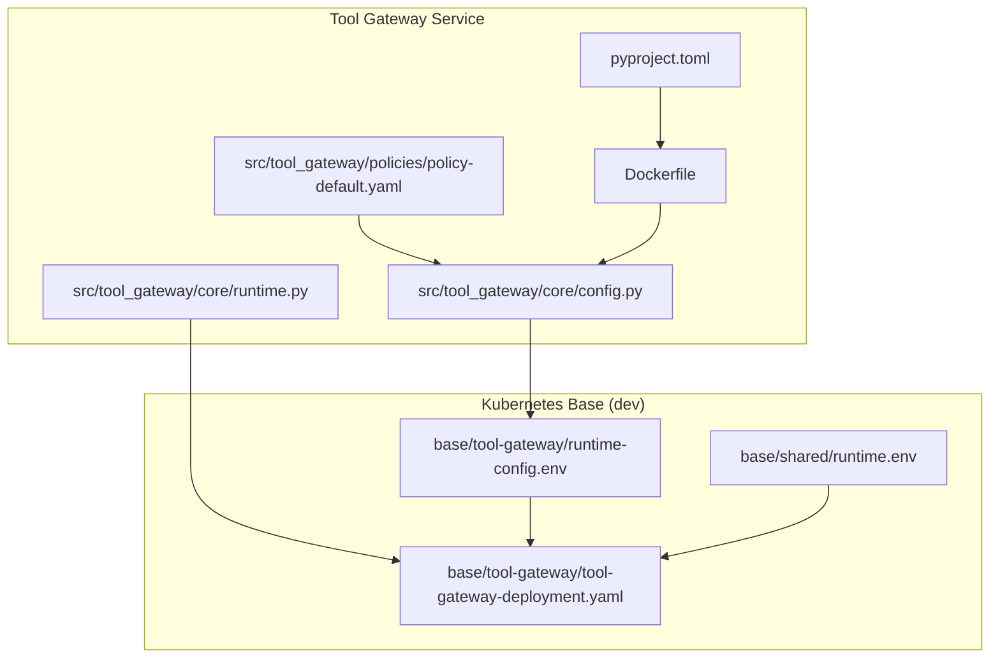
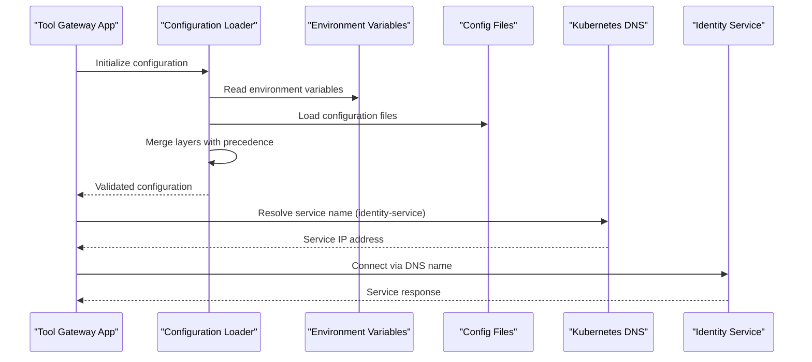
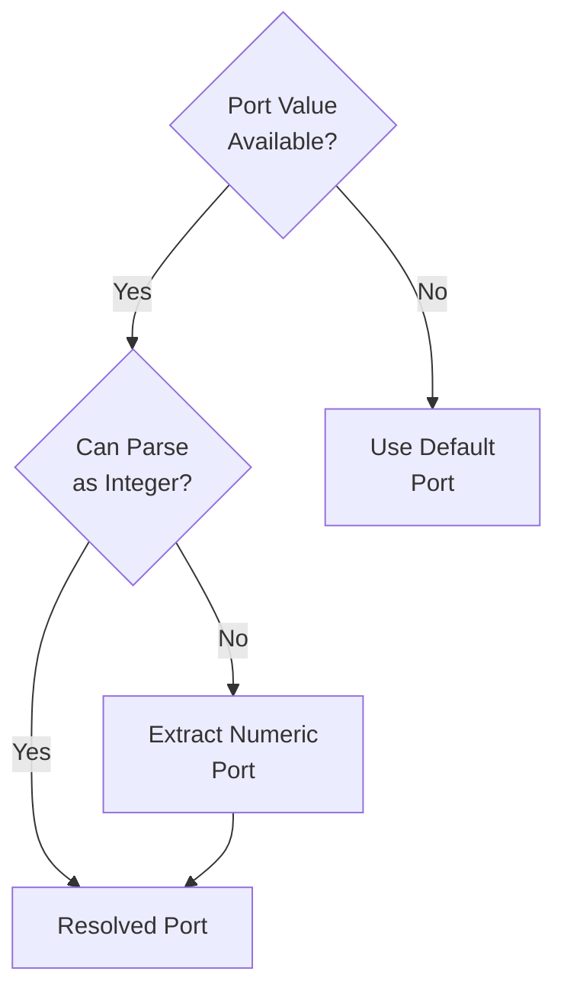
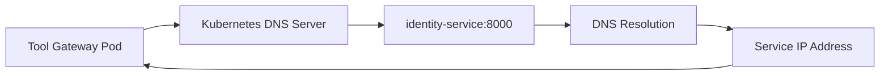
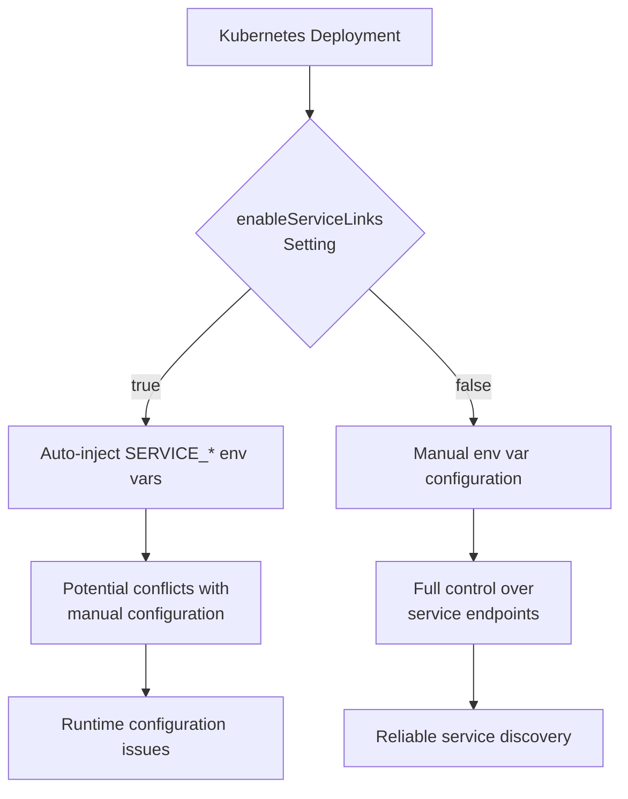
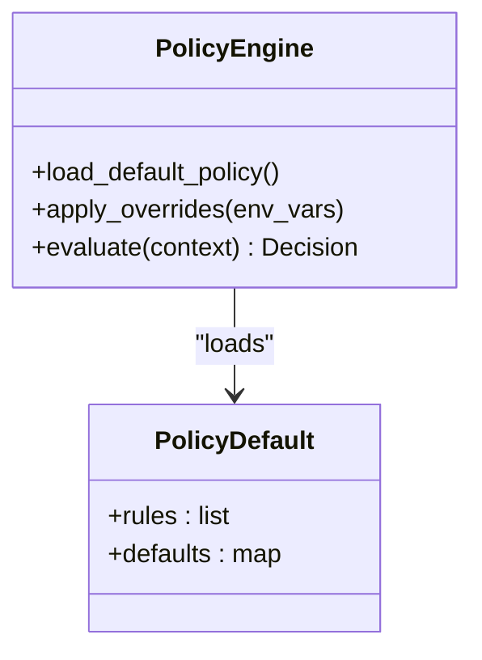
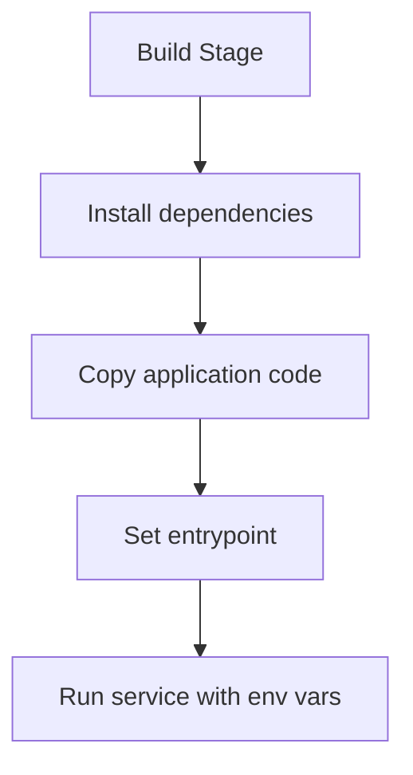
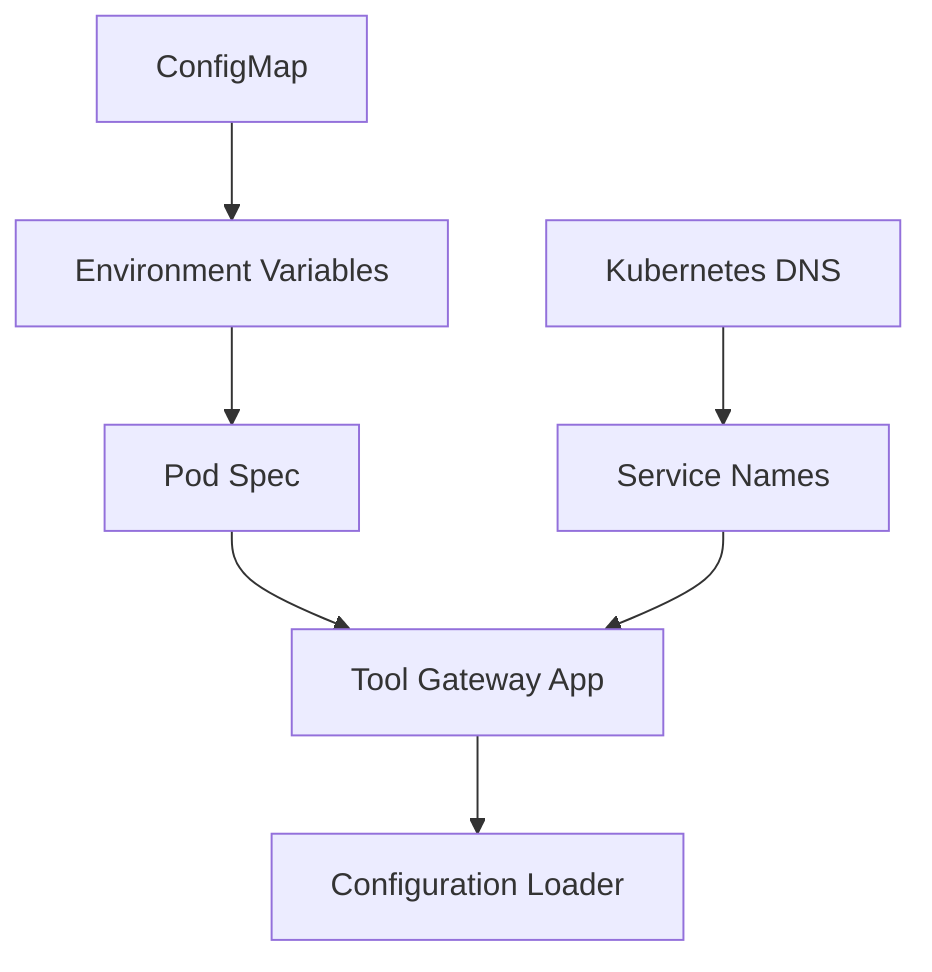
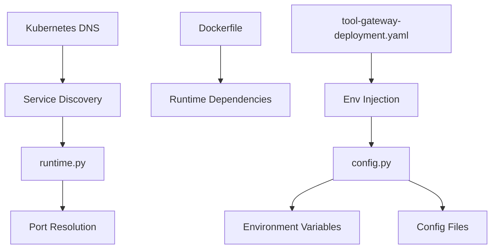

# Configuration and Environment Setup

<cite>
**Referenced Files in This Document**
- [config.py](file://products/tool-gateway/src/tool_gateway/core/config.py)
- [runtime.py](file://products/tool-gateway/src/tool_gateway/core/runtime.py)
- [runtime-config.env](file://shared/platform-ops/gitops/dev-k8s/base/tool-gateway/runtime-config.env)
- [tool-gateway-deployment.yaml](file://shared/platform-ops/gitops/dev-k8s/base/tool-gateway/tool-gateway-deployment.yaml)
- [runtime.env](file://shared/platform-ops/gitops/dev-k8s/base/shared/runtime.env)
- [policy-default.yaml](file://products/tool-gateway/src/tool_gateway/policies/policy-default.yaml)
- [Dockerfile](file://products/tool-gateway/Dockerfile)
- [pyproject.toml](file://products/tool-gateway/pyproject.toml)
</cite>

## Update Summary
**Changes Made**
- Updated environment variable handling documentation to explain the shift from Kubernetes service-link injection to DNS-based service discovery
- Added comprehensive documentation for service links disabling and its implications
- Enhanced development setup documentation to clarify inter-service communication patterns
- Updated deployment configuration examples to reflect the new service discovery approach
- Added troubleshooting guidance for DNS-based service resolution issues

## Table of Contents
1. [Introduction](#introduction)
2. [Project Structure](#project-structure)
3. [Core Components](#core-components)
4. [Architecture Overview](#architecture-overview)
5. [Detailed Component Analysis](#detailed-component-analysis)
6. [Dependency Analysis](#dependency-analysis)
7. [Performance Considerations](#performance-considerations)
8. [Troubleshooting Guide](#troubleshooting-guide)
9. [Conclusion](#conclusion)
10. [Appendices](#appendices)

## Introduction
This document explains how the Tool Gateway Service manages configuration and environment setup across layers: environment variables, configuration files, and runtime overrides. It details available options, defaults, validation rules, and deployment-specific settings for development, staging, and production. It also provides examples for Docker and Kubernetes (ConfigMaps/Secrets), and outlines security best practices for secrets management and consistent configuration across environments.

**Updated** Enhanced documentation reflects the architectural shift from Kubernetes service-link injection to DNS-based service discovery, providing clearer guidance on inter-service communication patterns and environment variable handling.

## Project Structure
The Tool Gateway Service is implemented under products/tool-gateway with its core configuration logic in the core module. Deployment manifests and environment templates are maintained under shared/platform-ops/gitops/dev-k8s/base/tool-gateway. The service image is built using a Dockerfile, and dependencies are declared in pyproject.toml.



**Diagram sources**
- [config.py](file://products/tool-gateway/src/tool_gateway/core/config.py)
- [runtime.py](file://products/tool-gateway/src/tool_gateway/core/runtime.py)
- [policy-default.yaml](file://products/tool-gateway/src/tool_gateway/policies/policy-default.yaml)
- [Dockerfile](file://products/tool-gateway/Dockerfile)
- [pyproject.toml](file://products/tool-gateway/pyproject.toml)
- [runtime-config.env](file://shared/platform-ops/gitops/dev-k8s/base/tool-gateway/runtime-config.env)
- [tool-gateway-deployment.yaml](file://shared/platform-ops/gitops/dev-k8s/base/tool-gateway/tool-gateway-deployment.yaml)
- [runtime.env](file://shared/platform-ops/gitops/dev-k8s/base/shared/runtime.env)

**Section sources**
- [config.py](file://products/tool-gateway/src/tool_gateway/core/config.py)
- [runtime.py](file://products/tool-gateway/src/tool_gateway/core/runtime.py)
- [runtime-config.env](file://shared/platform-ops/gitops/dev-k8s/base/tool-gateway/runtime-config.env)
- [tool-gateway-deployment.yaml](file://shared/platform-ops/gitops/dev-k8s/base/tool-gateway/tool-gateway-deployment.yaml)
- [runtime.env](file://shared/platform-ops/gitops/dev-k8s/base/shared/runtime.env)
- [policy-default.yaml](file://products/tool-gateway/src/tool_gateway/policies/policy-default.yaml)
- [Dockerfile](file://products/tool-gateway/Dockerfile)
- [pyproject.toml](file://products/tool-gateway/pyproject.toml)

## Core Components
- Configuration loader and model: centralizes environment variable parsing, file-based configuration, and runtime overrides; exposes validated configuration to the application.
- Runtime settings: handles service binding configuration with robust port resolution that ignores Kubernetes service-link formats.
- Policy engine configuration: loads default policy definitions from YAML and supports environment-driven overrides.
- Containerization and dependency management: Dockerfile defines runtime environment; pyproject.toml declares Python dependencies used by the gateway.

Key responsibilities:
- Provide a single source of truth for configuration via typed models.
- Enforce validation rules and provide clear error messages on misconfiguration.
- Support layered precedence: defaults < config files < environment variables < runtime overrides.
- Handle DNS-based service discovery with proper fallback mechanisms.
- Ignore Kubernetes service-link environment variables to prevent conflicts.

**Updated** Enhanced core components to support DNS-based service discovery and improved environment variable handling.

**Section sources**
- [config.py](file://products/tool-gateway/src/tool_gateway/core/config.py)
- [runtime.py](file://products/tool-gateway/src/tool_gateway/core/runtime.py)
- [policy-default.yaml](file://products/tool-gateway/src/tool_gateway/policies/policy-default.yaml)
- [Dockerfile](file://products/tool-gateway/Dockerfile)
- [pyproject.toml](file://products/tool-gateway/pyproject.toml)

## Architecture Overview
The configuration system follows a layered approach with enhanced service discovery:
- Defaults: defined in code or default YAML policies.
- Config files: loaded from container filesystem or mounted volumes.
- Environment variables: injected at runtime via platform orchestration (e.g., Kubernetes).
- Runtime overrides: applied programmatically during startup or request processing.
- DNS-based service discovery: services communicate via Kubernetes DNS names instead of injected environment variables.



**Diagram sources**
- [config.py](file://products/tool-gateway/src/tool_gateway/core/config.py)
- [runtime.py](file://products/tool-gateway/src/tool_gateway/core/runtime.py)
- [runtime.env](file://shared/platform-ops/gitops/dev-k8s/base/shared/runtime.env)

## Detailed Component Analysis

### Configuration Loader and Model
- Purpose: Parse and validate configuration from multiple layers and expose it consistently.
- Precedence: Defaults < Config files < Environment variables < Runtime overrides.
- Validation: Type checks, required fields, range constraints, and cross-field validations.
- Error handling: Aggregates validation errors and surfaces actionable messages.
- Service discovery: Uses DNS-based resolution for inter-service communication.

**Updated** Enhanced to support DNS-based service discovery and improved environment variable handling.


**Diagram sources**
- [config.py](file://products/tool-gateway/src/tool_gateway/core/config.py)

**Section sources**
- [config.py](file://products/tool-gateway/src/tool_gateway/core/config.py)

### Runtime Settings and Port Resolution
- Purpose: Handle service binding configuration with robust port resolution.
- Port resolution: Ignores Kubernetes service-link format (`tcp://IP:PORT`) and extracts numeric ports.
- Default behavior: Falls back to default host and port when environment variables are not set.
- Development safety: Prevents conflicts between manual configuration and automatic service-link injection.

**New Section** Enhanced runtime settings with intelligent port resolution that handles Kubernetes service-link formats gracefully.



**Diagram sources**
- [runtime.py](file://products/tool-gateway/src/tool_gateway/core/runtime.py)

**Section sources**
- [runtime.py](file://products/tool-gateway/src/tool_gateway/core/runtime.py)

### DNS-Based Service Discovery
- Purpose: Enable reliable inter-service communication using Kubernetes DNS names.
- Configuration: Service endpoints configured via environment variables pointing to DNS names.
- Benefits: Eliminates service-link conflicts, improves reliability, and simplifies configuration.
- Implementation: Services resolve DNS names like `identity-service` to their cluster IPs.

**New Section** Comprehensive DNS-based service discovery replacing Kubernetes service-link injection.



**Diagram sources**
- [runtime.env](file://shared/platform-ops/gitops/dev-k8s/base/shared/runtime.env)
- [tool-gateway-deployment.yaml](file://shared/platform-ops/gitops/dev-k8s/base/tool-gateway/tool-gateway-deployment.yaml)

**Section sources**
- [runtime.env](file://shared/platform-ops/gitops/dev-k8s/base/shared/runtime.env)
- [tool-gateway-deployment.yaml](file://shared/platform-ops/gitops/dev-k8s/base/tool-gateway/tool-gateway-deployment.yaml)

### Service Links Disabling Strategy
- Purpose: Prevent Kubernetes from automatically injecting service-link environment variables.
- Configuration: `enableServiceLinks: false` in all deployment manifests.
- Rationale: Avoids conflicts between manual configuration and automatic service-link injection.
- Impact: Requires explicit configuration of service endpoints via environment variables.

**New Section** Strategic disabling of Kubernetes service links to maintain configuration control.



**Diagram sources**
- [tool-gateway-deployment.yaml](file://shared/platform-ops/gitops/dev-k8s/base/tool-gateway/tool-gateway-deployment.yaml)

**Section sources**
- [tool-gateway-deployment.yaml](file://shared/platform-ops/gitops/dev-k8s/base/tool-gateway/tool-gateway-deployment.yaml)

### Policy Engine Configuration
- Default policy: Loaded from a YAML file defining baseline rules and behaviors.
- Overrides: Can be adjusted via environment variables or mounted config files depending on implementation.
- Usage: Provides decision context for tool invocation, access control, and rate limiting.



**Diagram sources**
- [policy-default.yaml](file://products/tool-gateway/src/tool_gateway/policies/policy-default.yaml)

**Section sources**
- [policy-default.yaml](file://products/tool-gateway/src/tool_gateway/policies/policy-default.yaml)

### Docker Configuration
- Image build: Defines base image, working directory, and dependency installation.
- Entrypoint: Runs the Tool Gateway Service with environment variables passed through.
- Best practices: Use multi-stage builds, pin versions, minimize attack surface.



**Diagram sources**
- [Dockerfile](file://products/tool-gateway/Dockerfile)

**Section sources**
- [Dockerfile](file://products/tool-gateway/Dockerfile)

### Kubernetes Deployment and ConfigMaps
- Deployment manifest: Mounts environment variables and config files into the pod.
- ConfigMap: Holds non-sensitive configuration values including service endpoints.
- Service discovery: Uses DNS names for inter-service communication.
- Environment injection: Maps ConfigMap entries to environment variables consumed by the configuration loader.

**Updated** Enhanced deployment configuration with DNS-based service discovery and disabled service links.



**Diagram sources**
- [tool-gateway-deployment.yaml](file://shared/platform-ops/gitops/dev-k8s/base/tool-gateway/tool-gateway-deployment.yaml)
- [runtime-config.env](file://shared/platform-ops/gitops/dev-k8s/base/tool-gateway/runtime-config.env)
- [runtime.env](file://shared/platform-ops/gitops/dev-k8s/base/shared/runtime.env)

**Section sources**
- [tool-gateway-deployment.yaml](file://shared/platform-ops/gitops/dev-k8s/base/tool-gateway/tool-gateway-deployment.yaml)
- [runtime-config.env](file://shared/platform-ops/gitops/dev-k8s/base/tool-gateway/runtime-config.env)
- [runtime.env](file://shared/platform-ops/gitops/dev-k8s/base/shared/runtime.env)

### Dependency Management
- Python dependencies: Declared in pyproject.toml for reproducible builds.
- Lock file: Ensures deterministic dependency resolution.
- Best practices: Pin versions, separate dev and prod dependencies, audit regularly.

**Section sources**
- [pyproject.toml](file://products/tool-gateway/pyproject.toml)

## Dependency Analysis
Configuration components depend on environment variables and files, while the runtime settings handle DNS-based service discovery. The Docker image encapsulates runtime dependencies, and Kubernetes manifests inject configuration at deployment time.

**Updated** Added dependencies for DNS-based service discovery and enhanced environment variable handling.



**Diagram sources**
- [config.py](file://products/tool-gateway/src/tool_gateway/core/config.py)
- [runtime.py](file://products/tool-gateway/src/tool_gateway/core/runtime.py)
- [Dockerfile](file://products/tool-gateway/Dockerfile)
- [tool-gateway-deployment.yaml](file://shared/platform-ops/gitops/dev-k8s/base/tool-gateway/tool-gateway-deployment.yaml)

**Section sources**
- [config.py](file://products/tool-gateway/src/tool_gateway/core/config.py)
- [runtime.py](file://products/tool-gateway/src/tool_gateway/core/runtime.py)
- [Dockerfile](file://products/tool-gateway/Dockerfile)
- [tool-gateway-deployment.yaml](file://shared/platform-ops/gitops/dev-k8s/base/tool-gateway/tool-gateway-deployment.yaml)

## Performance Considerations
- Minimize configuration lookups by caching validated configuration at startup.
- Avoid heavy I/O during request processing; pre-load policies and dependencies.
- Use efficient serialization formats for configuration files where applicable.
- Monitor configuration-related metrics and errors to detect misconfigurations early.
- Leverage Kubernetes DNS caching for improved service discovery performance.
- Optimize port resolution to avoid unnecessary string parsing operations.

[No sources needed since this section provides general guidance]

## Troubleshooting Guide
Common issues and resolutions:
- Missing environment variables: Ensure all required variables are set in the deployment manifest or environment.
- Invalid configuration values: Check types, ranges, and cross-field constraints; review validation error messages.
- Policy loading failures: Verify YAML syntax and structure; ensure paths are correct and accessible.
- Secrets not mounted: Confirm Secret objects exist and are referenced correctly in the deployment.
- **New**: DNS resolution failures: Verify service names match Kubernetes Service resources and check network policies.
- **New**: Service link conflicts: Ensure `enableServiceLinks: false` is set in all deployment manifests.
- **New**: Port resolution issues: Check that port values are numeric and not in Kubernetes service-link format.
- **New**: Inter-service communication failures: Verify DNS names are resolvable and services are running.

**Updated** Added troubleshooting guidance for DNS-based service discovery and service link issues.

**Section sources**
- [config.py](file://products/tool-gateway/src/tool_gateway/core/config.py)
- [runtime.py](file://products/tool-gateway/src/tool_gateway/core/runtime.py)
- [tool-gateway-deployment.yaml](file://shared/platform-ops/gitops/dev-k8s/base/tool-gateway/tool-gateway-deployment.yaml)

## Conclusion
The Tool Gateway Service employs a robust, layered configuration system that integrates environment variables, configuration files, and runtime overrides with strict validation. By following the outlined best practices for Docker and Kubernetes deployments, teams can maintain secure, consistent configurations across environments while ensuring reliability and performance. The architectural shift to DNS-based service discovery eliminates service-link conflicts and provides more reliable inter-service communication patterns.

**Updated** Enhanced conclusion reflecting the architectural improvements in service discovery and environment variable handling.

## Appendices

### Environment-Specific Settings
- Development: Enable verbose logging, relaxed validation, local secrets, optional redaction disablement.
- Staging: Mirror production settings with test data and limited scope, enable full redaction.
- Production: Strict validation, minimal logging, centralized secret management, mandatory workload identity.

**Updated** Added guidance for DNS-based service discovery configuration across environments.

[No sources needed since this section provides general guidance]

### Security and Secrets Management
- Store secrets in Kubernetes Secrets or external vaults; never hardcode.
- Rotate secrets regularly and audit access logs.
- Use least privilege principles for service accounts and RBAC.
- Prefer workload identity over static credentials in production environments.
- Configure appropriate redaction sensitivity levels based on data classification.
- Monitor redaction metrics and workload identity authentication attempts.
- **New**: Use DNS-based service discovery to avoid exposing service endpoints in environment variables.
- **New**: Disable service links to prevent accidental exposure of internal service information.

**Updated** Enhanced security guidance with DNS-based service discovery best practices.

[No sources needed since this section provides general guidance]

### Complete Environment Variables Reference
**Updated** Comprehensive reference including DNS-based service discovery variables.

#### Core Configuration
- `AGENT_SERVICE_URL`: Agent service endpoint URL (DNS-based)
- `IDENTITY_SERVICE_URL`: Identity broker service endpoint URL (DNS-based)
- `IDENTITY_JWKS_URL`: Identity service JWKS endpoint
- `IDENTITY_JWKS_CACHE_SECONDS`: JWKS cache duration (default: 300)
- `IDENTITY_TOKEN_ISSUER`: JWT issuer claim (default: "luban-identity-broker")
- `GATEWAY_TOKEN_AUDIENCE`: Token audience (default: "tool-gateway")
- `GATEWAY_DELEGATION_AUDIENCE`: Delegation audience (default: "tool-gateway")

#### Runtime Configuration
- `GATEWAY_HOST`: Service bind host (default: 0.0.0.0)
- `GATEWAY_PORT`: Service bind port (numeric only, service-link format ignored)

#### Operational Configuration
- `GATEWAY_REQUIRE_AUTH`: Require authentication (default: true)
- `GATEWAY_K8S_ENABLED`: Enable Kubernetes integration (default: false)
- `GATEWAY_K8S_NAMESPACE`: Kubernetes namespace
- `GATEWAY_POLICY_PATH`: Policy file path
- `CHAT_RESPONSE_TIMEOUT_SECONDS`: Chat response timeout (default: 30)

#### Service Discovery Configuration
- `IDENTITY_SERVICE_URL`: Identity service URL using DNS names (e.g., http://identity-service:8000)
- `AGENT_SERVICE_URL`: Agent service URL using DNS names (e.g., http://agent-service:8000)

**Section sources**
- [config.py](file://products/tool-gateway/src/tool_gateway/core/config.py)
- [runtime.py](file://products/tool-gateway/src/tool_gateway/core/runtime.py)
- [runtime-config.env](file://shared/platform-ops/gitops/dev-k8s/base/tool-gateway/runtime-config.env)
- [runtime.env](file://shared/platform-ops/gitops/dev-k8s/base/shared/runtime.env)

### DNS-Based Service Discovery Setup Guide
**New Section** Step-by-step guide for configuring DNS-based service discovery.

#### Prerequisites
- Kubernetes cluster with DNS service enabled (default in most distributions)
- Service resources created for all dependent services
- Network policies allowing inter-service communication

#### Configuration Steps
1. Create Service resources for each dependent service
2. Set service endpoint URLs using DNS names in environment variables
3. Disable service links in deployment manifests (`enableServiceLinks: false`)
4. Configure shared runtime configuration in ConfigMaps
5. Verify DNS resolution works within the cluster

#### Example Configuration
```yaml
apiVersion: v1
kind: Service
metadata:
  name: identity-service
spec:
  selector:
    app: identity-service
  ports:
    - name: http
      port: 8000
      targetPort: 8000
---
apiVersion: v1
kind: ConfigMap
metadata:
  name: platform-runtime-config
data:
  IDENTITY_SERVICE_URL: "http://identity-service:8000"
  AGENT_SERVICE_URL: "http://agent-service:8000"
```

**Section sources**
- [runtime.env](file://shared/platform-ops/gitops/dev-k8s/base/shared/runtime.env)
- [tool-gateway-deployment.yaml](file://shared/platform-ops/gitops/dev-k8s/base/tool-gateway/tool-gateway-deployment.yaml)

### Service Links Migration Guide
**New Section** Migration strategy from Kubernetes service-link injection to DNS-based discovery.

#### Migration Steps
1. Identify all auto-generated service-link environment variables
2. Replace with explicit DNS-based configuration in ConfigMaps
3. Add `enableServiceLinks: false` to all deployment manifests
4. Test DNS resolution and service connectivity
5. Remove any legacy service-link references

#### Common Migration Patterns
- `SERVICE_NAME_PORT` → `SERVICE_NAME_URL=http://service-name:port`
- `SERVICE_NAME_HOST` → Part of URL configuration
- `SERVICE_NAME_PROTO` → Not needed with DNS-based approach

**Section sources**
- [tool-gateway-deployment.yaml](file://shared/platform-ops/gitops/dev-k8s/base/tool-gateway/tool-gateway-deployment.yaml)
- [runtime.env](file://shared/platform-ops/gitops/dev-k8s/base/shared/runtime.env)