# Configuration and Environment Setup

<cite>
**Referenced Files in This Document**
- [config.py](file://products/platform-gateway/src/platform_gateway/core/config.py)
- [runtime.py](file://products/platform-gateway/src/platform_gateway/core/runtime.py)
- [telemetry.py](file://products/platform-gateway/src/platform_gateway/core/telemetry.py)
- [tools.py](file://products/platform-gateway/src/platform_gateway/api/routes/tools.py)
- [skills.py](file://products/platform-gateway/src/platform_gateway/api/routes/skills.py)
- [incident_client.py](file://products/platform-gateway/src/platform_gateway/services/incident_client.py)
- [kernel_middleware.py](file://products/agent-platform/src/agent_service/services/kernel_middleware.py)
- [runtime_settings.py](file://products/agent-platform/src/agent_service/runtime_settings.py)
- [execution_signing.py](file://products/agent-platform/src/agent_service/services/execution_signing.py)
- [audit_emitter.py](file://products/agent-platform/src/agent_service/services/audit_emitter.py)
- [execution_records.py](file://products/agent-platform/src/agent_service/services/execution_records.py)
- [gateway_tools.py](file://products/agent-platform/src/agent_service/tools/gateway_tools.py)
- [model_discovery.py](file://products/agent-platform/src/agent_service/services/model_discovery.py)
- [config.py](file://products/tool-gateway/src/tool_gateway/core/config.py)
- [registry.py](file://products/tool-gateway/src/tool_gateway/tools/registry.py)
- [app.py](file://products/tool-gateway/src/tool_gateway/app.py)
- [sync-execution-signing-secret.sh](file://shared/platform-ops/gitops/sync-execution-signing-secret.sh)
- [sync-otel-secrets.sh](file://shared/platform-ops/gitops/sync-otel-secrets.sh)
- [sync-delegation-secrets.sh](file://shared/platform-ops/gitops/sync-delegation-secrets.sh)
- [sync-audit-secrets.sh](file://shared/platform-ops/gitops/sync-audit-secrets.sh)
- [sync-skills-secrets.sh](file://shared/platform-ops/gitops/sync-skills-secrets.sh)
- [sync-incident-secrets.sh](file://shared/platform-ops/gitops/sync-incident-secrets.sh)
- [platform-gateway-deployment.yaml](file://shared/platform-ops/gitops/dev-k8s/base/platform-gateway/platform-gateway-deployment.yaml)
- [agent-service-deployment.yaml](file://shared/platform-ops/gitops/dev-k8s/base/agent-platform/agent-service-deployment.yaml)
- [runtime-config.env](file://shared/platform-ops/gitops/dev-k8s/base/platform-gateway/runtime-config.env)
- [runtime-config.env](file://shared/platform-ops/gitops/dev-k8s/base/agent-platform/runtime-config.env)
- [runtime-config.env](file://shared/platform-ops/gitops/dev-k8s/base/tool-gateway/runtime-config.env)
- [rbac.yaml](file://shared/platform-ops/gitops/dev-k8s/base/tool-gateway/rbac.yaml)
- [kustomization.yaml](file://shared/platform-ops/gitops/dev-k8s/kustomization.yaml)
- [kustomization.yaml](file://shared/platform-ops/gitops/runtime-profiles/mutating-dev/kustomization.yaml)
- [mutating.env](file://shared/platform-ops/gitops/runtime-profiles/mutating-dev/mutating.env)
- [tool-gateway-pod-delete.yaml](file://shared/platform-ops/gitops/runtime-profiles/mutating-dev/tool-gateway-pod-delete.yaml)
- [README.md](file://shared/platform-ops/gitops/runtime-profiles/README.md)
- [spec.md](file://docs/specs/SPEC-019-portal-transparency-navigation/spec.md)
- [spec.md](file://docs/specs/SPEC-027-live-model-discovery/spec.md)
- [spec.md](file://docs/specs/SPEC-037-signed-execution-requests/spec.md)
- [spec.md](file://docs/specs/SPEC-043-incident-report-document-type/spec.md)
- [approval-and-hitl.md](file://docs/guides/approval-and-hitl.md)
- [tool-configuration.md](file://docs/guides/tool-configuration.md)
- [reconcile-portal-oidc-client.sh](file://shared/platform-ops/gitops/dev-k8s/reconcile-portal-oidc-client.sh)
- [identity_service.py](file://products/identity-broker/src/identity_service/services/identity_service.py)
- [configuration-reference.md](file://docs/guides/configuration-reference.md)
- [troubleshooting.md](file://docs/guides/troubleshooting.md)
</cite>

## Update Summary
**Changes Made**
- Enhanced OIDC configuration documentation to clarify that extra redirect URIs are registered with Keycloak for reachability only, not selected as callbacks
- Updated identity broker configuration section to explain canonical vs fallback behavior for redirect URIs
- Added detailed explanation of how the identity broker always uses OIDC_REDIRECT_URI as the flow's callback regardless of which origin initiates login
- Updated troubleshooting section with clearer guidance on redirect URI mismatch scenarios
- Enhanced configuration reference with additional context about redirect URI behavior

## Table of Contents
1. [Introduction](#introduction)
2. [Project Structure](#project-structure)
3. [Core Components](#core-components)
4. [Architecture Overview](#architecture-overview)
5. [Detailed Component Analysis](#detailed-component-analysis)
6. [Dependency Analysis](#dependency-analysis)
7. [Performance Considerations](#performance-considerations)
8. [Troubleshooting Guide](#troubleshooting-guide)
9. [Conclusion](#conclusion)
10. [Appendices](#appendices)

## Introduction
This document explains how the Platform Gateway Service manages configuration and environment setup across layers: environment variables, configuration files, and runtime overrides. It details available options, defaults, validation rules, and deployment-specific settings for development, staging, and production. It also provides examples for Docker and Kubernetes (ConfigMaps/Secrets), and outlines security best practices for secrets management and consistent configuration across environments.

**Updated** Enhanced documentation now includes comprehensive workspace resource integration capabilities through new platform-gateway configuration settings that enable read-only proxies for tools catalog and skills inventory, durable OpenTelemetry secret provisioning that maintains authentication headers across all deployment operations, risk-tier admission gates for mutating tools via GATEWAY_MUTATING_TOOLS_ENABLED, configurable HITL confirmation timeouts through AGENT_HITL_CONFIRM_TIMEOUT, enhanced agent auto-allow list functionality with read-only enforcement and misconfiguration logging, the new mutating-dev kustomize profile that provides a committed, environment-scoped development posture for enabling mutating tools safely with bounded RBAC permissions while preserving configuration across LLM provider switches, the live model discovery feature controlled by AGENT_MODEL_DISCOVERY_ENABLED, AGENT_MODEL_DISCOVERY_REFRESH_SECONDS, and AGENT_MODEL_DISCOVERY_TIMEOUT_SECONDS that enables automatic model catalog updates from provider endpoints with fail-soft fallback mechanisms, the new execution signing system with AGENT_EXECUTION_SIGNING_KEY that provides tamper-evident execution records through HMAC-SHA256 signing, integrated audit service emissions via AGENT_AUDIT_SERVICE_URL, and durable execution record persistence using AGENT_STATE_STORE_BACKEND and AGENT_STATE_DB_URL settings, plus comprehensive incident service connectivity configuration through AGENT_INCIDENT_* and PLATFORM_GATEWAY_INCIDENT_* environment variables that enable incident report document assembly and triage capabilities with Basic authentication flows, and enhanced OIDC configuration documentation clarifying that extra redirect URIs are registered with Keycloak for reachability only, not selected as callbacks.

## Project Structure
The Platform Gateway Service is implemented under products/platform-gateway with its core configuration logic in the core module. Deployment manifests and environment templates are maintained under shared/platform-ops/gitops/dev-k8s/base/platform-gateway. The service includes workspace resource integration features that proxy requests to tool-gateway and skills-hub services for read-only inventory access, plus enhanced OpenTelemetry configuration with durable secret management. The new mutating-dev profile provides a dedicated development posture for enabling mutating tools with appropriate RBAC controls. The agent platform component now includes live model discovery capabilities that automatically refresh model catalogs from provider endpoints, along with execution signing and audit trail capabilities for tamper-evident execution records.

```mermaid
graph TB
subgraph "Platform Gateway Service"
A["src/platform_gateway/core/config.py"]
B["src/platform_gateway/core/runtime.py"]
C["src/platform_gateway/core/telemetry.py"]
D["src/platform_gateway/api/routes/tools.py"]
E["src/platform_gateway/api/routes/skills.py"]
F["src/platform_gateway/services/tool_gateway_client.py"]
G["src/platform_gateway/services/skills_hub_client.py"]
H["src/platform_gateway/services/incident_client.py"]
end
subgraph "Agent Platform Integration"
I["kernel_middleware.py"]
J["runtime_settings.py"]
K["gateway_tools.py"]
L["AGENT_GATEWAY_TOOL_AUTO_ALLOW"]
M["AGENT_HITL_CONFIRM_TIMEOUT"]
N["Risk Tier Enforcement"]
O["Model Discovery Service"]
P["AGENT_MODEL_DISCOVERY_*"]
Q["Fail-Soft Ladder"]
R["Execution Signing Service"]
S["AGENT_EXECUTION_SIGNING_KEY"]
T["Audit Emitter"]
U["AGENT_AUDIT_SERVICE_URL"]
V["Execution Records Store"]
W["AGENT_STATE_STORE_BACKEND"]
X["AGENT_STATE_DB_URL"]
Y["Incident Report Assembly"]
Z["AGENT_INCIDENT_*"]
AA["Incident Service Proxy"]
BB["PLATFORM_GATEWAY_INCIDENT_*"]
end
subgraph "Tool Gateway Risk Control"
CC["tool-gateway config.py"]
DD["registry.py"]
EE["GATEWAY_MUTATING_TOOLS_ENABLED"]
FF["Risk-Tier Admission Gate"]
GG["Policy Enforcement"]
end
subgraph "Workspace Resource Integration"
HH["tool_gateway_url"]
II["skills_hub_url"]
JJ["skills_client_id"]
KK["skills_client_secret"]
LL["Delegated Token Flow"]
MM["Basic Auth Flow"]
end
subgraph "Enhanced OTel Secret Management"
NN["sync-otel-secrets.sh"]
OO["OTEL_EXPORTER_OTLP_HEADERS"]
PP["Cluster Secret Merge"]
QQ["Local File Preservation"]
RR["Sibling Script Hooks"]
end
subgraph "Mutating Dev Profile"
SS["dev-k8s/kustomization.yaml"]
TT["runtime-profiles/mutating-dev/"]
UU["mutating.env"]
VV["tool-gateway-pod-delete.yaml"]
WW["RBAC Role/RoleBinding"]
XX["ConfigMap Merge"]
end
subgraph "Execution Signing & Audit"
YY["sync-execution-signing-secret.sh"]
ZZ["execution-signing-secret"]
AAA["HMAC-SHA256 Signing"]
BBB["Durable Audit Trail"]
CCC["Fire-and-Forget Emission"]
DDD["Postgres Persistence"]
EEE["Retention Scanning"]
end
subgraph "OIDC Configuration"
FFF["Identity Broker"]
GGG["OIDC_REDIRECT_URI"]
HHH["OIDC_EXTRA_REDIRECT_URIS"]
III["Keycloak Client"]
JJJ["Canonical Callback"]
KKK["Reachability Only"]
end
A --> RR
B --> SS
C --> NN
D --> F
E --> G
F --> HH
G --> II
H --> BB
RR --> SS
TT --> UU
UU --> VV
VV --> WW
WW --> XX
XX --> YY
YY --> ZZ
ZZ --> AAA
AAA --> BBB
BBB --> CCC
CCC --> DDD
DDD --> EEE
I --> LL
J --> MM
K --> NN
O --> PP
O --> QQ
R --> S
T --> U
V --> W
V --> X
Y --> Z
AA --> BB
CC --> EE
DD --> FF
EE --> GG
HH --> II
JJ --> KK
LL --> MM
NN --> OO
OO --> PP
PP --> QQ
QQ --> RR
FFF --> III
GGG --> JJJ
HHH --> KKK
```

**Diagram sources**
- [config.py](file://products/platform-gateway/src/platform_gateway/core/config.py)
- [runtime.py](file://products/platform-gateway/src/platform_gateway/core/runtime.py)
- [telemetry.py](file://products/platform-gateway/src/platform_gateway/core/telemetry.py)
- [tools.py](file://products/platform-gateway/src/platform_gateway/api/routes/tools.py)
- [skills.py](file://products/platform-gateway/src/platform_gateway/api/routes/skills.py)
- [incident_client.py](file://products/platform-gateway/src/platform_gateway/services/incident_client.py)
- [kernel_middleware.py](file://products/agent-platform/src/agent_service/services/kernel_middleware.py)
- [runtime_settings.py](file://products/agent-platform/src/agent_service/runtime_settings.py)
- [execution_signing.py](file://products/agent-platform/src/agent_service/services/execution_signing.py)
- [audit_emitter.py](file://products/agent-platform/src/agent_service/services/audit_emitter.py)
- [execution_records.py](file://products/agent-platform/src/agent_service/services/execution_records.py)
- [gateway_tools.py](file://products/agent-platform/src/agent_service/tools/gateway_tools.py)
- [model_discovery.py](file://products/agent-platform/src/agent_service/services/model_discovery.py)
- [config.py](file://products/tool-gateway/src/tool_gateway/core/config.py)
- [registry.py](file://products/tool-gateway/src/tool_gateway/tools/registry.py)
- [tool_gateway_client.py](file://products/platform-gateway/src/platform_gateway/services/tool_gateway_client.py)
- [skills_hub_client.py](file://products/platform-gateway/src/platform_gateway/services/skills_hub_client.py)
- [sync-execution-signing-secret.sh](file://shared/platform-ops/gitops/sync-execution-signing-secret.sh)
- [sync-otel-secrets.sh](file://shared/platform-ops/gitops/sync-otel-secrets.sh)
- [sync-incident-secrets.sh](file://shared/platform-ops/gitops/sync-incident-secrets.sh)
- [platform-gateway-deployment.yaml](file://shared/platform-ops/gitops/dev-k8s/base/platform-gateway/platform-gateway-deployment.yaml)
- [agent-service-deployment.yaml](file://shared/platform-ops/gitops/dev-k8s/base/agent-platform/agent-service-deployment.yaml)
- [runtime-config.env](file://shared/platform-ops/gitops/dev-k8s/base/platform-gateway/runtime-config.env)
- [runtime-config.env](file://shared/platform-ops/gitops/dev-k8s/base/agent-platform/runtime-config.env)
- [runtime-config.env](file://shared/platform-ops/gitops/dev-k8s/base/tool-gateway/runtime-config.env)
- [kustomization.yaml](file://shared/platform-ops/gitops/dev-k8s/kustomization.yaml)
- [kustomization.yaml](file://shared/platform-ops/gitops/runtime-profiles/mutating-dev/kustomization.yaml)
- [mutating.env](file://shared/platform-ops/gitops/runtime-profiles/mutating-dev/mutating.env)
- [tool-gateway-pod-delete.yaml](file://shared/platform-ops/gitops/runtime-profiles/mutating-dev/tool-gateway-pod-delete.yaml)
- [rbac.yaml](file://shared/platform-ops/gitops/dev-k8s/base/tool-gateway/rbac.yaml)
- [reconcile-portal-oidc-client.sh](file://shared/platform-ops/gitops/dev-k8s/reconcile-portal-oidc-client.sh)
- [identity_service.py](file://products/identity-broker/src/identity_service/services/identity_service.py)

**Section sources**
- [config.py](file://products/platform-gateway/src/platform_gateway/core/config.py)
- [runtime.py](file://products/platform-gateway/src/platform_gateway/core/runtime.py)
- [telemetry.py](file://products/platform-gateway/src/platform_gateway/core/telemetry.py)
- [tools.py](file://products/platform-gateway/src/platform_gateway/api/routes/tools.py)
- [skills.py](file://products/platform-gateway/src/platform_gateway/api/routes/skills.py)
- [incident_client.py](file://products/platform-gateway/src/platform_gateway/services/incident_client.py)
- [kernel_middleware.py](file://products/agent-platform/src/agent_service/services/kernel_middleware.py)
- [runtime_settings.py](file://products/agent-platform/src/agent_service/runtime_settings.py)
- [execution_signing.py](file://products/agent-platform/src/agent_service/services/execution_signing.py)
- [audit_emitter.py](file://products/agent-platform/src/agent_service/services/audit_emitter.py)
- [execution_records.py](file://products/agent-platform/src/agent_service/services/execution_records.py)
- [gateway_tools.py](file://products/agent-platform/src/agent_service/tools/gateway_tools.py)
- [model_discovery.py](file://products/agent-platform/src/agent_service/services/model_discovery.py)
- [config.py](file://products/tool-gateway/src/tool_gateway/core/config.py)
- [registry.py](file://products/tool-gateway/src/tool_gateway/tools/registry.py)
- [tool_gateway_client.py](file://products/platform-gateway/src/platform_gateway/services/tool_gateway_client.py)
- [skills_hub_client.py](file://products/platform-gateway/src/platform_gateway/services/skills_hub_client.py)
- [sync-execution-signing-secret.sh](file://shared/platform-ops/gitops/sync-execution-signing-secret.sh)
- [sync-otel-secrets.sh](file://shared/platform-ops/gitops/sync-otel-secrets.sh)
- [sync-incident-secrets.sh](file://shared/platform-ops/gitops/sync-incident-secrets.sh)
- [platform-gateway-deployment.yaml](file://shared/platform-ops/gitops/dev-k8s/base/platform-gateway/platform-gateway-deployment.yaml)
- [agent-service-deployment.yaml](file://shared/platform-ops/gitops/dev-k8s/base/agent-platform/agent-service-deployment.yaml)
- [runtime-config.env](file://shared/platform-ops/gitops/dev-k8s/base/platform-gateway/runtime-config.env)
- [runtime-config.env](file://shared/platform-ops/gitops/dev-k8s/base/agent-platform/runtime-config.env)
- [runtime-config.env](file://shared/platform-ops/gitops/dev-k8s/base/tool-gateway/runtime-config.env)
- [kustomization.yaml](file://shared/platform-ops/gitops/dev-k8s/kustomization.yaml)
- [kustomization.yaml](file://shared/platform-ops/gitops/runtime-profiles/mutating-dev/kustomization.yaml)
- [mutating.env](file://shared/platform-ops/gitops/runtime-profiles/mutating-dev/mutating.env)
- [tool-gateway-pod-delete.yaml](file://shared/platform-ops/gitops/runtime-profiles/mutating-dev/tool-gateway-pod-delete.yaml)
- [rbac.yaml](file://shared/platform-ops/gitops/dev-k8s/base/tool-gateway/rbac.yaml)

## Core Components
- Configuration loader and model: centralizes environment variable parsing, file-based configuration, and runtime overrides; exposes validated configuration to the application.
- Runtime settings: handles service binding configuration with robust port resolution that ignores Kubernetes service-link formats.
- Enhanced telemetry system: opt-in OpenTelemetry push pipeline with fail-open behavior and durable secret provisioning.
- Workspace resource proxies: read-only proxy endpoints for tools catalog and skills inventory with appropriate authentication mechanisms.
- Policy engine configuration: loads default policy definitions from YAML and supports environment-driven overrides.
- Containerization and dependency management: Dockerfile defines runtime environment; pyproject.toml declares Python dependencies used by the gateway.
- **New**: Risk-tier admission gate for mutating tools controlled by GATEWAY_MUTATING_TOOLS_ENABLED with policy enforcement.
- **New**: Configurable HITL confirmation timeout via AGENT_HITL_CONFIRM_TIMEOUT for operator confirmation bridging.
- **New**: Enhanced agent auto-allow list with read-only enforcement and misconfiguration logging.
- **New**: Mutating-dev kustomize profile providing committed development posture for enabling mutating tools with appropriate RBAC controls.
- **New**: Live model discovery service controlled by AGENT_MODEL_DISCOVERY_* environment variables with fail-soft fallback mechanisms.
- **New**: Execution signing service with HMAC-SHA256 signing for tamper-evident execution requests and receipts.
- **New**: Audit service integration with fire-and-forget emission pattern for durable audit trails.
- **New**: Execution record persistence with Postgres backend and retention scanning for compliance requirements.
- **New**: Incident service connectivity with Basic authentication for incident report document assembly and triage capabilities.
- **New**: Enhanced OIDC configuration with clear distinction between canonical callback URIs and reachability-only extra URIs.

Key responsibilities:
- Provide a single source of truth for configuration via typed models.
- Enforce validation rules and provide clear error messages on misconfiguration.
- Support layered precedence: defaults < config files < environment variables < runtime overrides.
- Handle DNS-based service discovery with proper fallback mechanisms.
- Ignore Kubernetes service-link environment variables to prevent conflicts.
- Manage workspace resource integration with secure authentication and authorization.
- **New**: Implement risk-tier admission gates to control access to mutating tools based on policy and RBAC.
- **New**: Configure HITL confirmation timeouts to balance operational efficiency with safety requirements.
- **New**: Maintain durable OpenTelemetry authentication headers across all deployment operations through cluster-side secret merging and local file preservation.
- **New**: Provide committed development posture through mutating-dev profile that safely enables mutating tools with bounded RBAC permissions.
- **New**: Enable live model discovery with configurable refresh cadence and timeout controls, implementing a fail-soft ladder that falls back through live → memory → Postgres → curated series.
- **New**: Implement execution signing with HMAC-SHA256 to provide tamper-evident execution records that bind approved actions to their actual execution.
- **New**: Integrate audit service emissions with fire-and-forget pattern that never degrades the chat stream while maintaining durable audit trails.
- **New**: Persist execution records with Postgres backend and retention scanning to ensure compliance requirements are met without impacting performance.
- **New**: Establish incident service connectivity with Basic authentication for incident report document assembly and triage operations, supporting both agent-platform and platform-gateway incident service clients.
- **New**: Clarify OIDC redirect URI behavior where extra URIs serve reachability purposes only while canonical URIs handle actual authentication flows.

**Updated** Enhanced core components to include comprehensive workspace resource integration capabilities with read-only proxies for tools catalog and skills inventory, supporting both delegated token flow for tools and Basic authentication for skills, risk-tier admission gates for mutating tools, configurable HITL confirmation timeouts, enhanced agent auto-allow list functionality with read-only enforcement, plus durable OpenTelemetry secret provisioning that persists authentication headers across deployment operations, the new mutating-dev kustomize profile that provides a safe, committed development posture for enabling mutating tools with appropriate RBAC controls, the live model discovery service that automatically refreshes model catalogs from provider endpoints with robust fallback mechanisms, the execution signing system that provides tamper-evident execution records through HMAC-SHA256 signing, integrated audit service emissions, and durable execution record persistence with retention scanning, plus comprehensive incident service connectivity configuration that enables incident report document assembly and triage capabilities through Basic authentication flows, and enhanced OIDC configuration that clearly distinguishes between canonical callback URIs and reachability-only extra URIs.

**Section sources**
- [config.py](file://products/platform-gateway/src/platform_gateway/core/config.py)
- [runtime.py](file://products/platform-gateway/src/platform_gateway/core/runtime.py)
- [telemetry.py](file://products/platform-gateway/src/platform_gateway/core/telemetry.py)
- [tools.py](file://products/platform-gateway/src/platform_gateway/api/routes/tools.py)
- [skills.py](file://products/platform-gateway/src/platform_gateway/api/routes/skills.py)
- [incident_client.py](file://products/platform-gateway/src/platform_gateway/services/incident_client.py)
- [kernel_middleware.py](file://products/agent-platform/src/agent_service/services/kernel_middleware.py)
- [runtime_settings.py](file://products/agent-platform/src/agent_service/runtime_settings.py)
- [execution_signing.py](file://products/agent-platform/src/agent_service/services/execution_signing.py)
- [audit_emitter.py](file://products/agent-platform/src/agent_service/services/audit_emitter.py)
- [execution_records.py](file://products/agent-platform/src/agent_service/services/execution_records.py)
- [gateway_tools.py](file://products/agent-platform/src/agent_service/tools/gateway_tools.py)
- [model_discovery.py](file://products/agent-platform/src/agent_service/services/model_discovery.py)
- [config.py](file://products/tool-gateway/src/tool_gateway/core/config.py)
- [registry.py](file://products/tool-gateway/src/tool_gateway/tools/registry.py)
- [tool_gateway_client.py](file://products/platform-gateway/src/platform_gateway/services/tool_gateway_client.py)
- [skills_hub_client.py](file://products/platform-gateway/src/platform_gateway/services/skills_hub_client.py)

## Architecture Overview
The configuration system follows a layered approach with enhanced workspace resource integration, risk-tier admission gates, durable secret management, live model discovery, execution signing, incident service connectivity, and clarified OIDC redirect URI behavior:
- Defaults: defined in code or default YAML policies.
- Config files: loaded from container filesystem or mounted volumes.
- Environment variables: injected at runtime via platform orchestration (e.g., Kubernetes).
- Runtime overrides: applied programmatically during startup or request processing.
- DNS-based service discovery: services communicate via Kubernetes DNS names instead of injected environment variables.
- Workspace resource proxies: read-only access to tools catalog and skills inventory with appropriate authentication.
- **New**: Risk-tier admission gates: control access to mutating tools through policy enforcement and RBAC checks.
- **New**: Configurable HITL confirmation timeouts: balance operational efficiency with safety requirements.
- **New**: Enhanced agent auto-allow list: read-only enforcement with misconfiguration logging.
- **New**: Durable OTel secret provisioning: cluster-side merging ensures authentication headers persist across all deployment operations.
- **New**: Mutating-dev profile: committed development posture that safely enables mutating tools with bounded RBAC permissions.
- **New**: Live model discovery: automatic catalog updates from provider endpoints with fail-soft fallback ladder.
- **New**: Execution signing: HMAC-SHA256 signing for tamper-evident execution requests and receipts.
- **New**: Audit service integration: fire-and-forget emission pattern for durable audit trails.
- **New**: Execution record persistence: Postgres-backed storage with retention scanning for compliance.
- **New**: Incident service connectivity: Basic authentication for incident report document assembly and triage operations.
- **New**: Enhanced OIDC configuration: canonical callback URIs vs reachability-only extra URIs with clear behavioral distinctions.

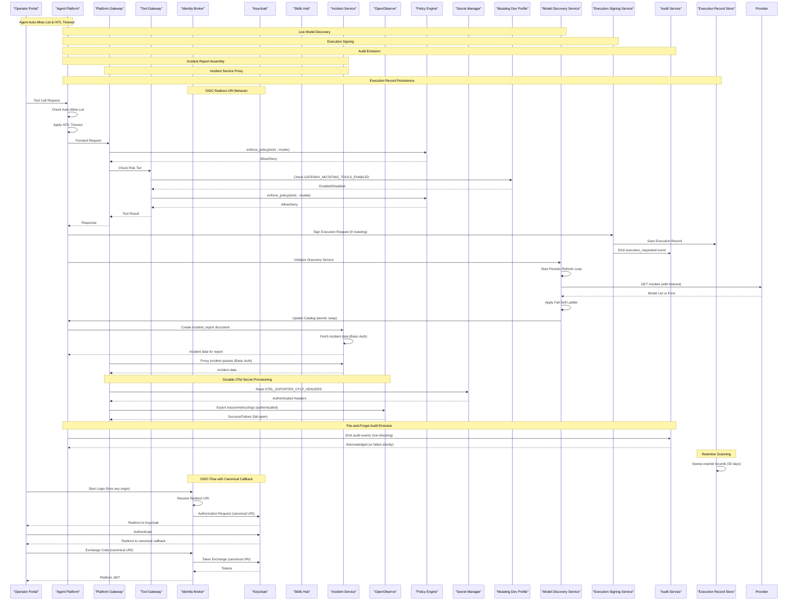

**Diagram sources**
- [tools.py](file://products/platform-gateway/src/platform_gateway/api/routes/tools.py)
- [skills.py](file://products/platform-gateway/src/platform_gateway/api/routes/skills.py)
- [incident_client.py](file://products/platform-gateway/src/platform_gateway/services/incident_client.py)
- [kernel_middleware.py](file://products/agent-platform/src/agent_service/services/kernel_middleware.py)
- [runtime_settings.py](file://products/agent-platform/src/agent_service/runtime_settings.py)
- [execution_signing.py](file://products/agent-platform/src/agent_service/services/execution_signing.py)
- [audit_emitter.py](file://products/agent-platform/src/agent_service/services/audit_emitter.py)
- [execution_records.py](file://products/agent-platform/src/agent_service/services/execution_records.py)
- [gateway_tools.py](file://products/agent-platform/src/agent_service/tools/gateway_tools.py)
- [model_discovery.py](file://products/agent-platform/src/agent_service/services/model_discovery.py)
- [config.py](file://products/tool-gateway/src/tool_gateway/core/config.py)
- [registry.py](file://products/tool-gateway/src/tool_gateway/tools/registry.py)
- [tool_gateway_client.py](file://products/platform-gateway/src/platform_gateway/services/tool_gateway_client.py)
- [skills_hub_client.py](file://products/platform-gateway/src/platform_gateway/services/skills_hub_client.py)
- [telemetry.py](file://products/platform-gateway/src/platform_gateway/core/telemetry.py)
- [sync-otel-secrets.sh](file://shared/platform-ops/gitops/sync-otel-secrets.sh)
- [sync-incident-secrets.sh](file://shared/platform-ops/gitops/sync-incident-secrets.sh)
- [identity_service.py](file://products/identity-broker/src/identity_service/services/identity_service.py)
- [reconcile-portal-oidc-client.sh](file://shared/platform-ops/gitops/dev-k8s/reconcile-portal-oidc-client.sh)
- [spec.md](file://docs/specs/SPEC-019-portal-transparency-navigation/spec.md)
- [spec.md](file://docs/specs/SPEC-027-live-model-discovery/spec.md)
- [spec.md](file://docs/specs/SPEC-037-signed-execution-requests/spec.md)
- [spec.md](file://docs/specs/SPEC-043-incident-report-document-type/spec.md)

## Detailed Component Analysis

### Configuration Loader and Model
- Purpose: Parse and validate configuration from multiple layers and expose it consistently.
- Precedence: Defaults < Config files < Environment variables < Runtime overrides.
- Validation: Type checks, required fields, range constraints, and cross-field validations.
- Error handling: Aggregates validation errors and surfaces actionable messages.
- Service discovery: Uses DNS-based resolution for inter-service communication.

**Updated** Enhanced to support workspace resource integration with new configuration fields for tool_gateway_url, skills_hub_url, skills_client_id, and skills_client_secret, enabling read-only proxies for tools catalog and skills inventory, plus risk-tier admission gate configuration for mutating tools, integration with the mutating-dev profile, live model discovery configuration through AGENT_MODEL_DISCOVERY_* environment variables, execution signing configuration through AGENT_EXECUTION_SIGNING_KEY and audit service configuration through AGENT_AUDIT_SERVICE_URL, and incident service connectivity configuration through AGENT_INCIDENT_* and PLATFORM_GATEWAY_INCIDENT_* environment variables for incident report document assembly and triage capabilities, plus enhanced OIDC configuration that clearly distinguishes between canonical callback URIs and reachability-only extra URIs.


**Diagram sources**
- [config.py](file://products/platform-gateway/src/platform_gateway/core/config.py)

**Section sources**
- [config.py](file://products/platform-gateway/src/platform_gateway/core/config.py)

### OIDC Configuration and Redirect URI Behavior
- Purpose: Manages OIDC authentication flow with clear distinction between canonical callback URIs and reachability-only extra URIs.
- Canonical Callback: `OIDC_REDIRECT_URI` serves as the primary callback URI for all authentication flows.
- Extra URIs: `OIDC_EXTRA_REDIRECT_URIS` are registered with Keycloak for reachability only and are never selected as callbacks.
- Identity Broker Behavior: Always uses `OIDC_REDIRECT_URI` as the flow's callback regardless of which origin initiates login.
- Keycloak Registration: Both canonical and extra URIs are registered with Keycloak, but only canonical URI handles authentication responses.
- Browser Origin Handling: When login starts from an extra URI origin, Keycloak redirects back to the canonical hostname after authentication.
- Security: Prevents callback hijacking by ensuring only canonical URIs receive authentication responses.

**New Section** Comprehensive OIDC configuration implementation with clear behavioral distinction between canonical callback URIs and reachability-only extra URIs.

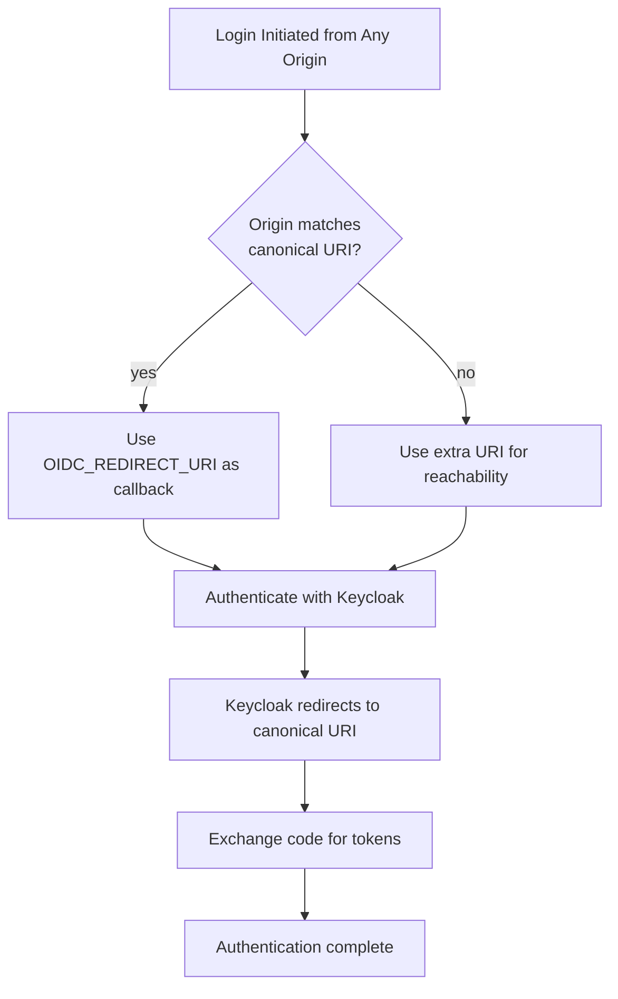

**Diagram sources**
- [identity_service.py](file://products/identity-broker/src/identity_service/services/identity_service.py)
- [reconcile-portal-oidc-client.sh](file://shared/platform-ops/gitops/dev-k8s/reconcile-portal-oidc-client.sh)

**Section sources**
- [identity_service.py](file://products/identity-broker/src/identity_service/services/identity_service.py)
- [reconcile-portal-oidc-client.sh](file://shared/platform-ops/gitops/dev-k8s/reconcile-portal-oidc-client.sh)

### Incident Service Connectivity
- Purpose: Provides Basic authentication-based connectivity to incident-service for incident report document assembly and triage operations.
- Agent Platform Configuration: Controlled by AGENT_INCIDENT_SERVICE_URL, AGENT_INCIDENT_CLIENT_ID, AGENT_INCIDENT_CLIENT_SECRET, and AGENT_INCIDENT_CLIENT_TIMEOUT_SECONDS environment variables.
- Platform Gateway Configuration: Controlled by PLATFORM_GATEWAY_INCIDENT_SERVICE_URL, PLATFORM_GATEWAY_INCIDENT_CLIENT_ID, PLATFORM_GATEWAY_INCIDENT_CLIENT_SECRET, and PLATFORM_GATEWAY_INCIDENT_TRIAGE_TIMEOUT_SECONDS environment variables.
- Authentication: Uses Basic authentication with registered query clients configured in incident-service's INCIDENT_QUERY_CLIENTS setting.
- Behavior: Unset URL or secret fails closed with 503 responses for incident-report creation; triage operations use separate timeout configuration.
- Security: Credentials must match entries in incident-service's INCIDENT_QUERY_CLIENTS registry; secrets are provisioned via sync-incident-secrets.sh.

**New Section** Comprehensive incident service connectivity implementation with Basic authentication for incident report document assembly and triage operations.

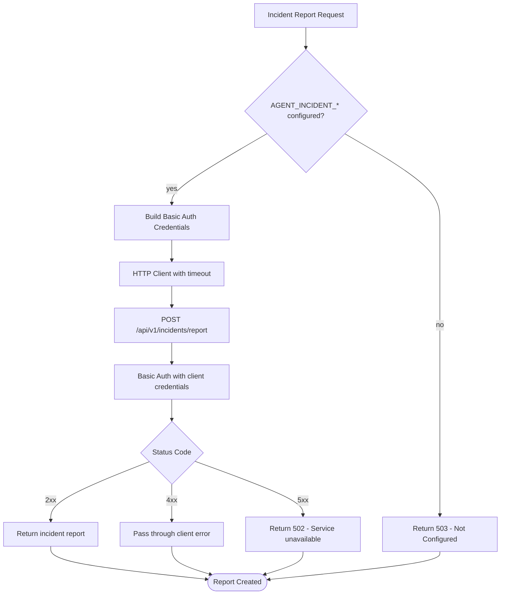

**Diagram sources**
- [runtime_settings.py](file://products/agent-platform/src/agent_service/runtime_settings.py)
- [incident_client.py](file://products/platform-gateway/src/platform_gateway/services/incident_client.py)

**Section sources**
- [runtime_settings.py](file://products/agent-platform/src/agent_service/runtime_settings.py)
- [incident_client.py](file://products/platform-gateway/src/platform_gateway/services/incident_client.py)

### Execution Signing Service
- Purpose: Provides HMAC-SHA256 signing for execution requests and receipts to ensure tamper-evident execution records.
- Configuration: Controlled by AGENT_EXECUTION_SIGNING_KEY environment variable provisioned via execution-signing-secret.
- Security: A missing key fails closed with signing_unavailable rejection - never degrades to unsigned execution.
- Canonicalization: Uses sorted keys and no insignificant whitespace for consistent JSON serialization.
- Signing Process: Signs execution envelopes excluding signature field, verifies argument digests match parked parameters.
- Receipt Generation: Creates signed receipts with outcome digests for completed executions.
- Rejection Handling: Marks rejected executions with reason codes (signing_unavailable, args_digest_mismatch, request_missing).

**New Section** Comprehensive execution signing implementation with HMAC-SHA256 signing for tamper-evident execution records and receipt generation.

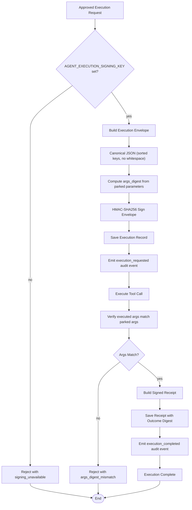

**Diagram sources**
- [execution_signing.py](file://products/agent-platform/src/agent_service/services/execution_signing.py)
- [execution_records.py](file://products/agent-platform/src/agent_service/services/execution_records.py)

**Section sources**
- [execution_signing.py](file://products/agent-platform/src/agent_service/services/execution_signing.py)
- [execution_records.py](file://products/agent-platform/src/agent_service/services/execution_records.py)

### Audit Service Integration
- Purpose: Provides fire-and-forget audit event emission to the durable audit service for execution tracking.
- Configuration: Controlled by AGENT_AUDIT_SERVICE_URL, AGENT_AUDIT_CLIENT_ID, and AGENT_AUDIT_CLIENT_SECRET environment variables.
- Behavior: Non-blocking daemon thread delivery with 2-second timeout; failures are logged but never degrade the chat stream.
- Event Types: Supports execution_requested, execution_completed, and execution_rejected events with standardized schema.
- Authentication: Uses Basic authentication with client credentials for audit service ingestion endpoint.
- Metrics: Tracks audit emit success/failure rates for monitoring and observability.
- Default Behavior: Unset AGENT_AUDIT_SERVICE_URL maintains historical log-only behavior byte-for-byte.

**New Section** Comprehensive audit service integration with fire-and-forget emission pattern for durable audit trails.

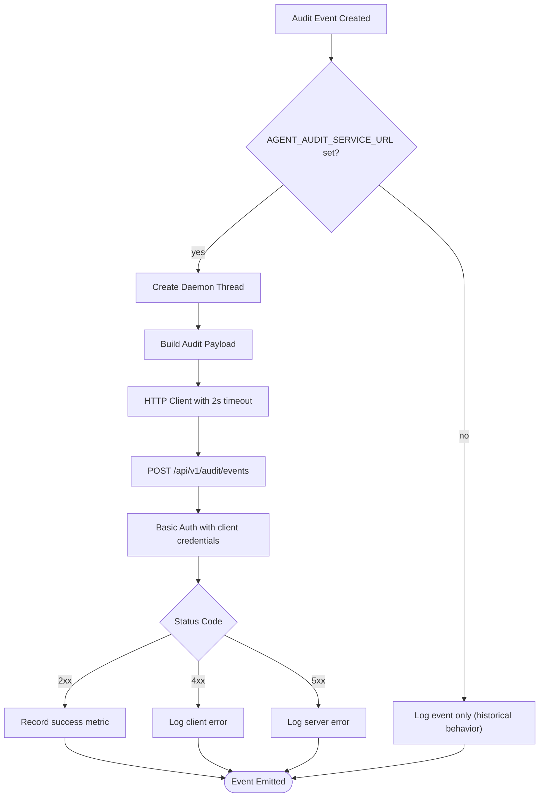

**Diagram sources**
- [audit_emitter.py](file://products/agent-platform/src/agent_service/services/audit_emitter.py)

**Section sources**
- [audit_emitter.py](file://products/agent-platform/src/agent_service/services/audit_emitter.py)

### Execution Record Persistence
- Purpose: Persists execution request/receipt lifecycle for tamper-evident audit trails with retention scanning.
- Configuration: Uses AGENT_STATE_STORE_BACKEND (memory/postgres) and AGENT_STATE_DB_URL for Postgres connectivity.
- Backends: In-memory backend for development/CI, Postgres backend for production with table creation on first use.
- Lifecycle: Tracks requested → succeeded/failed/timeout/rejected states with digest match verification.
- Retention: 30-day retention window with automated sweep operations to prevent unbounded growth.
- Failure Mode: Best-effort durability - store failures degrade audit completeness but never impact chat stream.
- Schema: Stores confirm_id, call_id, session_id, execution_id, tool_name, timestamps, status, and receipt data.

**New Section** Comprehensive execution record persistence with Postgres backend and retention scanning for compliance requirements.

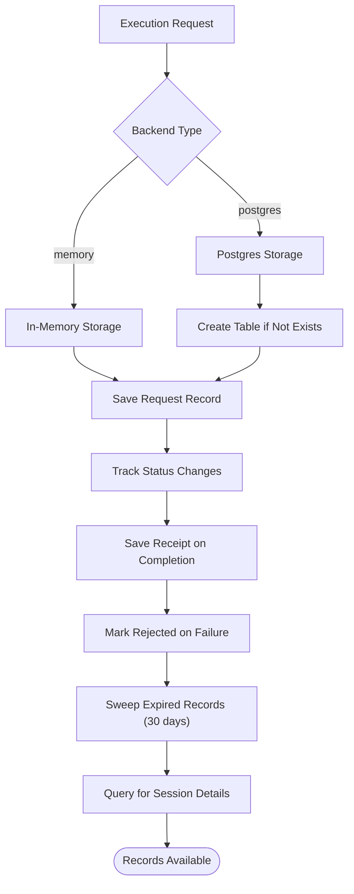

**Diagram sources**
- [execution_records.py](file://products/agent-platform/src/agent_service/services/execution_records.py)

**Section sources**
- [execution_records.py](file://products/agent-platform/src/agent_service/services/execution_records.py)

### Live Model Discovery Service
- Purpose: Automatically refresh model catalogs from provider endpoints with fail-soft fallback mechanisms.
- Configuration: Controlled by AGENT_MODEL_DISCOVERY_ENABLED (default: true), AGENT_MODEL_DISCOVERY_REFRESH_SECONDS (default: 1800), and AGENT_MODEL_DISCOVERY_TIMEOUT_SECONDS (default: 5).
- Fallback Ladder: Implements a four-tier fallback system: live fetch → in-memory cache → Postgres cache → curated series.
- Validation: Ensures refresh cadence >= 1 second and timeout > 0 seconds.
- Behavior: Runs as a background task that periodically queries provider `/models` endpoints and atomically swaps catalog entries.
- Safety: Never blocks chat operations or startup; failures are logged and swallowed.

**New Section** Comprehensive live model discovery implementation with configurable refresh cadence, timeout controls, and robust fail-soft fallback mechanisms.

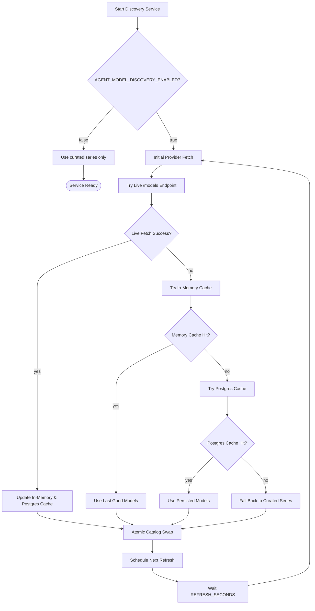

**Diagram sources**
- [model_discovery.py](file://products/agent-platform/src/agent_service/services/model_discovery.py)
- [runtime_settings.py](file://products/agent-platform/src/agent_service/runtime_settings.py)

**Section sources**
- [model_discovery.py](file://products/agent-platform/src/agent_service/services/model_discovery.py)
- [runtime_settings.py](file://products/agent-platform/src/agent_service/runtime_settings.py)

### Mutating Dev Profile Architecture
- Purpose: Provides a committed, environment-scoped development posture for enabling mutating tools safely.
- Integration: Wired permanently into dev-k8s overlay via kustomize configuration.
- Configuration: Merges GATEWAY_MUTATING_TOOLS_ENABLED=true into platform-runtime-config ConfigMap.
- RBAC: Carries bounded pod-delete Role/RoleBinding scoped to dev-luban-aiops namespace only.
- Safety: Maintains deny-by-default base posture while providing explicit opt-in for development.
- Triple-gate enforcement: Combines configuration flag, policy grants, and HITL confirmation requirements.

**New Section** Comprehensive mutating-dev profile implementation that provides a safe, committed development posture for enabling mutating tools with bounded RBAC permissions and triple-gate security controls.

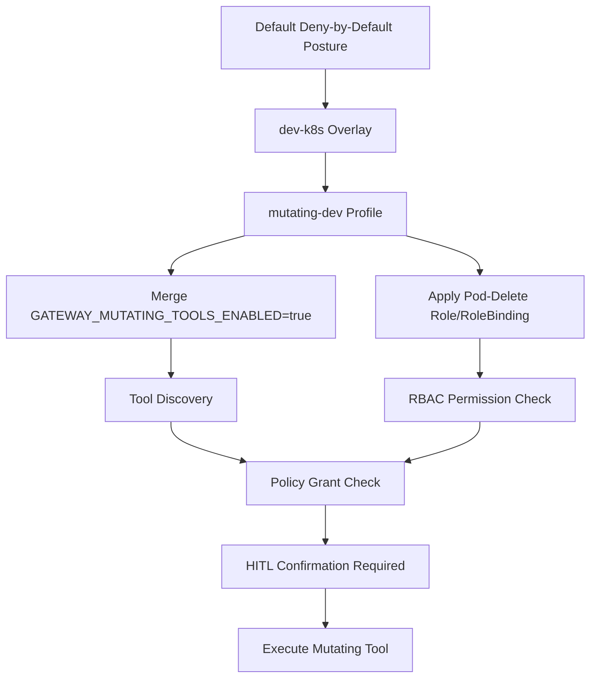

**Diagram sources**
- [kustomization.yaml](file://shared/platform-ops/gitops/dev-k8s/kustomization.yaml)
- [kustomization.yaml](file://shared/platform-ops/gitops/runtime-profiles/mutating-dev/kustomization.yaml)
- [mutating.env](file://shared/platform-ops/gitops/runtime-profiles/mutating-dev/mutating.env)
- [tool-gateway-pod-delete.yaml](file://shared/platform-ops/gitops/runtime-profiles/mutating-dev/tool-gateway-pod-delete.yaml)

**Section sources**
- [kustomization.yaml](file://shared/platform-ops/gitops/dev-k8s/kustomization.yaml)
- [kustomization.yaml](file://shared/platform-ops/gitops/runtime-profiles/mutating-dev/kustomization.yaml)
- [mutating.env](file://shared/platform-ops/gitops/runtime-profiles/mutating-dev/mutating.env)
- [tool-gateway-pod-delete.yaml](file://shared/platform-ops/gitops/runtime-profiles/mutating-dev/tool-gateway-pod-delete.yaml)

### Risk-Tier Admission Gate for Mutating Tools
- Purpose: Control access to mutating (write/admin) tools through policy enforcement and RBAC checks.
- Configuration: Controlled by GATEWAY_MUTATING_TOOLS_ENABLED environment variable (default: false).
- Enforcement: Mutating tools are not registered when disabled; require tools:mutate policy grant when enabled.
- Security: Provides defense-in-depth by combining configuration flags with policy and RBAC checks.
- Discovery: Mutating tools are absent from tool discovery when the gate is closed.
- Invocation: Returns TOOL_NOT_FOUND for mutating tools when gate is closed.
- **New**: Integrated with mutating-dev profile for safe development environment activation.

**Updated** Comprehensive risk-tier admission gate implementation that controls access to mutating tools through configuration, policy enforcement, and RBAC checks, with integrated support for the mutating-dev profile that provides a committed development posture for enabling mutating tools safely.

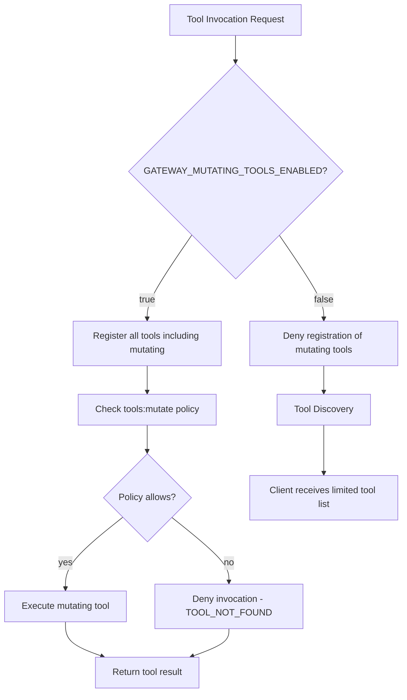

**Diagram sources**
- [config.py](file://products/tool-gateway/src/tool_gateway/core/config.py)
- [registry.py](file://products/tool-gateway/src/tool_gateway/tools/registry.py)
- [app.py](file://products/tool-gateway/src/tool_gateway/app.py)

**Section sources**
- [config.py](file://products/tool-gateway/src/tool_gateway/core/config.py)
- [registry.py](file://products/tool-gateway/src/tool_gateway/tools/registry.py)
- [app.py](file://products/tool-gateway/src/tool_gateway/app.py)

### Enhanced Agent Auto-Allow List Functionality
- Purpose: Provide read-only auto-approval for vetted tools while preventing accidental auto-execution of mutating tools.
- Configuration: Controlled by AGENT_GATEWAY_TOOL_AUTO_ALLOW environment variable (comma-separated tool names).
- Enforcement: Only tools marked as is_read_only=true AND in the allow list are auto-approved.
- Logging: Logs warnings when mutating tools appear in the auto-allow list to indicate misconfiguration.
- Safety: Maintains read-only invariant - mutating tools in the allow list still require HITL confirmation.
- Default: Built-in vetted read-only tools are auto-approved when no custom list is configured.

**New Section** Enhanced agent auto-allow list with read-only enforcement and comprehensive misconfiguration logging.

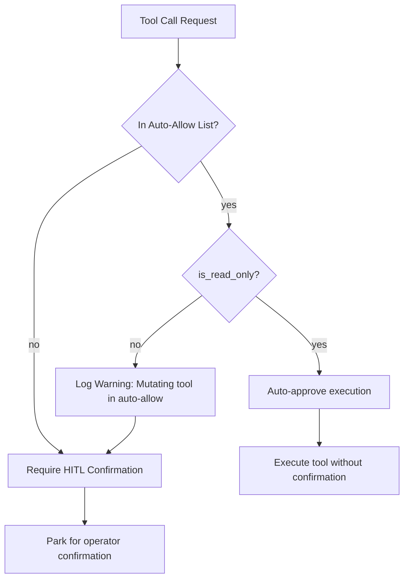

**Diagram sources**
- [kernel_middleware.py](file://products/agent-platform/src/agent_service/services/kernel_middleware.py)
- [gateway_tools.py](file://products/agent-platform/src/agent_service/tools/gateway_tools.py)

**Section sources**
- [kernel_middleware.py](file://products/agent-platform/src/agent_service/services/kernel_middleware.py)
- [gateway_tools.py](file://products/agent-platform/src/agent_service/tools/gateway_tools.py)

### HITL Confirmation Timeout Configuration
- Purpose: Control how long parked kernel confirmations remain answerable before timing out.
- Configuration: Controlled by AGENT_HITL_CONFIRM_TIMEOUT environment variable (default: 600 seconds).
- Behavior: When set to 0, disables the confirmation bridge and restores pre-SPEC-020 silent-park posture.
- Validation: Rejects negative values with clear error messages during startup.
- Use Case: Balances operational efficiency with safety requirements for different environments.
- Integration: Works with the confirmation bridge to park and resume tool calls requiring operator approval.

**New Section** Configurable HITL confirmation timeout that balances operational efficiency with safety requirements.

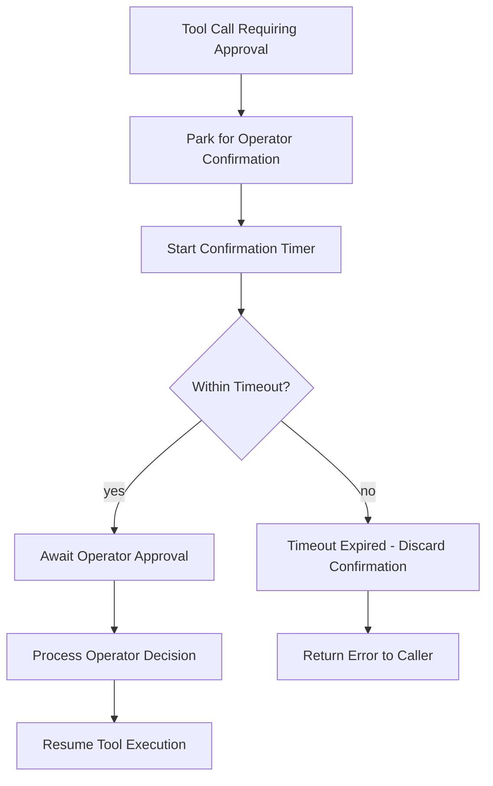

**Diagram sources**
- [runtime_settings.py](file://products/agent-platform/src/agent_service/runtime_settings.py)

**Section sources**
- [runtime_settings.py](file://products/agent-platform/src/agent_service/runtime_settings.py)

### Enhanced Telemetry System
- Purpose: Opt-in OpenTelemetry push pipeline with fail-open behavior and durable secret provisioning.
- Gating: Controlled by OTEL_ENABLED environment variable (default false).
- Authentication: Uses OTEL_EXPORTER_OTLP_HEADERS for Basic auth against OpenObserve ingest endpoint.
- Fail-open: Setup errors are logged but never raised into the request path.
- Signals: Exports traces, metrics, and logs via OTLP HTTP/protobuf.
- **New**: Durable secret provisioning ensures authentication headers persist across all deployment operations.

**New Section** Comprehensive telemetry implementation with enhanced secret management that maintains OTel authentication headers across deployment operations through cluster-side merging and local file preservation.

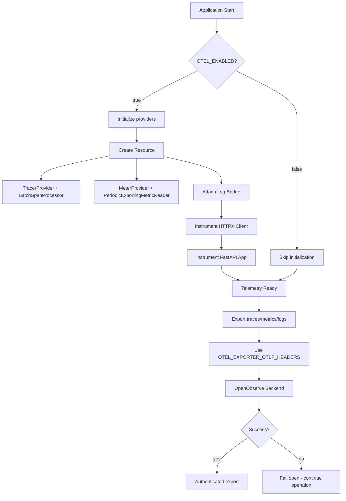

**Diagram sources**
- [telemetry.py](file://products/platform-gateway/src/platform_gateway/core/telemetry.py)
- [sync-otel-secrets.sh](file://shared/platform-ops/gitops/sync-otel-secrets.sh)

**Section sources**
- [telemetry.py](file://products/platform-gateway/src/platform_gateway/core/telemetry.py)

### Durable Secret Provisioning System
- Purpose: Ensure OpenTelemetry authentication headers persist across all deployment operations.
- Cluster-side merging: Uses `kubectl patch --type merge` to update only the OTEL key in existing secrets.
- Local file preservation: Mirrors headers into local env files to maintain consistency.
- Sibling script hooks: Other sync scripts preserve existing OTel headers during their operations.
- Agent-platform profile handling: Special handling for agent-platform runtime profile files.
- **New**: Automatic workload restarts after secret updates to apply changes immediately.

**New Section** Comprehensive secret provisioning system that maintains OTel authentication headers across all deployment operations through cluster-side merging and local file preservation.

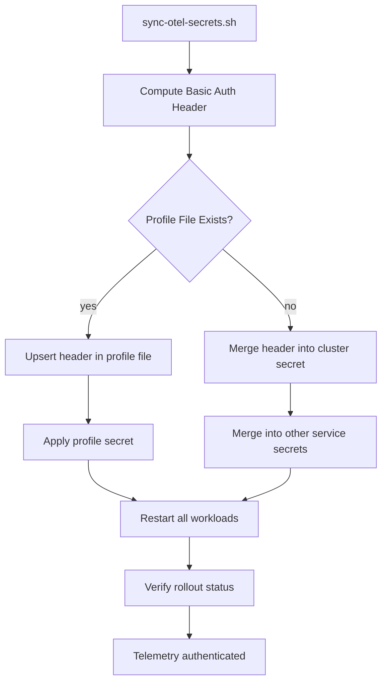

**Diagram sources**
- [sync-otel-secrets.sh](file://shared/platform-ops/gitops/sync-otel-secrets.sh)
- [sync-delegation-secrets.sh](file://shared/platform-ops/gitops/sync-delegation-secrets.sh)
- [sync-audit-secrets.sh](file://shared/platform-ops/gitops/sync-audit-secrets.sh)
- [sync-skills-secrets.sh](file://shared/platform-ops/gitops/sync-skills-secrets.sh)

**Section sources**
- [sync-otel-secrets.sh](file://shared/platform-ops/gitops/sync-otel-secrets.sh)
- [sync-delegation-secrets.sh](file://shared/platform-ops/gitops/sync-delegation-secrets.sh)
- [sync-audit-secrets.sh](file://shared/platform-ops/gitops/sync-audit-secrets.sh)
- [sync-skills-secrets.sh](file://shared/platform-ops/gitops/sync-skills-secrets.sh)

### Workspace Resource Proxy Routes
- Purpose: Provide read-only access to workspace resources (tools catalog and skills inventory) through the platform gateway.
- Tools proxy: `GET /api/v1/tools` enforces `tools:list` policy action and proxies to tool-gateway with delegated token.
- Skills proxy: `GET /api/v1/skills` enforces `skills:read` policy action and proxies to skills-hub with Basic authentication.
- Error handling: Returns 503 when services not configured, 502 on upstream failures, passes through 4xx client errors.

**New Section** Comprehensive workspace resource proxy implementation with appropriate authentication mechanisms and error handling.

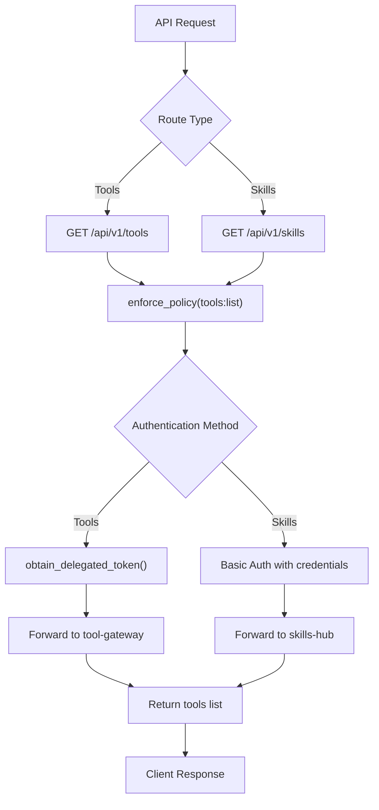

**Diagram sources**
- [tools.py](file://products/platform-gateway/src/platform_gateway/api/routes/tools.py)
- [skills.py](file://products/platform-gateway/src/platform_gateway/api/routes/skills.py)

**Section sources**
- [tools.py](file://products/platform-gateway/src/platform_gateway/api/routes/tools.py)
- [skills.py](file://products/platform-gateway/src/platform_gateway/api/routes/skills.py)

### Workspace Resource Clients
- Purpose: Handle HTTP communication with downstream workspace resource services.
- Tool gateway client: Forwards delegated tokens obtained through identity broker exchange.
- Skills hub client: Uses Basic authentication with configured client credentials.
- Error mapping: Consistent error handling with 503 for unconfigured services, 502 for upstream failures, 4xx passthrough for client errors.

**New Section** Dedicated client implementations for workspace resource integration with appropriate authentication and error handling patterns.

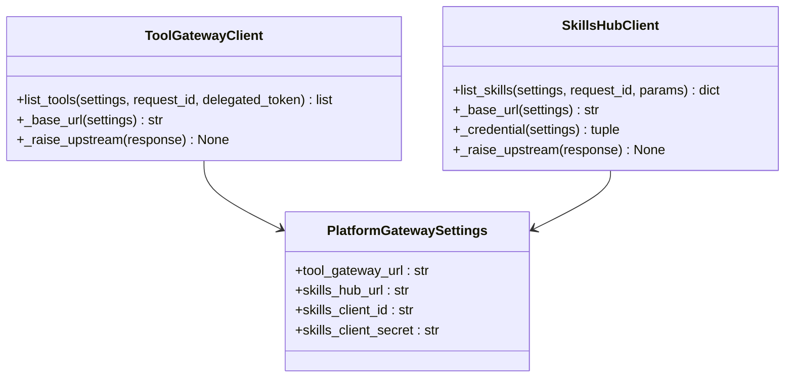

**Diagram sources**
- [tool_gateway_client.py](file://products/platform-gateway/src/platform_gateway/services/tool_gateway_client.py)
- [skills_hub_client.py](file://products/platform-gateway/src/platform_gateway/services/skills_hub_client.py)
- [config.py](file://products/platform-gateway/src/platform_gateway/core/config.py)

**Section sources**
- [tool_gateway_client.py](file://products/platform-gateway/src/platform_gateway/services/tool_gateway_client.py)
- [skills_hub_client.py](file://products/platform-gateway/src/platform_gateway/services/skills_hub_client.py)

### Runtime Settings and Port Resolution
- Purpose: Handle service binding configuration with robust port resolution.
- Port resolution: Ignores Kubernetes service-link format (`tcp://IP:PORT`) and extracts numeric ports.
- Default behavior: Falls back to default host and port when environment variables are not set.
- Development safety: Prevents conflicts between manual configuration and automatic service-link injection.

**Section sources**
- [runtime.py](file://products/platform-gateway/src/platform_gateway/core/runtime.py)

### DNS-Based Service Discovery
- Purpose: Enable reliable inter-service communication using Kubernetes DNS names.
- Configuration: Service endpoints configured via environment variables pointing to DNS names.
- Benefits: Eliminates service-link conflicts, improves reliability, and simplifies configuration.
- Implementation: Services resolve DNS names like `identity-service` to their cluster IPs.

**Section sources**
- [runtime-config.env](file://shared/platform-ops/gitops/dev-k8s/base/platform-gateway/runtime-config.env)
- [platform-gateway-deployment.yaml](file://shared/platform-ops/gitops/dev-k8s/base/platform-gateway/platform-gateway-deployment.yaml)

### Policy Engine Configuration
- Default policy: Loaded from a YAML file defining baseline rules and behaviors.
- Overrides: Can be adjusted via environment variables or mounted config files depending on implementation.
- Usage: Provides decision context for tool invocation, access control, and rate limiting.

**Section sources**
- [spec.md](file://docs/specs/SPEC-019-portal-transparency-navigation/spec.md)

### Docker Configuration
- Image build: Defines base image, working directory, and dependency installation.
- Entrypoint: Runs the Platform Gateway Service with environment variables passed through.
- Best practices: Use multi-stage builds, pin versions, minimize attack surface.

**Section sources**
- [platform-gateway-deployment.yaml](file://shared/platform-ops/gitops/dev-k8s/base/platform-gateway/platform-gateway-deployment.yaml)

### Kubernetes Deployment and ConfigMaps
- Deployment manifest: Mounts environment variables and config files into the pod.
- ConfigMap: Holds non-sensitive configuration values including service endpoints.
- Service discovery: Uses DNS names for inter-service communication.
- Environment injection: Maps ConfigMap entries to environment variables consumed by the configuration loader.
- Secrets management: Handles sensitive data like workspace resource credentials separately from ConfigMaps.
- **New**: Enhanced secret management with durable OTel header provisioning through cluster-side merging.
- **New**: Mutating-dev profile integration that merges GATEWAY_MUTATING_TOOLS_ENABLED=true into the runtime configuration.
- **New**: Live model discovery configuration through AGENT_MODEL_DISCOVERY_* environment variables.
- **New**: Execution signing secret provisioning through execution-signing-secret with optional secretKeyRef.
- **New**: Audit service configuration through AGENT_AUDIT_SERVICE_URL and related client credentials.
- **New**: Incident service configuration through AGENT_INCIDENT_* and PLATFORM_GATEWAY_INCIDENT_* environment variables for incident report document assembly and triage capabilities.
- **New**: Enhanced OIDC configuration with clear separation between canonical callback URIs and reachability-only extra URIs.

**Updated** Enhanced deployment configuration with workspace resource integration, including tool gateway URL, skills hub URL, and skills client credentials for read-only workspace resource access, risk-tier admission gate configuration for mutating tools, configurable HITL confirmation timeouts, enhanced agent auto-allow list settings, plus durable OpenTelemetry secret provisioning that maintains authentication headers across deployment operations, the new mutating-dev profile that provides a committed development posture for enabling mutating tools safely, live model discovery configuration for automatic catalog updates, execution signing secret provisioning for tamper-evident execution records, audit service configuration for durable audit trails, incident service configuration for incident report document assembly and triage capabilities, and enhanced OIDC configuration that clearly distinguishes between canonical callback URIs and reachability-only extra URIs.

```mermaid
graph TB
CM["ConfigMap"] --> ENV["Environment Variables"]
ENV --> POD["Pod Spec"]
POD --> APP["Platform Gateway App"]
APP --> CFG["Configuration Loader"]
DNS["Kubernetes DNS"] --> SVC["Service Names"]
SVC --> APP
Secrets["Secrets"] --> WorkspaceCreds["Workspace Resource Credentials"]
Secrets --> OTelCreds["OTel Authentication Headers"]
Secrets --> ExecSigning["Execution Signing Key"]
Secrets --> IncidentCreds["Incident Service Credentials"]
WorkspaceCreds --> APP
OTelCreds --> APP
ExecSigning --> APP
IncidentCreds --> APP
AppEnv["PLATFORM_GATEWAY_* Variables"] --> APP
APP --> ToolsProxy["Tools Catalog Proxy"]
APP --> SkillsProxy["Skills Inventory Proxy"]
APP --> IncidentProxy["Incident Service Proxy"]
ToolsProxy --> ToolsSvc["Tool Gateway Service"]
SkillsProxy --> SkillsSvc["Skills Hub Service"]
IncidentProxy --> IncidentSvc["Incident Service"]
APP --> OTelExport["OTel Export Pipeline"]
OTelExport --> Backend["OpenObserve Backend"]
ToolGWEnv["GATEWAY_* Variables"] --> ToolGW["Tool Gateway"]
ToolGW --> RiskGate["Risk-Tier Admission Gate"]
AgentEnv["AGENT_* Variables"] --> Agent["Agent Platform"]
Agent --> AutoAllow["Auto-Allow List"]
Agent --> HITLTimeout["HITL Confirmation Timeout"]
Agent --> ModelDisc["Model Discovery Service"]
Agent --> ExecSign["Execution Signing Service"]
Agent --> Audit["Audit Service"]
Agent --> IncidentAssembly["Incident Report Assembly"]
ModelDisc --> ProviderEndpoints["Provider /models Endpoints"]
ExecSign --> ExecStore["Execution Record Store"]
Audit --> AuditBackend["Audit Service Backend"]
IncidentAssembly --> IncidentSvc
MutDev["Mutating Dev Profile"] --> ConfigMerge["ConfigMap Merge"]
ConfigMerge --> ToolGWEnv
ExecSigning --> ExecSign
IncidentSecrets --> IncidentAssembly
OIDCConfig["OIDC Configuration"] --> CanonicalURI["OIDC_REDIRECT_URI"]
OIDCConfig --> ExtraURIs["OIDC_EXTRA_REDIRECT_URIS"]
CanonicalURI --> IdentityBroker["Identity Broker"]
ExtraURIs --> Keycloak["Keycloak Registration"]
IdentityBroker --> CanonicalCallback["Canonical Callback"]
Keycloak --> ReachabilityOnly["Reachability Only"]
```

**Diagram sources**
- [platform-gateway-deployment.yaml](file://shared/platform-ops/gitops/dev-k8s/base/platform-gateway/platform-gateway-deployment.yaml)
- [agent-service-deployment.yaml](file://shared/platform-ops/gitops/dev-k8s/base/agent-platform/agent-service-deployment.yaml)
- [runtime-config.env](file://shared/platform-ops/gitops/dev-k8s/base/platform-gateway/runtime-config.env)
- [runtime-config.env](file://shared/platform-ops/gitops/dev-k8s/base/agent-platform/runtime-config.env)
- [runtime-config.env](file://shared/platform-ops/gitops/dev-k8s/base/tool-gateway/runtime-config.env)
- [sync-otel-secrets.sh](file://shared/platform-ops/gitops/sync-otel-secrets.sh)
- [sync-execution-signing-secret.sh](file://shared/platform-ops/gitops/sync-execution-signing-secret.sh)
- [sync-incident-secrets.sh](file://shared/platform-ops/gitops/sync-incident-secrets.sh)
- [kustomization.yaml](file://shared/platform-ops/gitops/dev-k8s/kustomization.yaml)
- [mutating.env](file://shared/platform-ops/gitops/runtime-profiles/mutating-dev/mutating.env)
- [identity_service.py](file://products/identity-broker/src/identity_service/services/identity_service.py)
- [reconcile-portal-oidc-client.sh](file://shared/platform-ops/gitops/dev-k8s/reconcile-portal-oidc-client.sh)

**Section sources**
- [platform-gateway-deployment.yaml](file://shared/platform-ops/gitops/dev-k8s/base/platform-gateway/platform-gateway-deployment.yaml)
- [agent-service-deployment.yaml](file://shared/platform-ops/gitops/dev-k8s/base/agent-platform/agent-service-deployment.yaml)
- [runtime-config.env](file://shared/platform-ops/gitops/dev-k8s/base/platform-gateway/runtime-config.env)
- [runtime-config.env](file://shared/platform-ops/gitops/dev-k8s/base/agent-platform/runtime-config.env)
- [runtime-config.env](file://shared/platform-ops/gitops/dev-k8s/base/tool-gateway/runtime-config.env)

## Dependency Analysis
Configuration components depend on environment variables and files, while the runtime settings handle DNS-based service discovery. The Docker image encapsulates runtime dependencies, and Kubernetes manifests inject configuration at deployment time. Workspace resource integration adds dependencies on tool-gateway and skills-hub services with appropriate authentication mechanisms.

**Updated** Added dependencies for workspace resource integration including tool-gateway delegation flow and skills-hub Basic authentication, risk-tier admission gate enforcement, configurable HITL confirmation timeouts, enhanced agent auto-allow list functionality with read-only enforcement, plus enhanced OpenTelemetry secret provisioning dependencies that ensure authentication headers persist across deployment operations, the new mutating-dev profile dependencies that provide committed development posture for enabling mutating tools safely, live model discovery dependencies that connect to provider endpoints with robust fallback mechanisms, execution signing dependencies that require execution-signing-secret provisioning, audit service dependencies for durable audit trail emission, execution record store dependencies for Postgres-backed persistence with retention scanning, incident service dependencies that require incident-query-client configuration and credential provisioning through sync-incident-secrets.sh, and OIDC configuration dependencies that distinguish between canonical callback URIs and reachability-only extra URIs.

```mermaid
graph TB
CFG["config.py"] --> ENV["Environment Variables"]
CFG --> FILE["Config Files"]
RT["runtime.py"] --> PORT["Port Resolution"]
TELEMETRY["telemetry.py"] --> SECRETS["Secret Management"]
SECRETS --> SYNC["sync-otel-secrets.sh"]
SYNC --> CLUSTER["Cluster Secrets"]
CLUSTER --> SECRETS
DNS["Kubernetes DNS"] --> SVC["Service Discovery"]
DOCKER["Deployment Manifest"] --> RUNTIME["Runtime Dependencies"]
K8S["platform-gateway-deployment.yaml"] --> INJECT["Env Injection"]
INJECT --> CFG
SVC --> RT
WS["Workspace Resources"] --> TOOLS["Tool Gateway"]
WS --> SKILLS["Skills Hub"]
WS --> INCIDENT["Incident Service"]
CFG --> WS
Tools["tools.py"] --> ToolsClient["tool_gateway_client.py"]
Skills["skills.py"] --> SkillsClient["skills_hub_client.py"]
Incident["incident_client.py"] --> IncidentClient["incident_client.py"]
ToolsClient --> TOOLS
SkillsClient --> SKILLS
IncidentClient --> INCIDENT
TELEMETRY --> BACKEND["OpenObserve Backend"]
Agent["kernel_middleware.py"] --> AutoAllow["Auto-Allow List"]
Agent --> HITL["HITL Timeout"]
Agent --> ModelDisc["Model Discovery"]
Agent --> ExecSign["Execution Signing"]
Agent --> Audit["Audit Emitter"]
Agent --> IncidentAssembly["Incident Report Assembly"]
ModelDisc --> Providers["Provider Endpoints"]
ExecSign --> ExecStore["Execution Record Store"]
ExecSign --> Audit
Audit --> AuditBackend["Audit Service Backend"]
IncidentAssembly --> IncidentBackend["Incident Service Backend"]
ExecStore --> Postgres["Postgres Database"]
ToolGW["tool-gateway config.py"] --> RiskGate["Risk-Tier Gate"]
RiskGate --> Policy["Policy Enforcement"]
MutDev["mutating-dev profile"] --> ConfigMerge["ConfigMap Merge"]
MutDev --> RBAC["RBAC Role/RoleBinding"]
ConfigMerge --> ToolGW
RBAC --> ToolGW
ExecSigning["sync-execution-signing-secret.sh"] --> ExecSigningSecret["execution-signing-secret"]
ExecSigningSecret --> ExecSign
IncidentSecrets["sync-incident-secrets.sh"] --> IncidentSecrets["incident-query-clients"]
IncidentSecrets --> IncidentAssembly
OIDC["identity_service.py"] --> CanonicalURI["OIDC_REDIRECT_URI"]
OIDC --> ExtraURIs["OIDC_EXTRA_REDIRECT_URIS"]
CanonicalURI --> Keycloak["Keycloak"]
ExtraURIs --> Keycloak
Keycloak --> CanonicalCallback["Canonical Callback"]
```

**Diagram sources**
- [config.py](file://products/platform-gateway/src/platform_gateway/core/config.py)
- [runtime.py](file://products/platform-gateway/src/platform_gateway/core/runtime.py)
- [telemetry.py](file://products/platform-gateway/src/platform_gateway/core/telemetry.py)
- [tools.py](file://products/platform-gateway/src/platform_gateway/api/routes/tools.py)
- [skills.py](file://products/platform-gateway/src/platform_gateway/api/routes/skills.py)
- [incident_client.py](file://products/platform-gateway/src/platform_gateway/services/incident_client.py)
- [kernel_middleware.py](file://products/agent-platform/src/agent_service/services/kernel_middleware.py)
- [runtime_settings.py](file://products/agent-platform/src/agent_service/runtime_settings.py)
- [execution_signing.py](file://products/agent-platform/src/agent_service/services/execution_signing.py)
- [audit_emitter.py](file://products/agent-platform/src/agent_service/services/audit_emitter.py)
- [execution_records.py](file://products/agent-platform/src/agent_service/services/execution_records.py)
- [model_discovery.py](file://products/agent-platform/src/agent_service/services/model_discovery.py)
- [config.py](file://products/tool-gateway/src/tool_gateway/core/config.py)
- [registry.py](file://products/tool-gateway/src/tool_gateway/tools/registry.py)
- [tool_gateway_client.py](file://products/platform-gateway/src/platform_gateway/services/tool_gateway_client.py)
- [skills_hub_client.py](file://products/platform-gateway/src/platform_gateway/services/skills_hub_client.py)
- [sync-execution-signing-secret.sh](file://shared/platform-ops/gitops/sync-execution-signing-secret.sh)
- [sync-otel-secrets.sh](file://shared/platform-ops/gitops/sync-otel-secrets.sh)
- [sync-incident-secrets.sh](file://shared/platform-ops/gitops/sync-incident-secrets.sh)
- [platform-gateway-deployment.yaml](file://shared/platform-ops/gitops/dev-k8s/base/platform-gateway/platform-gateway-deployment.yaml)
- [agent-service-deployment.yaml](file://shared/platform-ops/gitops/dev-k8s/base/agent-platform/agent-service-deployment.yaml)
- [identity_service.py](file://products/identity-broker/src/identity_service/services/identity_service.py)
- [reconcile-portal-oidc-client.sh](file://shared/platform-ops/gitops/dev-k8s/reconcile-portal-oidc-client.sh)

**Section sources**
- [config.py](file://products/platform-gateway/src/platform_gateway/core/config.py)
- [runtime.py](file://products/platform-gateway/src/platform_gateway/core/runtime.py)
- [telemetry.py](file://products/platform-gateway/src/platform_gateway/core/telemetry.py)
- [tools.py](file://products/platform-gateway/src/platform_gateway/api/routes/tools.py)
- [skills.py](file://products/platform-gateway/src/platform_gateway/api/routes/skills.py)
- [incident_client.py](file://products/platform-gateway/src/platform_gateway/services/incident_client.py)
- [kernel_middleware.py](file://products/agent-platform/src/agent_service/services/kernel_middleware.py)
- [runtime_settings.py](file://products/agent-platform/src/agent_service/runtime_settings.py)
- [execution_signing.py](file://products/agent-platform/src/agent_service/services/execution_signing.py)
- [audit_emitter.py](file://products/agent-platform/src/agent_service/services/audit_emitter.py)
- [execution_records.py](file://products/agent-platform/src/agent_service/services/execution_records.py)
- [model_discovery.py](file://products/agent-platform/src/agent_service/services/model_discovery.py)
- [config.py](file://products/tool-gateway/src/tool_gateway/core/config.py)
- [registry.py](file://products/tool-gateway/src/tool_gateway/tools/registry.py)
- [tool_gateway_client.py](file://products/platform-gateway/src/platform_gateway/services/tool_gateway_client.py)
- [skills_hub_client.py](file://products/platform-gateway/src/platform_gateway/services/skills_hub_client.py)
- [sync-execution-signing-secret.sh](file://shared/platform-ops/gitops/sync-execution-signing-secret.sh)
- [sync-otel-secrets.sh](file://shared/platform-ops/gitops/sync-otel-secrets.sh)
- [sync-incident-secrets.sh](file://shared/platform-ops/gitops/sync-incident-secrets.sh)
- [platform-gateway-deployment.yaml](file://shared/platform-ops/gitops/dev-k8s/base/platform-gateway/platform-gateway-deployment.yaml)
- [agent-service-deployment.yaml](file://shared/platform-ops/gitops/dev-k8s/base/agent-platform/agent-service-deployment.yaml)

## Performance Considerations
- Minimize configuration lookups by caching validated configuration at startup.
- Avoid heavy I/O during request processing; pre-load policies and dependencies.
- Use efficient serialization formats for configuration files where applicable.
- Monitor configuration-related metrics and errors to detect misconfigurations early.
- Leverage Kubernetes DNS caching for improved service discovery performance.
- Optimize port resolution to avoid unnecessary string parsing operations.
- Workspace resource proxies use timeout-based connections to prevent hanging requests.
- Delegated token acquisition is cached where possible to reduce identity broker load.
- Skills hub requests use connection pooling for improved performance.
- Monitor workspace resource proxy latency and error rates for capacity planning.
- **New**: Risk-tier admission gates add minimal overhead through policy checks.
- **New**: Auto-allow list lookups use frozenset for O(1) performance.
- **New**: HITL confirmation timeouts prevent indefinite resource holding.
- **New**: OTel export pipeline uses batch processors for efficient telemetry collection.
- **New**: Secret provisioning operations are optimized to minimize cluster API calls.
- **New**: Failed OTel exports fail open to avoid impacting service performance.
- **New**: Mutating-dev profile integration is compile-time static, adding no runtime overhead.
- **New**: Live model discovery runs as background tasks with atomic catalog swaps to avoid blocking operations.
- **New**: Model discovery implements fail-soft ladder to minimize network calls and leverage caches.
- **New**: Discovery refresh intervals are configurable to balance freshness with performance.
- **New**: Provider endpoint timeouts prevent slow responses from affecting overall performance.
- **New**: Execution signing uses constant-time HMAC comparison for security without performance impact.
- **New**: Audit emissions run on daemon threads with short timeouts to prevent blocking.
- **New**: Execution record writes are best-effort with automatic fallback to in-memory storage.
- **New**: Postgres execution records use connection pooling and retention scanning to manage storage growth.
- **New**: Canonical JSON serialization optimizes signing performance through sorted keys and compact formatting.
- **New**: Incident service connectivity uses timeout-based HTTP clients to prevent hanging requests.
- **New**: Incident report assembly performs efficient Basic authentication with configured credentials.
- **New**: Incident service proxy operations use connection pooling and timeout controls for optimal performance.
- **New**: OIDC redirect URI resolution uses efficient fallback logic to minimize authentication flow overhead.

## Troubleshooting Guide
Common issues and resolutions:
- Missing environment variables: Ensure all required variables are set in the deployment manifest or environment.
- Invalid configuration values: Check types, ranges, and cross-field constraints; review validation error messages.
- Policy loading failures: Verify YAML syntax and structure; ensure paths are correct and accessible.
- Secrets not mounted: Confirm Secret objects exist and are referenced correctly in the deployment.
- DNS resolution failures: Verify service names match Kubernetes Service resources and check network policies.
- Service link conflicts: Ensure `enableServiceLinks: false` is set in all deployment manifests.
- Port resolution issues: Check that port values are numeric and not in Kubernetes service-link format.
- Inter-service communication failures: Verify DNS names are resolvable and services are running.
- **New**: Workspace resource proxy failures: Check tool_gateway_url and skills_hub_url configuration; verify downstream services are running.
- **New**: Tools catalog proxy issues: Verify delegated token acquisition works; check identity broker configuration and permissions.
- **New**: Skills inventory proxy issues: Verify skills_client_id and skills_client_secret are properly configured; check skills-hub authentication.
- **New**: Workspace resource 503 errors: Indicates workspace resource services are not configured; verify PLATFORM_GATEWAY_TOOL_GATEWAY_URL and PLATFORM_GATEWAY_SKILLS_HUB_URL.
- **New**: Workspace resource 502 errors: Indicates upstream service failures; check tool-gateway and skills-hub service health and connectivity.
- **New**: Workspace resource 4xx errors: Indicates client-side issues; verify delegated token validity and skills authentication credentials.
- **New**: OTel authentication failures: Check if OTEL_EXPORTER_OTLP_HEADERS is properly provisioned; verify sync-otel-secrets.sh has been run successfully.
- **New**: OTel export failures: Verify OTEL_EXPORTER_OTLP_ENDPOINT is configured; check OpenObserve backend connectivity and authentication.
- **New**: Secret provisioning issues: Ensure OO_ROOT_USER_EMAIL and OO_ROOT_USER_PASSWORD are exported before running sync-otel-secrets.sh.
- **New**: Header persistence problems: Check that sibling sync scripts have preserved existing OTel headers during their operations.
- **New**: Mutating tools not available: Verify GATEWAY_MUTATING_TOOLS_ENABLED is set to true; check tools:mutate policy grants and RBAC permissions.
- **New**: Mutating tools still denied: Check policy bundle configuration; verify user roles have tools:mutate permission.
- **New**: Auto-allow list not working: Verify AGENT_GATEWAY_TOOL_AUTO_ALLOW is properly formatted; check that tools are marked as read-only.
- **New**: HITL confirmation timeout issues: Check AGENT_HITL_CONFIRM_TIMEOUT value; verify confirmation bridge is enabled.
- **New**: Negative timeout values rejected: Ensure AGENT_HITL_CONFIRM_TIMEOUT is set to 0 or positive integer.
- **New**: Mutating tools in auto-allow list: Review logs for warnings about mutating tools appearing in auto-allow list; remove them from configuration.
- **New**: Mutating-dev profile not active: Verify dev-k8s overlay includes the mutating-dev profile; check kustomize build output for ConfigMap merge.
- **New**: Pod-delete RBAC missing: Verify tool-gateway-pod-delete.yaml is applied; check namespace and service account configuration.
- **New**: Mutating tools appear in discovery but fail: Check all three gates: GATEWAY_MUTATING_TOOLS_ENABLED, tools:mutate policy grants, and AGENT_HITL_CONFIRM_TIMEOUT > 0.
- **New**: Model discovery not updating: Verify AGENT_MODEL_DISCOVERY_ENABLED is true; check provider endpoints are reachable; review discovery logs for errors.
- **New**: Model discovery timeout errors: Adjust AGENT_MODEL_DISCOVERY_TIMEOUT_SECONDS for slow provider endpoints; check network connectivity.
- **New**: Model discovery refresh too frequent: Increase AGENT_MODEL_DISCOVERY_REFRESH_SECONDS to reduce provider load; monitor provider rate limits.
- **New**: Model discovery falling back to curated series: Check if provider endpoints are failing; verify credentials are valid; examine discovery failure logs.
- **New**: Model discovery validation errors: Ensure AGENT_MODEL_DISCOVERY_REFRESH_SECONDS >= 1 and AGENT_MODEL_DISCOVERY_TIMEOUT_SECONDS > 0.
- **New**: Execution signing failures: Verify execution-signing-secret exists and contains AGENT_EXECUTION_SIGNING_KEY; check sync-execution-signing-secret.sh was run successfully.
- **New**: Mutating resumes blocked: Check if AGENT_EXECUTION_SIGNING_KEY is present; absence causes signing_unavailable rejections.
- **New**: Argument digest mismatch: Verify executed arguments match parked arguments exactly; check for parameter transformation issues.
- **New**: Audit service connection failures: Check AGENT_AUDIT_SERVICE_URL configuration; verify audit service is running and accessible.
- **New**: Audit emission failures: Check AGENT_AUDIT_CLIENT_SECRET configuration; verify audit service authentication is working.
- **New**: Execution record store failures: Verify AGENT_STATE_STORE_BACKEND and AGENT_STATE_DB_URL configuration; check Postgres connectivity.
- **New**: Execution records not persisting: Check if Postgres backend is available; failures fall back to in-memory storage.
- **New**: Retention scanning not working: Verify Postgres connectivity; check retention window configuration (30 days default).
- **New**: Execution signing secret not found: Run sync-execution-signing-secret.sh to provision the execution-signing-secret; check namespace configuration.
- **New**: Audit service URL incorrect: Verify AGENT_AUDIT_SERVICE_URL points to correct audit service endpoint; check DNS resolution.
- **New**: Execution record database schema missing: Postgres backend creates table on first use; verify database connectivity and permissions.
- **New**: Incident service connectivity failures: Verify AGENT_INCIDENT_SERVICE_URL and PLATFORM_GATEWAY_INCIDENT_SERVICE_URL are configured; check incident-service is running and accessible.
- **New**: Incident report creation failures: Check AGENT_INCIDENT_CLIENT_SECRET is properly provisioned via sync-incident-secrets.sh; verify INCIDENT_QUERY_CLIENTS configuration in incident-service.
- **New**: Incident service authentication failures: Verify AGENT_INCIDENT_CLIENT_ID matches an entry in INCIDENT_QUERY_CLIENTS; check incident-service query client registry.
- **New**: Incident triage timeout issues: Adjust PLATFORM_GATEWAY_INCIDENT_TRIAGE_TIMEOUT_SECONDS for slow triage operations; check agent-service connectivity.
- **New**: Incident service 503 errors: Indicates incident service is not configured; verify AGENT_INCIDENT_SERVICE_URL and AGENT_INCIDENT_CLIENT_SECRET are set.
- **New**: Incident service 502 errors: Indicates upstream service failures; check incident-service health and connectivity.
- **New**: Incident service 4xx errors: Indicates client-side issues; verify incident query client credentials and request parameters.
- **New**: OIDC redirect URI mismatch: Verify OIDC_REDIRECT_URI covers the browser-accessible URL; remember that OIDC_EXTRA_REDIRECT_URIS are registered for reachability only and never selected as callbacks.
- **New**: OIDC login completes but redirects to wrong origin: Check that OIDC_REDIRECT_URI is the canonical hostname; extra URIs are only for reachability and will redirect back to canonical hostname.
- **New**: Keycloak client reconciliation issues: Run reconcile-portal-oidc-client.sh to ensure both canonical and extra URIs are properly registered with Keycloak.

**Updated** Added comprehensive troubleshooting guidance for workspace resource integration including proxy configuration, authentication issues, and downstream service connectivity problems, risk-tier admission gate configuration issues, HITL confirmation timeout problems, enhanced agent auto-allow list misconfiguration detection, plus detailed guidance for OpenTelemetry secret provisioning and authentication issues, new troubleshooting steps for the mutating-dev profile integration including profile activation, RBAC verification, and triple-gate enforcement issues, comprehensive guidance for live model discovery configuration, provider connectivity, and fallback behavior troubleshooting, new troubleshooting steps for execution signing including secret provisioning, signing failures, argument digest mismatches, audit service connectivity, and execution record persistence issues, comprehensive troubleshooting guidance for incident service connectivity including URL configuration, credential provisioning, authentication failures, and service availability issues, and enhanced OIDC troubleshooting guidance that clarifies the distinction between canonical callback URIs and reachability-only extra URIs, helping users understand why login from extra origins redirects back to canonical hostname.

**Section sources**
- [config.py](file://products/platform-gateway/src/platform_gateway/core/config.py)
- [runtime.py](file://products/platform-gateway/src/platform_gateway/core/runtime.py)
- [telemetry.py](file://products/platform-gateway/src/platform_gateway/core/telemetry.py)
- [tools.py](file://products/platform-gateway/src/platform_gateway/api/routes/tools.py)
- [skills.py](file://products/platform-gateway/src/platform_gateway/api/routes/skills.py)
- [incident_client.py](file://products/platform-gateway/src/platform_gateway/services/incident_client.py)
- [kernel_middleware.py](file://products/agent-platform/src/agent_service/services/kernel_middleware.py)
- [runtime_settings.py](file://products/agent-platform/src/agent_service/runtime_settings.py)
- [execution_signing.py](file://products/agent-platform/src/agent_service/services/execution_signing.py)
- [audit_emitter.py](file://products/agent-platform/src/agent_service/services/audit_emitter.py)
- [execution_records.py](file://products/agent-platform/src/agent_service/services/execution_records.py)
- [gateway_tools.py](file://products/agent-platform/src/agent_service/tools/gateway_tools.py)
- [model_discovery.py](file://products/agent-platform/src/agent_service/services/model_discovery.py)
- [config.py](file://products/tool-gateway/src/tool_gateway/core/config.py)
- [registry.py](file://products/tool-gateway/src/tool_gateway/tools/registry.py)
- [tool_gateway_client.py](file://products/platform-gateway/src/platform_gateway/services/tool_gateway_client.py)
- [skills_hub_client.py](file://products/platform-gateway/src/platform_gateway/services/skills_hub_client.py)
- [sync-execution-signing-secret.sh](file://shared/platform-ops/gitops/sync-execution-signing-secret.sh)
- [sync-otel-secrets.sh](file://shared/platform-ops/gitops/sync-otel-secrets.sh)
- [sync-incident-secrets.sh](file://shared/platform-ops/gitops/sync-incident-secrets.sh)
- [platform-gateway-deployment.yaml](file://shared/platform-ops/gitops/dev-k8s/base/platform-gateway/platform-gateway-deployment.yaml)
- [agent-service-deployment.yaml](file://shared/platform-ops/gitops/dev-k8s/base/agent-platform/agent-service-deployment.yaml)
- [identity_service.py](file://products/identity-broker/src/identity_service/services/identity_service.py)
- [reconcile-portal-oidc-client.sh](file://shared/platform-ops/gitops/dev-k8s/reconcile-portal-oidc-client.sh)

## Conclusion
The Platform Gateway Service employs a robust, layered configuration system that integrates environment variables, configuration files, and runtime overrides with strict validation. By following the outlined best practices for Docker and Kubernetes deployments, teams can maintain secure, consistent configurations across environments while ensuring reliability and performance. The architectural shift to DNS-based service discovery eliminates service-link conflicts and provides more reliable inter-service communication patterns. The addition of workspace resource integration enables operators to gain self-service visibility into their workspace resources through read-only proxies for tools catalog and skills inventory, enhancing operational transparency and reducing dependency on agent-mediated resource discovery.

**Updated** Enhanced conclusion reflecting the architectural improvements in service discovery, environment variable handling, comprehensive workspace resource integration capabilities that provide operators with direct visibility into their workspace resources, risk-tier admission gates that provide fine-grained control over mutating tool access, configurable HITL confirmation timeouts that balance operational efficiency with safety requirements, enhanced agent auto-allow list functionality with read-only enforcement and misconfiguration logging, plus durable OpenTelemetry secret provisioning that ensures authentication headers persist across all deployment operations, maintaining consistent telemetry collection regardless of deployment sequence or environment regeneration, the new mutating-dev kustomize profile that provides a committed, safe development posture for enabling mutating tools with appropriate RBAC controls and triple-gate security enforcement, the live model discovery service that automatically keeps model catalogs current through periodic provider endpoint polling with robust fail-soft fallback mechanisms, the execution signing system that provides tamper-evident execution records through HMAC-SHA256 signing, integrated audit service emissions for durable audit trails, and execution record persistence with retention scanning for compliance requirements, plus comprehensive incident service connectivity configuration that enables incident report document assembly and triage capabilities through Basic authentication flows with proper credential management and service availability monitoring, and enhanced OIDC configuration that clearly distinguishes between canonical callback URIs and reachability-only extra URIs, providing operators with predictable authentication behavior across different browser origins.

## Appendices

### Environment-Specific Settings
- Development: Enable verbose logging, relaxed validation, local secrets, optional redaction disablement, memory-based storage, local git sources without authentication, enable workspace resource proxies with local tool-gateway and skills-hub instances, configure OTel with dev OpenObserve credentials, set GATEWAY_MUTATING_TOOLS_ENABLED=false for safety, configure AGENT_HITL_CONFIRM_TIMEOUT=600 for reasonable confirmation windows, enable enhanced agent auto-allow list with vetted read-only tools, **new**: Include the mutating-dev profile permanently for safe development access to mutating tools with bounded RBAC permissions, **new**: Enable live model discovery with shorter refresh intervals (e.g., 300 seconds) for rapid testing of new provider models, **new**: Provision execution signing secret for testing tamper-evident execution records, **new**: Configure audit service URL for durable audit trail testing, **new**: Configure incident service connectivity with AGENT_INCIDENT_SERVICE_URL and AGENT_INCIDENT_CLIENT_SECRET for incident report document assembly testing, **new**: Configure OIDC with both canonical callback URI and extra URIs for reachability testing across different browser origins.
- Staging: Mirror production settings with test data and limited scope, enable full redaction, PostgreSQL-backed storage, private repository access with test tokens, configure workspace resource proxies with staging backend services, provision OTel secrets with staging OpenObserve credentials, carefully evaluate GATEWAY_MUTATING_TOOLS_ENABLED for testing scenarios, tune AGENT_HITL_CONFIRM_TIMEOUT for staging workflows, monitor auto-allow list effectiveness, **new**: Consider including mutating-dev profile selectively for staging testing scenarios with appropriate RBAC scoping, **new**: Configure model discovery with moderate refresh intervals (e.g., 900 seconds) to balance freshness with stability, **new**: Enable execution signing with staging audit service for end-to-end testing of tamper-evident execution records, **new**: Configure incident service connectivity with staging credentials for incident report document assembly testing, **new**: Configure OIDC with canonical callback URI and extra URIs for staging browser origin testing.
- Production: Strict validation, minimal logging, centralized secret management, mandatory workload identity, optimized sync intervals, secure private repository authentication, configure workspace resource proxies with production backend services and proper authentication, ensure OTel secrets are provisioned with production OpenObserve credentials, keep GATEWAY_MUTATING_TOOLS_ENABLED=false unless absolutely necessary, set AGENT_HITL_CONFIRM_TIMEOUT appropriately for production SLAs, audit auto-allow list regularly for security compliance, **new**: Never include mutating-dev profile in production deployments; use separate controlled overlays if mutating tools are absolutely required, **new**: Configure model discovery with conservative refresh intervals (e.g., 1800 seconds) and longer timeouts to minimize provider load and ensure stability, **new**: Always provision execution signing secret for production tamper-evident execution records, **new**: Configure audit service integration for comprehensive audit trail compliance, **new**: Configure incident service connectivity with production credentials for incident report document assembly and triage operations, **new**: Configure OIDC with canonical callback URI as the sole authentication endpoint and extra URIs only for reachability testing.

**Updated** Added guidance for workspace resource proxy configuration across environments, including tool gateway URL, skills hub URL, and skills client credentials for read-only workspace resource access, risk-tier admission gate configuration recommendations, HITL confirmation timeout tuning guidelines, enhanced agent auto-allow list configuration, plus comprehensive OTel secret provisioning requirements for each environment, new guidance for the mutating-dev profile usage patterns across different deployment environments, detailed recommendations for live model discovery configuration including refresh intervals, timeout settings, and monitoring strategies across different deployment environments, comprehensive guidance for execution signing and audit service configuration across development, staging, and production environments, comprehensive guidance for incident service connectivity configuration including URL setup, credential provisioning, and authentication configuration across different deployment environments, and enhanced OIDC configuration guidance that clarifies the role of canonical callback URIs versus reachability-only extra URIs across different deployment environments.

### Security and Secrets Management
- Store secrets in Kubernetes Secrets or external vaults; never hardcode.
- Rotate secrets regularly and audit access logs.
- Use least privilege principles for service accounts and RBAC.
- Prefer workload identity over static credentials in production environments.
- Configure appropriate redaction sensitivity levels based on data classification.
- Monitor redaction metrics and workload identity authentication attempts.
- Use DNS-based service discovery to avoid exposing service endpoints in environment variables.
- Disable service links to prevent accidental exposure of internal service information.
- **New**: Secure workspace resource credentials using Kubernetes Secrets; never commit PLATFORM_GATEWAY_SKILLS_CLIENT_SECRET to version control.
- **New**: Validate delegated token acquisition for tools catalog access; ensure proper identity broker configuration.
- **New**: Monitor workspace resource proxy authentication attempts and failed authentication attempts.
- **New**: Implement rate limiting for workspace resource proxy endpoints to prevent abuse.
- **New**: Audit workspace resource access patterns for security monitoring and compliance.
- **New**: Protect OTel authentication headers using Kubernetes Secrets; never commit OTEL_EXPORTER_OTLP_HEADERS to version control.
- **New**: Restrict access to sync-otel-secrets.sh script to authorized personnel only.
- **New**: Monitor OTel export success/failure rates for security and operational insights.
- **New**: Implement alerting for OTel authentication failures and secret provisioning issues.
- **New**: Keep GATEWAY_MUTATING_TOOLS_ENABLED=false in production unless explicitly required and approved.
- **New**: Regularly audit tools:mutate policy grants and RBAC permissions for mutating tool access.
- **New**: Monitor auto-allow list usage and log warnings for mutating tools appearing in the list.
- **New**: Set AGENT_HITL_CONFIRM_TIMEOUT appropriately to balance security with operational needs.
- **New**: Audit HITL confirmation patterns to identify potential security risks or operational inefficiencies.
- **New**: Treat the mutating-dev profile as a security boundary; never modify it to bypass triple-gate enforcement.
- **New**: Monitor pod-delete RBAC usage and audit logs for unauthorized deletion attempts.
- **New**: Implement change management processes for any modifications to the mutating-dev profile.
- **New**: Secure provider API keys used for model discovery; ensure they follow least privilege principles.
- **New**: Monitor model discovery endpoint access patterns and implement rate limiting where appropriate.
- **New**: Validate model discovery configuration to prevent excessive provider endpoint polling.
- **New**: Audit model discovery fallback behavior to ensure graceful degradation under provider failures.
- **New**: Protect execution signing secret (execution-signing-secret) with appropriate RBAC and access controls.
- **New**: Rotate execution signing keys regularly and monitor for unauthorized key usage.
- **New**: Audit execution signing events and verify tamper-evident execution records integrity.
- **New**: Secure audit service credentials (AGENT_AUDIT_CLIENT_SECRET) with proper RBAC and access controls.
- **New**: Monitor audit service connectivity and authentication failures for security incidents.
- **New**: Audit execution record persistence and verify retention scanning operates correctly.
- **New**: Implement alerts for execution signing failures and audit service connectivity issues.
- **New**: Regularly review execution record retention policies and compliance requirements.
- **New**: Secure incident service credentials (AGENT_INCIDENT_CLIENT_SECRET, PLATFORM_GATEWAY_INCIDENT_CLIENT_SECRET) with proper RBAC and access controls.
- **New**: Configure incident-service INCIDENT_QUERY_CLIENTS registry with appropriate client IDs and secrets.
- **New**: Monitor incident service authentication attempts and failed authentication attempts.
- **New**: Implement rate limiting for incident service endpoints to prevent abuse.
- **New**: Audit incident service access patterns for security monitoring and compliance.
- **New**: Rotate incident service credentials regularly and monitor for unauthorized access.
- **New**: Implement alerting for incident service authentication failures and connectivity issues.
- **New**: Secure OIDC configuration with canonical callback URIs as the sole authentication endpoint; treat extra URIs as reachability-only and never expose them as authentication endpoints.
- **New**: Monitor OIDC authentication flows to ensure only canonical URIs receive authentication responses.
- **New**: Validate Keycloak client configuration to ensure extra URIs are registered only for reachability purposes.

**Updated** Enhanced security guidance with workspace resource integration security considerations, including credential management, authentication monitoring, and access pattern auditing, risk-tier admission gate security controls, HITL confirmation timeout security implications, enhanced agent auto-allow list security enforcement, plus comprehensive OpenTelemetry secret management security practices, new security considerations for the mutating-dev profile including profile integrity, RBAC scoping, and triple-gate enforcement monitoring, comprehensive security guidance for live model discovery including provider credential management, endpoint access monitoring, and fallback behavior auditing, comprehensive security guidance for execution signing including secret protection, key rotation, tamper-evident record verification, audit service credential management, and execution record retention compliance, comprehensive security guidance for incident service connectivity including credential management, authentication monitoring, access pattern auditing, and service availability monitoring, and enhanced OIDC security guidance that emphasizes the security implications of distinguishing between canonical callback URIs and reachability-only extra URIs.

### Complete Environment Variables Reference
**Updated** Comprehensive reference including workspace resource integration variables for tools catalog and skills inventory access, risk-tier admission gate configuration, HITL confirmation timeout settings, enhanced agent auto-allow list configuration, plus enhanced OpenTelemetry configuration variables, new variables related to the mutating-dev profile integration, comprehensive live model discovery configuration variables, execution signing and audit service configuration variables, comprehensive incident service connectivity configuration variables for both agent-platform and platform-gateway incident service clients, and enhanced OIDC configuration variables that clearly distinguish between canonical callback URIs and reachability-only extra URIs.

#### Core Configuration
- `AGENT_SERVICE_URL`: Agent service endpoint URL (DNS-based)
- `IDENTITY_SERVICE_URL`: Identity broker service endpoint URL (DNS-based)
- `IDENTITY_JWKS_URL`: Identity service JWKS endpoint
- `IDENTITY_JWKS_CACHE_SECONDS`: JWCS cache duration (default: 300)
- `IDENTITY_TOKEN_ISSUER`: JWT issuer claim (default: "luban-identity-broker")
- `PLATFORM_GATEWAY_TOKEN_AUDIENCE`: Token audience (default: "platform-gateway")
- `PLATFORM_GATEWAY_DELEGATION_AUDIENCE`: Delegation audience (default: "tool-gateway")

#### Runtime Configuration
- `PLATFORM_GATEWAY_HOST`: Service bind host (default: 0.0.0.0)
- `PLATFORM_GATEWAY_PORT`: Service bind port (numeric only, service-link format ignored)

#### Operational Configuration
- `PLATFORM_GATEWAY_REQUIRE_AUTH`: Require authentication (default: true)
- `PLATFORM_GATEWAY_POLICY_PATH`: Policy file path
- `CHAT_RESPONSE_TIMEOUT_SECONDS`: Chat response timeout (default: 30)

#### Workspace Resource Integration
- `PLATFORM_GATEWAY_TOOL_GATEWAY_URL`: Tool gateway URL for tools catalog proxy (e.g., http://tool-gateway:8000)
- `PLATFORM_GATEWAY_SKILLS_HUB_URL`: Skills hub URL for skills inventory proxy (e.g., http://skills-hub:8000)
- `PLATFORM_GATEWAY_SKILLS_CLIENT_ID`: Skills hub client ID for Basic authentication (default: "platform-gateway")
- `PLATFORM_GATEWAY_SKILLS_CLIENT_SECRET`: Skills hub client secret for Basic authentication (stored in secrets)

#### Incident Service Connectivity
- `PLATFORM_GATEWAY_INCIDENT_SERVICE_URL`: Incident service URL for platform-gateway incident proxy (e.g., http://incident-service:8000)
- `PLATFORM_GATEWAY_INCIDENT_CLIENT_ID`: Incident service client ID for platform-gateway (default: "platform-gateway")
- `PLATFORM_GATEWAY_INCIDENT_CLIENT_SECRET`: Incident service client secret for platform-gateway (stored in secrets)
- `PLATFORM_GATEWAY_INCIDENT_TRIAGE_TIMEOUT_SECONDS`: Incident triage timeout for platform-gateway (default: 120)
- `AGENT_INCIDENT_SERVICE_URL`: Incident service URL for agent-platform incident report assembly (e.g., http://incident-service:8000)
- `AGENT_INCIDENT_CLIENT_ID`: Incident service client ID for agent-platform (default: "agent-service")
- `AGENT_INCIDENT_CLIENT_SECRET`: Incident service client secret for agent-platform (stored in secrets)
- `AGENT_INCIDENT_CLIENT_TIMEOUT_SECONDS`: Incident service timeout for agent-platform (default: 10)

#### Risk-Tier Admission Gate (Tool Gateway)
- `GATEWAY_MUTATING_TOOLS_ENABLED`: Enable/disable mutating tools (default: false, overridden to true in mutating-dev profile)
- `GATEWAY_K8S_ENABLED`: Enable Kubernetes connector (default: false)
- `GATEWAY_K8S_NAMESPACE`: Default namespace for K8s operations

#### Agent Platform Configuration
- `AGENT_GATEWAY_TOOL_AUTO_ALLOW`: Comma-separated list of auto-allowed tools (default: built-in vetted read-only tools)
- `AGENT_HITL_CONFIRM_TIMEOUT`: HITL confirmation timeout in seconds (default: 600, 0 to disable)

#### Live Model Discovery Configuration
- `AGENT_MODEL_DISCOVERY_ENABLED`: Enable/disable live model discovery (default: true)
- `AGENT_MODEL_DISCOVERY_REFRESH_SECONDS`: Discovery refresh interval in seconds (must be >= 1, default: 1800)
- `AGENT_MODEL_DISCOVERY_TIMEOUT_SECONDS`: Per-provider /models fetch timeout in seconds (must be > 0, default: 5)

#### Execution Signing Configuration
- `AGENT_EXECUTION_SIGNING_KEY`: HMAC-SHA256 key for signing execution requests and receipts (provisioned via execution-signing-secret)
- **Note**: Absent key causes mutating resumes to fail closed with signing_unavailable rejection

#### Audit Service Integration
- `AGENT_AUDIT_SERVICE_URL`: Audit service URL for execution event emissions (default: http://audit-service:8000)
- `AGENT_AUDIT_CLIENT_ID`: Audit service client ID (default: "agent-service")
- `AGENT_AUDIT_CLIENT_SECRET`: Audit service client secret (stored in agent-platform-runtime-secrets)

#### Enhanced OpenTelemetry Configuration
- `OTEL_ENABLED`: Enable/disable OTel push pipeline (default: false)
- `OTEL_EXPORTER_OTLP_ENDPOINT`: OTLP endpoint for traces/metrics/logs (e.g., http://openobserve:5080)
- `OTEL_EXPORTER_OTLP_HEADERS`: Authentication headers for OTLP endpoint (provisioned by sync-otel-secrets.sh)
- `OTEL_SERVICE_NAME`: Service name for telemetry (default: derived from service)

#### Execution Record Persistence
- `AGENT_STATE_STORE_BACKEND`: Backend for execution records (memory/postgres, default: memory)
- `AGENT_STATE_DB_URL`: Postgres DSN for execution records (required for postgres backend)
- **Note**: Shares configuration with agent state store for unified persistence strategy

#### Mutating Dev Profile Configuration
- **Note**: The mutating-dev profile automatically sets `GATEWAY_MUTATING_TOOLS_ENABLED=true` through kustomize ConfigMap merge in the dev-k8s overlay
- **Note**: No additional environment variables needed; the profile handles configuration merge and RBAC application automatically

#### OIDC Configuration
- `OIDC_REDIRECT_URI`: Primary canonical callback URI for authentication flows (e.g., https://aiops.luban.metasync.cc/callback)
- `OIDC_EXTRA_REDIRECT_URIS`: Comma-separated extra callback URIs registered with Keycloak for reachability only (e.g., https://aiops.luban.k8s.orb.local/callback,http://localhost:18080/callback)
- **Important**: The identity broker always uses `OIDC_REDIRECT_URI` as the flow's callback regardless of which origin initiates login; extra URIs are registered with Keycloak for reachability only and are never selected as callbacks
- **Behavior**: When login starts from an extra URI origin, Keycloak redirects back to the canonical hostname after authentication
- `OIDC_POST_LOGOUT_REDIRECT_URI`: Primary post-logout redirect URI
- `OIDC_EXTRA_POST_LOGOUT_REDIRECT_URIS`: Comma-separated extra post-logout redirect URIs registered with Keycloak

**Section sources**
- [config.py](file://products/platform-gateway/src/platform_gateway/core/config.py)
- [runtime.py](file://products/platform-gateway/src/platform_gateway/core/runtime.py)
- [telemetry.py](file://products/platform-gateway/src/platform_gateway/core/telemetry.py)
- [runtime_settings.py](file://products/agent-platform/src/agent_service/runtime_settings.py)
- [execution_signing.py](file://products/agent-platform/src/agent_service/services/execution_signing.py)
- [audit_emitter.py](file://products/agent-platform/src/agent_service/services/audit_emitter.py)
- [execution_records.py](file://products/agent-platform/src/agent_service/services/execution_records.py)
- [config.py](file://products/tool-gateway/src/tool_gateway/core/config.py)
- [runtime-config.env](file://shared/platform-ops/gitops/dev-k8s/base/platform-gateway/runtime-config.env)
- [runtime-config.env](file://shared/platform-ops/gitops/dev-k8s/base/agent-platform/runtime-config.env)
- [runtime-config.env](file://shared/platform-ops/gitops/dev-k8s/base/tool-gateway/runtime-config.env)
- [sync-execution-signing-secret.sh](file://shared/platform-ops/gitops/sync-execution-signing-secret.sh)
- [sync-otel-secrets.sh](file://shared/platform-ops/gitops/sync-otel-secrets.sh)
- [sync-incident-secrets.sh](file://shared/platform-ops/gitops/sync-incident-secrets.sh)
- [mutating.env](file://shared/platform-ops/gitops/runtime-profiles/mutating-dev/mutating.env)
- [identity_service.py](file://products/identity-broker/src/identity_service/services/identity_service.py)
- [configuration-reference.md](file://docs/guides/configuration-reference.md)
- [troubleshooting.md](file://docs/guides/troubleshooting.md)

### Execution Signing and Audit Integration Guide
**New Section** Comprehensive guide for configuring and managing execution signing and audit service integration for tamper-evident execution records.

#### Prerequisites
- Execution signing secret provisioned via sync-execution-signing-secret.sh
- Audit service deployed and accessible
- Proper RBAC permissions for secret access
- Network connectivity to audit service endpoint

#### Configuration Steps
1. Provision execution signing secret: `shared/platform-ops/gitops/sync-execution-signing-secret.sh`
2. Configure AGENT_EXECUTION_SIGNING_KEY in agent-service deployment via secretKeyRef
3. Set AGENT_AUDIT_SERVICE_URL to point to audit service endpoint
4. Configure AGENT_AUDIT_CLIENT_SECRET in agent-platform-runtime-secrets
5. Deploy agent-service with execution signing enabled
6. Verify execution signing by testing mutating tool approvals
7. Monitor audit trail for execution events

#### Example Configuration
```yaml
apiVersion: v1
kind: Deployment
metadata:
  name: agent-service
spec:
  template:
    spec:
      containers:
        - name: agent-service
          env:
            - name: AGENT_EXECUTION_SIGNING_KEY
              valueFrom:
                secretKeyRef:
                  name: execution-signing-secret
                  key: AGENT_EXECUTION_SIGNING_KEY
                  optional: true
            - name: AGENT_AUDIT_SERVICE_URL
              value: "http://audit-service:8000"
            - name: AGENT_AUDIT_CLIENT_ID
              value: "agent-service"
          envFrom:
            - secretRef:
                name: agent-platform-runtime-secrets
                optional: true
```

#### Security Considerations
- Never commit execution signing keys to version control
- Rotate signing keys regularly using sync-execution-signing-secret.sh
- Monitor execution signing failures and audit service connectivity
- Implement proper RBAC for secret access and audit service authentication
- Audit execution records for compliance requirements

#### Monitoring and Diagnostics
- Check execution signing metrics and audit emission rates
- Monitor execution record persistence and retention scanning
- Verify audit trail completeness and correlation
- Alert on execution signing failures and audit service connectivity issues

**Section sources**
- [execution_signing.py](file://products/agent-platform/src/agent_service/services/execution_signing.py)
- [audit_emitter.py](file://products/agent-platform/src/agent_service/services/audit_emitter.py)
- [execution_records.py](file://products/agent-platform/src/agent_service/services/execution_records.py)
- [sync-execution-signing-secret.sh](file://shared/platform-ops/gitops/sync-execution-signing-secret.sh)
- [agent-service-deployment.yaml](file://shared/platform-ops/gitops/dev-k8s/base/agent-platform/agent-service-deployment.yaml)

### Enhanced Secret Provisioning Guide
**New Section** Comprehensive guide for managing OpenTelemetry secret provisioning and maintenance, including execution signing secret management.

#### Prerequisites
- OpenObserve root credentials (OO_ROOT_USER_EMAIL, OO_ROOT_USER_PASSWORD)
- Access to Kubernetes cluster with kubectl configured
- Network connectivity to OpenObserve backend

#### Provisioning Steps
1. Export OpenObserve credentials: `export OO_ROOT_USER_EMAIL=your-email@example.com`
2. Export password: `export OO_ROOT_USER_PASSWORD=your-password`
3. Run provisioning script: `shared/platform-ops/gitops/sync-otel-secrets.sh`
4. Verify all secrets were updated: `kubectl get secrets -o custom-columns=NAME:.metadata.name,KEYS:.data | grep OTEL`
5. Check rollout status: `kubectl rollout status deployment/platform-gateway`

#### Execution Signing Secret Provisioning
1. Run execution signing secret provisioning: `shared/platform-ops/gitops/sync-execution-signing-secret.sh`
2. Verify secret creation: `kubectl get secret execution-signing-secret -o yaml`
3. Check agent-service deployment references the secret
4. Verify agent-service can access the signing key

#### Maintenance Operations
- **Rotate credentials**: Re-run sync-otel-secrets.sh with new credentials
- **Rotate signing key**: Re-run sync-execution-signing-secret.sh to generate new key
- **Verify headers**: Check pod environment variables for OTEL_EXPORTER_OTLP_HEADERS
- **Monitor exports**: Verify telemetry is flowing to OpenObserve backend
- **Troubleshoot failures**: Check pod logs for authentication errors

#### Security Considerations
- Never commit OpenObserve credentials to version control
- Restrict access to sync-otel-secrets.sh script
- Monitor secret rotation events and authentication failures
- Implement proper RBAC for secret management operations
- Protect execution signing secret with appropriate access controls
- Audit execution signing key usage and rotation events

**Section sources**
- [sync-otel-secrets.sh](file://shared/platform-ops/gitops/sync-otel-secrets.sh)
- [sync-execution-signing-secret.sh](file://shared/platform-ops/gitops/sync-execution-signing-secret.sh)

### Workspace Resource Integration Guide
**New Section** Step-by-step guide for configuring workspace resource integration with tools catalog and skills inventory proxies.

#### Prerequisites
- Tool-gateway service deployed and accessible
- Skills-hub service deployed and accessible
- Identity broker configured for delegated token exchange
- Skills-hub configured with query clients registry
- Proper network policies allowing platform-gateway to reach workspace resources
- OpenTelemetry backend configured and accessible

#### Configuration Steps
1. Set `PLATFORM_GATEWAY_TOOL_GATEWAY_URL` to point to tool-gateway service
2. Set `PLATFORM_GATEWAY_SKILLS_HUB_URL` to point to skills-hub service
3. Configure `PLATFORM_GATEWAY_SKILLS_CLIENT_ID` and `PLATFORM_GATEWAY_SKILLS_CLIENT_SECRET` in secrets
4. Deploy with proper secret mounting for workspace resource credentials
5. Run `sync-otel-secrets.sh` to provision OTel authentication headers
6. Verify workspace resource proxies by accessing `/api/v1/tools` and `/api/v1/skills`
7. Verify OTel telemetry is flowing to backend

#### Example Configuration
```yaml
apiVersion: v1
kind: ConfigMap
metadata:
  name: platform-runtime-config
data:
  PLATFORM_GATEWAY_TOOL_GATEWAY_URL: "http://tool-gateway:8000"
  PLATFORM_GATEWAY_SKILLS_HUB_URL: "http://skills-hub:8000"
  PLATFORM_GATEWAY_SKILLS_CLIENT_ID: "platform-gateway"
  OTEL_EXPORTER_OTLP_ENDPOINT: "http://openobserve:5080"
---
apiVersion: v1
kind: Secret
metadata:
  name: platform-gateway-runtime-secrets
type: Opaque
stringData:
  PLATFORM_GATEWAY_SKILLS_CLIENT_SECRET: "your-skills-client-secret"
  # OTEL_EXPORTER_OTLP_HEADERS will be provisioned by sync-otel-secrets.sh
```

#### Authentication Flow
- Tools catalog: Uses delegated token flow through identity broker exchange
- Skills inventory: Uses Basic authentication with configured client credentials
- Both proxies enforce appropriate policy actions before forwarding requests
- OTel exports use Basic authentication via OTEL_EXPORTER_OTLP_HEADERS

**Section sources**
- [runtime-config.env](file://shared/platform-ops/gitops/dev-k8s/base/platform-gateway/runtime-config.env)
- [tools.py](file://products/platform-gateway/src/platform_gateway/api/routes/tools.py)
- [skills.py](file://products/platform-gateway/src/platform_gateway/api/routes/skills.py)
- [sync-otel-secrets.sh](file://shared/platform-ops/gitops/sync-otel-secrets.sh)

### Mutating Dev Profile Configuration Guide
**New Section** Comprehensive guide for understanding and managing the mutating-dev kustomize profile that provides a committed development posture for enabling mutating tools safely.

#### Profile Architecture
- **Location**: `shared/platform-ops/gitops/runtime-profiles/mutating-dev/`
- **Integration**: Permanently wired into dev-k8s overlay via kustomize configuration
- **Purpose**: Provides safe, committed development posture for enabling mutating tools with bounded RBAC permissions
- **Safety**: Maintains deny-by-default base posture while providing explicit opt-in for development

#### Configuration Components
- **mutating.env**: Contains `GATEWAY_MUTATING_TOOLS_ENABLED=true` that gets merged into platform-runtime-config ConfigMap
- **tool-gateway-pod-delete.yaml**: Provides bounded RBAC permissions (delete pods only in dev-luban-aiops namespace)
- **kustomization.yaml**: Declares the profile as a kustomize resource with RBAC manifests

#### Triple-Gate Security Model
The mutating-dev profile enables the first gate (risk-tier admission), but all three gates must pass:
1. **Risk-tier admission**: `GATEWAY_MUTATING_TOOLS_ENABLED=true` (provided by profile)
2. **Policy grants**: `tools:mutate` action granted to appropriate roles
3. **HITL confirmation**: `AGENT_HITL_CONFIRM_TIMEOUT > 0` for operator approval

#### Deployment and Verification
```bash
# Deploy with mutating-dev profile (already included in dev-k8s)
make deploy

# Verify the profile is active
kubectl get configmap platform-runtime-config -n dev-luban-aiops -o jsonpath='{.data.GATEWAY_MUTATING_TOOLS_ENABLED}'

# Verify RBAC permissions
kubectl auth can-i delete pods -n dev-luban-aiops \
  --as=system:serviceaccount:dev-luban-aiops:tool-gateway

# Verify tool discovery includes k8s.delete_pod
kubectl exec deployment/tool-gateway -n dev-luban-aiops -- \
  curl -s http://localhost:8000/api/v2/tools | jq '.[].name' | grep delete_pod
```

#### Security Considerations
- **Never modify** the mutating-dev profile to bypass triple-gate enforcement
- **Scope is bounded**: RBAC only allows delete on pods in dev-luban-aiops namespace
- **Audit regularly**: Monitor pod-delete operations and policy decisions
- **Change management**: Any modifications require security review and approval
- **Production isolation**: Never include this profile in production deployments

#### Deactivation Process
To temporarily deactivate the mutating-dev profile:
```bash
# Remove profile from dev-k8s overlay
sed -i '/mutating-dev/d' shared/platform-ops/gitops/dev-k8s/kustomization.yaml

# Remove ConfigMap merge block
sed -i '/configMapGenerator/,/mutating.env/d' shared/platform-ops/gitops/dev-k8s/kustomization.yaml

# Redeploy and clean up RBAC
make deploy
kubectl delete -f shared/platform-ops/gitops/runtime-profiles/mutating-dev/tool-gateway-pod-delete.yaml
```

**Section sources**
- [kustomization.yaml](file://shared/platform-ops/gitops/dev-k8s/kustomization.yaml)
- [kustomization.yaml](file://shared/platform-ops/gitops/runtime-profiles/mutating-dev/kustomization.yaml)
- [mutating.env](file://shared/platform-ops/gitops/runtime-profiles/mutating-dev/mutating.env)
- [tool-gateway-pod-delete.yaml](file://shared/platform-ops/gitops/runtime-profiles/mutating-dev/tool-gateway-pod-delete.yaml)
- [README.md](file://shared/platform-ops/gitops/runtime-profiles/README.md)

### Enhanced Agent Auto-Allow List Guide
**New Section** Comprehensive guide for configuring and managing the enhanced agent auto-allow list functionality.

#### Prerequisites
- Agent platform service deployed and configured
- Understanding of which tools are classified as read-only vs. mutating
- Knowledge of AGENT_GATEWAY_TOOL_AUTO_ALLOW environment variable format

#### Configuration Steps
1. Set `AGENT_GATEWAY_TOOL_AUTO_ALLOW` with comma-separated tool names
2. Verify tools are marked as read-only in their definitions
3. Monitor logs for warnings about mutating tools in auto-allow list
4. Test auto-approval behavior for configured tools
5. Regularly review and update auto-allow list as needed

#### Security Considerations
- Only include vetted read-only tools in the auto-allow list
- Monitor logs for warnings about mutating tools appearing in the list
- Regularly audit auto-allow list usage and effectiveness
- Remove tools from auto-allow list if they become unsafe or deprecated

#### Example Configuration
```yaml
apiVersion: v1
kind: ConfigMap
metadata:
  name: agent-platform-runtime-config
data:
  AGENT_GATEWAY_TOOL_AUTO_ALLOW: "k8s.list_pods,k8s.get_pod,skills.search,skills.list"
```

#### Monitoring and Diagnostics
- Check agent platform logs for auto-allow list warnings
- Monitor tool execution patterns to verify auto-approval behavior
- Review policy decisions for tools not in auto-allow list
- Track HITL confirmation frequency for operational insights

**Section sources**
- [kernel_middleware.py](file://products/agent-platform/src/agent_service/services/kernel_middleware.py)
- [gateway_tools.py](file://products/agent-platform/src/agent_service/tools/gateway_tools.py)
- [runtime-config.env](file://shared/platform-ops/gitops/dev-k8s/base/agent-platform/runtime-config.env)

### HITL Confirmation Timeout Configuration Guide
**New Section** Comprehensive guide for configuring HITL confirmation timeouts to balance operational efficiency with safety requirements.

#### Prerequisites
- Agent platform service deployed with SPEC-020 confirmation bridge
- Understanding of confirmation workflow and timeout implications
- Knowledge of different environment requirements (dev, staging, production)

#### Configuration Options
- `AGENT_HITL_CONFIRM_TIMEOUT=0`: Disables confirmation bridge (silent-park posture)
- `AGENT_HITL_CONFIRM_TIMEOUT=600`: Default 10-minute timeout (recommended for most environments)
- `AGENT_HITL_CONFIRM_TIMEOUT=300`: 5-minute timeout for faster-paced environments
- `AGENT_HITL_CONFIRM_TIMEOUT=1800`: 30-minute timeout for complex approval workflows

#### Environment Recommendations
- **Development**: AGENT_HITL_CONFIRM_TIMEOUT=300 for rapid iteration
- **Staging**: AGENT_HITL_CONFIRM_TIMEOUT=600 for realistic testing
- **Production**: AGENT_HITL_CONFIRM_TIMEOUT=600-1800 based on operational requirements

#### Monitoring and Diagnostics
- Monitor confirmation timeout expiration events
- Track HITL confirmation completion rates
- Analyze timeout patterns to optimize configuration
- Alert on excessive timeout expirations indicating operational issues

#### Example Configuration
```yaml
apiVersion: v1
kind: ConfigMap
metadata:
  name: agent-platform-runtime-config
data:
  AGENT_HITL_CONFIRM_TIMEOUT: "600"
```

**Section sources**
- [runtime_settings.py](file://products/agent-platform/src/agent_service/runtime_settings.py)
- [runtime-config.env](file://shared/platform-ops/gitops/dev-k8s/base/agent-platform/runtime-config.env)

### Live Model Discovery Configuration Guide
**New Section** Comprehensive guide for configuring and managing the live model discovery feature that automatically refreshes model catalogs from provider endpoints.

#### Prerequisites
- Agent platform service deployed with provider credentials configured
- Network connectivity to provider `/models` endpoints
- Understanding of provider API rate limits and authentication requirements
- PostgreSQL database configured for sessions (used for discovery cache)

#### Configuration Options
- `AGENT_MODEL_DISCOVERY_ENABLED=true`: Enable automatic model discovery (default)
- `AGENT_MODEL_DISCOVERY_ENABLED=false`: Disable discovery, use curated series only
- `AGENT_MODEL_DISCOVERY_REFRESH_SECONDS=1800`: Refresh interval in seconds (must be >= 1)
- `AGENT_MODEL_DISCOVERY_TIMEOUT_SECONDS=5`: Provider endpoint timeout (must be > 0)

#### Environment Recommendations
- **Development**: AGENT_MODEL_DISCOVERY_REFRESH_SECONDS=300 for rapid model updates
- **Staging**: AGENT_MODEL_DISCOVERY_REFRESH_SECONDS=900 for balanced freshness/stability
- **Production**: AGENT_MODEL_DISCOVERY_REFRESH_SECONDS=1800 for conservative updates

#### Fallback Ladder Behavior
The discovery service implements a four-tier fallback system:
1. **Live fetch**: Direct call to provider `/models` endpoint
2. **In-memory cache**: Last successful model list (survives transient failures)
3. **Postgres cache**: Persisted model list (survives pod restarts)
4. **Curated series**: Hardcoded fallback model list

#### Monitoring and Diagnostics
- Monitor discovery refresh metrics: `model_discovery_refreshes_total{provider,result}`
- Track model counts per provider: `model_discovery_models{provider}`
- Check discovery logs for provider endpoint failures
- Verify catalog entries are being updated correctly
- Monitor fallback behavior during provider outages

#### Example Configuration
```yaml
apiVersion: v1
kind: ConfigMap
metadata:
  name: agent-platform-runtime-config
data:
  AGENT_MODEL_DISCOVERY_ENABLED: "true"
  AGENT_MODEL_DISCOVERY_REFRESH_SECONDS: "900"
  AGENT_MODEL_DISCOVERY_TIMEOUT_SECONDS: "10"
```

#### Troubleshooting Common Issues
- **Discovery not starting**: Verify AGENT_MODEL_DISCOVERY_ENABLED is true and provider credentials are configured
- **Provider endpoint timeouts**: Increase AGENT_MODEL_DISCOVERY_TIMEOUT_SECONDS or check network connectivity
- **Excessive provider load**: Increase AGENT_MODEL_DISCOVERY_REFRESH_SECONDS to reduce polling frequency
- **Fallback to curated series**: Check provider endpoint availability and credentials
- **Validation errors**: Ensure refresh seconds >= 1 and timeout seconds > 0

**Section sources**
- [model_discovery.py](file://products/agent-platform/src/agent_service/services/model_discovery.py)
- [runtime_settings.py](file://products/agent-platform/src/agent_service/runtime_settings.py)
- [spec.md](file://docs/specs/SPEC-027-live-model-discovery/spec.md)

### Workspace Resource Troubleshooting Guide
**New Section** Comprehensive troubleshooting guide for workspace resource integration configuration and connectivity issues.

#### Common Issues and Solutions
- **Workspace resource 503 errors**: Indicates workspace resource services are not configured; verify PLATFORM_GATEWAY_TOOL_GATEWAY_URL and PLATFORM_GATEWAY_SKILLS_HUB_URL are set correctly
- **Tools catalog 502 errors**: Indicates tool-gateway connectivity issues; check tool-gateway service health and network policies
- **Skills inventory 401 errors**: Indicates skills authentication failures; verify PLATFORM_GATEWAY_SKILLS_CLIENT_SECRET matches skills-hub configuration
- **Delegated token acquisition failures**: Check identity broker configuration and permissions for platform-gateway service
- **High latency on workspace resource requests**: Monitor downstream service performance and consider increasing timeouts if needed
- **OTel export failures**: Verify OTEL_EXPORTER_OTLP_HEADERS is present and valid; check OpenObserve backend connectivity
- **Secret provisioning failures**: Ensure OO_ROOT_USER_EMAIL and OO_ROOT_USER_PASSWORD are exported; verify kubectl access to cluster
- **Mutating tools not available**: Check GATEWAY_MUTATING_TOOLS_ENABLED setting and tools:mutate policy grants
- **Auto-allow list warnings**: Review logs for warnings about mutating tools appearing in auto-allow list
- **HITL confirmation timeouts**: Adjust AGENT_HITL_CONFIRM_TIMEOUT based on operational requirements
- **Mutating-dev profile not active**: Verify dev-k8s overlay includes the mutating-dev profile; check kustomize build output
- **Pod-delete RBAC missing**: Verify tool-gateway-pod-delete.yaml is applied; check namespace and service account configuration
- **Triple-gate enforcement failures**: Ensure all three gates pass: GATEWAY_MUTATING_TOOLS_ENABLED, tools:mutate policy grants, and AGENT_HITL_CONFIRM_TIMEOUT > 0
- **Model discovery not updating**: Verify AGENT_MODEL_DISCOVERY_ENABLED is true; check provider endpoints are reachable; review discovery logs for errors
- **Model discovery timeout errors**: Adjust AGENT_MODEL_DISCOVERY_TIMEOUT_SECONDS for slow provider endpoints; check network connectivity
- **Model discovery refresh too frequent**: Increase AGENT_MODEL_DISCOVERY_REFRESH_SECONDS to reduce provider load; monitor provider rate limits
- **Model discovery falling back to curated series**: Check if provider endpoints are failing; verify credentials are valid; examine discovery failure logs
- **Model discovery validation errors**: Ensure AGENT_MODEL_DISCOVERY_REFRESH_SECONDS >= 1 and AGENT_MODEL_DISCOVERY_TIMEOUT_SECONDS > 0

**Section sources**
- [tool_gateway_client.py](file://products/platform-gateway/src/platform_gateway/services/tool_gateway_client.py)
- [skills_hub_client.py](file://products/platform-gateway/src/platform_gateway/services/skills_hub_client.py)
- [tools.py](file://products/platform-gateway/src/platform_gateway/api/routes/tools.py)
- [skills.py](file://products/platform-gateway/src/platform_gateway/api/routes/skills.py)
- [kernel_middleware.py](file://products/agent-platform/src/agent_service/services/kernel_middleware.py)
- [runtime_settings.py](file://products/agent-platform/src/agent_service/runtime_settings.py)
- [model_discovery.py](file://products/agent-platform/src/agent_service/services/model_discovery.py)
- [config.py](file://products/tool-gateway/src/tool_gateway/core/config.py)
- [registry.py](file://products/tool-gateway/src/tool_gateway/tools/registry.py)
- [sync-otel-secrets.sh](file://shared/platform-ops/gitops/sync-otel-secrets.sh)
- [kustomization.yaml](file://shared/platform-ops/gitops/dev-k8s/kustomization.yaml)
- [tool-gateway-pod-delete.yaml](file://shared/platform-ops/gitops/runtime-profiles/mutating-dev/tool-gateway-pod-delete.yaml)

### Incident Service Connectivity Guide
**New Section** Comprehensive guide for configuring and managing incident service connectivity for incident report document assembly and triage operations.

#### Prerequisites
- Incident service deployed and accessible
- Proper INCIDENT_QUERY_CLIENTS configuration in incident-service
- Network connectivity to incident-service endpoint
- Basic authentication credentials configured

#### Agent Platform Configuration
1. Set `AGENT_INCIDENT_SERVICE_URL` to point to incident-service endpoint
2. Configure `AGENT_INCIDENT_CLIENT_ID` to match an entry in INCIDENT_QUERY_CLIENTS
3. Set `AGENT_INCIDENT_CLIENT_SECRET` in agent-platform-runtime-secrets
4. Optionally configure `AGENT_INCIDENT_CLIENT_TIMEOUT_SECONDS` for custom timeouts
5. Deploy agent-service with incident service configuration
6. Test incident report document assembly functionality

#### Platform Gateway Configuration
1. Set `PLATFORM_GATEWAY_INCIDENT_SERVICE_URL` to point to incident-service endpoint
2. Configure `PLATFORM_GATEWAY_INCIDENT_CLIENT_ID` to match an entry in INCIDENT_QUERY_CLIENTS
3. Set `PLATFORM_GATEWAY_INCIDENT_CLIENT_SECRET` in platform-gateway-runtime-secrets
4. Optionally configure `PLATFORM_GATEWAY_INCIDENT_TRIAGE_TIMEOUT_SECONDS` for triage operations
5. Deploy platform-gateway with incident service configuration
6. Test incident service proxy functionality

#### Example Configuration
```yaml
apiVersion: v1
kind: ConfigMap
metadata:
  name: agent-platform-runtime-config
data:
  AGENT_INCIDENT_SERVICE_URL: "http://incident-service:8000"
  AGENT_INCIDENT_CLIENT_ID: "agent-service"
  AGENT_INCIDENT_CLIENT_TIMEOUT_SECONDS: "10"
---
apiVersion: v1
kind: Secret
metadata:
  name: agent-platform-runtime-secrets
type: Opaque
stringData:
  AGENT_INCIDENT_CLIENT_SECRET: "your-incident-client-secret"
```

#### Authentication Flow
- Agent platform uses Basic authentication with AGENT_INCIDENT_* credentials
- Platform gateway uses Basic authentication with PLATFORM_GATEWAY_INCIDENT_* credentials
- Both clients authenticate against incident-service's INCIDENT_QUERY_CLIENTS registry
- Credentials must match registered client_id=secret entries in incident-service

#### Security Considerations
- Never commit incident service secrets to version control
- Configure INCIDENT_QUERY_CLIENTS with appropriate client IDs and secrets
- Monitor incident service authentication attempts and failures
- Implement proper RBAC for incident service access
- Rotate incident service credentials regularly
- Audit incident service access patterns for security monitoring

#### Troubleshooting Common Issues
- **503 Not Configured**: Verify AGENT_INCIDENT_SERVICE_URL and AGENT_INCIDENT_CLIENT_SECRET are set
- **401 Unauthorized**: Check AGENT_INCIDENT_CLIENT_ID matches INCIDENT_QUERY_CLIENTS entry
- **Connection timeouts**: Adjust AGENT_INCIDENT_CLIENT_TIMEOUT_SECONDS or check network connectivity
- **Service unavailable**: Verify incident-service is running and accessible
- **Authentication failures**: Check INCIDENT_QUERY_CLIENTS configuration in incident-service

**Section sources**
- [runtime_settings.py](file://products/agent-platform/src/agent_service/runtime_settings.py)
- [incident_client.py](file://products/platform-gateway/src/platform_gateway/services/incident_client.py)
- [runtime-config.env](file://shared/platform-ops/gitops/dev-k8s/base/agent-platform/runtime-config.env)
- [sync-incident-secrets.sh](file://shared/platform-ops/gitops/sync-incident-secrets.sh)

### OIDC Configuration Guide
**New Section** Comprehensive guide for understanding and configuring OIDC authentication with clear distinction between canonical callback URIs and reachability-only extra URIs.

#### Prerequisites
- Keycloak instance deployed and accessible
- Identity broker service configured with OIDC settings
- Browser portal service deployed with OIDC client configuration
- Network connectivity to Keycloak and identity broker services

#### Configuration Components
- **OIDC_REDIRECT_URI**: Primary canonical callback URI that always handles authentication responses
- **OIDC_EXTRA_REDIRECT_URIS**: Comma-separated URIs registered with Keycloak for reachability only
- **Keycloak Client**: Must have both canonical and extra URIs registered in redirectUris field
- **Identity Broker**: Always uses OIDC_REDIRECT_URI as the flow's callback regardless of login origin

#### Canonical vs Fallback Behavior
- **Canonical URI**: OIDC_REDIRECT_URI serves as the definitive callback for all authentication flows
- **Extra URIs**: OIDC_EXTRA_REDIRECT_URIS are registered with Keycloak but never selected as callbacks
- **Browser Origin Handling**: Login initiated from extra URI origins redirects back to canonical hostname after authentication
- **Security Implication**: Prevents callback hijacking by ensuring only canonical URIs receive authentication responses

#### Keycloak Client Configuration
The reconcile-portal-oidc-client.sh script manages Keycloak client configuration:
1. Registers both canonical and extra URIs in Keycloak client's redirectUris field
2. Sets webOrigins for CORS configuration
3. Configures PKCE challenge method (S256)
4. Manages post-logout redirect URIs separately

#### Example Configuration
```yaml
apiVersion: v1
kind: ConfigMap
metadata:
  name: identity-broker-runtime-config
data:
  OIDC_REDIRECT_URI: "https://aiops.luban.metasync.cc/callback"
  OIDC_EXTRA_REDIRECT_URIS: "https://aiops.luban.k8s.orb.local/callback,http://localhost:18080/callback"
  OIDC_POST_LOGOUT_REDIRECT_URI: "https://aiops.luban.metasync.cc/"
  OIDC_EXTRA_POST_LOGOUT_REDIRECT_URIS: "https://aiops.luban.k8s.orb.local/,http://localhost:18080/"
```

#### Authentication Flow Examples
- **Direct Canonical Login**: User accesses https://aiops.luban.metasync.cc → Login starts with canonical callback → Keycloak authenticates → Redirects to canonical callback
- **Extra Origin Login**: User accesses https://aiops.luban.k8s.orb.local → Login starts with extra URI → Keycloak authenticates → Redirects to canonical callback
- **Local Development**: User accesses http://localhost:18080 → Login starts with extra URI → Keycloak authenticates → Redirects to canonical callback

#### Troubleshooting Common Issues
- **Redirect URI Mismatch**: Verify OIDC_REDIRECT_URI covers the browser-accessible URL; remember that extra URIs are for reachability only
- **Login Completes but Wrong Origin**: Check that OIDC_REDIRECT_URI is the canonical hostname; extra URIs will redirect back to canonical hostname
- **Keycloak Client Issues**: Run reconcile-portal-oidc-client.sh to ensure both canonical and extra URIs are properly registered
- **CORS Errors**: Verify webOrigins configuration includes both canonical and extra URI origins

#### Security Considerations
- **Canonical URI Security**: Treat OIDC_REDIRECT_URI as the sole authentication endpoint; never expose extra URIs as authentication endpoints
- **Keycloak Configuration**: Ensure Keycloak client has both canonical and extra URIs registered to prevent authentication failures
- **Browser Origin Validation**: Validate that login attempts from unexpected origins are handled gracefully
- **Monitoring**: Monitor authentication flows to ensure only canonical URIs receive authentication responses

**Section sources**
- [identity_service.py](file://products/identity-broker/src/identity_service/services/identity_service.py)
- [reconcile-portal-oidc-client.sh](file://shared/platform-ops/gitops/dev-k8s/reconcile-portal-oidc-client.sh)
- [configuration-reference.md](file://docs/guides/configuration-reference.md)
- [troubleshooting.md](file://docs/guides/troubleshooting.md)