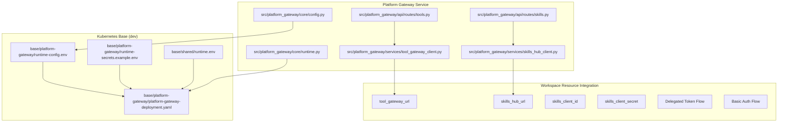
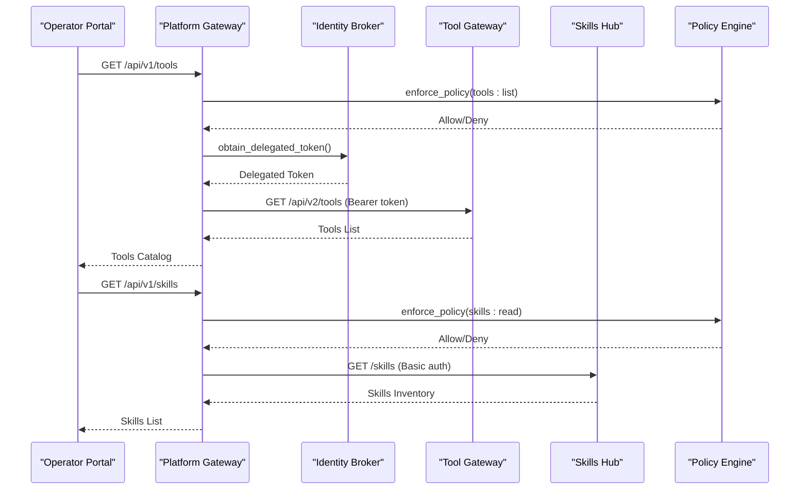
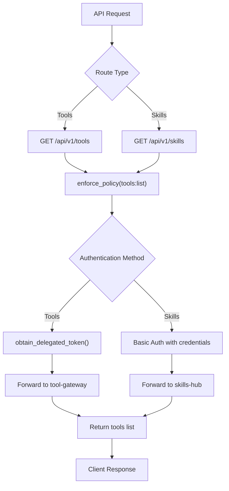
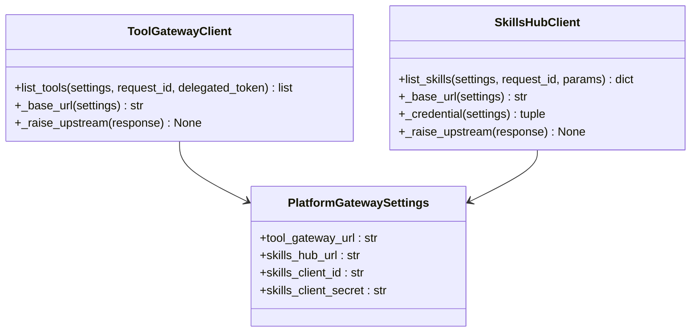
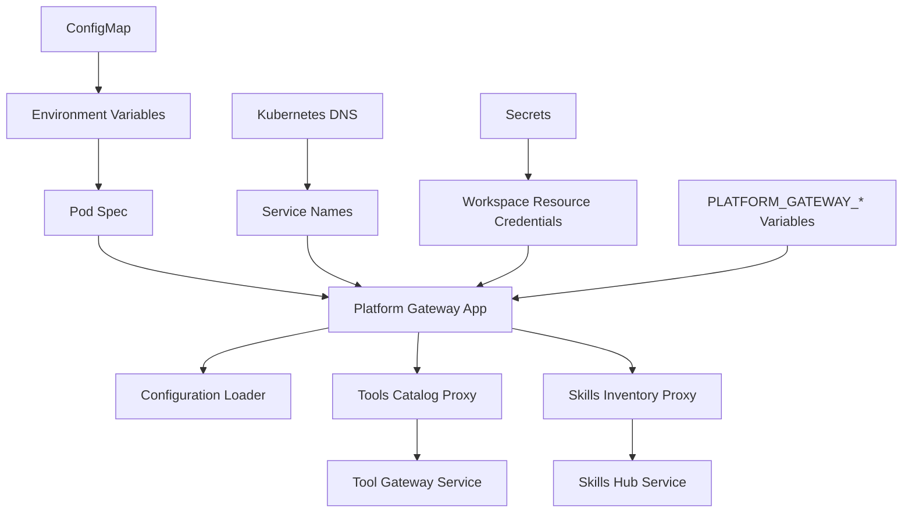
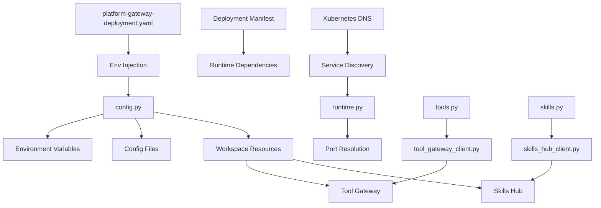

# Configuration and Environment Setup

<cite>
**Referenced Files in This Document**
- [config.py](file://products/platform-gateway/src/platform_gateway/core/config.py)
- [runtime.py](file://products/platform-gateway/src/platform_gateway/core/runtime.py)
- [tools.py](file://products/platform-gateway/src/platform_gateway/api/routes/tools.py)
- [skills.py](file://products/platform-gateway/src/platform_gateway/api/routes/skills.py)
- [tool_gateway_client.py](file://products/platform-gateway/src/platform_gateway/services/tool_gateway_client.py)
- [skills_hub_client.py](file://products/platform-gateway/src/platform_gateway/services/skills_hub_client.py)
- [platform-gateway-deployment.yaml](file://shared/platform-ops/gitops/dev-k8s/base/platform-gateway/platform-gateway-deployment.yaml)
- [runtime-config.env](file://shared/platform-ops/gitops/dev-k8s/base/platform-gateway/runtime-config.env)
- [runtime-secrets.example.env](file://shared/platform-ops/gitops/dev-k8s/base/platform-gateway/runtime-secrets.example.env)
- [spec.md](file://docs/specs/SPEC-019-portal-transparency-navigation/spec.md)
</cite>

## Update Summary
**Changes Made**
- Added comprehensive documentation for new platform-gateway workspace resource integration settings including tool_gateway_url, skills_hub_url, skills_client_id, and skills_client_secret
- Updated configuration reference to include workspace transparency proxy endpoints for tools catalog and skills inventory
- Enhanced deployment examples with workspace resource proxy configuration for development, staging, and production environments
- Added detailed security considerations for workspace resource authentication and authorization
- Updated troubleshooting guidance to cover workspace resource proxy connectivity and authentication issues

## Table of Contents
1. [Introduction](#introduction)
2. [Project Structure](#project-structure)
3. [Core Components](#core-components)
4. [Architecture Overview](#architecture-overview)
5. [Detailed Component Analysis](#detailed-component-analysis)
6. [Dependency Analysis](#dependency-analysis)
7. [Performance Considerations](#performance-considerations)
8. [Troubleshooting Guide](#troubleshooting-guide)
9. [Conclusion](#conclusion)
10. [Appendices](#appendices)

## Introduction
This document explains how the Platform Gateway Service manages configuration and environment setup across layers: environment variables, configuration files, and runtime overrides. It details available options, defaults, validation rules, and deployment-specific settings for development, staging, and production. It also provides examples for Docker and Kubernetes (ConfigMaps/Secrets), and outlines security best practices for secrets management and consistent configuration across environments.

**Updated** Enhanced documentation now includes comprehensive workspace resource integration capabilities through new platform-gateway configuration settings that enable read-only proxies for tools catalog and skills inventory, providing operators with self-service visibility into their workspace resources.

## Project Structure
The Platform Gateway Service is implemented under products/platform-gateway with its core configuration logic in the core module. Deployment manifests and environment templates are maintained under shared/platform-ops/gitops/dev-k8s/base/platform-gateway. The service includes workspace resource integration features that proxy requests to tool-gateway and skills-hub services for read-only inventory access.



**Diagram sources**
- [config.py](file://products/platform-gateway/src/platform_gateway/core/config.py)
- [runtime.py](file://products/platform-gateway/src/platform_gateway/core/runtime.py)
- [tools.py](file://products/platform-gateway/src/platform_gateway/api/routes/tools.py)
- [skills.py](file://products/platform-gateway/src/platform_gateway/api/routes/skills.py)
- [tool_gateway_client.py](file://products/platform-gateway/src/platform_gateway/services/tool_gateway_client.py)
- [skills_hub_client.py](file://products/platform-gateway/src/platform_gateway/services/skills_hub_client.py)
- [platform-gateway-deployment.yaml](file://shared/platform-ops/gitops/dev-k8s/base/platform-gateway/platform-gateway-deployment.yaml)
- [runtime-config.env](file://shared/platform-ops/gitops/dev-k8s/base/platform-gateway/runtime-config.env)
- [runtime-secrets.example.env](file://shared/platform-ops/gitops/dev-k8s/base/platform-gateway/runtime-secrets.example.env)

**Section sources**
- [config.py](file://products/platform-gateway/src/platform_gateway/core/config.py)
- [runtime.py](file://products/platform-gateway/src/platform_gateway/core/runtime.py)
- [tools.py](file://products/platform-gateway/src/platform_gateway/api/routes/tools.py)
- [skills.py](file://products/platform-gateway/src/platform_gateway/api/routes/skills.py)
- [tool_gateway_client.py](file://products/platform-gateway/src/platform_gateway/services/tool_gateway_client.py)
- [skills_hub_client.py](file://products/platform-gateway/src/platform_gateway/services/skills_hub_client.py)
- [platform-gateway-deployment.yaml](file://shared/platform-ops/gitops/dev-k8s/base/platform-gateway/platform-gateway-deployment.yaml)
- [runtime-config.env](file://shared/platform-ops/gitops/dev-k8s/base/platform-gateway/runtime-config.env)
- [runtime-secrets.example.env](file://shared/platform-ops/gitops/dev-k8s/base/platform-gateway/runtime-secrets.example.env)

## Core Components
- Configuration loader and model: centralizes environment variable parsing, file-based configuration, and runtime overrides; exposes validated configuration to the application.
- Runtime settings: handles service binding configuration with robust port resolution that ignores Kubernetes service-link formats.
- Workspace resource proxies: read-only proxy endpoints for tools catalog and skills inventory with appropriate authentication mechanisms.
- Policy engine configuration: loads default policy definitions from YAML and supports environment-driven overrides.
- Containerization and dependency management: Dockerfile defines runtime environment; pyproject.toml declares Python dependencies used by the gateway.

Key responsibilities:
- Provide a single source of truth for configuration via typed models.
- Enforce validation rules and provide clear error messages on misconfiguration.
- Support layered precedence: defaults < config files < environment variables < runtime overrides.
- Handle DNS-based service discovery with proper fallback mechanisms.
- Ignore Kubernetes service-link environment variables to prevent conflicts.
- Manage workspace resource integration with secure authentication and authorization.

**Updated** Enhanced core components to include comprehensive workspace resource integration capabilities with read-only proxies for tools catalog and skills inventory, supporting both delegated token flow for tools and Basic authentication for skills.

**Section sources**
- [config.py](file://products/platform-gateway/src/platform_gateway/core/config.py)
- [runtime.py](file://products/platform-gateway/src/platform_gateway/core/runtime.py)
- [tools.py](file://products/platform-gateway/src/platform_gateway/api/routes/tools.py)
- [skills.py](file://products/platform-gateway/src/platform_gateway/api/routes/skills.py)
- [tool_gateway_client.py](file://products/platform-gateway/src/platform_gateway/services/tool_gateway_client.py)
- [skills_hub_client.py](file://products/platform-gateway/src/platform_gateway/services/skills_hub_client.py)

## Architecture Overview
The configuration system follows a layered approach with enhanced workspace resource integration:
- Defaults: defined in code or default YAML policies.
- Config files: loaded from container filesystem or mounted volumes.
- Environment variables: injected at runtime via platform orchestration (e.g., Kubernetes).
- Runtime overrides: applied programmatically during startup or request processing.
- DNS-based service discovery: services communicate via Kubernetes DNS names instead of injected environment variables.
- Workspace resource proxies: read-only access to tools catalog and skills inventory with appropriate authentication.



**Diagram sources**
- [tools.py](file://products/platform-gateway/src/platform_gateway/api/routes/tools.py)
- [skills.py](file://products/platform-gateway/src/platform_gateway/api/routes/skills.py)
- [tool_gateway_client.py](file://products/platform-gateway/src/platform_gateway/services/tool_gateway_client.py)
- [skills_hub_client.py](file://products/platform-gateway/src/platform_gateway/services/skills_hub_client.py)
- [spec.md](file://docs/specs/SPEC-019-portal-transparency-navigation/spec.md)

## Detailed Component Analysis

### Configuration Loader and Model
- Purpose: Parse and validate configuration from multiple layers and expose it consistently.
- Precedence: Defaults < Config files < Environment variables < Runtime overrides.
- Validation: Type checks, required fields, range constraints, and cross-field validations.
- Error handling: Aggregates validation errors and surfaces actionable messages.
- Service discovery: Uses DNS-based resolution for inter-service communication.

**Updated** Enhanced to support workspace resource integration with new configuration fields for tool_gateway_url, skills_hub_url, skills_client_id, and skills_client_secret, enabling read-only proxies for tools catalog and skills inventory.


**Diagram sources**
- [config.py](file://products/platform-gateway/src/platform_gateway/core/config.py)

**Section sources**
- [config.py](file://products/platform-gateway/src/platform_gateway/core/config.py)

### Workspace Resource Proxy Routes
- Purpose: Provide read-only access to workspace resources (tools catalog and skills inventory) through the platform gateway.
- Tools proxy: `GET /api/v1/tools` enforces `tools:list` policy action and proxies to tool-gateway with delegated token.
- Skills proxy: `GET /api/v1/skills` enforces `skills:read` policy action and proxies to skills-hub with Basic authentication.
- Error handling: Returns 503 when services not configured, 502 on upstream failures, passes through 4xx client errors.

**New Section** Comprehensive workspace resource proxy implementation with appropriate authentication mechanisms and error handling.



**Diagram sources**
- [tools.py](file://products/platform-gateway/src/platform_gateway/api/routes/tools.py)
- [skills.py](file://products/platform-gateway/src/platform_gateway/api/routes/skills.py)

**Section sources**
- [tools.py](file://products/platform-gateway/src/platform_gateway/api/routes/tools.py)
- [skills.py](file://products/platform-gateway/src/platform_gateway/api/routes/skills.py)

### Workspace Resource Clients
- Purpose: Handle HTTP communication with downstream workspace resource services.
- Tool gateway client: Forwards delegated tokens obtained through identity broker exchange.
- Skills hub client: Uses Basic authentication with configured client credentials.
- Error mapping: Consistent error handling with 503 for unconfigured services, 502 for upstream failures, 4xx passthrough for client errors.

**New Section** Dedicated client implementations for workspace resource integration with appropriate authentication and error handling patterns.



**Diagram sources**
- [tool_gateway_client.py](file://products/platform-gateway/src/platform_gateway/services/tool_gateway_client.py)
- [skills_hub_client.py](file://products/platform-gateway/src/platform_gateway/services/skills_hub_client.py)
- [config.py](file://products/platform-gateway/src/platform_gateway/core/config.py)

**Section sources**
- [tool_gateway_client.py](file://products/platform-gateway/src/platform_gateway/services/tool_gateway_client.py)
- [skills_hub_client.py](file://products/platform-gateway/src/platform_gateway/services/skills_hub_client.py)

### Runtime Settings and Port Resolution
- Purpose: Handle service binding configuration with robust port resolution.
- Port resolution: Ignores Kubernetes service-link format (`tcp://IP:PORT`) and extracts numeric ports.
- Default behavior: Falls back to default host and port when environment variables are not set.
- Development safety: Prevents conflicts between manual configuration and automatic service-link injection.

**Section sources**
- [runtime.py](file://products/platform-gateway/src/platform_gateway/core/runtime.py)

### DNS-Based Service Discovery
- Purpose: Enable reliable inter-service communication using Kubernetes DNS names.
- Configuration: Service endpoints configured via environment variables pointing to DNS names.
- Benefits: Eliminates service-link conflicts, improves reliability, and simplifies configuration.
- Implementation: Services resolve DNS names like `identity-service` to their cluster IPs.

**Section sources**
- [runtime-config.env](file://shared/platform-ops/gitops/dev-k8s/base/platform-gateway/runtime-config.env)
- [platform-gateway-deployment.yaml](file://shared/platform-ops/gitops/dev-k8s/base/platform-gateway/platform-gateway-deployment.yaml)

### Policy Engine Configuration
- Default policy: Loaded from a YAML file defining baseline rules and behaviors.
- Overrides: Can be adjusted via environment variables or mounted config files depending on implementation.
- Usage: Provides decision context for tool invocation, access control, and rate limiting.

**Section sources**
- [spec.md](file://docs/specs/SPEC-019-portal-transparency-navigation/spec.md)

### Docker Configuration
- Image build: Defines base image, working directory, and dependency installation.
- Entrypoint: Runs the Platform Gateway Service with environment variables passed through.
- Best practices: Use multi-stage builds, pin versions, minimize attack surface.

**Section sources**
- [platform-gateway-deployment.yaml](file://shared/platform-ops/gitops/dev-k8s/base/platform-gateway/platform-gateway-deployment.yaml)

### Kubernetes Deployment and ConfigMaps
- Deployment manifest: Mounts environment variables and config files into the pod.
- ConfigMap: Holds non-sensitive configuration values including service endpoints.
- Service discovery: Uses DNS names for inter-service communication.
- Environment injection: Maps ConfigMap entries to environment variables consumed by the configuration loader.
- Secrets management: Handles sensitive data like workspace resource credentials separately from ConfigMaps.

**Updated** Enhanced deployment configuration with workspace resource integration, including tool gateway URL, skills hub URL, and skills client credentials for read-only workspace resource access.



**Diagram sources**
- [platform-gateway-deployment.yaml](file://shared/platform-ops/gitops/dev-k8s/base/platform-gateway/platform-gateway-deployment.yaml)
- [runtime-config.env](file://shared/platform-ops/gitops/dev-k8s/base/platform-gateway/runtime-config.env)
- [runtime-secrets.example.env](file://shared/platform-ops/gitops/dev-k8s/base/platform-gateway/runtime-secrets.example.env)

**Section sources**
- [platform-gateway-deployment.yaml](file://shared/platform-ops/gitops/dev-k8s/base/platform-gateway/platform-gateway-deployment.yaml)
- [runtime-config.env](file://shared/platform-ops/gitops/dev-k8s/base/platform-gateway/runtime-config.env)
- [runtime-secrets.example.env](file://shared/platform-ops/gitops/dev-k8s/base/platform-gateway/runtime-secrets.example.env)

## Dependency Analysis
Configuration components depend on environment variables and files, while the runtime settings handle DNS-based service discovery. The Docker image encapsulates runtime dependencies, and Kubernetes manifests inject configuration at deployment time. Workspace resource integration adds dependencies on tool-gateway and skills-hub services with appropriate authentication mechanisms.

**Updated** Added dependencies for workspace resource integration including tool-gateway delegation flow and skills-hub Basic authentication, with proper error handling and service discovery.



**Diagram sources**
- [config.py](file://products/platform-gateway/src/platform_gateway/core/config.py)
- [runtime.py](file://products/platform-gateway/src/platform_gateway/core/runtime.py)
- [tools.py](file://products/platform-gateway/src/platform_gateway/api/routes/tools.py)
- [skills.py](file://products/platform-gateway/src/platform_gateway/api/routes/skills.py)
- [tool_gateway_client.py](file://products/platform-gateway/src/platform_gateway/services/tool_gateway_client.py)
- [skills_hub_client.py](file://products/platform-gateway/src/platform_gateway/services/skills_hub_client.py)
- [platform-gateway-deployment.yaml](file://shared/platform-ops/gitops/dev-k8s/base/platform-gateway/platform-gateway-deployment.yaml)

**Section sources**
- [config.py](file://products/platform-gateway/src/platform_gateway/core/config.py)
- [runtime.py](file://products/platform-gateway/src/platform_gateway/core/runtime.py)
- [tools.py](file://products/platform-gateway/src/platform_gateway/api/routes/tools.py)
- [skills.py](file://products/platform-gateway/src/platform_gateway/api/routes/skills.py)
- [tool_gateway_client.py](file://products/platform-gateway/src/platform_gateway/services/tool_gateway_client.py)
- [skills_hub_client.py](file://products/platform-gateway/src/platform_gateway/services/skills_hub_client.py)
- [platform-gateway-deployment.yaml](file://shared/platform-ops/gitops/dev-k8s/base/platform-gateway/platform-gateway-deployment.yaml)

## Performance Considerations
- Minimize configuration lookups by caching validated configuration at startup.
- Avoid heavy I/O during request processing; pre-load policies and dependencies.
- Use efficient serialization formats for configuration files where applicable.
- Monitor configuration-related metrics and errors to detect misconfigurations early.
- Leverage Kubernetes DNS caching for improved service discovery performance.
- Optimize port resolution to avoid unnecessary string parsing operations.
- Workspace resource proxies use timeout-based connections to prevent hanging requests.
- Delegated token acquisition is cached where possible to reduce identity broker load.
- Skills hub requests use connection pooling for improved performance.
- Monitor workspace resource proxy latency and error rates for capacity planning.

## Troubleshooting Guide
Common issues and resolutions:
- Missing environment variables: Ensure all required variables are set in the deployment manifest or environment.
- Invalid configuration values: Check types, ranges, and cross-field constraints; review validation error messages.
- Policy loading failures: Verify YAML syntax and structure; ensure paths are correct and accessible.
- Secrets not mounted: Confirm Secret objects exist and are referenced correctly in the deployment.
- DNS resolution failures: Verify service names match Kubernetes Service resources and check network policies.
- Service link conflicts: Ensure `enableServiceLinks: false` is set in all deployment manifests.
- Port resolution issues: Check that port values are numeric and not in Kubernetes service-link format.
- Inter-service communication failures: Verify DNS names are resolvable and services are running.
- **New**: Workspace resource proxy failures: Check tool_gateway_url and skills_hub_url configuration; verify downstream services are running.
- **New**: Tools catalog proxy issues: Verify delegated token acquisition works; check identity broker configuration and permissions.
- **New**: Skills inventory proxy issues: Verify skills_client_id and skills_client_secret are properly configured; check skills-hub authentication.
- **New**: Workspace resource 503 errors: Indicates workspace resource services are not configured; verify PLATFORM_GATEWAY_TOOL_GATEWAY_URL and PLATFORM_GATEWAY_SKILLS_HUB_URL.
- **New**: Workspace resource 502 errors: Indicates upstream service failures; check tool-gateway and skills-hub service health and connectivity.
- **New**: Workspace resource 4xx errors: Indicates client-side issues; verify delegated token validity and skills authentication credentials.

**Updated** Added troubleshooting guidance for workspace resource integration including proxy configuration, authentication issues, and downstream service connectivity problems.

**Section sources**
- [config.py](file://products/platform-gateway/src/platform_gateway/core/config.py)
- [runtime.py](file://products/platform-gateway/src/platform_gateway/core/runtime.py)
- [tools.py](file://products/platform-gateway/src/platform_gateway/api/routes/tools.py)
- [skills.py](file://products/platform-gateway/src/platform_gateway/api/routes/skills.py)
- [tool_gateway_client.py](file://products/platform-gateway/src/platform_gateway/services/tool_gateway_client.py)
- [skills_hub_client.py](file://products/platform-gateway/src/platform_gateway/services/skills_hub_client.py)
- [platform-gateway-deployment.yaml](file://shared/platform-ops/gitops/dev-k8s/base/platform-gateway/platform-gateway-deployment.yaml)

## Conclusion
The Platform Gateway Service employs a robust, layered configuration system that integrates environment variables, configuration files, and runtime overrides with strict validation. By following the outlined best practices for Docker and Kubernetes deployments, teams can maintain secure, consistent configurations across environments while ensuring reliability and performance. The architectural shift to DNS-based service discovery eliminates service-link conflicts and provides more reliable inter-service communication patterns. The addition of workspace resource integration enables operators to gain self-service visibility into their workspace resources through read-only proxies for tools catalog and skills inventory, enhancing operational transparency and reducing dependency on agent-mediated resource discovery.

**Updated** Enhanced conclusion reflecting the architectural improvements in service discovery, environment variable handling, and comprehensive workspace resource integration capabilities that provide operators with direct visibility into their workspace resources.

## Appendices

### Environment-Specific Settings
- Development: Enable verbose logging, relaxed validation, local secrets, optional redaction disablement, memory-based storage, local git sources without authentication, enable workspace resource proxies with local tool-gateway and skills-hub instances.
- Staging: Mirror production settings with test data and limited scope, enable full redaction, PostgreSQL-backed storage, private repository access with test tokens, configure workspace resource proxies with staging backend services.
- Production: Strict validation, minimal logging, centralized secret management, mandatory workload identity, optimized sync intervals, secure private repository authentication, configure workspace resource proxies with production backend services and proper authentication.

**Updated** Added guidance for workspace resource proxy configuration across environments, including tool gateway URL, skills hub URL, and skills client credentials for read-only workspace resource access.

### Security and Secrets Management
- Store secrets in Kubernetes Secrets or external vaults; never hardcode.
- Rotate secrets regularly and audit access logs.
- Use least privilege principles for service accounts and RBAC.
- Prefer workload identity over static credentials in production environments.
- Configure appropriate redaction sensitivity levels based on data classification.
- Monitor redaction metrics and workload identity authentication attempts.
- Use DNS-based service discovery to avoid exposing service endpoints in environment variables.
- Disable service links to prevent accidental exposure of internal service information.
- **New**: Secure workspace resource credentials using Kubernetes Secrets; never commit PLATFORM_GATEWAY_SKILLS_CLIENT_SECRET to version control.
- **New**: Validate delegated token acquisition for tools catalog access; ensure proper identity broker configuration.
- **New**: Monitor workspace resource proxy authentication attempts and failed authentication attempts.
- **New**: Implement rate limiting for workspace resource proxy endpoints to prevent abuse.
- **New**: Audit workspace resource access patterns for security monitoring and compliance.

**Updated** Enhanced security guidance with workspace resource integration security considerations, including credential management, authentication monitoring, and access pattern auditing.

### Complete Environment Variables Reference
**Updated** Comprehensive reference including workspace resource integration variables for tools catalog and skills inventory access.

#### Core Configuration
- `AGENT_SERVICE_URL`: Agent service endpoint URL (DNS-based)
- `IDENTITY_SERVICE_URL`: Identity broker service endpoint URL (DNS-based)
- `IDENTITY_JWKS_URL`: Identity service JWKS endpoint
- `IDENTITY_JWKS_CACHE_SECONDS`: JWCS cache duration (default: 300)
- `IDENTITY_TOKEN_ISSUER`: JWT issuer claim (default: "luban-identity-broker")
- `PLATFORM_GATEWAY_TOKEN_AUDIENCE`: Token audience (default: "platform-gateway")
- `PLATFORM_GATEWAY_DELEGATION_AUDIENCE`: Delegation audience (default: "tool-gateway")

#### Runtime Configuration
- `PLATFORM_GATEWAY_HOST`: Service bind host (default: 0.0.0.0)
- `PLATFORM_GATEWAY_PORT`: Service bind port (numeric only, service-link format ignored)

#### Operational Configuration
- `PLATFORM_GATEWAY_REQUIRE_AUTH`: Require authentication (default: true)
- `PLATFORM_GATEWAY_POLICY_PATH`: Policy file path
- `CHAT_RESPONSE_TIMEOUT_SECONDS`: Chat response timeout (default: 30)

#### Workspace Resource Integration
- `PLATFORM_GATEWAY_TOOL_GATEWAY_URL`: Tool gateway URL for tools catalog proxy (e.g., http://tool-gateway:8000)
- `PLATFORM_GATEWAY_SKILLS_HUB_URL`: Skills hub URL for skills inventory proxy (e.g., http://skills-hub:8000)
- `PLATFORM_GATEWAY_SKILLS_CLIENT_ID`: Skills hub client ID for Basic authentication (default: "platform-gateway")
- `PLATFORM_GATEWAY_SKILLS_CLIENT_SECRET`: Skills hub client secret for Basic authentication (stored in secrets)

#### Audit and Incident Services
- `PLATFORM_GATEWAY_AUDIT_SERVICE_URL`: Audit service URL for durable audit trail
- `PLATFORM_GATEWAY_AUDIT_CLIENT_ID`: Audit service client ID (default: "platform-gateway")
- `PLATFORM_GATEWAY_AUDIT_CLIENT_SECRET`: Audit service client secret (stored in secrets)
- `PLATFORM_GATEWAY_INCIDENT_SERVICE_URL`: Incident service URL for incident triage
- `PLATFORM_GATEWAY_INCIDENT_CLIENT_ID`: Incident service client ID (default: "platform-gateway")
- `PLATFORM_GATEWAY_INCIDENT_CLIENT_SECRET`: Incident service client secret (stored in secrets)
- `PLATFORM_GATEWAY_INCIDENT_TRIAGE_TIMEOUT_SECONDS`: Incident triage timeout (default: 120)

**Section sources**
- [config.py](file://products/platform-gateway/src/platform_gateway/core/config.py)
- [runtime.py](file://products/platform-gateway/src/platform_gateway/core/runtime.py)
- [runtime-config.env](file://shared/platform-ops/gitops/dev-k8s/base/platform-gateway/runtime-config.env)
- [runtime-secrets.example.env](file://shared/platform-ops/gitops/dev-k8s/base/platform-gateway/runtime-secrets.example.env)

### Workspace Resource Integration Guide
**New Section** Step-by-step guide for configuring workspace resource integration with tools catalog and skills inventory proxies.

#### Prerequisites
- Tool-gateway service deployed and accessible
- Skills-hub service deployed and accessible
- Identity broker configured for delegated token exchange
- Skills-hub configured with query clients registry
- Proper network policies allowing platform-gateway to reach workspace resources

#### Configuration Steps
1. Set `PLATFORM_GATEWAY_TOOL_GATEWAY_URL` to point to tool-gateway service
2. Set `PLATFORM_GATEWAY_SKILLS_HUB_URL` to point to skills-hub service
3. Configure `PLATFORM_GATEWAY_SKILLS_CLIENT_ID` and `PLATFORM_GATEWAY_SKILLS_CLIENT_SECRET` in secrets
4. Deploy with proper secret mounting for workspace resource credentials
5. Verify workspace resource proxies by accessing `/api/v1/tools` and `/api/v1/skills`

#### Example Configuration
```yaml
apiVersion: v1
kind: ConfigMap
metadata:
  name: platform-runtime-config
data:
  PLATFORM_GATEWAY_TOOL_GATEWAY_URL: "http://tool-gateway:8000"
  PLATFORM_GATEWAY_SKILLS_HUB_URL: "http://skills-hub:8000"
  PLATFORM_GATEWAY_SKILLS_CLIENT_ID: "platform-gateway"
---
apiVersion: v1
kind: Secret
metadata:
  name: platform-gateway-runtime-secrets
type: Opaque
stringData:
  PLATFORM_GATEWAY_SKILLS_CLIENT_SECRET: "your-skills-client-secret"
```

#### Authentication Flow
- Tools catalog: Uses delegated token flow through identity broker exchange
- Skills inventory: Uses Basic authentication with configured client credentials
- Both proxies enforce appropriate policy actions before forwarding requests

**Section sources**
- [runtime-config.env](file://shared/platform-ops/gitops/dev-k8s/base/platform-gateway/runtime-config.env)
- [runtime-secrets.example.env](file://shared/platform-ops/gitops/dev-k8s/base/platform-gateway/runtime-secrets.example.env)
- [tools.py](file://products/platform-gateway/src/platform_gateway/api/routes/tools.py)
- [skills.py](file://products/platform-gateway/src/platform_gateway/api/routes/skills.py)

### Workspace Resource Troubleshooting Guide
**New Section** Comprehensive troubleshooting guide for workspace resource integration configuration and connectivity issues.

#### Common Issues and Solutions
- **Workspace resource 503 errors**: Indicates workspace resource services are not configured; verify PLATFORM_GATEWAY_TOOL_GATEWAY_URL and PLATFORM_GATEWAY_SKILLS_HUB_URL are set correctly
- **Tools catalog 502 errors**: Indicates tool-gateway connectivity issues; check tool-gateway service health and network policies
- **Skills inventory 401 errors**: Indicates skills authentication failures; verify PLATFORM_GATEWAY_SKILLS_CLIENT_SECRET matches skills-hub configuration
- **Delegated token acquisition failures**: Check identity broker configuration and permissions for platform-gateway service
- **High latency on workspace resource requests**: Monitor downstream service performance and consider increasing timeouts if needed

#### Monitoring and Diagnostics
- Check platform-gateway logs for workspace resource proxy errors
- Monitor delegated token acquisition success rates
- Track skills authentication attempt success/failure ratios
- Verify workspace resource proxy endpoint availability and response times

**Section sources**
- [tool_gateway_client.py](file://products/platform-gateway/src/platform_gateway/services/tool_gateway_client.py)
- [skills_hub_client.py](file://products/platform-gateway/src/platform_gateway/services/skills_hub_client.py)
- [tools.py](file://products/platform-gateway/src/platform_gateway/api/routes/tools.py)
- [skills.py](file://products/platform-gateway/src/platform_gateway/api/routes/skills.py)