# Gateway Architecture and Request Flow

<cite>
**Referenced Files in This Document**
- [main.py](file://products/tool-gateway/src/api_gateway/main.py)
- [app.py](file://products/tool-gateway/src/api_gateway/app.py)
- [router.py](file://products/tool-gateway/src/api_gateway/api/router.py)
- [routes/chat.py](file://products/tool-gateway/src/api_gateway/api/routes/chat.py)
- [routes/tools.py](file://products/tool-gateway/src/api_gateway/api/routes/tools.py)
- [routes/auth.py](file://products/tool-gateway/src/api_gateway/api/routes/auth.py)
- [routes/identity.py](file://products/tool-gateway/src/api_gateway/api/routes/identity.py)
- [routes/sessions.py](file://products/tool-gateway/src/api_gateway/api/routes/sessions.py)
- [routes/runtime.py](file://products/tool-gateway/src/api_gateway/api/routes/runtime.py)
- [routes/health.py](file://products/tool-gateway/src/api_gateway/api/routes/health.py)
- [dependencies.py](file://products/tool-gateway/src/api_gateway/core/dependencies.py)
- [config.py](file://products/tool-gateway/src/api_gateway/core/config.py)
- [observability.py](file://products/tool-gateway/src/api_gateway/core/observability.py)
- [metrics.py](file://products/tool-gateway/src/api_gateway/core/metrics.py)
- [telemetry.py](file://products/tool-gateway/src/api_gateway/core/telemetry.py)
- [request_context.py](file://products/tool-gateway/src/api_gateway/core/request_context.py)
- [runtime.py](file://products/tool-gateway/src/api_gateway/core/runtime.py)
- [gateway_service.py](file://products/tool-gateway/src/api_gateway/services/gateway_service.py)
- [policy_engine.py](file://products/tool-gateway/src/api_gateway/services/policy_engine.py)
- [token_verifier.py](file://products/tool-gateway/src/api_gateway/services/token_verifier.py)
- [agent_client.py](file://products/tool-gateway/src/api_gateway/services/agent_client.py)
- [delegation_client.py](file://products/tool-gateway/src/api_gateway/services/delegation_client.py)
- [registry.py](file://products/tool-gateway/src/api_gateway/tools/registry.py)
- [base.py](file://products/tool-gateway/src/api_gateway/tools/base.py)
- [k8s_connector.py](file://products/tool-gateway/src/api_gateway/tools/k8s_connector.py)
- [api.py](file://products/tool-gateway/src/api_gateway/schemas/api.py)
- [policy-default.yaml](file://products/tool-gateway/src/api_gateway/policies/policy-default.yaml)
</cite>

## Update Summary
**Changes Made**
- Added delegation client implementation for token exchange operations
- Enhanced token verification with audience claim validation
- Implemented metrics tracking for delegation_exchange_total and delegation_cache_total operations
- Updated architecture diagrams to reflect new delegation flow
- Expanded service orchestration section to include delegation client integration

## Table of Contents
1. [Introduction](#introduction)
2. [Project Structure](#project-structure)
3. [Core Components](#core-components)
4. [Architecture Overview](#architecture-overview)
5. [Detailed Component Analysis](#detailed-component-analysis)
6. [Delegation Client Implementation](#delegation-client-implementation)
7. [Enhanced Token Verification](#enhanced-token-verification)
8. [Metrics and Observability](#metrics-and-observability)
9. [Dependency Analysis](#dependency-analysis)
10. [Performance Considerations](#performance-considerations)
11. [Troubleshooting Guide](#troubleshooting-guide)
12. [Conclusion](#conclusion)

## Introduction
This document explains the Tool Gateway Service architecture and request flow patterns. The gateway acts as a centralized API entry point that authenticates requests, enforces policies, routes to downstream services or tools, and returns standardized responses. It is implemented with FastAPI and uses dependency injection for configuration, observability, policy enforcement, token verification, and tool execution. **Updated** The architecture now includes enhanced delegation capabilities for secure token exchange operations and improved metrics tracking for operational visibility.

## Project Structure
The Tool Gateway service is organized into clear layers:
- Entry points: application bootstrap and router registration
- API layer: HTTP routes grouped by domain (chat, tools, auth, identity, sessions, runtime, health)
- Core: configuration, dependency wiring, observability, metrics, telemetry, request context, runtime settings
- Services: orchestration logic including gateway orchestration, policy engine, token verification, agent client, and delegation client
- Tools: tool registry, base abstractions, and concrete connectors (e.g., Kubernetes connector)
- Schemas: shared request/response models
- Policies: default policy definitions

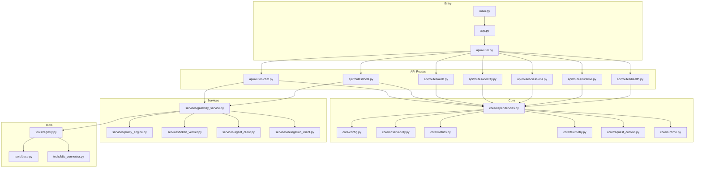

**Diagram sources**
- [main.py](file://products/tool-gateway/src/api_gateway/main.py)
- [app.py](file://products/tool-gateway/src/api_gateway/app.py)
- [router.py](file://products/tool-gateway/src/api_gateway/api/router.py)
- [routes/chat.py](file://products/tool-gateway/src/api_gateway/api/routes/chat.py)
- [routes/tools.py](file://products/tool-gateway/src/api_gateway/api/routes/tools.py)
- [routes/auth.py](file://products/tool-gateway/src/api_gateway/api/routes/auth.py)
- [routes/identity.py](file://products/tool-gateway/src/api_gateway/api/routes/identity.py)
- [routes/sessions.py](file://products/tool-gateway/src/api_gateway/api/routes/sessions.py)
- [routes/runtime.py](file://products/tool-gateway/src/api_gateway/api/routes/runtime.py)
- [routes/health.py](file://products/tool-gateway/src/api_gateway/api/routes/health.py)
- [dependencies.py](file://products/tool-gateway/src/api_gateway/core/dependencies.py)
- [config.py](file://products/tool-gateway/src/api_gateway/core/config.py)
- [observability.py](file://products/tool-gateway/src/api_gateway/core/observability.py)
- [metrics.py](file://products/tool-gateway/src/api_gateway/core/metrics.py)
- [telemetry.py](file://products/tool-gateway/src/api_gateway/core/telemetry.py)
- [request_context.py](file://products/tool-gateway/src/api_gateway/core/request_context.py)
- [runtime.py](file://products/tool-gateway/src/api_gateway/core/runtime.py)
- [gateway_service.py](file://products/tool-gateway/src/api_gateway/services/gateway_service.py)
- [policy_engine.py](file://products/tool-gateway/src/api_gateway/services/policy_engine.py)
- [token_verifier.py](file://products/tool-gateway/src/api_gateway/services/token_verifier.py)
- [agent_client.py](file://products/tool-gateway/src/api_gateway/services/agent_client.py)
- [delegation_client.py](file://products/tool-gateway/src/api_gateway/services/delegation_client.py)
- [registry.py](file://products/tool-gateway/src/api_gateway/tools/registry.py)
- [base.py](file://products/tool-gateway/src/api_gateway/tools/base.py)
- [k8s_connector.py](file://products/tool-gateway/src/api_gateway/tools/k8s_connector.py)

**Section sources**
- [main.py](file://products/tool-gateway/src/api_gateway/main.py)
- [app.py](file://products/tool-gateway/src/api_gateway/app.py)
- [router.py](file://products/tool-gateway/src/api_gateway/api/router.py)

## Core Components
- FastAPI Application: Bootstraps middleware, lifespan events, and global state.
- Router: Mounts domain-specific route modules under versioned prefixes.
- Dependencies: Centralized dependency providers for config, observability, metrics, telemetry, request context, and runtime settings.
- Services:
  - GatewayService: Orchestrates request lifecycle, policy checks, token validation, and tool invocation.
  - PolicyEngine: Loads and evaluates policies against incoming requests.
  - TokenVerifier: Validates tokens and extracts identity context with enhanced audience claim validation.
  - AgentClient: Communicates with downstream agent services when needed.
  - DelegationClient: Handles secure token exchange operations with caching and metrics tracking.
- Tools:
  - Registry: Discovers and manages tool implementations.
  - Base: Abstract interface for tools.
  - K8sConnector: Concrete tool for Kubernetes operations.
- Schemas: Pydantic models for request/response contracts.
- Policies: Default YAML policy definitions used by the policy engine.

Key responsibilities:
- Centralized authentication and authorization via token verification and policy evaluation.
- Consistent request context propagation across layers.
- Observability hooks for tracing, metrics, and structured logging.
- Extensible tool execution framework with pluggable connectors.
- Secure delegation capabilities for cross-service token exchange.

**Section sources**
- [dependencies.py](file://products/tool-gateway/src/api_gateway/core/dependencies.py)
- [gateway_service.py](file://products/tool-gateway/src/api_gateway/services/gateway_service.py)
- [policy_engine.py](file://products/tool-gateway/src/api_gateway/services/policy_engine.py)
- [token_verifier.py](file://products/tool-gateway/src/api_gateway/services/token_verifier.py)
- [agent_client.py](file://products/tool-gateway/src/api_gateway/services/agent_client.py)
- [delegation_client.py](file://products/tool-gateway/src/api_gateway/services/delegation_client.py)
- [registry.py](file://products/tool-gateway/src/api_gateway/tools/registry.py)
- [base.py](file://products/tool-gateway/src/api_gateway/tools/base.py)
- [k8s_connector.py](file://products/tool-gateway/src/api_gateway/tools/k8s_connector.py)
- [api.py](file://products/tool-gateway/src/api_gateway/schemas/api.py)
- [policy-default.yaml](file://products/tool-gateway/src/api_gateway/policies/policy-default.yaml)

## Architecture Overview
The gateway exposes REST endpoints through FastAPI routers. Each request flows through:
- Middleware stack (auth, observability, metrics, request context)
- Route handler (domain-specific logic)
- Dependency-injected services (policy, token verification, gateway orchestration, delegation)
- Tool registry and concrete tool execution
- Response generation with consistent schemas and observability data

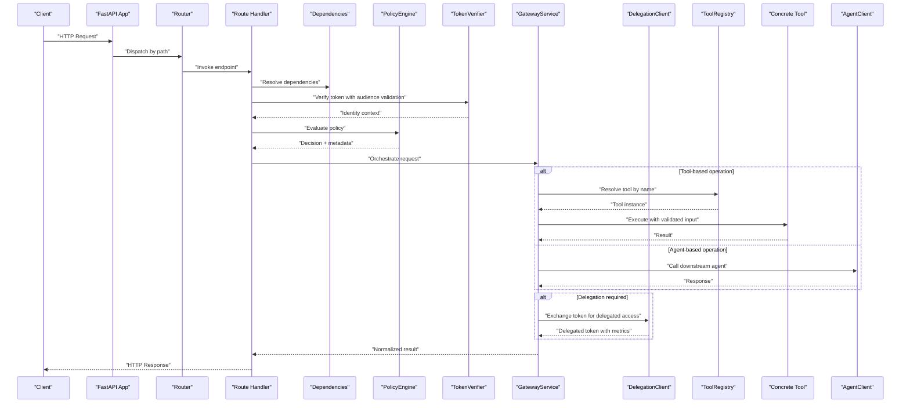

**Diagram sources**
- [app.py](file://products/tool-gateway/src/api_gateway/app.py)
- [router.py](file://products/tool-gateway/src/api_gateway/api/router.py)
- [routes/chat.py](file://products/tool-gateway/src/api_gateway/api/routes/chat.py)
- [routes/tools.py](file://products/tool-gateway/src/api_gateway/api/routes/tools.py)
- [routes/auth.py](file://products/tool-gateway/src/api_gateway/api/routes/auth.py)
- [routes/identity.py](file://products/tool-gateway/src/api_gateway/api/routes/identity.py)
- [routes/sessions.py](file://products/tool-gateway/src/api_gateway/api/routes/sessions.py)
- [routes/runtime.py](file://products/tool-gateway/src/api_gateway/api/routes/runtime.py)
- [routes/health.py](file://products/tool-gateway/src/api_gateway/api/routes/health.py)
- [dependencies.py](file://products/tool-gateway/src/api_gateway/core/dependencies.py)
- [policy_engine.py](file://products/tool-gateway/src/api_gateway/services/policy_engine.py)
- [token_verifier.py](file://products/tool-gateway/src/api_gateway/services/token_verifier.py)
- [gateway_service.py](file://products/tool-gateway/src/api_gateway/services/gateway_service.py)
- [delegation_client.py](file://products/tool-gateway/src/api_gateway/services/delegation_client.py)
- [registry.py](file://products/tool-gateway/src/api_gateway/tools/registry.py)
- [base.py](file://products/tool-gateway/src/api_gateway/tools/base.py)
- [k8s_connector.py](file://products/tool-gateway/src/api_gateway/tools/k8s_connector.py)
- [agent_client.py](file://products/tool-gateway/src/api_gateway/services/agent_client.py)

## Detailed Component Analysis

### FastAPI Application Setup and Middleware Stack
- Application initialization includes lifespan management, CORS, and global state setup.
- Middleware order ensures security and observability are applied before routing.
- Request context is attached early to propagate identity and correlation IDs.

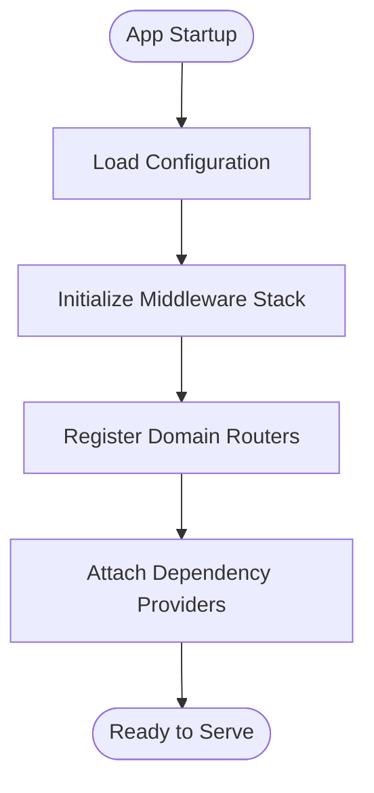

**Diagram sources**
- [app.py](file://products/tool-gateway/src/api_gateway/app.py)
- [dependencies.py](file://products/tool-gateway/src/api_gateway/core/dependencies.py)

**Section sources**
- [app.py](file://products/tool-gateway/src/api_gateway/app.py)
- [dependencies.py](file://products/tool-gateway/src/api_gateway/core/dependencies.py)

### Router and Request Routing Mechanisms
- The router mounts domain-specific route modules under versioned prefixes.
- Each route module defines endpoints for its domain (chat, tools, auth, identity, sessions, runtime, health).
- Path-based dispatching maps incoming requests to handlers with typed parameters and response models.

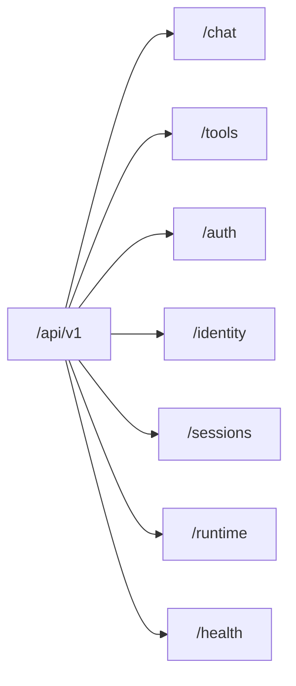

**Diagram sources**
- [router.py](file://products/tool-gateway/src/api_gateway/api/router.py)
- [routes/chat.py](file://products/tool-gateway/src/api_gateway/api/routes/chat.py)
- [routes/tools.py](file://products/tool-gateway/src/api_gateway/api/routes/tools.py)
- [routes/auth.py](file://products/tool-gateway/src/api_gateway/api/routes/auth.py)
- [routes/identity.py](file://products/tool-gateway/src/api_gateway/api/routes/identity.py)
- [routes/sessions.py](file://products/tool-gateway/src/api_gateway/api/routes/sessions.py)
- [routes/runtime.py](file://products/tool-gateway/src/api_gateway/api/routes/runtime.py)
- [routes/health.py](file://products/tool-gateway/src/api_gateway/api/routes/health.py)

**Section sources**
- [router.py](file://products/tool-gateway/src/api_gateway/api/router.py)
- [routes/chat.py](file://products/tool-gateway/src/api_gateway/api/routes/chat.py)
- [routes/tools.py](file://products/tool-gateway/src/api_gateway/api/routes/tools.py)
- [routes/auth.py](file://products/tool-gateway/src/api_gateway/api/routes/auth.py)
- [routes/identity.py](file://products/tool-gateway/src/api_gateway/api/routes/identity.py)
- [routes/sessions.py](file://products/tool-gateway/src/api_gateway/api/routes/sessions.py)
- [routes/runtime.py](file://products/tool-gateway/src/api_gateway/api/routes/runtime.py)
- [routes/health.py](file://products/tool-gateway/src/api_gateway/api/routes/health.py)

### Request Lifecycle: From Incoming HTTP to Tool Execution
- Authentication: Token verification extracts identity context with enhanced audience claim validation.
- Policy Enforcement: Policy engine evaluates rules against request attributes.
- Orchestration: Gateway service coordinates tool resolution, execution, and delegation operations.
- Tool Execution: Registry resolves tool by name; concrete tool executes operation.
- Response Generation: Normalized response model with observability metadata and metrics tracking.

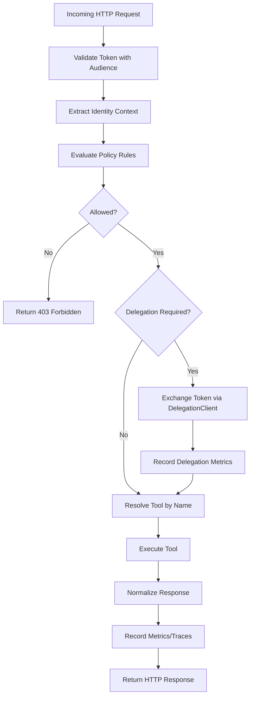

**Diagram sources**
- [routes/tools.py](file://products/tool-gateway/src/api_gateway/api/routes/tools.py)
- [routes/chat.py](file://products/tool-gateway/src/api_gateway/api/routes/chat.py)
- [token_verifier.py](file://products/tool-gateway/src/api_gateway/services/token_verifier.py)
- [policy_engine.py](file://products/tool-gateway/src/api_gateway/services/policy_engine.py)
- [gateway_service.py](file://products/tool-gateway/src/api_gateway/services/gateway_service.py)
- [delegation_client.py](file://products/tool-gateway/src/api_gateway/services/delegation_client.py)
- [registry.py](file://products/tool-gateway/src/api_gateway/tools/registry.py)
- [base.py](file://products/tool-gateway/src/api_gateway/tools/base.py)
- [k8s_connector.py](file://products/tool-gateway/src/api_gateway/tools/k8s_connector.py)
- [agent_client.py](file://products/tool-gateway/src/api_gateway/services/agent_client.py)

**Section sources**
- [routes/tools.py](file://products/tool-gateway/src/api_gateway/api/routes/tools.py)
- [routes/chat.py](file://products/tool-gateway/src/api_gateway/api/routes/chat.py)
- [token_verifier.py](file://products/tool-gateway/src/api_gateway/services/token_verifier.py)
- [policy_engine.py](file://products/tool-gateway/src/api_gateway/services/policy_engine.py)
- [gateway_service.py](file://products/tool-gateway/src/api_gateway/services/gateway_service.py)
- [delegation_client.py](file://products/tool-gateway/src/api_gateway/services/delegation_client.py)
- [registry.py](file://products/tool-gateway/src/api_gateway/tools/registry.py)
- [base.py](file://products/tool-gateway/src/api_gateway/tools/base.py)
- [k8s_connector.py](file://products/tool-gateway/src/api_gateway/tools/k8s_connector.py)
- [agent_client.py](file://products/tool-gateway/src/api_gateway/services/agent_client.py)

### Dependency Injection Patterns
- Centralized dependency providers expose configuration, observability, metrics, telemetry, request context, and runtime settings.
- Route handlers and services receive these dependencies via FastAPI's dependency injection mechanism.
- This pattern ensures testability, configurability, and separation of concerns.

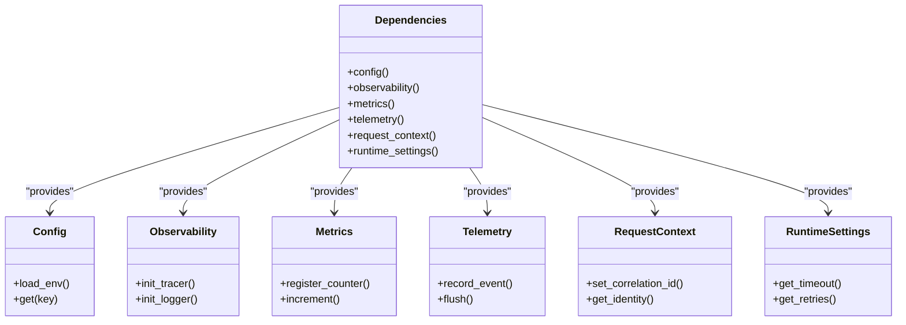

**Diagram sources**
- [dependencies.py](file://products/tool-gateway/src/api_gateway/core/dependencies.py)
- [config.py](file://products/tool-gateway/src/api_gateway/core/config.py)
- [observability.py](file://products/tool-gateway/src/api_gateway/core/observability.py)
- [metrics.py](file://products/tool-gateway/src/api_gateway/core/metrics.py)
- [telemetry.py](file://products/tool-gateway/src/api_gateway/core/telemetry.py)
- [request_context.py](file://products/tool-gateway/src/api_gateway/core/request_context.py)
- [runtime.py](file://products/tool-gateway/src/api_gateway/core/runtime.py)

**Section sources**
- [dependencies.py](file://products/tool-gateway/src/api_gateway/core/dependencies.py)
- [config.py](file://products/tool-gateway/src/api_gateway/core/config.py)
- [observability.py](file://products/tool-gateway/src/api_gateway/core/observability.py)
- [metrics.py](file://products/tool-gateway/src/api_gateway/core/metrics.py)
- [telemetry.py](file://products/tool-gateway/src/api_gateway/core/telemetry.py)
- [request_context.py](file://products/tool-gateway/src/api_gateway/core/request_context.py)
- [runtime.py](file://products/tool-gateway/src/api_gateway/core/runtime.py)

### Policy Engine and Token Verifier
- PolicyEngine loads policy definitions (YAML) and evaluates them against request attributes such as method, path, headers, and identity context.
- TokenVerifier validates tokens, decodes claims, and constructs an identity context used by policy evaluation and downstream services with enhanced audience claim validation.

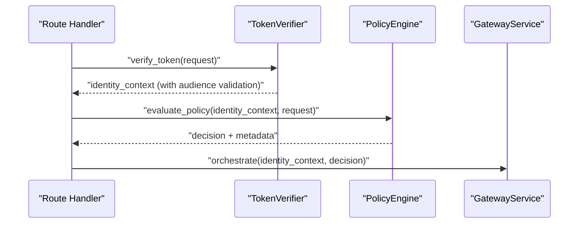

**Diagram sources**
- [token_verifier.py](file://products/tool-gateway/src/api_gateway/services/token_verifier.py)
- [policy_engine.py](file://products/tool-gateway/src/api_gateway/services/policy_engine.py)
- [gateway_service.py](file://products/tool-gateway/src/api_gateway/services/gateway_service.py)

**Section sources**
- [token_verifier.py](file://products/tool-gateway/src/api_gateway/services/token_verifier.py)
- [policy_engine.py](file://products/tool-gateway/src/api_gateway/services/policy_engine.py)

### Tool Registry and Execution
- ToolRegistry discovers and caches tool implementations based on names provided in requests.
- Base defines the abstract interface for tools; K8sConnector implements Kubernetes operations.
- GatewayService orchestrates tool resolution and execution, normalizing results and handling errors.

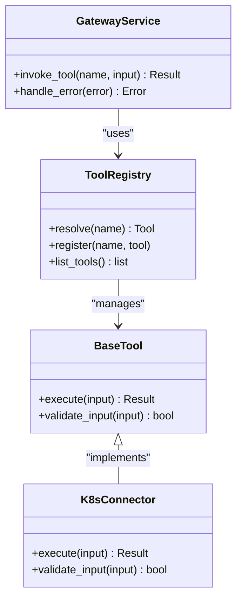

**Diagram sources**
- [registry.py](file://products/tool-gateway/src/api_gateway/tools/registry.py)
- [base.py](file://products/tool-gateway/src/api_gateway/tools/base.py)
- [k8s_connector.py](file://products/tool-gateway/src/api_gateway/tools/k8s_connector.py)
- [gateway_service.py](file://products/tool-gateway/src/api_gateway/services/gateway_service.py)

**Section sources**
- [registry.py](file://products/tool-gateway/src/api_gateway/tools/registry.py)
- [base.py](file://products/tool-gateway/src/api_gateway/tools/base.py)
- [k8s_connector.py](file://products/tool-gateway/src/api_gateway/tools/k8s_connector.py)
- [gateway_service.py](file://products/tool-gateway/src/api_gateway/services/gateway_service.py)

### Agent Client Integration
- AgentClient provides communication with downstream agent services when tool execution is not applicable.
- It encapsulates retries, timeouts, and error mapping to standardized responses.

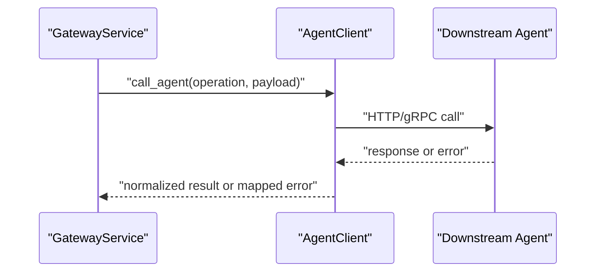

**Diagram sources**
- [agent_client.py](file://products/tool-gateway/src/api_gateway/services/agent_client.py)
- [gateway_service.py](file://products/tool-gateway/src/api_gateway/services/gateway_service.py)

**Section sources**
- [agent_client.py](file://products/tool-gateway/src/api_gateway/services/agent_client.py)
- [gateway_service.py](file://products/tool-gateway/src/api_gateway/services/gateway_service.py)

## Delegation Client Implementation

The delegation client provides secure token exchange capabilities for cross-service authentication and authorization. It handles the complete delegation workflow including token exchange, caching, and comprehensive metrics tracking.

### Key Features
- **Secure Token Exchange**: Implements OAuth 2.0 delegation patterns for secure cross-service communication
- **Caching Layer**: Caches delegated tokens to reduce overhead and improve performance
- **Metrics Tracking**: Tracks delegation operations with detailed metrics for monitoring and analysis
- **Error Handling**: Comprehensive error handling with retry logic and fallback mechanisms
- **Configuration Management**: Supports dynamic configuration for delegation endpoints and policies

### Architecture Components
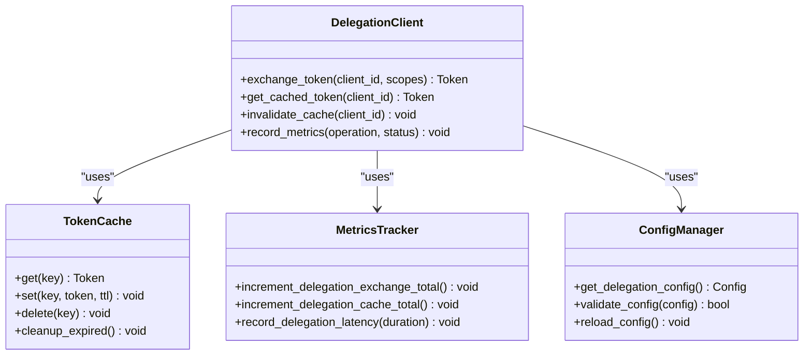

**Diagram sources**
- [delegation_client.py](file://products/tool-gateway/src/api_gateway/services/delegation_client.py)

### Delegation Workflow
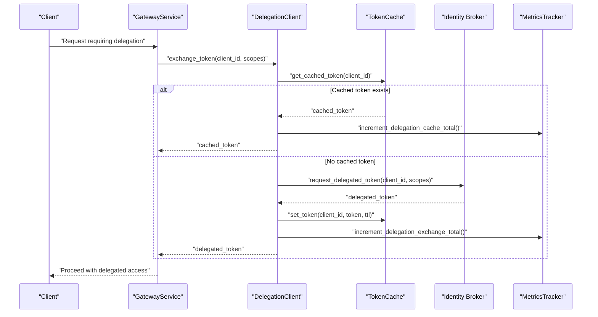

**Diagram sources**
- [delegation_client.py](file://products/tool-gateway/src/api_gateway/services/delegation_client.py)

**Section sources**
- [delegation_client.py](file://products/tool-gateway/src/api_gateway/services/delegation_client.py)

## Enhanced Token Verification

The token verification system has been enhanced with audience claim validation to ensure tokens are intended for the correct service and prevent token misuse across different services.

### Audience Claim Validation
- **Audience Validation**: Ensures tokens contain the correct `aud` claim matching the gateway service identifier
- **Issuer Verification**: Validates token issuer against configured trusted issuers
- **Scope Validation**: Checks requested scopes against allowed scopes for the service
- **Expiration Handling**: Properly handles token expiration and refresh scenarios

### Enhanced Verification Process
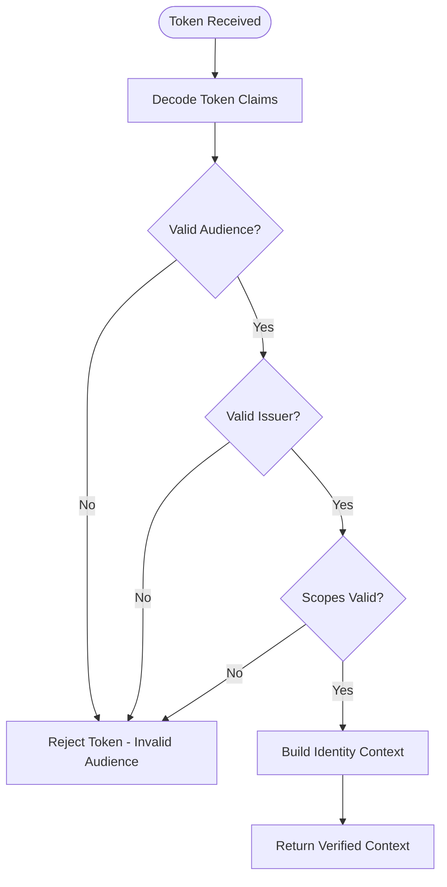

**Diagram sources**
- [token_verifier.py](file://products/tool-gateway/src/api_gateway/services/token_verifier.py)

**Section sources**
- [token_verifier.py](file://products/tool-gateway/src/api_gateway/services/token_verifier.py)

## Metrics and Observability

The gateway now includes comprehensive metrics tracking for delegation operations and enhanced observability across all components.

### Delegation Metrics
- **delegation_exchange_total**: Tracks total number of token exchange operations
- **delegation_cache_total**: Tracks cache hits and misses for delegated tokens
- **delegation_latency_seconds**: Measures time taken for delegation operations
- **delegation_errors_total**: Counts failed delegation attempts with error types

### Enhanced Metrics Implementation
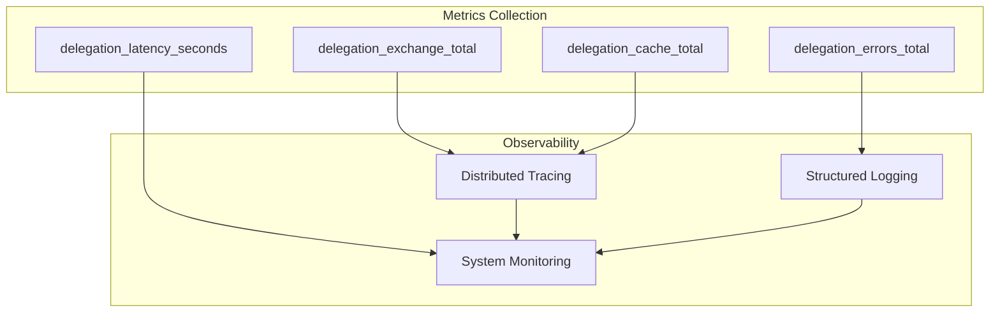

**Diagram sources**
- [metrics.py](file://products/tool-gateway/src/api_gateway/core/metrics.py)
- [delegation_client.py](file://products/tool-gateway/src/api_gateway/services/delegation_client.py)

### Monitoring Integration Points
- **Prometheus Metrics**: Export metrics in Prometheus-compatible format
- **OpenTelemetry Integration**: Distributed tracing with span context propagation
- **Health Checks**: Comprehensive health check endpoints for service monitoring
- **Alerting Rules**: Predefined alerting rules for critical metrics thresholds

**Section sources**
- [metrics.py](file://products/tool-gateway/src/api_gateway/core/metrics.py)
- [delegation_client.py](file://products/tool-gateway/src/api_gateway/services/delegation_client.py)
- [observability.py](file://products/tool-gateway/src/api_gateway/core/observability.py)

## Dependency Analysis
The gateway exhibits low coupling between layers due to dependency injection and clear interfaces:
- Routes depend on services via dependencies.
- Services depend on policy, token verification, delegation client, and tool registry.
- Tools implement a common base interface enabling pluggable connectors.
- Observability and metrics are injected uniformly across components.

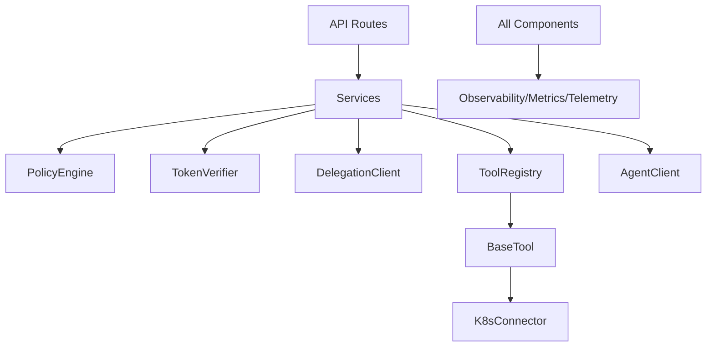

**Diagram sources**
- [router.py](file://products/tool-gateway/src/api_gateway/api/router.py)
- [gateway_service.py](file://products/tool-gateway/src/api_gateway/services/gateway_service.py)
- [policy_engine.py](file://products/tool-gateway/src/api_gateway/services/policy_engine.py)
- [token_verifier.py](file://products/tool-gateway/src/api_gateway/services/token_verifier.py)
- [delegation_client.py](file://products/tool-gateway/src/api_gateway/services/delegation_client.py)
- [registry.py](file://products/tool-gateway/src/api_gateway/tools/registry.py)
- [base.py](file://products/tool-gateway/src/api_gateway/tools/base.py)
- [k8s_connector.py](file://products/tool-gateway/src/api_gateway/tools/k8s_connector.py)
- [agent_client.py](file://products/tool-gateway/src/api_gateway/services/agent_client.py)
- [observability.py](file://products/tool-gateway/src/api_gateway/core/observability.py)
- [metrics.py](file://products/tool-gateway/src/api_gateway/core/metrics.py)
- [telemetry.py](file://products/tool-gateway/src/api_gateway/core/telemetry.py)

**Section sources**
- [router.py](file://products/tool-gateway/src/api_gateway/api/router.py)
- [gateway_service.py](file://products/tool-gateway/src/api_gateway/services/gateway_service.py)
- [policy_engine.py](file://products/tool-gateway/src/api_gateway/services/policy_engine.py)
- [token_verifier.py](file://products/tool-gateway/src/api_gateway/services/token_verifier.py)
- [delegation_client.py](file://products/tool-gateway/src/api_gateway/services/delegation_client.py)
- [registry.py](file://products/tool-gateway/src/api_gateway/tools/registry.py)
- [base.py](file://products/tool-gateway/src/api_gateway/tools/base.py)
- [k8s_connector.py](file://products/tool-gateway/src/api_gateway/tools/k8s_connector.py)
- [agent_client.py](file://products/tool-gateway/src/api_gateway/services/agent_client.py)
- [observability.py](file://products/tool-gateway/src/api_gateway/core/observability.py)
- [metrics.py](file://products/tool-gateway/src/api_gateway/core/metrics.py)
- [telemetry.py](file://products/tool-gateway/src/api_gateway/core/telemetry.py)

## Performance Considerations
- Connection pooling: Ensure HTTP clients (AgentClient, external tool calls, delegation client) use connection pools to reduce latency.
- Caching: Cache tool resolutions, policy decisions, and delegated tokens where appropriate to avoid repeated computation.
- Timeouts and retries: Configure sensible timeouts and retry policies in runtime settings, agent client, and delegation client.
- Concurrency: Leverage FastAPI's async capabilities for I/O-bound operations; avoid blocking calls.
- Metrics and tracing: Instrument hot paths to identify bottlenecks and optimize accordingly.
- Resource limits: Set CPU/memory limits per container and scale horizontally based on metrics.
- **Updated** Delegation cache optimization: Implement intelligent cache eviction policies and pre-warming strategies for frequently accessed tokens.

## Troubleshooting Guide
Common issues and strategies:
- Authentication failures: Verify token format, issuer, and expiration; inspect token verifier logs with audience validation details.
- Policy denials: Review policy definitions and request attributes; ensure identity context is correctly extracted.
- Tool execution errors: Check tool registry entries, input validation, and underlying connector logs.
- Downstream agent errors: Inspect agent client retries, timeouts, and error mappings.
- Delegation failures: Monitor delegation metrics, check cache status, and verify identity broker connectivity.
- Observability gaps: Confirm tracing spans and metrics counters are emitted; validate instrumentation initialization.
- **Updated** Audience validation issues: Verify service identifiers match configured audiences and check token issuance policies.

**Section sources**
- [token_verifier.py](file://products/tool-gateway/src/api_gateway/services/token_verifier.py)
- [policy_engine.py](file://products/tool-gateway/src/api_gateway/services/policy_engine.py)
- [registry.py](file://products/tool-gateway/src/api_gateway/tools/registry.py)
- [agent_client.py](file://products/tool-gateway/src/api_gateway/services/agent_client.py)
- [delegation_client.py](file://products/tool-gateway/src/api_gateway/services/delegation_client.py)
- [observability.py](file://products/tool-gateway/src/api_gateway/core/observability.py)
- [metrics.py](file://products/tool-gateway/src/api_gateway/core/metrics.py)
- [telemetry.py](file://products/tool-gateway/src/api_gateway/core/telemetry.py)

## Conclusion
The Tool Gateway Service provides a robust, extensible, and observable entry point for API requests. Its layered architecture, dependency injection, and policy-driven enforcement enable secure and scalable tool execution. **Updated** The addition of delegation client capabilities enhances cross-service authentication while maintaining security through audience validation and comprehensive metrics tracking. By following the documented request flow and leveraging the provided diagrams, teams can extend functionality, troubleshoot effectively, and maintain high performance and reliability across distributed service architectures.