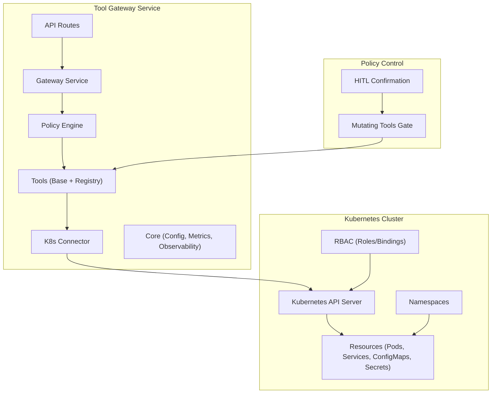
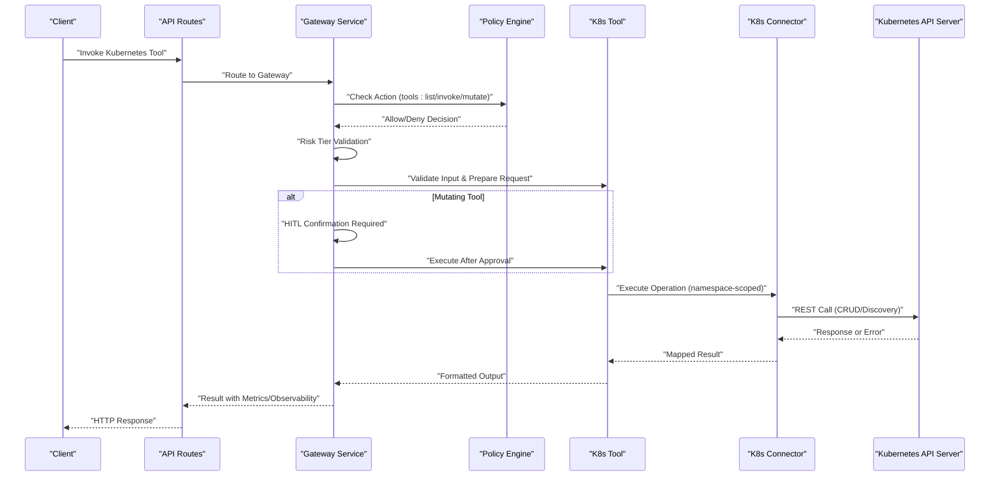
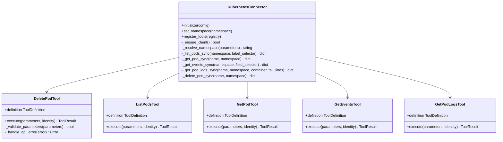
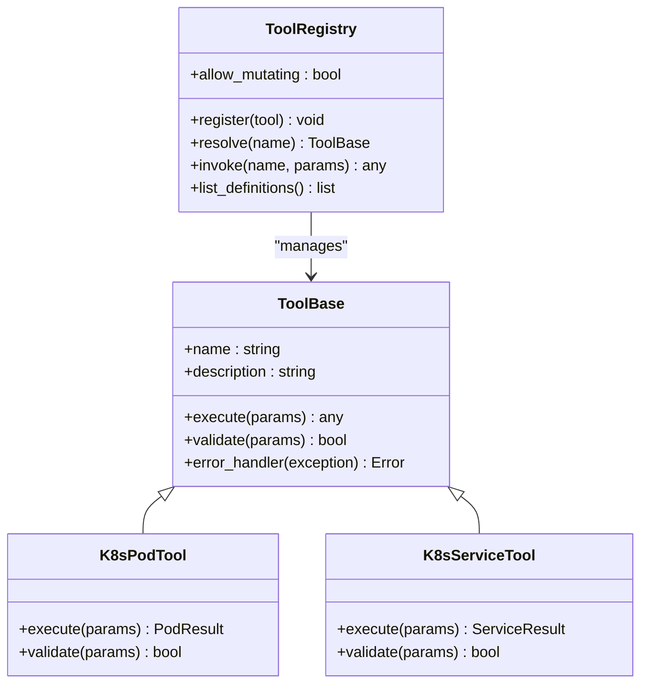
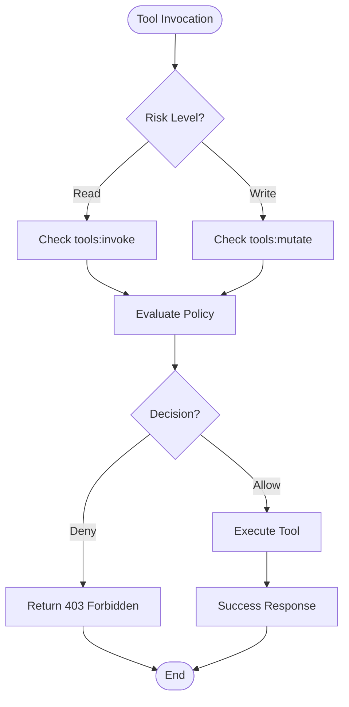
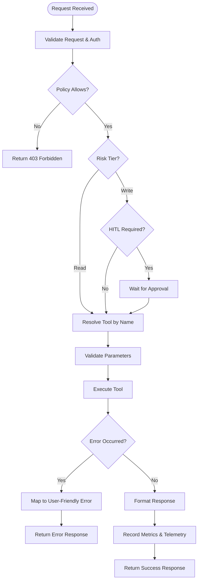
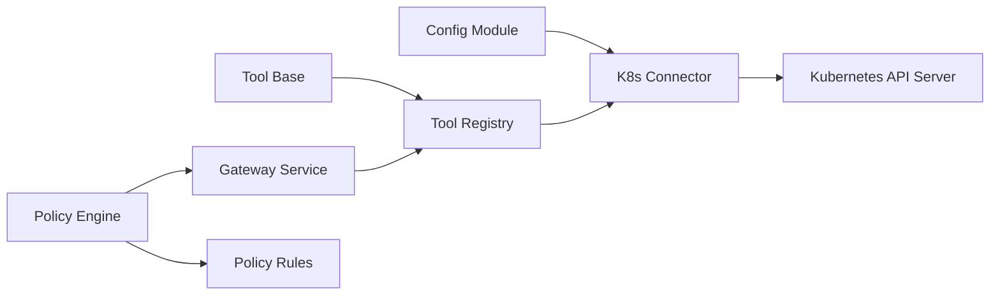

# Kubernetes Integration and Resource Management

<cite>
**Referenced Files in This Document**
- [k8s_connector.py](file://products/tool-gateway/src/tool_gateway/tools/k8s_connector.py)
- [base.py](file://products/tool-gateway/src/tool_gateway/tools/base.py)
- [registry.py](file://products/tool-gateway/src/tool_gateway/tools/registry.py)
- [gateway_service.py](file://products/tool-gateway/src/tool_gateway/services/gateway_service.py)
- [policy_engine.py](file://products/tool-gateway/src/tool_gateway/services/policy_engine.py)
- [policy-default.yaml](file://products/tool-gateway/src/tool_gateway/policies/policy-default.yaml)
- [config.py](file://products/tool-gateway/src/tool_gateway/core/config.py)
- [metrics.py](file://products/tool-gateway/src/tool_gateway/core/metrics.py)
- [observability.py](file://products/tool-gateway/src/tool_gateway/core/observability.py)
- [tool-gateway-pod-delete.yaml](file://shared/platform-ops/gitops/dev-k8s/base/tool-gateway/tool-gateway-pod-delete.yaml)
- [runtime-config.env](file://shared/platform-ops/gitops/dev-k8s/base/tool-gateway/runtime-config.env)
- [test_k8s_connector.py](file://products/tool-gateway/tests/test_k8s_connector.py)
</cite>

## Update Summary
**Changes Made**
- Added comprehensive documentation for the new bounded mutating capabilities through k8s.delete_pod tool
- Updated RBAC configuration section to include opt-in pod delete permissions
- Enhanced error handling documentation with structured error mapping for pod deletion
- Added policy engine integration for mutating tool execution control
- Updated security considerations to cover approval-gated mutations
- Expanded troubleshooting guide with mutation-specific scenarios

## Table of Contents
1. [Introduction](#introduction)
2. [Project Structure](#project-structure)
3. [Core Components](#core-components)
4. [Architecture Overview](#architecture-overview)
5. [Detailed Component Analysis](#detailed-component-analysis)
6. [Bounded Mutating Capabilities](#bounded-mutating-capabilities)
7. [Dependency Analysis](#dependency-analysis)
8. [Performance Considerations](#performance-considerations)
9. [Troubleshooting Guide](#troubleshooting-guide)
10. [Conclusion](#conclusion)
11. [Appendices](#appendices)

## Introduction
This document explains the Kubernetes integration capabilities within the Tool Gateway Service, focusing on the enhanced k8s connector implementation that now includes bounded mutating capabilities through the k8s.delete_pod tool. The connector provides cluster interaction, resource management, and namespace isolation with comprehensive error handling and RBAC considerations. It covers supported operations including read-only tools (pod management, service discovery, configmap access, secret handling) and the first approved mutating operation (bounded pod deletion). The document also details RBAC configuration, cluster connectivity, error handling strategies, policy enforcement, examples for developing Kubernetes tools, resource quotas, monitoring integration, security considerations, network policies, and performance optimization techniques.

## Project Structure
The Tool Gateway Service is implemented under products/tool-gateway with a clear separation between API routes, services, tools, core configuration, and observability. The Kubernetes integration centers around:
- A dedicated k8s connector module that encapsulates cluster interactions with both read-only and bounded mutating capabilities
- A tool base class and registry to expose Kubernetes operations as tools with risk-tier enforcement
- Configuration and environment variables for cluster connectivity and mutating tool activation
- Deployment manifests and RBAC resources for runtime permissions and isolation
- Policy engine integration for approval-gated mutating actions



**Diagram sources**
- [k8s_connector.py](file://products/tool-gateway/src/tool_gateway/tools/k8s_connector.py)
- [base.py](file://products/tool-gateway/src/tool_gateway/tools/base.py)
- [registry.py](file://products/tool-gateway/src/tool_gateway/tools/registry.py)
- [gateway_service.py](file://products/tool-gateway/src/tool_gateway/services/gateway_service.py)
- [policy_engine.py](file://products/tool-gateway/src/tool_gateway/services/policy_engine.py)

**Section sources**
- [k8s_connector.py](file://products/tool-gateway/src/tool_gateway/tools/k8s_connector.py)
- [base.py](file://products/tool-gateway/src/tool_gateway/tools/base.py)
- [registry.py](file://products/tool-gateway/src/tool_gateway/tools/registry.py)
- [gateway_service.py](file://products/tool-gateway/src/tool_gateway/services/gateway_service.py)
- [config.py](file://products/tool-gateway/src/tool_gateway/core/config.py)

## Core Components
- **K8s Connector**: Encapsulates all Kubernetes client initialization, authentication, and API calls. Provides methods for managing pods, services, configmaps, secrets, and performing service discovery. Supports namespace scoping and context switching. Now includes bounded mutating capabilities through the k8s.delete_pod tool.
- **Tool Base and Registry**: Defines a common interface for tools and a registry to discover and invoke Kubernetes tools dynamically. Ensures consistent input validation, output formatting, and error propagation. Implements risk-tier enforcement to separate read-only from mutating tools.
- **Gateway Service**: Orchestrates tool invocation, applies policy checks, and integrates metrics and observability hooks. Enforces approval workflows for mutating operations.
- **Policy Engine**: Implements deny-by-default policy evaluation with specific actions for tool execution (`tools:invoke` for read tools, `tools:mutate` for write/admin risk tools).
- **Configuration**: Loads cluster endpoints, TLS settings, token paths, feature flags, and mutating tool activation settings from environment or mounted files.

Key responsibilities:
- Cluster connectivity via kubeconfig or in-cluster auth
- Namespace isolation per request or tool invocation
- Secure handling of sensitive data (Secrets)
- Robust error mapping to user-friendly responses with structured error codes
- Risk-tier enforcement separating read-only from mutating operations
- Approval-gated execution for mutating tools through HITL confirmation
- Metrics and tracing for operational visibility

**Section sources**
- [k8s_connector.py](file://products/tool-gateway/src/tool_gateway/tools/k8s_connector.py)
- [base.py](file://products/tool-gateway/src/tool_gateway/tools/base.py)
- [registry.py](file://products/tool-gateway/src/tool_gateway/tools/registry.py)
- [gateway_service.py](file://products/tool-gateway/src/tool_gateway/services/gateway_service.py)
- [policy_engine.py](file://products/tool-gateway/src/tool_gateway/services/policy_engine.py)
- [config.py](file://products/tool-gateway/src/tool_gateway/core/config.py)

## Architecture Overview
The Tool Gateway Service exposes Kubernetes operations through tools that are invoked by the gateway with strict policy enforcement. Read-only tools are available by default, while mutating tools require explicit opt-in through environment configuration, policy grants, RBAC permissions, and HITL confirmation. Each tool call may be scoped to a specific namespace and authenticated using RBAC. The k8s connector abstracts the Kubernetes client lifecycle and provides typed operations for resource management.



**Diagram sources**
- [gateway_service.py](file://products/tool-gateway/src/tool_gateway/services/gateway_service.py)
- [k8s_connector.py](file://products/tool-gateway/src/tool_gateway/tools/k8s_connector.py)
- [policy_engine.py](file://products/tool-gateway/src/tool_gateway/services/policy_engine.py)
- [base.py](file://products/tool-gateway/src/tool_gateway/tools/base.py)
- [registry.py](file://products/tool-gateway/src/tool_gateway/tools/registry.py)

## Detailed Component Analysis

### K8s Connector Implementation
The k8s connector manages:
- Client initialization using kubeconfig or in-cluster configuration
- Authentication via tokens or service accounts
- Namespace selection and context switching
- Operations for Pods, Services, ConfigMaps, and Secrets
- Bounded mutating capability through k8s.delete_pod tool
- Error mapping and retry strategies where applicable

The connector now supports five tools: four read-only tools (list_pods, get_pod, get_events, get_pod_logs) and one bounded mutating tool (delete_pod) that requires explicit opt-in and approval.



**Diagram sources**
- [k8s_connector.py](file://products/tool-gateway/src/tool_gateway/tools/k8s_connector.py)

**Section sources**
- [k8s_connector.py](file://products/tool-gateway/src/tool_gateway/tools/k8s_connector.py)

### Tool Base and Registry
The tool base defines a standard interface for tool implementations, including input validation, execution, and error handling. The registry discovers available tools and maps them to API endpoints with risk-tier enforcement.



**Diagram sources**
- [base.py](file://products/tool-gateway/src/tool_gateway/tools/base.py)
- [registry.py](file://products/tool-gateway/src/tool_gateway/tools/registry.py)

**Section sources**
- [base.py](file://products/tool-gateway/src/tool_gateway/tools/base.py)
- [registry.py](file://products/tool-gateway/src/tool_gateway/tools/registry.py)

### Policy Engine Integration
The policy engine implements deny-by-default policy evaluation with specific actions for tool execution. Read-only tools require `tools:invoke` action, while mutating tools additionally require `tools:mutate` action. The system enforces role-based access control with platform-admin and operator roles granted mutating capabilities by default.



**Diagram sources**
- [policy_engine.py](file://products/tool-gateway/src/tool_gateway/services/policy_engine.py)
- [policy-default.yaml](file://products/tool-gateway/src/tool_gateway/policies/policy-default.yaml)

**Section sources**
- [policy_engine.py](file://products/tool-gateway/src/tool_gateway/services/policy_engine.py)
- [policy-default.yaml](file://products/tool-gateway/src/tool_gateway/policies/policy-default.yaml)

### Gateway Service Orchestration
The gateway service coordinates tool invocation, enforces policies, and integrates metrics and observability. It ensures that each tool call is validated, scoped to the correct namespace, logged appropriately, and subject to approval workflows for mutating operations.



**Diagram sources**
- [gateway_service.py](file://products/tool-gateway/src/tool_gateway/services/gateway_service.py)
- [metrics.py](file://products/tool-gateway/src/tool_gateway/core/metrics.py)
- [observability.py](file://products/tool-gateway/src/tool_gateway/core/observability.py)

**Section sources**
- [gateway_service.py](file://products/tool-gateway/src/tool_gateway/services/gateway_service.py)
- [metrics.py](file://products/tool-gateway/src/tool_gateway/core/metrics.py)
- [observability.py](file://products/tool-gateway/src/tool_gateway/core/observability.py)

### Configuration and Environment
Cluster connectivity is configured via environment variables or mounted files. Key settings include:
- Kubernetes API server URL
- Token path or in-cluster service account usage
- Default namespace for tool invocations
- Feature toggles for enabling/disabling certain operations
- Mutating tool activation flag (GATEWAY_MUTATING_TOOLS_ENABLED)

**Section sources**
- [config.py](file://products/tool-gateway/src/tool_gateway/core/config.py)
- [runtime-config.env](file://shared/platform-ops/gitops/dev-k8s/base/tool-gateway/runtime-config.env)

## Bounded Mutating Capabilities

### k8s.delete_pod Tool
The k8s.delete_pod tool represents the platform's first bounded mutating capability, implementing SPEC-021 requirements for approval-gated write operations. This tool provides a controlled "restart pod" primitive where deleting a controller-managed pod results in automatic recreation by the owning controller (Deployment, StatefulSet, etc.).

#### Activation Requirements
Enabling mutating tools requires all of the following:
1. Set `GATEWAY_MUTATING_TOOLS_ENABLED=true` in tool-gateway runtime configuration
2. Review `tools:mutate` grants in the policy bundle (default grants platform-admin + operator only)
3. Apply opt-in RBAC manifest for pod delete permissions
4. Configure `AGENT_HITL_CONFIRM_TIMEOUT>0` on agent-platform for HITL confirmation workflow

#### Security Model
The bounded mutating capability follows a triple-layered security model:
- **Risk-tier enforcement**: Write/admin risk tools are filtered out of the default read-only surface
- **Policy gate**: Requires explicit `tools:mutate` action grant to specific roles
- **RBAC scope**: Limited to delete verb on pods in specified namespaces only
- **HITL confirmation**: All mutating operations require human-in-the-loop approval

#### Error Handling
The delete_pod tool implements comprehensive error mapping:
- `POD_NOT_FOUND`: When the specified pod doesn't exist (HTTP 404)
- `K8S_PERMISSION_DENIED`: When RBAC denies the operation (HTTP 403)
- `K8S_API_ERROR`: Generic API errors with full exception details
- `INVALID_PARAMETERS`: Missing required parameters
- `K8S_NOT_CONFIGURED`: When Kubernetes client is not properly configured

#### Usage Examples
```python
# Successful pod deletion
result = await registry.invoke("k8s.delete_pod", {"name": "web-1"}, {})
# Returns: {"deleted_pod": "web-1", "namespace": "dev-luban-aiops", "note": "..."}

# Error handling
try:
    result = await registry.invoke("k8s.delete_pod", {"name": "ghost"}, {})
except Exception as e:
    # Handle structured error response
    if result.error["code"] == "POD_NOT_FOUND":
        # Handle missing pod scenario
        pass
```

**Section sources**
- [k8s_connector.py](file://products/tool-gateway/src/tool_gateway/tools/k8s_connector.py)
- [test_k8s_connector.py](file://products/tool-gateway/tests/test_k8s_connector.py)
- [runtime-config.env](file://shared/platform-ops/gitops/dev-k8s/base/tool-gateway/runtime-config.env)

## Dependency Analysis
The k8s connector depends on the Kubernetes Python client library and interacts with the API server over HTTPS. The tool layer depends on the connector for cluster operations, while the gateway service orchestrates tool execution and policy enforcement. The policy engine provides centralized authorization decisions based on role-based access control.



**Diagram sources**
- [config.py](file://products/tool-gateway/src/tool_gateway/core/config.py)
- [k8s_connector.py](file://products/tool-gateway/src/tool_gateway/tools/k8s_connector.py)
- [base.py](file://products/tool-gateway/src/tool_gateway/tools/base.py)
- [registry.py](file://products/tool-gateway/src/tool_gateway/tools/registry.py)
- [gateway_service.py](file://products/tool-gateway/src/tool_gateway/services/gateway_service.py)
- [policy_engine.py](file://products/tool-gateway/src/tool_gateway/services/policy_engine.py)

**Section sources**
- [config.py](file://products/tool-gateway/src/tool_gateway/core/config.py)
- [k8s_connector.py](file://products/tool-gateway/src/tool_gateway/tools/k8s_connector.py)
- [base.py](file://products/tool-gateway/src/tool_gateway/tools/base.py)
- [registry.py](file://products/tool-gateway/src/tool_gateway/tools/registry.py)
- [gateway_service.py](file://products/tool-gateway/src/tool_gateway/services/gateway_service.py)
- [policy_engine.py](file://products/tool-gateway/src/tool_gateway/services/policy_engine.py)

## Performance Considerations
- Connection pooling: Reuse HTTP connections to the Kubernetes API server to reduce latency
- Caching: Cache frequently accessed resources like ConfigMaps and Secrets within TTL limits
- Pagination: Use list operations with proper pagination to avoid large payloads
- Concurrency: Limit concurrent requests to prevent overwhelming the API server
- Timeouts: Configure appropriate timeouts for read and write operations
- Metrics: Track request duration, error rates, and resource utilization
- Approval overhead: Account for HITL confirmation latency in mutating operations
- Risk-tier filtering: Minimize policy evaluation overhead for read-only operations

[No sources needed since this section provides general guidance]

## Troubleshooting Guide
Common issues and resolutions:
- **Authentication failures**: Verify token validity and RBAC permissions
- **Namespace errors**: Ensure the requested namespace exists and is accessible
- **Permission denied**: Review Role/RoleBinding definitions for required verbs
- **Network timeouts**: Check network policies and firewall rules
- **Resource not found**: Validate resource names and namespaces
- **Mutating tool blocked**: Check GATEWAY_MUTATING_TOOLS_ENABLED setting and policy grants
- **HITL confirmation timeout**: Verify AGENT_HITL_CONFIRM_TIMEOUT configuration

### Mutation-Specific Issues
- **k8s.delete_pod not available**: Ensure all four activation prerequisites are met
- **Permission denied on delete**: Apply the optional RBAC manifest for pod delete permissions
- **Approval workflow stuck**: Check HITL confirmation queue and approver availability
- **Pod recreation unexpected**: Verify controller ownership and expected behavior

Diagnostic steps:
- Enable debug logging in the k8s connector
- Inspect metrics and traces for failed requests
- Validate RBAC manifests and bindings
- Test connectivity to the API server from the Tool Gateway pod
- Review policy decisions and matched rule IDs
- Check HITL confirmation status and timeout configurations

**Section sources**
- [test_k8s_connector.py](file://products/tool-gateway/tests/test_k8s_connector.py)

## Conclusion
The Tool Gateway Service provides a robust Kubernetes integration through a well-structured k8s connector and tool abstraction with enhanced bounded mutating capabilities. It supports essential read-only operations for pod management, service discovery, ConfigMap access, and Secret handling, plus the first approved mutating operation (k8s.delete_pod) with comprehensive security controls. The implementation emphasizes namespace isolation, RBAC compliance, policy enforcement, approval workflows, and observability. Proper configuration, security practices, and performance tuning ensure reliable and secure cluster interactions while maintaining strict control over mutating operations.

[No sources needed since this section summarizes without analyzing specific files]

## Appendices

### RBAC Configuration
RBAC resources define the minimum required permissions for the Tool Gateway Service to interact with Kubernetes resources. The default configuration grants read-only access to Pods, Services, ConfigMaps, and Secrets. For mutating operations, an optional RBAC manifest provides scoped delete permissions for pods only.

#### Default Read-Only Permissions
- Get/List/Watch for Pods, Services, ConfigMaps, Secrets
- Scoped to specific namespaces for isolation

#### Optional Mutating Permissions
- Delete verb on pods only
- Namespace-scoped to dev-luban-aiops
- Applied explicitly via separate manifest

Ensure RoleBindings are scoped to the appropriate namespace and use least privilege principles.

**Section sources**
- [tool-gateway-pod-delete.yaml](file://shared/platform-ops/gitops/dev-k8s/base/tool-gateway/tool-gateway-pod-delete.yaml)

### Deployment and Security
The deployment manifest configures the Tool Gateway Service with environment variables, volume mounts for secrets, and resource limits. Network policies should restrict inbound/outbound traffic to only necessary endpoints. Mutating tool activation requires additional security considerations including HITL confirmation setup and policy review.

#### Security Checklist for Mutating Tools
1. Set GATEWAY_MUTATING_TOOLS_ENABLED=true
2. Review tools:mutate policy grants
3. Apply optional RBAC manifest
4. Configure AGENT_HITL_CONFIRM_TIMEOUT>0
5. Verify approver availability and training

**Section sources**
- [runtime-config.env](file://shared/platform-ops/gitops/dev-k8s/base/tool-gateway/runtime-config.env)
- [tool-gateway-pod-delete.yaml](file://shared/platform-ops/gitops/dev-k8s/base/tool-gateway/tool-gateway-pod-delete.yaml)

### Monitoring Integration
Metrics and telemetry are collected for all tool invocations, including success/failure rates, latency, and resource usage. Integrate with Prometheus and Grafana for visualization and alerting. Special attention should be given to monitoring mutating operations, approval workflows, and policy decisions.

#### Key Metrics to Monitor
- Tool invocation success/failure rates
- Latency breakdown by tool type
- Policy decision outcomes
- HITL confirmation completion rates
- RBAC permission denials
- Kubernetes API error rates

**Section sources**
- [metrics.py](file://products/tool-gateway/src/tool_gateway/core/metrics.py)
- [observability.py](file://products/tool-gateway/src/tool_gateway/core/observability.py)

### Example: Developing a Kubernetes Tool
To create a new Kubernetes tool:
1. Extend the ToolBase class
2. Implement execute() and validate() methods
3. Define appropriate risk_level (read/write)
4. Register the tool in the ToolRegistry
5. Add corresponding API route if needed
6. Test with unit tests and integration tests
7. For mutating tools, implement comprehensive error handling

#### Best Practices for New Tools
- Follow existing patterns for parameter validation
- Implement structured error responses
- Include appropriate evidence tracking
- Consider namespace scoping and isolation
- Test both success and failure scenarios

**Section sources**
- [base.py](file://products/tool-gateway/src/tool_gateway/tools/base.py)
- [registry.py](file://products/tool-gateway/src/tool_gateway/tools/registry.py)
- [test_k8s_connector.py](file://products/tool-gateway/tests/test_k8s_connector.py)

### Policy Configuration
The policy engine uses a deny-by-default approach with explicit allow rules. Read-only tools require `tools:invoke` action, while mutating tools additionally require `tools:mutate` action. Default policy grants mutating capabilities to platform-admin and operator roles only.

#### Policy Actions
- `tools:list`: List available tools (all roles)
- `tools:invoke`: Execute read-risk tools (platform-admin, operator, developer, read-only-observer)
- `tools:mutate`: Execute write/admin risk tools (platform-admin, operator only)

**Section sources**
- [policy-default.yaml](file://products/tool-gateway/src/tool_gateway/policies/policy-default.yaml)
- [policy_engine.py](file://products/tool-gateway/src/tool_gateway/services/policy_engine.py)