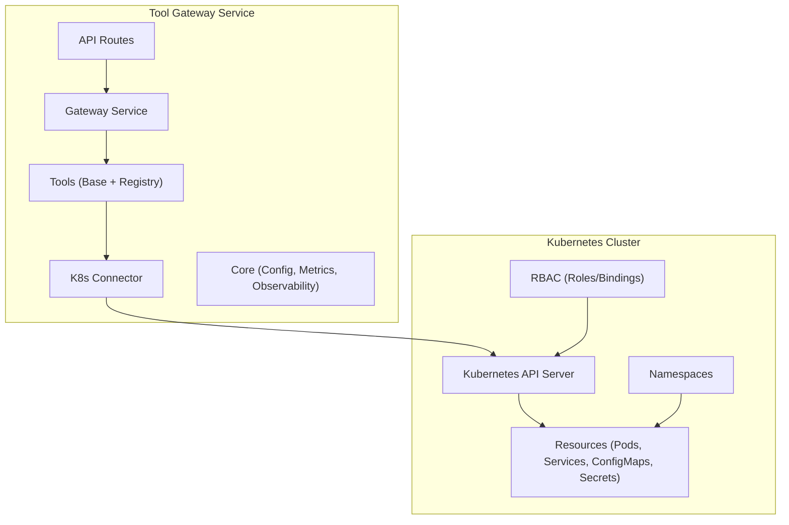
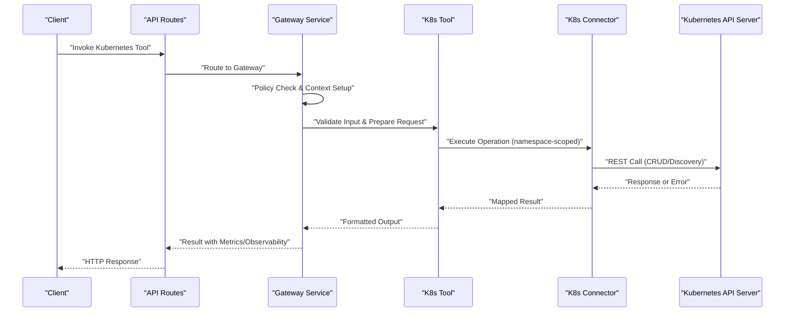
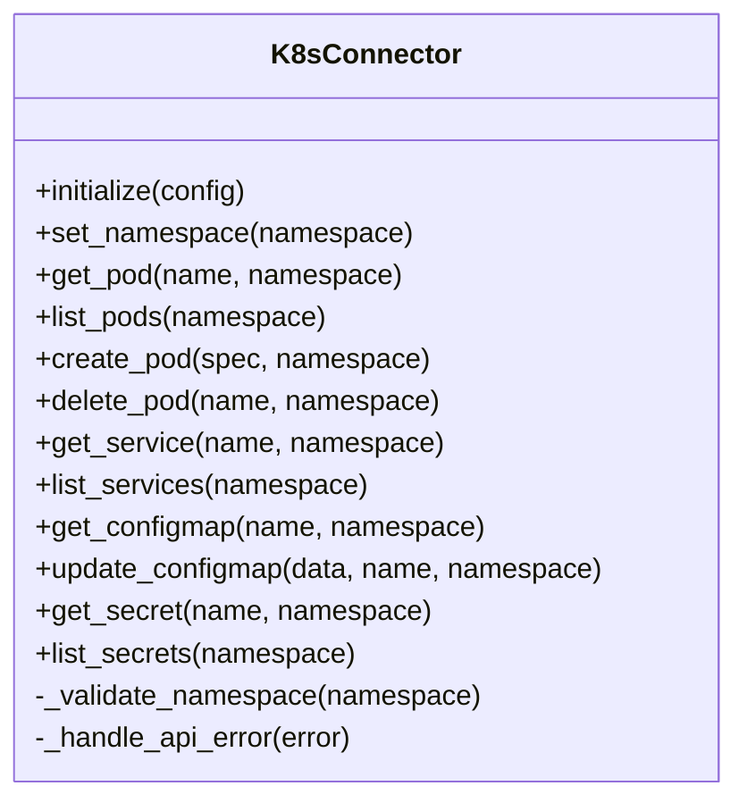
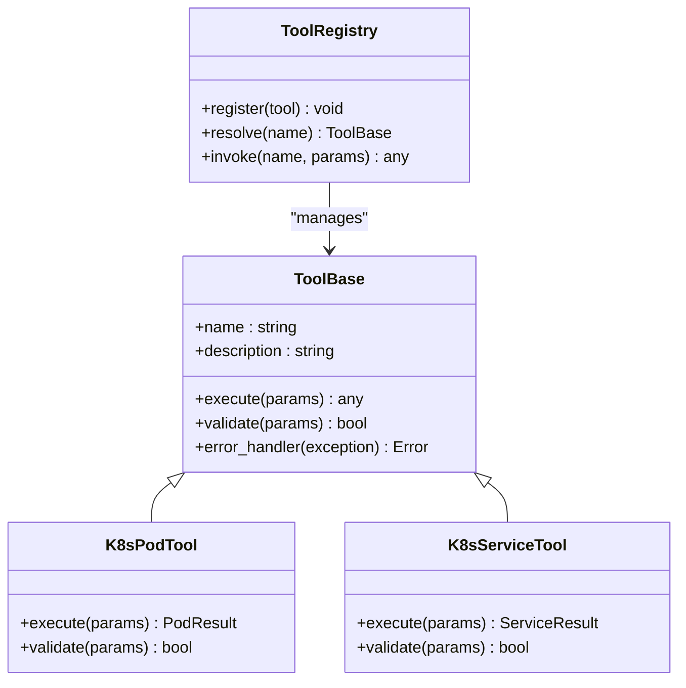
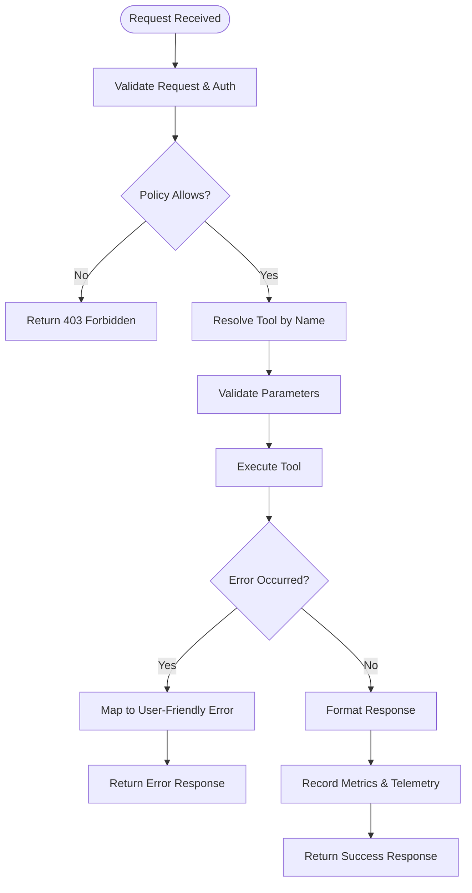
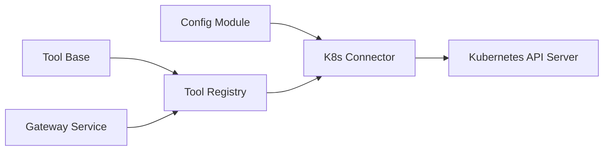

# Kubernetes Integration and Resource Management

<cite>
**Referenced Files in This Document**
- [k8s_connector.py](file://products/tool-gateway/src/api_gateway/tools/k8s_connector.py)
- [base.py](file://products/tool-gateway/src/api_gateway/tools/base.py)
- [registry.py](file://products/tool-gateway/src/api_gateway/tools/registry.py)
- [gateway_service.py](file://products/tool-gateway/src/api_gateway/services/gateway_service.py)
- [config.py](file://products/tool-gateway/src/api_gateway/core/config.py)
- [metrics.py](file://products/tool-gateway/src/api_gateway/core/metrics.py)
- [observability.py](file://products/tool-gateway/src/api_gateway/core/observability.py)
- [api_gateway-deployment.yaml](file://shared/platform-ops/gitops/dev-k8s/base/tool-gateway/api-gateway-deployment.yaml)
- [rbac.yaml](file://shared/platform-ops/gitops/dev-k8s/base/tool-gateway/rbac.yaml)
- [policy.yaml](file://shared/platform-ops/gitops/dev-k8s/base/tool-gateway/policy.yaml)
- [runtime-config.env](file://shared/platform-ops/gitops/dev-k8s/base/tool-gateway/runtime-config.env)
- [test_k8s_connector.py](file://products/tool-gateway/tests/test_k8s_connector.py)
</cite>

## Table of Contents
1. [Introduction](#introduction)
2. [Project Structure](#project-structure)
3. [Core Components](#core-components)
4. [Architecture Overview](#architecture-overview)
5. [Detailed Component Analysis](#detailed-component-analysis)
6. [Dependency Analysis](#dependency-analysis)
7. [Performance Considerations](#performance-considerations)
8. [Troubleshooting Guide](#troubleshooting-guide)
9. [Conclusion](#conclusion)
10. [Appendices](#appendices)

## Introduction
This document explains the Kubernetes integration capabilities within the Tool Gateway Service, focusing on the k8s connector implementation for cluster interaction, resource management, and namespace isolation. It covers supported operations such as pod management, service discovery, ConfigMap access, and Secret handling. It also documents RBAC configuration, cluster connectivity, error handling strategies, examples for developing Kubernetes tools, resource quotas, monitoring integration, security considerations, network policies, and performance optimization techniques.

## Project Structure
The Tool Gateway Service is implemented under products/tool-gateway with a clear separation between API routes, services, tools, core configuration, and observability. The Kubernetes integration centers around:
- A dedicated k8s connector module that encapsulates cluster interactions
- A tool base class and registry to expose Kubernetes operations as tools
- Configuration and environment variables for cluster connectivity
- Deployment manifests and RBAC resources for runtime permissions and isolation

**Diagram sources**
- [k8s_connector.py](file://products/tool-gateway/src/api_gateway/tools/k8s_connector.py)
- [base.py](file://products/tool-gateway/src/api_gateway/tools/base.py)
- [registry.py](file://products/tool-gateway/src/api_gateway/tools/registry.py)
- [gateway_service.py](file://products/tool-gateway/src/api_gateway/services/gateway_service.py)
- [config.py](file://products/tool-gateway/src/api_gateway/core/config.py)

**Section sources**
- [k8s_connector.py](file://products/tool-gateway/src/api_gateway/tools/k8s_connector.py)
- [base.py](file://products/tool-gateway/src/api_gateway/tools/base.py)
- [registry.py](file://products/tool-gateway/src/api_gateway/tools/registry.py)
- [gateway_service.py](file://products/tool-gateway/src/api_gateway/services/gateway_service.py)
- [config.py](file://products/tool-gateway/src/api_gateway/core/config.py)

## Core Components
- K8s Connector: Encapsulates all Kubernetes client initialization, authentication, and API calls. Provides methods for managing pods, services, configmaps, secrets, and performing service discovery. Supports namespace scoping and context switching.
- Tool Base and Registry: Defines a common interface for tools and a registry to discover and invoke Kubernetes tools dynamically. Ensures consistent input validation, output formatting, and error propagation.
- Gateway Service: Orchestrates tool invocation, applies policy checks, and integrates metrics and observability hooks.
- Configuration: Loads cluster endpoints, TLS settings, token paths, and feature flags from environment or mounted files.

Key responsibilities:
- Cluster connectivity via kubeconfig or in-cluster auth
- Namespace isolation per request or tool invocation
- Secure handling of sensitive data (Secrets)
- Robust error mapping to user-friendly responses
- Metrics and tracing for operational visibility

**Section sources**
- [k8s_connector.py](file://products/tool-gateway/src/api_gateway/tools/k88_connector.py)
- [base.py](file://products/tool-gateway/src/api_gateway/tools/base.py)
- [registry.py](file://products/tool-gateway/src/api_gateway/tools/registry.py)
- [gateway_service.py](file://products/tool-gateway/src/api_gateway/services/gateway_service.py)
- [config.py](file://products/tool-gateway/src/api_gateway/core/config.py)

## Architecture Overview
The Tool Gateway Service exposes Kubernetes operations through tools that are invoked by the gateway. Each tool call may be scoped to a specific namespace and authenticated using RBAC. The k8s connector abstracts the Kubernetes client lifecycle and provides typed operations for resource management.

**Diagram sources**
- [gateway_service.py](file://products/tool-gateway/src/api_gateway/services/gateway_service.py)
- [k8s_connector.py](file://products/tool-gateway/src/api_gateway/tools/k8s_connector.py)
- [base.py](file://products/tool-gateway/src/api_gateway/tools/base.py)
- [registry.py](file://products/tool-gateway/src/api_gateway/tools/registry.py)

## Detailed Component Analysis

### K8s Connector Implementation
The k8s connector manages:
- Client initialization using kubeconfig or in-cluster configuration
- Authentication via tokens or service accounts
- Namespace selection and context switching
- Operations for Pods, Services, ConfigMaps, and Secrets
- Error mapping and retry strategies where applicable

**Diagram sources**
- [k8s_connector.py](file://products/tool-gateway/src/api_gateway/tools/k8s_connector.py)

**Section sources**
- [k8s_connector.py](file://products/tool-gateway/src/api_gateway/tools/k8s_connector.py)

### Tool Base and Registry
The tool base defines a standard interface for tool implementations, including input validation, execution, and error handling. The registry discovers available tools and maps them to API endpoints.

**Diagram sources**
- [base.py](file://products/tool-gateway/src/api_gateway/tools/base.py)
- [registry.py](file://products/tool-gateway/src/api_gateway/tools/registry.py)

**Section sources**
- [base.py](file://products/tool-gateway/src/api_gateway/tools/base.py)
- [registry.py](file://products/tool-gateway/src/api_gateway/tools/registry.py)

### Gateway Service Orchestration
The gateway service coordinates tool invocation, enforces policies, and integrates metrics and observability. It ensures that each tool call is validated, scoped to the correct namespace, and logged appropriately.

**Diagram sources**
- [gateway_service.py](file://products/tool-gateway/src/api_gateway/services/gateway_service.py)
- [metrics.py](file://products/tool-gateway/src/api_gateway/core/metrics.py)
- [observability.py](file://products/tool-gateway/src/api_gateway/core/observability.py)

**Section sources**
- [gateway_service.py](file://products/tool-gateway/src/api_gateway/services/gateway_service.py)
- [metrics.py](file://products/tool-gateway/src/api_gateway/core/metrics.py)
- [observability.py](file://products/tool-gateway/src/api_gateway/core/observability.py)

### Configuration and Environment
Cluster connectivity is configured via environment variables or mounted files. Key settings include:
- Kubernetes API server URL
- Token path or in-cluster service account usage
- Default namespace for tool invocations
- Feature toggles for enabling/disabling certain operations

**Section sources**
- [config.py](file://products/tool-gateway/src/api_gateway/core/config.py)
- [runtime-config.env](file://shared/platform-ops/gitops/dev-k8s/base/tool-gateway/runtime-config.env)

## Dependency Analysis
The k8s connector depends on the Kubernetes Python client library and interacts with the API server over HTTPS. The tool layer depends on the connector for cluster operations, while the gateway service orchestrates tool execution and policy enforcement.

**Diagram sources**
- [config.py](file://products/tool-gateway/src/api_gateway/core/config.py)
- [k8s_connector.py](file://products/tool-gateway/src/api_gateway/tools/k8s_connector.py)
- [base.py](file://products/tool-gateway/src/api_gateway/tools/base.py)
- [registry.py](file://products/tool-gateway/src/api_gateway/tools/registry.py)
- [gateway_service.py](file://products/tool-gateway/src/api_gateway/services/gateway_service.py)

**Section sources**
- [config.py](file://products/tool-gateway/src/api_gateway/core/config.py)
- [k8s_connector.py](file://products/tool-gateway/src/api_gateway/tools/k8s_connector.py)
- [base.py](file://products/tool-gateway/src/api_gateway/tools/base.py)
- [registry.py](file://products/tool-gateway/src/api_gateway/tools/registry.py)
- [gateway_service.py](file://products/tool-gateway/src/api_gateway/services/gateway_service.py)

## Performance Considerations
- Connection pooling: Reuse HTTP connections to the Kubernetes API server to reduce latency
- Caching: Cache frequently accessed resources like ConfigMaps and Secrets within TTL limits
- Pagination: Use list operations with proper pagination to avoid large payloads
- Concurrency: Limit concurrent requests to prevent overwhelming the API server
- Timeouts: Configure appropriate timeouts for read and write operations
- Metrics: Track request duration, error rates, and resource utilization

[No sources needed since this section provides general guidance]

## Troubleshooting Guide
Common issues and resolutions:
- Authentication failures: Verify token validity and RBAC permissions
- Namespace errors: Ensure the requested namespace exists and is accessible
- Permission denied: Review Role/RoleBinding definitions for required verbs
- Network timeouts: Check network policies and firewall rules
- Resource not found: Validate resource names and namespaces

Diagnostic steps:
- Enable debug logging in the k8s connector
- Inspect metrics and traces for failed requests
- Validate RBAC manifests and bindings
- Test connectivity to the API server from the Tool Gateway pod

**Section sources**
- [test_k8s_connector.py](file://products/tool-gateway/tests/test_k8s_connector.py)

## Conclusion
The Tool Gateway Service provides a robust Kubernetes integration through a well-structured k8s connector and tool abstraction. It supports essential operations for pod management, service discovery, ConfigMap access, and Secret handling, with strong emphasis on namespace isolation, RBAC compliance, and observability. Proper configuration, security practices, and performance tuning ensure reliable and secure cluster interactions.

[No sources needed since this section summarizes without analyzing specific files]

## Appendices

### RBAC Configuration
RBAC resources define the minimum required permissions for the Tool Gateway Service to interact with Kubernetes resources. Typical roles include:
- Get/List/Watch for Pods, Services, ConfigMaps, Secrets
- Create/Update/Delete for managed resources based on tool requirements

Ensure RoleBindings are scoped to the appropriate namespace and use least privilege principles.

**Section sources**
- [rbac.yaml](file://shared/platform-ops/gitops/dev-k8s/base/tool-gateway/rbac.yaml)

### Deployment and Security
The deployment manifest configures the Tool Gateway Service with environment variables, volume mounts for secrets, and resource limits. Network policies should restrict inbound/outbound traffic to only necessary endpoints.

**Section sources**
- [api_gateway-deployment.yaml](file://shared/platform-ops/gitops/dev-k8s/base/tool-gateway/api-gateway-deployment.yaml)
- [policy.yaml](file://shared/platform-ops/gitops/dev-k8s/base/tool-gateway/policy.yaml)

### Monitoring Integration
Metrics and telemetry are collected for all tool invocations, including success/failure rates, latency, and resource usage. Integrate with Prometheus and Grafana for visualization and alerting.

**Section sources**
- [metrics.py](file://products/tool-gateway/src/api_gateway/core/metrics.py)
- [observability.py](file://products/tool-gateway/src/api_gateway/core/observability.py)

### Example: Developing a Kubernetes Tool
To create a new Kubernetes tool:
1. Extend the ToolBase class
2. Implement execute() and validate() methods
3. Register the tool in the ToolRegistry
4. Add corresponding API route if needed
5. Test with unit tests and integration tests

**Section sources**
- [base.py](file://products/tool-gateway/src/api_gateway/tools/base.py)
- [registry.py](file://products/tool-gateway/src/api_gateway/tools/registry.py)
- [test_k8s_connector.py](file://products/tool-gateway/tests/test_k8s_connector.py)