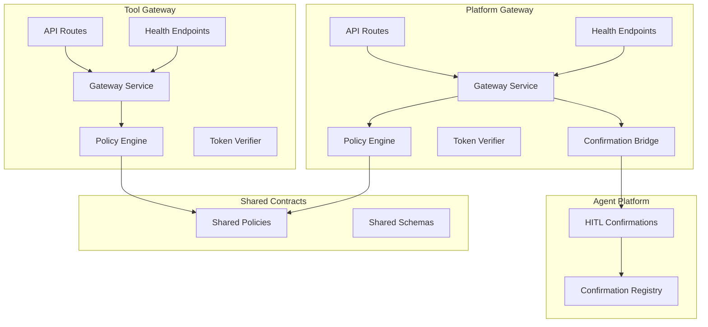
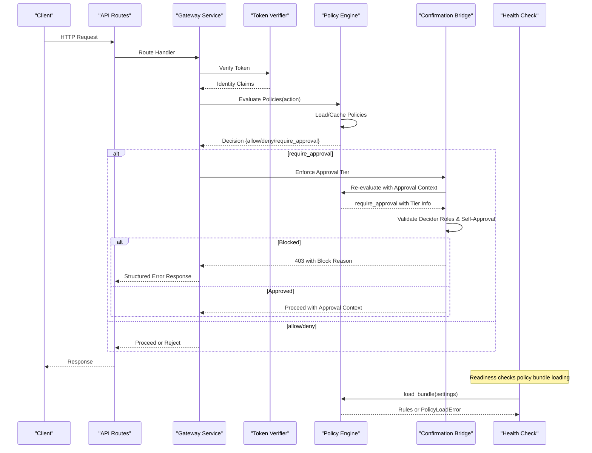
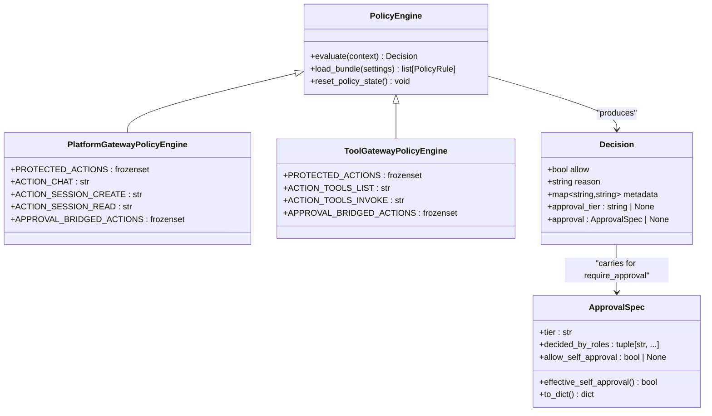
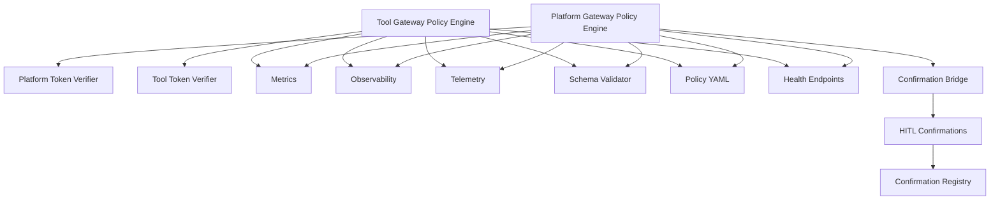

# Policy Engine and Enforcement

<cite>
**Referenced Files in This Document**
- [policy_engine.py](file://products/tool-gateway/src/tool_gateway/services/policy_engine.py)
- [policy_engine.py](file://products/platform-gateway/src/platform_gateway/services/policy_engine.py)
- [policy-default.yaml](file://shared/shared-contracts/policies/policy-default.yaml)
- [policy-rule.schema.json](file://shared/shared-contracts/schemas/policy-rule.schema.json)
- [policy-decision.schema.json](file://shared/shared-contracts/schemas/policy-decision.schema.json)
- [test_policy_engine.py](file://products/tool-gateway/tests/test_policy_engine.py)
- [test_policy_engine.py](file://products/platform-gateway/tests/test_policy_engine.py)
- [gateway_service.py](file://products/tool-gateway/src/tool_gateway/services/gateway_service.py)
- [gateway_service.py](file://products/platform-gateway/src/platform_gateway/services/gateway_service.py)
- [hitl_confirmations.py](file://products/agent-platform/src/agent_service/services/hitl_confirmations.py)
- [health.py](file://products/tool-gateway/src/tool_gateway/api/routes/health.py)
- [health.py](file://products/platform-gateway/src/platform_gateway/api/routes/health.py)
</cite>

## Update Summary
**Changes Made**
- Enhanced policy engine with third decision outcome 'require_approval' alongside existing allow/deny outcomes
- Added tier validation logic with tier_1 (self-approval allowed) and tier_2 (designated approver required)
- Implemented self-approval restrictions for tier_2 approvals preventing requester from approving their own calls
- Integrated confirmation bridge for parked batch policies with structured 403 responses for blocked attempts
- Updated default policy bundles with require_approval rules for mutating tool execution
- Enhanced test coverage for approval tiers and self-approval validation scenarios

## Table of Contents
1. [Introduction](#introduction)
2. [Project Structure](#project-structure)
3. [Core Components](#core-components)
4. [Architecture Overview](#architecture-overview)
5. [Detailed Component Analysis](#detailed-component-analysis)
6. [Dependency Analysis](#dependency-analysis)
7. [Performance Considerations](#performance-considerations)
8. [Troubleshooting Guide](#troubleshooting-guide)
9. [Conclusion](#conclusion)
10. [Appendices](#appendices)

## Introduction
This document explains the enhanced Policy Engine implementation that validates requests and enforces policies at runtime within both the tool gateway and platform gateway services. The system now supports three decision outcomes: allow, deny, and require_approval with tiered approval workflows. It covers the YAML-based policy definition language, rule evaluation engine, decision-making process, built-in policy types (rate limiting, authentication checks, data access control, custom business rules, and tool listing controls), policy loading and caching strategies, runtime updates, examples, troubleshooting, performance optimization, versioning, and testing strategies.

## Project Structure
The policy enforcement is implemented in both gateway services with enhanced approval workflow support:
- Separate policy engine implementations for platform-gateway and tool-gateway with distinct action vocabularies
- Shared policy contracts and schemas under shared/shared-contracts directory
- YAML policy definitions packaged within each service and available through shared contracts
- JSON schemas defining the structure of policy rules and decisions with require_approval support
- Integration points with token verification, request context, metrics, observability, telemetry, and confirmation bridge
- Comprehensive test coverage for both policy load failures and enforcement scenarios including approval workflows

**Diagram sources**
- [gateway_service.py](file://products/platform-gateway/src/platform_gateway/services/gateway_service.py)
- [gateway_service.py](file://products/tool-gateway/src/tool_gateway/services/gateway_service.py)
- [policy_engine.py](file://products/platform-gateway/src/platform_gateway/services/policy_engine.py)
- [policy_engine.py](file://products/tool-gateway/src/tool_gateway/services/policy_engine.py)
- [hitl_confirmations.py](file://products/agent-platform/src/agent_service/services/hitl_confirmations.py)
- [health.py](file://products/platform-gateway/src/platform_gateway/api/routes/health.py)
- [health.py](file://products/tool-gateway/src/tool_gateway/api/routes/health.py)

**Section sources**
- [policy_engine.py](file://products/tool-gateway/src/tool_gateway/services/policy_engine.py)
- [policy_engine.py](file://products/platform-gateway/src/platform_gateway/services/policy_engine.py)
- [policy-default.yaml](file://shared/shared-contracts/policies/policy-default.yaml)
- [policy-rule.schema.json](file://shared/shared-contracts/schemas/policy-rule.schema.json)
- [policy-decision.schema.json](file://shared/shared-contracts/schemas/policy-decision.schema.json)
- [gateway_service.py](file://products/tool-gateway/src/tool_gateway/services/gateway_service.py)
- [gateway_service.py](file://products/platform-gateway/src/platform_gateway/services/gateway_service.py)
- [hitl_confirmations.py](file://products/agent-platform/src/agent_service/services/hitl_confirmations.py)
- [health.py](file://products/tool-gateway/src/tool_gateway/api/routes/health.py)
- [health.py](file://products/platform-gateway/src/platform_gateway/api/routes/health.py)

## Core Components
- **Platform Gateway Policy Engine**: Handles chat and session actions with PLATFORM_GATEWAY_POLICY_PATH configuration and full require_approval enforcement
- **Tool Gateway Policy Engine**: Manages tools:list and tools:invoke actions with GATEWAY_POLICY_PATH configuration, skipping require_approval rules at load time
- **Shared Policy Contracts**: Common YAML policy definitions and JSON schemas used by both gateways with require_approval support
- **Token Verifiers**: Validate tokens and enrich identity context used by policies
- **Request Context**: Provides contextual data (identity, resource, operation, attributes) to the policy engine
- **Confirmation Bridge**: Integrates with HITL confirmations for parked batch policy enforcement
- **Metrics/Observability/Telemetry**: Record enforcement outcomes, latencies, and audit events including approval workflows
- **Health Endpoints**: Provide readiness validation including policy bundle status checking

Key responsibilities:
- Parse and validate policy YAML files from configured paths or packaged defaults
- Build an internal representation of rules with action-specific vocabulary
- Evaluate rules in order or by priority with deny-by-default semantics supporting three outcomes
- Produce a decision (allow/deny/require_approval) with reasons and metadata
- Cache results keyed by request fingerprint and policy version
- Expose hooks for runtime reloads and hot updates
- Validate policy bundle loading during readiness checks
- Enforce tiered approval workflows with self-approval restrictions

**Updated** Enhanced with third decision outcome 'require_approval' and tiered approval workflows including tier_1 (self-approval allowed) and tier_2 (designated approver required with self-approval blocked).

**Section sources**
- [policy_engine.py](file://products/tool-gateway/src/tool_gateway/services/policy_engine.py)
- [policy_engine.py](file://products/platform-gateway/src/platform_gateway/services/policy_engine.py)
- [gateway_service.py](file://products/tool-gateway/src/tool_gateway/services/gateway_service.py)
- [gateway_service.py](file://products/platform-gateway/src/platform_gateway/services/gateway_service.py)
- [hitl_confirmations.py](file://products/agent-platform/src/agent_service/services/hitl_confirmations.py)
- [health.py](file://products/tool-gateway/src/tool_gateway/api/routes/health.py)
- [health.py](file://products/platform-gateway/src/platform_gateway/api/routes/health.py)

## Architecture Overview
The enhanced policy enforcement flow integrates into both gateway services' request lifecycles with support for tiered approval workflows. Each gateway has its own policy engine with appropriate action vocabulary, and readiness endpoints validate policy bundle loading status.

**Diagram sources**
- [gateway_service.py](file://products/tool-gateway/src/tool_gateway/services/gateway_service.py)
- [gateway_service.py](file://products/platform-gateway/src/platform_gateway/services/gateway_service.py)
- [policy_engine.py](file://products/tool-gateway/src/tool_gateway/services/policy_engine.py)
- [policy_engine.py](file://products/platform-gateway/src/platform_gateway/services/policy_engine.py)
- [hitl_confirmations.py](file://products/agent-platform/src/agent_service/services/hitl_confirmations.py)
- [health.py](file://products/tool-gateway/src/tool_gateway/api/routes/health.py)
- [health.py](file://products/platform-gateway/src/platform_gateway/api/routes/health.py)

**Section sources**
- [gateway_service.py](file://products/tool-gateway/src/tool_gateway/services/gateway_service.py)
- [gateway_service.py](file://products/platform-gateway/src/platform_gateway/services/gateway_service.py)
- [policy_engine.py](file://products/tool-gateway/src/tool_gateway/services/policy_engine.py)
- [policy_engine.py](file://products/platform-gateway/src/platform_gateway/services/policy_engine.py)

## Detailed Component Analysis

### Platform Gateway Policy Engine
Responsibilities:
- Handle chat and session-related actions (chat, session:create, session:read)
- Load policies from PLATFORM_GATEWAY_POLICY_PATH or packaged defaults
- Validate against shared contract schemas
- Cache loaded bundles per configuration path
- Support deny-by-default semantics with explicit allow/deny/require_approval rules
- Enforce tiered approval workflows with self-approval restrictions

Key behaviors:
- PROTECTED_ACTIONS includes chat, session:create, session:read, chat:confirm, tools:mutate
- Configuration via PLATFORM_GATEWAY_POLICY_PATH environment variable
- Fallback to packaged default when no path is configured
- Strict error handling for missing or invalid policy files
- Full require_approval enforcement with tier validation and self-approval checks

**Updated** Enhanced with complete require_approval enforcement including tier validation, designated approver roles, and self-approval restrictions for tier_2 approvals.

**Section sources**
- [policy_engine.py](file://products/platform-gateway/src/platform_gateway/services/policy_engine.py)

### Tool Gateway Policy Engine
Responsibilities:
- Manage tools:list and tools:invoke actions for tool discovery and execution
- Load policies from GATEWAY_POLICY_PATH or packaged defaults
- Validate against shared contract schemas
- Cache loaded bundles per configuration path
- Support deny-by-default semantics with explicit allow/deny rules
- Skip require_approval rules at load time (no approval enforcement substrate)

Key behaviors:
- PROTECTED_ACTIONS includes tools:list, tools:invoke, tools:mutate
- Configuration via GATEWAY_POLICY_PATH environment variable
- Fallback to packaged default when no path is configured
- Strict error handling for missing or invalid policy files
- require_approval rules are validated but skipped (logged warning) since this gateway has no approval enforcement path

**Updated** Enhanced with require_approval rule validation and logging while maintaining allow/deny-only enforcement for tool invocation paths.

**Section sources**
- [policy_engine.py](file://products/tool-gateway/src/tool_gateway/services/policy_engine.py)

### Built-in Policy Types
- Rate Limiting: Enforces per-client or per-resource request quotas using counters and time windows.
- Authentication Checks: Validates token presence, expiration, scopes, and issuer.
- Data Access Control: Restricts operations based on resource ownership, labels, and roles.
- Custom Business Rules: Allows pluggable evaluators for domain-specific logic.
- **Tools Listing Controls**: Manages access to the GET /api/v2/tools endpoint through the `tools:list` action.
- **Chat and Session Controls**: Handles platform-gateway specific actions like chat and session management.
- **Tiered Approval Workflows**: Supports require_approval outcomes with tier_1 (self-approval allowed) and tier_2 (designated approver required).

Evaluation characteristics:
- Each policy type exposes a standardized interface for evaluation.
- Policies can be scoped to routes, methods, or specific resources.
- Deny decisions typically short-circuit further evaluation unless configured otherwise.
- Action vocabulary differs between platform-gateway and tool-gateway services.
- require_approval rules carry approval specifications with tier and role information.

**Updated** Added comprehensive support for require_approval outcomes with tier validation, designated approver roles, and self-approval restrictions.

**Section sources**
- [policy_engine.py](file://products/tool-gateway/src/tool_gateway/services/policy_engine.py)
- [policy_engine.py](file://products/platform-gateway/src/platform_gateway/services/policy_engine.py)
- [policy-rule.schema.json](file://shared/shared-contracts/schemas/policy-rule.schema.json)

### YAML Policy Definition Language
Structure:
- Top-level policy set with metadata (version, description).
- Rules array where each rule defines:
  - Type (e.g., rate_limit, auth_check, access_control, custom, tools_list).
  - Scope (route, method, resource).
  - Conditions (matchers on headers, claims, attributes).
  - Actions (allow, deny, require_approval).
  - Parameters (thresholds, keys, expressions).
  - Priority/ordering.
  - Approval specification (for require_approval): tier, decided_by_roles, allow_self_approval.

Validation:
- Policies must conform to the policy rule schema.
- Invalid policies trigger validation errors and fallback behavior.
- require_approval rules require approval blocks with valid tier and role specifications.

Versioning:
- Version field enables safe rollout and rollback.
- Runtime reload supports switching active versions without restart.

**Updated** Enhanced with require_approval outcome support including approval specifications with tier validation and self-approval configuration.

**Section sources**
- [policy-default.yaml](file://shared/shared-contracts/policies/policy-default.yaml)
- [policy-rule.schema.json](file://shared/shared-contracts/schemas/policy-rule.schema.json)

### Decision-Making Process
Flow:
- Collect request context (identity, resource, operation, attributes).
- Retrieve applicable policies for the route/method/resource.
- Evaluate rules in order; apply short-circuit semantics.
- Aggregate reasons and metadata for the final decision.
- Cache the decision keyed by request fingerprint and policy version.
- Emit metrics and telemetry for auditing and monitoring.
- For require_approval decisions, carry approval specifications for downstream enforcement.

**Diagram sources**
- [policy_engine.py](file://products/tool-gateway/src/tool_gateway/services/policy_engine.py)
- [policy_engine.py](file://products/platform-gateway/src/platform_gateway/services/policy_engine.py)
- [policy-decision.schema.json](file://shared/shared-contracts/schemas/policy-decision.schema.json)

**Section sources**
- [policy_engine.py](file://products/tool-gateway/src/tool_gateway/services/policy_engine.py)
- [policy_engine.py](file://products/platform-gateway/src/platform_gateway/services/policy_engine.py)
- [policy-decision.schema.json](file://shared/shared-contracts/schemas/policy-decision.schema.json)

### Policy Loading and Caching Strategies
Loading:
- On startup, load default policies from configured paths.
- Validate against schemas before activation.
- Support hot reload via configuration changes or explicit reload endpoints.
- For platform-gateway: enforce require_approval rules with approval specifications.
- For tool-gateway: validate but skip require_approval rules (log warnings).

Caching:
- Cache compiled policies and decisions.
- Key decisions by request fingerprint and policy version.
- Evict stale entries based on TTL or version change.

Runtime Updates:
- Detect policy file changes or version bumps.
- Swap active policy snapshot atomically.
- Rollback to previous version on validation failure.

**Updated** Enhanced with require_approval rule processing differences between gateways: platform-gateway enforces them while tool-gateway validates and skips them.

**Section sources**
- [policy_engine.py](file://products/tool-gateway/src/tool_gateway/services/policy_engine.py)
- [policy_engine.py](file://products/platform-gateway/src/platform_gateway/services/policy_engine.py)

### Confirmation Bridge Integration
The platform-gateway integrates with the HITL confirmation system to enforce tiered approval workflows:

- **Parked Batch Processing**: When a tool call requires approval, it's parked and waits for human confirmation
- **Tier Validation**: Evaluates the parked batch's bridged action against the policy bundle
- **Role Verification**: Ensures only designated approvers can approve tier_2 actions
- **Self-Approval Restrictions**: Prevents requesters from approving their own tier_2 calls
- **Structured Responses**: Returns 403 with detailed block reasons for unauthorized approvals
- **Audit Trail**: Logs all approval attempts including blocked ones for compliance

Key integration points:
- `_enforce_approval_tier()` function validates approval requirements before proxying
- Confirmation registry tracks parked batches with risk levels and actions
- Audit events capture approval decisions and block reasons
- SSE streaming provides real-time confirmation status updates

**Updated** Added comprehensive confirmation bridge integration with tier validation, role verification, and self-approval restriction enforcement.

**Section sources**
- [gateway_service.py](file://products/platform-gateway/src/platform_gateway/services/gateway_service.py)
- [hitl_confirmations.py](file://products/agent-platform/src/agent_service/services/hitl_confirmations.py)

### Integration Points
- Token Verifier: Supplies identity claims used by authentication and access control policies.
- Request Context: Provides structured context for rule evaluation.
- Metrics/Observability/Telemetry: Records enforcement outcomes, latency, and audit logs.
- API Routes: Trigger policy evaluation early in request processing.
- Health Endpoints: Validate policy bundle loading status during readiness checks.
- Confirmation Bridge: Integrates with HITL system for parked batch approval workflows.

**Updated** Added confirmation bridge integration for tiered approval enforcement and structured audit logging.

**Section sources**
- [gateway_service.py](file://products/tool-gateway/src/tool_gateway/services/gateway_service.py)
- [gateway_service.py](file://products/platform-gateway/src/platform_gateway/services/gateway_service.py)
- [hitl_confirmations.py](file://products/agent-platform/src/agent_service/services/hitl_confirmations.py)
- [health.py](file://products/tool-gateway/src/tool_gateway/api/routes/health.py)
- [health.py](file://products/platform-gateway/src/platform_gateway/api/routes/health.py)

## Dependency Analysis
The policy engines depend on token verification, request context building, and observability components. They consume YAML policies and validate them against shared schemas. Decisions are emitted through metrics and telemetry. The platform-gateway additionally depends on the confirmation bridge for approval enforcement.

**Diagram sources**
- [policy_engine.py](file://products/tool-gateway/src/tool_gateway/services/policy_engine.py)
- [policy_engine.py](file://products/platform-gateway/src/platform_gateway/services/policy_engine.py)
- [gateway_service.py](file://products/tool-gateway/src/tool_gateway/services/gateway_service.py)
- [gateway_service.py](file://products/platform-gateway/src/platform_gateway/services/gateway_service.py)
- [hitl_confirmations.py](file://products/agent-platform/src/agent_service/services/hitl_confirmations.py)
- [health.py](file://products/tool-gateway/src/tool_gateway/api/routes/health.py)
- [health.py](file://products/platform-gateway/src/platform_gateway/api/routes/health.py)
- [policy-rule.schema.json](file://shared/shared-contracts/schemas/policy-rule.schema.json)
- [policy-default.yaml](file://shared/shared-contracts/policies/policy-default.yaml)

**Section sources**
- [policy_engine.py](file://products/tool-gateway/src/tool_gateway/services/policy_engine.py)
- [policy_engine.py](file://products/platform-gateway/src/platform_gateway/services/policy_engine.py)

## Performance Considerations
- Minimize policy parsing overhead by compiling rules once and caching them.
- Use efficient fingerprints for decision caching to avoid redundant evaluations.
- Prefer constant-time lookups for rate limit counters and token claims.
- Batch telemetry emissions where possible to reduce overhead.
- Configure appropriate TTLs for caches to balance freshness and performance.
- Avoid heavy computations inside rule conditions; precompute when feasible.
- Optimize tools:list policy evaluations for high-frequency discovery requests.
- Separate policy engines prevent cross-contamination between gateway types.
- Confirmation bridge adds minimal overhead for parked batch processing.
- Tier validation and role checks are optimized for fast approval decisions.

## Troubleshooting Guide
Common issues:
- Policy validation failures: Check schema conformance and syntax errors in YAML.
- Missing tokens or expired claims: Ensure token verifier is configured and tokens are valid.
- Unexpected denials: Inspect rule priorities, scopes, and condition matchers.
- Stale cache entries: Verify versioning and cache eviction policies.
- High latency: Review rule complexity and counter implementations.
- Tools listing access denied: Verify tools:list action configuration in tool-gateway policy bundles.
- **Policy bundle loading failures**: Check correct configuration path (PLATFORM_GATEWAY_POLICY_PATH vs GATEWAY_POLICY_PATH).
- **Readiness endpoint degraded**: Investigate policy bundle loading errors reported in health checks.
- **Approval workflow failures**: Verify tier configurations and designated approver roles.
- **Self-approval rejections**: Check if tier_2 rules are blocking legitimate self-approvals.
- **Confirmation bridge issues**: Investigate parked batch processing and approval enforcement.

Debugging steps:
- Enable detailed logging for policy evaluation.
- Inspect metrics for denial rates and latency spikes.
- Validate policies locally against schemas before deployment.
- Use test suites to simulate request contexts and verify decisions.
- Check tools:list policy rules for GET /api/v2/tools endpoint access.
- Verify correct policy path configuration for each gateway type.
- Monitor readiness endpoint responses for policy bundle status.
- Review confirmation bridge logs for approval workflow issues.
- Check audit trails for blocked approval attempts and reasons.

**Updated** Added troubleshooting guidance for approval workflow issues, confirmation bridge problems, and tier validation failures.

**Section sources**
- [test_policy_engine.py](file://products/tool-gateway/tests/test_policy_engine.py)
- [test_policy_engine.py](file://products/platform-gateway/tests/test_policy_engine.py)
- [gateway_service.py](file://products/tool-gateway/src/tool_gateway/services/gateway_service.py)
- [gateway_service.py](file://products/platform-gateway/src/platform_gateway/services/gateway_service.py)

## Conclusion
The enhanced Policy Engine provides a robust, extensible framework for request validation and policy enforcement across both platform-gateway and tool-gateway services. With YAML-defined policies, schema validation, caching, observability, and tiered approval workflows, it supports dynamic updates and high-performance enforcement. The separation of policy engines with distinct action vocabularies ensures proper isolation between platform and tool operations. The addition of require_approval outcomes with tier validation and confirmation bridge integration enables sophisticated approval workflows for sensitive operations. Proper configuration, testing, and monitoring ensure reliable operation across diverse use cases.

## Appendices

### Examples of Common Policy Configurations
- Rate Limiting: Define thresholds per client or resource, specify time windows, and configure actions for exceeding limits.
- Authentication Checks: Require valid tokens, enforce scope requirements, and restrict access by issuer.
- Data Access Control: Match resource labels or ownership fields, enforce role-based permissions, and deny unauthorized operations.
- Custom Business Rules: Implement pluggable evaluators for domain-specific logic, such as feature flags or tenant isolation.
- **Tools Listing Controls**: Configure tools:list action for GET /api/v2/tools endpoint with role-based access, scope requirements, and conditional access patterns.
- **Platform Gateway Controls**: Configure chat and session actions with appropriate role-based access patterns.
- **Tiered Approval Workflows**: Configure require_approval outcomes with tier specifications, designated approver roles, and self-approval settings.

For concrete examples, refer to the shared policy file and schema definitions.

**Updated** Added examples for tiered approval workflows and confirmation bridge integration.

**Section sources**
- [policy-default.yaml](file://shared/shared-contracts/policies/policy-default.yaml)
- [policy-rule.schema.json](file://shared/shared-contracts/schemas/policy-rule.schema.json)

### Custom Policy Development
Steps:
- Implement a custom evaluator adhering to the policy interface.
- Register the evaluator with the policy engine.
- Define YAML rules referencing the custom type and parameters.
- Test with representative request contexts and assertions.

Best practices:
- Keep evaluators stateless where possible.
- Provide clear error messages and reasons for decisions.
- Include unit tests and integration tests.
- Consider gateway-specific action vocabularies when implementing custom policies.
- Design approval workflows with appropriate tier levels and role assignments.

**Updated** Added guidance for developing custom policies with approval workflow considerations.

**Section sources**
- [policy_engine.py](file://products/tool-gateway/src/tool_gateway/services/policy_engine.py)
- [policy_engine.py](file://products/platform-gateway/src/platform_gateway/services/policy_engine.py)

### Testing Strategies
- Unit tests for individual policy evaluators.
- Integration tests for end-to-end enforcement flows.
- Property-based tests for rule combinations and edge cases.
- Load tests to validate performance under high throughput.
- Specific tests for tools:list action enforcement across tool-gateway bundle.
- **Comprehensive policy load failure scenarios**: Test missing paths, invalid YAML, malformed rules, and configuration errors.
- **Cross-gateway validation**: Ensure policy bundles work correctly in both platform-gateway and tool-gateway contexts.
- **Approval workflow testing**: Test tier validation, role verification, and self-approval restrictions.
- **Confirmation bridge testing**: Validate parked batch processing and approval enforcement.

**Updated** Added comprehensive testing guidance for approval workflows and confirmation bridge scenarios.

**Section sources**
- [test_policy_engine.py](file://products/tool-gateway/tests/test_policy_engine.py)
- [test_policy_engine.py](file://products/platform-gateway/tests/test_policy_engine.py)

### Configuration Management
- **Platform Gateway**: Uses PLATFORM_GATEWAY_POLICY_PATH for policy bundle location with full require_approval enforcement
- **Tool Gateway**: Uses GATEWAY_POLICY_PATH for policy bundle location with require_approval validation but no enforcement
- **Shared Contracts**: Both gateways reference shared/shared-contracts/policies/policy-default.yaml
- **Fallback Behavior**: Both gateways fall back to packaged defaults when no path is configured
- **Error Handling**: Both gateways raise PolicyLoadError for missing or invalid policy files
- **Approval Configuration**: Platform gateway enforces tier validation and self-approval restrictions

**Updated** Added specific configuration guidance for approval workflow enforcement differences between gateways.

**Section sources**
- [policy_engine.py](file://products/tool-gateway/src/tool_gateway/services/policy_engine.py)
- [policy_engine.py](file://products/platform-gateway/src/platform_gateway/services/policy_engine.py)