# Tool Gateway Service

<cite>
**Referenced Files in This Document**
- [main.py](file://products/tool-gateway/src/tool_gateway/main.py)
- [app.py](file://products/tool-gateway/src/tool_gateway/app.py)
- [router.py](file://products/tool-gateway/src/tool_gateway/api/router.py)
- [tools.py](file://products/tool-gateway/src/tool_gateway/api/routes/tools.py)
- [health.py](file://products/tool-gateway/src/tool_gateway/api/routes/health.py)
- [gateway_service.py](file://products/tool-gateway/src/tool_gateway/services/gateway_service.py)
- [policy_engine.py](file://products/tool-gateway/src/tool_gateway/services/policy_engine.py)
- [token_verifier.py](file://products/tool-gateway/src/tool_gateway/services/token_verifier.py)
- [registry.py](file://products/tool-gateway/src/tool_gateway/tools/registry.py)
- [base.py](file://products/tool-gateway/src/tool_gateway/tools/base.py)
- [k8s_connector.py](file://products/tool-gateway/src/tool_gateway/tools/k8s_connector.py)
- [elastic_connector.py](file://products/tool-gateway/src/tool_gateway/tools/elastic_connector.py)
- [redaction.py](file://products/tool-gateway/src/tool_gateway/tools/redaction.py)
- [policy-default.yaml](file://products/tool-gateway/src/tool_gateway/policies/policy-default.yaml)
- [config.py](file://products/tool-gateway/src/tool_gateway/core/config.py)
- [metrics.py](file://products/tool-gateway/src/tool_gateway/core/metrics.py)
- [observability.py](file://products/tool-gateway/src/tool_gateway/core/observability.py)
- [telemetry.py](file://products/tool-gateway/src/tool_gateway/core/telemetry.py)
- [request_context.py](file://products/tool-gateway/src/tool_gateway/core/request_context.py)
- [runtime.py](file://products/tool-gateway/src/tool_gateway/core/runtime.py)
- [dependencies.py](file://products/tool-gateway/src/tool_gateway/core/dependencies.py)
- [rbac.yaml](file://shared/platform-ops/gitops/dev-k8s/base/tool-gateway/rbac.yaml)
- [tool-gateway-deployment.yaml](file://shared/platform-ops/gitops/dev-k8s/base/tool-gateway/tool-gateway-deployment.yaml)
- [tool-gateway-service.yaml](file://shared/platform-ops/gitops/dev-k8s/base/tool-gateway/tool-gateway-service.yaml)
- [test_elastic_connector.py](file://products/tool-gateway/tests/test_elastic_connector.py)
- [0005-platform-gateway-extraction.md](file://docs/adr/0005-platform-gateway-extraction.md)
- [SPEC-010 spec.md](file://docs/specs/SPEC-010-platform-gateway-extraction/spec.md)
- [2026-08-10-r1-hardening-grounded-responses-and-evidence-ux.md](file://docs/agentic-aiops-platform/release-notes/2026-08-10-r1-hardening-grounded-responses-and-evidence-ux.md)
</cite>

## Update Summary
**Changes Made**
- Updated RBAC permissions section to reflect the expansion from namespaced Role to cluster-wide read-only ClusterRole (luban-tool-gateway-readonly)
- Enhanced Kubernetes integration documentation to detail cross-namespace diagnostic capabilities
- Updated security considerations to emphasize the strict read-only access controls while enabling cluster-wide operations
- Added release notes reference documenting the RBAC permission changes
- Updated troubleshooting guidance for cluster-wide access scenarios

## Table of Contents
1. [Introduction](#introduction)
2. [Project Structure](#project-structure)
3. [Core Components](#core-components)
4. [Architecture Overview](#architecture-overview)
5. [Detailed Component Analysis](#detailed-component-analysis)
6. [Dependency Analysis](#dependency-analysis)
7. [Performance Considerations](#performance-considerations)
8. [Troubleshooting Guide](#troubleshooting-guide)
9. [Conclusion](#conclusion)
10. [Appendices](#appendices)

## Introduction
The Tool Gateway Service is now a focused internal service responsible exclusively for tool execution, registry management, and multi-source connector operations. Following the completion of the platform-gateway extraction (ADR-0005, SPEC-010), the service has been refactored from a monolithic API gateway to concentrate solely on secure tool invocation, policy enforcement for tool actions, and comprehensive output redaction capabilities.

As an internal service, tool-gateway receives requests from agent-platform and platform-gateway through well-defined APIs with delegated token authentication. The service enforces policies defined in YAML, validates tokens with audience verification, executes tools via a registry that supports safe discovery and invocation, and automatically redacts sensitive information from tool outputs before they leave the service.

Key responsibilities (current):
- Internal HTTP API surface for tool discovery and invocation (`/api/v2/tools`)
- Policy evaluation for tool-specific actions using YAML-based definitions with enhanced `tools:list` and `tools:invoke` permissions
- Secure token verification with audience validation for `tool-gateway` audience
- Multi-source tool registry supporting Kubernetes and Elastic connectors with safe discovery and invocation
- Comprehensive output redaction system preventing credential leakage
- **Enhanced Kubernetes integration via cluster-wide read-only ClusterRole enabling cross-namespace diagnostic capabilities**
- Elastic connector integration for observability data access including log search, service health metrics, and alert management
- Observability, metrics, and telemetry for monitoring and debugging

**Important Note**: The platform-gateway extraction is complete. Portal-facing responsibilities including chat/session proxying, authentication flows, and delegation client functionality have moved to the new `platform-gateway` service, leaving tool-gateway focused exclusively on tool execution and connector management.

## Project Structure
The Tool Gateway is implemented as a Python service under products/tool-gateway. Core modules include:
- API layer: FastAPI routers and route handlers for tools and health endpoints
- Services: Gateway orchestration, policy engine, and token verifier
- Tools: Base tool abstraction, registry, Kubernetes connector, Elastic connector, and output redaction system
- Core: Configuration, runtime, observability, metrics, telemetry, request context, dependencies
- Schemas: Shared contract schemas for tool invocations and results
- Policies: Default YAML policy definitions with enhanced tool permissions

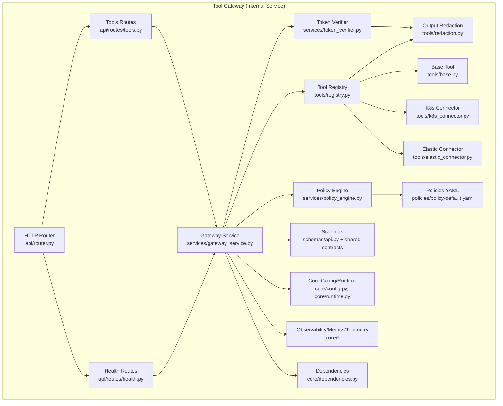

**Updated** Architecture diagram reflects the current structure with Elastic connector integration alongside Kubernetes connector

**Diagram sources**
- [router.py](file://products/tool-gateway/src/tool_gateway/api/router.py)
- [tools.py](file://products/tool-gateway/src/tool_gateway/api/routes/tools.py)
- [health.py](file://products/tool-gateway/src/tool_gateway/api/routes/health.py)
- [gateway_service.py](file://products/tool-gateway/src/tool_gateway/services/gateway_service.py)
- [policy_engine.py](file://products/tool-gateway/src/tool_gateway/services/policy_engine.py)
- [token_verifier.py](file://products/tool-gateway/src/tool_gateway/services/token_verifier.py)
- [registry.py](file://products/tool-gateway/src/tool_gateway/tools/registry.py)
- [base.py](file://products/tool-gateway/src/tool_gateway/tools/base.py)
- [k8s_connector.py](file://products/tool-gateway/src/tool_gateway/tools/k8s_connector.py)
- [elastic_connector.py](file://products/tool-gateway/src/tool_gateway/tools/elastic_connector.py)
- [redaction.py](file://products/tool-gateway/src/tool_gateway/tools/redaction.py)
- [policy-default.yaml](file://products/tool-gateway/src/tool_gateway/policies/policy-default.yaml)
- [config.py](file://products/tool-gateway/src/tool_gateway/core/config.py)
- [runtime.py](file://products/tool-gateway/src/tool_gateway/core/runtime.py)
- [metrics.py](file://products/tool-gateway/src/tool_gateway/core/metrics.py)
- [observability.py](file://products/tool-gateway/src/tool_gateway/core/observability.py)
- [telemetry.py](file://products/tool-gateway/src/tool_gateway/core/telemetry.py)
- [dependencies.py](file://products/tool-gateway/src/tool_gateway/core/dependencies.py)

**Section sources**
- [main.py](file://products/tool-gateway/src/tool_gateway/main.py)
- [app.py](file://products/tool-gateway/src/tool_gateway/app.py)
- [router.py](file://products/tool-gateway/src/tool_gateway/api/router.py)

## Core Components
- HTTP Router and Routes: Define endpoints for tool discovery and invocation, parse requests, and delegate to services.
- Gateway Service: Orchestrates request lifecycle, applies policy checks, invokes tools, and returns responses with automatic redaction.
- Policy Engine: Loads YAML policies, evaluates rules against request context, and makes allow/deny decisions for tool actions with enhanced `tools:list` and `tools:invoke` permissions.
- Token Verifier: Validates authentication tokens with audience verification for `tool-gateway` audience and enriches request context with identity information.
- Tool Registry: Discovers available tools from multiple connectors (Kubernetes, Elastic), manages their metadata, and executes them safely with input validation and output redaction.
- Output Redaction System: Automatically detects and redacts sensitive information from tool outputs using pattern matching and key-list filtering.
- **Enhanced Kubernetes Connector**: Provides safe abstractions for interacting with Kubernetes clusters across all namespaces using cluster-wide read-only ClusterRole permissions, enabling comprehensive diagnostic capabilities while maintaining strict read-only access controls.
- Elastic Connector: Provides read-only access to Elasticsearch for observability data including log search, service health metrics, and active alerts.
- Schemas and Contracts: Enforce consistent request/response shapes for tool invocations and results.
- Core Utilities: Configuration, runtime settings, observability, metrics, telemetry, request context propagation, and dependency injection.

**Updated** Component descriptions reflect the current implementation with Elastic connector integration and enhanced cluster-wide Kubernetes permissions

**Section sources**
- [gateway_service.py](file://products/tool-gateway/src/tool_gateway/services/gateway_service.py)
- [policy_engine.py](file://products/tool-gateway/src/tool_gateway/services/policy_engine.py)
- [token_verifier.py](file://products/tool-gateway/src/tool_gateway/services/token_verifier.py)
- [registry.py](file://products/tool-gateway/src/tool_gateway/tools/registry.py)
- [base.py](file://products/tool-gateway/src/tool_gateway/tools/base.py)
- [k8s_connector.py](file://products/tool-gateway/src/tool_gateway/tools/k8s_connector.py)
- [elastic_connector.py](file://products/tool-gateway/src/tool_gateway/tools/elastic_connector.py)
- [redaction.py](file://products/tool-gateway/src/tool_gateway/tools/redaction.py)
- [config.py](file://products/tool-gateway/src/tool_gateway/core/config.py)
- [metrics.py](file://products/tool-gateway/src/tool_gateway/core/metrics.py)
- [observability.py](file://products/tool-gateway/src/tool_gateway/core/observability.py)
- [telemetry.py](file://products/tool-gateway/src/tool_gateway/core/telemetry.py)
- [request_context.py](file://products/tool-gateway/src/tool_gateway/core/request_context.py)
- [dependencies.py](file://products/tool-gateway/src/tool_gateway/core/dependencies.py)

## Architecture Overview
The Tool Gateway follows a streamlined architecture focused on multi-source tool execution with enhanced security features including automatic output redaction. As an internal service, it receives requests from other platform services through well-defined APIs.

**Current Architecture:**
- API Layer: FastAPI routers expose endpoints for tool discovery and invocation only.
- Service Layer: Gateway orchestrates tool invocation flows; policy engine enforces rules for tool actions with enhanced permissions; token verifier authenticates with audience validation for `tool-gateway`.
- Tool Layer: Registry discovers and executes tools from multiple connectors; **enhanced Kubernetes connector provides cluster-wide read-only access**; Elastic connector provides observability data access; output redaction ensures sensitive data never leaves the service.
- Core Layer: Configuration, runtime, observability, metrics, telemetry, and request context support cross-cutting concerns.

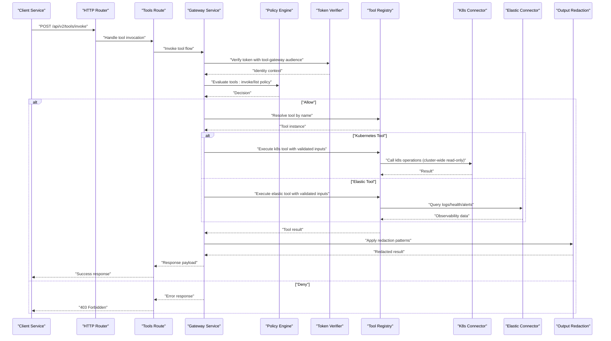

**Updated** Sequence diagram reflects the current architecture with both Kubernetes and Elastic connectors, highlighting cluster-wide read-only access

**Diagram sources**
- [router.py](file://products/tool-gateway/src/tool_gateway/api/router.py)
- [tools.py](file://products/tool-gateway/src/tool_gateway/api/routes/tools.py)
- [gateway_service.py](file://products/tool-gateway/src/tool_gateway/services/gateway_service.py)
- [policy_engine.py](file://products/tool-gateway/src/tool_gateway/services/policy_engine.py)
- [token_verifier.py](file://products/tool-gateway/src/tool_gateway/services/token_verifier.py)
- [registry.py](file://products/tool-gateway/src/tool_gateway/tools/registry.py)
- [k8s_connector.py](file://products/tool-gateway/src/tool_gateway/tools/k8s_connector.py)
- [elastic_connector.py](file://products/tool-gateway/src/tool_gateway/tools/elastic_connector.py)
- [redaction.py](file://products/tool-gateway/src/tool_gateway/tools/redaction.py)

## Detailed Component Analysis

### HTTP Router and Routes
- Router initializes FastAPI app and mounts route modules for tools and health.
- Tools routes provide direct tool invocation endpoints with request validation and automatic output redaction.
- Health routes provide service health and readiness endpoints.

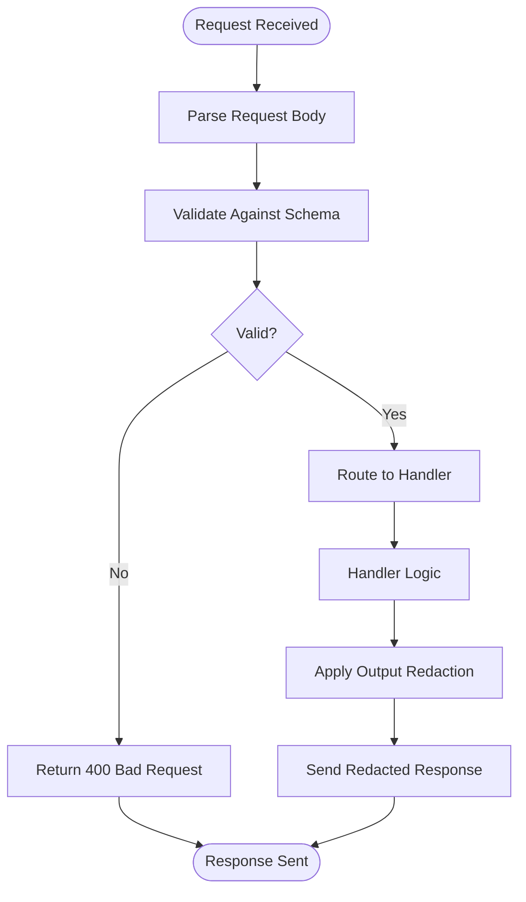

**Diagram sources**
- [router.py](file://products/tool-gateway/src/tool_gateway/api/router.py)
- [tools.py](file://products/tool-gateway/src/tool_gateway/api/routes/tools.py)
- [health.py](file://products/tool-gateway/src/tool_gateway/api/routes/health.py)

**Section sources**
- [router.py](file://products/tool-gateway/src/tool_gateway/api/router.py)
- [tools.py](file://products/tool-gateway/src/tool_gateway/api/routes/tools.py)
- [health.py](file://products/tool-gateway/src/tool_gateway/api/routes/health.py)

### Gateway Service with Output Redaction
Orchestrates the full request lifecycle with enhanced security and automatic output sanitization:
- Validates and enriches request context
- Invokes token verification with audience validation and policy evaluation
- Resolves and executes tools from multiple connectors via the registry
- Applies comprehensive output redaction before returning responses
- Handles errors and returns standardized responses with audit logging

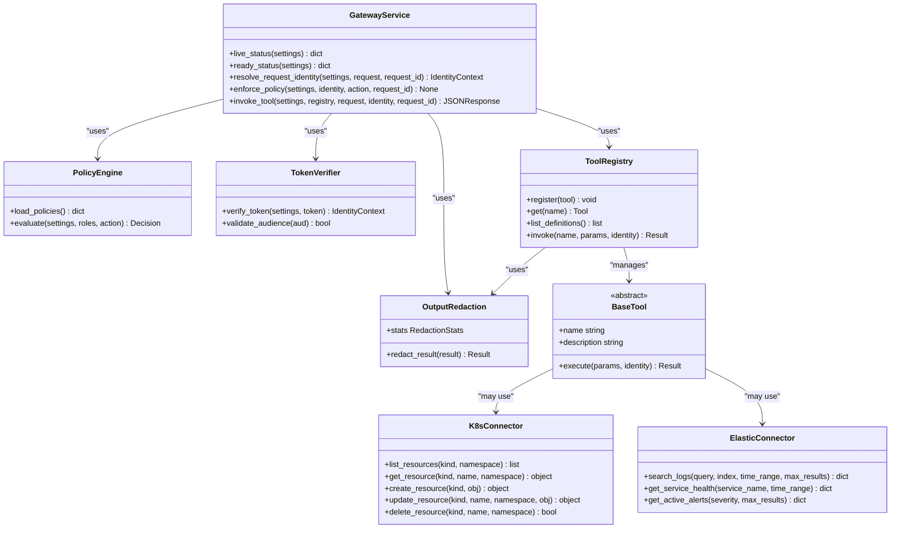

**Updated** Streamlined architecture with both Kubernetes and Elastic connectors integrated

**Diagram sources**
- [gateway_service.py](file://products/tool-gateway/src/tool_gateway/services/gateway_service.py)
- [policy_engine.py](file://products/tool-gateway/src/tool_gateway/services/policy_engine.py)
- [token_verifier.py](file://products/tool-gateway/src/tool_gateway/services/token_verifier.py)
- [registry.py](file://products/tool-gateway/src/tool_gateway/tools/registry.py)
- [base.py](file://products/tool-gateway/src/tool_gateway/tools/base.py)
- [k8s_connector.py](file://products/tool-gateway/src/tool_gateway/tools/k8s_connector.py)
- [elastic_connector.py](file://products/tool-gateway/src/tool_gateway/tools/elastic_connector.py)
- [redaction.py](file://products/tool-gateway/src/tool_gateway/tools/redaction.py)

**Section sources**
- [gateway_service.py](file://products/tool-gateway/src/tool_gateway/services/gateway_service.py)

### Policy Engine with Enhanced Permissions
- Loads YAML policy definitions from configured paths
- Evaluates rules against request context including identity, method, path, and parameters
- Returns allow/deny decisions with optional conditions for tool actions
- Supports enhanced `tools:list` and `tools:invoke` actions for observer roles
- Implements deny-by-default policy enforcement with explicit allow rules

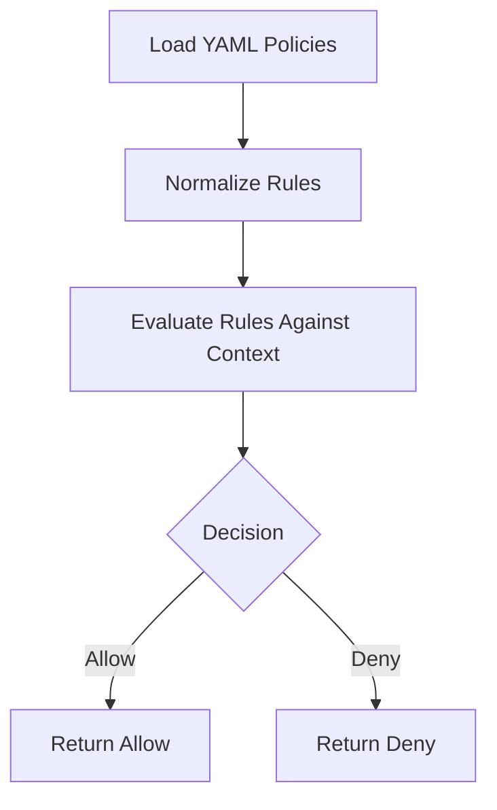

**Diagram sources**
- [policy_engine.py](file://products/tool-gateway/src/tool_gateway/services/policy_engine.py)
- [policy-default.yaml](file://products/tool-gateway/src/tool_gateway/policies/policy-default.yaml)

**Section sources**
- [policy_engine.py](file://products/tool-gateway/src/tool_gateway/services/policy_engine.py)
- [policy-default.yaml](file://products/tool-gateway/src/tool_gateway/policies/policy-default.yaml)

### Token Verifier with Audience Validation
Enhanced token verification with audience validation for `tool-gateway`:
- Validates JWT tokens with audience verification against `tool-gateway` audience
- Extracts and validates user identity and permissions
- Enriches request context with verified identity information
- Supports both direct token validation and delegated token workflows

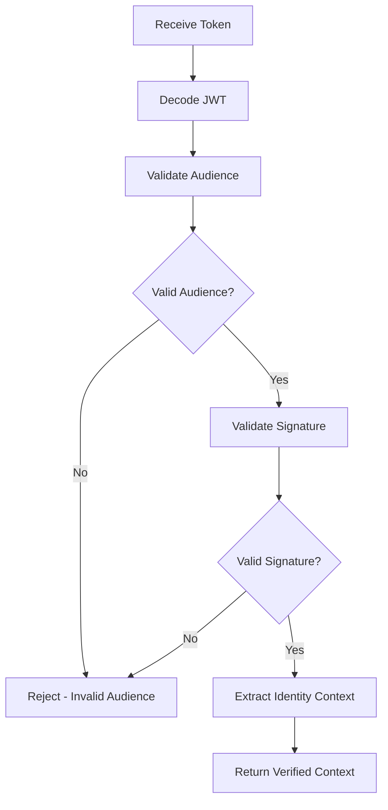

**Diagram sources**
- [token_verifier.py](file://products/tool-gateway/src/tool_gateway/services/token_verifier.py)
- [config.py](file://products/tool-gateway/src/tool_gateway/core/config.py)

**Section sources**
- [token_verifier.py](file://products/tool-gateway/src/tool_gateway/services/token_verifier.py)
- [config.py](file://products/tool-gateway/src/tool_gateway/core/config.py)

### Output Redaction System
Comprehensive tool output redaction system preventing credential leakage:
- Pattern-based matching for unambiguous credential formats (PEM private keys, JWTs, Bearer/Basic values, AWS-style access key IDs)
- Explicit key-list filtering for sensitive fields (password, secret, token, api_key, etc.)
- Fail-closed overflow protection to prevent excessive redaction
- Metrics tracking for redacted spans and overflow events
- Configurable enable/disable switch and overflow threshold

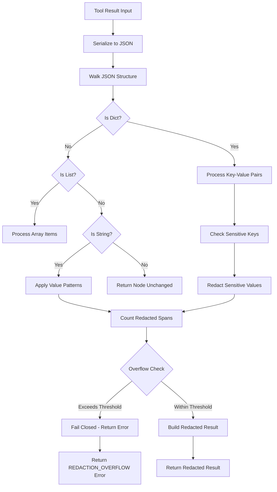

**New** Comprehensive output redaction system with pattern matching and key-list filtering

**Diagram sources**
- [redaction.py](file://products/tool-gateway/src/tool_gateway/tools/redaction.py)

**Section sources**
- [redaction.py](file://products/tool-gateway/src/tool_gateway/tools/redaction.py)

### Tool Registry and Base Tool
- Registry maintains a map of tool names to instances from multiple connectors
- Supports dynamic registration and resolution across different tool providers
- Executes tools with validated inputs and captures results/errors
- Integrates with output redaction system for automatic sanitization

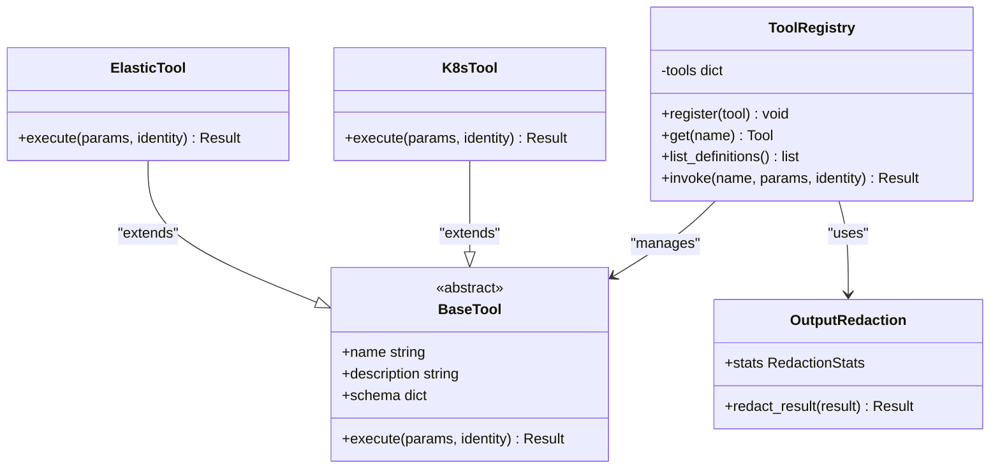

**Updated** Integrated with output redaction system and supports multiple tool providers

**Diagram sources**
- [registry.py](file://products/tool-gateway/src/tool_gateway/tools/registry.py)
- [base.py](file://products/tool-gateway/src/tool_gateway/tools/base.py)
- [k8s_connector.py](file://products/tool-gateway/src/tool_gateway/tools/k8s_connector.py)
- [elastic_connector.py](file://products/tool-gateway/src/tool_gateway/tools/elastic_connector.py)
- [redaction.py](file://products/tool-gateway/src/tool_gateway/tools/redaction.py)

**Section sources**
- [registry.py](file://products/tool-gateway/src/tool_gateway/tools/registry.py)
- [base.py](file://products/tool-gateway/src/tool_gateway/tools/base.py)

### Enhanced Kubernetes Connector with Cluster-Wide Read-Only Access
Provides safe abstractions for Kubernetes operations with **enhanced cluster-wide read-only access** enabled by the `luban-tool-gateway-readonly` ClusterRole:
- Resource listing, retrieval, creation, update, deletion across all namespaces
- **Cross-namespace operations for comprehensive diagnostic capabilities**
- **Cluster-wide read-only permissions for health checks across all namespaces**
- Strict read-only access controls with no mutating verbs granted
- Error handling and logging for cluster interactions

**Security Rationale**: The AIOps agent must be able to health-check and inspect workloads in ANY namespace (e.g., argocd, kube-system), not just the platform namespace. Every registered tool is read-only by contract (SPEC-007 risk_level=read) and invocations are additionally gated by the deny-by-default policy engine, so granting get/list/watch across the cluster is the intended blast radius. No mutating verbs are granted anywhere.

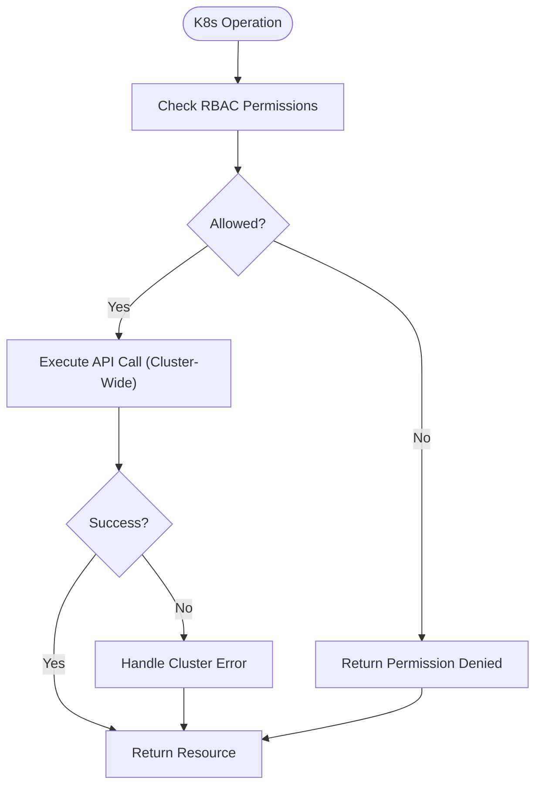

**Updated** Enhanced RBAC permissions enabling cluster-wide diagnostic capabilities while maintaining strict read-only access

**Diagram sources**
- [k8s_connector.py](file://products/tool-gateway/src/tool_gateway/tools/k8s_connector.py)
- [rbac.yaml](file://shared/platform-ops/gitops/dev-k8s/base/tool-gateway/rbac.yaml)

**Section sources**
- [k8s_connector.py](file://products/tool-gateway/src/tool_gateway/tools/k8s_connector.py)
- [rbac.yaml](file://shared/platform-ops/gitops/dev-k8s/base/tool-gateway/rbac.yaml)

### Elastic Connector for Observability Data
Provides read-only access to Elasticsearch for observability data with three main tools:
- **Search Logs**: Search logs using Kibana Query Language or simple text with configurable time ranges and result limits
- **Get Service Health**: Retrieve aggregated health metrics including error rates, request counts, and average latency
- **Get Active Alerts**: List active alerts from Elastic with optional severity filtering

Features include:
- Lazy client initialization with connection validation
- Support for API key and basic authentication
- Configurable TLS verification
- Parameter validation and clamping for time ranges and result limits
- Structured error handling for connection failures and invalid parameters
- Evidence building for audit trails

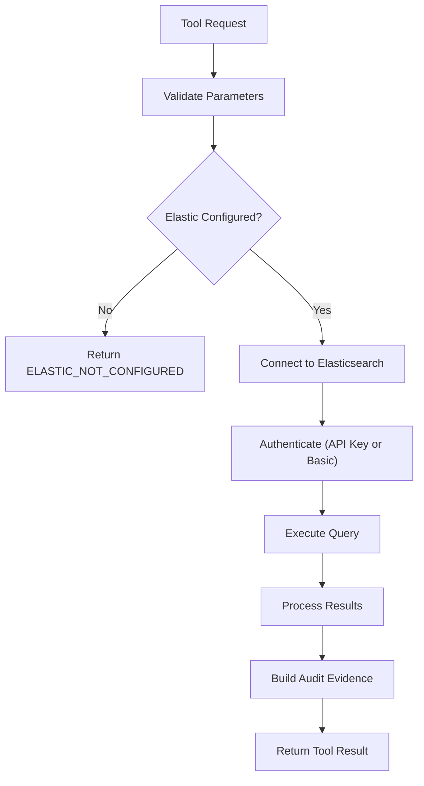

**New** Elastic connector provides comprehensive observability data access

**Diagram sources**
- [elastic_connector.py](file://products/tool-gateway/src/tool_gateway/tools/elastic_connector.py)

**Section sources**
- [elastic_connector.py](file://products/tool-gateway/src/tool_gateway/tools/elastic_connector.py)

### Schemas and Contracts
- Tool invocation schema defines required fields for tool calls
- Tool result schema standardizes responses across tools
- API schemas enforce request/response validation at the router level

**Section sources**
- [tool-invocation.schema.json](file://shared/shared-contracts/schemas/tool-invocation.schema.json)
- [tool-result.schema.json](file://shared/shared-contracts/schemas/tool-result.schema.json)

### Core Configuration and Runtime
- Configuration loads environment variables including audience validation settings and Elastic connector configuration
- Runtime settings manage service lifecycle and dependencies
- Observability, metrics, and telemetry provide monitoring and tracing
- Redaction configuration with enable/disable switches and overflow thresholds
- Dependency injection framework for service components

**Updated** Added Elastic connector configuration options and enhanced dependency injection

**Section sources**
- [config.py](file://products/tool-gateway/src/tool_gateway/core/config.py)
- [runtime.py](file://products/tool-gateway/src/tool_gateway/core/runtime.py)
- [observability.py](file://products/tool-gateway/src/tool_gateway/core/observability.py)
- [metrics.py](file://products/tool-gateway/src/tool_gateway/core/metrics.py)
- [telemetry.py](file://products/tool-gateway/src/tool_gateway/core/telemetry.py)
- [request_context.py](file://products/tool-gateway/src/tool_gateway/core/request_context.py)
- [dependencies.py](file://products/tool-gateway/src/tool_gateway/core/dependencies.py)

## Dependency Analysis
The Tool Gateway has clear dependency boundaries with focused security components:
- API routes depend on services for business logic
- Services depend on policy engine, token verifier, tool registry, and output redaction
- Tool registry depends on base tool implementations, connectors, and redaction system
- **Enhanced Kubernetes connector depends on cluster-wide RBAC permissions and policy enforcement**
- Elastic connector depends on Elasticsearch client and configuration
- Output redaction depends on tool result structures and metrics tracking

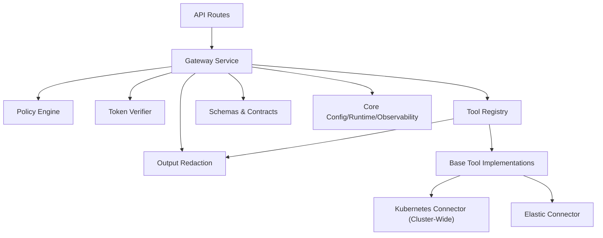

**Updated** Simplified dependency graph reflecting multi-connector architecture with enhanced Kubernetes permissions

**Diagram sources**
- [router.py](file://products/tool-gateway/src/tool_gateway/api/router.py)
- [gateway_service.py](file://products/tool-gateway/src/tool_gateway/services/gateway_service.py)
- [policy_engine.py](file://products/tool-gateway/src/tool_gateway/services/policy_engine.py)
- [token_verifier.py](file://products/tool-gateway/src/tool_gateway/services/token_verifier.py)
- [registry.py](file://products/tool-gateway/src/tool_gateway/tools/registry.py)
- [base.py](file://products/tool-gateway/src/tool_gateway/tools/base.py)
- [k8s_connector.py](file://products/tool-gateway/src/tool_gateway/tools/k8s_connector.py)
- [elastic_connector.py](file://products/tool-gateway/src/tool_gateway/tools/elastic_connector.py)
- [redaction.py](file://products/tool-gateway/src/tool_gateway/tools/redaction.py)
- [config.py](file://products/tool-gateway/src/tool_gateway/core/config.py)

**Section sources**
- [router.py](file://products/tool-gateway/src/tool_gateway/api/router.py)
- [gateway_service.py](file://products/tool-gateway/src/tool_gateway/services/gateway_service.py)
- [policy_engine.py](file://products/tool-gateway/src/tool_gateway/services/policy_engine.py)
- [token_verifier.py](file://products/tool-gateway/src/tool_gateway/services/token_verifier.py)
- [registry.py](file://products/tool-gateway/src/tool_gateway/tools/registry.py)
- [base.py](file://products/tool-gateway/src/tool_gateway/tools/base.py)
- [k8s_connector.py](file://products/tool-gateway/src/tool_gateway/tools/k8s_connector.py)
- [elastic_connector.py](file://products/tool-gateway/src/tool_gateway/tools/elastic_connector.py)
- [redaction.py](file://products/tool-gateway/src/tool_gateway/tools/redaction.py)
- [config.py](file://products/tool-gateway/src/tool_gateway/core/config.py)

## Performance Considerations
- Connection pooling for Kubernetes API calls across all namespaces
- Caching of policy evaluations for repeated contexts
- Efficient schema validation with minimal overhead
- Async I/O for non-blocking operations where possible
- Rate limiting at the router level to prevent abuse
- Metrics collection for performance monitoring and alerting
- Output redaction optimization with early exit for clean payloads
- Dependency injection for efficient service initialization
- Lazy initialization of Elastic connector connections
- Parameter clamping to prevent resource exhaustion in Elastic queries
- Time range limitations for log searches to prevent long-running queries
- **Optimized cluster-wide resource access patterns to minimize API call overhead**

## Troubleshooting Guide
Common issues and resolutions:
- Policy violations: Check policy definitions and request context
- Token validation failures: Verify token issuer, expiration, and audience matching for `tool-gateway`
- Audience validation errors: Ensure token audience matches `tool-gateway`
- Tool execution errors: Inspect tool logs and input validation
- **Kubernetes connectivity**: Validate cluster configuration and **cluster-wide RBAC permissions**
- **Cross-namespace access issues**: Verify `luban-tool-gateway-readonly` ClusterRole is properly bound
- **Diagnostic scope limitations**: Ensure proper ClusterRoleBinding for the tool-gateway ServiceAccount
- Elastic connectivity: Check Elastic URL, authentication credentials, and network connectivity
- Elastic configuration: Verify `GATEWAY_ELASTIC_ENABLED` and related environment variables
- Performance degradation: Monitor metrics and adjust rate limits
- Output redaction issues: Check redaction configuration and overflow thresholds
- Dependency injection problems: Verify service initialization and configuration
- Parameter validation errors: Review tool parameter schemas and constraints

**Updated** Added troubleshooting guidance for cluster-wide Kubernetes access and enhanced RBAC permissions

**Section sources**
- [policy_engine.py](file://products/tool-gateway/src/tool_gateway/services/policy_engine.py)
- [token_verifier.py](file://products/tool-gateway/src/tool_gateway/services/token_verifier.py)
- [registry.py](file://products/tool-gateway/src/tool_gateway/tools/registry.py)
- [k8s_connector.py](file://products/tool-gateway/src/tool_gateway/tools/k8s_connector.py)
- [elastic_connector.py](file://products/tool-gateway/src/tool_gateway/tools/elastic_connector.py)
- [redaction.py](file://products/tool-gateway/src/tool_gateway/tools/redaction.py)
- [metrics.py](file://products/tool-gateway/src/tool_gateway/core/metrics.py)
- [observability.py](file://products/tool-gateway/src/tool_gateway/core/observability.py)
- [dependencies.py](file://products/tool-gateway/src/tool_gateway/core/dependencies.py)

## Conclusion
The Tool Gateway Service provides a focused, secure, and extensible platform for internal tool execution with policy enforcement, secure tool invocation, and comprehensive output redaction. Its streamlined architecture enables easy extension with new tools while maintaining strong security and observability standards. The service now operates exclusively as an internal component, receiving requests from other platform services through well-defined APIs with delegated token authentication.

The platform-gateway extraction has successfully separated portal-facing responsibilities into the new `platform-gateway` service, allowing tool-gateway to focus solely on its core mandate of connector standardization and tool execution. Recent enhancements include the addition of Elastic connector for observability data access, **enhanced RBAC permissions with cluster-wide read-only access enabling comprehensive diagnostic capabilities across all namespaces**, and improved policy engine with `tools:list` and `tools:invoke` permissions for observer roles.

This architectural change improves ownership alignment, security boundaries, and maintainability while preserving all external contracts and functionality. The transition from namespaced Role to cluster-wide ClusterRole significantly enhances operational capabilities while maintaining strict read-only access controls.

## Appendices

### Platform Gateway Extraction Completion
The platform-gateway extraction (ADR-0005, SPEC-010) has been completed successfully, splitting the original monolithic service into two dedicated services:

**Completed Migration:**
- **platform-gateway**: Now handles portal-facing edge functionality including token verification, policy enforcement, chat/session proxying, and authentication flows
- **tool-gateway**: Focuses exclusively on tool execution, registry management, and multi-connector operations

**Component Separation:**
- **Moved to platform-gateway**: Token verification, policy engine, chat routes, session routes, auth routes, identity routes, runtime routes, delegation client, agent client
- **Remaining in tool-gateway**: Tool registry, base tool framework, k8s connector, elastic connector, output redaction, tools routes, health endpoints

**Impact Assessment:**
- External HTTP contracts remain unchanged for portal callers
- Service-to-service communication patterns follow ADR-0004 delegation model
- No behavioral changes beyond the structural split
- Improved ownership boundaries and security review scope

**Section sources**
- [0005-platform-gateway-extraction.md](file://docs/adr/0005-platform-gateway-extraction.md)
- [SPEC-010 spec.md](file://docs/specs/SPEC-010-platform-gateway-extraction/spec.md)

### Enhanced Kubernetes Integration with Cluster-Wide RBAC
- Deployment configuration for the Tool Gateway service
- Service exposure and networking setup
- **Cluster-wide RBAC policies enabling cross-namespace diagnostic capabilities**
- Policy configuration for runtime enforcement

**Security Model**: The `luban-tool-gateway-readonly` ClusterRole provides get/list/watch permissions across core, apps, batch, networking, and autoscaling API groups, enabling comprehensive cluster diagnostics while maintaining strict read-only access controls.

**Section sources**
- [tool-gateway-deployment.yaml](file://shared/platform-ops/gitops/dev-k8s/base/tool-gateway/tool-gateway-deployment.yaml)
- [tool-gateway-service.yaml](file://shared/platform-ops/gitops/dev-k8s/base/tool-gateway/tool-gateway-service.yaml)
- [rbac.yaml](file://shared/platform-ops/gitops/dev-k8s/base/tool-gateway/rbac.yaml)

### Policy Definition Examples
YAML-based policy definitions control access to tools and operations with enhanced permissions:
- Rule-based access control with conditions
- Identity-based permissions and scopes
- Method and path-based restrictions
- Parameter validation and sanitization
- Enhanced `tools:list` and `tools:invoke` permissions for observer roles

**Section sources**
- [policy-default.yaml](file://products/tool-gateway/src/tool_gateway/policies/policy-default.yaml)

### Tool Registration Examples
Tools are registered dynamically with metadata and schemas from multiple connectors:
- Tool name and description
- Input parameter schemas for validation
- Execution functions with error handling
- Integration with Kubernetes connector for cluster-wide operations
- Integration with Elastic connector for observability data access

**Section sources**
- [registry.py](file://products/tool-gateway/src/tool_gateway/tools/registry.py)
- [base.py](file://products/tool-gateway/src/tool_gateway/tools/base.py)
- [k8s_connector.py](file://products/tool-gateway/src/tool_gateway/tools/k8s_connector.py)
- [elastic_connector.py](file://products/tool-gateway/src/tool_gateway/tools/elastic_connector.py)

### Custom Tool Development Guidelines
When developing custom tools:
- Extend the base tool class for consistency
- Define input schemas for validation
- Implement error handling and logging
- Integrate with Kubernetes connector for cluster-wide operations
- Integrate with Elastic connector for observability data access
- Register tools with the registry for discovery
- Be aware that all tool outputs will be automatically redacted for security

**Updated** Added guidance for Elastic connector integration and automatic output redaction

**Section sources**
- [base.py](file://products/tool-gateway/src/tool_gateway/tools/base.py)
- [registry.py](file://products/tool-gateway/src/tool_gateway/tools/registry.py)
- [k8s_connector.py](file://products/tool-gateway/src/tool_gateway/tools/k8s_connector.py)
- [elastic_connector.py](file://products/tool-gateway/src/tool_gateway/tools/elastic_connector.py)
- [redaction.py](file://products/tool-gateway/src/tool_gateway/tools/redaction.py)

### Security Considerations
- Token verification with audience validation for `tool-gateway` audience
- **Enhanced RBAC enforcement with cluster-wide read-only access via `luban-tool-gateway-readonly` ClusterRole**
- Input validation and sanitization
- Policy-based access control with enhanced tool permissions
- Secure configuration management
- Automatic output redaction preventing credential leakage
- Fail-closed overflow protection for excessive redaction scenarios
- Elastic connector authentication with API key or basic auth
- Parameter validation and clamping to prevent resource exhaustion
- **Strict read-only access controls ensuring no mutating operations are permitted**

**Updated** Enhanced security model with Elastic connector considerations and improved cluster-wide RBAC permissions

**Section sources**
- [token_verifier.py](file://products/tool-gateway/src/tool_gateway/services/token_verifier.py)
- [policy_engine.py](file://products/tool-gateway/src/tool_gateway/services/policy_engine.py)
- [rbac.yaml](file://shared/platform-ops/gitops/dev-k8s/base/tool-gateway/rbac.yaml)
- [config.py](file://products/tool-gateway/src/tool_gateway/core/config.py)
- [redaction.py](file://products/tool-gateway/src/tool_gateway/tools/redaction.py)
- [elastic_connector.py](file://products/tool-gateway/src/tool_gateway/tools/elastic_connector.py)

### Rate Limiting and Monitoring Strategies
- Configure rate limits at the API gateway level
- Collect metrics for request volume and latency
- Implement distributed tracing for request flows
- Set up alerts for policy violations and errors
- Monitor Kubernetes API call rates and quotas across all namespaces
- Track redaction statistics and overflow events
- Monitor Elastic connector performance and query efficiency
- Track tool execution times and success rates
- **Monitor cluster-wide resource access patterns and API call volumes**

**Updated** Enhanced monitoring strategies with Elastic connector metrics and cluster-wide access monitoring

**Section sources**
- [metrics.py](file://products/tool-gateway/src/tool_gateway/core/metrics.py)
- [observability.py](file://products/tool-gateway/src/tool_gateway/core/observability.py)
- [telemetry.py](file://products/tool-gateway/src/tool_gateway/core/telemetry.py)

### Output Redaction Configuration
The output redaction system provides comprehensive protection against credential leakage:
- **Enable/Disable**: `GATEWAY_REDACTION_ENABLED` environment variable
- **Overflow Protection**: `GATEWAY_REDACTION_OVERFLOW_FRACTION` (default 0.2)
- **Pattern Matching**: Automatic detection of PEM keys, JWTs, Bearer tokens, AWS keys
- **Key-List Filtering**: Sensitive field names like password, secret, token, api_key
- **Metrics**: `gateway_tool_redacted_spans_total` counter for monitoring
- **Fail-Closed**: Excessive redaction triggers error responses instead of partial data

**Section sources**
- [redaction.py](file://products/tool-gateway/src/tool_gateway/tools/redaction.py)
- [config.py](file://products/tool-gateway/src/tool_gateway/core/config.py)
- [metrics.py](file://products/tool-gateway/src/tool_gateway/core/metrics.py)

### Elastic Connector Configuration
The Elastic connector provides observability data access with flexible configuration:
- **Enable/Disable**: `GATEWAY_ELASTIC_ENABLED` environment variable
- **Connection**: `GATEWAY_ELASTIC_URL` for Elasticsearch endpoint
- **Authentication**: `GATEWAY_ELASTIC_API_KEY` or `GATEWAY_ELASTIC_USERNAME`/`GATEWAY_ELASTIC_PASSWORD`
- **Security**: `GATEWAY_ELASTIC_VERIFY_TLS` for TLS certificate verification
- **Alerts Index**: `GATEWAY_ELASTIC_ALERTS_INDEX` for alert queries (default: `.alerts-*`)
- **Time Range Limits**: Maximum 1440 minutes for log searches
- **Result Limits**: Maximum 200 results per query

**New** Elastic connector configuration options for observability data access

**Section sources**
- [config.py](file://products/tool-gateway/src/tool_gateway/core/config.py)
- [elastic_connector.py](file://products/tool-gateway/src/tool_gateway/tools/elastic_connector.py)
- [test_elastic_connector.py](file://products/tool-gateway/tests/test_elastic_connector.py)

### RBAC Permission Changes - Release Notes Reference
The RBAC permissions have been significantly enhanced in Release 1:

**Change Summary**: Replaced tool-gateway's namespaced Role with a cluster-wide read-only ClusterRole (`luban-tool-gateway-readonly`: get/list/watch across core, apps, batch, networking, autoscaling) so the copilot can diagnose any namespace while remaining strictly read-only.

**Why It Matters**: 
- The audit trail that Release 1 promised is now actually emitted and inspectable in service logs
- Operators are no longer limited to one or two namespaces when asking for cluster diagnostics
- Cross-namespace diagnostic capabilities enable comprehensive cluster health monitoring

**Section sources**
- [2026-08-10-r1-hardening-grounded-responses-and-evidence-ux.md](file://docs/agentic-aiops-platform/release-notes/2026-08-10-r1-hardening-grounded-responses-and-evidence-ux.md)
- [rbac.yaml](file://shared/platform-ops/gitops/dev-k8s/base/tool-gateway/rbac.yaml)