# Tool Gateway Service

<cite>
**Referenced Files in This Document**
- [main.py](file://products/tool-gateway/src/tool_gateway/main.py)
- [app.py](file://products/tool-gateway/src/tool_gateway/app.py)
- [router.py](file://products/tool-gateway/src/tool_gateway/api/router.py)
- [tools.py](file://products/tool-gateway/src/tool_gateway/api/routes/tools.py)
- [health.py](file://products/tool-gateway/src/tool_gateway/api/routes/health.py)
- [gateway_service.py](file://products/tool-gateway/src/tool_gateway/services/gateway_service.py)
- [policy_engine.py](file://products/tool-gateway/src/tool_gateway/services/policy_engine.py)
- [token_verifier.py](file://products/tool-gateway/src/tool_gateway/services/token_verifier.py)
- [registry.py](file://products/tool-gateway/src/tool_gateway/tools/registry.py)
- [base.py](file://products/tool-gateway/src/tool_gateway/tools/base.py)
- [browser_connector.py](file://products/tool-gateway/src/tool_gateway/tools/browser_connector.py)
- [browser_sessions.py](file://products/tool-gateway/src/tool_gateway/tools/browser_sessions.py)
- [credential_sets.py](file://products/tool-gateway/src/tool_gateway/tools/credential_sets.py)
- [k8s_connector.py](file://products/tool-gateway/src/tool_gateway/tools/k8s_connector.py)
- [elastic_connector.py](file://products/tool-gateway/src/tool_gateway/tools/elastic_connector.py)
- [incidents_connector.py](file://products/tool-gateway/src/tool_gateway/tools/incidents_connector.py)
- [skills_connector.py](file://products/tool-gateway/src/tool_gateway/tools/skills_connector.py)
- [redaction.py](file://products/tool-gateway/src/tool_gateway/tools/redaction.py)
- [request_context.py](file://products/tool-gateway/src/tool_gateway/core/request_context.py)
- [api.py](file://products/tool-gateway/src/tool_gateway/schemas/api.py)
- [identity-context.schema.json](file://shared/shared-contracts/schemas/identity-context.schema.json)
- [spec.md](file://docs/specs/SPEC-029-skills-usage-audit-trail/spec.md)
- [test_skills_connector.py](file://products/tool-gateway/tests/test_skills_connector.py)
- [policy-default.yaml](file://products/tool-gateway/src/tool_gateway/policies/policy-default.yaml)
- [config.py](file://products/tool-gateway/src/tool_gateway/core/config.py)
- [metrics.py](file://products/tool-gateway/src/tool_gateway/core/metrics.py)
- [observability.py](file://products/tool-gateway/src/tool_gateway/core/observability.py)
- [telemetry.py](file://products/tool-gateway/src/tool_gateway/core/telemetry.py)
- [runtime.py](file://products/tool-gateway/src/tool_gateway/core/runtime.py)
- [dependencies.py](file://products/tool-gateway/src/tool_gateway/core/dependencies.py)
- [rbac.yaml](file://shared/platform-ops/gitops/dev-k8s/base/tool-gateway/rbac.yaml)
- [tool-gateway-deployment.yaml](file://shared/platform-ops/gitops/dev-k8s/base/tool-gateway/tool-gateway-deployment.yaml)
- [tool-gateway-service.yaml](file://shared/platform-ops/gitops/dev-k8s/base/tool-gateway/tool-gateway-service.yaml)
- [test_elastic_connector.py](file://products/tool-gateway/tests/test_elastic_connector.py)
- [test_incidents_connector.py](file://products/tool-gateway/tests/test_incidents_connector.py)
- [test_k8s_connector.py](file://products/tool-gateway/tests/test_k8s_connector.py)
- [test_browser_connector.py](file://products/tool-gateway/tests/test_browser_connector.py)
- [mutating-demo.sh](file://shared/platform-ops/e2e/mutating-demo.sh)
- [0005-platform-gateway-extraction.md](file://docs/adr/0005-platform-gateway-extraction.md)
- [SPEC-010 spec.md](file://docs/specs/SPEC-010-platform-gateway-extraction/spec.md)
- [2026-08-10-r1-hardening-grounded-responses-and-evidence-ux.md](file://docs/agentic-aiops-platform/release-notes/2026-08-10-r1-hardening-grounded-responses-and-evidence-ux.md)
- [2026-09-02-spec-049-browser-web-check-tools.md](file://docs/agentic-aiops-platform/release-notes/2026-09-02-spec-049-browser-web-check-tools.md)
</cite>

## Update Summary
**Changes Made**
- Added comprehensive browser connector tools documentation including web.navigate, web.snapshot, web.screenshot, web.fill_credential, web.click, and web.type
- Documented Playwright-based headless browser automation with stateful session management
- Added browser session pool implementation details with CDP connectivity and TTL-based eviction
- Integrated credential set management for secure login flows with automatic masking
- Added flow binding and deviation guard mechanisms for security enforcement
- Updated architecture diagrams to include browser connector components
- Enhanced policy configuration for browser tool risk tiers and approval workflows
- Added comprehensive testing coverage for browser connector functionality

## Table of Contents
1. [Introduction](#introduction)
2. [Project Structure](#project-structure)
3. [Core Components](#core-components)
4. [Architecture Overview](#architecture-overview)
5. [Detailed Component Analysis](#detailed-component-analysis)
6. [Dependency Analysis](#dependency-analysis)
7. [Performance Considerations](#performance-considerations)
8. [Troubleshooting Guide](#troubleshooting-guide)
9. [Conclusion](#conclusion)
10. [Appendices](#appendices)

## Introduction
The Tool Gateway Service is now a focused internal service responsible exclusively for tool execution, registry management, and multi-source connector operations. Following the completion of the platform-gateway extraction (ADR-0005, SPEC-010), the service has been refactored from a monolithic API gateway to concentrate solely on secure tool invocation, policy enforcement for tool actions, and comprehensive output redaction capabilities.

As an internal service, tool-gateway receives requests from agent-platform and platform-gateway through well-defined APIs with delegated token authentication. The service enforces policies defined in YAML, validates tokens with audience verification, executes tools via a registry that supports safe discovery and invocation, and automatically redacts sensitive information from tool outputs before they leave the service.

Key responsibilities (current):
- Internal HTTP API surface for tool discovery and invocation (`/api/v2/tools`)
- Policy evaluation for tool-specific actions using YAML-based definitions with enhanced `tools:list`, `tools:invoke`, and `tools:mutate` permissions
- Secure token verification with audience validation for `tool-gateway` audience
- Multi-source tool registry supporting Kubernetes, Elastic, Incidents, Skills, and Browser connectors with safe discovery and invocation
- **Enhanced request correlation** enabling end-to-end audit trail tracking through x-request-id header propagation to downstream services
- **Risk-tier admission control** preventing unauthorized access to mutating tools through GATEWAY_MUTATING_TOOLS_ENABLED
- Comprehensive output redaction system preventing credential leakage
- **Enhanced Kubernetes integration via cluster-wide read-only ClusterRole enabling cross-namespace diagnostic capabilities**
- **New bounded mutating tool support** with k8s.delete_pod for controlled pod restart operations
- **Browser connector tools** providing web application interaction capabilities through Playwright-based headless browser automation
- Elastic connector integration for observability data access including log search, service health metrics, and alert management
- Incidents connector integration for querying incident data through the new incident service
- Skills connector integration for accessing team-owned operational skills and runbooks with full audit trail correlation
- Observability, metrics, and telemetry for monitoring and debugging

**Important Note**: The platform-gateway extraction is complete. Portal-facing responsibilities including chat/session proxying, authentication flows, and delegation client functionality have moved to the new `platform-gateway` service, leaving tool-gateway focused exclusively on tool execution and connector management.

## Project Structure
The Tool Gateway is implemented as a Python service under products/tool-gateway. Core modules include:
- API layer: FastAPI routers and route handlers for tools and health endpoints
- Services: Gateway orchestration, policy engine, and token verifier
- Tools: Base tool abstraction, registry, Browser connector, Kubernetes connector, Elastic connector, Incidents connector, Skills connector, and output redaction system
- Core: Configuration, runtime, observability, metrics, telemetry, request context, dependencies
- Schemas: Shared contract schemas for tool invocations and results
- Policies: Default YAML policy definitions with enhanced tool permissions including mutating actions

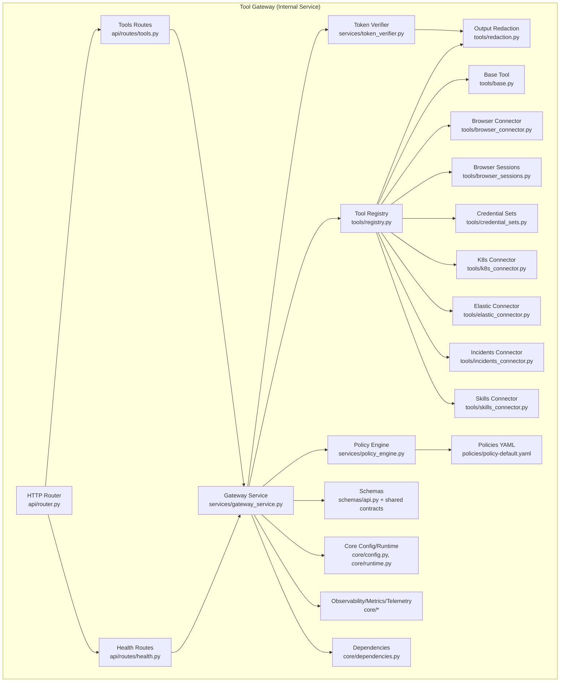

**Updated** Architecture diagram reflects the current structure with all five connectors including the new browser connector and enhanced request correlation capabilities

**Diagram sources**
- [router.py](file://products/tool-gateway/src/tool_gateway/api/router.py)
- [tools.py](file://products/tool-gateway/src/tool_gateway/api/routes/tools.py)
- [health.py](file://products/tool-gateway/src/tool_gateway/api/routes/health.py)
- [gateway_service.py](file://products/tool-gateway/src/tool_gateway/services/gateway_service.py)
- [policy_engine.py](file://products/tool-gateway/src/tool_gateway/services/policy_engine.py)
- [token_verifier.py](file://products/tool-gateway/src/tool_gateway/services/token_verifier.py)
- [registry.py](file://products/tool-gateway/src/tool_gateway/tools/registry.py)
- [base.py](file://products/tool-gateway/src/tool_gateway/tools/base.py)
- [browser_connector.py](file://products/tool-gateway/src/tool_gateway/tools/browser_connector.py)
- [browser_sessions.py](file://products/tool-gateway/src/tool_gateway/tools/browser_sessions.py)
- [credential_sets.py](file://products/tool-gateway/src/tool_gateway/tools/credential_sets.py)
- [k8s_connector.py](file://products/tool-gateway/src/tool_gateway/tools/k8s_connector.py)
- [elastic_connector.py](file://products/tool-gateway/src/tool_gateway/tools/elastic_connector.py)
- [incidents_connector.py](file://products/tool-gateway/src/tool_gateway/tools/incidents_connector.py)
- [skills_connector.py](file://products/tool-gateway/src/tool_gateway/tools/skills_connector.py)
- [redaction.py](file://products/tool-gateway/src/tool_gateway/tools/redaction.py)
- [policy-default.yaml](file://products/tool-gateway/src/tool_gateway/policies/policy-default.yaml)
- [config.py](file://products/tool-gateway/src/tool_gateway/core/config.py)
- [runtime.py](file://products/tool-gateway/src/tool_gateway/core/runtime.py)
- [metrics.py](file://products/tool-gateway/src/tool_gateway/core/metrics.py)
- [observability.py](file://products/tool-gateway/src/tool_gateway/core/observability.py)
- [telemetry.py](file://products/tool-gateway/src/tool_gateway/core/telemetry.py)
- [dependencies.py](file://products/tool-gateway/src/tool_gateway/core/dependencies.py)

**Section sources**
- [main.py](file://products/tool-gateway/src/tool_gateway/main.py)
- [app.py](file://products/tool-gateway/src/tool_gateway/app.py)
- [router.py](file://products/tool-gateway/src/tool_gateway/api/router.py)

## Core Components
- HTTP Router and Routes: Define endpoints for tool discovery and invocation, parse requests, and delegate to services.
- Gateway Service: Orchestrates request lifecycle, applies policy checks, invokes tools, and returns responses with automatic redaction.
- Policy Engine: Loads YAML policies, evaluates rules against request context, and makes allow/deny decisions for tool actions with enhanced `tools:list`, `tools:invoke`, and `tools:mutate` permissions.
- Token Verifier: Validates authentication tokens with audience verification for `tool-gateway` audience and enriches request context with identity information.
- **Enhanced Tool Registry**: Discovers available tools from multiple connectors with risk-tier admission control, manages their metadata, and executes them safely with input validation and output redaction.
- Output Redaction System: Automatically detects and redacts sensitive information from tool outputs using pattern matching and key-list filtering.
- **Enhanced Request Correlation**: Propagates x-request-id headers through the entire tool execution pipeline to enable end-to-end audit trail tracking from initial tool invocation through downstream service calls.
- **Enhanced Kubernetes Connector**: Provides safe abstractions for interacting with Kubernetes clusters across all namespaces using cluster-wide read-only ClusterRole permissions, enabling comprehensive diagnostic capabilities while maintaining strict read-only access controls, plus bounded mutating operations through k8s.delete_pod.
- **Browser Connector**: Provides web application interaction capabilities through Playwright-based headless browser automation with stateful session management, origin allowlist enforcement, flow binding, and credential set management.
- Elastic Connector: Provides read-only access to Elasticsearch for observability data including log search, service health metrics, and active alerts.
- Incidents Connector: Provides read-only access to the incident-service query API for listing and retrieving incident data with proper authentication and parameter validation.
- Skills Connector: Provides read-only access to the skills-hub retrieval API for searching and retrieving team-owned operational skills and runbooks with full audit trail correlation.
- Schemas and Contracts: Enforce consistent request/response shapes for tool invocations and results.
- Core Utilities: Configuration, runtime settings, observability, metrics, telemetry, request context propagation, and dependency injection.

**Updated** Component descriptions reflect the current implementation with enhanced request correlation capabilities and all five connectors integrated including the new browser connector

**Section sources**
- [gateway_service.py](file://products/tool-gateway/src/tool_gateway/services/gateway_service.py)
- [policy_engine.py](file://products/tool-gateway/src/tool_gateway/services/policy_engine.py)
- [token_verifier.py](file://products/tool-gateway/src/tool_gateway/services/token_verifier.py)
- [registry.py](file://products/tool-gateway/src/tool_gateway/tools/registry.py)
- [base.py](file://products/tool-gateway/src/tool_gateway/tools/base.py)
- [browser_connector.py](file://products/tool-gateway/src/tool_gateway/tools/browser_connector.py)
- [browser_sessions.py](file://products/tool-gateway/src/tool_gateway/tools/browser_sessions.py)
- [credential_sets.py](file://products/tool-gateway/src/tool_gateway/tools/credential_sets.py)
- [k8s_connector.py](file://products/tool-gateway/src/tool_gateway/tools/k8s_connector.py)
- [elastic_connector.py](file://products/tool-gateway/src/tool_gateway/tools/elastic_connector.py)
- [incidents_connector.py](file://products/tool-gateway/src/tool_gateway/tools/incidents_connector.py)
- [skills_connector.py](file://products/tool-gateway/src/tool_gateway/tools/skills_connector.py)
- [redaction.py](file://products/tool-gateway/src/tool_gateway/tools/redaction.py)
- [config.py](file://products/tool-gateway/src/tool_gateway/core/config.py)
- [metrics.py](file://products/tool-gateway/src/tool_gateway/core/metrics.py)
- [observability.py](file://products/tool-gateway/src/tool_gateway/core/observability.py)
- [telemetry.py](file://products/tool-gateway/src/tool_gateway/core/telemetry.py)
- [request_context.py](file://products/tool-gateway/src/tool_gateway/core/request_context.py)
- [dependencies.py](file://products/tool-gateway/src/tool_gateway/core/dependencies.py)

## Architecture Overview
The Tool Gateway follows a streamlined architecture focused on multi-source tool execution with enhanced security features including automatic output redaction, risk-tier admission control, and comprehensive request correlation. As an internal service, it receives requests from other platform services through well-defined APIs.

**Current Architecture:**
- API Layer: FastAPI routers expose endpoints for tool discovery and invocation only.
- Service Layer: Gateway orchestrates tool invocation flows; policy engine enforces rules for tool actions with enhanced permissions including mutating actions; token verifier authenticates with audience validation for `tool-gateway`.
- Tool Layer: Registry discovers and executes tools from multiple connectors with risk-tier admission control; **enhanced request correlation propagates x-request-id headers through the entire pipeline**; **enhanced Kubernetes connector provides cluster-wide read-only access plus bounded mutating operations**; **browser connector provides web application interaction capabilities with stateful sessions and flow binding**; Elastic connector provides observability data access; incidents connector provides incident data access; skills connector provides skills and runbook access; output redaction ensures sensitive data never leaves the service.
- Core Layer: Configuration, runtime, observability, metrics, telemetry, and request context support cross-cutting concerns.

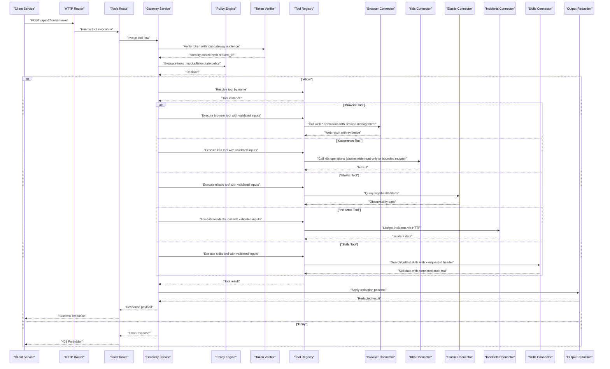

**Updated** Sequence diagram reflects the current architecture with enhanced request correlation and all five connectors integrated including the new browser connector

**Diagram sources**
- [router.py](file://products/tool-gateway/src/tool_gateway/api/router.py)
- [tools.py](file://products/tool-gateway/src/tool_gateway/api/routes/tools.py)
- [gateway_service.py](file://products/tool-gateway/src/tool_gateway/services/gateway_service.py)
- [policy_engine.py](file://products/tool-gateway/src/tool_gateway/services/policy_engine.py)
- [token_verifier.py](file://products/tool-gateway/src/tool_gateway/services/token_verifier.py)
- [registry.py](file://products/tool-gateway/src/tool_gateway/tools/registry.py)
- [browser_connector.py](file://products/tool-gateway/src/tool_gateway/tools/browser_connector.py)
- [browser_sessions.py](file://products/tool-gateway/src/tool_gateway/tools/browser_sessions.py)
- [k8s_connector.py](file://products/tool-gateway/src/tool_gateway/tools/k8s_connector.py)
- [elastic_connector.py](file://products/tool-gateway/src/tool_gateway/tools/elastic_connector.py)
- [incidents_connector.py](file://products/tool-gateway/src/tool_gateway/tools/incidents_connector.py)
- [skills_connector.py](file://products/tool-gateway/src/tool_gateway/tools/skills_connector.py)
- [redaction.py](file://products/tool-gateway/src/tool_gateway/tools/redaction.py)

## Detailed Component Analysis

### HTTP Router and Routes
- Router initializes FastAPI app and mounts route modules for tools and health.
- Tools routes provide direct tool invocation endpoints with request validation and automatic output redaction.
- Health routes provide service health and readiness endpoints.

**Diagram sources**
- [router.py](file://products/tool-gateway/src/tool_gateway/api/router.py)
- [tools.py](file://products/tool-gateway/src/tool_gateway/api/routes/tools.py)
- [health.py](file://products/tool-gateway/src/tool_gateway/api/routes/health.py)

**Section sources**
- [router.py](file://products/tool-gateway/src/tool_gateway/api/router.py)
- [tools.py](file://products/tool-gateway/src/tool_gateway/api/routes/tools.py)
- [health.py](file://products/tool-gateway/src/tool_gateway/api/routes/health.py)

### Gateway Service with Risk-Tier Admission Control and Request Correlation
Orchestrates the full request lifecycle with enhanced security, automatic output sanitization, and comprehensive request correlation:
- Validates and enriches request context with request_id for correlation
- Invokes token verification with audience validation and policy evaluation
- **Implements risk-tier admission control** requiring separate authorization for mutating tools
- Resolves and executes tools from multiple connectors via the registry
- **Propagates request_id through identity context to downstream connectors for end-to-end audit trail correlation**
- Applies comprehensive output redaction before returning responses
- Handles errors and returns standardized responses with audit logging

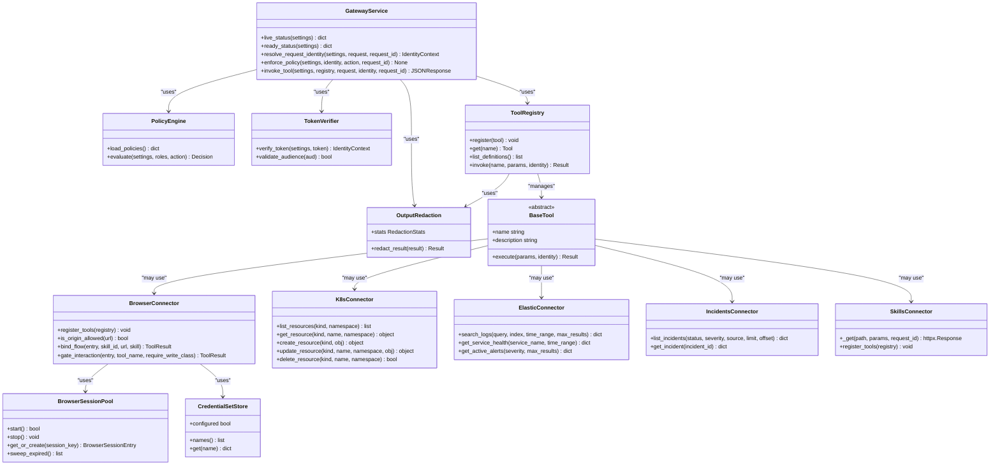

**Updated** Streamlined architecture with enhanced request correlation, risk-tier admission control, and all five connectors integrated including the new browser connector with session management

**Diagram sources**
- [gateway_service.py](file://products/tool-gateway/src/tool_gateway/services/gateway_service.py)
- [policy_engine.py](file://products/tool-gateway/src/tool_gateway/services/policy_engine.py)
- [token_verifier.py](file://products/tool-gateway/src/tool_gateway/services/token_verifier.py)
- [registry.py](file://products/tool-gateway/src/tool_gateway/tools/registry.py)
- [base.py](file://products/tool-gateway/src/tool_gateway/tools/base.py)
- [browser_connector.py](file://products/tool-gateway/src/tool_gateway/tools/browser_connector.py)
- [browser_sessions.py](file://products/tool-gateway/src/tool_gateway/tools/browser_sessions.py)
- [credential_sets.py](file://products/tool-gateway/src/tool_gateway/tools/credential_sets.py)
- [k8s_connector.py](file://products/tool-gateway/src/tool_gateway/tools/k8s_connector.py)
- [elastic_connector.py](file://products/tool-gateway/src/tool_gateway/tools/elastic_connector.py)
- [incidents_connector.py](file://products/tool-gateway/src/tool_gateway/tools/incidents_connector.py)
- [skills_connector.py](file://products/tool-gateway/src/tool_gateway/tools/skills_connector.py)
- [redaction.py](file://products/tool-gateway/src/tool_gateway/tools/redaction.py)

**Section sources**
- [gateway_service.py](file://products/tool-gateway/src/tool_gateway/services/gateway_service.py)

### Policy Engine with Enhanced Permissions
- Loads YAML policy definitions from configured paths
- Evaluates rules against request context including identity, method, path, and parameters
- Returns allow/deny decisions with optional conditions for tool actions
- Supports enhanced `tools:list`, `tools:invoke`, and `tools:mutate` actions for different permission levels
- Implements deny-by-default policy enforcement with explicit allow rules
- **Added tools:mutate action** specifically for write/admin risk tools requiring additional authorization

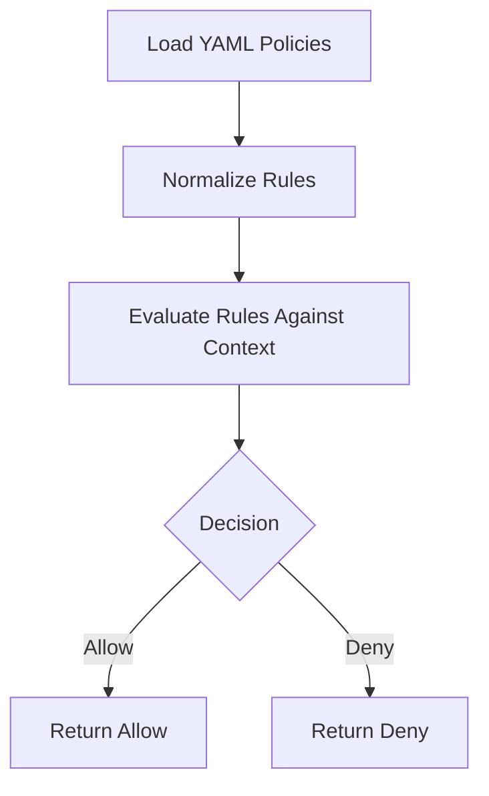

**Diagram sources**
- [policy_engine.py](file://products/tool-gateway/src/tool_gateway/services/policy_engine.py)
- [policy-default.yaml](file://products/tool-gateway/src/tool_gateway/policies/policy-default.yaml)

**Section sources**
- [policy_engine.py](file://products/tool-gateway/src/tool_gateway/services/policy_engine.py)
- [policy-default.yaml](file://products/tool-gateway/src/tool_gateway/policies/policy-default.yaml)

### Token Verifier with Audience Validation
Enhanced token verification with audience validation for `tool-gateway`:
- Validates JWT tokens with audience verification against `tool-gateway` audience
- Extracts and validates user identity and permissions
- Enriches request context with verified identity information
- Supports both direct token validation and delegated token workflows

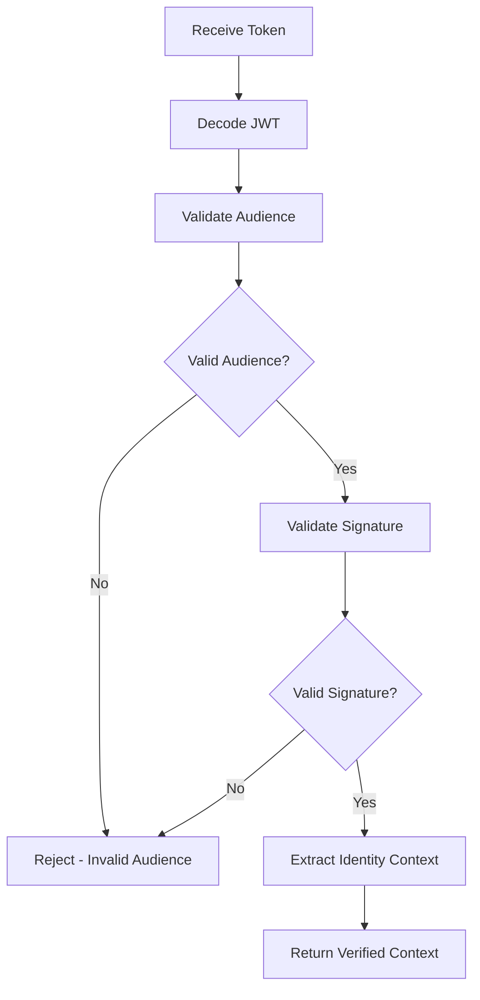

**Diagram sources**
- [token_verifier.py](file://products/tool-gateway/src/tool_gateway/services/token_verifier.py)
- [config.py](file://products/tool-gateway/src/tool_gateway/core/config.py)

**Section sources**
- [token_verifier.py](file://products/tool-gateway/src/tool_gateway/services/token_verifier.py)
- [config.py](file://products/tool-gateway/src/tool_gateway/core/config.py)

### Output Redaction System
Comprehensive tool output redaction system preventing credential leakage:
- Pattern-based matching for unambiguous credential formats (PEM private keys, JWTs, Bearer/Basic values, AWS-style access key IDs)
- Explicit key-list filtering for sensitive fields (password, secret, token, api_key, etc.)
- Fail-closed overflow protection to prevent excessive redaction
- Metrics tracking for redacted spans and overflow events
- Configurable enable/disable switch and overflow threshold

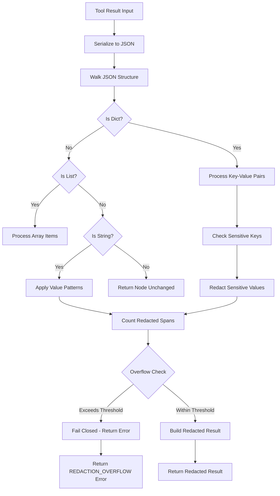

**New** Comprehensive output redaction system with pattern matching and key-list filtering

**Diagram sources**
- [redaction.py](file://products/tool-gateway/src/tool_gateway/tools/redaction.py)

**Section sources**
- [redaction.py](file://products/tool-gateway/src/tool_gateway/tools/redaction.py)

### Enhanced Tool Registry with Risk-Tier Admission Control
- Registry maintains a map of tool names to instances from multiple connectors
- **Implements risk-tier admission control** refusing write/admin risk tools when GATEWAY_MUTATING_TOOLS_ENABLED is disabled
- Supports dynamic registration and resolution across different tool providers
- Executes tools with validated inputs and captures results/errors
- Integrates with output redaction system for automatic sanitization
- **Propagates request_id through identity context to enable end-to-end correlation**

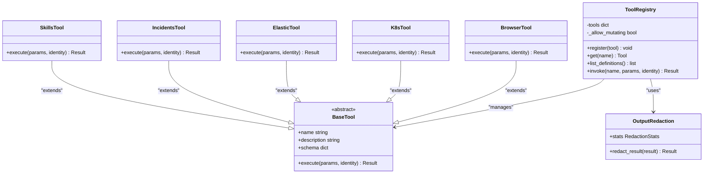

**Updated** Integrated with risk-tier admission control, output redaction system, and enhanced request correlation supporting all five tool providers including the new browser connector

**Diagram sources**
- [registry.py](file://products/tool-gateway/src/tool_gateway/tools/registry.py)
- [base.py](file://products/tool-gateway/src/tool_gateway/tools/base.py)
- [browser_connector.py](file://products/tool-gateway/src/tool_gateway/tools/browser_connector.py)
- [k8s_connector.py](file://products/tool-gateway/src/tool_gateway/tools/k8s_connector.py)
- [elastic_connector.py](file://products/tool-gateway/src/tool_gateway/tools/elastic_connector.py)
- [incidents_connector.py](file://products/tool-gateway/src/tool_gateway/tools/incidents_connector.py)
- [skills_connector.py](file://products/tool-gateway/src/tool_gateway/tools/skills_connector.py)
- [redaction.py](file://products/tool-gateway/src/tool_gateway/tools/redaction.py)

**Section sources**
- [registry.py](file://products/tool-gateway/src/tool_gateway/tools/registry.py)
- [base.py](file://products/tool-gateway/src/tool_gateway/tools/base.py)

### Enhanced Kubernetes Connector with Cluster-Wide Read-Only Access and Bounded Mutating Operations
Provides safe abstractions for Kubernetes operations with **enhanced cluster-wide read-only access** enabled by the `luban-tool-gateway-readonly` ClusterRole:
- Resource listing, retrieval, creation, update, deletion across all namespaces
- **Cross-namespace operations for comprehensive diagnostic capabilities**
- **Cluster-wide read-only permissions for health checks across all namespaces**
- **New bounded mutating operation**: k8s.delete_pod for controlled pod restart primitive
- Strict read-only access controls with no mutating verbs granted except through explicit opt-in
- Error handling and logging for cluster interactions

**Security Rationale**: The AIOps agent must be able to health-check and inspect workloads in ANY namespace (e.g., argocd, kube-system), not just the platform namespace. Every registered tool is read-only by contract (SPEC-007 risk_level=read) and invocations are additionally gated by the deny-by-default policy engine, so granting get/list/watch across the cluster is the intended blast radius. No mutating verbs are granted anywhere except through the bounded k8s.delete_pod tool which requires explicit GATEWAY_MUTATING_TOOLS_ENABLED activation.

**Updated** Enhanced RBAC permissions enabling cluster-wide diagnostic capabilities plus bounded mutating operations while maintaining strict access controls

**Diagram sources**
- [k8s_connector.py](file://products/tool-gateway/src/tool_gateway/tools/k8s_connector.py)
- [rbac.yaml](file://shared/platform-ops/gitops/dev-k8s/base/tool-gateway/rbac.yaml)

**Section sources**
- [k8s_connector.py](file://products/tool-gateway/src/tool_gateway/tools/k8s_connector.py)
- [rbac.yaml](file://shared/platform-ops/gitops/dev-k8s/base/tool-gateway/rbac.yaml)

### Browser Connector with Stateful Session Management and Flow Binding
Provides web application interaction capabilities through Playwright-based headless browser automation with comprehensive security controls:

**Core Features**:
- **Stateful Browser Sessions**: Manages browser contexts per chat session ID with TTL-based expiration and capacity limits
- **Origin Allowlist Enforcement**: Server-side URL allowlist prevents navigation to unauthorized origins with deny-by-default posture
- **Flow Binding and Deviation Guard**: Validates skill-declared web targets and prevents off-flow interactions
- **Credential Set Management**: Secure login flows using named credential sets with automatic value masking
- **Screenshot Capabilities**: Bounded JPEG screenshots with quality adjustment and size limits
- **Interactive Element Handling**: Snapshot-based element references for click and type operations

**Security Controls**:
- Origin allowlist validation prevents navigation outside authorized domains
- Flow binding ensures interactions occur only within approved web-check flows
- Credential values are masked in snapshots and screenshots to prevent leaks
- Write-tier operations require explicit mutation approval through existing HITL gates
- Deviation guard prevents interactions on pages that drift from approved flow origins

**Tool Surface**:
- **Read Tier**: `web.navigate`, `web.snapshot`, `web.screenshot`, `web.fill_credential`
- **Write Tier**: `web.click`, `web.type` (require GATEWAY_MUTATING_TOOLS_ENABLED)

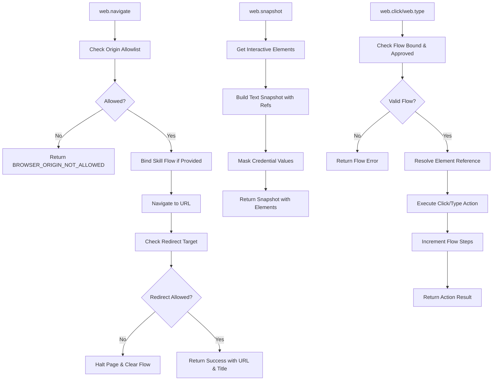

**New** Browser connector provides comprehensive web application interaction capabilities with stateful sessions and security enforcement

**Diagram sources**
- [browser_connector.py](file://products/tool-gateway/src/tool_gateway/tools/browser_connector.py)
- [browser_sessions.py](file://products/tool-gateway/src/tool_gateway/tools/browser_sessions.py)
- [credential_sets.py](file://products/tool-gateway/src/tool_gateway/tools/credential_sets.py)

**Section sources**
- [browser_connector.py](file://products/tool-gateway/src/tool_gateway/tools/browser_connector.py)
- [browser_sessions.py](file://products/tool-gateway/src/tool_gateway/tools/browser_sessions.py)
- [credential_sets.py](file://products/tool-gateway/src/tool_gateway/tools/credential_sets.py)

### Elastic Connector for Observability Data
Provides read-only access to Elasticsearch for observability data with three main tools:
- **Search Logs**: Search logs using Kibana Query Language or simple text with configurable time ranges and result limits
- **Get Service Health**: Retrieve aggregated health metrics including error rates, request counts, and average latency
- **Get Active Alerts**: List active alerts from Elastic with optional severity filtering

Features include:
- Lazy client initialization with connection validation
- Support for API key and basic authentication
- Configurable TLS verification
- Parameter validation and clamping for time ranges and result limits
- Structured error handling for connection failures and invalid parameters
- Evidence building for audit trails

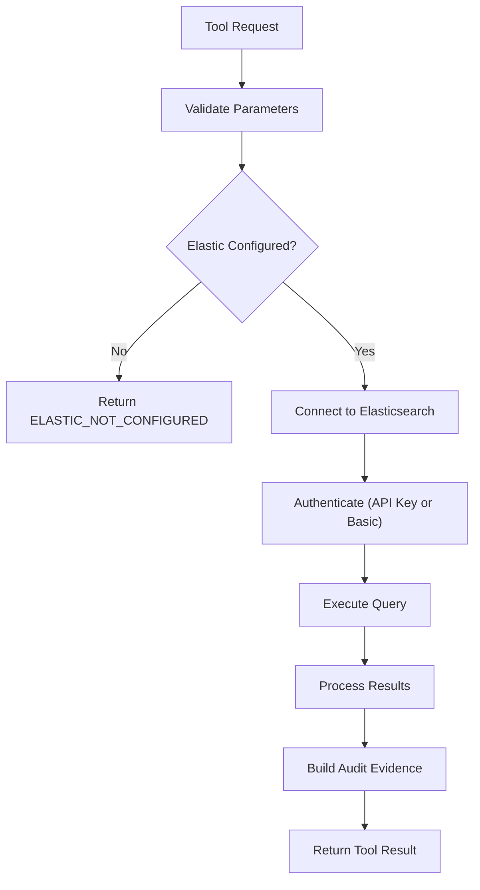

**New** Elastic connector provides comprehensive observability data access

**Diagram sources**
- [elastic_connector.py](file://products/tool-gateway/src/tool_gateway/tools/elastic_connector.py)

**Section sources**
- [elastic_connector.py](file://products/tool-gateway/src/tool_gateway/tools/elastic_connector.py)

### Incidents Connector for Incident Data Access
Provides read-only access to the incident-service query API with two main tools:
- **List Incidents**: Query tracked incidents with optional status, severity, and source filters, supporting pagination
- **Get Incident**: Fetch a specific incident by ID, including its latest triage report and connector dispatch outcomes

Features include:
- **Authentication**: Uses gateway-held Basic credentials (never user's token) for secure service-to-service communication
- **Parameter Validation**: Strict validation of incident IDs using regex pattern matching to prevent path injection attacks
- **Pagination Support**: Configurable limit (default 20, max 50) and offset parameters for efficient data retrieval
- **Filtering Options**: Optional status, severity, and source filters for targeted incident queries
- **Structured Error Handling**: Maps upstream errors to structured tool errors with appropriate codes
- **Evidence Building**: Automatic evidence generation for audit trails with source system identification
- **Contract Compliance**: Ensures incident data conforms to shared schema contracts

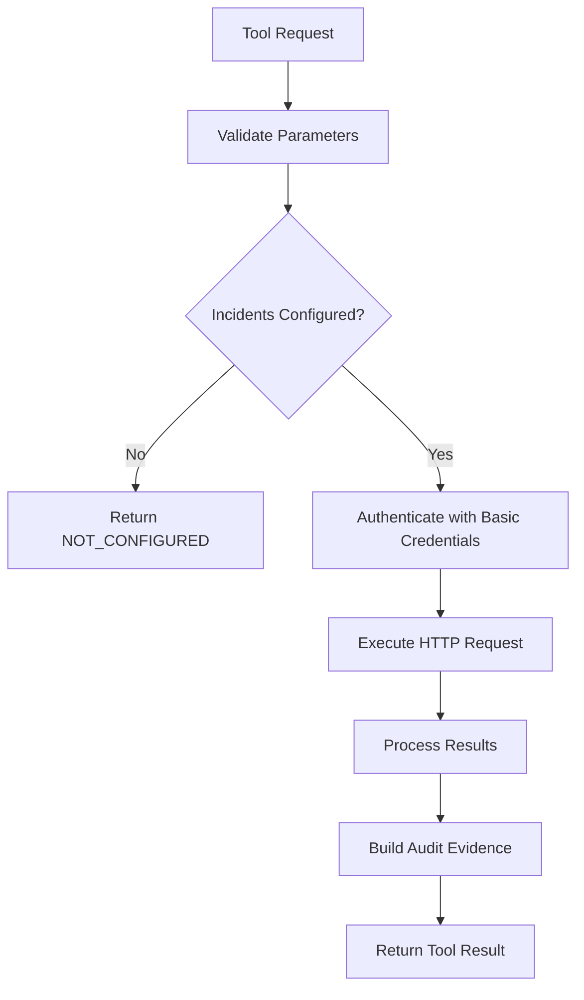

**New** Incidents connector provides secure incident data access through the incident service

**Diagram sources**
- [incidents_connector.py](file://products/tool-gateway/src/tool_gateway/tools/incidents_connector.py)

**Section sources**
- [incidents_connector.py](file://products/tool-gateway/src/tool_gateway/tools/incidents_connector.py)

### Enhanced Skills Connector with Request Correlation
Provides read-only access to the skills-hub retrieval API with **enhanced request correlation** for end-to-end audit trail tracking:
- **Search Skills**: Search team-owned operational skills and runbooks with query terms, source filters, and tag filters
- **Get Skill**: Fetch the full body of one skill by its validated namespaced ID
- **List Skills**: List registered skills with summaries, pagination, and filtering options

**Enhanced Features**:
- **Request Correlation**: Forwards caller's request_id as x-request-id header to skills-hub for audit trail correlation (SPEC-029 R-3)
- **Authentication**: Uses gateway-held Basic credentials (never user's token) for secure service-to-service communication
- **Parameter Validation**: Strict validation of skill IDs using regex pattern matching to prevent path injection attacks
- **Pagination Support**: Configurable limit (default 5, max 20) and offset parameters for efficient data retrieval
- **Filtering Options**: Optional source and tag filters for targeted skill queries
- **Structured Error Handling**: Maps upstream errors to structured tool errors with appropriate codes
- **Evidence Building**: Automatic evidence generation for audit trails with source system identification
- **Contract Compliance**: Ensures skill data conforms to shared schema contracts

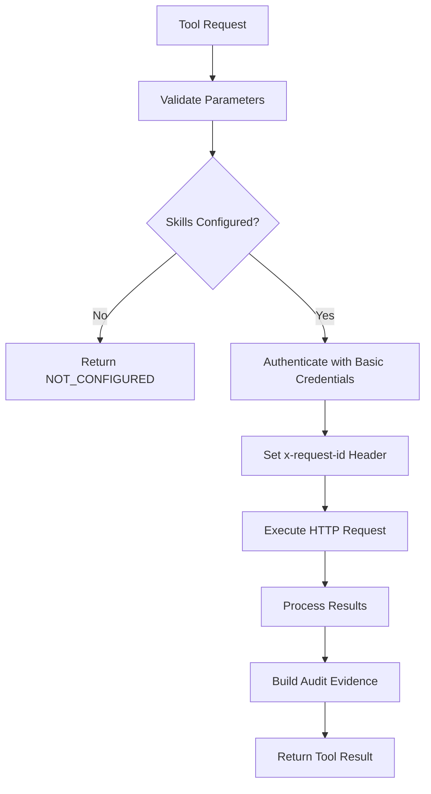

**Updated** Enhanced skills connector with request correlation capabilities enabling end-to-end audit trail tracking

**Diagram sources**
- [skills_connector.py](file://products/tool-gateway/src/tool_gateway/tools/skills_connector.py)

**Section sources**
- [skills_connector.py](file://products/tool-gateway/src/tool_gateway/tools/skills_connector.py)

### Schemas and Contracts
- Tool invocation schema defines required fields for tool calls
- Tool result schema standardizes responses across tools
- API schemas enforce request/response validation at the router level

**Section sources**
- [tool-invocation.schema.json](file://shared/shared-contracts/schemas/tool-invocation.schema.json)
- [tool-result.schema.json](file://shared/shared-contracts/schemas/tool-result.schema.json)

### Core Configuration and Runtime
- Configuration loads environment variables including audience validation settings and **incidents service configuration**
- **Added GATEWAY_MUTATING_TOOLS_ENABLED** environment variable for controlling mutating tool registration
- **Added browser connector configuration** including CDP endpoint, session management, and origin allowlist
- Runtime settings manage service lifecycle and dependencies
- Observability, metrics, and telemetry provide monitoring and tracing
- Redaction configuration with enable/disable switches and overflow thresholds
- Dependency injection framework for service components

**Updated** Added incidents service configuration options, browser connector configuration, and enhanced dependency injection with mutating tools control

**Section sources**
- [config.py](file://products/tool-gateway/src/tool_gateway/core/config.py)
- [runtime.py](file://products/tool-gateway/src/tool_gateway/core/runtime.py)
- [observability.py](file://products/tool-gateway/src/tool_gateway/core/observability.py)
- [metrics.py](file://products/tool-gateway/src/tool_gateway/core/metrics.py)
- [telemetry.py](file://products/tool-gateway/src/tool_gateway/core/telemetry.py)
- [request_context.py](file://products/tool-gateway/src/tool_gateway/core/request_context.py)
- [dependencies.py](file://products/tool-gateway/src/tool_gateway/core/dependencies.py)

## Dependency Analysis
The Tool Gateway has clear dependency boundaries with focused security components:
- API routes depend on services for business logic
- Services depend on policy engine, token verifier, tool registry, and output redaction
- Tool registry depends on base tool implementations, connectors, and redaction system
- **Enhanced Kubernetes connector depends on cluster-wide RBAC permissions and policy enforcement**
- **Browser connector depends on Playwright, CDP connectivity, and credential set management**
- Elastic connector depends on Elasticsearch client and configuration
- **Incidents connector depends on incident-service HTTP API and Basic authentication**
- **Skills connector depends on skills-hub HTTP API, Basic authentication, and request correlation**
- Output redaction depends on tool result structures and metrics tracking

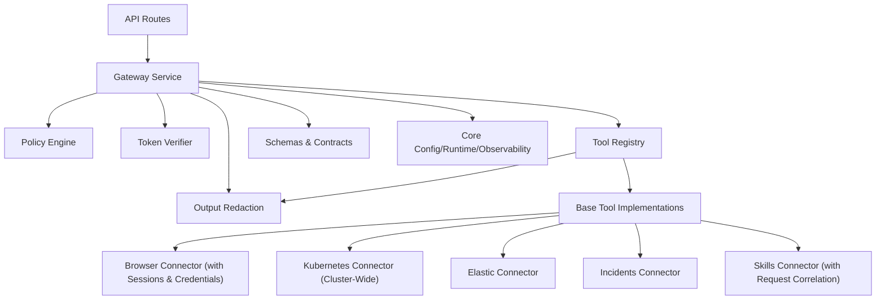

**Updated** Simplified dependency graph reflecting all five connectors with enhanced Kubernetes permissions, browser connector with session management, risk-tier admission control, and request correlation capabilities

**Diagram sources**
- [router.py](file://products/tool-gateway/src/tool_gateway/api/router.py)
- [gateway_service.py](file://products/tool-gateway/src/tool_gateway/services/gateway_service.py)
- [policy_engine.py](file://products/tool-gateway/src/tool_gateway/services/policy_engine.py)
- [token_verifier.py](file://products/tool-gateway/src/tool_gateway/services/token_verifier.py)
- [registry.py](file://products/tool-gateway/src/tool_gateway/tools/registry.py)
- [base.py](file://products/tool-gateway/src/tool_gateway/tools/base.py)
- [browser_connector.py](file://products/tool-gateway/src/tool_gateway/tools/browser_connector.py)
- [browser_sessions.py](file://products/tool-gateway/src/tool_gateway/tools/browser_sessions.py)
- [credential_sets.py](file://products/tool-gateway/src/tool_gateway/tools/credential_sets.py)
- [k8s_connector.py](file://products/tool-gateway/src/tool_gateway/tools/k8s_connector.py)
- [elastic_connector.py](file://products/tool-gateway/src/tool_gateway/tools/elastic_connector.py)
- [incidents_connector.py](file://products/tool-gateway/src/tool_gateway/tools/incidents_connector.py)
- [skills_connector.py](file://products/tool-gateway/src/tool_gateway/tools/skills_connector.py)
- [redaction.py](file://products/tool-gateway/src/tool_gateway/tools/redaction.py)
- [config.py](file://products/tool-gateway/src/tool_gateway/core/config.py)

**Section sources**
- [router.py](file://products/tool-gateway/src/tool_gateway/api/router.py)
- [gateway_service.py](file://products/tool-gateway/src/tool_gateway/services/gateway_service.py)
- [policy_engine.py](file://products/tool-gateway/src/tool_gateway/services/policy_engine.py)
- [token_verifier.py](file://products/tool-gateway/src/tool_gateway/services/token_verifier.py)
- [registry.py](file://products/tool-gateway/src/tool_gateway/tools/registry.py)
- [base.py](file://products/tool-gateway/src/tool_gateway/tools/base.py)
- [browser_connector.py](file://products/tool-gateway/src/tool_gateway/tools/browser_connector.py)
- [browser_sessions.py](file://products/tool-gateway/src/tool_gateway/tools/browser_sessions.py)
- [credential_sets.py](file://products/tool-gateway/src/tool_gateway/tools/credential_sets.py)
- [k8s_connector.py](file://products/tool-gateway/src/tool_gateway/tools/k8s_connector.py)
- [elastic_connector.py](file://products/tool-gateway/src/tool_gateway/tools/elastic_connector.py)
- [incidents_connector.py](file://products/tool-gateway/src/tool_gateway/tools/incidents_connector.py)
- [skills_connector.py](file://products/tool-gateway/src/tool_gateway/tools/skills_connector.py)
- [redaction.py](file://products/tool-gateway/src/tool_gateway/tools/redaction.py)
- [config.py](file://products/tool-gateway/src/tool_gateway/core/config.py)

## Performance Considerations
- Connection pooling for Kubernetes API calls across all namespaces
- Caching of policy evaluations for repeated contexts
- Efficient schema validation with minimal overhead
- Async I/O for non-blocking operations where possible
- Rate limiting at the router level to prevent abuse
- Metrics collection for performance monitoring and alerting
- Output redaction optimization with early exit for clean payloads
- Dependency injection for efficient service initialization
- Lazy initialization of Elastic connector connections
- Parameter clamping to prevent resource exhaustion in Elastic queries
- Time range limitations for log searches to prevent long-running queries
- **Optimized cluster-wide resource access patterns to minimize API call overhead**
- **Connection timeout configuration for incidents service calls (10 seconds)**
- **Result limit enforcement for incidents queries (max 50 entries)**
- **Efficient incident data projection to exclude unnecessary fields in list operations**
- **Connection timeout configuration for skills connector calls (10 seconds)**
- **Result limit enforcement for skills queries (max 20 entries)**
- **Minimal header overhead for request correlation (conditional x-request-id forwarding)**
- **Risk-tier admission control minimizes policy evaluation overhead for read-only tools**
- **Browser session pooling with TTL-based expiration to manage memory usage**
- **Screenshot quality adjustment loop to meet byte size constraints efficiently**
- **Lazy browser connection establishment to avoid startup delays when disabled**
- **Element reference caching in browser sessions to optimize interaction operations**

## Troubleshooting Guide
Common issues and resolutions:
- Policy violations: Check policy definitions and request context
- Token validation failures: Verify token issuer, expiration, and audience matching for `tool-gateway`
- Audience validation errors: Ensure token audience matches `tool-gateway`
- Tool execution errors: Inspect tool logs and input validation
- **Kubernetes connectivity**: Validate cluster configuration and **cluster-wide RBAC permissions**
- **Cross-namespace access issues**: Verify `luban-tool-gateway-readonly` ClusterRole is properly bound
- **Diagnostic scope limitations**: Ensure proper ClusterRoleBinding for the tool-gateway ServiceAccount
- **Mutating tools disabled**: Check GATEWAY_MUTATING_TOOLS_ENABLED environment variable is set to true for write/admin tools
- **k8s.delete_pod not found**: Verify GATEWAY_MUTATING_TOOLS_ENABLED is enabled and proper RBAC permissions are granted
- **Permission denied for pod deletion**: Ensure tool-gateway service account has pod-delete RBAC permissions
- **Browser connector not working**: Check GATEWAY_BROWSER_ENABLED flag and CDP endpoint connectivity
- **Browser sidecar unreachable**: Verify chromium-headless-shell sidecar is running and accessible at configured CDP endpoint
- **Origin allowlist denials**: Ensure target URLs match configured GATEWAY_BROWSER_ALLOW_ORIGINS
- **Flow binding errors**: Verify skill declarations include valid web_target and risk_class fields
- **Credential set not found**: Check GATEWAY_BROWSER_CREDENTIAL_SETS file path and format
- **Screenshot too large**: Adjust GATEWAY_BROWSER_SCREENSHOT_MAX_BYTES or reduce page complexity
- **Session expiration**: Monitor browser session TTL and adjust based on workflow duration
- **Elastic connectivity**: Check Elastic URL, authentication credentials, and network connectivity
- **Elastic configuration**: Verify `GATEWAY_ELASTIC_ENABLED` and related environment variables
- **Incidents connectivity**: Check incidents service URL, Basic authentication credentials, and network connectivity
- **Incidents configuration**: Verify `GATEWAY_INCIDENTS_SERVICE_URL`, `GATEWAY_INCIDENTS_CLIENT_ID`, and `GATEWAY_INCIDENTS_CLIENT_SECRET`
- **Incidents parameter validation**: Ensure incident IDs match the expected pattern (inc-<lowercase alphanumeric>)
- **Skills connectivity**: Check skills-hub URL, Basic authentication credentials, and network connectivity
- **Skills configuration**: Verify `GATEWAY_SKILLS_SERVICE_URL` and `GATEWAY_SKILLS_CLIENT_SECRET`
- **Skills parameter validation**: Ensure skill IDs match the expected pattern (source_id/slug format)
- **Request correlation issues**: Verify x-request-id header is being forwarded correctly to downstream services
- Performance degradation: Monitor metrics and adjust rate limits
- Output redaction issues: Check redaction configuration and overflow thresholds
- Dependency injection problems: Verify service initialization and configuration

**Updated** Added troubleshooting guidance for browser connector, risk-tier admission control, mutating tools, request correlation, and common issues

**Section sources**
- [policy_engine.py](file://products/tool-gateway/src/tool_gateway/services/policy_engine.py)
- [token_verifier.py](file://products/tool-gateway/src/tool_gateway/services/token_verifier.py)
- [registry.py](file://products/tool-gateway/src/tool_gateway/tools/registry.py)
- [browser_connector.py](file://products/tool-gateway/src/tool_gateway/tools/browser_connector.py)
- [browser_sessions.py](file://products/tool-gateway/src/tool_gateway/tools/browser_sessions.py)
- [credential_sets.py](file://products/tool-gateway/src/tool_gateway/tools/credential_sets.py)
- [k8s_connector.py](file://products/tool-gateway/src/tool_gateway/tools/k8s_connector.py)
- [elastic_connector.py](file://products/tool-gateway/src/tool_gateway/tools/elastic_connector.py)
- [incidents_connector.py](file://products/tool-gateway/src/tool_gateway/tools/incidents_connector.py)
- [skills_connector.py](file://products/tool-gateway/src/tool_gateway/tools/skills_connector.py)
- [redaction.py](file://products/tool-gateway/src/tool_gateway/tools/redaction.py)
- [metrics.py](file://products/tool-gateway/src/tool_gateway/core/metrics.py)
- [observability.py](file://products/tool-gateway/src/tool_gateway/core/observability.py)
- [dependencies.py](file://products/tool-gateway/src/tool_gateway/core/dependencies.py)

## Conclusion
The Tool Gateway Service provides a focused, secure, and extensible platform for internal tool execution with policy enforcement, secure tool invocation, comprehensive output redaction, and enhanced request correlation. Its streamlined architecture enables easy extension with new tools while maintaining strong security and observability standards. The service now operates exclusively as an internal component, receiving requests from other platform services through well-defined APIs with delegated token authentication.

The platform-gateway extraction has successfully separated portal-facing responsibilities into the new `platform-gateway` service, allowing tool-gateway to focus solely on its core mandate of connector standardization and tool execution. Recent enhancements include the addition of Elastic connector for observability data access, incidents connector for querying incident data through the new incident service, **skills connector for accessing team-owned operational skills and runbooks with full audit trail correlation**, **browser connector for web application interaction capabilities with stateful sessions and flow binding**, **enhanced RBAC permissions with cluster-wide read-only access enabling comprehensive diagnostic capabilities across all namespaces**, **risk-tier admission control with GATEWAY_MUTATING_TOOLS_ENABLED for secure mutating tool registration**, **bounded mutating tool support with k8s.delete_pod for controlled pod restart operations**, and **enhanced request correlation through x-request-id header forwarding enabling end-to-end audit trail tracking**.

This architectural change improves ownership alignment, security boundaries, and maintainability while preserving all external contracts and functionality. The transition from namespaced Role to cluster-wide ClusterRole significantly enhances operational capabilities while maintaining strict read-only access controls. The introduction of risk-tier admission control ensures that mutating operations require explicit authorization through both environment configuration and policy enforcement. The enhanced request correlation capabilities ensure that every tool invocation can be traced end-to-end through downstream services, providing comprehensive audit trail visibility. The new browser connector extends the platform's capabilities to interact with web applications through a bounded, secure interface with comprehensive security controls including origin allowlisting, flow binding, and credential masking.

## Appendices

### Platform Gateway Extraction Completion
The platform-gateway extraction (ADR-0005, SPEC-010) has been completed successfully, splitting the original monolithic service into two dedicated services:

**Completed Migration:**
- **platform-gateway**: Now handles portal-facing edge functionality including token verification, policy enforcement, chat/session proxying, and authentication flows
- **tool-gateway**: Focuses exclusively on tool execution, registry management, and multi-connector operations

**Component Separation:**
- **Moved to platform-gateway**: Token verification, policy engine, chat routes, session routes, auth routes, identity routes, runtime routes, delegation client, agent client
- **Remaining in tool-gateway**: Tool registry, base tool framework, browser connector, k8s connector, elastic connector, incidents connector, skills connector, output redaction, tools routes, health endpoints

**Impact Assessment:**
- External HTTP contracts remain unchanged for portal callers
- Service-to-service communication patterns follow ADR-0004 delegation model
- No behavioral changes beyond the structural split
- Improved ownership boundaries and security review scope

**Section sources**
- [0005-platform-gateway-extraction.md](file://docs/adr/0005-platform-gateway-extraction.md)
- [SPEC-010 spec.md](file://docs/specs/SPEC-010-platform-gateway-extraction/spec.md)

### Enhanced Kubernetes Integration with Cluster-Wide RBAC and Bounded Mutating Operations
- Deployment configuration for the Tool Gateway service
- Service exposure and networking setup
- **Cluster-wide RBAC policies enabling cross-namespace diagnostic capabilities**
- **Bounded mutating operations through k8s.delete_pod tool**
- Policy configuration for runtime enforcement

**Security Model**: The `luban-tool-gateway-readonly` ClusterRole provides get/list/watch permissions across core, apps, batch, networking, and autoscaling API groups, enabling comprehensive cluster diagnostics while maintaining strict read-only access controls. Mutating operations are restricted to the bounded k8s.delete_pod tool which requires explicit GATEWAY_MUTATING_TOOLS_ENABLED activation.

**Section sources**
- [tool-gateway-deployment.yaml](file://shared/platform-ops/gitops/dev-k8s/base/tool-gateway/tool-gateway-deployment.yaml)
- [tool-gateway-service.yaml](file://shared/platform-ops/gitops/dev-k8s/base/tool-gateway/tool-gateway-service.yaml)
- [rbac.yaml](file://shared/platform-ops/gitops/dev-k8s/base/tool-gateway/rbac.yaml)

### Risk-Tier Admission Control and Mutating Tools
The risk-tier admission control system provides defense-in-depth for mutating operations:

**Environment Configuration**:
- `GATEWAY_MUTATING_TOOLS_ENABLED=false` (default): Write/admin tools are not registered and unavailable
- `GATEWAY_MUTATING_TOOLS_ENABLED=true`: Write/admin tools can be registered but still require policy authorization

**Policy Enforcement**:
- Read tools require `tools:invoke` permission
- Write/admin tools require both `tools:invoke` and `tools:mutate` permissions
- Deny-by-default ensures only explicitly authorized roles can execute mutating operations

**Implementation Details**:
- Registry refuses registration of write/admin tools when GATEWAY_MUTATING_TOOLS_ENABLED is false
- Gateway service performs additional policy check for tools with risk_level != "read"
- Audit logging captures all mutating tool attempts with detailed context

**Section sources**
- [registry.py](file://products/tool-gateway/src/tool_gateway/tools/registry.py)
- [policy_engine.py](file://products/tool-gateway/src/tool_gateway/services/policy_engine.py)
- [gateway_service.py](file://products/tool-gateway/src/tool_gateway/services/gateway_service.py)
- [config.py](file://products/tool-gateway/src/tool_gateway/core/config.py)

### Enhanced Request Correlation with x-request-id Header Forwarding
The enhanced request correlation system enables end-to-end audit trail tracking through the entire tool execution pipeline:

**Implementation Details**:
- Gateway service adds `request_id` to identity context passed to tools (SPEC-029 R-3)
- Skills connector forwards `request_id` as `x-request-id` header to skills-hub API calls
- Missing request IDs are handled gracefully with None values forwarded
- Downstream services receive correlation headers for audit trail continuity

**Benefits**:
- Enables per-user attribution of skill usage events
- Joins skill usage audit events with existing tool_invoked events
- Maintains correlation without exposing user identity to skills-hub
- Preserves existing audit trail infrastructure and contracts

**Testing Coverage**:
- Tests verify request_id forwarding for all skills tools (search, get, list)
- Tests confirm missing request_id handling with None values
- Tests validate header setting behavior in HTTP client calls

**Section sources**
- [gateway_service.py](file://products/tool-gateway/src/tool_gateway/services/gateway_service.py)
- [skills_connector.py](file://products/tool-gateway/src/tool_gateway/tools/skills_connector.py)
- [test_skills_connector.py](file://products/tool-gateway/tests/test_skills_connector.py)

### Browser Connector Implementation with Stateful Sessions and Flow Binding
The browser connector provides web application interaction capabilities through Playwright-based headless browser automation with comprehensive security controls:

**Core Architecture**:
- **Stateful Session Management**: Browser contexts are keyed by chat session ID, surviving owner→approver identity switches during HITL workflows
- **CDP Connectivity**: Connects to chromium-headless-shell sidecar over Chrome DevTools Protocol for headless browser automation
- **Origin Allowlist Enforcement**: Server-side URL allowlist prevents navigation to unauthorized origins with deny-by-default posture
- **Flow Binding and Deviation Guard**: Validates skill-declared web targets and prevents off-flow interactions
- **Credential Set Management**: Secure login flows using named credential sets with automatic value masking
- **Screenshot Capabilities**: Bounded JPEG screenshots with quality adjustment and size limits

**Security Controls**:
- Origin allowlist validation prevents navigation outside authorized domains
- Flow binding ensures interactions occur only within approved web-check flows
- Credential values are masked in snapshots and screenshots to prevent leaks
- Write-tier operations require explicit mutation approval through existing HITL gates
- Deviation guard prevents interactions on pages that drift from approved flow origins

**Configuration Options**:
- `GATEWAY_BROWSER_ENABLED`: Enable/disable browser connector
- `GATEWAY_BROWSER_CDP_ENDPOINT`: CDP endpoint for browser sidecar
- `GATEWAY_BROWSER_SESSION_TTL`: Session timeout in seconds
- `GATEWAY_BROWSER_MAX_SESSIONS`: Maximum concurrent browser sessions
- `GATEWAY_BROWSER_ALLOW_ORIGINS`: Comma-separated origin allowlist
- `GATEWAY_BROWSER_FLOW_MAX_STEPS`: Maximum steps per web-check flow
- `GATEWAY_BROWSER_CREDENTIAL_SETS`: Path to credential set file
- `GATEWAY_BROWSER_SCREENSHOT_MAX_BYTES`: Maximum screenshot size in bytes

**Testing Coverage**:
- Session pool lifecycle tests (create/reuse/TTL/eviction)
- Origin allowlist matrix validation
- Flow binding and deviation guard state machine
- Credential set handling with leak assertions
- Screenshot byte cap enforcement
- Concurrent session creation safety

**Section sources**
- [browser_connector.py](file://products/tool-gateway/src/tool_gateway/tools/browser_connector.py)
- [browser_sessions.py](file://products/tool-gateway/src/tool_gateway/tools/browser_sessions.py)
- [credential_sets.py](file://products/tool-gateway/src/tool_gateway/tools/credential_sets.py)
- [test_browser_connector.py](file://products/tool-gateway/tests/test_browser_connector.py)

### Policy Definition Examples
YAML-based policy definitions control access to tools and operations with enhanced permissions:
- Rule-based access control with conditions
- Identity-based permissions and scopes
- Method and path-based restrictions
- Parameter validation and sanitization
- Enhanced `tools:list`, `tools:invoke`, and `tools:mutate` permissions for different role levels

**Section sources**
- [policy-default.yaml](file://products/tool-gateway/src/tool_gateway/policies/policy-default.yaml)

### Tool Registration Examples
Tools are registered dynamically with metadata and schemas from multiple connectors:
- Tool name and description
- Input parameter schemas for validation
- Execution functions with error handling
- Integration with Kubernetes connector for cluster-wide operations
- Integration with Browser connector for web application interaction
- Integration with Elastic connector for observability data access
- Integration with Incidents connector for incident data access
- Integration with Skills connector for skills and runbook access with request correlation
- **Risk-level classification** for admission control (read/write/admin)

**Section sources**
- [registry.py](file://products/tool-gateway/src/tool_gateway/tools/registry.py)
- [base.py](file://products/tool-gateway/src/tool_gateway/tools/base.py)
- [browser_connector.py](file://products/tool-gateway/src/tool_gateway/tools/browser_connector.py)
- [k8s_connector.py](file://products/tool-gateway/src/tool_gateway/tools/k8s_connector.py)
- [elastic_connector.py](file://products/tool-gateway/src/tool_gateway/tools/elastic_connector.py)
- [incidents_connector.py](file://products/tool-gateway/src/tool_gateway/tools/incidents_connector.py)
- [skills_connector.py](file://products/tool-gateway/src/tool_gateway/tools/skills_connector.py)

### Custom Tool Development Guidelines
When developing custom tools:
- Extend the base tool class for consistency
- Define input schemas for validation
- Implement error handling and logging
- **Set appropriate risk_level** (read/write/admin) for admission control
- Integrate with Kubernetes connector for cluster-wide operations
- Integrate with Browser connector for web application interaction
- Integrate with Elastic connector for observability data access
- Integrate with Incidents connector for incident data access
- Integrate with Skills connector for skills and runbook access with request correlation
- Register tools with the registry for discovery
- Be aware that all tool outputs will be automatically redacted for security
- **Understand that write/admin tools require GATEWAY_MUTATING_TOOLS_ENABLED and tools:mutate policy permission**
- **For skills tools, request_id will be automatically forwarded to downstream services for audit correlation**
- **For browser tools, understand flow binding requirements and origin allowlist constraints**

**Updated** Added guidance for risk-level classification, mutating tool requirements, request correlation capabilities, and browser connector integration

**Section sources**
- [base.py](file://products/tool-gateway/src/tool_gateway/tools/base.py)
- [registry.py](file://products/tool-gateway/src/tool_gateway/tools/registry.py)
- [browser_connector.py](file://products/tool-gateway/src/tool_gateway/tools/browser_connector.py)
- [k8s_connector.py](file://products/tool-gateway/src/tool_gateway/tools/k8s_connector.py)
- [elastic_connector.py](file://products/tool-gateway/src/tool_gateway/tools/elastic_connector.py)
- [incidents_connector.py](file://products/tool-gateway/src/tool_gateway/tools/incidents_connector.py)
- [skills_connector.py](file://products/tool-gateway/src/tool_gateway/tools/skills_connector.py)
- [redaction.py](file://products/tool-gateway/src/tool_gateway/tools/redaction.py)

### Security Considerations
- Token verification with audience validation for `tool-gateway` audience
- **Enhanced RBAC enforcement with cluster-wide read-only access via `luban-tool-gateway-readonly` ClusterRole**
- **Risk-tier admission control preventing unauthorized access to mutating tools**
- **Enhanced request correlation with x-request-id header forwarding for audit trail continuity**
- **Browser connector security controls including origin allowlist, flow binding, and credential masking**
- Input validation and sanitization
- Policy-based access control with enhanced tool permissions including tools:mutate
- Secure configuration management
- Automatic output redaction preventing credential leakage
- Fail-closed overflow protection for excessive redaction scenarios
- Elastic connector authentication with API key or basic auth
- Incidents connector authentication with Basic credentials (service-to-service only)
- Skills connector authentication with Basic credentials (service-to-service only)
- Parameter validation and clamping to prevent resource exhaustion
- **Strict incident ID validation to prevent path injection attacks**
- **Strict skill ID validation to prevent path injection attacks**
- **Strict read-only access controls ensuring no mutating operations are permitted without explicit opt-in**
- **Browser flow deviation guard preventing off-origin interactions**
- **Credential set validation and secure file loading**

**Updated** Enhanced security model with risk-tier admission control, improved cluster-wide RBAC permissions, enhanced request correlation capabilities, and comprehensive browser connector security controls

**Section sources**
- [token_verifier.py](file://products/tool-gateway/src/tool_gateway/services/token_verifier.py)
- [policy_engine.py](file://products/tool-gateway/src/tool_gateway/services/policy_engine.py)
- [browser_connector.py](file://products/tool-gateway/src/tool_gateway/tools/browser_connector.py)
- [browser_sessions.py](file://products/tool-gateway/src/tool_gateway/tools/browser_sessions.py)
- [credential_sets.py](file://products/tool-gateway/src/tool_gateway/tools/credential_sets.py)
- [rbac.yaml](file://shared/platform-ops/gitops/dev-k8s/base/tool-gateway/rbac.yaml)
- [config.py](file://products/tool-gateway/src/tool_gateway/core/config.py)
- [redaction.py](file://products/tool-gateway/src/tool_gateway/tools/redaction.py)
- [elastic_connector.py](file://products/tool-gateway/src/tool_gateway/tools/elastic_connector.py)
- [incidents_connector.py](file://products/tool-gateway/src/tool_gateway/tools/incidents_connector.py)
- [skills_connector.py](file://products/tool-gateway/src/tool_gateway/tools/skills_connector.py)

### Rate Limiting and Monitoring Strategies
- Configure rate limits at the API gateway level
- Collect metrics for request volume and latency
- Implement distributed tracing for request flows
- Set up alerts for policy violations and errors
- Monitor Kubernetes API call rates and quotas across all namespaces
- Track redaction statistics and overflow events
- Monitor Elastic connector performance and query efficiency
- Monitor incidents connector performance and upstream service availability
- Monitor skills connector performance and upstream service availability
- Track tool execution times and success rates
- **Monitor cluster-wide resource access patterns and API call volumes**
- **Monitor risk-tier admission control effectiveness and mutating tool attempts**
- **Monitor request correlation header forwarding and downstream service correlation**
- **Monitor browser session pool utilization and expiration rates**
- **Track browser connector origin allowlist violations and flow deviations**
- **Monitor credential set access patterns and file reload events**

**Updated** Enhanced monitoring strategies with risk-tier admission control, cluster-wide access monitoring, request correlation monitoring, and browser connector metrics

**Section sources**
- [metrics.py](file://products/tool-gateway/src/tool_gateway/core/metrics.py)
- [observability.py](file://products/tool-gateway/src/tool_gateway/core/observability.py)
- [telemetry.py](file://products/tool-gateway/src/tool_gateway/core/telemetry.py)

### Output Redaction Configuration
The output redaction system provides comprehensive protection against credential leakage:
- **Enable/Disable**: `GATEWAY_REDACTION_ENABLED` environment variable
- **Overflow Protection**: `GATEWAY_REDACTION_OVERFLOW_FRACTION` (default 0.2)
- **Pattern Matching**: Automatic detection of PEM keys, JWTs, Bearer tokens, AWS keys
- **Key-List Filtering**: Sensitive field names like password, secret, token, api_key
- **Metrics**: `gateway_tool_redacted_spans_total` counter for monitoring
- **Fail-Closed**: Excessive redaction triggers error responses instead of partial data

**Section sources**
- [redaction.py](file://products/tool-gateway/src/tool_gateway/tools/redaction.py)
- [config.py](file://products/tool-gateway/src/tool_gateway/core/config.py)
- [metrics.py](file://products/tool-gateway/src/tool_gateway/core/metrics.py)

### Browser Connector Configuration
The browser connector provides web application interaction capabilities with comprehensive configuration options:
- **Enable/Disable**: `GATEWAY_BROWSER_ENABLED` environment variable
- **CDP Endpoint**: `GATEWAY_BROWSER_CDP_ENDPOINT` for chromium-headless-shell sidecar
- **Session Management**: `GATEWAY_BROWSER_SESSION_TTL` and `GATEWAY_BROWSER_MAX_SESSIONS`
- **Origin Allowlist**: `GATEWAY_BROWSER_ALLOW_ORIGINS` comma-separated list
- **Flow Limits**: `GATEWAY_BROWSER_FLOW_MAX_STEPS` for web-check flows
- **Credential Sets**: `GATEWAY_BROWSER_CREDENTIAL_SETS` path to credential file
- **Screenshot Limits**: `GATEWAY_BROWSER_SCREENSHOT_MAX_BYTES` for size constraints
- **Skills Integration**: `GATEWAY_SKILLS_SERVICE_URL` and credentials for flow validation

**New** Browser connector configuration options for web application interaction capabilities

**Section sources**
- [config.py](file://products/tool-gateway/src/tool_gateway/core/config.py)
- [browser_connector.py](file://products/tool-gateway/src/tool_gateway/tools/browser_connector.py)
- [browser_sessions.py](file://products/tool-gateway/src/tool_gateway/tools/browser_sessions.py)
- [credential_sets.py](file://products/tool-gateway/src/tool_gateway/tools/credential_sets.py)

### Elastic Connector Configuration
The Elastic connector provides observability data access with flexible configuration:
- **Enable/Disable**: `GATEWAY_ELASTIC_ENABLED` environment variable
- **Connection**: `GATEWAY_ELASTIC_URL` for Elasticsearch endpoint
- **Authentication**: `GATEWAY_ELASTIC_API_KEY` or `GATEWAY_ELASTIC_USERNAME`/`GATEWAY_ELASTIC_PASSWORD`
- **Security**: `GATEWAY_ELASTIC_VERIFY_TLS` for TLS certificate verification
- **Alerts Index**: `GATEWAY_ELASTIC_ALERTS_INDEX` for alert queries (default: `.alerts-*`)
- **Time Range Limits**: Maximum 1440 minutes for log searches
- **Result Limits**: Maximum 200 results per query

**New** Elastic connector configuration options for observability data access

**Section sources**
- [config.py](file://products/tool-gateway/src/tool_gateway/core/config.py)
- [elastic_connector.py](file://products/tool-gateway/src/tool_gateway/tools/elastic_connector.py)
- [test_elastic_connector.py](file://products/tool-gateway/tests/test_elastic_connector.py)

### Incidents Connector Configuration
The Incidents connector provides incident data access with secure service-to-service authentication:
- **Enable/Disable**: `GATEWAY_INCIDENTS_SERVICE_URL` environment variable (required for activation)
- **Service URL**: `GATEWAY_INCIDENTS_SERVICE_URL` for incident-service endpoint
- **Authentication**: `GATEWAY_INCIDENTS_CLIENT_ID` and `GATEWAY_INCIDENTS_CLIENT_SECRET` for Basic authentication
- **Default Client ID**: `tool-gateway` (must be registered in incident-service query clients)
- **Timeout**: 10 seconds for HTTP requests to incident-service
- **Result Limits**: Maximum 50 entries per list operation
- **Authentication Flow**: Uses gateway-held credentials, never exposes user tokens to incident-service

**New** Incidents connector configuration options for secure incident data access

**Section sources**
- [config.py](file://products/tool-gateway/src/tool_gateway/core/config.py)
- [incidents_connector.py](file://products/tool-gateway/src/tool_gateway/tools/incidents_connector.py)
- [test_incidents_connector.py](file://products/tool-gateway/tests/test_incidents_connector.py)

### Skills Connector Configuration
The Skills connector provides skills and runbook access with secure service-to-service authentication and enhanced request correlation:
- **Enable/Disable**: `GATEWAY_SKILLS_SERVICE_URL` environment variable (required for activation)
- **Service URL**: `GATEWAY_SKILLS_SERVICE_URL` for skills-hub endpoint
- **Authentication**: `GATEWAY_SKILLS_CLIENT_ID` and `GATEWAY_SKILLS_CLIENT_SECRET` for Basic authentication
- **Default Client ID**: `tool-gateway` (must be registered in skills-hub query clients)
- **Timeout**: 10 seconds for HTTP requests to skills-hub
- **Result Limits**: Maximum 20 entries per list/search operation
- **Authentication Flow**: Uses gateway-held credentials, never exposes user tokens to skills-hub
- **Request Correlation**: Forwards caller's request_id as x-request-id header for audit trail correlation

**New** Skills connector configuration options for secure skills data access with enhanced audit trail correlation

**Section sources**
- [config.py](file://products/tool-gateway/src/tool_gateway/core/config.py)
- [skills_connector.py](file://products/tool-gateway/src/tool_gateway/tools/skills_connector.py)
- [test_skills_connector.py](file://products/tool-gateway/tests/test_skills_connector.py)

### RBAC Permission Changes - Release Notes Reference
The RBAC permissions have been significantly enhanced in Release 1:

**Change Summary**: Replaced tool-gateway's namespaced Role with a cluster-wide read-only ClusterRole (`luban-tool-gateway-readonly`: get/list/watch across core, apps, batch, networking, autoscaling) so the copilot can diagnose any namespace while remaining strictly read-only.

**Why It Matters**: 
- The audit trail that Release 1 promised is now actually emitted and inspectable in service logs
- Operators are no longer limited to one or two namespaces when asking for cluster diagnostics
- Cross-namespace diagnostic capabilities enable comprehensive cluster health monitoring

**Section sources**
- [2026-08-10-r1-hardening-grounded-responses-and-evidence-ux.md](file://docs/agentic-aiops-platform/release-notes/2026-08-10-r1-hardening-grounded-responses-and-evidence-ux.md)
- [rbac.yaml](file://shared/platform-ops/gitops/dev-k8s/base/tool-gateway/rbac.yaml)

### New k8s.delete_pod Tool Implementation
The bounded mutating tool provides controlled pod restart capability:

**Tool Definition**:
- Name: `k8s.delete_pod`
- Risk Level: `write` (requires tools:mutate permission)
- Description: Delete a single named Kubernetes pod for bounded restart operations
- Parameters: Required `name` parameter, optional `namespace` parameter

**Security Controls**:
- Requires GATEWAY_MUTATING_TOOLS_ENABLED=true for registration
- Requires tools:mutate policy permission for execution
- Limited to single pod deletion (no wildcards or selectors)
- Controller-managed pods are recreated automatically (bounded restart primitive)

**Error Handling**:
- POD_NOT_FOUND: When specified pod doesn't exist
- K8S_PERMISSION_DENIED: When RBAC permissions are insufficient
- K8S_API_ERROR: For general Kubernetes API failures
- INVALID_PARAMETERS: When required parameters are missing

**Testing Coverage**:
- Parameter validation tests
- Error mapping tests for different Kubernetes API responses
- RBAC permission validation tests
- Namespace resolution tests

**Section sources**
- [k8s_connector.py](file://products/tool-gateway/src/tool_gateway/tools/k8s_connector.py)
- [test_k8s_connector.py](file://products/tool-gateway/tests/test_k8s_connector.py)
- [mutating-demo.sh](file://shared/platform-ops/e2e/mutating-demo.sh)

### SPEC-029 Skills Usage Audit Trail Implementation
The SPEC-029 implementation provides comprehensive audit trail correlation between tool invocations and skills usage:

**Implementation Details**:
- Gateway service adds `request_id` to identity context passed to tools (SPEC-029 R-3)
- Skills connector forwards `request_id` as `x-request-id` header to skills-hub API calls
- Missing request IDs are handled gracefully with None values forwarded
- Downstream services receive correlation headers for audit trail continuity

**Benefits**:
- Enables per-user attribution of skill usage events
- Joins skill usage audit events with existing tool_invoked events
- Maintains correlation without exposing user identity to skills-hub
- Preserves existing audit trail infrastructure and contracts

**Testing Coverage**:
- Tests verify request_id forwarding for all skills tools (search, get, list)
- Tests confirm missing request_id handling with None values
- Tests validate header setting behavior in HTTP client calls

**Section sources**
- [gateway_service.py](file://products/tool-gateway/src/tool_gateway/services/gateway_service.py)
- [skills_connector.py](file://products/tool-gateway/src/tool_gateway/tools/skills_connector.py)
- [test_skills_connector.py](file://products/tool-gateway/tests/test_skills_connector.py)
- [spec.md](file://docs/specs/SPEC-029-skills-usage-audit-trail/spec.md)

### SPEC-049 Browser Web Check Tools Implementation
The SPEC-049 implementation provides bounded web application interaction capabilities through Playwright-based headless browser automation:

**Implementation Details**:
- Stateful browser sessions keyed by chat session ID for flow persistence
- Origin allowlist enforcement preventing navigation to unauthorized domains
- Flow binding with skill-declared web_target and risk_class validation
- Deviation guard preventing interactions on off-origin pages
- Named credential sets for secure login flows with automatic value masking
- Bounded screenshot capabilities with quality adjustment and size limits

**Security Controls**:
- Deny-by-default origin allowlist posture
- Flow binding ensures interactions occur only within approved web-check flows
- Credential values masked in snapshots and screenshots to prevent leaks
- Write-tier operations require explicit mutation approval through existing HITL gates
- Deviation guard prevents interactions on pages that drift from approved flow origins

**Testing Coverage**:
- Session pool lifecycle tests (create/reuse/TTL/eviction)
- Origin allowlist matrix validation
- Flow binding and deviation guard state machine
- Credential set handling with leak assertions
- Screenshot byte cap enforcement
- Concurrent session creation safety

**Section sources**
- [browser_connector.py](file://products/tool-gateway/src/tool_gateway/tools/browser_connector.py)
- [browser_sessions.py](file://products/tool-gateway/src/tool_gateway/tools/browser_sessions.py)
- [credential_sets.py](file://products/tool-gateway/src/tool_gateway/tools/credential_sets.py)
- [test_browser_connector.py](file://products/tool-gateway/tests/test_browser_connector.py)
- [2026-09-02-spec-049-browser-web-check-tools.md](file://docs/agentic-aiops-platform/release-notes/2026-09-02-spec-049-browser-web-check-tools.md)