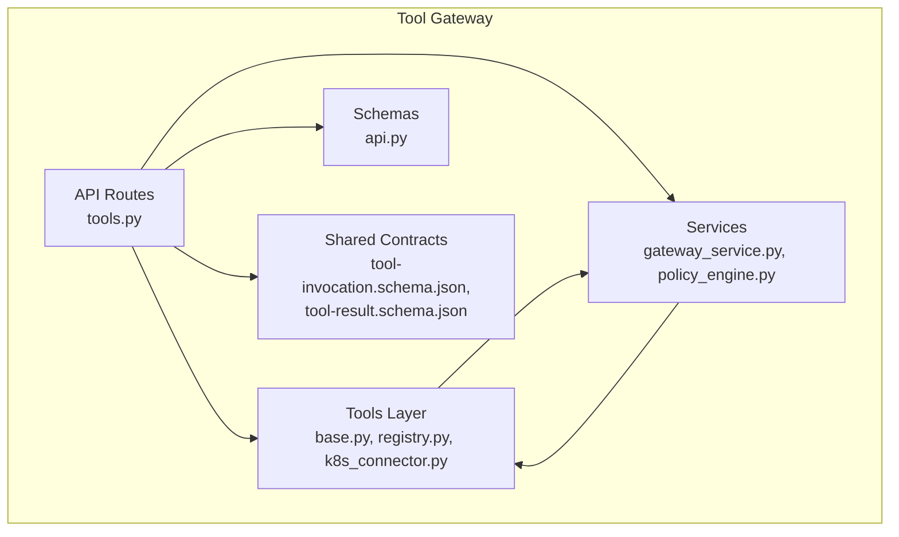
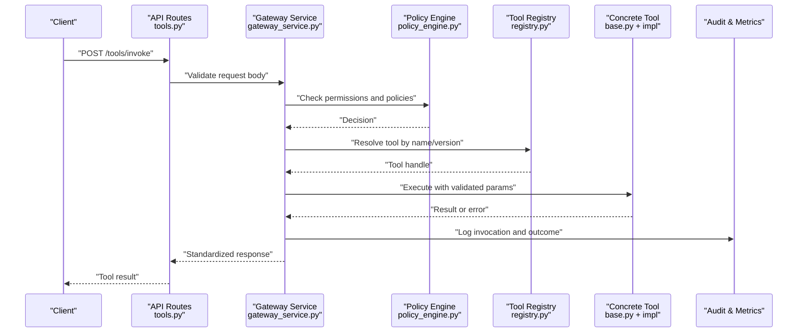
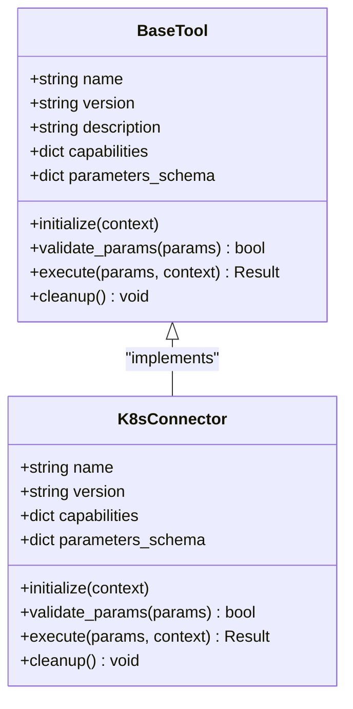
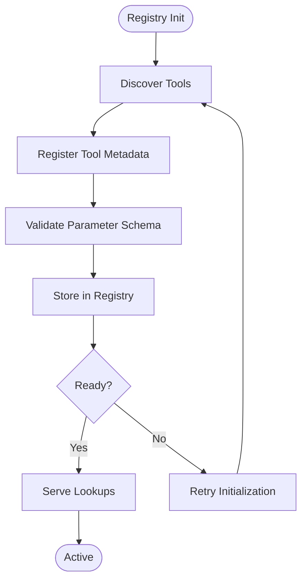
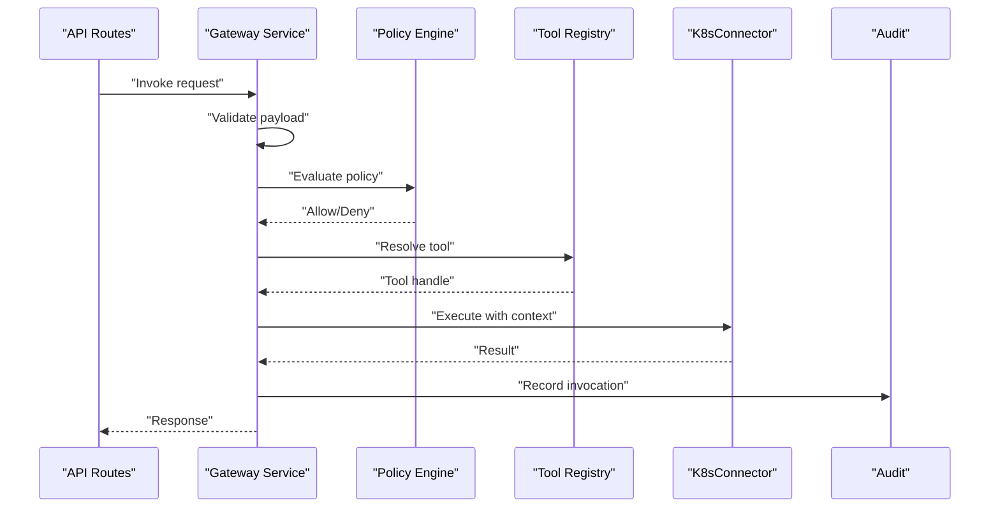
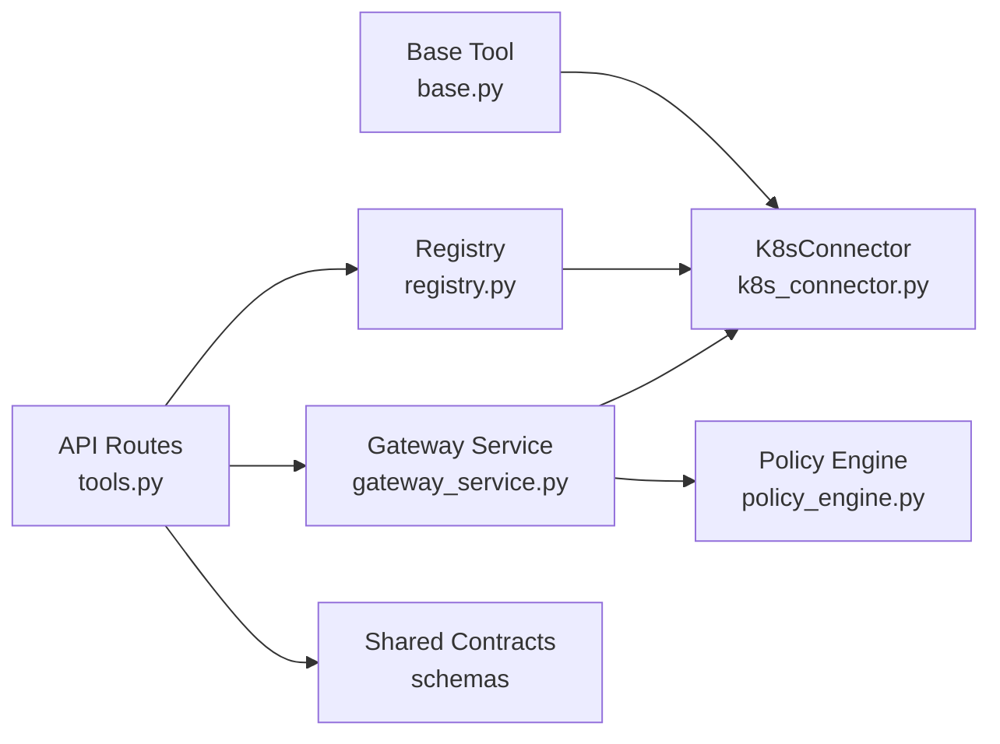

# Tool Registry and Execution Framework

<cite>
**Referenced Files in This Document**
- [tools.py](file://products/tool-gateway/src/api_gateway/api/routes/tools.py)
- [base.py](file://products/tool-gateway/src/api_gateway/tools/base.py)
- [registry.py](file://products/tool-gateway/src/api_gateway/tools/registry.py)
- [k8s_connector.py](file://products/tool-gateway/src/api_gateway/tools/k8s_connector.py)
- [gateway_service.py](file://products/tool-gateway/src/api_gateway/services/gateway_service.py)
- [policy_engine.py](file://products/tool-gateway/src/api_gateway/services/policy_engine.py)
- [api.py](file://products/tool-gateway/src/api_gateway/schemas/api.py)
- [tool-invocation.schema.json](file://shared/shared-contracts/schemas/tool-invocation.schema.json)
- [tool-result.schema.json](file://shared/shared-contracts/schemas/tool-result.schema.json)
- [test_tool_registry.py](file://products/tool-gateway/tests/test_tool_registry.py)
- [test_tool_invoke.py](file://products/tool-gateway/tests/test_tool_invoke.py)
- [SPEC-007-tool-execution-framework/spec.md](file://docs/specs/SPEC-007-tool-execution-framework/spec.md)
</cite>

## Table of Contents
1. [Introduction](#introduction)
2. [Project Structure](#project-structure)
3. [Core Components](#core-components)
4. [Architecture Overview](#architecture-overview)
5. [Detailed Component Analysis](#detailed-component-analysis)
6. [Dependency Analysis](#dependency-analysis)
7. [Performance Considerations](#performance-considerations)
8. [Troubleshooting Guide](#troubleshooting-guide)
9. [Conclusion](#conclusion)
10. [Appendices](#appendices)

## Introduction
This document explains the Tool Registry system that powers tool discovery, registration, validation, and safe execution within the platform. It covers the base tool interface, lifecycle management, parameter validation, dynamic discovery, metadata registration, isolated execution, security model (sandboxing, resource limits, audit logging), custom tool development, configuration, debugging, versioning and compatibility checks, and performance monitoring. The goal is to make the system understandable for both developers and operators while providing actionable guidance for extending and operating it safely.

## Project Structure
The Tool Registry lives primarily in the tool-gateway product under src/api_gateway/tools and integrates with API routes, schemas, services, and shared contracts. Key areas:
- Tools layer: base interface, registry, and concrete connectors (e.g., Kubernetes connector).
- API routes: endpoints for listing, registering, invoking tools.
- Services: orchestration and policy enforcement around tool invocations.
- Schemas and shared contracts: request/response models and JSON schemas for tool invocation and results.
- Tests: coverage for registry behavior and end-to-end invocation flows.

**Diagram sources**
- [tools.py](file://products/tool-gateway/src/api_gateway/api/routes/tools.py)
- [base.py](file://products/tool-gateway/src/api_gateway/tools/base.py)
- [registry.py](file://products/tool-gateway/src/api_gateway/tools/registry.py)
- [k8s_connector.py](file://products/tool-gateway/src/api_gateway/tools/k8s_connector.py)
- [gateway_service.py](file://products/tool-gateway/src/api_gateway/services/gateway_service.py)
- [policy_engine.py](file://products/tool-gateway/src/api_gateway/services/policy_engine.py)
- [api.py](file://products/tool-gateway/src/api_gateway/schemas/api.py)
- [tool-invocation.schema.json](file://shared/shared-contracts/schemas/tool-invocation.schema.json)
- [tool-result.schema.json](file://shared/shared-contracts/schemas/tool-result.schema.json)

**Section sources**
- [tools.py](file://products/tool-gateway/src/api_gateway/api/routes/tools.py)
- [registry.py](file://products/tool-gateway/src/api_gateway/tools/registry.py)
- [base.py](file://products/tool-gateway/src/api_gateway/tools/base.py)
- [k8s_connector.py](file://products/tool-gateway/src/api_gateway/tools/k8s_connector.py)
- [gateway_service.py](file://products/tool-gateway/src/api_gateway/services/gateway_service.py)
- [policy_engine.py](file://products/tool-gateway/src/api_gateway/services/policy_engine.py)
- [api.py](file://products/tool-gateway/src/api_gateway/schemas/api.py)
- [tool-invocation.schema.json](file://shared/shared-contracts/schemas/tool-invocation.schema.json)
- [tool-result.schema.json](file://shared/shared-contracts/schemas/tool-result.schema.json)

## Core Components
- Base Tool Interface: Defines the contract for all tools, including metadata, parameter schema, execution signature, and lifecycle hooks.
- Tool Registry: Central store for discovered and registered tools, supporting lookup by name/version and capability queries.
- Concrete Tool Implementations: Examples like Kubernetes connector implement the base interface to perform domain-specific operations.
- Invocation Orchestration: Service layer that validates inputs, enforces policies, executes tools in isolated contexts, and returns standardized results.
- Policy Engine: Evaluates access control, rate limits, and safety constraints before and during execution.
- Shared Contracts: JSON schemas defining tool invocation payloads and result structures for interoperability.

Key responsibilities:
- Discovery: Auto-register tools at startup or via hot-reload mechanisms.
- Registration: Attach metadata (name, version, capabilities, resource requirements).
- Validation: Enforce parameter schemas and preconditions.
- Execution: Run tools in sandboxed environments with resource limits and audit trails.
- Observability: Emit metrics and logs for performance and compliance.

**Section sources**
- [base.py](file://products/tool-gateway/src/api_gateway/tools/base.py)
- [registry.py](file://products/tool-gateway/src/api_gateway/tools/registry.py)
- [k8s_connector.py](file://products/tool-gateway/src/api_gateway/tools/k8s_connector.py)
- [gateway_service.py](file://products/tool-gateway/src/api_gateway/services/gateway_service.py)
- [policy_engine.py](file://products/tool-gateway/src/api_gateway/services/policy_engine.py)
- [tool-invocation.schema.json](file://shared/shared-contracts/schemas/tool-invocation.schema.json)
- [tool-result.schema.json](file://shared/shared-contracts/schemas/tool-result.schema.json)

## Architecture Overview
The Tool Registry architecture separates concerns across layers:
- API layer exposes endpoints for tool management and invocation.
- Services coordinate validation, policy checks, and execution orchestration.
- Tools layer implements the base interface and provides concrete capabilities.
- Shared contracts ensure consistent payloads and results.

**Diagram sources**
- [tools.py](file://products/tool-gateway/src/api_gateway/api/routes/tools.py)
- [gateway_service.py](file://products/tool-gateway/src/api_gateway/services/gateway_service.py)
- [policy_engine.py](file://products/tool-gateway/src/api_gateway/services/policy_engine.py)
- [registry.py](file://products/tool-gateway/src/api_gateway/tools/registry.py)
- [base.py](file://products/tool-gateway/src/api_gateway/tools/base.py)

## Detailed Component Analysis

### Base Tool Interface
The base interface defines:
- Metadata: name, version, description, capabilities, resource hints.
- Parameter Schema: JSON schema describing required/optional parameters and types.
- Execution Contract: method signatures for running a tool with context and returning results.
- Lifecycle Hooks: initialization, readiness checks, and cleanup.

Implementation pattern:
- Subclass the base tool to implement domain logic.
- Provide a robust parameter validator using the declared schema.
- Ensure idempotency where applicable and return structured results/errors.

**Diagram sources**
- [base.py](file://products/tool-gateway/src/api_gateway/tools/base.py)
- [k8s_connector.py](file://products/tool-gateway/src/api_gateway/tools/k8s_connector.py)

**Section sources**
- [base.py](file://products/tool-gateway/src/api_gateway/tools/base.py)
- [k8s_connector.py](file://products/tool-gateway/src/api_gateway/tools/k8s_connector.py)

### Tool Registry
Responsibilities:
- Dynamic discovery: scan modules or plugins at startup to auto-register tools.
- Registration: attach metadata and schemas; support multiple versions per tool name.
- Lookup: resolve latest compatible version based on client requests.
- Health and readiness: expose status for each tool.

Operational aspects:
- Thread-safe storage for concurrent lookups and registrations.
- Version compatibility matrix to enforce semantic versioning rules.
- Capability filtering for selective tool selection.

**Diagram sources**
- [registry.py](file://products/tool-gateway/src/api_gateway/tools/registry.py)

**Section sources**
- [registry.py](file://products/tool-gateway/src/api_gateway/tools/registry.py)

### Concrete Tool Implementation: Kubernetes Connector
Focus areas:
- Implements base tool interface for Kubernetes operations.
- Validates parameters against Kubernetes API constraints.
- Executes commands in an isolated runtime context with resource limits.
- Returns standardized results and errors.

Security considerations:
- Uses least-privilege credentials scoped to namespaces/resources.
- Enforces timeouts and rate limiting to prevent abuse.
- Audits all invocations with contextual metadata.

**Section sources**
- [k8s_connector.py](file://products/tool-gateway/src/api_gateway/tools/k8s_connector.py)
- [base.py](file://products/tool-gateway/src/api_gateway/tools/base.py)

### API Routes for Tool Management
Endpoints typically include:
- List tools: GET /tools with filters (name, version, capabilities).
- Get tool details: GET /tools/{name}/{version}.
- Invoke tool: POST /tools/invoke with validated payload.
- Health/status: GET /tools/health.

Validation and error handling:
- Request bodies validated against schemas.
- Standardized error responses with codes and messages.
- Rate limiting and quota enforcement via policy engine.

**Section sources**
- [tools.py](file://products/tool-gateway/src/api_gateway/api/routes/tools.py)
- [api.py](file://products/tool-gateway/src/api_gateway/schemas/api.py)

### Invocation Orchestration and Policy Enforcement
Orchestration flow:
- Validate input against shared contracts.
- Resolve tool from registry by name and version.
- Evaluate policy decisions (permissions, quotas, safety rules).
- Execute tool in isolated environment with resource limits.
- Capture and standardize results; emit audit logs and metrics.

Policy engine responsibilities:
- Access control checks based on identity context.
- Resource limits and throttling.
- Compliance rules (e.g., allowed namespaces, disallowed operations).

**Diagram sources**
- [gateway_service.py](file://products/tool-gateway/src/api_gateway/services/gateway_service.py)
- [policy_engine.py](file://products/tool-gateway/src/api_gateway/services/policy_engine.py)
- [registry.py](file://products/tool-gateway/src/api_gateway/tools/registry.py)
- [k8s_connector.py](file://products/tool-gateway/src/api_gateway/tools/k8s_connector.py)

**Section sources**
- [gateway_service.py](file://products/tool-gateway/src/api_gateway/services/gateway_service.py)
- [policy_engine.py](file://products/tool-gateway/src/api_gateway/services/policy_engine.py)

### Shared Contracts and Parameter Validation
Contracts define:
- Tool invocation payload structure and required fields.
- Tool result structure including success/failure indicators and metadata.
- Consistent error formats for clients.

Validation mechanisms:
- JSON schema validation at API boundaries.
- Domain-level validation inside tools for complex constraints.
- Type coercion and default value handling.

**Section sources**
- [tool-invocation.schema.json](file://shared/shared-contracts/schemas/tool-invocation.schema.json)
- [tool-result.schema.json](file://shared/shared-contracts/schemas/tool-result.schema.json)
- [api.py](file://products/tool-gateway/src/api_gateway/schemas/api.py)

## Dependency Analysis
The Tool Registry depends on:
- Base tool interface for uniform implementation.
- Registry for tool resolution and versioning.
- Policy engine for authorization and safety checks.
- Shared contracts for consistent payloads.
- Concrete implementations like Kubernetes connector for domain operations.

**Diagram sources**
- [base.py](file://products/tool-gateway/src/api_gateway/tools/base.py)
- [registry.py](file://products/tool-gateway/src/api_gateway/tools/registry.py)
- [k8s_connector.py](file://products/tool-gateway/src/api_gateway/tools/k8s_connector.py)
- [tools.py](file://products/tool-gateway/src/api_gateway/api/routes/tools.py)
- [gateway_service.py](file://products/tool-gateway/src/api_gateway/services/gateway_service.py)
- [policy_engine.py](file://products/tool-gateway/src/api_gateway/services/policy_engine.py)
- [api.py](file://products/tool-gateway/src/api_gateway/schemas/api.py)

**Section sources**
- [tools.py](file://products/tool-gateway/src/api_gateway/api/routes/tools.py)
- [registry.py](file://products/tool-gateway/src/api_gateway/tools/registry.py)
- [base.py](file://products/tool-gateway/src/api_gateway/tools/base.py)
- [k8s_connector.py](file://products/tool-gateway/src/api_gateway/tools/k8s_connector.py)
- [gateway_service.py](file://products/tool-gateway/src/api_gateway/services/gateway_service.py)
- [policy_engine.py](file://products/tool-gateway/src/api_gateway/services/policy_engine.py)
- [api.py](file://products/tool-gateway/src/api_gateway/schemas/api.py)

## Performance Considerations
- Caching: Cache resolved tool handles and capability maps to reduce lookup overhead.
- Concurrency: Use thread-safe registries and async execution where appropriate.
- Resource Limits: Enforce CPU/memory quotas per tool invocation to prevent contention.
- Timeouts: Set strict timeouts for external calls (e.g., Kubernetes API).
- Batch Operations: Support batch invocations when feasible to reduce overhead.
- Observability: Track latency, throughput, and error rates for tuning.

[No sources needed since this section provides general guidance]

## Troubleshooting Guide
Common issues and resolutions:
- Tool not found: Verify registration and version compatibility; check registry health.
- Parameter validation failures: Inspect schema definitions and input payloads.
- Policy denials: Review policy configurations and identity context.
- Execution timeouts: Increase timeouts or optimize tool logic; check downstream service health.
- Audit gaps: Ensure audit logging is enabled and configured correctly.

Debugging techniques:
- Enable verbose logging for tool invocations.
- Use test suites to validate registry behavior and invocation flows.
- Inspect policy decisions with detailed reason codes.
- Monitor metrics for anomalies and bottlenecks.

**Section sources**
- [test_tool_registry.py](file://products/tool-gateway/tests/test_tool_registry.py)
- [test_tool_invoke.py](file://products/tool-gateway/tests/test_tool_invoke.py)

## Conclusion
The Tool Registry system provides a robust foundation for discovering, registering, validating, and executing tools safely and efficiently. By adhering to a clear base interface, enforcing policies, and leveraging shared contracts, the platform ensures consistency, security, and observability. Operators can extend the system with custom tools while maintaining compatibility and performance through versioning, resource limits, and comprehensive auditing.

[No sources needed since this section summarizes without analyzing specific files]

## Appendices

### Custom Tool Development Checklist
- Implement the base tool interface with metadata and schema.
- Add parameter validation and error handling.
- Integrate with policy engine for authorization and limits.
- Register the tool dynamically or via configuration.
- Write tests covering validation, execution paths, and edge cases.
- Configure audit logging and metrics.

**Section sources**
- [base.py](file://products/tool-gateway/src/api_gateway/tools/base.py)
- [registry.py](file://products/tool-gateway/src/api_gateway/tools/registry.py)
- [policy_engine.py](file://products/tool-gateway/src/api_gateway/services/policy_engine.py)

### Tool Configuration and Versioning
- Define version compatibility matrices to manage upgrades.
- Use capability flags to enable/disable features per deployment.
- Store tool metadata centrally for discovery and governance.
- Validate schema changes with backward compatibility checks.

**Section sources**
- [registry.py](file://products/tool-gateway/src/api_gateway/tools/registry.py)
- [tool-invocation.schema.json](file://shared/shared-contracts/schemas/tool-invocation.schema.json)
- [tool-result.schema.json](file://shared/shared-contracts/schemas/tool-result.schema.json)

### Security Model Summary
- Sandboxing: Isolated execution contexts with resource quotas.
- Authorization: Identity-based access control enforced by policy engine.
- Audit Logging: Comprehensive records of invocations and outcomes.
- Compliance: Rules to restrict sensitive operations and enforce best practices.

**Section sources**
- [policy_engine.py](file://products/tool-gateway/src/api_gateway/services/policy_engine.py)
- [gateway_service.py](file://products/tool-gateway/src/api_gateway/services/gateway_service.py)

### Performance Monitoring
- Track latency percentiles and error rates per tool.
- Monitor resource utilization and queue depths.
- Alert on policy violations and failed validations.
- Correlate metrics with audit logs for root cause analysis.

**Section sources**
- [gateway_service.py](file://products/tool-gateway/src/api_gateway/services/gateway_service.py)
- [policy_engine.py](file://products/tool-gateway/src/api_gateway/services/policy_engine.py)

### Specification Reference
For deeper architectural intent and constraints, refer to the tool execution framework specification.

**Section sources**
- [SPEC-007-tool-execution-framework/spec.md](file://docs/specs/SPEC-007-tool-execution-framework/spec.md)