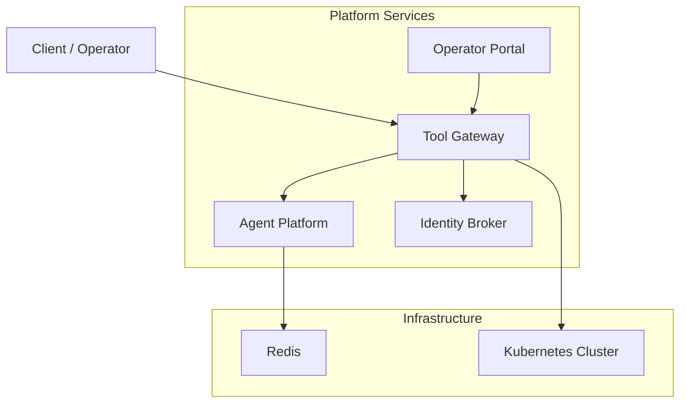
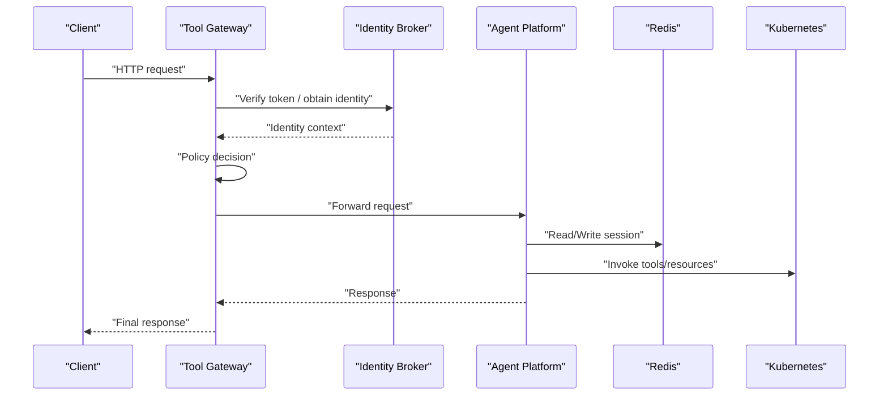
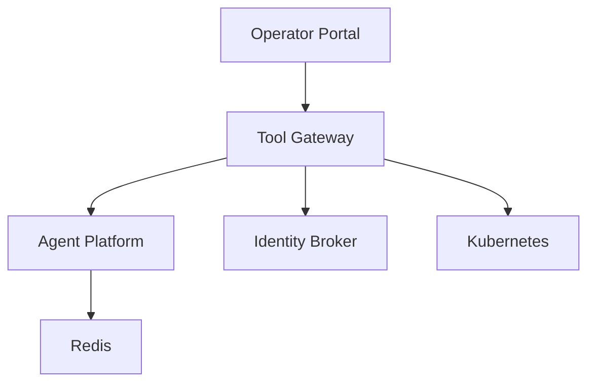

# Troubleshooting and FAQ

<cite>
**Referenced Files in This Document**
- [README.md](file://README.md)
- [agent-platform/README.md](file://products/agent-platform/README.md)
- [identity-broker/README.md](file://products/identity-broker/README.md)
- [tool-gateway/README.md](file://products/tool-gateway/README.md)
- [operator-portal/README.md](file://products/operator-portal/README.md)
- [agent-platform/src/agent_platform/app.py](file://products/agent-platform/src/agent_platform/app.py)
- [agent-platform/src/agent_platform/main.py](file://products/agent-platform/src/agent_platform/main.py)
- [agent-platform/src/agent_platform/core/config.py](file://products/agent-platform/src/agent_platform/core/config.py)
- [agent-platform/src/agent_platform/core/metrics.py](file://products/agent-platform/src/agent_platform/core/metrics.py)
- [agent-platform/src/agent_platform/core/observability.py](file://products/agent-platform/src/agent_platform/core/observability.py)
- [agent-platform/src/agent_platform/services/runtime_service.py](file://products/agent-platform/src/agent_platform/services/runtime_service.py)
- [agent-platform/src/agent_platform/services/session_service.py](file://products/agent-platform/src/agent_platform/services/session_service.py)
- [agent-platform/src/agent_platform/services/session_store.py](file://products/agent-platform/src/agent_platform/services/session_store.py)
- [identity-broker/src/identity_service/app.py](file://products/identity-broker/src/identity_service/app.py)
- [identity-broker/src/identity_service/api/routes/auth.py](file://products/identity-broker/src/identity_service/api/routes/auth.py)
- [identity-broker/src/identity_service/api/routes/identity.py](file://products/identity-broker/src/identity_service/api/routes/identity.py)
- [identity-broker/src/identity_service/services/token_service.py](file://products/identity-broker/src/identity_service/services/token_service.py)
- [identity-broker/src/identity_service/services/identity_service.py](file://products/identity-broker/src/identity_service/services/identity_service.py)
- [tool-gateway/src/api_gateway/app.py](file://products/tool-gateway/src/api_gateway/app.py)
- [tool-gateway/src/api_gateway/api/routes/chat.py](file://products/tool-gateway/src/api_gateway/api/routes/chat.py)
- [tool-gateway/src/api_gateway/api/routes/auth.py](file://products/tool-gateway/src/api_gateway/api/routes/auth.py)
- [tool-gateway/src/api_gateway/api/routes/health.py](file://products/tool-gateway/src/api_gateway/api/routes/health.py)
- [tool-gateway/src/api_gateway/services/gateway_service.py](file://products/tool-gateway/src/api_gateway/services/gateway_service.py)
- [tool-gateway/src/api_gateway/services/policy_engine.py](file://products/tool-gateway/src/api_gateway/services/policy_engine.py)
- [tool-gateway/src/api_gateway/services/token_verifier.py](file://products/tool-gateway/src/api_gateway/services/token_verifier.py)
- [tool-gateway/src/api_gateway/tools/k8s_connector.py](file://products/tool-gateway/src/api_gateway/tools/k8s_connector.py)
- [shared/platform-ops/gitops/dev-k8s/base/agent-platform/agent-service-deployment.yaml](file://shared/platform-ops/gitops/dev-k8s/base/agent-platform/agent-service-deployment.yaml)
- [shared/platform-ops/gitops/dev-k8s/base/agent-platform/agent-service-service.yaml](file://shared/platform-ops/gitops/dev-k8s/base/agent-platform/agent-service-service.yaml)
- [shared/platform-ops/gitops/dev-k8s/base/identity-broker/identity-service-deployment.yaml](file://shared/platform-ops/gitops/dev-k8s/base/identity-broker/identity-service-deployment.yaml)
- [shared/platform-ops/gitops/dev-k8s/base/identity-broker/identity-service-service.yaml](file://shared/platform-ops/gitops/dev-k8s/base/identity-broker/identity-service-service.yaml)
- [shared/platform-ops/gitops/dev-k8s/base/tool-gateway/api-gateway-deployment.yaml](file://shared/platform-ops/gitops/dev-k8s/base/tool-gateway/api-gateway-deployment.yaml)
- [shared/platform-ops/gitops/dev-k8s/base/tool-gateway/api-gateway-service.yaml](file://shared/platform-ops/gitops/dev-k8s/base/tool-gateway/api-gateway-service.yaml)
- [shared/platform-ops/gitops/dev-k8s/base/infra/redis-deployment.yaml](file://shared/platform-ops/gitops/dev-k8s/base/infra/infra/redis-deployment.yaml)
- [shared/platform-ops/gitops/dev-k8s/base/infra/redis-service.yaml](file://shared/platform-ops/gitops/dev-k8s/base/infra/redis-service.yaml)
- [shared/shared-contracts/observability-conventions.md](file://shared/shared-contracts/observability-conventions.md)
</cite>

## Table of Contents
1. [Introduction](#introduction)
2. [Project Structure](#project-structure)
3. [Core Components](#core-components)
4. [Architecture Overview](#architecture-overview)
5. [Detailed Component Analysis](#detailed-component-analysis)
6. [Dependency Analysis](#dependency-analysis)
7. [Performance Considerations](#performance-considerations)
8. [Troubleshooting Guide](#troubleshooting-guide)
9. [Conclusion](#conclusion)
10. [Appendices](#appendices)

## Introduction
This document provides comprehensive troubleshooting guidance for the Luban AIOps Platform, focusing on deployment issues, service connectivity problems, performance bottlenecks, configuration mistakes, and integration failures. It includes step-by-step diagnostic procedures, log analysis techniques, metric interpretation, trace correlation, and platform-specific FAQs covering agent execution, policy enforcement, and identity integration. Escalation procedures and community resources are also included to help you resolve issues efficiently.

## Project Structure
The platform is organized into multiple products:
- Agent Platform: runtime kernel, session management, metrics, observability, and provider integrations
- Identity Broker: authentication, token issuance, and identity services
- Tool Gateway: API gateway, policy enforcement, tool invocation, and orchestration
- Operator Portal: web UI for operators
- Shared contracts and GitOps overlays for Kubernetes deployments

[No sources needed since this diagram shows conceptual workflow, not actual code structure]

## Core Components
Key components and their responsibilities:
- Agent Platform: manages runtime sessions, invokes providers, exposes APIs, and emits metrics/telemetry
- Identity Broker: handles authentication flows, token validation, and identity context propagation
- Tool Gateway: routes requests, enforces policies, verifies tokens, and orchestrates tool invocations
- Infrastructure: Redis for session storage; Kubernetes for deployment and scaling

Common areas where issues occur:
- Deployment misconfiguration (env vars, secrets, RBAC)
- Service connectivity (DNS, networking, TLS)
- Policy enforcement errors (rules, scopes, permissions)
- Token and identity mismatches
- Session persistence failures (Redis connectivity)
- Performance bottlenecks (provider latency, queueing, resource limits)

**Section sources**
- [agent-platform/README.md](file://products/agent-platform/README.md)
- [identity-broker/README.md](file://products/identity-broker/README.md)
- [tool-gateway/README.md](file://products/tool-gateway/README.md)
- [operator-portal/README.md](file://products/operator-portal/README.md)

## Architecture Overview
End-to-end request flow from client to agent execution with identity and policy checks:

**Diagram sources**
- [tool-gateway/src/api_gateway/app.py](file://products/tool-gateway/src/api_gateway/app.py)
- [tool-gateway/src/api_gateway/api/routes/chat.py](file://products/tool-gateway/src/api_gateway/api/routes/chat.py)
- [tool-gateway/src/api_gateway/services/gateway_service.py](file://products/tool-gateway/src/api_gateway/services/gateway_service.py)
- [identity-broker/src/identity_service/app.py](file://products/identity-broker/src/identity_service/app.py)
- [agent-platform/src/agent_platform/app.py](file://products/agent-platform/src/agent_platform/app.py)
- [agent-platform/src/agent_platform/services/session_store.py](file://products/agent-platform/src/agent_platform/services/session_store.py)
- [tool-gateway/src/api_gateway/tools/k8s_connector.py](file://products/tool-gateway/src/api_gateway/tools/k8s_connector.py)

## Detailed Component Analysis

### Agent Platform
Responsibilities:
- Application lifecycle and routing
- Runtime settings and configuration
- Metrics and observability
- Session management and persistence
- Provider integrations and tool execution

Common issues:
- Misconfigured environment variables or secrets
- Redis connection failures
- Provider credential errors
- Session store timeouts or capacity issues

Diagnostics:
- Validate startup logs and health endpoints
- Check metrics for error rates and latency
- Inspect session store connectivity and TTLs
- Verify provider credentials and quotas

Resolution steps:
- Confirm env var presence and correctness
- Test Redis connectivity and network policies
- Rotate or update provider credentials
- Adjust session TTL and concurrency settings

**Section sources**
- [agent-platform/src/agent_platform/app.py](file://products/agent-platform/src/agent_platform/app.py)
- [agent-platform/src/agent_platform/main.py](file://products/agent-platform/src/agent_platform/main.py)
- [agent-platform/src/agent_platform/core/config.py](file://products/agent-platform/src/agent_platform/core/config.py)
- [agent-platform/src/agent_platform/core/metrics.py](file://products/agent-platform/src/agent_platform/core/metrics.py)
- [agent-platform/src/agent_platform/core/observability.py](file://products/agent-platform/src/agent_platform/core/observability.py)
- [agent-platform/src/agent_platform/services/runtime_service.py](file://products/agent-platform/src/agent_platform/services/runtime_service.py)
- [agent-platform/src/agent_platform/services/session_service.py](file://products/agent-platform/src/agent_platform/services/session_service.py)
- [agent-platform/src/agent_platform/services/session_store.py](file://products/agent-platform/src/agent_platform/services/session_store.py)

### Identity Broker
Responsibilities:
- Authentication endpoints
- Token issuance and validation
- Identity context propagation

Common issues:
- OIDC provider misconfiguration
- Token signature or expiration errors
- Missing or incorrect audience/issuer settings
- Network/TLS issues between services

Diagnostics:
- Validate OIDC discovery endpoint
- Inspect token payloads and claims
- Check issuer, audience, and signing keys
- Review broker logs for auth failures

Resolution steps:
- Correct OIDC configuration
- Ensure consistent token formats across services
- Update signing keys and rotation policies
- Fix DNS/TLS configurations

**Section sources**
- [identity-broker/src/identity_service/app.py](file://products/identity-broker/src/identity_service/app.py)
- [identity-broker/src/identity_service/api/routes/auth.py](file://products/identity-broker/src/identity_service/api/routes/auth.py)
- [identity-broker/src/identity_service/api/routes/identity.py](file://products/identity-broker/src/identity_service/api/routes/identity.py)
- [identity-broker/src/identity_service/services/token_service.py](file://products/identity-broker/src/identity_service/services/token_service.py)
- [identity-broker/src/identity_service/services/identity_service.py](file://products/identity-broker/src/identity_service/services/identity_service.py)

### Tool Gateway
Responsibilities:
- API routing and request handling
- Policy enforcement
- Token verification
- Orchestration of agent and tool calls

Common issues:
- Policy rule misconfigurations
- Token verification failures
- Upstream service timeouts
- RBAC or namespace restrictions

Diagnostics:
- Review policy engine decisions and logs
- Validate token verifier configuration
- Check upstream health endpoints
- Inspect Kubernetes RBAC and network policies

Resolution steps:
- Update policy rules and scopes
- Align token verifier settings with Identity Broker
- Increase timeouts or scale upstream services
- Fix RBAC roles and permissions

**Section sources**
- [tool-gateway/src/api_gateway/app.py](file://products/tool-gateway/src/api_gateway/app.py)
- [tool-gateway/src/api_gateway/api/routes/chat.py](file://products/tool-gateway/src/api_gateway/api/routes/chat.py)
- [tool-gateway/src/api_gateway/api/routes/auth.py](file://products/tool-gateway/src/api_gateway/api/routes/auth.py)
- [tool-gateway/src/api_gateway/services/gateway_service.py](file://products/tool-gateway/src/api_gateway/services/gateway_service.py)
- [tool-gateway/src/api_gateway/services/policy_engine.py](file://products/tool-gateway/src/api_gateway/services/policy_engine.py)
- [tool-gateway/src/api_gateway/services/token_verifier.py](file://products/tool-gateway/src/api_gateway/services/token_verifier.py)
- [tool-gateway/src/api_gateway/tools/k8s_connector.py](file://products/tool-gateway/src/api_gateway/tools/k8s_connector.py)

### Operator Portal
Responsibilities:
- Web UI for operators to manage platform resources
- Integration with Tool Gateway APIs

Common issues:
- CORS or proxy misconfiguration
- Incorrect base paths or headers
- Authentication cookie/token handling

Diagnostics:
- Check browser console and network tab
- Validate Nginx configuration and reverse proxy settings
- Confirm portal’s API endpoints and auth headers

Resolution steps:
- Fix CORS and proxy headers
- Ensure correct base path and API versioning
- Align token handling with Identity Broker

**Section sources**
- [operator-portal/README.md](file://products/operator-portal/README.md)

## Dependency Analysis
Service dependencies and deployment manifests:

**Diagram sources**
- [shared/platform-ops/gitops/dev-k8s/base/tool-gateway/api-gateway-deployment.yaml](file://shared/platform-ops/gitops/dev-k8s/base/tool-gateway/api-gateway-deployment.yaml)
- [shared/platform-ops/gitops/dev-k8s/base/agent-platform/agent-service-deployment.yaml](file://shared/platform-ops/gitops/dev-k8s/base/agent-platform/agent-service-deployment.yaml)
- [shared/platform-ops/gitops/dev-k8s/base/identity-broker/identity-service-deployment.yaml](file://shared/platform-ops/gitops/dev-k8s/base/identity-broker/identity-service-deployment.yaml)
- [shared/platform-ops/gitops/dev-k8s/base/infra/redis-deployment.yaml](file://shared/platform-ops/gitops/dev-k8s/base/infra/redis-deployment.yaml)

**Section sources**
- [shared/platform-ops/gitops/dev-k8s/base/tool-gateway/api-gateway-service.yaml](file://shared/platform-ops/gitops/dev-k8s/base/tool-gateway/api-gateway-service.yaml)
- [shared/platform-ops/gitops/dev-k8s/base/agent-platform/agent-service-service.yaml](file://shared/platform-ops/gitops/dev-k8s/base/agent-platform/agent-service-service.yaml)
- [shared/platform-ops/gitops/dev-k8s/base/identity-broker/identity-service-service.yaml](file://shared/platform-ops/gitops/dev-k8s/base/identity-broker/identity-service-service.yaml)
- [shared/platform-ops/gitops/dev-k8s/base/infra/redis-service.yaml](file://shared/platform-ops/gitops/dev-k8s/base/infra/redis-service.yaml)

## Performance Considerations
- Monitor latency and error rates via metrics endpoints
- Tune session store TTLs and concurrency limits
- Scale horizontally based on CPU/memory utilization
- Optimize provider call batching and retries
- Use caching strategies where appropriate
- Profile slow paths in policy evaluation and tool invocation

[No sources needed since this section provides general guidance]

## Troubleshooting Guide

### Deployment Issues
Symptoms:
- Pods failing to start or crash-looping
- Health checks failing
- ConfigMap/Secret mount errors

Diagnostic steps:
- Inspect pod logs and events
- Validate environment variables and secrets
- Check readiness/liveness probes
- Verify image tags and pull policies

Resolution:
- Fix missing or invalid config values
- Ensure secrets are present and correctly referenced
- Adjust probe thresholds and timeouts
- Confirm container images are accessible

**Section sources**
- [agent-platform/src/agent_platform/main.py](file://products/agent-platform/src/agent_platform/main.py)
- [identity-broker/src/identity_service/app.py](file://products/identity-broker/src/identity_service/app.py)
- [tool-gateway/src/api_gateway/app.py](file://products/tool-gateway/src/api_gateway/app.py)
- [shared/platform-ops/gitops/dev-k8s/base/agent-platform/agent-service-deployment.yaml](file://shared/platform-ops/gitops/dev-k8s/base/agent-platform/agent-service-deployment.yaml)
- [shared/platform-ops/gitops/dev-k8s/base/identity-broker/identity-service-deployment.yaml](file://shared/platform-ops/gitops/dev-k8s/base/identity-broker/identity-service-deployment.yaml)
- [shared/platform-ops/gitops/dev-k8s/base/tool-gateway/api-gateway-deployment.yaml](file://shared/platform-ops/gitops/dev-k8s/base/tool-gateway/api-gateway-deployment.yaml)

### Service Connectivity Problems
Symptoms:
- Timeouts between services
- DNS resolution failures
- TLS handshake errors

Diagnostic steps:
- Verify service names and ports
- Check network policies and firewall rules
- Validate TLS certificates and CA chains
- Test connectivity using kubectl exec

Resolution:
- Correct service definitions and endpoints
- Update network policies to allow required traffic
- Renew or configure proper certificates
- Ensure consistent naming conventions

**Section sources**
- [shared/platform-ops/gitops/dev-k8s/base/agent-platform/agent-service-service.yaml](file://shared/platform-ops/gitops/dev-k8s/base/agent-platform/agent-service-service.yaml)
- [shared/platform-ops/gitops/dev-k8s/base/identity-broker/identity-service-service.yaml](file://shared/platform-ops/gitops/dev-k8s/base/identity-broker/identity-service-service.yaml)
- [shared/platform-ops/gitops/dev-k8s/base/tool-gateway/api-gateway-service.yaml](file://shared/platform-ops/gitops/dev-k8s/base/tool-gateway/api-gateway-service.yaml)

### Performance Bottlenecks
Symptoms:
- High latency on API calls
- Elevated error rates under load
- Resource saturation (CPU/Memory)

Diagnostic steps:
- Analyze metrics for hotspots
- Profile request tracing spans
- Check queue depths and worker utilization
- Review provider rate limits and quotas

Resolution:
- Scale out services and increase replicas
- Tune concurrency and timeout settings
- Implement backpressure and circuit breakers
- Optimize provider interactions and caching

**Section sources**
- [agent-platform/src/agent_platform/core/metrics.py](file://products/agent-platform/src/agent_platform/core/metrics.py)
- [tool-gateway/src/api_gateway/services/gateway_service.py](file://products/tool-gateway/src/api_gateway/services/gateway_service.py)

### Configuration Mistakes
Symptoms:
- Startup failures due to missing env vars
- Invalid configuration values causing runtime errors
- Secrets not mounted or unreadable

Diagnostic steps:
- Compare desired vs actual config in pods
- Validate schema and types for config values
- Check secret references and permissions

Resolution:
- Add missing environment variables
- Correct invalid values and defaults
- Ensure secrets are properly mounted and readable

**Section sources**
- [agent-platform/src/agent_platform/core/config.py](file://products/agent-platform/src/agent_platform/core/config.py)

### Integration Failures
Symptoms:
- Policy enforcement denials
- Token verification failures
- Provider authentication errors

Diagnostic steps:
- Inspect policy engine logs and decisions
- Validate token signatures and claims
- Check provider credentials and endpoints

Resolution:
- Update policy rules and scopes
- Align token verifier settings with Identity Broker
- Refresh provider credentials and test endpoints

**Section sources**
- [tool-gateway/src/api_gateway/services/policy_engine.py](file://products/tool-gateway/src/api_gateway/services/policy_engine.py)
- [tool-gateway/src/api_gateway/services/token_verifier.py](file://products/tool-gateway/src/api_gateway/services/token_verifier.py)
- [identity-broker/src/identity_service/services/token_service.py](file://products/identity-broker/src/identity_service/services/token_service.py)

### Log Analysis Techniques
- Centralize logs and use structured formats
- Correlate logs by request IDs and trace spans
- Filter by severity and component
- Use log aggregation tools for search and dashboards

**Section sources**
- [agent-platform/src/agent_platform/core/observability.py](file://products/agent-platform/src/agent_platform/core/observability.py)
- [shared/shared-contracts/observability-conventions.md](file://shared/shared-contracts/observability-conventions.md)

### Metric Interpretation
- Track request rate, latency percentiles, and error rates
- Monitor session store operations and TTL expirations
- Observe provider call success/failure ratios
- Alert on anomalies and threshold breaches

**Section sources**
- [agent-platform/src/agent_platform/core/metrics.py](file://products/agent-platform/src/agent_platform/core/metrics.py)
- [shared/shared-contracts/observability-conventions.md](file://shared/shared-contracts/observability-conventions.md)

### Trace Correlation
- Propagate trace IDs across services
- Map spans to specific operations (auth, policy, tool invocation)
- Visualize end-to-end flows to identify bottlenecks
- Annotate traces with contextual metadata

**Section sources**
- [shared/shared-contracts/observability-conventions.md](file://shared/shared-contracts/observability-conventions.md)

### Agent Execution Issues
Symptoms:
- Agents fail to start or execute tasks
- Provider calls time out or return errors
- Sessions not persisted or restored

Diagnostic steps:
- Check agent logs for startup errors
- Validate provider credentials and quotas
- Inspect session store connectivity and TTLs

Resolution:
- Fix provider configuration and credentials
- Adjust session TTL and concurrency
- Scale agents and tune resource limits

**Section sources**
- [agent-platform/src/agent_platform/services/runtime_service.py](file://products/agent-platform/src/agent_platform/services/runtime_service.py)
- [agent-platform/src/agent_platform/services/session_store.py](file://products/agent-platform/src/agent_platform/services/session_store.py)

### Policy Enforcement Problems
Symptoms:
- Requests denied unexpectedly
- Policies not applied as expected
- Scope mismatches leading to access issues

Diagnostic steps:
- Review policy engine decisions and logs
- Validate policy rules and scopes
- Check identity context propagation

Resolution:
- Update policy rules and ensure correct scoping
- Align identity context with policy requirements
- Test policy changes in staging before production

**Section sources**
- [tool-gateway/src/api_gateway/services/policy_engine.py](file://products/tool-gateway/src/api_gateway/services/policy_engine.py)

### Identity Integration Challenges
Symptoms:
- Authentication failures
- Token validation errors
- Mismatched audiences or issuers

Diagnostic steps:
- Validate OIDC discovery and endpoints
- Inspect token payloads and claims
- Ensure consistent issuer and audience settings

Resolution:
- Correct OIDC configuration
- Align token verifier with Identity Broker
- Rotate signing keys and update clients

**Section sources**
- [identity-broker/src/identity_service/services/token_service.py](file://products/identity-broker/src/identity_service/services/token_service.py)
- [tool-gateway/src/api_gateway/services/token_verifier.py](file://products/tool-gateway/src/api_gateway/services/token_verifier.py)

### Escalation Procedures
- Collect logs, metrics, and traces for the affected period
- Reproduce the issue in a staging environment if possible
- Engage platform maintainers with detailed diagnostics
- Follow up with community channels for additional support

[No sources needed since this section provides general guidance]

### Community Resources
- Repository documentation and specs
- Issue templates and contribution guidelines
- Release notes and roadmap updates

**Section sources**
- [README.md](file://README.md)
- [CONTRIBUTING.md](file://CONTRIBUTING.md)

## Conclusion
This troubleshooting guide equips you with systematic approaches to diagnose and resolve common issues across the Luban AIOps Platform. By leveraging logs, metrics, and traces, and following the step-by-step resolutions provided, you can quickly address deployment, connectivity, performance, configuration, and integration challenges. For further assistance, consult community resources and escalate with comprehensive diagnostics when necessary.

## Appendices

### Frequently Asked Questions
- Why am I seeing “unauthorized” errors?
  - Verify token format, issuer, and audience; check Identity Broker configuration.
- Why do my agent sessions disappear?
  - Check Redis connectivity, TTL settings, and session store configuration.
- Why are policy decisions denying my requests?
  - Review policy rules, scopes, and identity context propagation.
- How do I troubleshoot high latency?
  - Analyze metrics and traces; scale services; optimize provider calls.
- What should I include when escalating an issue?
  - Logs, metrics, traces, reproduction steps, and environment details.

[No sources needed since this section provides general guidance]