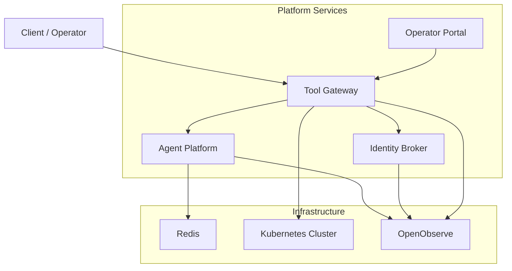
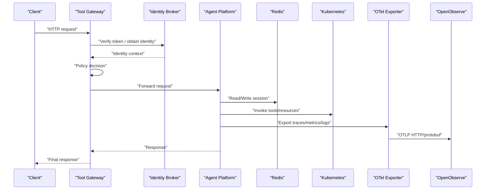
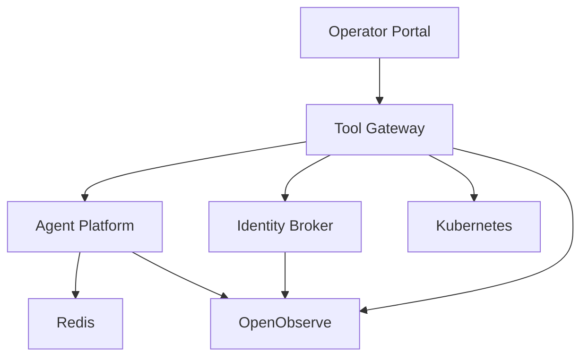

# Troubleshooting and FAQ

<cite>
**Referenced Files in This Document**
- [README.md](file://README.md)
- [agent-platform/README.md](file://products/agent-platform/README.md)
- [identity-broker/README.md](file://products/identity-broker/README.md)
- [tool-gateway/README.md](file://products/tool-gateway/README.md)
- [operator-portal/README.md](file://products/operator-portal/README.md)
- [agent-platform/src/agent_platform/app.py](file://products/agent-platform/src/agent_platform/app.py)
- [agent-platform/src/agent_platform/main.py](file://products/agent-platform/src/agent_platform/main.py)
- [agent-platform/src/agent_platform/core/config.py](file://products/agent-platform/src/agent_platform/core/config.py)
- [agent-platform/src/agent_platform/core/metrics.py](file://products/agent-platform/src/agent_platform/core/metrics.py)
- [agent-platform/src/agent_platform/core/observability.py](file://products/agent-platform/src/agent_platform/core/observability.py)
- [agent-platform/src/agent_platform/services/runtime_service.py](file://products/agent-platform/src/agent_platform/services/runtime_service.py)
- [agent-platform/src/agent_platform/services/session_service.py](file://products/agent-platform/src/agent_platform/services/session_service.py)
- [agent-platform/src/agent_platform/services/session_store.py](file://products/agent-platform/src/agent_platform/services/session_store.py)
- [agent-platform/src/agent_platform/services/session_transcript.py](file://products/agent-platform/src/agent_platform/services/session_transcript.py)
- [agent-platform/src/agent_platform/services/hitl_confirmations.py](file://products/agent-platform/src/agent_platform/services/hitl_confirmations.py)
- [agent-platform/src/agent_service/core/telemetry.py](file://products/agent-platform/src/agent_service/core/telemetry.py)
- [platform-gateway/src/platform_gateway/services/gateway_service.py](file://products/platform-gateway/src/platform_gateway/services/gateway_service.py)
- [platform-gateway/tests/test_session_workspace.py](file://products/platform-gateway/tests/test_session_workspace.py)
- [identity-broker/src/identity_service/app.py](file://products/identity-broker/src/identity_service/app.py)
- [identity-broker/src/identity_service/api/routes/auth.py](file://products/identity-broker/src/identity_service/api/routes/auth.py)
- [identity-broker/src/identity_service/api/routes/identity.py](file://products/identity-broker/src/identity_service/api/routes/identity.py)
- [identity-broker/src/identity_service/services/token_service.py](file://products/identity-broker/src/identity_service/services/token_service.py)
- [identity-broker/src/identity_service/services/identity_service.py](file://products/identity-broker/src/identity_service/services/identity_service.py)
- [tool-gateway/src/api_gateway/app.py](file://products/tool-gateway/src/api_gateway/app.py)
- [tool-gateway/src/api_gateway/api/routes/chat.py](file://products/tool-gateway/src/api_gateway/api/routes/chat.py)
- [tool-gateway/src/api_gateway/api/routes/auth.py](file://products/tool-gateway/src/api_gateway/api/routes/auth.py)
- [tool-gateway/src/api_gateway/api/routes/health.py](file://products/tool-gateway/src/api_gateway/api/routes/health.py)
- [tool-gateway/src/api_gateway/services/gateway_service.py](file://products/tool-gateway/src/api_gateway/services/gateway_service.py)
- [tool-gateway/src/api_gateway/services/policy_engine.py](file://products/tool-gateway/src/api_gateway/services/policy_engine.py)
- [tool-gateway/src/api_gateway/services/token_verifier.py](file://products/tool-gateway/src/api_gateway/services/token_verifier.py)
- [tool-gateway/src/api_gateway/tools/k8s_connector.py](file://products/tool-gateway/src/api_gateway/tools/k8s_connector.py)
- [shared/platform-ops/gitops/dev-k8s/base/agent-platform/agent-service-deployment.yaml](file://shared/platform-ops/gitops/dev-k8s/base/agent-platform/agent-service-deployment.yaml)
- [shared/platform-ops/gitops/dev-k8s/base/agent-platform/agent-service-service.yaml](file://shared/platform-ops/gitops/dev-k8s/base/agent-platform/agent-service-service.yaml)
- [shared/platform-ops/gitops/dev-k8s/base/identity-broker/identity-service-deployment.yaml](file://shared/platform-ops/gitops/dev-k8s/base/identity-broker/identity-service-deployment.yaml)
- [shared/platform-ops/gitops/dev-k8s/base/identity-broker/identity-service-service.yaml](file://shared/platform-ops/gitops/dev-k8s/base/identity-broker/identity-service-service.yaml)
- [shared/platform-ops/gitops/dev-k8s/base/tool-gateway/api-gateway-deployment.yaml](file://shared/platform-ops/gitops/dev-k8s/base/tool-gateway/api-gateway-deployment.yaml)
- [shared/platform-ops/gitops/dev-k8s/base/tool-gateway/api-gateway-service.yaml](file://shared/platform-ops/gitops/dev-k8s/base/tool-gateway/api-gateway-service.yaml)
- [shared/platform-ops/gitops/dev-k8s/base/infra/redis-deployment.yaml](file://shared/platform-ops/gitops/dev-k8s/base/infra/infra/redis-deployment.yaml)
- [shared/platform-ops/gitops/dev-k8s/base/infra/redis-service.yaml](file://shared/platform-ops/gitops/dev-k8s/base/infra/redis-service.yaml)
- [shared/shared-contracts/observability-conventions.md](file://shared/shared-contracts/observability-conventions.md)
- [shared/platform-ops/gitops/sync-otel-secrets.sh](file://shared/platform-ops/gitops/sync-otel-secrets.sh)
- [.ooq.py](file://.ooq.py)
- [.ooq2.py](file://.ooq2.py)
- [docs/guides/configuration-reference.md](file://docs/guides/configuration-reference.md)
- [docs/guides/troubleshooting.md](file://docs/guides/troubleshooting.md)
</cite>

## Update Summary
**Changes Made**
- Added comprehensive transcript fallback troubleshooting section covering kernel state snapshot unavailability scenarios
- Enhanced session delete conflict resolution documentation for sessions with parked HITL confirmations returning 409 status
- Updated session enumeration prevention guidance with anti-enumeration 404 responses for unknown or foreign session IDs
- Expanded diagnostic procedures for transcript reconstruction failures and confirmation parking issues

## Table of Contents
1. [Introduction](#introduction)
2. [Project Structure](#project-structure)
3. [Core Components](#core-components)
4. [Architecture Overview](#architecture-overview)
5. [Detailed Component Analysis](#detailed-component-analysis)
6. [Dependency Analysis](#dependency-analysis)
7. [Performance Considerations](#performance-considerations)
8. [Troubleshooting Guide](#troubleshooting-guide)
9. [Conclusion](#conclusion)
10. [Appendices](#appendices)

## Introduction
This document provides comprehensive troubleshooting guidance for the Luban AIOps Platform, focusing on deployment issues, service connectivity problems, performance bottlenecks, configuration mistakes, and integration failures. It includes step-by-step diagnostic procedures, log analysis techniques, metric interpretation, trace correlation, and platform-specific FAQs covering agent execution, policy enforcement, identity integration, OpenObserve telemetry pipeline issues, transcript fallback scenarios, session delete conflicts, and session enumeration prevention. Escalation procedures and community resources are also included to help you resolve issues efficiently.

## Project Structure
The platform is organized into multiple products:
- Agent Platform: runtime kernel, session management, metrics, observability, and provider integrations
- Identity Broker: authentication, token issuance, and identity services
- Tool Gateway: API gateway, policy enforcement, tool invocation, and orchestration
- Operator Portal: web UI for operators
- Shared contracts and GitOps overlays for Kubernetes deployments



[No sources needed since this diagram shows conceptual workflow, not actual code structure]

## Core Components
Key components and their responsibilities:
- Agent Platform: manages runtime sessions, invokes providers, exposes APIs, and emits metrics/telemetry
- Identity Broker: handles authentication flows, token validation, and identity context propagation
- Tool Gateway: routes requests, enforces policies, verifies tokens, and orchestrates tool invocations
- Infrastructure: Redis for session storage; Kubernetes for deployment and scaling; OpenObserve for telemetry aggregation

Common areas where issues occur:
- Deployment misconfiguration (env vars, secrets, RBAC)
- Service connectivity (DNS, networking, TLS)
- Policy enforcement errors (rules, scopes, permissions)
- Token and identity mismatches
- Session persistence failures (Redis connectivity)
- Performance bottlenecks (provider latency, queueing, resource limits)
- **OpenObserve telemetry pipeline failures** (exporter connectivity, authentication, log bridging)
- **Transcript fallback scenarios** when kernel state snapshots are unavailable
- **Session delete conflicts** with parked HITL confirmations returning 409 status
- **Session enumeration prevention** through anti-enumeration 404 responses

**Section sources**
- [agent-platform/README.md](file://products/agent-platform/README.md)
- [identity-broker/README.md](file://products/identity-broker/README.md)
- [tool-gateway/README.md](file://products/tool-gateway/README.md)
- [operator-portal/README.md](file://products/operator-portal/README.md)

## Architecture Overview
End-to-end request flow from client to agent execution with identity and policy checks, plus telemetry export:



**Diagram sources**
- [tool-gateway/src/api_gateway/app.py](file://products/tool-gateway/src/api_gateway/app.py)
- [tool-gateway/src/api_gateway/api/routes/chat.py](file://products/tool-gateway/src/api_gateway/api/routes/chat.py)
- [tool-gateway/src/api_gateway/services/gateway_service.py](file://products/tool-gateway/src/api_gateway/services/gateway_service.py)
- [identity-broker/src/identity_service/app.py](file://products/identity-broker/src/identity_service/app.py)
- [agent-platform/src/agent_platform/app.py](file://products/agent-platform/src/agent_platform/app.py)
- [agent-platform/src/agent_platform/services/session_store.py](file://products/agent-platform/src/agent_platform/services/session_store.py)
- [tool-gateway/src/api_gateway/tools/k8s_connector.py](file://products/tool-gateway/src/api_gateway/tools/k8s_connector.py)
- [agent-platform/src/agent_service/core/telemetry.py](file://products/agent-platform/src/agent_service/core/telemetry.py)

## Detailed Component Analysis

### Agent Platform
Responsibilities:
- Application lifecycle and routing
- Runtime settings and configuration
- Metrics and observability
- Session management and persistence
- Provider integrations and tool execution
- **OpenTelemetry push pipeline initialization and log bridging**
- **Transcript reconstruction from kernel state snapshots**
- **HITL confirmation parking and resolution**

Common issues:
- Misconfigured environment variables or secrets
- Redis connection failures
- Provider credential errors
- Session store timeouts or capacity issues
- **OTel exporter connectivity failures**
- **Authentication header missing or invalid**
- **Log bridge not attaching properly**
- **Kernel state snapshot unavailability causing transcript fallback**
- **Parked HITL confirmations blocking session deletion**
- **Foreign session ID access attempts triggering anti-enumeration**

Diagnostics:
- Validate startup logs and health endpoints
- Check metrics for error rates and latency
- Inspect session store connectivity and TTLs
- Verify provider credentials and quotas
- **Check OTel setup logs for initialization status**
- **Validate OTEL_EXPORTER_OTLP_ENDPOINT configuration**
- **Verify OTEL_EXPORTER_OTLP_HEADERS secret presence**
- **Monitor transcript extraction failures and fallback behavior**
- **Check for parked confirmation states blocking operations**

Resolution steps:
- Confirm env var presence and correctness
- Test Redis connectivity and network policies
- Rotate or update provider credentials
- Adjust session TTL and concurrency settings
- **Run sync-otel-secrets.sh to provision authentication headers**
- **Verify OpenObserve endpoint accessibility**
- **Check pod logs for "otel telemetry setup failed" messages**
- **Resolve parked confirmations before attempting session deletion**
- **Handle 404 responses for foreign session access attempts**

**Section sources**
- [agent-platform/src/agent_platform/app.py](file://products/agent-platform/src/agent_platform/app.py)
- [agent-platform/src/agent_platform/main.py](file://products/agent-platform/src/agent_platform/main.py)
- [agent-platform/src/agent_platform/core/config.py](file://products/agent-platform/src/agent_platform/core/config.py)
- [agent-platform/src/agent_platform/core/metrics.py](file://products/agent-platform/src/agent_platform/core/metrics.py)
- [agent-platform/src/agent_platform/core/observability.py](file://products/agent-platform/src/agent_platform/core/observability.py)
- [agent-platform/src/agent_platform/services/runtime_service.py](file://products/agent-platform/src/agent_platform/services/runtime_service.py)
- [agent-platform/src/agent_platform/services/session_service.py](file://products/agent-platform/src/agent_platform/services/session_service.py)
- [agent-platform/src/agent_platform/services/session_store.py](file://products/agent-platform/src/agent_platform/services/session_store.py)
- [agent-platform/src/agent_platform/services/session_transcript.py](file://products/agent-platform/src/agent_platform/services/session_transcript.py)
- [agent-platform/src/agent_platform/services/hitl_confirmations.py](file://products/agent-platform/src/agent_platform/services/hitl_confirmations.py)
- [agent-platform/src/agent_service/core/telemetry.py](file://products/agent-platform/src/agent_service/core/telemetry.py)

### Identity Broker
Responsibilities:
- Authentication endpoints
- Token issuance and validation
- Identity context propagation
- **OpenTelemetry telemetry export**

Common issues:
- OIDC provider misconfiguration
- Token signature or expiration errors
- Missing or incorrect audience/issuer settings
- Network/TLS issues between services
- **OTel exporter authentication failures**

Diagnostics:
- Validate OIDC discovery endpoint
- Inspect token payloads and claims
- Check issuer, audience, and signing keys
- Review broker logs for auth failures
- **Check OTel setup and export logs**

Resolution steps:
- Correct OIDC configuration
- Ensure consistent token formats across services
- Update signing keys and rotation policies
- Fix DNS/TLS configurations
- **Provision OTel headers via sync-otel-secrets.sh**

**Section sources**
- [identity-broker/src/identity_service/app.py](file://products/identity-broker/src/identity_service/app.py)
- [identity-broker/src/identity_service/api/routes/auth.py](file://products/identity-broker/src/identity_service/api/routes/auth.py)
- [identity-broker/src/identity_service/api/routes/identity.py](file://products/identity-broker/src/identity_service/api/routes/identity.py)
- [identity-broker/src/identity_service/services/token_service.py](file://products/identity-broker/src/identity_service/services/token_service.py)
- [identity-broker/src/identity_service/services/identity_service.py](file://products/identity-broker/src/identity_service/services/identity_service.py)

### Tool Gateway
Responsibilities:
- API routing and request handling
- Policy enforcement
- Token verification
- Orchestration of agent and tool calls
- **OpenTelemetry telemetry export**
- **Anti-enumeration posture preservation for session operations**

Common issues:
- Policy rule misconfigurations
- Token verification failures
- Upstream service timeouts
- RBAC or namespace restrictions
- **OTel exporter connectivity issues**
- **Incorrect mapping of upstream 4xx errors to gateway responses**

Diagnostics:
- Review policy engine decisions and logs
- Validate token verifier configuration
- Check upstream health endpoints
- Inspect Kubernetes RBAC and network policies
- **Verify OTel endpoint configuration**
- **Check that 404 responses pass through unchanged for anti-enumeration**

Resolution steps:
- Update policy rules and scopes
- Align token verifier settings with Identity Broker
- Increase timeouts or scale upstream services
- Fix RBAC roles and permissions
- **Ensure OTel headers are properly configured**
- **Preserve upstream 404 responses for unknown/foreign sessions**

**Section sources**
- [tool-gateway/src/api_gateway/app.py](file://products/tool-gateway/src/api_gateway/app.py)
- [tool-gateway/src/api_gateway/api/routes/chat.py](file://products/tool-gateway/src/api_gateway/api/routes/chat.py)
- [tool-gateway/src/api_gateway/api/routes/auth.py](file://products/tool-gateway/src/api_gateway/api/routes/auth.py)
- [tool-gateway/src/api_gateway/services/gateway_service.py](file://products/tool-gateway/src/api_gateway/services/gateway_service.py)
- [tool-gateway/src/api_gateway/services/policy_engine.py](file://products/tool-gateway/src/api_gateway/services/policy_engine.py)
- [tool-gateway/src/api_gateway/services/token_verifier.py](file://products/tool-gateway/src/api_gateway/services/token_verifier.py)
- [tool-gateway/src/api_gateway/tools/k8s_connector.py](file://products/tool-gateway/src/api_gateway/tools/k8s_connector.py)

### Operator Portal
Responsibilities:
- Web UI for operators to manage platform resources
- Integration with Tool Gateway APIs

Common issues:
- CORS or proxy misconfiguration
- Incorrect base paths or headers
- Authentication cookie/token handling

Diagnostics:
- Check browser console and network tab
- Validate Nginx configuration and reverse proxy settings
- Confirm portal's API endpoints and auth headers

Resolution steps:
- Fix CORS and proxy headers
- Ensure correct base path and API versioning
- Align token handling with Identity Broker

**Section sources**
- [operator-portal/README.md](file://products/operator-portal/README.md)

## Dependency Analysis
Service dependencies and deployment manifests:



**Diagram sources**
- [shared/platform-ops/gitops/dev-k8s/base/tool-gateway/api-gateway-deployment.yaml](file://shared/platform-ops/gitops/dev-k8s/base/tool-gateway/api-gateway-deployment.yaml)
- [shared/platform-ops/gitops/dev-k8s/base/agent-platform/agent-service-deployment.yaml](file://shared/platform-ops/gitops/dev-k8s/base/agent-platform/agent-service-deployment.yaml)
- [shared/platform-ops/gitops/dev-k8s/base/identity-broker/identity-service-deployment.yaml](file://shared/platform-ops/gitops/dev-k8s/base/identity-broker/identity-service-deployment.yaml)
- [shared/platform-ops/gitops/dev-k8s/base/infra/redis-deployment.yaml](file://shared/platform-ops/gitops/dev-k8s/base/infra/redis-deployment.yaml)

**Section sources**
- [shared/platform-ops/gitops/dev-k8s/base/tool-gateway/api-gateway-service.yaml](file://shared/platform-ops/gitops/dev-k8s/base/tool-gateway/api-gateway-service.yaml)
- [shared/platform-ops/gitops/dev-k8s/base/agent-platform/agent-service-service.yaml](file://shared/platform-ops/gitops/dev-k8s/base/agent-platform/agent-service-service.yaml)
- [shared/platform-ops/gitops/dev-k8s/base/identity-broker/identity-service-service.yaml](file://shared/platform-ops/gitops/dev-k8s/base/identity-broker/identity-service-service.yaml)
- [shared/platform-ops/gitops/dev-k8s/base/infra/redis-service.yaml](file://shared/platform-ops/gitops/dev-k8s/base/infra/redis-service.yaml)

## Performance Considerations
- Monitor latency and error rates via metrics endpoints
- Tune session store TTLs and concurrency limits
- Scale horizontally based on CPU/memory utilization
- Optimize provider call batching and retries
- Use caching strategies where appropriate
- Profile slow paths in policy evaluation and tool invocation
- **Monitor OTel exporter batch processing and network performance**
- **Track OpenObserve ingestion throughput and latency**
- **Monitor transcript reconstruction performance and fallback frequency**
- **Track parked confirmation resolution times and session operation delays**

## Troubleshooting Guide

### Deployment Issues
Symptoms:
- Pods failing to start or crash-looping
- Health checks failing
- ConfigMap/Secret mount errors

Diagnostic steps:
- Inspect pod logs and events
- Validate environment variables and secrets
- Check readiness/liveness probes
- Verify image tags and pull policies

Resolution:
- Fix missing or invalid config values
- Ensure secrets are present and correctly referenced
- Adjust probe thresholds and timeouts
- Confirm container images are accessible

**Section sources**
- [agent-platform/src/agent_platform/main.py](file://products/agent-platform/src/agent_platform/main.py)
- [identity-broker/src/identity_service/app.py](file://products/identity-broker/src/identity_service/app.py)
- [tool-gateway/src/api_gateway/app.py](file://products/tool-gateway/src/api_gateway/app.py)
- [shared/platform-ops/gitops/dev-k8s/base/agent-platform/agent-service-deployment.yaml](file://shared/platform-ops/gitops/dev-k8s/base/agent-platform/agent-service-deployment.yaml)
- [shared/platform-ops/gitops/dev-k8s/base/identity-broker/identity-service-deployment.yaml](file://shared/platform-ops/gitops/dev-k8s/base/identity-broker/identity-service-deployment.yaml)
- [shared/platform-ops/gitops/dev-k8s/base/tool-gateway/api-gateway-deployment.yaml](file://shared/platform-ops/gitops/dev-k8s/base/tool-gateway/api-gateway-deployment.yaml)

### Service Connectivity Problems
Symptoms:
- Timeouts between services
- DNS resolution failures
- TLS handshake errors

Diagnostic steps:
- Verify service names and ports
- Check network policies and firewall rules
- Validate TLS certificates and CA chains
- Test connectivity using kubectl exec

Resolution:
- Correct service definitions and endpoints
- Update network policies to allow required traffic
- Renew or configure proper certificates
- Ensure consistent naming conventions

**Section sources**
- [shared/platform-ops/gitops/dev-k8s/base/agent-platform/agent-service-service.yaml](file://shared/platform-ops/gitops/dev-k8s/base/agent-platform/agent-service-service.yaml)
- [shared/platform-ops/gitops/dev-k8s/base/identity-broker/identity-service-service.yaml](file://shared/platform-ops/gitops/dev-k8s/base/identity-broker/identity-service-service.yaml)
- [shared/platform-ops/gitops/dev-k8s/base/tool-gateway/api-gateway-service.yaml](file://shared/platform-ops/gitops/dev-k8s/base/tool-gateway/api-gateway-service.yaml)

### Performance Bottlenecks
Symptoms:
- High latency on API calls
- Elevated error rates under load
- Resource saturation (CPU/Memory)

Diagnostic steps:
- Analyze metrics for hotspots
- Profile request tracing spans
- Check queue depths and worker utilization
- Review provider rate limits and quotas

Resolution:
- Scale out services and increase replicas
- Tune concurrency and timeout settings
- Implement backpressure and circuit breakers
- Optimize provider interactions and caching

**Section sources**
- [agent-platform/src/agent_platform/core/metrics.py](file://products/agent-platform/src/agent_platform/core/metrics.py)
- [tool-gateway/src/api_gateway/services/gateway_service.py](file://products/tool-gateway/src/api_gateway/services/gateway_service.py)

### Configuration Mistakes
Symptoms:
- Startup failures due to missing env vars
- Invalid configuration values causing runtime errors
- Secrets not mounted or unreadable

Diagnostic steps:
- Compare desired vs actual config in pods
- Validate schema and types for config values
- Check secret references and permissions

Resolution:
- Add missing environment variables
- Correct invalid values and defaults
- Ensure secrets are properly mounted and readable

**Section sources**
- [agent-platform/src/agent_platform/core/config.py](file://products/agent-platform/src/agent_platform/core/config.py)

### Integration Failures
Symptoms:
- Policy enforcement denials
- Token verification failures
- Provider authentication errors

Diagnostic steps:
- Inspect policy engine logs and decisions
- Validate token signatures and claims
- Check provider credentials and endpoints

Resolution:
- Update policy rules and scopes
- Align token verifier settings with Identity Broker
- Refresh provider credentials and test endpoints

**Section sources**
- [tool-gateway/src/api_gateway/services/policy_engine.py](file://products/tool-gateway/src/api_gateway/services/policy_engine.py)
- [tool-gateway/src/api_gateway/services/token_verifier.py](file://products/tool-gateway/src/api_gateway/services/token_verifier.py)
- [identity-broker/src/identity_service/services/token_service.py](file://products/identity-broker/src/identity_service/services/token_service.py)

### OpenObserve Telemetry Pipeline Issues

#### Symptom: No traces/metrics/logs appear in OpenObserve
**Most likely cause:** One of — the OTLP ingest auth header is missing from a service's secret (OpenObserve answers 401 and the exporter drops batches), `OTEL_ENABLED` is false, or `OTEL_EXPORTER_OTLP_ENDPOINT` points at the wrong org/path. Telemetry always fails open, so services themselves look healthy.

**Diagnostic:**

```bash
# Gate + endpoint come from the shared ConfigMap
kubectl -n dev-luban-aiops get configmap platform-runtime-config \
  -o jsonpath='{.data.OTEL_ENABLED}{"\n"}{.data.OTEL_EXPORTER_OTLP_ENDPOINT}{"\n"}'

# The auth header must be present in each service's runtime-secrets Secret
kubectl -n dev-luban-aiops get secret skills-hub-runtime-secrets \
  -o jsonpath='{.data.OTEL_EXPORTER_OTLP_HEADERS}' | base64 -d | cut -c1-40

# Exporter errors surface in pod logs ("otel telemetry setup failed",
# "401" from the batch exporter)
kubectl -n dev-luban-aiops logs deployment/skills-hub --tail=50 | grep -i otel
```

**Resolution:**

- Header missing or 401s in the logs: export the OpenObserve root credentials
  (luban-bootstrapper `openobserve/secrets/openobserve.env`) and re-run
  `shared/platform-ops/gitops/sync-otel-secrets.sh` (or `make deploy` with the
  variables exported); it upserts the header into all six secrets and restarts
  the workloads.
- `OTEL_ENABLED=false`: set it to `true` in
  `dev-k8s/base/shared/runtime.env` and redeploy.
- Endpoint wrong: it must stop at the org prefix
  (`.../api/default`); the exporters append `/v1/{traces,metrics,logs}`.
- Conventions and the log-bridge semantics:
  `shared/shared-contracts/observability-conventions.md`.

#### Symptom: Exporter connectivity failures
**Most likely cause:** Network connectivity issues to OpenObserve endpoint, incorrect endpoint URL, or TLS certificate problems.

**Diagnostic:**

```bash
# Test endpoint connectivity from within a pod
kubectl -n dev-luban-aiops exec deployment/agent-service -- \
  curl -v http://openobserve-router.openobserve.svc.cluster.local:5080/api/default/v1/traces

# Check if OpenObserve is reachable and responding
kubectl -n dev-luban-aiops exec deployment/agent-service -- \
  curl -s http://openobserve-router.openobserve.svc.cluster.local:5080/api/default/_search?type=traces \
  -H "Authorization: Basic $(echo -n 'root@example.com:Complexpass#123' | base64)"

# Verify DNS resolution
kubectl -n dev-luban-aiops exec deployment/agent-service -- \
  nslookup openobserve-router.openobserve.svc.cluster.local
```

**Resolution:**

- Fix network policies blocking outbound connections to OpenObserve
- Correct the `OTEL_EXPORTER_OTLP_ENDPOINT` to point to the right service
- Verify TLS certificates if using HTTPS
- Check OpenObserve service health and availability

#### Symptom: Log bridge not working
**Most likely cause:** Log bridge attachment failed during initialization, or structured logs are not being emitted in JSON format.

**Diagnostic:**

```bash
# Check if log bridge is attached by examining pod logs
kubectl -n dev-luban-aiops logs deployment/agent-service --tail=100 | grep -E "otel|log.*bridge"

# Verify structured logging is enabled
kubectl -n dev-luban-aiops exec deployment/agent-service -- \
  python -c "import logging; print(logging.getLogger().handlers)"

# Check if OTel logging handler is present
kubectl -n dev-luban-aiops exec deployment/agent-service -- \
  python -c "from opentelemetry.instrumentation.logging.handler import LoggingHandler; import logging; print([h for h in logging.getLogger().handlers if isinstance(h, LoggingHandler)])"
```

**Resolution:**

- Ensure `OTEL_ENABLED=true` is set in the service environment
- Verify that the service imports and calls `setup_telemetry()` during startup
- Check that structured logging is configured with JSON format
- Restart the service after making configuration changes

#### Symptom: Cross-service trace correlation broken
**Most likely cause:** Trace context not propagating correctly between services, or OpenObserve not receiving complete trace data.

**Diagnostic:**

```bash
# Use the cross-service trace probe to check trace propagation
kubectl -n dev-luban-aiops exec deployment/agent-service -- \
  python /root/.ooq2.py

# Check for traces spanning multiple services
kubectl -n dev-luban-aiops exec deployment/agent-service -- \
  python -c "
import urllib.request, json, base64
BASE = 'http://openobserve-router.openobserve.svc.cluster.local:5080'
AUTH = base64.b64encode(b'root@example.com:Complexpass#123').decode()
req = urllib.request.Request(
    BASE + '/api/default/_search?type=traces',
    data=json.dumps({'query': {'sql': 'select trace_id, count(distinct service_name) as svc_count, array_agg(distinct service_name) as services from \"default\" group by trace_id having count(distinct service_name) >= 3 order by svc_count desc limit 5'}}).encode(),
    headers={'Authorization': f'Basic {AUTH}', 'Content-Type': 'application/json'}
)
resp = urllib.request.urlopen(req, timeout=30)
print(resp.read().decode())
"
```

**Resolution:**

- Verify that all services have OTel instrumentation enabled
- Check that trace context headers are being propagated correctly
- Ensure OpenObserve is configured to accept traces from all services
- Validate that service names are unique and properly configured

#### Symptom: Telemetry pipeline validation failures
**Most likely cause:** Issues with the telemetry pipeline setup, exporter configuration, or OpenObserve backend connectivity.

**Diagnostic:**

```bash
# Run the one-shot OpenObserve probe to validate pipeline
kubectl -n dev-luban-aiops exec deployment/agent-service -- \
  python /root/.ooq.py

# Check individual service telemetry setup
for service in agent-service audit-service identity-service platform-gateway skills-hub tool-gateway; do
  echo "=== $service ==="
  kubectl -n dev-luban-aiops logs deployment/$service --tail=20 | grep -E "otel|telemetry"
done

# Verify OTel configuration in each service
for service in agent-service audit-service identity-service platform-gateway skills-hub tool-gateway; do
  echo "=== $service config ==="
  kubectl -n dev-luban-aiops exec deployment/$service -- env | grep OTEL
done
```

**Resolution:**

- Run `sync-otel-secrets.sh` to ensure all services have proper authentication
- Verify `OTEL_ENABLED=true` across all services
- Check that `OTEL_EXPORTER_OTLP_ENDPOINT` is correctly configured
- Ensure OpenObserve is running and accepting connections
- Review service logs for specific error messages

**Section sources**
- [docs/guides/troubleshooting.md:438-474](file://docs/guides/troubleshooting.md#L438-L474)
- [shared/platform-ops/gitops/sync-otel-secrets.sh:1-131](file://shared/platform-ops/gitops/sync-otel-secrets.sh#L1-L131)
- [.ooq.py:1-84](file://.ooq.py#L1-L84)
- [.ooq2.py:1-69](file://.ooq2.py#L1-L69)
- [agent-platform/src/agent_service/core/telemetry.py:1-133](file://products/agent-platform/src/agent_service/core/telemetry.py#L1-L133)

### Transcript Fallback Scenarios

#### Symptom: Session transcript returns empty despite active conversation
**Most likely cause:** Kernel state snapshot is unavailable, corrupted, or in an unexpected format. The system gracefully falls back to `transcript_available: false` with an empty transcript list rather than failing the request.

**Diagnostic:**

```bash
# Check session detail for transcript availability flag
curl -s -H "X-User-ID: alice" \
  http://localhost:8080/api/v2/sessions/<session_id> | jq '{transcript_available, pending_confirmation}'

# Verify kernel state snapshot exists
kubectl -n dev-luban-aiops exec deployment/agent-service -- \
  python -c "
from agent_service.services.agent_state_store import AGENT_STATE_STORE
state = AGENT_STATE_STORE.load_state('<session_id>')
print('State exists:', state is not None)
if state:
    import json
    try:
        parsed = json.loads(state)
        print('Has context:', 'context' in parsed)
        print('Context type:', type(parsed.get('context')))
    except:
        print('State is corrupted')
"
```

**Resolution:**

- Accept that transcripts are best-effort by design — missing snapshots degrade gracefully
- For production systems, ensure kernel state snapshots are being persisted successfully
- Investigate kernel state store connectivity and capacity issues
- Note that system messages and tool frames are intentionally excluded from transcripts
- Evidence panel remains live-stream-scoped regardless of transcript availability

**Section sources**
- [agent-platform/src/agent_platform/services/session_transcript.py:1-83](file://products/agent-platform/src/agent_platform/services/session_transcript.py#L1-L83)

### Session Delete Conflict Resolution

#### Symptom: Session delete returns 409 (cannot delete a session)
**Most likely cause:** The session holds an unresolved parked HITL confirmation (SPEC-020). Deleting it would orphan the parked decision, so the API refuses the delete until the confirmation is resolved. A foreign or unknown session id returns `404` instead — both anti-enumeration by design.

**Diagnostic:**

```bash
# The session detail flags the pending confirmation
curl -s -H "X-User-ID: $USER" \
  http://localhost:8080/api/v1/sessions/<session_id> | jq '.pending_confirmation'

# Check for parked confirmations in the confirmation registry
kubectl -n dev-luban-aiops exec deployment/agent-service -- \
  python -c "
from agent_service.services.hitl_confirmations import CONFIRMATION_REGISTRY
is_parked = CONFIRMATION_REGISTRY.is_parked('<session_id>', timeout=0)
has_pending = CONFIRMATION_REGISTRY.has_pending('<session_id>')
print('Is parked:', is_parked)
print('Has pending:', has_pending)
"
```

**Resolution:**

- Resolve the parked confirmation first — approve or deny it through the
  portal's confirmation card (or `POST /api/v1/chat/confirm`) — then retry
  the delete. Expired parks still block deletion until they are resolved:
  the flag is TTL-agnostic on purpose, so a stale confirmation card is
  closed deliberately rather than silently dropped.
- If the confirmation has expired, use the expire endpoint to close it properly
- After resolution, the session can be deleted normally

**Section sources**
- [docs/guides/troubleshooting.md:703-725](file://docs/guides/troubleshooting.md#L703-L725)
- [agent-platform/src/agent_platform/services/hitl_confirmations.py:205-228](file://products/agent-platform/src/agent_platform/services/hitl_confirmations.py#L205-L228)

### Session Enumeration Prevention

#### Symptom: Accessing unknown or foreign session IDs returns 404
**Most likely cause:** Anti-enumeration protection prevents distinguishing between unknown session IDs and foreign session IDs (belonging to other users). Both cases return 404 to prevent session ID enumeration attacks.

**Diagnostic:**

```bash
# Test accessing unknown session ID
curl -s -w "\nStatus: %{http_code}\n" -H "X-User-ID: alice" \
  http://localhost:8080/api/v2/sessions/nonexistent-session-id

# Test accessing foreign session ID (owned by another user)
curl -s -w "\nStatus: %{http_code}\n" -H "X-User-ID: alice" \
  http://localhost:8080/api/v2/sessions/bob-session-id
```

**Resolution:**

- This behavior is by design for security — treat 404 as "session not found" without distinguishing between unknown and foreign sessions
- Applications should handle 404 responses gracefully without retrying with different session IDs
- The platform gateway preserves upstream 404 responses unchanged to maintain anti-enumeration posture
- Focus on legitimate session management workflows rather than probing for valid session IDs

**Section sources**
- [agent-platform/src/agent_platform/services/session_service.py:19-24](file://products/agent-platform/src/agent_platform/services/session_service.py#L19-L24)
- [platform-gateway/src/platform_gateway/services/gateway_service.py:305-327](file://products/platform-gateway/src/platform_gateway/services/gateway_service.py#L305-L327)
- [platform-gateway/tests/test_session_workspace.py:160-172](file://products/platform-gateway/tests/test_session_workspace.py#L160-L172)

### Log Analysis Techniques
- Centralize logs and use structured formats
- Correlate logs by request IDs and trace spans
- Filter by severity and component
- Use log aggregation tools for search and dashboards

**Section sources**
- [agent-platform/src/agent_platform/core/observability.py](file://products/agent-platform/src/agent_platform/core/observability.py)
- [shared/shared-contracts/observability-conventions.md](file://shared/shared-contracts/observability-conventions.md)

### Metric Interpretation
- Track request rate, latency percentiles, and error rates
- Monitor session store operations and TTL expirations
- Observe provider call success/failure ratios
- Alert on anomalies and threshold breaches
- **Monitor OTel exporter metrics and OpenObserve ingestion rates**
- **Track transcript fallback frequency and kernel state snapshot success rates**
- **Monitor parked confirmation resolution times and session operation delays**

**Section sources**
- [agent-platform/src/agent_platform/core/metrics.py](file://products/agent-platform/src/agent_platform/core/metrics.py)
- [shared/shared-contracts/observability-conventions.md](file://shared/shared-contracts/observability-conventions.md)

### Trace Correlation
- Propagate trace IDs across services
- Map spans to specific operations (auth, policy, tool invocation)
- Visualize end-to-end flows to identify bottlenecks
- Annotate traces with contextual metadata
- **Use OpenObserve to correlate traces across the entire platform**

**Section sources**
- [shared/shared-contracts/observability-conventions.md](file://shared/shared-contracts/observability-conventions.md)

### Agent Execution Issues
Symptoms:
- Agents fail to start or execute tasks
- Provider calls time out or return errors
- Sessions not persisted or restored

Diagnostic steps:
- Check agent logs for startup errors
- Validate provider credentials and quotas
- Inspect session store connectivity and TTLs

Resolution:
- Fix provider configuration and credentials
- Adjust session TTL and concurrency
- Scale agents and tune resource limits

**Section sources**
- [agent-platform/src/agent_platform/services/runtime_service.py](file://products/agent-platform/src/agent_platform/services/runtime_service.py)
- [agent-platform/src/agent_platform/services/session_store.py](file://products/agent-platform/src/agent_platform/services/session_store.py)

### Policy Enforcement Problems
Symptoms:
- Requests denied unexpectedly
- Policies not applied as expected
- Scope mismatches leading to access issues

Diagnostic steps:
- Review policy engine decisions and logs
- Validate policy rules and scopes
- Check identity context propagation

Resolution:
- Update policy rules and ensure correct scoping
- Align identity context with policy requirements
- Test policy changes in staging before production

**Section sources**
- [tool-gateway/src/api_gateway/services/policy_engine.py](file://products/tool-gateway/src/api_gateway/services/policy_engine.py)

### Identity Integration Challenges
Symptoms:
- Authentication failures
- Token validation errors
- Mismatched audiences or issuers

Diagnostic steps:
- Validate OIDC discovery and endpoints
- Inspect token payloads and claims
- Ensure consistent issuer and audience settings

Resolution:
- Correct OIDC configuration
- Align token verifier with Identity Broker
- Rotate signing keys and update clients

**Section sources**
- [identity-broker/src/identity_service/services/token_service.py](file://products/identity-broker/src/identity_service/services/token_service.py)
- [tool-gateway/src/api_gateway/services/token_verifier.py](file://products/tool-gateway/src/api_gateway/services/token_verifier.py)

### Escalation Procedures
- Collect logs, metrics, and traces for the affected period
- Reproduce the issue in a staging environment if possible
- Engage platform maintainers with detailed diagnostics
- Follow up with community channels for additional support
- **For OpenObserve issues, include telemetry pipeline validation results and exporter logs**
- **For session issues, include confirmation registry state and transcript fallback logs**

### Community Resources
- Repository documentation and specs
- Issue templates and contribution guidelines
- Release notes and roadmap updates

**Section sources**
- [README.md](file://README.md)
- [CONTRIBUTING.md](file://CONTRIBUTING.md)

## Conclusion
This troubleshooting guide equips you with systematic approaches to diagnose and resolve common issues across the Luban AIOps Platform. By leveraging logs, metrics, and traces, and following the step-by-step resolutions provided, you can quickly address deployment, connectivity, performance, configuration, integration, OpenObserve telemetry challenges, transcript fallback scenarios, session delete conflicts, and session enumeration prevention. For further assistance, consult community resources and escalate with comprehensive diagnostics when necessary.

## Appendices

### Frequently Asked Questions
- Why am I seeing "unauthorized" errors?
  - Verify token format, issuer, and audience; check Identity Broker configuration.
- Why do my agent sessions disappear?
  - Check Redis connectivity, TTL settings, and session store configuration.
- Why are policy decisions denying my requests?
  - Review policy rules, scopes, and identity context propagation.
- How do I troubleshoot high latency?
  - Analyze metrics and traces; scale services; optimize provider calls.
- What should I include when escalating an issue?
  - Logs, metrics, traces, reproduction steps, and environment details.
- **Why aren't my traces appearing in OpenObserve?**
  - Check `OTEL_ENABLED`, verify `OTEL_EXPORTER_OTLP_ENDPOINT`, ensure `OTEL_EXPORTER_OTLP_HEADERS` secret is present, and run `sync-otel-secrets.sh`.
- **How do I validate the telemetry pipeline?**
  - Use `.ooq.py` and `.ooq2.py` probes to check OpenObserve connectivity and trace propagation across services.
- **What causes log bridge failures?**
  - Ensure `OTEL_ENABLED=true`, verify structured logging is configured, and check that `setup_telemetry()` is called during service startup.
- **Why does my session transcript show as unavailable?**
  - Kernel state snapshots may be missing or corrupted; transcripts are best-effort and fall back gracefully to empty lists.
- **Why can't I delete a session?**
  - Check for parked HITL confirmations that must be resolved first; 409 status indicates unresolved confirmations.
- **Why do I get 404 for session access attempts?**
  - Anti-enumeration protection treats unknown and foreign session IDs identically to prevent enumeration attacks.

### OpenObserve Configuration Reference
**Environment Variables:**
- `OTEL_ENABLED`: Enable/disable OTel push pipeline (default: false)
- `OTEL_EXPORTER_OTLP_ENDPOINT`: OTLP HTTP endpoint (e.g., `http://openobserve-router.openobserve.svc.cluster.local:5080/api/default`)
- `OTEL_EXPORTER_OTLP_HEADERS`: Authentication header (provisioned via secrets)
- `OTEL_SERVICE_NAME`: Service name for telemetry identification

**Secret Management:**
- Headers are provisioned via `sync-otel-secrets.sh` script
- Requires `OO_ROOT_USER_EMAIL` and `OO_ROOT_USER_PASSWORD` environment variables
- Updates all six service secrets and performs rolling restart

**Validation Tools:**
- `.ooq.py`: One-shot OpenObserve probe for stream validation
- `.ooq2.py`: Cross-service trace correlation probe
- Both tools authenticate with default OpenObserve credentials

**Section sources**
- [docs/guides/configuration-reference.md:302-313](file://docs/guides/configuration-reference.md#L302-L313)
- [shared/platform-ops/gitops/sync-otel-secrets.sh:1-131](file://shared/platform-ops/gitops/sync-otel-secrets.sh#L1-L131)
- [.ooq.py:1-84](file://.ooq.py#L1-L84)
- [.ooq2.py:1-69](file://.ooq2.py#L1-L69)
- [shared/shared-contracts/observability-conventions.md:47-57](file://shared/shared-contracts/observability-conventions.md#L47-L57)