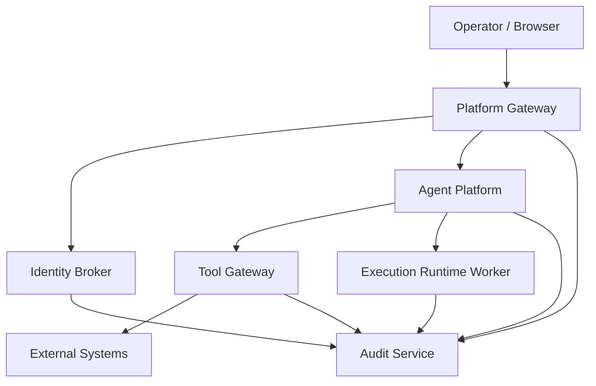
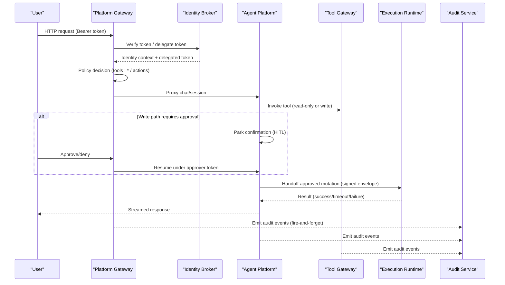
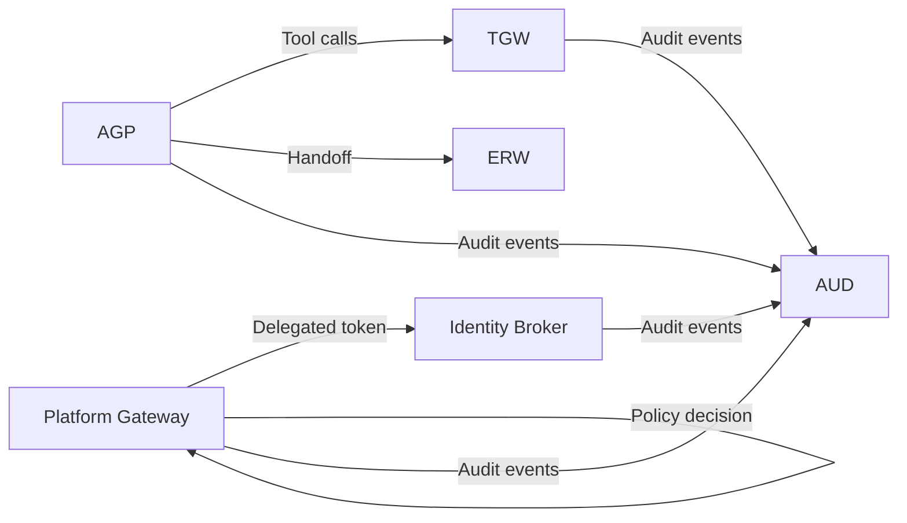

# Troubleshooting and FAQ

<cite>
**Referenced Files in This Document**
- [README.md](file://README.md)
- [troubleshooting.md](file://docs/guides/troubleshooting.md)
- [configuration-reference.md](file://docs/guides/configuration-reference.md)
- [SPEC-005-observability-baseline/spec.md](file://docs/specs/SPEC-005-observability-baseline/spec.md)
- [observability-conventions.md](file://shared/shared-contracts/observability-conventions.md)
- [deploy-overlay.sh](file://shared/platform-ops/gitops/deploy-overlay.sh)
- [sync-runtime-secret.sh](file://shared/platform-ops/gitops/sync-runtime-secret.sh)
- [sync-audit-secrets.sh](file://shared/platform-ops/gitops/sync-audit-secrets.sh)
- [sync-incident-secrets.sh](file://shared/platform-ops/gitops/sync-incident-secrets.sh)
- [gateway_service.py](file://products/platform-gateway/src/platform_gateway/services/gateway_service.py)
- [token_verifier.py (platform-gateway)](file://products/platform-gateway/src/platform_gateway/services/token_verifier.py)
- [token_verifier.py (tool-gateway)](file://products/tool-gateway/src/tool_gateway/services/token_verifier.py)
- [test_gateway_auth.py](file://products/platform-gateway/tests/test_gateway_auth.py)
- [runtime_kernel.py](file://products/agent-platform/src/agent_service/runtime_kernel.py)
- [session_store.py](file://products/agent-platform/src/agent_service/services/session_store.py)
- [executor.py](file://products/execution-runtime/src/execution_runtime/services/executor.py)
- [metrics.py (execution-runtime)](file://products/execution-runtime/src/execution_runtime/core/metrics.py)
- [observability.py (execution-runtime)](file://products/execution-runtime/src/execution_runtime/core/observability.py)
- [observability.py (audit-service)](file://products/audit-service/src/audit_service/core/observability.py)
- [observability.py (skills-hub)](file://products/skills-hub/src/skills_hub/core/observability.py)
- [observability.py (incident-service)](file://products/incident-service/src/incident_service/core/observability.py)
- [health-response.schema.json](file://shared/shared-contracts/schemas/health-response.schema.json)
- [chat-response.schema.json](file://shared/shared-contracts/schemas/chat-response.schema.json)
- [DocumentsView.tsx](file://products/operator-portal/web-ui/app/src/views/workspace/DocumentsView.tsx)
</cite>

## Table of Contents
1. Introduction
2. Project Structure
3. Core Components
4. Architecture Overview
5. Detailed Component Analysis
6. Dependency Analysis
7. Performance Considerations
8. Troubleshooting Guide
9. Conclusion
10. Appendices

## Introduction
This document provides a symptom-based troubleshooting guide for the Luban AIOPS platform, covering deployment failures, authentication problems, tool execution errors, performance issues, and data consistency problems. It includes diagnostic steps, log analysis techniques, remediation procedures, frequently asked questions, known limitations, upgrade considerations, and guidance for using observability tools such as metrics, traces, and audit logs across services.

## Project Structure
The platform is organized into product-oriented services with clear boundaries:
- Platform edge: platform-gateway (authentication, policy enforcement, chat/session proxying, token delegation)
- Agent runtime: agent-platform (sessions, streaming, HITL bridging, execution signing/handoff)
- Tool integration: tool-gateway (tool registry, connectors, redaction, tool audit)
- Identity: identity-broker (OIDC flows, JWT issuance, delegation)
- Execution isolation: execution-runtime (bounded worker handoff)
- Observability and evidence: audit-service (durable trail), Elastic connector (optional)
- Skills and incidents: skills-hub, incident-service
- Operator portal: operator-portal

**Diagram sources**
- [README.md:24-45](file://README.md#L24-L45)
- [configuration-reference.md:33-126](file://docs/guides/configuration-reference.md#L33-L126)

**Section sources**
- [README.md:15-45](file://README.md#L15-L45)

## Core Components
- Authentication and authorization:
  - Token verification at platform-gateway and tool-gateway via JWKS and audience checks.
  - Policy enforcement through mounted bundles; readiness reports degraded state when bundle is missing or invalid.
- Session and streaming:
  - Agent platform manages sessions, transcripts, and evidence stores with graceful degradation on backend failure.
- Tool execution:
  - Tool gateway exposes tools/connectors; mutating tools are deny-by-default and require explicit activation and approvals.
- Audit trail:
  - Fire-and-forget ingestion from multiple emitters to audit-service; counters expose delivery health.
- Observability:
  - Always-on /metrics per service; opt-in OTel push pipeline; structured logging bridge to OTLP.

**Section sources**
- [token_verifier.py (platform-gateway):52-80](file://products/platform-gateway/src/platform_gateway/services/token_verifier.py#L52-L80)
- [token_verifier.py (tool-gateway):52-80](file://products/tool-gateway/src/tool_gateway/services/token_verifier.py#L52-L80)
- [configuration-reference.md:282-327](file://docs/guides/configuration-reference.md#L282-L327)
- [session_store.py:949-969](file://products/agent-platform/src/agent_service/services/session_store.py#L949-L969)
- [configuration-reference.md:128-168](file://docs/guides/configuration-reference.md#L128-L168)
- [SPEC-005-observability-baseline/spec.md:12-35](file://docs/specs/SPEC-005-observability-baseline/spec.md#L12-L35)

## Architecture Overview
End-to-end request flow with authentication, policy, and optional execution approval:

**Diagram sources**
- [gateway_service.py:130-215](file://products/platform-gateway/src/platform_gateway/services/gateway_service.py#L130-L215)
- [runtime_kernel.py:1542-1557](file://products/agent-platform/src/agent_service/runtime_kernel.py#L1542-L1557)
- [configuration-reference.md:90-126](file://docs/guides/configuration-reference.md#L90-L126)

## Detailed Component Analysis

### Authentication and Authorization
Symptoms:
- Login fails or portal shows unauthorized
- Tool invocation returns 401/403
- “Stream never completes” due to expired delegated tokens

Diagnostics:
- Check identity broker OIDC configuration and reachability
- Validate token issuer/audience and JWKS endpoint
- Inspect delegation exchange metrics and logs
- Confirm policy bundle loaded and roles mapped correctly

Remediation:
- Reconcile Keycloak client redirect URIs if callback mismatches occur
- Re-provision delegation secrets and restart affected deployments
- Increase delegated token TTL only if necessary and investigate long-running operations
- Ensure policy bundle is valid and synced; restart gateways to pick up changes

Observability:
- Use /metrics to check delegation counters and token verification outcomes
- Correlate x-request-id across services; enable OTel push to join logs and traces

**Section sources**
- [troubleshooting.md:102-135](file://docs/guides/troubleshooting.md#L102-L135)
- [troubleshooting.md:292-311](file://docs/guides/troubleshooting.md#L292-L311)
- [configuration-reference.md:62-75](file://docs/guides/configuration-reference.md#L62-L75)
- [test_gateway_auth.py:34-67](file://products/platform-gateway/tests/test_gateway_auth.py#L34-L67)
- [token_verifier.py (platform-gateway):52-80](file://products/platform-gateway/src/platform_gateway/services/token_verifier.py#L52-L80)
- [token_verifier.py (tool-gateway):52-80](file://products/tool-gateway/src/tool_gateway/services/token_verifier.py#L52-L80)

### Tool Execution Errors
Symptoms:
- “No tools available” or empty tool list
- “ELASTIC_NOT_CONFIGURED”
- Mutating tool absent from discovery
- Mutating tool invoke returns 403 denied
- Confirming a parked mutating call returns 403
- Approved mutation fails with K8S_PERMISSION_DENIED

Diagnostics:
- Verify TOOL_GATEWAY_URL and tool-gateway readiness
- Check GATEWAY_K8S_ENABLED and RBAC for Kubernetes tools
- Confirm GATEWAY_ELASTIC_* settings for Elastic connector
- Validate GATEWAY_MUTATING_TOOLS_ENABLED and HITL bridging flags
- Inspect policy decisions and matrix endpoints for role/action grants
- Check browser connector flags and credential sets for web.* tools

Remediation:
- Set required URLs and credentials; redeploy affected services
- Apply opt-in RBAC manifests for mutating tools
- Enable HITL bridging by setting a positive timeout
- Re-run secret sync scripts to align clients and secrets
- For web tools, ensure CDP endpoint reachable and origins allowlisted

**Section sources**
- [troubleshooting.md:71-99](file://docs/guides/troubleshooting.md#L71-L99)
- [troubleshooting.md:211-231](file://docs/guides/troubleshooting.md#L211-L231)
- [troubleshooting.md:588-613](file://docs/guides/troubleshooting.md#L588-L613)
- [troubleshooting.md:614-644](file://docs/guides/troubleshooting.md#L614-L644)
- [troubleshooting.md:645-673](file://docs/guides/troubleshooting.md#L645-L673)
- [troubleshooting.md:698-718](file://docs/guides/troubleshooting.md#L698-L718)
- [configuration-reference.md:17-21](file://docs/guides/configuration-reference.md#L17-L21)
- [configuration-reference.md:452-494](file://docs/guides/configuration-reference.md#L452-L494)

### Performance Issues
Symptoms:
- Long-running streams stall or time out
- High error rates or slow responses
- Missing traces/metrics/logs in OpenObserve

Diagnostics:
- Check provider health and timeouts (CHAT_RESPONSE_TIMEOUT_SECONDS)
- Review /metrics for RED metrics and domain counters
- Validate OTEL_ENABLED and exporter endpoint/auth headers
- Inspect session store backends and fallbacks

Remediation:
- Adjust timeouts and provider rate limits
- Provision OTel headers and correct endpoint
- Ensure Postgres/Redis availability for session/state stores
- Monitor evidence store truncation markers and session budgets

**Section sources**
- [troubleshooting.md:138-168](file://docs/guides/troubleshooting.md#L138-L168)
- [troubleshooting.md:551-586](file://docs/guides/troubleshooting.md#L551-L586)
- [session_store.py:949-969](file://products/agent-platform/src/agent_service/services/session_store.py#L949-L969)
- [SPEC-005-observability-baseline/spec.md:27-35](file://docs/specs/SPEC-005-observability-baseline/spec.md#L27-L35)

### Data Consistency Problems
Symptoms:
- Session workspace shows no history (transcript_available: false)
- Session detail returns evidence_turns: null
- Session delete returns 409 (cannot delete)
- Audit view empty or recent events missing
- Audit ingest rejected with 401

Diagnostics:
- Inspect session API fields and agent-platform logs for transcript/evidence warnings
- Check audit emitter delivery counters and audit-service readiness
- Validate *_AUDIT_SERVICE_URL and *_AUDIT_CLIENT_SECRET alignment

Remediation:
- For transcripts: send a chat turn to populate snapshot; corrupt snapshots degrade gracefully
- For evidence: verify database connectivity; accept truncation markers as design
- Resolve pending HITL confirmations before deleting sessions
- Re-sync audit secrets and restart emitters and audit-service

**Section sources**
- [troubleshooting.md:720-783](file://docs/guides/troubleshooting.md#L720-L783)
- [troubleshooting.md:314-353](file://docs/guides/troubleshooting.md#L314-L353)
- [troubleshooting.md:356-382](file://docs/guides/troubleshooting.md#L356-L382)
- [runtime_kernel.py:1826-1857](file://products/agent-platform/src/agent_service/runtime_kernel.py#L1826-L1857)

### Deployment Failures
Symptoms:
- Pods fail with ErrImagePull after deployment
- Readiness shows “degraded” due to policy bundle load failure

Diagnostics:
- Inspect pod images and overlay state
- Check readiness endpoints for policy_error and bundle fingerprints

Remediation:
- Always deploy via make deploy to patch image tags
- Validate and re-sync policy bundle; restart gateways to reload

**Section sources**
- [troubleshooting.md:235-258](file://docs/guides/troubleshooting.md#L235-L258)
- [troubleshooting.md:261-289](file://docs/guides/troubleshooting.md#L261-L289)
- [deploy-overlay.sh:1-44](file://shared/platform-ops/gitops/deploy-overlay.sh#L1-L44)

### Environment-Specific Troubleshooting
- Dev vs production:
  - Dev overlays include browser-dev and mutating-dev postures; production disables mutating tools by default
  - Ensure workload identity and project-scoped secrets are provisioned
- External integrations:
  - Keycloak reachability and redirect URIs must match portal origins
  - Elastic connector requires URL and auth; output redaction can be toggled
  - Incident intake requires webhook token; misconfigurations return 503 or 401

**Section sources**
- [configuration-reference.md:682-724](file://docs/guides/configuration-reference.md#L682-L724)
- [troubleshooting.md:102-135](file://docs/guides/troubleshooting.md#L102-L135)
- [troubleshooting.md:450-484](file://docs/guides/troubleshooting.md#L450-L484)

## Dependency Analysis
Cross-service dependency chains that commonly cause failures:
- Token delegation chain: mismatched client IDs/secrets block tool invocation
- Identity verification chain: issuer/audience/JWKS mismatches cause 401
- Tool relay chain: unset URLs prevent tool registration and invocation
- Audit ingestion chain: misaligned secrets lead to 401 ingest rejections
- Skills retrieval chain: missing URL/credentials hides skills tools
- Incident intake/triage chain: webhook token or query clients misconfigured blocks intake and triage

**Diagram sources**
- [configuration-reference.md:33-126](file://docs/guides/configuration-reference.md#L33-L126)
- [configuration-reference.md:128-168](file://docs/guides/configuration-reference.md#L128-L168)

**Section sources**
- [configuration-reference.md:33-126](file://docs/guides/configuration-reference.md#L33-L126)
- [configuration-reference.md:128-168](file://docs/guides/configuration-reference.md#L128-L168)

## Performance Considerations
- Prefer read-only tools where possible; enabling mutating tools increases risk and requires approvals
- Tune timeouts for chat responses and worker handoffs to avoid stalls
- Use evidence store size caps and session budgets to bound memory usage
- Keep OTel push enabled for correlation; ensure collector endpoint is reachable
- Monitor RED metrics and domain counters to detect degradation early

[No sources needed since this section provides general guidance]

## Troubleshooting Guide

### Symptom Categories and Procedures

#### Deployment Failures
- ErrImagePull:
  - Diagnose: inspect pod images and overlay state
  - Remediate: run deploy-overlay script or use make deploy
- Policy bundle degraded:
  - Diagnose: check readiness endpoint for policy_error and bundle fingerprint
  - Remediate: validate and re-sync policy bundle; restart gateways

**Section sources**
- [troubleshooting.md:235-289](file://docs/guides/troubleshooting.md#L235-L289)
- [deploy-overlay.sh:1-44](file://shared/platform-ops/gitops/deploy-overlay.sh#L1-L44)

#### Authentication Problems
- Portal login fails:
  - Diagnose: OIDC config, Keycloak reachability, redirect URIs
  - Remediate: reconcile Keycloak client; restart identity-service
- Token verification errors:
  - Diagnose: issuer/audience/JWKS; test with local verification
  - Remediate: fix issuer/audience; refresh JWKS cache

**Section sources**
- [troubleshooting.md:102-135](file://docs/guides/troubleshooting.md#L102-L135)
- [test_gateway_auth.py:48-67](file://products/platform-gateway/tests/test_gateway_auth.py#L48-L67)
- [token_verifier.py (platform-gateway):52-80](file://products/platform-gateway/src/platform_gateway/services/token_verifier.py#L52-L80)

#### Tool Execution Errors
- No tools available:
  - Diagnose: TOOL_GATEWAY_URL, tool-gateway readiness, K8s connector
  - Remediate: set URL; apply RBAC; restart tool-gateway
- ELASTIC_NOT_CONFIGURED:
  - Diagnose: GATEWAY_ELASTIC_* variables
  - Remediate: enable and configure Elastic connector
- Mutating tool absent or denied:
  - Diagnose: GATEWAY_MUTATING_TOOLS_ENABLED, policy grants, HITL bridging
  - Remediate: enable flag; apply RBAC; grant tools:mutate; enable HITL
- Confirmed mutation fails with K8S_PERMISSION_DENIED:
  - Diagnose: service account permissions
  - Remediate: apply pod-delete Role/RoleBinding

**Section sources**
- [troubleshooting.md:71-99](file://docs/guides/troubleshooting.md#L71-L99)
- [troubleshooting.md:211-231](file://docs/guides/troubleshooting.md#L211-L231)
- [troubleshooting.md:588-718](file://docs/guides/troubleshooting.md#L588-L718)
- [configuration-reference.md:17-21](file://docs/guides/configuration-reference.md#L17-L21)

#### Performance Issues
- Stream stalls or timeouts:
  - Diagnose: provider health, CHAT_RESPONSE_TIMEOUT_SECONDS
  - Remediate: adjust timeouts; check provider rate limits
- Missing telemetry:
  - Diagnose: OTEL_ENABLED, endpoint, headers
  - Remediate: provision OTel headers; redeploy

**Section sources**
- [troubleshooting.md:138-168](file://docs/guides/troubleshooting.md#L138-L168)
- [troubleshooting.md:551-586](file://docs/guides/troubleshooting.md#L551-L586)
- [SPEC-005-observability-baseline/spec.md:27-35](file://docs/specs/SPEC-005-observability-baseline/spec.md#L27-L35)

#### Data Consistency Problems
- Transcript unavailable:
  - Diagnose: session snapshot state; agent-platform logs
  - Remediate: send a chat turn; accept degraded transcript behavior
- Evidence turns null:
  - Diagnose: evidence store backend; metrics for write failures
  - Remediate: restore DB; accept truncation markers
- Session delete 409:
  - Diagnose: pending HITL confirmation
  - Remediate: resolve confirmation before deletion
- Audit view empty or 401 ingest:
  - Diagnose: emitter URLs and secrets; audit-service readiness
  - Remediate: re-sync audit secrets; restart emitters and audit-service

**Section sources**
- [troubleshooting.md:720-783](file://docs/guides/troubleshooting.md#L720-L783)
- [troubleshooting.md:314-382](file://docs/guides/troubleshooting.md#L314-L382)
- [runtime_kernel.py:1826-1857](file://products/agent-platform/src/agent_service/runtime_kernel.py#L1826-L1857)

### Frequently Asked Questions
- Why do I see “denied by policy” for a tool?
  - The user’s role lacks the required action; verify OIDC groups and policy bundle grants.
- How do I enable mutating tools safely?
  - Enable GATEWAY_MUTATING_TOOLS_ENABLED, apply RBAC, enable HITL bridging, and grant tools:mutate.
- What happens if audit-service is down?
  - Ingestion degrades to log-only auditing; user requests succeed but events are not stored.
- Can I disable OTel push without affecting /metrics?
  - Yes; /metrics remains always-on; OTel push is gated by OTEL_ENABLED and fails open.
- How do I rotate secrets safely?
  - Use provided sync scripts to regenerate and propagate secrets; restart affected deployments.

**Section sources**
- [configuration-reference.md:17-21](file://docs/guides/configuration-reference.md#L17-L21)
- [configuration-reference.md:128-168](file://docs/guides/configuration-reference.md#L128-L168)
- [SPEC-005-observability-baseline/spec.md:27-35](file://docs/specs/SPEC-005-observability-baseline/spec.md#L27-L35)

### Known Limitations and Workarounds
- Shared query credential for audit-service allows ingest clients to query directly; plan to split registries for non-dev deployments.
- Mutating tools are deny-by-default; enabling them requires full activation checklist including RBAC and HITL.
- Evidence persistence is best-effort; failures do not fail turns but reduce replay fidelity.

**Section sources**
- [configuration-reference.md:159-168](file://docs/guides/configuration-reference.md#L159-L168)
- [troubleshooting.md:588-613](file://docs/guides/troubleshooting.md#L588-L613)
- [troubleshooting.md:750-783](file://docs/guides/troubleshooting.md#L750-L783)

### Upgrade Considerations
- Policy bundle rollout requires editing canonical source, validating scenarios, syncing replicas, and restarting gateways to reload bundles.
- Image tag management relies on deploy-overlay; avoid raw kubectl apply -k to prevent placeholder tags.
- Secret provisioning scripts centralize rotation; prefer scripts over manual edits.

**Section sources**
- [configuration-reference.md:282-327](file://docs/guides/configuration-reference.md#L282-L327)
- [troubleshooting.md:235-258](file://docs/guides/troubleshooting.md#L235-L258)
- [sync-runtime-secret.sh:1-28](file://shared/platform-ops/gitops/sync-runtime-secret.sh#L1-L28)
- [sync-audit-secrets.sh:71-92](file://shared/platform-ops/gitops/sync-audit-secrets.sh#L71-L92)
- [sync-incident-secrets.sh:71-92](file://shared/platform-ops/gitops/sync-incident-secrets.sh#L71-L92)

### Using Observability Tools
- Metrics:
  - Every service exposes /metrics; use it to inspect RED metrics and domain counters (e.g., delegation, audit emits).
- Traces:
  - Enable OTel push; correlate logs via x-request-id and trace_id; ensure headers and endpoint are configured.
- Audit logs:
  - Check emitter delivery counters; validate audit-service readiness; review retention and max event caps.

**Section sources**
- [SPEC-005-observability-baseline/spec.md:12-35](file://docs/specs/SPEC-005-observability-baseline/spec.md#L12-L35)
- [observability-conventions.md:58-69](file://shared/shared-contracts/observability-conventions.md#L58-L69)
- [metrics.py (execution-runtime):93-111](file://products/execution-runtime/src/execution_runtime/core/metrics.py#L93-L111)
- [observability.py (execution-runtime):9-24](file://products/execution-runtime/src/execution_runtime/core/observability.py#L9-L24)
- [observability.py (audit-service):9-23](file://products/audit-service/src/audit_service/core/observability.py#L9-L23)
- [observability.py (skills-hub):9-23](file://products/skills-hub/src/skills_hub/core/observability.py#L9-L23)
- [observability.py (incident-service):9-23](file://products/incident-service/src/incident_service/core/observability.py#L9-L23)

## Conclusion
Use this guide to systematically diagnose and resolve common issues across deployment, authentication, tool execution, performance, and data consistency. Leverage the platform’s built-in observability surfaces (/metrics, OTel, audit trail) and follow the documented secret provisioning and policy rollout procedures to maintain reliability and security. When in doubt, start with readiness endpoints, metrics, and structured logs to narrow the problem scope before making configuration changes.

[No sources needed since this section summarizes without analyzing specific files]

## Appendices

### Health and Response Schemas
- Health response schema defines status values and service metadata used by readiness endpoints.
- Chat response schema defines status values for streaming responses.

**Section sources**
- [health-response.schema.json:1-20](file://shared/shared-contracts/schemas/health-response.schema.json#L1-L20)
- [chat-response.schema.json:1-25](file://shared/shared-contracts/schemas/chat-response.schema.json#L1-L25)

### Error Mapping and Receipts
- Execution results map to receipt statuses: success → succeeded, TIMEOUT → timeout, other errors → failed.
- Rejection reasons are recorded with digest mismatch detection for signed envelopes.

**Section sources**
- [executor.py:124-151](file://products/execution-runtime/src/execution_runtime/services/executor.py#L124-L151)
- [runtime_kernel.py:1826-1857](file://products/agent-platform/src/agent_service/runtime_kernel.py#L1826-L1857)

### Portal Error Messaging
- Portal maps API errors to user-friendly messages for incident report creation and related operations.

**Section sources**
- [DocumentsView.tsx:70-102](file://products/operator-portal/web-ui/app/src/views/workspace/DocumentsView.tsx#L70-L102)