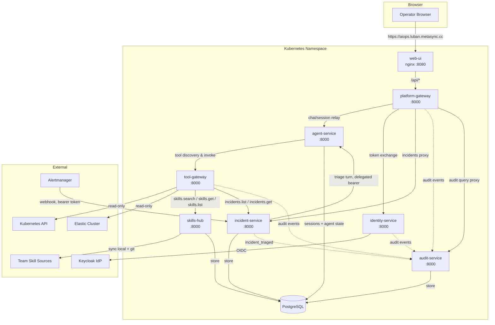
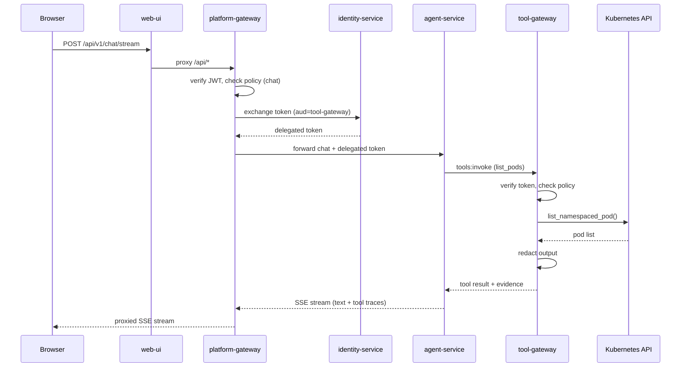

# Architecture Overview

A high-level view of the platform's service topology, request flow, trust chain, and
authorization model for operators who need to understand how the pieces connect.

## Service Topology

The platform consists of ten workloads deployed to a single Kubernetes namespace
(`dev-luban-aiops` by default):

| Service | Image | Role |
|---|---|---|
| **web-ui** | `luban-aiops/web-ui` | Static portal shell served by nginx; proxies `/api/` to platform-gateway |
| **platform-gateway** | `luban-aiops/platform-gateway` | Portal-facing edge: JWT verification, action policy, chat/session proxying, token delegation, audit query proxy |
| **agent-service** | `luban-aiops/agent-service` | AgentScope runtime kernel: LLM orchestration, session management, tool trace emission |
| **tool-gateway** | `luban-aiops/tool-gateway` | Tool execution framework: connector dispatch, policy enforcement, output redaction |
| **identity-service** | `luban-aiops/identity-service` | Enterprise identity: Keycloak OIDC login, JWT issuance, token exchange for delegation |
| **audit-service** | `luban-aiops/audit-service` | Durable audit trail: authenticated ingest, retention-bounded store, query API (SPEC-013) |
| **skills-hub** | `luban-aiops/skills-hub` | Federated skill ingestion and ranked retrieval for grounded guidance (SPEC-014) |
| **incident-service** | `luban-aiops/incident-service` | Alert/manual incident intake, fingerprint dedupe, agent triage orchestration, connector dispatch (SPEC-015) |
| **redis** | `redis:7.2-alpine` | AgentScope kernel coordination (non-durable in dev) |
| **postgres** | `postgres:16-alpine` | Durable audit, skills, incidents, session store, and agent state backend (PVC-backed, dev-only credentials) |

All backend services are Python 3.12 FastAPI applications built on a shared
`luban-aiops/base-uv` container image (Amazon Linux 2023, non-root uid 1000).



## Request Flow

A typical chat request traverses all services in a linear chain:

```
Browser → web-ui → platform-gateway → agent-service → tool-gateway → connector → external system
```

### Step-by-Step

1. **Browser** sends a chat request to `web-ui` (via the Envoy Gateway hostnames
   `aiops.luban.k8s.orb.local` / `aiops.luban.metasync.cc`, or port-forwarded to
   `localhost:18080`).
2. **web-ui** (nginx) serves static assets and proxies `/api/` to **platform-gateway**.
3. **platform-gateway** verifies the portal JWT, evaluates action policy (`chat`), exchanges the
   user's token for a short-lived delegated token (audience = `tool-gateway`), and forwards the
   request to **agent-service**.
4. **agent-service** runs the AgentScope runtime kernel: the LLM decides whether to answer
   directly or invoke tools. If tools are needed, it calls **tool-gateway** with the delegated
   token.
5. **tool-gateway** verifies the delegated token, evaluates tool policy (`tools:list`,
   `tools:invoke`), dispatches to the appropriate connector (Kubernetes, Elastic, or
   skills-hub), redacts credential-shaped output, and returns the result with evidence
   metadata. For procedure or remediation questions the agent consults the read-only
   `skills.search` / `skills.get` / `skills.list` tools for team-owned guidance and
   cites the skills it relies on (SPEC-014); skill guidance is kept separate from
   live cluster evidence.
6. **agent-service** merges tool results into the LLM response and streams text deltas plus
   tool-trace events back through the SSE channel.
7. **platform-gateway** proxies the stream to the browser, where the portal renders the reply
   and the evidence panel.



### Incident Triage Flow (SPEC-015)

Incidents follow a separate, operator-driven loop:

```
Alertmanager → webhook ─┐
                        ├─► incident-service (normalize, dedupe, store)
portal Report form → PG ─┘
operator Run triage → PG → incident-service → agent-service (session incident-<id>)
                          ← validated triage report
incident-service → connectors → audit-service (incident_triaged on the durable trail)
```

1. Alertmanager posts alert groups to `POST /api/v1/webhooks/alertmanager`
   (shared bearer token; fail-closed when unconfigured); operators can also
   report incidents through the portal. Both paths normalize into one
   canonical incident model with fingerprint-based dedupe and resolution.
2. Triage is operator-initiated: platform-gateway checks the
   `incident:triage` action and relays the operator's delegated bearer to
   incident-service, which runs one agent turn in the `incident-<id>`
   session. The agent gathers evidence with the read-only tools
   (`k8s.*`, `elastic.*`, `skills.*`, `incidents.*`) and ends with a fenced
   `triage-report` JSON block that is schema-validated before storage.
3. Validated reports dispatch through the connector framework; the built-in
   `audit` connector puts an `incident_triaged` event on the durable trail.
   Ranked next steps are advisory — there is no execution surface in R3.

## Trust Chain

The platform implements a progressive trust model: **identity → policy → audit**.

### Identity Flow

```
Keycloak OIDC login → identity-service issues platform JWT → gateway verifies locally via JWKS
```

1. The operator logs in through the portal, which redirects to **Keycloak** for OIDC
   authentication.
2. On callback, **identity-service** exchanges the Keycloak authorization code and issues a
   **platform JWT** signed with RS256. The JWT contains `sub`, `username`, `email`, `roles`,
   `groups`, and `aud` claims.
3. The portal stores the JWT and sends it as `Authorization: Bearer <token>` on every request.
4. **platform-gateway** and **tool-gateway** verify the JWT locally using the JWKS public-key
   endpoint (`/.well-known/jwks.json`) — no per-request network calls to the identity service.

### Token Delegation

For tool invocation, platform-gateway needs to present a token that tool-gateway will accept.
Rather than forwarding the user's portal token, it uses a **broker-mediated exchange**:

```
User JWT (aud=platform-gateway) → identity-service /api/v1/auth/token → Delegated Token (aud=tool-gateway)
```

- The exchange requires a **service credential** (client ID + secret shared between
  platform-gateway and identity-service).
- The delegated token has a shorter TTL (default 300 s) than the user's portal token.
- platform-gateway caches delegated tokens per-user with a TTL, re-exchanging only when the
  incoming user token changes.
- If the exchange fails, chat proceeds without tools (graceful degradation).

### Workload Identity (Production Upgrade)

In non-dev deployments, the static service credential is replaced by **projected service-account
tokens** (SPEC-009):

- platform-gateway reads a projected token from a mounted volume
  (`PLATFORM_GATEWAY_WORKLOAD_TOKEN_PATH`).
- identity-service validates the projected token via the cluster's OIDC issuer and maps the
  service-account subject to a registered client.
- If the projected token file is missing, platform-gateway falls back to the static secret with
  a once-per-process warning.

## RBAC Model

### Roles

Roles are mapped from OIDC groups by the identity-service:

| OIDC Group | Platform Role | Description |
|---|---|---|
| `ops-admins` | `platform-admin` | Full platform access |
| `ops-approvers` | `approver` | Approval workflow participant |
| `ops-operators` | `operator` | Day-to-day operations |
| `ops-developers` | `developer` | Development and testing |
| `ops-observers` | `read-only-observer` | Read-only query access |
| `ops-auditors` | `auditor` | Audit trail review |
| *(unmapped)* | `read-only-observer` | Default when no group matches |

### Protected Actions

The policy engine enforces deny-by-default authorization on named actions:

| Action | Protected By | Description |
|---|---|---|
| `chat` | platform-gateway | Send a chat prompt to the agent |
| `session:create` | platform-gateway | Create a new conversation session |
| `session:read` | platform-gateway | Read session history |
| `audit:read` | platform-gateway | Query the durable audit trail |
| `incident:read` | platform-gateway | View incidents and triage reports |
| `incident:create` | platform-gateway | Report a manual incident |
| `incident:triage` | platform-gateway | Initiate agent triage of an incident |
| `tools:list` | tool-gateway | Discover available tools |
| `tools:invoke` | tool-gateway | Execute a tool |

Health, metrics, auth, and identity routes are explicitly exempt (platform plumbing, no
business action).

### Default Policy Bundle

The platform ships with eight allow rules at priority 100. Everything else is denied:

| Rule | Roles | Actions |
|---|---|---|
| `allow-operators-chat` | admin, approver, operator, developer | `chat`, `session:create`, `session:read` |
| `allow-observer-read-and-chat` | read-only-observer | `chat`, `session:create`, `session:read` |
| `allow-operators-tools` | admin, operator, developer, read-only-observer | `tools:invoke` |
| `allow-operators-tools-list` | admin, operator, developer, read-only-observer | `tools:list` |
| `allow-auditors-audit-read` | auditor, platform-admin | `audit:read` |
| `allow-operators-incident-read` | admin, approver, operator, developer, read-only-observer | `incident:read` |
| `allow-operators-incident-create` | admin, approver, operator, developer | `incident:create` |
| `allow-operators-incident-triage` | admin, approver, operator, developer | `incident:triage` |

> **Note:** The `read-only-observer` tool grants assume all registered tools are read-only
> (tier-0 reads). Before any mutating tool is registered, these rules must be re-scoped.

> **Note:** `audit:read` exposes cross-user activity and is therefore restricted to the
> governance roles per the authorization matrix: `auditor` (from `ops-auditors`) and
> `platform-admin` (from `ops-admins`).

### Policy Configuration

The policy bundle is a YAML file managed through Git:

1. **Canonical source**: `shared/shared-contracts/policies/policy-default.yaml`
2. **Distribution**: copied to each gateway's packaged fallback and the dev-k8s ConfigMap source
   via `make sync-policy`
3. **Deployment**: mounted as a ConfigMap at `/etc/luban/policy/policy.yaml` in both gateways
4. **Validation**: `make validate-policy` checks the bundle against the JSON schema

Changing policy requires editing the canonical file, syncing, and redeploying. There is no
hot-reload or UI for policy management.

## Observability

Every service exposes:

- **`/health/live`** — liveness probe (returns service name and version)
- **`/health/ready`** — readiness probe (checks policy bundle load; platform-gateway also
  checks agent-service health)
- **`/metrics`** — Prometheus metrics endpoint (always on, independent of OTel)

Structured JSON logging is emitted at INFO level with `x-request-id` correlation headers.
OpenTelemetry push is opt-in via `OTEL_ENABLED=true` and an OTLP endpoint.

See the [Configuration Reference](configuration-reference.md) for the full observability
configuration.
